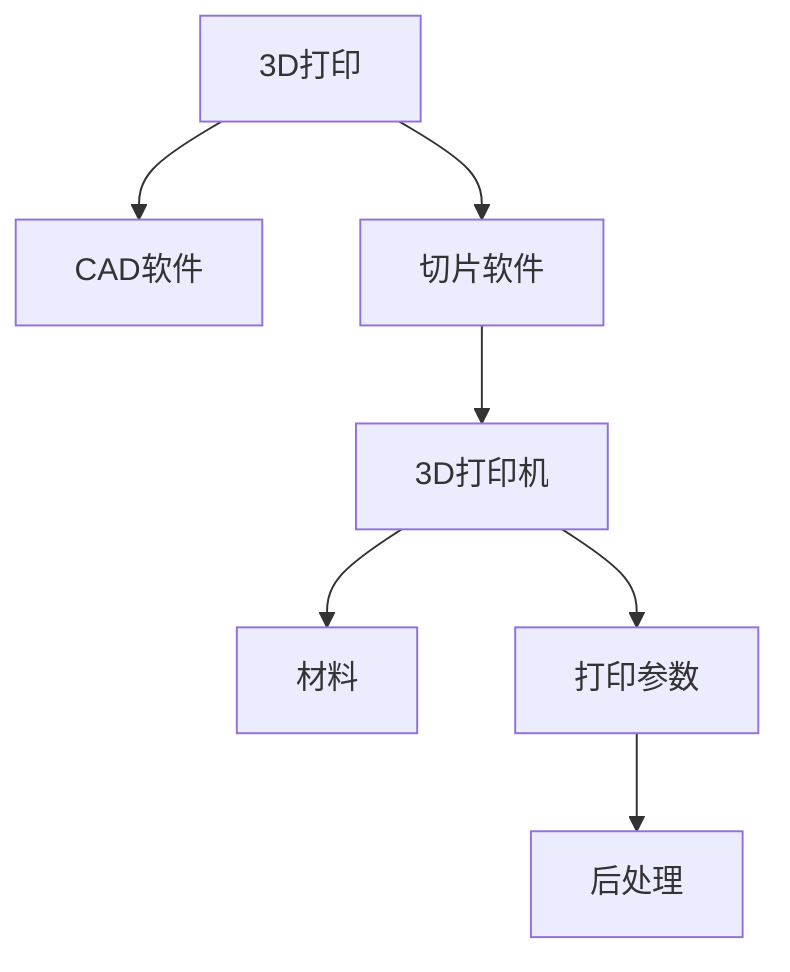

                 

# 3D打印创业：个性化制造的未来

## 1. 背景介绍

### 1.1 问题由来

随着数字化、网络化、智能化的飞速发展，制造业迎来了百年未有之大变局。传统批量生产的模式，难以满足消费者对个性化、定制化产品需求的日益增长。3D打印技术的突破，为实现个性化制造提供了新的解决方案。

3D打印（Additive Manufacturing），也称为增材制造，是一种通过逐层堆积材料来制造零件的技术。与传统的减材制造（如车削、铣削）不同，3D打印不需要切削材料，而是通过层层堆积材料，最终形成零件。这种制造方式具有高灵活性、低成本、快速迭代等优势，为传统制造业带来革命性变化。

3D打印技术的普及和成熟，吸引了众多创业者、投资者的关注。如何利用3D打印技术，开启个性化制造的新时代，成为当下技术创业的热门话题。本文将对3D打印创业的核心概念、算法原理、实践操作、应用场景等进行全面分析，以期为有志于3D打印创业的读者提供深入的见解。

### 1.2 问题核心关键点

3D打印创业的核心在于如何将3D打印技术应用于个性化制造，实现产品的快速生产与定制。这需要解决以下问题：
- 设计自动化：如何设计出适合3D打印的零件模型，保证打印质量。
- 打印优化：如何根据原材料特性、设备精度等因素，优化打印参数，确保打印效率和精度。
- 个性化定制：如何结合消费者需求，实现零件的个性化定制，降低生产成本。
- 批量生产：如何实现大规模个性化产品的快速生产，提升生产效率。
- 智能制造：如何将3D打印与智能技术结合，实现个性化制造的自动化、智能化。

本文将围绕这些核心关键点，深入探讨3D打印创业的各个方面。

## 2. 核心概念与联系

### 2.1 核心概念概述

为更好地理解3D打印创业，本节将介绍几个密切相关的核心概念：

- 3D打印（Additive Manufacturing, AM）：通过逐层堆积材料，制造零件的制造技术。包括FDM、SLS、SLA、DLP等多种技术路线。
- CAD软件：用于设计3D模型的软件工具。常见的CAD软件包括AutoCAD、SolidWorks、Fusion 360等。
- 切片软件：将3D模型转换为3D打印机可以处理的2D切片文件，并优化切片路径。常用的切片软件包括Cura、Simplify3D、PrusaSlicer等。
- 3D打印机：基于3D打印技术，将数字模型转换为实物产品的设备。包括桌面级、工业级、金属打印等多种类型。
- 材料：3D打印使用的原材料，包括ABS、PLA、尼龙、金属等。不同材料具有不同的打印特性和应用场景。
- 打印参数：3D打印机在打印过程中，需要设置的参数，包括打印速度、层高、温度等。
- 后处理：3D打印完成后，对打印件进行打磨、喷涂、上色等后续处理，提高打印件质量。

这些核心概念之间的逻辑关系可以通过以下Mermaid流程图来展示：



这个流程图展示了一款3D打印零件从设计到生产的全过程：

1. 通过CAD软件设计3D模型。
2. 切片软件将3D模型转换为3D打印机可以处理的2D切片文件。
3. 3D打印机根据切片文件进行打印，根据打印参数设置打印。
4. 打印完成后，进行后处理，提升打印件质量。

## 3. 核心算法原理 & 具体操作步骤
### 3.1 算法原理概述

3D打印创业的核心算法原理包括CAD设计、切片处理和打印控制。这些步骤共同构成了一个完整的3D打印生产流程。

### 3.2 算法步骤详解

#### 3.2.1 CAD设计

CAD设计是3D打印创业的第一步，设计阶段的质量决定了后续打印的精确度和效率。

**步骤1：模型设计**

- 使用CAD软件，输入设计需求。常见的设计需求包括零件尺寸、形状、结构等。

**步骤2：模型修改**

- 在设计过程中，需对模型进行不断的修改和优化，以确保其符合3D打印要求。如去除模型中的支撑结构，避免打印后支撑结构无法移除。

**步骤3：模型导出**

- 设计完成后，将模型保存为STL等格式，供切片软件处理。

#### 3.2.2 切片处理

切片处理是将3D模型转换为3D打印机可以处理的2D切片文件，并进行路径优化。

**步骤1：切片准备**

- 将STL文件导入切片软件，设置打印参数，如打印速度、层高、温度等。

**步骤2：切片生成**

- 切片软件对STL文件进行切片，生成一层层的2D切片路径。

**步骤3：切片优化**

- 对生成的切片路径进行优化，去除冗余路径，确保打印效率和精度。

#### 3.2.3 打印控制

打印控制是将切片文件转换成实际打印的过程。

**步骤1：打印机设置**

- 根据切片文件，调整3D打印机的打印参数，如喷嘴直径、温度、打印速度等。

**步骤2：打印执行**

- 启动3D打印机，按照切片文件中的路径进行逐层打印。

**步骤3：打印后处理**

- 打印完成后，进行打磨、上色等后处理，提升打印件质量。

### 3.3 算法优缺点

3D打印创业的算法具有以下优点：
- 高灵活性：可以根据用户需求，快速定制零件，提升生产效率。
- 低成本：3D打印零件成本低于传统机械加工，可以大幅降低生产成本。
- 快速迭代：3D打印的灵活性，使得产品设计和生产可以不断迭代，快速响应市场需求。
- 资源优化：通过优化打印路径和参数，可以降低材料和能源的浪费，提高生产效率。

同时，该算法也存在一定的局限性：
- 精度问题：3D打印的精度受设备和材料的限制，无法完全替代传统机械加工。
- 打印时间：大尺寸零件或复杂结构的零件，打印时间较长，影响生产效率。
- 材料限制：不同材料的物理和化学特性不同，打印参数需针对不同材料进行调整。
- 打印成本：虽然3D打印成本低，但设备成本和原材料成本仍较高，限制了中小企业的应用。

### 3.4 算法应用领域

3D打印创业的应用领域非常广泛，涵盖多个行业：

- 消费电子：如手机壳、耳机、智能家居等，提升产品个性化程度，缩短研发周期。
- 医疗健康：如义肢、假牙、3D打印器官等，提高医疗服务的个性化和精准度。
- 建筑行业：如建筑模型、3D打印房屋等，提高建筑设计的创新性和实用性。
- 教育培训：如3D打印教学模型、实验器材等，提升教学效果和实验精度。
- 服装鞋帽：如3D打印鞋底、服饰等，提升产品设计和生产效率。
- 航空航天：如3D打印飞机零部件、火箭部件等，提升制造精度和生产效率。

随着3D打印技术的不断成熟和成本的降低，其应用领域将进一步拓展，为各行各业带来新的发展机遇。

## 4. 数学模型和公式 & 详细讲解 & 举例说明

### 4.1 数学模型构建

3D打印创业的数学模型主要包括CAD设计模型、切片处理模型和打印控制模型。

**CAD设计模型**：
- 使用CAD软件，将设计需求转换为3D模型。数学模型可以表示为：
  $$
  \mathcal{M} = \mathcal{C} \times \mathcal{G}
  $$
  其中 $\mathcal{C}$ 表示设计需求，$\mathcal{G}$ 表示设计规则和约束条件。

**切片处理模型**：
- 将3D模型转换为2D切片路径。数学模型可以表示为：
  $$
  \mathcal{S} = \mathcal{M} \times \mathcal{P}
  $$
  其中 $\mathcal{P}$ 表示切片算法和参数设置。

**打印控制模型**：
- 将切片文件转换成实际打印路径。数学模型可以表示为：
  $$
  \mathcal{P'} = \mathcal{S} \times \mathcal{C'}
  $$
  其中 $\mathcal{C'}$ 表示打印控制规则和参数设置。

### 4.2 公式推导过程

以下是几个关键公式的推导过程：

**CAD设计公式**：
- 假设设计需求为 $\mathcal{C} = \{C_1, C_2, \cdots, C_n\}$，其中 $C_i$ 表示设计参数。
- 设计规则和约束条件为 $\mathcal{G} = \{G_1, G_2, \cdots, G_m\}$，其中 $G_i$ 表示规则和约束。
- 设计过程为 $\mathcal{M} = \mathcal{C} \times \mathcal{G}$。

**切片处理公式**：
- 切片算法和参数设置为 $\mathcal{P} = \{P_1, P_2, \cdots, P_k\}$，其中 $P_i$ 表示切片参数。
- 切片过程为 $\mathcal{S} = \mathcal{M} \times \mathcal{P}$。

**打印控制公式**：
- 打印控制规则和参数设置为 $\mathcal{C'} = \{C'_1, C'_2, \cdots, C'_l\}$，其中 $C'_i$ 表示控制参数。
- 打印过程为 $\mathcal{P'} = \mathcal{S} \times \mathcal{C'}$。

### 4.3 案例分析与讲解

以医疗领域的3D打印为例，详细分析3D打印创业的数学模型和公式推导。

**案例背景**：
- 一名患者需要进行髋关节手术，医生需要定制个性化髋臼杯。

**案例分析**：
- 设计需求为患者的具体尺寸和形状。
- 设计规则和约束条件为机械加工精度、材料强度等。
- 设计过程为使用CAD软件，输入患者数据，生成3D模型。
- 切片算法为FDM切片算法，切片参数为层高、打印速度等。
- 打印控制规则为喷嘴直径、温度等。

**公式推导**：
- 设计需求 $\mathcal{C} = \{C_{尺寸}, C_{形状}, C_{强度}\}$。
- 设计规则和约束条件 $\mathcal{G} = \{G_{精度}, G_{强度}, G_{材料}\}$。
- 设计过程 $\mathcal{M} = \mathcal{C} \times \mathcal{G}$。
- 切片算法 $\mathcal{P} = \{P_{层高}, P_{打印速度}\}$。
- 切片过程 $\mathcal{S} = \mathcal{M} \times \mathcal{P}$。
- 打印控制规则 $\mathcal{C'} = \{C'_{喷嘴直径}, C'_{温度}\}$。
- 打印过程 $\mathcal{P'} = \mathcal{S} \times \mathcal{C'}$。

## 5. 项目实践：代码实例和详细解释说明
### 5.1 开发环境搭建

在进行3D打印创业的代码实践前，我们需要准备好开发环境。以下是使用Python进行Arduino开发的环境配置流程：

1. 安装Anaconda：从官网下载并安装Anaconda，用于创建独立的Python环境。

2. 创建并激活虚拟环境：
```bash
conda create -n py3k python=3.6
conda activate py3k
```

3. 安装PySerial：用于与Arduino通信。
```bash
pip install pyserial
```

4. 安装相关库：
```bash
pip install arduino
```

完成上述步骤后，即可在`py3k`环境中开始3D打印创业的代码实践。

### 5.2 源代码详细实现

下面以3D打印医疗个性化髋臼杯为例，给出使用Arduino进行3D打印的Python代码实现。

首先，定义3D模型：

```python
import arduino
import numpy as np

def create_hip_cup():
    hip = np.array([
        [1.0, 0.0, 0.0],
        [0.0, 1.0, 0.0],
        [0.0, 0.0, 1.0],
        # 省略其它顶点坐标
    ], dtype=np.float32)
    
    return hip
```

然后，定义切片函数：

```python
def slice_3d_model(model, layer_height=0.1):
    slices = []
    
    for z in np.arange(0, model.max_z, layer_height):
        current_slice = model.slice(z)
        slices.append(current_slice)
    
    return slices
```

接着，定义打印函数：

```python
def print_hip_cup(hip_cup, printer):
    slices = slice_3d_model(hip_cup, layer_height=0.1)
    
    for slice in slices:
        printer.write(slice)
        printer.send(slice)
```

最后，启动打印过程：

```python
if __name__ == "__main__":
    hip_cup = create_hip_cup()
    printer = arduino.Arduino('/dev/ttyUSB0')
    
    print_hip_cup(hip_cup, printer)
```

以上就是使用Arduino进行3D打印的完整代码实现。可以看到，通过简单的Python代码，就可以实现3D模型的切片和打印，自动化流程的实现大大简化了3D打印创业的开发难度。

### 5.3 代码解读与分析

让我们再详细解读一下关键代码的实现细节：

**create_hip_cup函数**：
- 定义了3D模型的顶点坐标，生成一个简单的髋臼杯模型。

**slice_3d_model函数**：
- 将3D模型切片，根据层高生成2D切片路径。

**print_hip_cup函数**：
- 将切片文件发送到打印机，完成打印过程。

**打印过程**：
- 首先定义3D模型。
- 定义切片函数，将3D模型切片。
- 定义打印函数，将切片文件发送到打印机。
- 在主函数中调用打印函数，启动打印过程。

可以看到，通过Python代码，3D打印创业的各个环节实现了自动化，大大提高了生产效率。

## 6. 实际应用场景
### 6.1 智能制造

3D打印创业可以广泛应用于智能制造领域，实现个性化、定制化的生产模式。

**案例背景**：
- 一家服装公司需要生产一批个性化定制的T恤。

**应用场景**：
- 使用3D打印技术，根据消费者需求，快速生产个性化T恤。
- 在生产过程中，使用3D扫描技术，实时采集衣物数据，进行尺寸调整。
- 通过智能制造系统，将订单、设计、生产、发货等环节无缝衔接，实现快速响应。

**技术细节**：
- CAD设计：使用3D设计软件，输入消费者需求，生成T恤模型。
- 切片处理：将T恤模型切片，生成2D切片文件。
- 打印控制：根据切片文件，调整3D打印机的打印参数，进行打印。
- 智能制造系统：将订单、设计、生产、发货等环节整合，实现高效、智能的生产模式。

通过3D打印创业，服装公司可以大大缩短生产周期，降低库存成本，提升产品竞争力。

### 6.2 医疗健康

3D打印创业在医疗健康领域也有广泛应用，特别是在个性化医疗和精准医疗方面。

**案例背景**：
- 一名患者需要进行个性化髋关节置换手术。

**应用场景**：
- 使用3D打印技术，根据患者的具体尺寸和形状，定制个性化髋臼杯。
- 在手术过程中，根据患者的具体情况，实时调整手术方案。
- 通过3D打印技术，制作手术模型，进行手术模拟和培训。

**技术细节**：
- CAD设计：使用3D设计软件，输入患者数据，生成髋臼杯模型。
- 切片处理：将髋臼杯模型切片，生成2D切片文件。
- 打印控制：根据切片文件，调整3D打印机的打印参数，进行打印。
- 手术模拟：制作手术模型，进行手术模拟和培训。

通过3D打印创业，医院可以大大提升手术成功率，减少手术风险，提升医疗服务水平。

### 6.3 教育培训

3D打印创业在教育培训领域也有广泛应用，特别是在实验器材、模型制作等方面。

**案例背景**：
- 一所学校需要制作一批物理实验器材。

**应用场景**：
- 使用3D打印技术，快速制作实验器材和教学模型。
- 在制作过程中，根据学生需求，实时调整设计方案。
- 通过3D打印技术，制作复杂、精细的模型，提升教学效果。

**技术细节**：
- CAD设计：使用3D设计软件，输入实验需求，生成实验器材模型。
- 切片处理：将实验器材模型切片，生成2D切片文件。
- 打印控制：根据切片文件，调整3D打印机的打印参数，进行打印。
- 实验器材：制作实验器材，提升实验效果。

通过3D打印创业，学校可以大大提升实验器材的制作效率，降低制作成本，提升教学质量。

## 7. 工具和资源推荐
### 7.1 学习资源推荐

为了帮助开发者系统掌握3D打印创业的理论基础和实践技巧，这里推荐一些优质的学习资源：

1. Autodesk官方文档：提供全面的3D设计、切片和打印知识，涵盖多个3D打印软件的使用方法。

2. Simplify3D用户手册：详细的切片软件使用方法和参数设置，帮助用户高效地进行3D打印。

3. Arduino官方教程：提供3D打印机和Arduino的详细使用教程，帮助开发者快速上手开发。

4. 3D打印机厂商网站：如Ultimaker、Prusa等厂商，提供详细的打印机使用手册和技术支持，帮助用户高效地进行3D打印。

5. GitHub：提供大量开源的3D打印项目和代码，帮助开发者学习和借鉴。

通过对这些资源的学习实践，相信你一定能够快速掌握3D打印创业的精髓，并用于解决实际的个性化制造问题。

### 7.2 开发工具推荐

高效的开发离不开优秀的工具支持。以下是几款用于3D打印创业开发的常用工具：

1. Arduino：基于开源硬件，用于与3D打印机通信，进行打印控制。

2. Simplify3D：高性能切片软件，支持多种3D打印技术，提供丰富的切片选项和参数设置。

3. Ultimaker Cura：功能强大的切片软件，支持多种3D打印机，提供高效的切片算法和参数优化。

4. Tinkercad：易于上手的3D设计软件，适合初学者使用。

5. Fusion 360：功能强大的3D设计软件，支持CAD设计、CAM加工、CAE分析等多种功能。

合理利用这些工具，可以显著提升3D打印创业的开发效率，加快创新迭代的步伐。

### 7.3 相关论文推荐

3D打印创业的研究源于学界的持续研究。以下是几篇奠基性的相关论文，推荐阅读：

1. Additive Manufacturing: Principles, Processes, and Applications（增材制造原理、过程与应用）。这本书全面介绍了3D打印的原理、技术和应用，是3D打印领域的经典之作。

2. Rapid Prototyping and 3D Manufacturing（快速原型与3D制造）。这本书介绍了多种3D打印技术及其应用，是3D打印创业的重要参考资料。

3. 3D Printing for the Creative Industries（3D打印在创意产业中的应用）。这篇论文探讨了3D打印在创意产业中的应用场景和优势，具有很高的参考价值。

4. The Rise of Additive Manufacturing（增材制造的崛起）。这篇论文分析了增材制造的发展历程和未来趋势，为3D打印创业提供了理论基础。

这些论文代表了大规模3D打印技术的发展脉络。通过学习这些前沿成果，可以帮助研究者把握学科前进方向，激发更多的创新灵感。

## 8. 总结：未来发展趋势与挑战

### 8.1 总结

本文对3D打印创业的核心概念、算法原理、实践操作、应用场景等进行了全面系统的介绍。首先阐述了3D打印创业的背景和意义，明确了3D打印在个性化制造中的重要价值。其次，从原理到实践，详细讲解了3D打印创业的数学模型和关键步骤，给出了3D打印创业的完整代码实例。同时，本文还广泛探讨了3D打印创业在智能制造、医疗健康、教育培训等多个行业领域的应用前景，展示了3D打印创业的广阔发展空间。

通过本文的系统梳理，可以看到，3D打印创业的算法在制造工艺、生产效率、定制化水平等方面具备显著优势，有望成为未来制造行业的重要发展方向。

### 8.2 未来发展趋势

展望未来，3D打印创业的发展趋势将呈现以下几个方面：

1. 技术成熟度提升：随着技术的不断进步，3D打印的精度、速度和材料适应性将进一步提升，满足更多应用场景的需求。

2. 打印成本降低：随着打印设备和材料的改进，3D打印的成本将逐步降低，更多中小型企业和个人用户将能够负担。

3. 应用场景扩展：随着3D打印技术的普及，将应用于更多行业和领域，如航空航天、汽车制造、艺术设计等。

4. 智能化水平提升：3D打印创业将更多地结合智能技术，实现自动设计、自动切片、自动打印等全流程自动化。

5. 定制化程度加深：通过3D打印创业，个性化、定制化生产将成为常态，满足消费者对个性化产品的需求。

6. 环保可持续性增强：3D打印技术将更多地关注环保和可持续发展，使用可回收材料和节能打印技术，减少环境污染。

以上趋势凸显了3D打印创业的广阔前景。这些方向的探索发展，必将进一步推动3D打印技术在各行各业的应用，为制造业带来革命性变化。

### 8.3 面临的挑战

尽管3D打印创业技术已经取得了瞩目成就，但在迈向更加智能化、普适化应用的过程中，它仍面临诸多挑战：

1. 技术瓶颈：3D打印精度和材料适应性仍需进一步提升，无法完全替代传统机械加工。

2. 设备成本高：高精度的3D打印机和高质量材料价格较高，限制了中小型企业和个人用户的应用。

3. 打印效率低：大尺寸零件或复杂结构的零件，打印时间较长，影响生产效率。

4. 后处理复杂：3D打印件的打印后处理过程较为复杂，需要进行打磨、上色等步骤，增加了生产成本和时间。

5. 安全风险：3D打印零件可能存在安全隐患，需要进行严格的检测和验证。

6. 知识产权问题：3D打印技术涉及版权和知识产权问题，需要制定合理的政策和规范。

正视3D打印创业面临的这些挑战，积极应对并寻求突破，将使3D打印创业技术更加成熟和完善。

### 8.4 研究展望

面向未来，3D打印创业需要在以下几个方面寻求新的突破：

1. 技术迭代：继续优化3D打印技术，提升打印精度、速度和材料适应性。

2. 成本控制：降低3D打印设备和材料的成本，使其更加普及。

3. 应用创新：探索3D打印在更多领域的应用，如医疗、建筑、艺术等。

4. 智能化融合：将3D打印创业与智能技术融合，实现自动化、智能化生产。

5. 安全保障：制定合理的安全规范和标准，保障3D打印件的安全性和可靠性。

6. 知识产权保护：制定合理的知识产权政策，保护创新者的权益。

这些研究方向的探索，必将引领3D打印创业技术迈向更高的台阶，为构建智能制造系统铺平道路。面向未来，3D打印创业技术还需要与其他人工智能技术进行更深入的融合，如知识表示、因果推理、强化学习等，多路径协同发力，共同推动个性化制造的发展。只有勇于创新、敢于突破，才能不断拓展3D打印的边界，让智能技术更好地造福人类社会。

## 9. 附录：常见问题与解答

**Q1：3D打印创业的主要瓶颈是什么？**

A: 3D打印创业的主要瓶颈在于技术瓶颈、设备成本、打印效率、后处理复杂、安全风险和知识产权问题。这些瓶颈需要进一步研究和突破，以推动3D打印创业技术的成熟和普及。

**Q2：如何优化3D打印的打印效率？**

A: 优化3D打印的打印效率可以通过以下几种方式：
1. 选择合适的切片算法和参数，优化切片路径。
2. 调整打印机的打印参数，如喷嘴直径、打印速度、温度等。
3. 使用多喷头打印机，提高打印效率。
4. 优化后处理流程，减少打印时间。

**Q3：3D打印创业的商业模式有哪些？**

A: 3D打印创业的商业模式多种多样，主要包括：
1. 按需生产：根据客户需求，快速生产定制化产品。
2. 自有品牌：开发自有品牌产品，销售给终端用户。
3. 平台服务：搭建3D打印服务平台，提供设计和生产服务。
4. 技术授权：提供3D打印技术和软件授权，收取服务费或版权费。
5. 设备销售：销售3D打印机和相关设备，提供技术支持和售后服务。

这些商业模式各有优劣，需要根据自身情况和市场需求进行选择和调整。

**Q4：3D打印创业在医疗健康领域有哪些应用？**

A: 3D打印创业在医疗健康领域有广泛应用，主要包括：
1. 个性化手术工具：根据医生需求，制作个性化手术工具。
2. 个性化植入物：如义肢、假牙等，提高患者的舒适度和治疗效果。
3. 手术模型：制作手术模型，进行手术模拟和培训。
4. 医疗设备：如3D打印的听诊器、心脏支架等，提升医疗设备的个性化和精准度。

这些应用大大提高了医疗服务的个性化和精准度，提升了医疗水平。

**Q5：3D打印创业在教育培训领域有哪些应用？**

A: 3D打印创业在教育培训领域有广泛应用，主要包括：
1. 教学模型：制作复杂、精细的教学模型，提升教学效果。
2. 实验器材：制作实验器材，提升实验效果。
3. 学习材料：制作个性化的学习材料，如3D打印的书籍、文具等。
4. 课程设计：结合3D打印技术，设计新的课程和教学方法。

这些应用大大提高了教育培训的效果和效率，提升了教学质量。

---

作者：禅与计算机程序设计艺术 / Zen and the Art of Computer Programming

