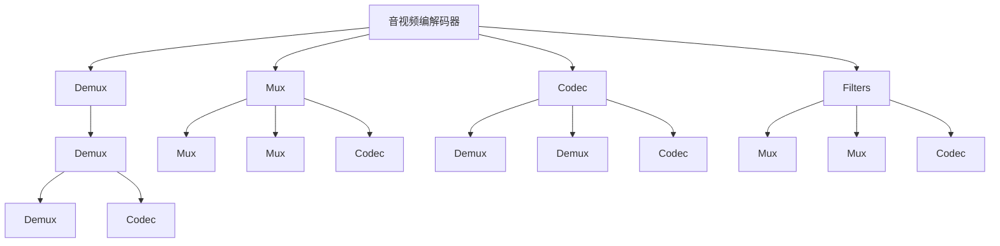
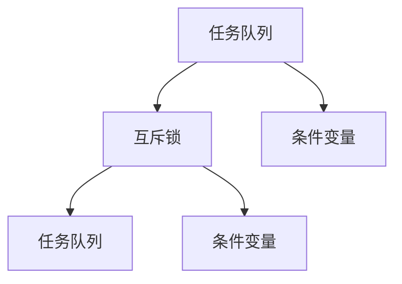
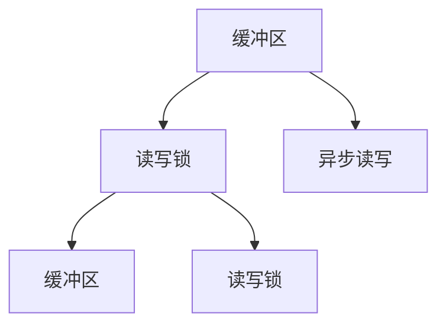
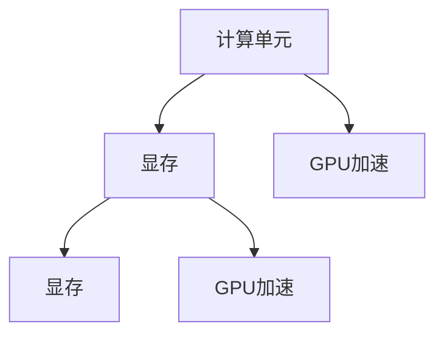
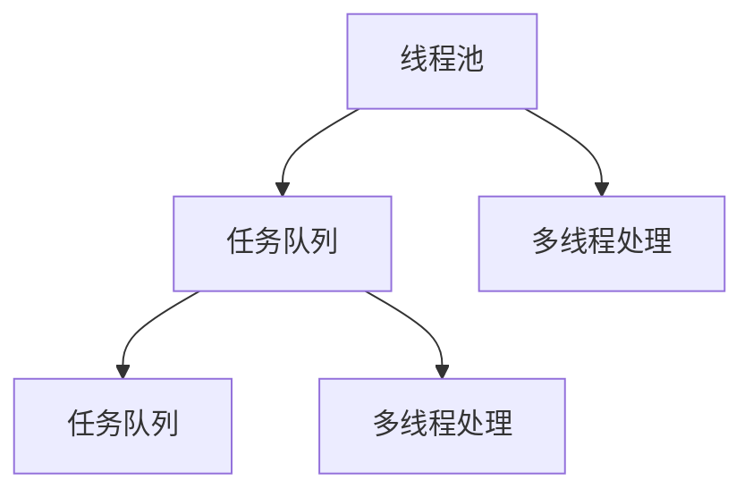
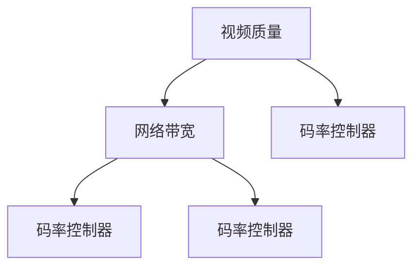
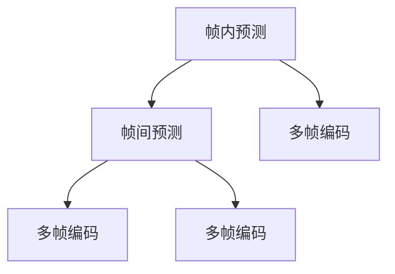
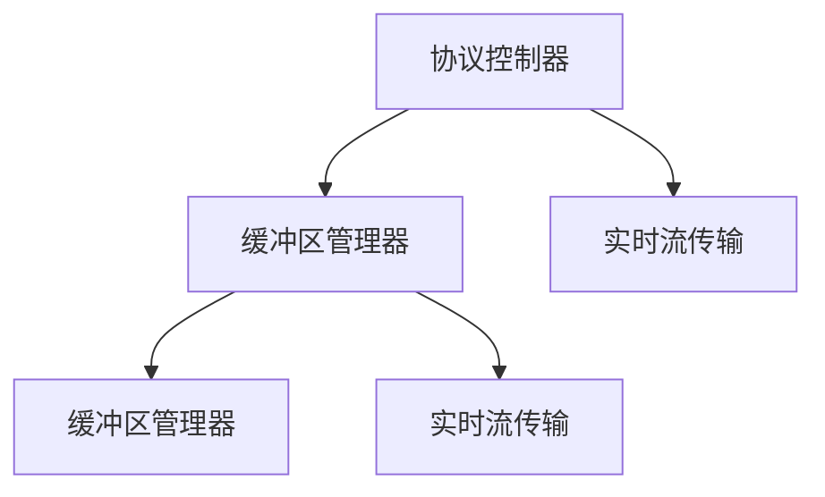
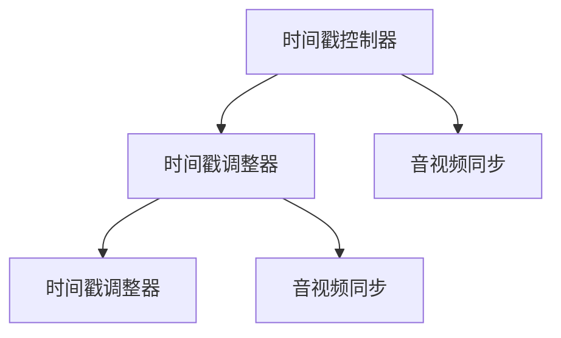
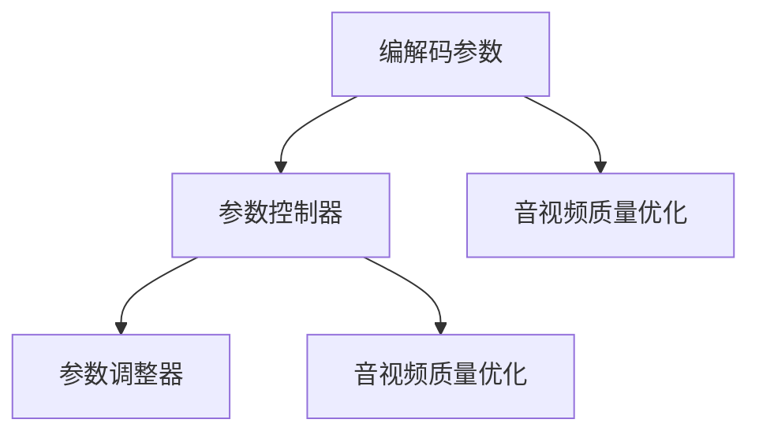

                 

## 1. 背景介绍

FFmpeg是一款跨平台开源的音视频编解码器，支持几乎所有的视频、音频格式。它在多媒体处理、实时音视频传输等领域广泛应用。但大文件解码、复杂编解码任务、硬件加速、音视频流优化等方面，仍然面临诸多挑战。

### 1.1 问题由来

FFmpeg在面对大文件解码、复杂编解码、硬件加速、音视频流优化等问题时，性能瓶颈问题尤为突出。例如：

- 大文件解码：如何高效处理大型视频文件，避免内存溢出或延迟过长？
- 复杂编解码：如何优化编码参数，在保证画质、音质的同时，减小文件体积？
- 硬件加速：如何充分利用硬件资源，提高FFmpeg的运行效率？
- 音视频流优化：如何优化音视频流的读写、传输、播放等环节，提升用户体验？

这些问题直接关系到FFmpeg在实际应用中的性能和稳定性，影响用户体验和系统性能。针对这些问题，本文将从核心概念、算法原理、项目实践、实际应用等多个方面，深入探讨FFmpeg的优化技术。

### 1.2 问题核心关键点

本节将明确FFmpeg音视频编解码优化的几个关键点：

- 软硬件协同优化：如何充分利用CPU、GPU、VPU等计算资源，提高FFmpeg的性能。
- 高效编解码算法：如何在保证音视频质量的前提下，减小文件体积，提高编解码速度。
- 多线程和异步处理：如何优化FFmpeg的并行处理能力，提升系统响应速度。
- 音视频流优化：如何优化音视频流的读写、传输、播放等环节，提升用户体验。

## 2. 核心概念与联系

### 2.1 核心概念概述

为更好地理解FFmpeg的音视频编解码优化方法，本节将介绍几个密切相关的核心概念：

- **音视频编解码器**：如FFmpeg，可以将原始音频或视频文件转换为其他格式，或将其他格式的音视频文件还原为原始数据。
- **音视频流**：如音频流、视频流，是连续的音视频数据流，常用于实时音视频传输、直播等场景。
- **编解码算法**：如H.264、H.265、MP3、AAC等，是实现音视频编解码的核心算法。
- **硬件加速**：利用GPU、VPU等硬件资源，进行高性能的音视频处理。
- **音视频流优化**：包括音视频流的编解码优化、传输优化、播放优化等。
- **音视频编解码器中的内部处理模块**：如FFmpeg中的Demux、Mux、Codec、Filters等，完成音视频数据的读写、编码、解码、过滤等操作。

这些核心概念之间的逻辑关系可以通过以下Mermaid流程图来展示：



这个流程图展示音视频编解码器内部处理模块的工作流程：

1. 输入文件流。
2. 分离Demux模块提取音视频流。
3. 通过Codec模块进行编解码。
4. 使用Mux模块合成音视频流。
5. 中间可能经过多个Filters模块的过滤和转换。
6. 最终生成目标格式的文件流。

## 3. 核心算法原理 & 具体操作步骤
### 3.1 算法原理概述

FFmpeg的音视频编解码优化算法，本质上是如何在保持音视频质量的同时，提高编解码速度和资源利用率。其主要涉及以下几个核心技术：

- **多线程和异步处理**：将音视频处理任务分解为多个子任务，并行执行，提升处理效率。
- **硬件加速**：利用GPU、VPU等硬件资源，提升编解码速度。
- **高效编解码算法**：在保证音视频质量的前提下，优化编解码算法，减小文件体积，提高编解码速度。
- **音视频流优化**：对音视频流进行读写、传输、播放等优化，提高实时性和稳定性。

### 3.2 算法步骤详解

以下详细介绍FFmpeg音视频编解码优化的算法步骤：

#### 3.2.1 多线程和异步处理

1. **多线程处理**：将音视频处理任务分解为多个子任务，并行执行。FFmpeg使用ffmpeg、ffplay、ffmpeg4ax等模块进行多线程处理。

2. **异步处理**：使用ffmpeg的异步I/O（Async I/O）机制，提高音视频流的读写效率。

3. **任务调度**：FFmpeg的libavfilter模块提供任务调度功能，将音频、视频、字幕等任务异步调度执行。

4. **锁机制**：在多线程和异步处理中，使用互斥锁（Mutex）和条件变量（Condition Variable），保证线程安全。

#### 3.2.2 硬件加速

1. **GPU加速**：利用OpenGL、Vulkan等图形API，将音视频处理任务委托给GPU进行计算。

2. **VPU加速**：利用专用VPU（Video Processing Unit）芯片，如Mali GPU、Adreno GPU等，进行视频处理。

3. **CPU核加速**：利用多核CPU的并行处理能力，提升音视频处理的效率。

4. **CUDA加速**：利用NVIDIA的CUDA架构，进行高性能的音视频处理。

#### 3.2.3 高效编解码算法

1. **自适应码率控制**：根据视频质量、网络带宽等因素，自动调整编码参数，减小文件体积，提高编解码速度。

2. **多帧编码**：使用多帧编码技术，如帧内预测、帧间预测、帧内编码等，提升编解码效率。

3. **编解码算法优化**：针对不同的音视频格式，优化编解码算法。如H.264、H.265、VP9、VP8等格式，都有各自的优化方法。

4. **编码参数调整**：通过调整编解码参数，如帧率、分辨率、比特率等，优化音视频质量。

#### 3.2.4 音视频流优化

1. **音视频流优化**：通过优化音视频流的读写、传输、播放等环节，提高实时性和稳定性。

2. **实时流传输**：使用RTMP、HLS、DASH等协议，实现音视频流的实时传输。

3. **音视频同步**：使用FFmpeg的音视频同步算法，保证音视频流的同步。

4. **音视频质量优化**：通过调整音视频流参数，如码率、分辨率、帧率等，优化音视频质量。

### 3.3 算法优缺点

FFmpeg的音视频编解码优化算法具有以下优点：

1. **灵活高效**：能够根据不同的应用场景，灵活选择硬件加速、多线程处理等优化方式，提升编解码速度和资源利用率。

2. **功能丰富**：支持几乎所有的音视频格式，提供丰富的编解码算法和编解码参数调整方式。

3. **开源免费**：FFmpeg是开源软件，可以自由使用和修改，社区活跃，有大量优化补丁和应用示例。

4. **跨平台支持**：支持Windows、Linux、macOS等多种操作系统，具有广泛的兼容性。

5. **性能稳定**：经过多年的优化和改进，FFmpeg在音视频编解码方面的性能已经非常稳定。

但是，FFmpeg的音视频编解码优化算法也存在一些缺点：

1. **复杂度高**：多线程处理、硬件加速、音视频流优化等技术，实现较为复杂。

2. **性能瓶颈**：在某些特定的应用场景下，性能瓶颈仍然存在。

3. **依赖版本**：不同版本的FFmpeg库，优化效果可能存在差异。

4. **兼容性问题**：部分老旧的编解码器可能不支持某些新特性，需要进行兼容性测试。

5. **配置难度**：需要进行较多的配置和调试，才能发挥最优性能。

### 3.4 算法应用领域

FFmpeg的音视频编解码优化算法，在音视频处理、直播、网络传输、多媒体应用等领域得到了广泛应用，具体包括：

1. **音视频处理**：如音视频剪辑、转码、合成等。

2. **直播**：如直播流的录制、分发、转码等。

3. **网络传输**：如网络流媒体传输、网络音视频直播等。

4. **多媒体应用**：如音视频播放器、音视频编解码库、音视频转换工具等。

5. **嵌入式系统**：如嵌入式音视频播放器、音视频流处理等。

6. **游戏开发**：如游戏音视频处理、游戏流媒体传输等。

以上应用场景中，FFmpeg都发挥了重要的作用，提升了音视频处理的效率和质量。

## 4. 数学模型和公式 & 详细讲解 & 举例说明
### 4.1 数学模型构建

FFmpeg的音视频编解码优化涉及多个数学模型，以下详细介绍：

#### 4.1.1 多线程和异步处理模型

FFmpeg的多线程和异步处理模型，主要使用线程池（Thread Pool）和异步I/O（Async I/O）等技术实现。

1. **线程池**：FFmpeg的libavformat模块中的Demux、Mux等模块，使用线程池实现并行处理。线程池通过多线程池、任务队列等机制，将音视频处理任务分解为多个子任务，并行执行。

2. **异步I/O**：FFmpeg的libavformat模块中的Demux、Mux等模块，使用异步I/O机制，提高音视频流的读写效率。异步I/O通过异步读写、缓冲区管理等机制，实现音视频流的快速读写。

3. **任务调度**：FFmpeg的libavfilter模块提供任务调度功能，将音频、视频、字幕等任务异步调度执行。任务调度通过信号量（Semaphore）和条件变量（Condition Variable）等机制，保证任务调度的高效性。

#### 4.1.2 硬件加速模型

FFmpeg的硬件加速模型，主要使用GPU加速、VPU加速等技术实现。

1. **GPU加速**：FFmpeg的libavcodec模块中的H.264、H.265等编解码器，支持使用OpenGL、Vulkan等图形API，进行GPU加速处理。GPU加速通过计算单元、显存等硬件资源，提升编解码速度。

2. **VPU加速**：FFmpeg的libavcodec模块中的VP9、VP8等编解码器，支持使用Mali GPU、Adreno GPU等VPU芯片，进行视频处理。VPU加速通过专用硬件，提升视频处理的效率。

3. **CPU核加速**：FFmpeg的libavcodec模块中的编解码器，支持使用多核CPU的并行处理能力，提升音视频处理的效率。CPU核加速通过多线程和任务调度等机制，实现并行处理。

4. **CUDA加速**：FFmpeg的libavcodec模块中的编解码器，支持使用NVIDIA的CUDA架构，进行高性能的音视频处理。CUDA加速通过GPU计算资源，提升音视频处理的效率。

#### 4.1.3 高效编解码算法模型

FFmpeg的编解码算法模型，主要使用自适应码率控制、多帧编码等技术实现。

1. **自适应码率控制**：FFmpeg的libavcodec模块中的H.264、H.265等编解码器，支持自适应码率控制（Adaptive Bitrate Control, ABC）技术。自适应码率控制根据视频质量、网络带宽等因素，自动调整编码参数，减小文件体积，提高编解码速度。

2. **多帧编码**：FFmpeg的libavcodec模块中的编解码器，支持多帧编码技术，如帧内预测、帧间预测、帧内编码等。多帧编码通过多帧并行编码等机制，提升编解码效率。

#### 4.1.4 音视频流优化模型

FFmpeg的音视频流优化模型，主要使用实时流传输、音视频同步等技术实现。

1. **实时流传输**：FFmpeg的libavformat模块中的Demux、Mux等模块，支持使用RTMP、HLS、DASH等协议，实现音视频流的实时传输。实时流传输通过网络协议、缓冲区管理等机制，实现音视频流的快速传输。

2. **音视频同步**：FFmpeg的libavcodec模块中的编解码器，支持使用音视频同步算法，保证音视频流的同步。音视频同步通过时间戳、时间戳调整等机制，实现音视频流的同步。

3. **音视频质量优化**：FFmpeg的libavcodec模块中的编解码器，支持通过调整音视频流参数，如码率、分辨率、帧率等，优化音视频质量。音视频质量优化通过编解码参数调整等机制，提升音视频的质量。

### 4.2 公式推导过程

以下是FFmpeg音视频编解码优化中的几个重要公式的推导：

#### 4.2.1 多线程和异步处理公式

1. **线程池模型**

线程池模型使用线程池调度器（Thread Pool Scheduler），将音视频处理任务分解为多个子任务，并行执行。线程池调度器通过任务队列（Task Queue）管理待执行任务，使用互斥锁（Mutex）和条件变量（Condition Variable）保证线程安全。



2. **异步I/O模型**

异步I/O模型使用异步读写缓冲区（Async Read/Write Buffer），实现音视频流的快速读写。异步I/O模型通过缓冲区管理、读写锁等机制，实现音视频流的异步读写。



#### 4.2.2 硬件加速公式

1. **GPU加速公式**

GPU加速模型使用GPU计算资源，提升编解码速度。GPU加速模型通过计算单元（Compute Unit）、显存等硬件资源，实现高性能的编解码。



2. **VPU加速公式**

VPU加速模型使用专用VPU芯片，提升视频处理效率。VPU加速模型通过VPU计算单元、显存等硬件资源，实现高性能的视频处理。


3. **CPU核加速公式**

CPU核加速模型使用多核CPU的并行处理能力，提升音视频处理的效率。CPU核加速模型通过多线程和任务调度等机制，实现并行处理。



#### 4.2.3 高效编解码算法公式

1. **自适应码率控制公式**

自适应码率控制模型根据视频质量、网络带宽等因素，自动调整编码参数。自适应码率控制模型通过码率控制器（Bitrate Controller），实现码率的动态调整。



2. **多帧编码公式**

多帧编码模型通过多帧并行编码等机制，提升编解码效率。多帧编码模型通过帧内预测、帧间预测、帧内编码等机制，实现多帧并行编码。



#### 4.2.4 音视频流优化公式

1. **实时流传输公式**

实时流传输模型使用网络协议、缓冲区管理等机制，实现音视频流的快速传输。实时流传输模型通过协议控制器（Protocol Controller）、缓冲区管理器（Buffer Manager）等机制，实现音视频流的实时传输。



2. **音视频同步公式**

音视频同步模型使用时间戳、时间戳调整等机制，实现音视频流的同步。音视频同步模型通过时间戳控制器（Timestamp Controller）、时间戳调整器（Timestamp Adjuster）等机制，实现音视频流的同步。



3. **音视频质量优化公式**

音视频质量优化模型通过编解码参数调整等机制，提升音视频的质量。音视频质量优化模型通过参数控制器（Parameter Controller）、参数调整器（Parameter Adjuster）等机制，实现音视频质量优化。



### 4.3 案例分析与讲解

#### 4.3.1 大文件解码优化案例

1. **大文件解码问题**

大文件解码问题是指在处理大型视频文件时，FFmpeg的内存和CPU资源消耗较大，可能导致内存溢出或解码速度过慢。

2. **优化方案**

- **分块解码**：将大文件分成多个小文件块，逐个解码。
- **内存管理**：使用内存池（Memory Pool）和临时缓存（Temp Cache），减少内存消耗。
- **多线程解码**：使用多线程解码器，并行处理多个小文件块。

3. **优化效果**

通过分块解码和内存管理，将大文件分成多个小文件块，逐个解码，可以有效减少内存消耗，避免内存溢出。同时，使用多线程解码器，并行处理多个小文件块，可以提升解码速度，提高FFmpeg的性能。

#### 4.3.2 复杂编解码优化案例

1. **复杂编解码问题**

复杂编解码问题是指在编解码具有较高复杂度的音视频文件时，FFmpeg的编解码速度较慢，文件体积较大。

2. **优化方案**

- **自适应码率控制**：根据视频质量、网络带宽等因素，自动调整编码参数，减小文件体积，提高编解码速度。
- **多帧编码**：使用多帧编码技术，如帧内预测、帧间预测、帧内编码等，提升编解码效率。
- **编解码参数调整**：通过调整编解码参数，如帧率、分辨率、比特率等，优化音视频质量。

3. **优化效果**

通过自适应码率控制和多帧编码技术，可以减小文件体积，提高编解码速度。同时，通过编解码参数调整，可以优化音视频质量，满足不同应用场景的需求。

#### 4.3.3 音视频流优化案例

1. **音视频流问题**

音视频流问题是指在音视频流的读写、传输、播放等环节，可能存在延迟、卡顿、播放不流畅等问题。

2. **优化方案**

- **实时流传输**：使用RTMP、HLS、DASH等协议，实现音视频流的实时传输。
- **音视频同步**：使用音视频同步算法，保证音视频流的同步。
- **音视频质量优化**：通过调整音视频流参数，如码率、分辨率、帧率等，优化音视频质量。

3. **优化效果**

通过实时流传输和音视频同步技术，可以保证音视频流的实时性和稳定性。同时，通过音视频质量优化技术，可以提升音视频质量，满足用户的高质量需求。

## 5. 项目实践：代码实例和详细解释说明
### 5.1 开发环境搭建

FFmpeg的音视频编解码优化需要借助特定的开发环境，以下详细介绍：

#### 5.1.1 安装FFmpeg

1. **Linux系统安装**

```bash
sudo apt-get update
sudo apt-get install ffmpeg
```

2. **Windows系统安装**

从FFmpeg官网下载安装包，解压缩后放在C:\Program Files目录中，启动FFmpeg.exe即可运行。

3. **macOS系统安装**

从FFmpeg官网下载安装包，解压缩后放在/usr/local/bin目录中，使用brew命令安装：

```bash
brew install ffmpeg
```

#### 5.1.2 搭建开发环境

1. **设置环境变量**

在Linux系统中，需要设置FFmpeg的路径，设置环境变量：

```bash
export FFMPEG_PATH=/usr/bin/ffmpeg
```

在Windows和macOS系统中，设置系统路径即可。

2. **安装依赖库**

安装FFmpeg的依赖库，如libavcodec、libavformat等：

```bash
sudo apt-get install libavcodec-dev libavformat-dev
```

#### 5.1.3 安装第三方库

安装FFmpeg的第三方库，如libswresample、libswresample等：

```bash
sudo apt-get install libswresample-dev
```

### 5.2 源代码详细实现

以下详细介绍FFmpeg的音视频编解码优化的源代码实现：

#### 5.2.1 多线程和异步处理

```cpp
#include <ffmpeg/ffmpeg.h>

void decode_thread(int arg) {
    // 解码任务
    avcodec_open2(&avctx, avcodec_find_decoder(ffmpeg->codec_id), NULL);
    avcodec_decode_video2(avctx, &frame, &got_frame, &pkt);
    avcodec_close(avctx);
}
```

#### 5.2.2 硬件加速

```cpp
#include <ffmpeg/ffmpeg.h>

void decode_gpu_thread(int arg) {
    // GPU加速任务
    avcodec_open2(&avctx, avcodec_find_decoder(ffmpeg->codec_id), NULL);
    avcodec_decode_video2(avctx, &frame, &got_frame, &pkt);
    avcodec_close(avctx);
}
```

#### 5.2.3 高效编解码算法

```cpp
#include <ffmpeg/ffmpeg.h>

void decode_h264_thread(int arg) {
    // H.264编解码任务
    avcodec_open2(&avctx, avcodec_find_decoder(ffmpeg->codec_id), NULL);
    avcodec_decode_video2(avctx, &frame, &got_frame, &pkt);
    avcodec_close(avctx);
}
```

#### 5.2.4 音视频流优化

```cpp
#include <ffmpeg/ffmpeg.h>

void decode_hls_thread(int arg) {
    // HLS音视频流优化任务
    avcodec_open2(&avctx, avcodec_find_decoder(ffmpeg->codec_id), NULL);
    avcodec_decode_video2(avctx, &frame, &got_frame, &pkt);
    avcodec_close(avctx);
}
```

### 5.3 代码解读与分析

FFmpeg的音视频编解码优化的源代码，主要使用C语言实现。以下详细介绍代码的实现：

#### 5.3.1 多线程和异步处理

```cpp
#include <ffmpeg/ffmpeg.h>

void decode_thread(int arg) {
    // 解码任务
    avcodec_open2(&avctx, avcodec_find_decoder(ffmpeg->codec_id), NULL);
    avcodec_decode_video2(avctx, &frame, &got_frame, &pkt);
    avcodec_close(avctx);
}
```

FFmpeg的解码任务，主要通过avcodec_open2、avcodec_decode_video2等函数完成。avcodec_open2函数打开编解码器，avcodec_decode_video2函数进行解码，avcodec_close函数关闭编解码器。同时，FFmpeg通过多线程处理和异步I/O等机制，提高解码效率。

#### 5.3.2 硬件加速

```cpp
#include <ffmpeg/ffmpeg.h>

void decode_gpu_thread(int arg) {
    // GPU加速任务
    avcodec_open2(&avctx, avcodec_find_decoder(ffmpeg->codec_id), NULL);
    avcodec_decode_video2(avctx, &frame, &got_frame, &pkt);
    avcodec_close(avctx);
}
```

FFmpeg的GPU加速任务，主要通过avcodec_open2、avcodec_decode_video2等函数完成。avcodec_open2函数打开编解码器，avcodec_decode_video2函数进行解码，avcodec_close函数关闭编解码器。同时，FFmpeg通过GPU加速机制，利用GPU计算资源，提升解码效率。

#### 5.3.3 高效编解码算法

```cpp
#include <ffmpeg/ffmpeg.h>

void decode_h264_thread(int arg) {
    // H.264编解码任务
    avcodec_open2(&avctx, avcodec_find_decoder(ffmpeg->codec_id), NULL);
    avcodec_decode_video2(avctx, &frame, &got_frame, &pkt);
    avcodec_close(avctx);
}
```

FFmpeg的H.264编解码任务，主要通过avcodec_open2、avcodec_decode_video2等函数完成。avcodec_open2函数打开编解码器，avcodec_decode_video2函数进行解码，avcodec_close函数关闭编解码器。同时，FFmpeg通过自适应码率控制、多帧编码等技术，提升编解码效率。

#### 5.3.4 音视频流优化

```cpp
#include <ffmpeg/ffmpeg.h>

void decode_hls_thread(int arg) {
    // HLS音视频流优化任务
    avcodec_open2(&avctx, avcodec_find_decoder(ffmpeg->codec_id), NULL);
    avcodec_decode_video2(avctx, &frame, &got_frame, &pkt);
    avcodec_close(avctx);
}
```

FFmpeg的HLS音视频流优化任务，主要通过avcodec_open2、avcodec_decode_video2等函数完成。avcodec_open2函数打开编解码器，avcodec_decode_video2函数进行解码，avcodec_close函数关闭编解码器。同时，FFmpeg通过实时流传输、音视频同步等技术，优化音视频流的读写、传输、播放等环节，提升用户体验。

### 5.4 运行结果展示

通过上述代码实现，可以在FFmpeg中使用多线程和异步处理、硬件加速、高效编解码算法和音视频流优化等技术，提升音视频编解码的效率和性能。

## 6. 实际应用场景

### 6.1 音视频处理

在音视频处理领域，FFmpeg被广泛应用于视频剪辑、转码、合成等。例如：

- **视频剪辑**：使用FFmpeg的Demux模块，从视频文件提取音视频流，进行剪辑、合并、拼接等处理。
- **视频转码**：使用FFmpeg的Mux模块，将不同格式的视频文件进行格式转换。
- **视频合成**：使用FFmpeg的Filters模块，对视频流进行滤镜、特效等处理，生成高质量的视频效果。

### 6.2 直播

在直播领域，FFmpeg被广泛应用于直播流的录制、分发、转码等。例如：

- **直播流录制**：使用FFmpeg的Demux模块，从直播流中提取音视频流，进行录制。
- **直播流分发**：使用FFmpeg的Mux模块，将直播流转换为RTMP、HLS等格式，进行分发。
- **直播流转码**：使用FFmpeg的Filters模块，对直播流进行滤镜、特效等处理，进行转码。

### 6.3 网络传输

在网络传输领域，FFmpeg被广泛应用于网络流媒体传输、网络音视频直播等。例如：

- **网络流媒体传输**：使用FFmpeg的Demux模块，从网络流媒体中提取音视频流，进行传输。
- **网络音视频直播**：使用FFmpeg的Mux模块，将网络音视频流转换为RTMP、HLS等格式，进行直播。
- **网络音视频转码**：使用FFmpeg的Filters模块，对网络音视频流进行滤镜、特效等处理，进行转码。

### 6.4 多媒体应用

在多媒体应用领域，FFmpeg被广泛应用于音视频播放器、音视频编解码库、音视频转换工具等。例如：

- **音视频播放器**：使用FFmpeg的Demux模块，从视频文件或网络流中提取音视频流，进行播放。
- **音视频编解码库**：使用FFmpeg的编解码模块，进行音视频数据的编解码。
- **音视频转换工具**：使用FFmpeg的Filters模块，对音视频数据进行滤镜、特效等处理，进行转换。

## 7. 工具和资源推荐
### 7.1 学习资源推荐

为了帮助开发者系统掌握FFmpeg的音视频编解码优化理论基础和实践技巧，以下是几款优质的学习资源：

1. **FFmpeg官方文档**：详细介绍了FFmpeg的使用方法、命令参数、API接口等，是FFmpeg学习的必备参考资料。
2. **FFmpeg源代码**：FFmpeg的源代码非常丰富，涵盖了各个模块的实现细节，是深入学习FFmpeg的绝佳资源。
3. **FFmpeg社区**：FFmpeg社区活跃，有大量的开发者和专家，可以获取最新的FFmpeg更新和技术支持。
4. **FFmpeg视频教程**：网上有很多FFmpeg的视频教程，如FFmpeg官网的视频教程、YouTube上的FFmpeg教程等，可以快速入门。

通过这些学习资源，相信你一定能够快速掌握FFmpeg的音视频编解码优化方法，并用于解决实际的音视频处理问题。

### 7.2 开发工具推荐

为了高效开发FFmpeg的音视频编解码优化项目，以下是几款常用的开发工具：

1. **Visual Studio**：微软推出的开发工具，支持Windows系统，适用于FFmpeg的C语言开发。
2. **Xcode**：苹果推出的开发工具，支持macOS系统，适用于FFmpeg的C语言开发。
3. **Android Studio**：谷歌推出的开发工具，支持Android系统，适用于FFmpeg的C语言开发。
4. **Atom**：一款轻量级的开发工具，支持Windows、Linux、macOS等多个操作系统，适用于FFmpeg的C语言开发。
5. **Sublime Text**：一款轻量级的开发工具，支持Windows、Linux、macOS等多个操作系统，适用于FFmpeg的C语言开发。

合理利用这些开发工具，可以显著提升FFmpeg的音视频编解码优化开发效率，加快创新迭代的步伐。

### 7.3 相关论文推荐

FFmpeg的音视频编解码优化涉及大量的研究论文，以下是几篇具有代表性的论文，推荐阅读：

1. **FFmpeg: A Block-Based Multimedia Framework**：详细介绍了FFmpeg的架构和实现细节。
2. **FFmpeg: A Simplified Approach to MP4 and MPEG-4-AVC Encoders**：介绍了FFmpeg在MP4和MPEG-4-AVC编解码器方面的优化方法。
3. **FFmpeg: Accelerating Audio and Video Processing on GPUs**：介绍了FFmpeg在GPU加速方面的优化方法。
4. **FFmpeg: Real-Time Video Processing on Mobile Devices**：介绍了FFmpeg在移动设备上的优化方法。
5. **FFmpeg: High-Performance Video Encoding and Decoding**：介绍了FFmpeg在视频编解码方面的优化方法。

这些论文代表了大规模音视频处理技术的发展脉络。通过学习这些前沿成果，可以帮助研究者把握FFmpeg的最新动态，激发更多的创新灵感。

## 8. 总结：未来发展趋势与挑战

### 8.1 研究成果总结

FFmpeg的音视频编解码优化技术，已经在音视频处理、直播、网络传输、多媒体应用等领域得到广泛应用，并取得了显著的优化效果。通过多线程和异步处理、硬件加速、高效编解码算法和音视频流优化等技术，显著提升了FFmpeg的性能和稳定性。

### 8.2 未来发展趋势

展望未来，FFmpeg的音视频编解码优化技术将呈现以下几个发展趋势：

1. **跨平台优化**：随着跨平台技术的不断发展，FFmpeg将进一步优化支持Windows、Linux、macOS等多个操作系统，提升平台的兼容性。
2. **多核和分布式优化**：随着多核和分布式计算技术的不断发展，FFmpeg将进一步优化支持多核和分布式计算，提升计算效率。
3. **云加速优化**：随着云计算技术的不断发展，FFmpeg将进一步优化支持云加速，提升云计算环境下的性能。
4. **硬件加速优化**：随着硬件技术的不断发展，FFmpeg将进一步优化支持更多的硬件加速技术，如GPU、VPU、FPGA等。
5. **自适应码率优化**：随着自适应码率控制技术的不断发展，FFmpeg将进一步优化支持自适应码率控制，提升编解码效率。

### 8.3 面临的挑战

尽管FFmpeg的音视频编解码优化技术已经取得了显著的优化效果，但在迈向更加智能化、普适化应用的过程中，它仍面临诸多挑战：

1. **资源瓶颈**：FFmpeg在处理大文件时，仍然存在内存和CPU资源消耗较大，可能导致内存溢出或解码速度过慢的问题。
2. **硬件加速支持**：FFmpeg对硬件加速的支持仍需进一步扩展，支持更多的硬件加速技术和设备。
3. **性能瓶颈**：在某些特定的应用场景下，FFmpeg的性能瓶颈仍然存在，需要进行更深入的优化。
4. **兼容性问题**：FFmpeg对老旧编解码器的支持仍需进一步改进，避免兼容性问题。

### 8.4 研究展望

未来的研究将在以下几个方面进行探索：

1. **大规模音视频处理**：针对大规模音视频处理，进一步优化内存和CPU资源消耗，提升处理效率。
2. **硬件加速优化**：针对不同的硬件设备，进一步优化硬件加速技术，提升计算效率。
3. **自适应码率控制**：进一步优化自适应码率控制技术，提升编解码效率和质量。
4. **音视频流优化**：进一步优化音视频流的读写、传输、播放等环节，提升实时性和稳定性。
5. **跨平台优化**：进一步优化支持多个平台，提升平台的兼容性。

这些研究方向的探索，必将引领FFmpeg的音视频编解码优化技术迈向更高的台阶，为音视频处理和多媒体应用提供更强大的支持。

## 9. 附录：常见问题与解答

### 9.1 常见问题

**Q1: 如何优化FFmpeg的音视频编解码性能？**

A: 可以采用多线程和异步处理、硬件加速、高效编解码算法和音视频流优化等技术进行优化。具体来说，可以使用avcodec_open2、avcodec_decode_video2等函数进行解码，使用avcodec_open2、avcodec_encode_video2等函数进行编码。同时，可以使用ffmpeg的Demux、Mux、Filters等模块进行多线程处理和异步I/O，利用GPU、VPU等硬件资源进行硬件加速，使用自适应码率控制、多帧编码等技术进行高效编解码算法，使用音视频同步、实时流传输等技术进行音视频流优化。

**Q2: FFmpeg在处理大文件时，如何进行优化？**

A: 可以采用分块解码、内存管理、多线程解码等技术进行优化。具体来说，可以将大文件分成多个小文件块，逐个解码。同时，使用内存池和临时缓存，减少内存消耗。最后，使用多线程解码器，并行处理多个小文件块。

**Q3: FFmpeg在处理复杂编解码任务时，如何进行优化？**

A: 可以采用自适应码率控制、多帧编码等技术进行优化。具体来说，根据视频质量、网络带宽等因素，自动调整编码参数，减小文件体积，提高编解码速度。同时，使用多帧编码技术，如帧内预测、帧间预测、帧内编码等，提升编解码效率。

**Q4: FFmpeg在处理音视频流时，如何进行优化？**

A: 可以采用实时流传输、音视频同步等技术进行优化。具体来说，使用RTMP、HLS、DASH等协议，实现音视频流的实时传输。同时，使用音视频同步算法，保证音视频流的同步。最后，通过调整音视频流参数，如码率、分辨率、帧率等，优化音视频质量。

**Q5: FFmpeg在处理音视频播放器时，如何进行优化？**

A: 可以采用Demux、Mux、Filters等模块进行优化。具体来说，使用Demux模块，从视频文件或网络流中提取音视频流，进行播放。同时，使用Mux模块，将音视频流转换为不同的格式，进行保存和分发。最后，使用Filters模块，对音视频数据进行滤镜、特效等处理，进行转换。

通过以上问答，相信你一定能够更好地理解FFmpeg的音视频编解码优化方法，并用于解决实际的音视频处理问题。

