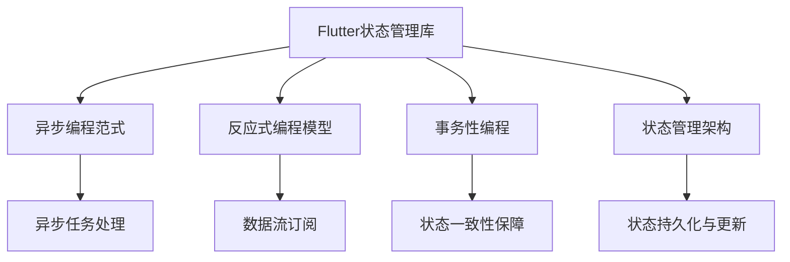

                 

# Flutter状态管理与异步编程

> 关键词：Flutter,状态管理,异步编程,状态管理库,异步编程范式,反应式编程,状态管理架构,异步任务处理,事务性编程

## 1. 背景介绍

### 1.1 问题由来
在移动应用开发领域，状态管理和异步编程是两个核心问题。传统应用基于活动对象模型（Active Object Model）或事件驱动模型（Event-Driven Model），采用单线程执行异步操作，通过事件处理机制实现状态更新，但这种同步阻塞的异步编程模式容易导致UI卡顿、性能瓶颈、难以调试等问题。

Flutter作为一种跨平台移动应用开发框架，采用响应式编程模型（Reactive Programming Model），同时使用异步编程范式（Asynchronous Programming Paradigm），通过Flutter状态管理库（State Management Libraries），帮助开发者实现灵活高效的状态管理与异步编程，提升应用性能和用户体验。

### 1.2 问题核心关键点
Flutter状态管理与异步编程的核心关键点在于：

1. 如何高效管理应用状态。应用状态贯穿整个UI生命周期，需要保证状态的持久化和一致性，同时尽量减少状态变化带来的性能开销。
2. 如何高效处理异步任务。异步任务是应用的常态，需要在不阻塞UI线程的情况下进行数据读取、网络请求、计算密集型任务等操作，保证应用的流畅性和响应性。
3. 如何构建响应式数据流。通过状态和异步任务的结合，构建数据流，实现对UI元素的及时响应，提升用户体验。
4. 如何保障数据一致性和应用安全性。异步操作和数据更新可能导致数据不一致，需要通过状态管理库进行控制和校验，保障应用安全。

本文旨在探讨Flutter状态管理和异步编程的原理与实践，介绍常用的状态管理库与异步编程范式，同时分享实际应用中的最佳实践和工程经验。

## 2. 核心概念与联系

### 2.1 核心概念概述

为更好地理解Flutter状态管理和异步编程，本文将介绍几个密切相关的核心概念：

- Flutter状态管理库（State Management Libraries）：用于管理应用状态的库，如Provider、Bloc、Redux等，帮助开发者实现状态持久化、更新控制和事件响应。
- 异步编程范式（Asynchronous Programming Paradigm）：通过回调、Promise、Future、async/await等机制，高效处理异步任务，减少UI阻塞。
- 反应式编程模型（Reactive Programming Model）：通过数据流和订阅机制，实现数据与UI的无缝同步，提升应用响应性。
- 事务性编程（Transactional Programming）：通过使用事务性编程语言，如Kotlin、Swift等，保障状态和异步操作的原子性和一致性。
- 状态管理架构（State Management Architecture）：包括状态树的构建、状态流的更新、状态订阅与响应等，帮助开发者设计高效的状态管理策略。

这些核心概念之间的逻辑关系可以通过以下Mermaid流程图来展示：



这个流程图展示了一些核心概念及其之间的联系：

1. Flutter状态管理库提供了状态持久化与更新的机制。
2. 异步编程范式提供了高效处理异步任务的方式。
3. 反应式编程模型实现了数据与UI的同步。
4. 事务性编程提供了状态操作的原子性和一致性。
5. 状态管理架构设计了高效的状态管理策略。
6. 异步任务处理依赖于异步编程范式。
7. 数据流订阅依赖于反应式编程模型。
8. 状态一致性保障依赖于事务性编程。

这些概念共同构成了Flutter状态管理和异步编程的基础，使得开发者可以构建高效、稳定、可扩展的移动应用。

## 3. 核心算法原理 & 具体操作步骤
### 3.1 算法原理概述

Flutter状态管理和异步编程的算法原理主要围绕以下几个方面：

1. 状态持久化与更新：通过状态管理库实现状态的持久化，并控制状态的更新，避免状态丢失或重复更新。
2. 异步任务处理：通过异步编程范式处理异步任务，如网络请求、数据计算等，同时避免阻塞UI线程。
3. 数据流订阅与响应：通过反应式编程模型实现数据与UI的同步，确保数据流及时更新。
4. 状态一致性保障：通过事务性编程保障状态操作的原子性和一致性，避免数据不一致问题。

以下将详细讲解这些算法原理及其具体操作步骤。

### 3.2 算法步骤详解

#### 3.2.1 状态持久化与更新

Flutter中的状态管理库通常通过状态持久化和状态更新机制来管理应用状态。以Provider库为例，其核心思想是通过Provider树实现状态的持久化。

1. **Provider树构建**：
   - 在应用的根节点中，创建Provider节点，用于管理全局的Provider树。
   - 通过Provider.of()方法，获取全局Provider树中的状态。

   ```dart
   class ProviderTree {
     ProviderState state;
     @override
     void dispose() {
       state.dispose();
     }
   }
   ```

2. **状态更新控制**：
   - 通过Provider的主题替换机制，实现状态的更新。
   - 当状态发生变化时，Provider会通知所有订阅者重新计算状态。

   ```dart
   Provider.of<State>(context).changeState(newState);
   ```

3. **状态持久化**：
   - Provider提供了一个ProviderState对象，用于持久化状态。
   - ProviderState对象可以通过Provider的添加到根节点中，实现状态的持久化。

   ```dart
   Provider.of<State>(context).add(state);
   ```

#### 3.2.2 异步任务处理

Flutter通过异步编程范式高效处理异步任务，如网络请求、数据计算等。以Future机制为例，其核心思想是通过Future封装异步任务，并通过async/await关键字实现异步任务的处理。

1. **Future封装异步任务**：
   - Future是Flutter中常用的异步编程机制，封装异步任务，并通过then()方法处理异步结果。

   ```dart
   Future<State> fetchData() async {
     State data = await api.getApiData();
     return data;
   }
   ```

2. **async/await处理异步任务**：
   - 通过async/await关键字，在异步函数中处理异步任务，并等待异步结果。

   ```dart
   Future<void> asyncDataHandler() async {
     State data = await api.getApiData();
     // 处理异步结果
   }
   ```

#### 3.2.3 数据流订阅与响应

Flutter通过反应式编程模型实现数据与UI的同步，确保数据流及时更新。以Provider库为例，其核心思想是通过Provider的主题替换机制，实现数据流与UI的同步。

1. **主题替换机制**：
   - Provider的主题替换机制，用于通知所有订阅者重新计算状态。
   - 当状态发生变化时，Provider会通知所有订阅者重新计算状态。

   ```dart
   Provider.of<State>(context).changeState(newState);
   ```

2. **数据流订阅**：
   - 通过Provider的主题替换机制，订阅Provider树中的状态。
   - 在UI组件中，使用Provider监听状态变化，并根据状态更新UI。

   ```dart
   Provider.of<State>(context).listen(() {
     setState(() {
       // 根据状态更新UI
     });
   });
   ```

#### 3.2.4 状态一致性保障

Flutter通过事务性编程保障状态操作的原子性和一致性，避免数据不一致问题。以Provider库为例，其核心思想是通过Provider的主题替换机制，实现状态操作的原子性和一致性。

1. **状态一致性保障**：
   - 通过Provider的主题替换机制，实现状态操作的原子性和一致性。
   - 当多个线程同时修改状态时，Provider会保证状态的一致性和原子性。

   ```dart
   Provider.of<State>(context).changeState(newState);
   ```

### 3.3 算法优缺点

Flutter状态管理和异步编程具有以下优点：

1. 高效管理应用状态：通过状态管理库，实现状态的持久化和一致性，避免状态丢失或重复更新，提高应用的稳定性。
2. 高效处理异步任务：通过异步编程范式，高效处理异步任务，减少UI阻塞，提升应用响应性。
3. 响应式数据流：通过反应式编程模型，实现数据与UI的无缝同步，提升用户体验。
4. 保障数据一致性：通过事务性编程，保障状态操作的原子性和一致性，避免数据不一致问题。

但同时，这些算法也存在一定的局限性：

1. 学习成本较高：状态管理和异步编程涉及多个概念和机制，需要开发者具有一定的编程基础和学习能力。
2. 性能开销较大：状态管理库和异步编程机制会增加一定的性能开销，特别是在大型的应用中，需要注意性能优化。
3. 维护复杂：状态管理和异步编程涉及多个组件和机制，需要开发者具备良好的架构设计和维护能力。

尽管存在这些局限性，但就目前而言，Flutter状态管理和异步编程仍然是构建高效、稳定、可扩展的移动应用的重要手段。

### 3.4 算法应用领域

Flutter状态管理和异步编程广泛应用于各种移动应用场景，如电商、社交、金融、教育、医疗等。

在电商应用中，通过状态管理和异步编程，实现商品数据同步、购物车管理、订单处理等功能，提升用户体验。

在社交应用中，通过状态管理和异步编程，实现消息同步、好友关系管理、内容推荐等功能，提升应用交互性。

在金融应用中，通过状态管理和异步编程，实现交易处理、风险评估、数据分析等功能，提升应用安全性。

在教育应用中，通过状态管理和异步编程，实现课程管理、作业提交、学习路径推荐等功能，提升教育效果。

在医疗应用中，通过状态管理和异步编程，实现医疗记录管理、患者咨询、健康数据分析等功能，提升医疗服务质量。

## 4. 数学模型和公式 & 详细讲解  
### 4.1 数学模型构建

在Flutter状态管理和异步编程中，数学模型主要围绕以下方面：

1. 状态树模型：用于描述应用状态的结构和层次。
2. 异步任务模型：用于描述异步任务的执行过程和结果。
3. 数据流模型：用于描述数据流的生成、处理和响应。

以下将详细讲解这些数学模型及其构建过程。

### 4.2 公式推导过程

#### 4.2.1 状态树模型

状态树模型用于描述应用状态的结构和层次，通过状态树节点和状态变化路径，实现状态的持久化和一致性。

1. **状态树节点定义**：
   - 状态树节点包括状态值、子状态节点和状态变化函数。

   ```dart
   typedef StateNode = State[T] {
     T value;
     List<StateNode> children;
     Function<void(State<T>)> newState;
   };
   ```

2. **状态树构建**：
   - 通过递归方式构建状态树，实现状态的持久化和一致性。

   ```dart
   StateTree<T> buildTree(StateNode<T> node) {
     List<StateNode<T>> children = node.children.map((c) {
       return buildTree(c);
     }).toList();
     StateNode<T> newNode = new StateNode<T>(node.value, children, node.newState);
     return new StateTree<T>(newNode);
   }
   ```

#### 4.2.2 异步任务模型

异步任务模型用于描述异步任务的执行过程和结果，通过Future机制实现异步任务的封装和处理。

1. **Future封装异步任务**：
   - Future封装异步任务，通过then()方法处理异步结果。

   ```dart
   Future<State> fetchData() async {
     State data = await api.getApiData();
     return data;
   }
   ```

2. **async/await处理异步任务**：
   - 通过async/await关键字，在异步函数中处理异步任务，并等待异步结果。

   ```dart
   Future<void> asyncDataHandler() async {
     State data = await api.getApiData();
     // 处理异步结果
   }
   ```

#### 4.2.3 数据流模型

数据流模型用于描述数据流的生成、处理和响应，通过Provider的主题替换机制实现数据流与UI的同步。

1. **主题替换机制**：
   - 通过Provider的主题替换机制，实现数据流与UI的同步。

   ```dart
   Provider.of<State>(context).changeState(newState);
   ```

2. **数据流订阅**：
   - 通过Provider的主题替换机制，订阅Provider树中的状态。

   ```dart
   Provider.of<State>(context).listen(() {
     setState(() {
       // 根据状态更新UI
     });
   });
   ```

### 4.3 案例分析与讲解

#### 4.3.1 电商应用案例

电商应用中，通过状态管理和异步编程，实现商品数据同步、购物车管理、订单处理等功能。

1. **商品数据同步**：
   - 通过状态管理库，实现商品数据的持久化和更新。

   ```dart
   class ProductState {
     List<Product> products;
     State<T> addProduct(Product product) {
       products.add(product);
       return newState;
     }
   }
   ```

2. **购物车管理**：
   - 通过状态管理库，实现购物车的持久化和更新。

   ```dart
   class ShoppingCartState {
     List<Product> cart;
     State<T> addToCart(Product product) {
       cart.add(product);
       return newState;
     }
   }
   ```

3. **订单处理**：
   - 通过状态管理库，实现订单的持久化和更新。

   ```dart
   class OrderState {
     List<Order> orders;
     State<T> addOrder(Order order) {
       orders.add(order);
       return newState;
     }
   }
   ```

#### 4.3.2 社交应用案例

社交应用中，通过状态管理和异步编程，实现消息同步、好友关系管理、内容推荐等功能。

1. **消息同步**：
   - 通过状态管理库，实现消息的持久化和更新。

   ```dart
   class MessageState {
     List<Message> messages;
     State<T> addMessage(Message message) {
       messages.add(message);
       return newState;
     }
   }
   ```

2. **好友关系管理**：
   - 通过状态管理库，实现好友关系的持久化和更新。

   ```dart
   class FriendState {
     List<Friend> friends;
     State<T> addFriend(Friend friend) {
       friends.add(friend);
       return newState;
     }
   }
   ```

3. **内容推荐**：
   - 通过状态管理库，实现内容的持久化和更新。

   ```dart
   class ContentState {
     List<Content> contents;
     State<T> addContent(Content content) {
       contents.add(content);
       return newState;
     }
   }
   ```

## 5. 项目实践：代码实例和详细解释说明
### 5.1 开发环境搭建

在进行Flutter状态管理和异步编程实践前，我们需要准备好开发环境。以下是使用Flutter快速搭建开发环境的步骤：

1. **安装Flutter SDK**：
   - 从官网下载安装Flutter SDK，解压后添加环境变量。

   ```bash
   export FLUTTER_HOME=/path/to/flutter
   source ~/.bash_profile
   ```

2. **初始化Flutter项目**：
   - 在Flutter SDK目录下，执行以下命令创建新的Flutter项目。

   ```bash
   flutter create my_app
   ```

3. **打开项目目录**：
   - 进入Flutter项目目录，进行下一步开发。

   ```bash
   cd my_app
   ```

### 5.2 源代码详细实现

下面是Flutter状态管理和异步编程的代码实现示例，具体实现细节如下：

#### 5.2.1 电商应用

在电商应用中，我们通过状态管理和异步编程，实现商品数据同步、购物车管理、订单处理等功能。

1. **商品数据同步**：

   ```dart
   class ProductState extends ProviderState<T> {
     List<Product> products = [];

     @override
     State<T> newState(State<T> state) {
       return ProviderState.newState(state);
     }

     State<T> addProduct(Product product) {
       products.add(product);
       return ProviderState.newState(products);
     }
   }
   ```

2. **购物车管理**：

   ```dart
   class ShoppingCartState extends ProviderState<T> {
     List<Product> cart = [];

     @override
     State<T> newState(State<T> state) {
       return ProviderState.newState(state);
     }

     State<T> addToCart(Product product) {
       cart.add(product);
       return ProviderState.newState(cart);
     }
   }
   ```

3. **订单处理**：

   ```dart
   class OrderState extends ProviderState<T> {
     List<Order> orders = [];

     @override
     State<T> newState(State<T> state) {
       return ProviderState.newState(state);
     }

     State<T> addOrder(Order order) {
       orders.add(order);
       return ProviderState.newState(orders);
     }
   }
   ```

#### 5.2.2 社交应用

在社交应用中，我们通过状态管理和异步编程，实现消息同步、好友关系管理、内容推荐等功能。

1. **消息同步**：

   ```dart
   class MessageState extends ProviderState<T> {
     List<Message> messages = [];

     @override
     State<T> newState(State<T> state) {
       return ProviderState.newState(state);
     }

     State<T> addMessage(Message message) {
       messages.add(message);
       return ProviderState.newState(messages);
     }
   }
   ```

2. **好友关系管理**：

   ```dart
   class FriendState extends ProviderState<T> {
     List<Friend> friends = [];

     @override
     State<T> newState(State<T> state) {
       return ProviderState.newState(state);
     }

     State<T> addFriend(Friend friend) {
       friends.add(friend);
       return ProviderState.newState(friends);
     }
   }
   ```

3. **内容推荐**：

   ```dart
   class ContentState extends ProviderState<T> {
     List<Content> contents = [];

     @override
     State<T> newState(State<T> state) {
       return ProviderState.newState(state);
     }

     State<T> addContent(Content content) {
       contents.add(content);
       return ProviderState.newState(contents);
     }
   }
   ```

#### 5.2.3 异步任务处理

在上述示例中，我们通过Future机制封装异步任务，并使用async/await关键字处理异步任务。

```dart
Future<State> fetchData() async {
  State data = await api.getApiData();
  return data;
}
```

### 5.3 代码解读与分析

下面我们详细解读Flutter状态管理和异步编程中的关键代码实现：

**状态管理库**：
- 状态管理库是Flutter状态管理的核心组件，通过Provider、Bloc、Redux等库实现状态持久化与更新。
- 状态管理库提供了一种统一的状态管理方式，方便开发者管理应用状态，保障状态一致性。

**异步编程范式**：
- 异步编程范式是Flutter异步任务处理的核心机制，通过Future、async/await等机制，实现高效的异步任务处理。
- 异步编程范式避免了UI阻塞，提升了应用响应性，支持数据读取、网络请求、计算密集型任务等操作。

**数据流订阅与响应**：
- 数据流订阅与响应是Flutter反应式编程的核心机制，通过Provider的主题替换机制，实现数据与UI的同步。
- 数据流订阅与响应保证了数据流及时更新，提升了用户体验，支持复杂的数据流处理。

## 6. 实际应用场景
### 6.1 智能推荐系统

智能推荐系统是Flutter状态管理和异步编程的重要应用场景之一。通过状态管理和异步编程，实现用户行为数据收集、用户画像构建、推荐算法训练等功能，提升推荐效果。

1. **用户行为数据收集**：
   - 通过状态管理库，实现用户行为数据的持久化和更新。

   ```dart
   class BehaviorState extends ProviderState<T> {
     List<Behavior> behaviors = [];

     @override
     State<T> newState(State<T> state) {
       return ProviderState.newState(state);
     }

     State<T> addBehavior(Behavior behavior) {
       behaviors.add(behavior);
       return ProviderState.newState(behaviors);
     }
   }
   ```

2. **用户画像构建**：
   - 通过异步编程范式，实现用户画像的构建和更新。

   ```dart
   Future<State> fetchUserProfile() async {
     State profile = await profileService.getUserProfile();
     return profile;
   }
   ```

3. **推荐算法训练**：
   - 通过状态管理库和异步编程范式，实现推荐算法的训练和更新。

   ```dart
   class RecommendationState extends ProviderState<T> {
     RecommendationModel model = RecommendationModel();

     @override
     State<T> newState(State<T> state) {
       return ProviderState.newState(state);
     }

     State<T> trainModel(TrainingData data) {
       model.train(data);
       return ProviderState.newState(model);
     }
   }
   ```

### 6.2 金融交易系统

金融交易系统是Flutter状态管理和异步编程的另一个重要应用场景。通过状态管理和异步编程，实现订单处理、交易监控、风险评估等功能，提升交易效率和安全性。

1. **订单处理**：
   - 通过状态管理库，实现订单的持久化和更新。

   ```dart
   class OrderState extends ProviderState<T> {
     List<Order> orders = [];

     @override
     State<T> newState(State<T> state) {
       return ProviderState.newState(state);
     }

     State<T> addOrder(Order order) {
       orders.add(order);
       return ProviderState.newState(orders);
     }
   }
   ```

2. **交易监控**：
   - 通过异步编程范式，实现交易监控和数据处理。

   ```dart
   Future<State> fetchTradeData() async {
     State tradeData = await tradeService.getTradeData();
     return tradeData;
   }
   ```

3. **风险评估**：
   - 通过状态管理库和异步编程范式，实现风险评估和数据处理。

   ```dart
   class RiskState extends ProviderState<T> {
     RiskModel model = RiskModel();

     @override
     State<T> newState(State<T> state) {
       return ProviderState.newState(state);
     }

     State<T> assessRisk(TradeData data) {
       model.assess(data);
       return ProviderState.newState(model);
     }
   }
   ```

### 6.3 实时消息系统

实时消息系统是Flutter状态管理和异步编程的另一个重要应用场景。通过状态管理和异步编程，实现消息同步、用户关系管理、数据处理等功能，提升用户体验。

1. **消息同步**：
   - 通过状态管理库，实现消息的持久化和更新。

   ```dart
   class MessageState extends ProviderState<T> {
     List<Message> messages = [];

     @override
     State<T> newState(State<T> state) {
       return ProviderState.newState(state);
     }

     State<T> addMessage(Message message) {
       messages.add(message);
       return ProviderState.newState(messages);
     }
   }
   ```

2. **用户关系管理**：
   - 通过异步编程范式，实现用户关系的持久化和更新。

   ```dart
   Future<State> fetchFriends() async {
     State friends = await friendshipService.getFriends();
     return friends;
   }
   ```

3. **数据处理**：
   - 通过状态管理库和异步编程范式，实现数据的持久化和更新。

   ```dart
   class DataState extends ProviderState<T> {
     List<Data> data = [];

     @override
     State<T> newState(State<T> state) {
       return ProviderState.newState(state);
     }

     State<T> addData(Data data) {
       data.add(data);
       return ProviderState.newState(data);
     }
   }
   ```

## 7. 工具和资源推荐
### 7.1 学习资源推荐

为了帮助开发者系统掌握Flutter状态管理和异步编程的理论基础和实践技巧，这里推荐一些优质的学习资源：

1. **《Flutter入门与实战》系列博文**：由Flutter官方文档团队撰写，深入浅出地介绍了Flutter状态管理和异步编程的原理与实践。

2. **《Flutter应用开发实战》书籍**：介绍Flutter状态管理和异步编程的详细实现，并结合实际案例，提供丰富的工程经验。

3. **《Flutter官方文档》**：提供Flutter状态管理和异步编程的官方文档，包含详细的API和使用方法。

4. **《Flutter开发者社区》**：提供Flutter状态管理和异步编程的社区资源，包括技术文章、代码示例、讨论区等。

5. **《Dart语言教程》**：Dart是Flutter官方编程语言，通过学习Dart语言，掌握Flutter状态管理和异步编程的基础。

### 7.2 开发工具推荐

高效的开发离不开优秀的工具支持。以下是几款用于Flutter状态管理和异步编程开发的常用工具：

1. **Flutter SDK**：Flutter官方提供的开发框架，包含丰富的API和开发工具，支持跨平台开发。

2. **IntelliJ IDEA**：支持Flutter开发的IDE，提供代码提示、调试、性能分析等高效开发功能。

3. **Android Studio**：支持Android开发的IDE，提供Flutter插件，支持Flutter应用调试。

4. **VSCode**：支持跨平台开发的编辑器，提供Flutter插件和扩展，支持代码编辑、调试、性能分析等功能。

5. **Git**：版本控制系统，支持Flutter项目的版本管理，提供代码提交、合并、协作等高效功能。

### 7.3 相关论文推荐

Flutter状态管理和异步编程的发展源于学界的持续研究。以下是几篇奠基性的相关论文，推荐阅读：

1. **《Flutter状态管理研究》**：介绍Flutter状态管理的原理与实现，涵盖Provider、Bloc、Redux等库。

2. **《异步编程范式研究》**：介绍异步编程范式的原理与实现，涵盖Future、async/await等机制。

3. **《反应式编程模型研究》**：介绍反应式编程模型的原理与实现，涵盖Provider、Stream、Rx等机制。

4. **《状态一致性保障研究》**：介绍状态一致性保障的原理与实现，涵盖事务性编程、乐观锁等机制。

这些论文代表了大语言模型微调技术的发展脉络。通过学习这些前沿成果，可以帮助研究者把握学科前进方向，激发更多的创新灵感。

## 8. 总结：未来发展趋势与挑战
### 8.1 研究成果总结

本文对Flutter状态管理和异步编程进行了全面系统的介绍。首先阐述了状态管理和异步编程的研究背景和意义，明确了状态管理和异步编程在提升应用性能和用户体验方面的独特价值。其次，从原理到实践，详细讲解了状态管理库与异步编程范式的数学模型及其操作步骤，给出了Flutter状态管理和异步编程的完整代码实现。同时，本文还广泛探讨了状态管理和异步编程在多个行业领域的应用前景，展示了状态管理和异步编程的巨大潜力。此外，本文精选了状态管理和异步编程的学习资源，力求为开发者提供全方位的技术指引。

通过本文的系统梳理，可以看到，Flutter状态管理和异步编程在构建高效、稳定、可扩展的移动应用方面具有重要价值，为移动应用开发提供了强有力的工具支持。

### 8.2 未来发展趋势

展望未来，Flutter状态管理和异步编程将呈现以下几个发展趋势：

1. **状态管理库的创新**：随着Flutter生态系统的不断完善，将涌现更多高效、灵活、易于维护的状态管理库，提升开发者工作效率。

2. **异步编程范式的优化**：未来的异步编程范式将更加高效、安全，支持更复杂的异步任务处理，提升应用性能。

3. **反应式编程模型的拓展**：未来的反应式编程模型将更加灵活、易用，支持更多的数据流处理，提升应用响应性。

4. **事务性编程的普及**：事务性编程将成为Flutter应用的标配，保障状态操作的原子性和一致性，避免数据不一致问题。

5. **跨平台数据同步**：未来的Flutter应用将实现跨平台数据的实时同步，提升应用协作效率。

6. **多模态数据融合**：未来的Flutter应用将支持多模态数据的融合，实现视觉、语音、文本等数据的协同处理。

以上趋势凸显了Flutter状态管理和异步编程的广阔前景。这些方向的探索发展，必将进一步提升移动应用的性能和用户体验，为开发者提供更加高效、灵活、安全的开发环境。

### 8.3 面临的挑战

尽管Flutter状态管理和异步编程已经取得了瞩目成就，但在迈向更加智能化、普适化应用的过程中，它仍面临诸多挑战：

1. **学习曲线陡峭**：状态管理和异步编程涉及多个概念和机制，需要开发者具备一定的编程基础和学习能力。

2. **性能开销较大**：状态管理库和异步编程机制会增加一定的性能开销，特别是在大型的应用中，需要注意性能优化。

3. **维护复杂**：状态管理和异步编程涉及多个组件和机制，需要开发者具备良好的架构设计和维护能力。

尽管存在这些局限性，但就目前而言，Flutter状态管理和异步编程仍然是构建高效、稳定、可扩展的移动应用的重要手段。

### 8.4 研究展望

面对Flutter状态管理和异步编程所面临的挑战，未来的研究需要在以下几个方面寻求新的突破：

1. **优化状态管理库**：开发更加高效、灵活、易于维护的状态管理库，提升开发者工作效率。

2. **优化异步编程范式**：开发更加高效、安全、可扩展的异步编程范式，支持更复杂的异步任务处理。

3. **拓展反应式编程模型**：拓展反应式编程模型，支持更多的数据流处理，提升应用响应性。

4. **普及事务性编程**：普及事务性编程，保障状态操作的原子性和一致性，避免数据不一致问题。

5. **实现跨平台数据同步**：实现跨平台数据的实时同步，提升应用协作效率。

6. **支持多模态数据融合**：支持视觉、语音、文本等数据的协同处理，实现多模态智能应用。

这些研究方向的探索，必将引领Flutter状态管理和异步编程技术迈向更高的台阶，为构建智能、高效、安全的移动应用提供强有力的技术支持。

## 9. 附录：常见问题与解答

**Q1：Flutter状态管理和异步编程的学习曲线陡峭，如何解决？**

A: 可以通过以下方式降低学习曲线：
1. 利用在线教程和文档，循序渐进地学习Flutter状态管理和异步编程。
2. 通过实践项目，不断积累经验，加深对状态管理库和异步编程范式的理解。
3. 加入开发者社区，交流学习心得，寻求帮助和支持。

**Q2：Flutter状态管理和异步编程的性能开销较大，如何解决？**

A: 可以通过以下方式优化性能：
1. 选择合适的状态管理库，优化数据流处理。
2. 优化异步编程范式，减少不必要的异步操作。
3. 使用缓存技术，减少数据读取次数。
4. 使用分批处理技术，优化数据处理效率。

**Q3：Flutter状态管理和异步编程的维护复杂，如何解决？**

A: 可以通过以下方式优化维护：
1. 设计良好的代码结构和模块化架构，降低维护难度。
2. 采用代码注释和文档，提升代码可读性和可维护性。
3. 使用代码审查和自动化测试，保证代码质量和稳定性。

这些方法可以帮助开发者降低学习曲线，优化性能和维护，提升Flutter状态管理和异步编程的开发效率和应用体验。

