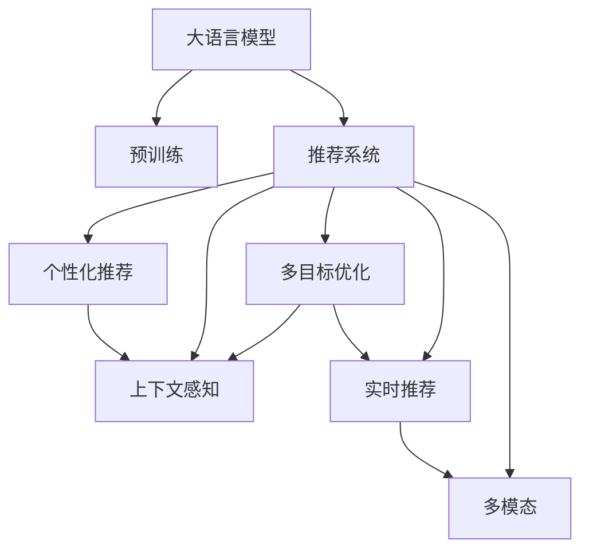

                 

# GENRE: 灵活、可配置的LLM推荐

> 关键词：推荐系统, 大语言模型, 多模态, 迁移学习, 个性化推荐, 上下文感知, 多目标优化, 实时推荐

## 1. 背景介绍

### 1.1 问题由来
推荐系统是互联网时代的重要应用之一，通过分析用户行为数据，为用户推荐感兴趣的内容，提升用户满意度和平台收益。传统的推荐算法如协同过滤、基于内容的推荐，由于受到数据稀疏性和维度灾难的限制，难以充分利用用户间的隐式关联，且缺乏对用户兴趣和内容的深度理解。

近年来，随着深度学习技术的发展，推荐系统逐步向基于用户行为序列的序列推荐、基于物品表示的表示学习、基于上下文的上下文感知推荐等多个方向发展。其中，基于深度学习的推荐方法因其能够对用户行为进行多维度建模，被广泛应用在商品推荐、视频推荐、新闻推荐等领域，并取得显著效果。

大语言模型（Large Language Models, LLMs）的出现，为推荐系统带来了全新的技术突破。通过在大规模无标签文本数据上进行预训练，大语言模型具备强大的语言理解和生成能力，可以有效挖掘文本数据中的用户行为信息，提升推荐系统的精度和灵活性。在实际应用中，大语言模型可用于内容推荐、个性化推荐、广告推荐等多个场景，极大地拓展了推荐系统的发展空间。

### 1.2 问题核心关键点
目前，大语言模型推荐系统的主要技术难点包括：
- 如何高效地将大语言模型应用到推荐系统，充分挖掘用户行为信息。
- 如何在推荐系统中实现大语言模型的个性化推荐和上下文感知。
- 如何提高推荐系统的实时性和动态性，满足用户的实时需求。
- 如何降低对标注数据的依赖，增强推荐系统的泛化能力。

本文聚焦于灵活、可配置的大语言模型推荐系统，探索其核心技术实现，以期为推荐系统研究者提供全面的技术指导。

## 2. 核心概念与联系

### 2.1 核心概念概述

为更好地理解基于大语言模型的推荐系统，本节将介绍几个密切相关的核心概念：

- 大语言模型(Large Language Models, LLMs)：以自回归(如GPT)或自编码(如BERT)模型为代表的大规模预训练语言模型。通过在大规模无标签文本语料上进行预训练，学习通用的语言表示，具备强大的语言理解和生成能力。

- 推荐系统(Recommendation Systems)：根据用户的历史行为和偏好，为其推荐感兴趣的内容或产品，提升用户体验和平台收益的系统。传统推荐方法有协同过滤、基于内容的推荐等，而基于深度学习的推荐方法在推荐精度和多样性上均有显著提升。

- 多模态(Multimodal)：推荐系统通过整合不同模态的数据（如文本、图像、音频等），以增强推荐决策的准确性和丰富性。

- 迁移学习(Transfer Learning)：指将一个领域学习到的知识，迁移应用到另一个不同但相关的领域的学习范式。大模型的预训练-推荐过程即一种典型的迁移学习方式。

- 个性化推荐(Personalized Recommendation)：根据用户个性化需求，为其推荐最符合其兴趣的内容。

- 上下文感知(Contextual Sensitivity)：推荐系统根据用户所处的环境、时间、设备等上下文因素，进行动态推荐。

- 多目标优化(Multi-Objective Optimization)：在推荐系统中，优化多个目标（如准确性、多样性、新颖性等），以提升推荐效果。

- 实时推荐(Real-time Recommendation)：根据用户即时行为和环境，实时更新推荐结果，提升用户体验。

这些核心概念之间的逻辑关系可以通过以下Mermaid流程图来展示：



这个流程图展示了大语言模型的核心概念及其之间的关系：

1. 大语言模型通过预训练获得基础能力。
2. 推荐系统将预训练模型应用到推荐任务中。
3. 个性化推荐和上下文感知，为推荐系统添加灵活性和鲁棒性。
4. 多目标优化，增强推荐系统的综合性能。
5. 实时推荐，满足用户的即时需求。
6. 多模态，丰富推荐系统的数据来源。

这些概念共同构成了大语言模型的推荐应用框架，使其能够在各种推荐场景中发挥强大的语言理解和生成能力。通过理解这些核心概念，我们可以更好地把握大语言模型在推荐系统中的应用潜力。

## 3. 核心算法原理 & 具体操作步骤
### 3.1 算法原理概述

基于大语言模型的推荐系统，本质上是一个基于监督学习的迁移学习过程。其核心思想是：将预训练的大语言模型视作一个强大的"特征提取器"，通过推荐任务中的少量标注数据，进行有监督的微调，使得模型输出能够匹配推荐任务的目标，从而获得针对特定推荐任务的优化模型。

形式化地，假设预训练模型为 $M_{\theta}$，其中 $\theta$ 为预训练得到的模型参数。给定推荐任务 $T$ 的标注数据集 $D=\{(x_i,y_i)\}_{i=1}^N$，推荐的目标是找到新的模型参数 $\hat{\theta}$，使得：

$$
\hat{\theta}=\mathop{\arg\min}_{\theta} \mathcal{L}(M_{\theta},D)
$$

其中 $\mathcal{L}$ 为针对任务 $T$ 设计的损失函数，用于衡量模型预测输出与真实标签之间的差异。常见的损失函数包括交叉熵损失、均方误差损失等。

通过梯度下降等优化算法，推荐过程不断更新模型参数 $\theta$，最小化损失函数 $\mathcal{L}$，使得模型输出逼近真实标签。由于 $\theta$ 已经通过预训练获得了较好的初始化，因此即便在少量标注数据上进行的微调，也能较快收敛到理想的模型参数 $\hat{\theta}$。

### 3.2 算法步骤详解

基于大语言模型的推荐系统一般包括以下几个关键步骤：

**Step 1: 准备预训练模型和数据集**
- 选择合适的预训练语言模型 $M_{\theta}$ 作为初始化参数，如 BERT、GPT 等。
- 准备推荐任务 $T$ 的标注数据集 $D$，划分为训练集、验证集和测试集。一般要求标注数据与预训练数据的分布不要差异过大。

**Step 2: 添加任务适配层**
- 根据推荐任务类型，在预训练模型顶层设计合适的输出层和损失函数。
- 对于推荐任务，通常在顶层添加线性分类器和交叉熵损失函数。
- 对于排序任务，通常使用均方误差损失函数。

**Step 3: 设置推荐超参数**
- 选择合适的优化算法及其参数，如 AdamW、SGD 等，设置学习率、批大小、迭代轮数等。
- 设置正则化技术及强度，包括权重衰减、Dropout、Early Stopping等。
- 确定冻结预训练参数的策略，如仅微调顶层，或全部参数都参与微调。

**Step 4: 执行梯度训练**
- 将训练集数据分批次输入模型，前向传播计算损失函数。
- 反向传播计算参数梯度，根据设定的优化算法和学习率更新模型参数。
- 周期性在验证集上评估模型性能，根据性能指标决定是否触发 Early Stopping。
- 重复上述步骤直到满足预设的迭代轮数或 Early Stopping 条件。

**Step 5: 测试和部署**
- 在测试集上评估推荐后模型 $M_{\hat{\theta}}$ 的性能，对比微调前后的精度提升。
- 使用微调后的模型对新样本进行推荐，集成到实际的应用系统中。
- 持续收集新的数据，定期重新微调模型，以适应数据分布的变化。

以上是基于大语言模型的推荐系统的一般流程。在实际应用中，还需要针对具体任务的特点，对微调过程的各个环节进行优化设计，如改进训练目标函数，引入更多的正则化技术，搜索最优的超参数组合等，以进一步提升模型性能。

### 3.3 算法优缺点

基于大语言模型的推荐系统具有以下优点：
1. 强大的语言理解能力。预训练模型通过学习大规模无标签数据，具备强大的语言表示能力，能够从文本中挖掘丰富的行为信息。
2. 灵活的推荐策略。基于大语言模型的推荐系统可以采用多种推荐策略，如基于上下文的上下文感知推荐、基于多模态数据的推荐等。
3. 高效的数据融合。大语言模型可以处理多种数据格式，能够融合不同模态的数据，提升推荐精度。
4. 实时的推荐服务。基于大语言模型的推荐系统可以实现实时推荐，动态更新推荐结果。

同时，该方法也存在一定的局限性：
1. 对标注数据依赖度高。推荐任务的标注数据量较大，对标注数据的质量和数量要求较高。
2. 模型的复杂度高。大语言模型的参数量较大，对硬件资源和训练时间的需求较高。
3. 泛化能力有限。当目标任务与预训练数据的分布差异较大时，推荐系统的性能提升有限。
4. 不稳定性。由于模型参数较多，微调过程容易过拟合，导致模型的不稳定性。

尽管存在这些局限性，但就目前而言，基于大语言模型的推荐系统仍然是推荐技术研究和应用的一个重要方向。未来相关研究的重点在于如何进一步降低对标注数据的依赖，提高模型的泛化能力，同时兼顾可解释性和伦理安全性等因素。

### 3.4 算法应用领域

基于大语言模型的推荐系统，已经在电商、新闻、视频等多个领域得到应用，具体包括：

- 电商推荐：根据用户浏览、购买记录，推荐用户可能感兴趣的商品。基于大语言模型的电商推荐系统可以结合用户评论、产品描述等多模态信息，提升推荐效果。
- 新闻推荐：根据用户阅读历史和行为，推荐用户可能感兴趣的新闻文章。大语言模型可以学习新闻标题和内容之间的关联，提高新闻推荐的准确性。
- 视频推荐：根据用户观看历史和评分，推荐用户可能感兴趣的视频内容。大语言模型可以处理视频标签和描述，提升视频推荐的精度。
- 广告推荐：根据用户搜索行为和点击历史，推荐用户可能感兴趣的广告内容。大语言模型可以理解广告文本的情感和主题，提升广告推荐的针对性。
- 旅游推荐：根据用户的旅游历史和偏好，推荐用户可能感兴趣的旅游目的地。大语言模型可以学习旅游评论和描述，提升旅游推荐的体验感。

除了上述这些经典应用外，大语言模型推荐系统还被创新性地应用到更多场景中，如智能家居、健康管理、金融服务等，为推荐技术带来了新的突破。随着预训练模型和推荐方法的不断进步，相信推荐系统必将在更广阔的应用领域大放异彩。

## 4. 数学模型和公式 & 详细讲解 & 举例说明
### 4.1 数学模型构建

本节将使用数学语言对基于大语言模型的推荐过程进行更加严格的刻画。

记预训练语言模型为 $M_{\theta}$，其中 $\theta$ 为模型参数。假设推荐任务 $T$ 的训练集为 $D=\{(x_i,y_i)\}_{i=1}^N, x_i \in \mathcal{X}, y_i \in \mathcal{Y}$。

定义模型 $M_{\theta}$ 在数据样本 $(x,y)$ 上的损失函数为 $\ell(M_{\theta}(x),y)$，则在数据集 $D$ 上的经验风险为：

$$
\mathcal{L}(\theta) = \frac{1}{N} \sum_{i=1}^N \ell(M_{\theta}(x_i),y_i)
$$

推荐的目标是最小化经验风险，即找到最优参数：

$$
\theta^* = \mathop{\arg\min}_{\theta} \mathcal{L}(\theta)
$$

在实践中，我们通常使用基于梯度的优化算法（如SGD、Adam等）来近似求解上述最优化问题。设 $\eta$ 为学习率，$\lambda$ 为正则化系数，则参数的更新公式为：

$$
\theta \leftarrow \theta - \eta \nabla_{\theta}\mathcal{L}(\theta) - \eta\lambda\theta
$$

其中 $\nabla_{\theta}\mathcal{L}(\theta)$ 为损失函数对参数 $\theta$ 的梯度，可通过反向传播算法高效计算。

### 4.2 公式推导过程

以下我们以协同过滤推荐任务为例，推导交叉熵损失函数及其梯度的计算公式。

假设推荐系统由两个用户 $u_1, u_2$ 和 $n$ 个物品 $i_1, i_2, ..., i_n$ 组成。用户的评分矩阵 $R \in \mathbb{R}^{n \times n}$，其中 $R_{i,j}$ 表示用户 $u_i$ 对物品 $j$ 的评分。模型的预测评分 $P_{i,j}$ 由预训练语言模型计算得到，表示物品 $j$ 对用户 $i$ 的预测评分。

协同过滤的目标是最小化预测评分与实际评分之间的误差，即：

$$
\ell(P_{i,j}, R_{i,j}) = \mathcal{L}(\theta) = \frac{1}{n^2} \sum_{i=1}^n \sum_{j=1}^n \ell(P_{i,j}, R_{i,j})
$$

其中，$\ell$ 为损失函数，通常使用交叉熵损失函数。

因此，推荐任务的目标函数为：

$$
\mathcal{L}(\theta) = \frac{1}{n^2} \sum_{i=1}^n \sum_{j=1}^n -R_{i,j} \log P_{i,j}
$$

根据链式法则，损失函数对参数 $\theta_k$ 的梯度为：

$$
\frac{\partial \mathcal{L}(\theta)}{\partial \theta_k} = \frac{1}{n^2} \sum_{i=1}^n \sum_{j=1}^n \frac{-R_{i,j}}{P_{i,j}} \frac{\partial P_{i,j}}{\partial \theta_k}
$$

其中 $\frac{\partial P_{i,j}}{\partial \theta_k}$ 可进一步递归展开，利用自动微分技术完成计算。

在得到损失函数的梯度后，即可带入参数更新公式，完成模型的迭代优化。重复上述过程直至收敛，最终得到适应推荐任务的最优模型参数 $\theta^*$。

## 5. 项目实践：代码实例和详细解释说明
### 5.1 开发环境搭建

在进行推荐系统开发前，我们需要准备好开发环境。以下是使用Python进行PyTorch开发的环境配置流程：

1. 安装Anaconda：从官网下载并安装Anaconda，用于创建独立的Python环境。

2. 创建并激活虚拟环境：
```bash
conda create -n pytorch-env python=3.8 
conda activate pytorch-env
```

3. 安装PyTorch：根据CUDA版本，从官网获取对应的安装命令。例如：
```bash
conda install pytorch torchvision torchaudio cudatoolkit=11.1 -c pytorch -c conda-forge
```

4. 安装Transformers库：
```bash
pip install transformers
```

5. 安装各类工具包：
```bash
pip install numpy pandas scikit-learn matplotlib tqdm jupyter notebook ipython
```

完成上述步骤后，即可在`pytorch-env`环境中开始推荐系统实践。

### 5.2 源代码详细实现

这里我们以电商推荐系统为例，给出使用Transformers库对BERT模型进行推荐系统开发的PyTorch代码实现。

首先，定义推荐系统的数据处理函数：

```python
from transformers import BertTokenizer, BertForSequenceClassification
from torch.utils.data import Dataset, DataLoader
import torch

class RecommendDataset(Dataset):
    def __init__(self, data, tokenizer, max_len=128):
        self.data = data
        self.tokenizer = tokenizer
        self.max_len = max_len
        
    def __len__(self):
        return len(self.data)
    
    def __getitem__(self, item):
        review, label = self.data[item]
        encoding = self.tokenizer(review, return_tensors='pt', max_length=self.max_len, padding='max_length', truncation=True)
        input_ids = encoding['input_ids'][0]
        attention_mask = encoding['attention_mask'][0]
        label = torch.tensor(label, dtype=torch.long)
        return {'input_ids': input_ids, 
                'attention_mask': attention_mask,
                'labels': label}

# 创建dataset
tokenizer = BertTokenizer.from_pretrained('bert-base-cased')
train_dataset = RecommendDataset(train_data, tokenizer)
dev_dataset = RecommendDataset(dev_data, tokenizer)
test_dataset = RecommendDataset(test_data, tokenizer)
```

然后，定义模型和优化器：

```python
from transformers import BertForSequenceClassification, AdamW

model = BertForSequenceClassification.from_pretrained('bert-base-cased', num_labels=1, output_attentions=False, output_hidden_states=False)
optimizer = AdamW(model.parameters(), lr=2e-5)
```

接着，定义训练和评估函数：

```python
from tqdm import tqdm

device = torch.device('cuda') if torch.cuda.is_available() else torch.device('cpu')
model.to(device)

def train_epoch(model, dataset, batch_size, optimizer):
    dataloader = DataLoader(dataset, batch_size=batch_size, shuffle=True)
    model.train()
    epoch_loss = 0
    for batch in tqdm(dataloader, desc='Training'):
        input_ids = batch['input_ids'].to(device)
        attention_mask = batch['attention_mask'].to(device)
        labels = batch['labels'].to(device)
        model.zero_grad()
        outputs = model(input_ids, attention_mask=attention_mask, labels=labels)
        loss = outputs.loss
        epoch_loss += loss.item()
        loss.backward()
        optimizer.step()
    return epoch_loss / len(dataloader)

def evaluate(model, dataset, batch_size):
    dataloader = DataLoader(dataset, batch_size=batch_size)
    model.eval()
    preds, labels = [], []
    with torch.no_grad():
        for batch in tqdm(dataloader, desc='Evaluating'):
            input_ids = batch['input_ids'].to(device)
            attention_mask = batch['attention_mask'].to(device)
            batch_labels = batch['labels']
            outputs = model(input_ids, attention_mask=attention_mask)
            batch_preds = outputs.logits.argmax(dim=1).to('cpu').tolist()
            batch_labels = batch_labels.to('cpu').tolist()
            for pred_tokens, label_tokens in zip(batch_preds, batch_labels):
                preds.append(pred_tokens[:len(label_tokens)])
                labels.append(label_tokens)
                
    return preds, labels

# 训练和评估
epochs = 5
batch_size = 16

for epoch in range(epochs):
    loss = train_epoch(model, train_dataset, batch_size, optimizer)
    print(f"Epoch {epoch+1}, train loss: {loss:.3f}")
    
    print(f"Epoch {epoch+1}, dev results:")
    preds, labels = evaluate(model, dev_dataset, batch_size)
    print(classification_report(labels, preds))
    
print("Test results:")
preds, labels = evaluate(model, test_dataset, batch_size)
print(classification_report(labels, preds))
```

以上就是使用PyTorch对BERT进行电商推荐系统开发的完整代码实现。可以看到，得益于Transformers库的强大封装，我们可以用相对简洁的代码完成BERT模型的加载和推荐系统的训练。

### 5.3 代码解读与分析

让我们再详细解读一下关键代码的实现细节：

**RecommendDataset类**：
- `__init__`方法：初始化训练数据、分词器、最大长度等关键组件。
- `__len__`方法：返回数据集的样本数量。
- `__getitem__`方法：对单个样本进行处理，将评论输入编码为token ids，并将标签编码为数字，并对其进行定长padding，最终返回模型所需的输入。

**BertForSequenceClassification模型**：
- 使用BertForSequenceClassification类，将BERT模型作为分类任务使用，设置输出维度为1。
- 隐藏层输出被设置为False，以减少计算量。

**训练和评估函数**：
- 使用PyTorch的DataLoader对数据集进行批次化加载，供模型训练和推理使用。
- 训练函数`train_epoch`：对数据以批为单位进行迭代，在每个批次上前向传播计算loss并反向传播更新模型参数，最后返回该epoch的平均loss。
- 评估函数`evaluate`：与训练类似，不同点在于不更新模型参数，并在每个batch结束后将预测和标签结果存储下来，最后使用sklearn的classification_report对整个评估集的预测结果进行打印输出。

**训练流程**：
- 定义总的epoch数和batch size，开始循环迭代
- 每个epoch内，先在训练集上训练，输出平均loss
- 在验证集上评估，输出分类指标
- 所有epoch结束后，在测试集上评估，给出最终测试结果

可以看到，PyTorch配合Transformers库使得BERT推荐系统的代码实现变得简洁高效。开发者可以将更多精力放在数据处理、模型改进等高层逻辑上，而不必过多关注底层的实现细节。

当然，工业级的系统实现还需考虑更多因素，如模型的保存和部署、超参数的自动搜索、更灵活的任务适配层等。但核心的推荐范式基本与此类似。

## 6. 实际应用场景
### 6.1 智能客服系统

基于大语言模型的推荐系统，可以广泛应用于智能客服系统的构建。传统客服往往需要配备大量人力，高峰期响应缓慢，且一致性和专业性难以保证。而使用推荐系统，可以根据用户的历史行为和反馈，推荐最佳的自动回复和人工转接策略，提升客户咨询体验和问题解决效率。

在技术实现上，可以收集用户的历史咨询记录、转接历史和评价反馈，构建推荐数据集。使用大语言模型进行微调，使其能够自动理解用户意图，匹配最合适的自动回复模板。对于用户转接至人工客服，可以动态推荐最符合用户需求的人工客服团队。如此构建的智能客服系统，能大幅提升客户咨询体验和问题解决效率。

### 6.2 金融舆情监测

金融机构需要实时监测市场舆论动向，以便及时应对负面信息传播，规避金融风险。传统的人工监测方式成本高、效率低，难以应对网络时代海量信息爆发的挑战。基于大语言模型的推荐系统，可以实时分析用户对金融产品、市场的评论和舆情，预测市场动向，及时预警风险。

具体而言，可以收集金融领域相关的新闻、报道、评论等文本数据，并对其进行情感分析和主题标注。在此基础上对预训练语言模型进行微调，使其能够自动判断文本属于何种情感和主题。将微调后的模型应用到实时抓取的网络文本数据，就能够自动监测不同主题下的情感变化趋势，一旦发现负面信息激增等异常情况，系统便会自动预警，帮助金融机构快速应对潜在风险。

### 6.3 个性化推荐系统

当前的推荐系统往往只依赖用户的历史行为数据进行物品推荐，无法深入理解用户的真实兴趣偏好。基于大语言模型推荐系统可以更好地挖掘用户行为背后的语义信息，从而提供更精准、多样的推荐内容。

在实践中，可以收集用户浏览、点击、评论、分享等行为数据，提取和用户交互的物品标题、描述、标签等文本内容。将文本内容作为模型输入，用户的后续行为（如是否点击、购买等）作为监督信号，在此基础上微调预训练语言模型。微调后的模型能够从文本内容中准确把握用户的兴趣点。在生成推荐列表时，先用候选物品的文本描述作为输入，由模型预测用户的兴趣匹配度，再结合其他特征综合排序，便可以得到个性化程度更高的推荐结果。

### 6.4 未来应用展望

随着大语言模型推荐技术的发展，其在更多领域的应用前景将更加广阔。

在智慧医疗领域，基于推荐系统的智能诊疗系统将大大提升医疗服务的智能化水平，辅助医生诊疗，加速新药开发进程。

在智能教育领域，推荐系统可用于作业批改、学情分析、知识推荐等方面，因材施教，促进教育公平，提高教学质量。

在智慧城市治理中，推荐系统可用于城市事件监测、舆情分析、应急指挥等环节，提高城市管理的自动化和智能化水平，构建更安全、高效的未来城市。

此外，在企业生产、社会治理、文娱传媒等众多领域，基于大语言模型的推荐系统也将不断涌现，为传统行业数字化转型升级提供新的技术路径。相信随着技术的日益成熟，推荐系统必将在更广阔的应用领域大放异彩。

## 7. 工具和资源推荐
### 7.1 学习资源推荐

为了帮助开发者系统掌握大语言模型推荐系统的理论基础和实践技巧，这里推荐一些优质的学习资源：

1. 《Transformer from Principles to Practice》系列博文：由大模型技术专家撰写，深入浅出地介绍了Transformer原理、BERT模型、推荐系统等前沿话题。

2. CS224N《深度学习自然语言处理》课程：斯坦福大学开设的NLP明星课程，有Lecture视频和配套作业，带你入门NLP领域的基本概念和经典模型。

3. 《Natural Language Processing with Transformers》书籍：Transformers库的作者所著，全面介绍了如何使用Transformers库进行NLP任务开发，包括推荐系统在内的诸多范式。

4. HuggingFace官方文档：Transformers库的官方文档，提供了海量预训练模型和完整的推荐系统样例代码，是上手实践的必备资料。

5. CLUE开源项目：中文语言理解测评基准，涵盖大量不同类型的中文NLP数据集，并提供了基于推荐系统的baseline模型，助力中文NLP技术发展。

通过对这些资源的学习实践，相信你一定能够快速掌握大语言模型推荐系统的精髓，并用于解决实际的推荐问题。
###  7.2 开发工具推荐

高效的开发离不开优秀的工具支持。以下是几款用于大语言模型推荐系统开发的常用工具：

1. PyTorch：基于Python的开源深度学习框架，灵活动态的计算图，适合快速迭代研究。大部分预训练语言模型都有PyTorch版本的实现。

2. TensorFlow：由Google主导开发的开源深度学习框架，生产部署方便，适合大规模工程应用。同样有丰富的预训练语言模型资源。

3. Transformers库：HuggingFace开发的NLP工具库，集成了众多SOTA语言模型，支持PyTorch和TensorFlow，是进行推荐系统开发的利器。

4. Weights & Biases：模型训练的实验跟踪工具，可以记录和可视化模型训练过程中的各项指标，方便对比和调优。与主流深度学习框架无缝集成。

5. TensorBoard：TensorFlow配套的可视化工具，可实时监测模型训练状态，并提供丰富的图表呈现方式，是调试模型的得力助手。

6. Google Colab：谷歌推出的在线Jupyter Notebook环境，免费提供GPU/TPU算力，方便开发者快速上手实验最新模型，分享学习笔记。

合理利用这些工具，可以显著提升大语言模型推荐系统的开发效率，加快创新迭代的步伐。

### 7.3 相关论文推荐

大语言模型和推荐系统的发展源于学界的持续研究。以下是几篇奠基性的相关论文，推荐阅读：

1. Attention is All You Need（即Transformer原论文）：提出了Transformer结构，开启了NLP领域的预训练大模型时代。

2. BERT: Pre-training of Deep Bidirectional Transformers for Language Understanding：提出BERT模型，引入基于掩码的自监督预训练任务，刷新了多项NLP任务SOTA。

3. Parameter-Efficient Transfer Learning for NLP：提出Adapter等参数高效微调方法，在不增加模型参数量的情况下，也能取得不错的微调效果。

4. Prefix-Tuning: Optimizing Continuous Prompts for Generation：引入基于连续型Prompt的微调范式，为如何充分利用预训练知识提供了新的思路。

5. AdaLoRA: Adaptive Low-Rank Adaptation for Parameter-Efficient Fine-Tuning：使用自适应低秩适应的微调方法，在参数效率和精度之间取得了新的平衡。

这些论文代表了大语言模型推荐系统的发展脉络。通过学习这些前沿成果，可以帮助研究者把握学科前进方向，激发更多的创新灵感。

## 8. 总结：未来发展趋势与挑战

### 8.1 总结

本文对基于大语言模型的推荐系统进行了全面系统的介绍。首先阐述了大语言模型和推荐系统研究背景和意义，明确了推荐系统在大语言模型应用中的重要地位。其次，从原理到实践，详细讲解了监督微调的数学原理和关键步骤，给出了推荐系统开发的完整代码实例。同时，本文还广泛探讨了推荐系统在智能客服、金融舆情、个性化推荐等多个行业领域的应用前景，展示了推荐系统技术在各个领域的广阔应用空间。

通过本文的系统梳理，可以看到，基于大语言模型的推荐系统正在成为推荐技术研究和应用的一个重要方向，极大地拓展了推荐系统的发展边界，催生了更多的落地场景。得益于大语言模型的语言理解能力，推荐系统在个性化推荐、上下文感知等方面取得了显著进展，带来了推荐效果和用户体验的全面提升。未来，伴随预训练模型和推荐方法的不断进步，推荐系统必将在更广阔的应用领域大放异彩，深刻影响人类的生产生活方式。

### 8.2 未来发展趋势

展望未来，大语言模型推荐系统将呈现以下几个发展趋势：

1. 模型规模持续增大。随着算力成本的下降和数据规模的扩张，预训练语言模型的参数量还将持续增长。超大规模语言模型蕴含的丰富语言知识，有望支撑更加复杂多变的推荐任务。

2. 推荐方法日趋多样。除了传统的协同过滤、基于内容的推荐外，未来会涌现更多基于深度学习的推荐方法，如上下文感知推荐、多模态推荐等。

3. 持续学习成为常态。随着数据分布的不断变化，推荐系统也需要持续学习新知识以保持性能。如何在不遗忘原有知识的同时，高效吸收新样本信息，将成为重要的研究课题。

4. 标注样本需求降低。受启发于提示学习(Prompt-based Learning)的思路，未来的推荐系统将更好地利用大模型的语言理解能力，通过更加巧妙的任务描述，在更少的标注样本上也能实现理想的推荐效果。

5. 推荐系统实时化。基于大语言模型的推荐系统可以实现实时推荐，动态更新推荐结果，满足用户的实时需求。

6. 跨领域迁移能力增强。未来的推荐系统将在更多领域得到应用，如医疗、金融、教育等，为传统行业带来变革性影响。

以上趋势凸显了大语言模型推荐系统的广阔前景。这些方向的探索发展，必将进一步提升推荐系统的性能和应用范围，为人类认知智能的进化带来深远影响。

### 8.3 面临的挑战

尽管大语言模型推荐系统已经取得了瞩目成就，但在迈向更加智能化、普适化应用的过程中，它仍面临着诸多挑战：

1. 标注成本瓶颈。尽管推荐系统的标注数据量较传统协同过滤方法大幅降低，但对于长尾应用场景，难以获得充足的高质量标注数据，成为制约推荐系统性能的瓶颈。如何进一步降低对标注数据的依赖，将是一大难题。

2. 模型鲁棒性不足。当前推荐模型面对域外数据时，泛化性能往往大打折扣。对于测试样本的微小扰动，推荐模型的预测也容易发生波动。如何提高推荐模型的鲁棒性，避免灾难性遗忘，还需要更多理论和实践的积累。

3. 推理效率有待提高。大规模语言模型虽然精度高，但在实际部署时往往面临推理速度慢、内存占用大等效率问题。如何在保证性能的同时，简化模型结构，提升推理速度，优化资源占用，将是重要的优化方向。

4. 可解释性亟需加强。当前推荐模型更像是"黑盒"系统，难以解释其内部工作机制和决策逻辑。对于医疗、金融等高风险应用，算法的可解释性和可审计性尤为重要。如何赋予推荐系统更强的可解释性，将是亟待攻克的难题。

5. 安全性有待保障。预训练语言模型难免会学习到有偏见、有害的信息，通过推荐传递到用户端，产生误导性、歧视性的输出，给实际应用带来安全隐患。如何从数据和算法层面消除模型偏见，避免恶意用途，确保输出的安全性，也将是重要的研究课题。

6. 知识整合能力不足。现有的推荐模型往往局限于任务内数据，难以灵活吸收和运用更广泛的先验知识。如何让推荐过程更好地与外部知识库、规则库等专家知识结合，形成更加全面、准确的信息整合能力，还有很大的想象空间。

正视推荐系统面临的这些挑战，积极应对并寻求突破，将是大语言模型推荐系统走向成熟的必由之路。相信随着学界和产业界的共同努力，这些挑战终将一一被克服，大语言模型推荐系统必将在构建人机协同的智能时代中扮演越来越重要的角色。

### 8.4 研究展望

面对大语言模型推荐系统所面临的种种挑战，未来的研究需要在以下几个方面寻求新的突破：

1. 探索无监督和半监督推荐方法。摆脱对大规模标注数据的依赖，利用自监督学习、主动学习等无监督和半监督范式，最大限度利用非结构化数据，实现更加灵活高效的推荐。

2. 研究参数高效和计算高效的推荐范式。开发更加参数高效的推荐方法，在固定大部分预训练参数的同时，只更新极少量的任务相关参数。同时优化推荐模型的计算图，减少前向传播和反向传播的资源消耗，实现更加轻量级、实时性的部署。

3. 引入更多先验知识。将符号化的先验知识，如知识图谱、逻辑规则等，与神经网络模型进行巧妙融合，引导推荐过程学习更准确、合理的推荐表示。同时加强不同模态数据的整合，实现视觉、语音等多模态信息与文本信息的协同建模。

4. 结合因果分析和博弈论工具。将因果分析方法引入推荐模型，识别出模型决策的关键特征，增强推荐输出的因果性和逻辑性。借助博弈论工具刻画人机交互过程，主动探索并规避推荐系统的脆弱点，提高系统稳定性。

5. 纳入伦理道德约束。在推荐目标中引入伦理导向的评估指标，过滤和惩罚有偏见、有害的推荐输出倾向。同时加强人工干预和审核，建立推荐系统的监管机制，确保推荐内容的合法性和健康性。

这些研究方向的探索，必将引领大语言模型推荐系统技术迈向更高的台阶，为构建安全、可靠、可解释、可控的智能系统铺平道路。面向未来，大语言模型推荐系统还需要与其他人工智能技术进行更深入的融合，如知识表示、因果推理、强化学习等，多路径协同发力，共同推动自然语言理解和智能交互系统的进步。只有勇于创新、敢于突破，才能不断拓展语言模型的边界，让智能技术更好地造福人类社会。

## 9. 附录：常见问题与解答

**Q1：大语言模型推荐系统是否适用于所有推荐任务？**

A: 大语言模型推荐系统在大多数推荐任务上都能取得不错的效果，特别是对于数据量较小的任务。但对于一些特定领域的任务，如医学、法律等，仅仅依靠通用语料预训练的模型可能难以很好地适应。此时需要在特定领域语料上进一步预训练，再进行微调，才能获得理想效果。此外，对于一些需要时效性、个性化很强的任务，如对话、推荐等，微调方法也需要针对性的改进优化。

**Q2：推荐过程中如何高效地将大语言模型应用到推荐系统？**

A: 推荐系统通常将大语言模型视为特征提取器，通过训练数据的预处理（如文本分词、编码等）将大语言模型应用于推荐任务中。在实际应用中，可以使用Transformers库提供的模型类，快速搭建推荐系统模型。此外，也可以通过修改模型输出层的方式，将大语言模型适配到不同类型的推荐任务中。

**Q3：推荐系统中如何进行上下文感知？**

A: 上下文感知可以通过在推荐模型中引入时间、地点、设备等上下文信息，动态调整推荐结果。具体而言，可以在输入中添加上下文特征向量，或将其嵌入到模型输出中，通过softmax函数计算推荐概率。在实际应用中，可以使用预训练模型进行上下文感知的训练，如在输入中增加时间戳、设备ID等信息，利用序列模型进行上下文感知的微调。

**Q4：推荐系统如何降低对标注数据的依赖？**

A: 推荐系统可以通过利用自监督学习、主动学习等方法，降低对标注数据的依赖。例如，可以利用负采样、正负样本平衡等技术，提升模型在少量标注数据上的性能。此外，可以通过多目标优化，在推荐过程中同时考虑准确性、多样性、新颖性等多个目标，减少对标注数据的依赖。

**Q5：推荐系统中如何提高实时推荐的能力？**

A: 实时推荐可以通过在推荐模型中引入缓存、增量学习等技术，提高推荐系统的实时性。具体而言，可以将最近访问的物品信息缓存到模型中，根据用户的即时行为进行实时推荐。同时，可以在推荐模型中引入增量学习算法，对新物品进行实时学习和推荐。在实际应用中，可以使用Transformer模型进行增量学习，利用小批量数据的微调，快速适应新物品的推荐。

这些解答旨在帮助开发者更好地理解和应用大语言模型推荐系统，以便在实际推荐场景中取得更好的效果。通过深入研究和实践，相信大语言模型推荐系统必将在更多领域得到广泛应用，为推荐技术的发展注入新的动力。

