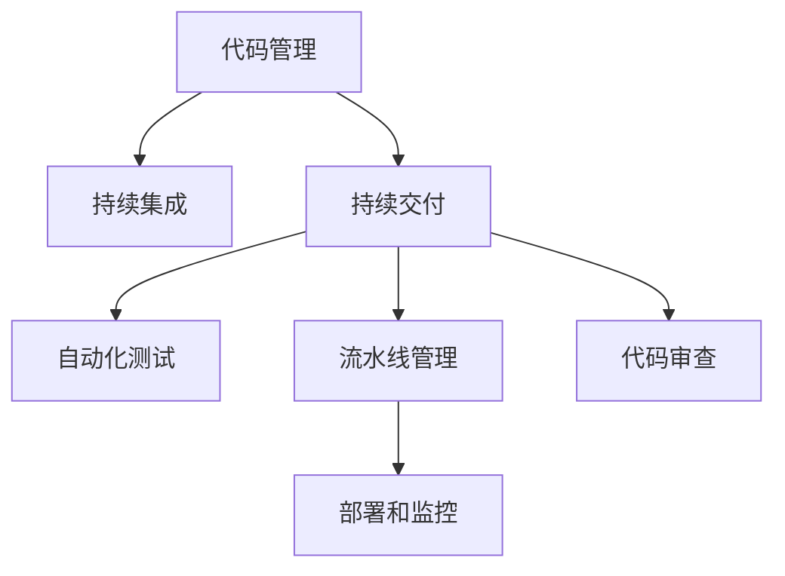

                 

# GitLab CI/CD最佳实践

> 关键词：GitLab, CI/CD, DevOps, 持续集成, 持续交付, 自动化测试, 流水线, 版本控制, 代码审查, 部署, 监控

## 1. 背景介绍

### 1.1 问题由来
随着软件项目规模的不断增大，复杂的系统架构和频繁的迭代需求使得传统的软件开发流程显得笨重而低效。如何提高软件开发的效率，减少人为错误，成为众多IT团队关注的焦点。持续集成（Continuous Integration, CI）和持续交付（Continuous Delivery, CD）应运而生，成为提升软件开发质量和效率的有效手段。

在CI/CD实践的推动下，开发、测试和运维团队逐渐形成了以自动化和协同为核心的DevOps文化，使得软件项目能够快速响应市场需求，同时保持高质量和可靠性。

GitLab作为一款领先的DevOps平台，提供了强大的CI/CD功能，支持从代码管理、持续集成、持续交付到运维监控的全生命周期管理。本文将详细介绍GitLab在CI/CD方面的最佳实践，帮助读者全面掌握如何使用GitLab构建高效、可靠的软件开发和运维流程。

### 1.2 问题核心关键点
本文将从以下几个关键点入手，详细介绍GitLab CI/CD的最佳实践：

1. **代码管理**：如何高效管理代码，包括代码版本控制、权限管理、分支策略等。
2. **持续集成**：如何通过自动化测试和构建，提高代码的质量和稳定性。
3. **持续交付**：如何在生产环境之前进行全面的质量检查和准备，确保稳定部署。
4. **自动化测试**：如何设计高效、全面的自动化测试策略，覆盖不同的功能模块和边界条件。
5. **流水线管理**：如何构建并维护可扩展、可复用的CI/CD流水线。
6. **代码审查**：如何有效地进行代码审查，确保代码质量和可维护性。
7. **部署和监控**：如何安全、可靠地部署应用程序，并持续监控其运行状态。

### 1.3 问题研究意义
深入理解GitLab CI/CD的最佳实践，对提升软件开发和运维效率具有重要意义：

1. **提高开发效率**：通过自动化测试和构建，减少手动操作，加快迭代速度。
2. **保证代码质量**：通过全面的测试策略和代码审查机制，提高代码可靠性和可维护性。
3. **优化资源利用**：通过流水线和容器化技术，提高资源的利用率和部署的效率。
4. **促进团队协作**：通过DevOps文化，促进开发、测试和运维团队的协同合作，提升团队凝聚力。
5. **保障系统稳定性**：通过持续监控和自动化部署，确保系统的稳定运行，减少人为错误。

## 2. 核心概念与联系

### 2.1 核心概念概述

为更好地理解GitLab CI/CD的最佳实践，本节将介绍几个密切相关的核心概念：

- **持续集成**（Continuous Integration, CI）：指在每次代码提交后自动执行一系列测试和构建流程，以确保代码的正确性和稳定性。
- **持续交付**（Continuous Delivery, CD）：在通过持续集成的基础上，进一步自动化部署流程，确保代码能够快速、可靠地部署到生产环境。
- **DevOps**：一种以协作、自动化、持续优化为核心的软件开发和运维方法，强调开发和运维团队的紧密合作。
- **自动化测试**：通过自动化脚本和工具，对代码进行全面的测试，提高测试效率和覆盖率。
- **流水线**：一系列自动化任务的有序组合，覆盖代码提交、测试、构建、部署等环节，确保开发流程的连贯性和可重复性。
- **代码审查**：通过代码审查机制，对代码进行集体评审和改进，提升代码质量和可维护性。
- **部署和监控**：将代码安全、可靠地部署到生产环境，并通过持续监控，确保系统的高可用性和稳定性。

这些核心概念之间的逻辑关系可以通过以下Mermaid流程图来展示：



这个流程图展示了几大核心概念及其之间的关系：

1. **代码管理**是基础，通过版本控制和权限管理，确保代码的安全性和可追溯性。
2. **持续集成**和**持续交付**是关键流程，通过自动化测试和部署，提升开发效率和软件质量。
3. **自动化测试**和**流水线管理**是具体手段，通过流程设计和工具选择，实现高效、可重复的开发和测试流程。
4. **代码审查**是质量保障机制，通过集体评审，提升代码质量和团队协作水平。
5. **部署和监控**是最终目标，通过自动化部署和持续监控，确保系统的高效运行和稳定性。

这些概念共同构成了GitLab CI/CD的完整实践框架，助力企业在软件开发和运维过程中实现高效、可靠和持续优化的目标。

## 3. 核心算法原理 & 具体操作步骤
### 3.1 算法原理概述

GitLab CI/CD的核心算法原理基于流水线和自动化工具的设计和配置。其主要思想是通过定义一系列自动化任务（Job），将代码管理、持续集成、持续交付、自动化测试、代码审查、部署和监控等环节有机整合，形成可重复、可扩展的软件开发和运维流程。

具体而言，GitLab CI/CD的算法流程包括：

1. **代码提交**：开发者通过GitLab将代码提交到版本库。
2. **持续集成**：GitLab自动触发持续集成流程，执行自动化测试和构建任务。
3. **持续交付**：通过自动化部署和测试，确保代码能够快速、可靠地部署到生产环境。
4. **监控和反馈**：持续监控系统运行状态，并根据反馈调整优化流程。

### 3.2 算法步骤详解

**Step 1: 准备GitLab环境**
- 在GitLab上创建项目仓库，并配置必要的权限和分支策略。
- 安装并配置GitLab CI/CD所需的各种插件和工具，如Jenkins、GitHub等。

**Step 2: 配置CI/CD流水线**
- 在项目中创建CI/CD配置文件，定义各环节的任务和依赖关系。
- 配置持续集成触发器，如每次提交、定时任务等。
- 定义持续交付的部署策略，如自动部署、手动部署等。

**Step 3: 添加自动化测试任务**
- 在流水线中引入自动化测试任务，使用工具如Selenium、JUnit等进行功能测试和性能测试。
- 根据测试结果，设置通过测试才能进入下一环节的规则。

**Step 4: 实现持续交付**
- 配置部署工具，如Jenkins、Ansible等，自动化部署代码到生产环境。
- 设置环境验证和回滚机制，确保部署的可靠性和可逆性。

**Step 5: 设置监控和反馈**
- 使用监控工具如Prometheus、Grafana等，实时监控系统运行状态。
- 根据监控数据，设置告警和自动修复机制，确保系统的稳定性和可维护性。

### 3.3 算法优缺点

GitLab CI/CD的优势包括：

1. **高效**：通过自动化流程和工具，大幅减少手动操作，提高开发和运维效率。
2. **可靠**：通过全面测试和部署策略，确保代码质量和系统稳定性。
3. **可扩展**：通过模块化的流水线设计，支持灵活扩展和定制化需求。
4. **透明**：通过持续集成和交付，使开发和运维团队对代码变更的进展和结果有清晰的了解。

同时，也存在一些局限性：

1. **学习曲线陡峭**：初次接触GitLab CI/CD的团队需要一定时间进行学习和配置。
2. **依赖外部工具**：需要安装和配置多种自动化工具，可能增加系统复杂性。
3. **资源消耗较大**：大规模项目可能对计算资源和网络带宽有较高要求。
4. **自定义能力有限**：部分配置和插件需要手动编写脚本，灵活性有限。

### 3.4 算法应用领域

GitLab CI/CD的应用领域非常广泛，几乎涵盖软件开发和运维的各个环节。以下是几个典型的应用场景：

1. **企业内部应用开发**：通过GitLab管理代码，自动化测试和部署，确保代码质量和系统稳定性。
2. **开源项目协作**：通过GitLab进行代码协作和版本控制，自动集成和部署，加速开源项目的发展和创新。
3. **云平台管理**：通过GitLab集成云平台如AWS、Azure等，实现自动化部署和监控，提高云资源的利用率。
4. **DevOps实践**：通过GitLab推动DevOps文化，促进开发、测试和运维团队的协同合作，提升团队效率和质量。
5. **持续集成与交付**：通过GitLab构建全面的CI/CD流程，加速软件迭代和发布。

## 4. 数学模型和公式 & 详细讲解 & 举例说明
### 4.1 数学模型构建

为了更好地理解GitLab CI/CD的工作原理，本节将从数学模型的角度进行详细讲解。

假设软件开发项目由多个模块组成，每个模块对应一个任务（Job），任务之间的依赖关系由DAG图表示。设任务集合为 $\mathcal{J}=\{J_1, J_2, \ldots, J_n\}$，任务 $J_i$ 依赖于其前置任务集合 $\mathcal{D}_i \subseteq \mathcal{J}$，任务 $J_i$ 的执行时间为 $T_i$。

定义任务 $J_i$ 的执行过程为 $J_i: X_i \rightarrow Y_i$，其中 $X_i$ 为任务的输入，$Y_i$ 为任务的输出。任务 $J_i$ 的执行结果为 $R_i = f(J_i, X_i)$，其中 $f$ 为任务执行函数。

假设任务 $J_i$ 的执行结果需要经过测试和验证，设测试结果为 $T_i$，验证结果为 $V_i$，则任务 $J_i$ 的最终结果为 $R'_i = g(R_i, T_i, V_i)$，其中 $g$ 为综合函数。

### 4.2 公式推导过程

以一个简单的持续集成和持续交付流程为例，进行数学模型推导。

假设开发人员提交代码到版本库，触发持续集成流程，执行测试和构建任务，得到测试结果 $T$ 和构建结果 $B$。设持续集成的执行时间为 $T_s$，测试执行时间为 $T_t$，构建执行时间为 $T_b$。

定义持续集成的执行过程为 $CI: \{代码提交\} \rightarrow \{测试结果, 构建结果\}$，即：

$$
CI = f(代码提交, T_s, T_t, T_b)
$$

其中 $f$ 为持续集成执行函数。

持续集成的执行结果为 $R_{CI} = f(代码提交, T_s, T_t, T_b)$，即：

$$
R_{CI} = \{T, B\}
$$

通过持续集成得到的测试结果 $T$ 和构建结果 $B$，进入持续交付流程。持续交付执行时间为 $T_d$，部署时间为 $T_{dep}$。

定义持续交付的执行过程为 $CD: \{测试结果, 构建结果\} \rightarrow 部署结果$，即：

$$
CD = f(T, B, T_d, T_{dep})
$$

其中 $f$ 为持续交付执行函数。

持续交付的执行结果为 $R_{CD} = f(T, B, T_d, T_{dep})$，即：

$$
R_{CD} = 部署结果
$$

### 4.3 案例分析与讲解

以一个实际的持续集成和持续交付案例为例，进行详细分析：

1. **项目背景**：一家互联网公司开发一个电商应用，项目由多个模块组成，包括用户管理、商品管理、订单管理等。每个模块都需要定期发布新功能。

2. **持续集成流程**：每次代码提交到GitLab后，触发持续集成流程，执行自动化测试和构建任务。测试任务包括单元测试、集成测试、功能测试等。构建任务包括编译、打包、部署等。

3. **持续交付流程**：通过持续集成得到的测试结果和构建结果，进入持续交付流程。使用Jenkins自动化部署代码到生产环境，并进行环境验证和回滚机制。

4. **监控和反馈**：通过Prometheus和Grafana等监控工具，实时监控系统运行状态，设置告警和自动修复机制，确保系统的稳定性和可维护性。

## 5. 项目实践：代码实例和详细解释说明
### 5.1 开发环境搭建

在进行GitLab CI/CD实践前，我们需要准备好开发环境。以下是使用Python进行GitLab CI/CD开发的环境配置流程：

1. 安装GitLab：从官网下载并安装GitLab Community Edition或Enterprise Edition。
2. 安装和配置GitLab CI/CD所需的各种插件和工具，如Jenkins、GitHub等。
3. 创建并激活虚拟环境：
```bash
conda create -n gitlab-env python=3.8 
conda activate gitlab-env
```

4. 安装必要的Python库：
```bash
pip install flask requests git
```

5. 创建GitLab项目并配置CI/CD：
```bash
git clone https://gitlab.com/<username>/<project>.git
cd <project>
git lab init
git lab up
```

### 5.2 源代码详细实现

下面以一个简单的GitLab CI/CD配置文件为例，展示如何进行CI/CD流程的定义和配置。

首先，创建一个.gitlab-ci.yml配置文件：

```yml
# 定义持续集成流程
stages:
  - build
  - test
  - deploy

jobs:
  build:
    stage: build
    script:
      - echo "开始构建"
      - ./gradlew build
      - echo "构建完成"

  test:
    stage: test
    needs: build
    script:
      - echo "开始测试"
      - ./mvn install
      - echo "测试完成"

  deploy:
    stage: deploy
    needs: test
    script:
      - echo "开始部署"
      - ./gradlew deploy
      - echo "部署完成"
```

然后，定义测试任务：

```yml
# 定义测试任务
test:
  stage: test
  script:
    - echo "开始测试"
    - ./mvn install
    - echo "测试完成"
```

接着，定义部署任务：

```yml
# 定义部署任务
deploy:
  stage: deploy
  script:
    - echo "开始部署"
    - ./gradlew deploy
    - echo "部署完成"
```

最后，提交配置文件到GitLab并触发CI/CD流程：

```bash
git add .gitlab-ci.yml
git commit -m "添加CI/CD配置"
git push origin master
```

以上就是一个简单的GitLab CI/CD配置示例。通过定义任务和脚本，实现从代码提交到测试、构建、部署的完整流程。

### 5.3 代码解读与分析

让我们再详细解读一下关键代码的实现细节：

**.gitlab-ci.yml文件**：
- `stages`：定义任务的执行顺序，支持多个阶段。
- `jobs`：定义具体任务，包括任务名称、执行阶段、执行脚本等。
- `needs`：定义任务之间的依赖关系，确保前序任务完成后，才能进入后续任务。

**测试任务脚本**：
- 使用 `echo` 命令输出测试进度。
- 使用 `mvn install` 命令执行Maven构建和测试。
- 测试完成后输出完成信息。

**部署任务脚本**：
- 使用 `echo` 命令输出部署进度。
- 使用 `gradlew deploy` 命令执行Gradle部署。
- 部署完成后输出完成信息。

在GitLab中，CI/CD流程的配置可以通过可视化界面进行，也可以在代码中直接定义，更加灵活和可扩展。

### 5.4 运行结果展示

通过GitLab的CI/CD功能，可以实时监控任务的执行状态，并展示任务的结果。在项目主页的CI/CD部分，可以查看每个任务的执行细节，包括日志、测试结果、构建状态等。

## 6. 实际应用场景
### 6.1 企业内部应用开发

在企业内部应用开发中，GitLab CI/CD可以显著提高开发效率和软件质量。具体应用场景包括：

1. **版本管理**：通过GitLab管理代码，确保版本控制的安全性和可追溯性。
2. **持续集成**：自动执行代码测试和构建任务，快速发现和修复问题。
3. **持续交付**：自动化部署代码到生产环境，确保系统的稳定性和可靠性。
4. **代码审查**：通过GitLab进行代码审查，提升代码质量和团队协作水平。

### 6.2 开源项目协作

开源项目的协作和版本控制也是GitLab CI/CD的重要应用场景。具体应用场景包括：

1. **代码协作**：通过GitLab进行代码协作和版本控制，确保代码变更的透明性和可追踪性。
2. **持续集成**：自动化执行测试任务，确保代码变更的正确性和稳定性。
3. **持续交付**：自动化部署代码到公共仓库或生产环境，确保开源项目的快速发布和更新。
4. **社区反馈**：通过GitLab的社区功能，收集用户反馈和建议，促进项目的持续改进。

### 6.3 云平台管理

云平台管理也是GitLab CI/CD的重要应用场景。具体应用场景包括：

1. **资源部署**：通过GitLab CI/CD集成云平台如AWS、Azure等，实现自动化部署和资源管理。
2. **环境验证**：使用自动化测试工具，验证部署环境的配置和性能。
3. **回滚机制**：设置环境回滚机制，确保系统的稳定性和可维护性。
4. **监控和报警**：通过GitLab的监控工具，实时监控云资源状态，设置告警和自动修复机制。

## 7. 工具和资源推荐
### 7.1 学习资源推荐

为了帮助开发者系统掌握GitLab CI/CD的理论基础和实践技巧，这里推荐一些优质的学习资源：

1. **GitLab官方文档**：GitLab的官方文档提供了全面的CI/CD功能介绍和操作指南。
2. **GitLab DevOps手册**：GitLab出版的DevOps手册，详细介绍了DevOps实践和GitLab的最佳实践。
3. **GitLab Continuous Integration with Jenkins**：一本关于GitLab与Jenkins集成的书籍，帮助开发者深入理解CI/CD的实现和配置。
4. **GitLab CI/CD教程**：GitLab官方提供的在线教程，覆盖了从基础到高级的CI/CD功能介绍。
5. **GitLab CI/CD最佳实践指南**：GitLab社区发布的最佳实践指南，包含大量的案例和经验分享。

通过对这些资源的学习实践，相信你一定能够快速掌握GitLab CI/CD的精髓，并用于解决实际的开发和运维问题。

### 7.2 开发工具推荐

高效的开发离不开优秀的工具支持。以下是几款用于GitLab CI/CD开发的常用工具：

1. **Jenkins**：一款流行的自动化工具，支持与GitLab的深度集成，提供了丰富的插件和扩展功能。
2. **Gradle**：一个开源的构建自动化工具，支持多种编程语言和平台的构建任务。
3. **Docker**：一个容器化平台，帮助构建和管理可移植的应用程序。
4. **Prometheus**：一个开源的监控系统，提供实时监控和告警功能。
5. **Grafana**：一个开源的数据可视化工具，提供丰富的图表和仪表盘。
6. **Jira**：一个项目管理工具，与GitLab深度集成，提供任务管理和问题追踪功能。

合理利用这些工具，可以显著提升GitLab CI/CD的开发效率，加快创新迭代的步伐。

### 7.3 相关论文推荐

GitLab CI/CD的发展源于学界的持续研究。以下是几篇奠基性的相关论文，推荐阅读：

1. **CI/CD in Practice**：一篇关于CI/CD实践的综述论文，详细介绍了CI/CD的实现和应用。
2. **Continuous Integration: A Survey**：一篇关于CI的综述论文，介绍了CI的历史、技术和趋势。
3. **Continuous Deployment: Practices and Experiences**：一篇关于CD的综述论文，介绍了CD的实践和经验。
4. **CI/CD for Software Engineering**：一篇关于DevOps的综述论文，介绍了DevOps的核心思想和最佳实践。

这些论文代表了大规模软件系统构建和部署的最新研究进展，为GitLab CI/CD提供了重要的理论基础和实践指导。

## 8. 总结：未来发展趋势与挑战
### 8.1 研究成果总结

本文对GitLab CI/CD的最佳实践进行了全面系统的介绍。首先阐述了GitLab在CI/CD方面的优势和应用场景，明确了CI/CD在提升软件开发效率和质量方面的独特价值。其次，从原理到实践，详细讲解了GitLab CI/CD的数学模型和操作步骤，给出了GitLab CI/CD任务的详细配置示例。同时，本文还广泛探讨了GitLab CI/CD在企业内部应用、开源项目协作、云平台管理等多个领域的应用前景，展示了GitLab CI/CD的强大功能和广泛适用性。此外，本文精选了GitLab CI/CD的学习资源和开发工具，力求为读者提供全方位的技术指引。

通过本文的系统梳理，可以看到，GitLab CI/CD已经成为了软件开发和运维的重要范式，极大地提升了软件开发和运维的效率和质量。未来，伴随DevOps文化的深入推广和GitLab的持续创新，GitLab CI/CD必将在更多的企业中落地应用，为软件开发和运维带来革命性的变革。

### 8.2 未来发展趋势

展望未来，GitLab CI/CD的发展趋势如下：

1. **集成更广泛的工具链**：随着DevOps文化的发展，GitLab将更加深入集成各种开发和运维工具，提升整个软件开发和运维链条的自动化水平。
2. **支持更多平台和环境**：GitLab将支持更多云平台和操作系统，提供更加灵活和可扩展的CI/CD功能。
3. **引入更多的持续交付特性**：持续交付将成为未来的主流，GitLab将提供更加全面的持续交付工具和策略，提升系统部署的稳定性和可靠性。
4. **强化安全性和合规性**：随着安全性和合规性要求的提高，GitLab将加强对代码审计、日志记录、安全扫描等功能的支持，确保系统的安全性和合规性。
5. **推动持续学习与改进**：GitLab将引入机器学习和数据分析技术，优化CI/CD流程，提升开发和运维效率。

### 8.3 面临的挑战

尽管GitLab CI/CD已经取得了显著成效，但在迈向更加智能化、普适化应用的过程中，它仍面临着诸多挑战：

1. **学习曲线陡峭**：初次接触GitLab CI/CD的团队需要一定时间进行学习和配置。
2. **依赖外部工具**：需要安装和配置多种自动化工具，可能增加系统复杂性。
3. **资源消耗较大**：大规模项目可能对计算资源和网络带宽有较高要求。
4. **自定义能力有限**：部分配置和插件需要手动编写脚本，灵活性有限。
5. **安全性有待加强**：随着集成工具的增多，系统安全性的保障成为新的挑战。

### 8.4 研究展望

面对GitLab CI/CD所面临的挑战，未来的研究需要在以下几个方面寻求新的突破：

1. **提升学习资源和文档质量**：提供更加全面、易懂的文档和教程，帮助开发者快速上手。
2. **优化工具集成和插件开发**：通过API和插件机制，增强工具之间的集成和互操作性。
3. **提升资源利用效率**：优化资源的配置和管理，提高系统的扩展性和弹性。
4. **引入更多自定义功能**：通过脚本和插件机制，实现更加灵活的定制化需求。
5. **加强系统安全性**：引入更加严格的安全性保障措施，确保系统的安全性和合规性。

这些研究方向将引领GitLab CI/CD技术的不断进步，为软件开发和运维带来更大的价值。

## 9. 附录：常见问题与解答

**Q1：GitLab CI/CD是否可以与Jenkins等工具集成？**

A: 是的，GitLab CI/CD可以与Jenkins等工具进行深度集成，实现流程的统一管理和协同工作。通过GitLab的插件和API，可以将GitLab中的CI/CD流程自动化扩展到Jenkins中，提高系统的可扩展性和灵活性。

**Q2：如何优化GitLab CI/CD的资源消耗？**

A: 优化GitLab CI/CD的资源消耗，可以从以下几个方面入手：
1. 使用缓存机制，避免重复构建和测试。
2. 使用分布式构建和测试，提高资源的利用率。
3. 优化任务依赖关系，减少不必要的任务执行。
4. 使用容器化技术，减少资源的占用和消耗。

**Q3：如何使用GitLab CI/CD进行代码审查？**

A: 通过GitLab的代码审查功能，可以对代码变更进行集体评审和改进，提升代码质量和团队协作水平。具体步骤如下：
1. 在项目中启用代码审查功能。
2. 设置代码审查规则，定义评审标准和流程。
3. 邀请代码评审者，参与代码审查和讨论。
4. 根据评审意见进行修改和改进，确保代码质量。

通过代码审查，可以发现和修复代码中的潜在问题，提升代码的可维护性和可读性。

**Q4：如何设置GitLab CI/CD的告警和自动修复机制？**

A: 通过GitLab的监控和告警功能，可以设置告警和自动修复机制，确保系统的稳定性和可维护性。具体步骤如下：
1. 在项目中配置监控工具，如Prometheus、Grafana等。
2. 设置告警规则，根据监控数据触发告警。
3. 定义自动修复机制，根据告警信息自动修复问题。
4. 定期回顾告警和自动修复的效果，持续优化和改进。

通过告警和自动修复机制，可以及时发现和修复系统中的问题，确保系统的稳定性和可靠性。

**Q5：如何确保GitLab CI/CD的安全性和合规性？**

A: 确保GitLab CI/CD的安全性和合规性，可以从以下几个方面入手：
1. 使用安全的CI/CD流程，避免代码注入等安全漏洞。
2. 使用安全扫描工具，定期检查代码和构建过程的安全性。
3. 使用权限管理工具，确保系统资源的安全访问。
4. 遵守合规性要求，确保系统的合规性和合法性。

通过加强安全性和合规性管理，可以提升系统的可靠性和稳定性，确保系统的长期运行。

通过本文的系统梳理，可以看到，GitLab CI/CD已经成为了软件开发和运维的重要范式，极大地提升了软件开发和运维的效率和质量。未来，伴随DevOps文化的深入推广和GitLab的持续创新，GitLab CI/CD必将在更多的企业中落地应用，为软件开发和运维带来革命性的变革。通过持续优化和学习，我们可以更好地应对未来的挑战，推动GitLab CI/CD技术的不断进步。

