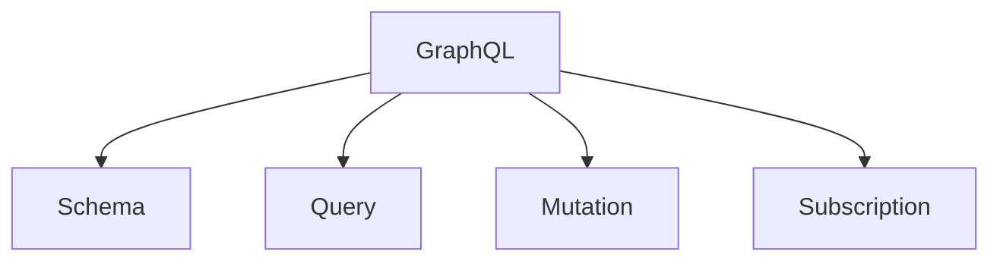

                 

# GraphQL：灵活高效的API查询语言

> 关键词：GraphQL, API, 查询语言, 灵活, 高效

## 1. 背景介绍

### 1.1 问题由来
随着互联网应用的发展，API（Application Programming Interface，应用编程接口）作为连接不同系统、服务、应用的重要桥梁，其重要性日益凸显。传统的RESTful API由于其固定的结构化和资源定位方式，逐渐显现出一些缺点，如数据冗余、响应过载、扩展性差等。这些问题不仅影响了系统的性能和可维护性，还制约了创新应用的开发。

在当前的互联网生态中，API的数量和复杂度不断增加，对API的灵活性和效率提出了更高的要求。为了满足这些需求，GraphQL作为一种新型API查询语言，逐渐进入人们的视野。

### 1.2 问题核心关键点
GraphQL的出现旨在解决传统RESTful API的诸多问题，提供了一种更灵活、更高效的API设计方式。其核心优势在于：

- **灵活性**：通过查询语言而非固定接口，允许客户端自主选择需要的数据。
- **效率性**：减少了数据冗余和网络传输，提高了API响应速度和效率。
- **可扩展性**：便于添加和扩展新功能和数据模型，降低了维护成本。

## 2. 核心概念与联系

### 2.1 核心概念概述

为更好地理解GraphQL的工作原理和优势，本节将介绍几个关键概念：

- **GraphQL**：GraphQL是一种用于API查询的语言，通过GraphQL，客户端可以自定义请求，获取自己需要的数据。GraphQL的核心在于其灵活的查询结构，允许客户端通过组合不同类型的查询操作，获取更精确的数据。

- **API**：API是连接不同应用、系统的重要接口，负责提供数据和操作，通常通过HTTP协议进行通信。传统的RESTful API采用资源定位的方式，但这种方式固定了数据结构，不够灵活。

- **Schema**：GraphQL通过Schema定义了数据类型、查询、变异和订阅，是GraphQL生态系统的核心。Schema描述了GraphQL中所有可查询和可变量的数据结构，允许客户端进行灵活查询。

- **Query**：Query是GraphQL中最基本的操作，用于从服务器获取数据。通过Query，客户端可以指定需要获取的数据类型、字段和参数。

- **Mutation**：Mutation用于在服务器上执行数据变更操作，如创建、更新和删除数据。Mutation通常与Query配套使用，提供更完整的API操作能力。

- **Subscription**：Subscription用于实现服务器端与客户端之间的实时数据流传输，适用于需要即时数据更新的应用场景，如消息系统、即时通讯等。

这些核心概念之间的逻辑关系可以通过以下Mermaid流程图来展示：



这个流程图展示了大语言模型的核心概念及其之间的关系：

1. GraphQL通过Schema定义了数据类型、查询、变异和订阅，是GraphQL生态系统的核心。
2. Query和Mutation是GraphQL中最基本的操作，用于获取数据和执行数据变更。
3. Subscription用于实现服务器端与客户端之间的实时数据流传输。

## 3. 核心算法原理 & 具体操作步骤
### 3.1 算法原理概述

GraphQL的核心在于其灵活的Schema定义和查询操作，允许客户端自主选择需要的数据。GraphQL的查询操作通常遵循以下步骤：

1. 客户端发送包含查询内容的GraphQL请求到服务器。
2. 服务器解析GraphQL请求，生成执行计划。
3. 服务器执行执行计划，获取请求所需的数据。
4. 服务器返回响应数据到客户端。

GraphQL的查询操作可以理解为对数据库的复杂SQL查询操作，但GraphQL的Schema定义和灵活查询操作更为强大。GraphQL通过Schema描述了所有可查询和可变量的数据结构，允许客户端进行灵活查询，从而避免了RESTful API中的数据冗余和响应过载问题。

### 3.2 算法步骤详解

GraphQL的查询操作可以分为以下几个关键步骤：

**Step 1: 定义Schema**

首先，需要定义GraphQL的Schema，用于描述可查询和可变量的数据结构。Schema通常包含以下内容：

1. 数据类型：定义所有数据类型，如字符串、整数、数组等。
2. 查询：定义所有可查询的数据和字段。
3. 变异：定义所有可变量的操作和参数。
4. 订阅：定义所有可订阅的数据流。

例如，以下是一个简单的GraphQL Schema定义：

```json
type Query {
  user(id: ID!): User
  posts: [Post]
}

type Mutation {
  createPost(title: String!, body: String!): Post
  updatePost(id: ID!, title: String, body: String): Post
}

type Subscription {
  postCreated: Post
  postUpdated: Post
}
```

**Step 2: 解析GraphQL请求**

接收到GraphQL请求后，服务器需要解析请求，生成执行计划。GraphQL请求通常包含查询内容、变量和参数，服务器需要根据Schema和请求内容，生成相应的执行计划。例如，以下是一个简单的GraphQL请求：

```json
query {
  user(id: "1") {
    id
    name
    posts {
      id
      title
    }
  }
}
```

服务器需要解析该请求，生成如下执行计划：

1. 查询 `user(id: "1")`，返回用户ID、名称和帖子列表。
2. 对于每个帖子，查询ID和标题。

**Step 3: 执行执行计划**

根据执行计划，服务器需要执行相应的查询操作，获取请求所需的数据。例如，对于上述GraphQL请求，服务器需要执行以下查询操作：

1. 查询用户ID为1的用户。
2. 获取该用户的名称和帖子列表。
3. 对于每个帖子，获取ID和标题。

**Step 4: 返回响应数据**

服务器返回响应数据到客户端。响应数据通常包含查询结果和任何错误信息。例如，对于上述GraphQL请求，服务器返回的响应数据可能为：

```json
{
  "data": {
    "user": {
      "id": "1",
      "name": "Alice",
      "posts": [
        {
          "id": "1",
          "title": "Post 1"
        },
        {
          "id": "2",
          "title": "Post 2"
        }
      ]
    }
  }
}
```

### 3.3 算法优缺点

GraphQL的核心优势在于其灵活性和效率性，具体如下：

- **灵活性**：GraphQL允许客户端自主选择需要的数据，减少了数据冗余和响应过载问题。客户端可以动态地组合不同类型的查询操作，获取更精确的数据。
- **效率性**：GraphQL减少了数据冗余和网络传输，提高了API响应速度和效率。客户端可以指定需要获取的数据类型、字段和参数，避免了RESTful API中的过度请求。
- **可扩展性**：GraphQL便于添加和扩展新功能和数据模型，降低了维护成本。Schema定义了所有可查询和可变量的数据结构，允许客户端进行灵活查询。

同时，GraphQL也存在一些局限性：

- **学习成本高**：GraphQL的灵活性和复杂性可能导致学习成本较高，客户端需要熟悉GraphQL的查询语言和Schema定义。
- **实现复杂**：GraphQL的Schema定义和查询操作较为复杂，服务器端的实现可能较为困难。
- **性能问题**：对于大型Schema和复杂查询，服务器端的性能可能受到影响。

尽管存在这些局限性，但GraphQL在灵活性和效率性方面具有显著优势，值得广泛应用。

### 3.4 算法应用领域

GraphQL的灵活性和效率性使其在多个领域得到了广泛应用，例如：

- **前端开发**：GraphQL允许客户端自主选择需要的数据，简化了前端数据获取和处理。前端开发人员可以通过GraphQL获取更精准、更高效的数据，提升用户体验。
- **API开发**：GraphQL提供了一种灵活、高效的API设计方式，减少了数据冗余和响应过载问题，提高了API响应速度和效率。
- **移动应用**：GraphQL允许移动应用自主选择需要的数据，提高了移动应用的响应速度和用户体验。
- **实时数据流**：GraphQL支持订阅操作，适用于需要即时数据更新的应用场景，如消息系统、即时通讯等。

除了上述这些应用领域外，GraphQL还被创新性地应用到更多场景中，如数据可视化、实时监控等，为GraphQL技术带来了更多的发展方向。

## 4. 数学模型和公式 & 详细讲解 & 举例说明

### 4.1 数学模型构建

GraphQL的核心在于其Schema定义和查询操作，以下是GraphQL的数学模型构建过程：

1. 定义数据类型：
   - 标量类型(Scalar Type)：如字符串、整数、布尔等基本类型。
   - 复合类型(Composite Type)：如列表、对象等复杂类型。

2. 定义查询：
   - 查询类型(Query Type)：用于获取数据。
   - 字段(Field)：定义可查询的字段和参数。

3. 定义变异：
   - 变异类型(Mutation Type)：用于执行数据变更操作。
   - 操作(Operation)：定义可变量的操作和参数。

4. 定义订阅：
   - 订阅类型(Subscription Type)：用于实现实时数据流传输。
   - 事件(Event)：定义可订阅的数据流。

### 4.2 公式推导过程

GraphQL的查询操作通常可以理解为对数据库的复杂SQL查询操作，但GraphQL的Schema定义和灵活查询操作更为强大。GraphQL的Schema定义和查询操作可以通过以下公式推导：

1. 数据类型定义：
   - 标量类型：$T = \{val | val \in V\}$
   - 复合类型：$T = \{val | val \in T_1 \cup T_2 \cup \ldots \cup T_n\}$
   - 列表类型：$T = [T]$
   - 对象类型：$T = \{field_1: T_1, field_2: T_2, \ldots, field_n: T_n\}$

2. 查询定义：
   - 查询类型：$Q = \{field_1: T_1, field_2: T_2, \ldots, field_n: T_n\}$
   - 字段：$field = \{name: T, args: Arg\}$

3. 变异定义：
   - 变异类型：$M = \{op: Operation, args: Arg\}$
   - 操作：$op = \{name: T, args: Arg\}$
   - 参数：$arg = \{name: T, default: Val\}$

4. 订阅定义：
   - 订阅类型：$S = \{event: T\}$
   - 事件：$event = \{name: T, args: Arg\}$

### 4.3 案例分析与讲解

假设我们有一个简单的GraphQL Schema定义，用于描述用户和帖子：

```json
type Query {
  user(id: ID!): User
  posts: [Post]
}

type Mutation {
  createPost(title: String!, body: String!): Post
  updatePost(id: ID!, title: String, body: String): Post
}

type Subscription {
  postCreated: Post
  postUpdated: Post
}
```

客户端发送如下GraphQL请求，查询ID为1的用户和该用户的帖子：

```json
query {
  user(id: "1") {
    id
    name
    posts {
      id
      title
    }
  }
}
```

服务器解析该请求，生成如下执行计划：

1. 查询用户ID为1的用户。
2. 获取该用户的名称和帖子列表。
3. 对于每个帖子，获取ID和标题。

服务器执行执行计划，获取请求所需的数据，并返回响应数据：

```json
{
  "data": {
    "user": {
      "id": "1",
      "name": "Alice",
      "posts": [
        {
          "id": "1",
          "title": "Post 1"
        },
        {
          "id": "2",
          "title": "Post 2"
        }
      ]
    }
  }
}
```

## 5. 项目实践：代码实例和详细解释说明

### 5.1 开发环境搭建

在进行GraphQL项目实践前，我们需要准备好开发环境。以下是使用GraphQL和GraphiQL进行项目开发的流程图：

1. 安装GraphQL Server：使用npm安装GraphQL Server，GraphQL Server是一个轻量级的GraphQL服务器实现。
2. 创建GraphQL Schema：根据项目需求，定义GraphQL Schema，使用GraphQL Tools工具生成代码。
3. 安装GraphQL Client：使用npm安装GraphQL Client，如GraphiQL或Apollo Client。
4. 配置GraphQL Server：配置GraphQL Server，并根据Schema定义创建数据源和查询操作。
5. 部署GraphQL Server：将GraphQL Server部署到生产环境，并暴露GraphQL API。

### 5.2 源代码详细实现

下面以使用GraphQL Server和GraphiQL进行GraphQL项目开发的代码实现为例，给出GraphQL Server和GraphQL Client的实现细节。

**GraphQL Server实现**：

```javascript
const { ApolloServer, gql } = require('apollo-server');

const typeDefs = gql`
  type User {
    id: ID!
    name: String
    posts: [Post]
  }

  type Post {
    id: ID!
    title: String
    body: String
  }

  type Query {
    user(id: ID!): User
    posts: [Post]
  }

  type Mutation {
    createPost(title: String!, body: String!): Post
    updatePost(id: ID!, title: String, body: String): Post
  }

  type Subscription {
    postCreated: Post
    postUpdated: Post
  }
`;

const resolvers = {
  Query: {
    user: (parent, { id }) => {
      return users.find(u => u.id === id);
    },
    posts: () => {
      return posts;
    }
  },
  Mutation: {
    createPost: (parent, { title, body }) => {
      const post = { id: uuidv4(), title, body };
      posts.push(post);
      return post;
    },
    updatePost: (parent, { id, title, body }) => {
      const post = posts.find(p => p.id === id);
      if (post) {
        post.title = title;
        post.body = body;
      }
      return post;
    }
  },
  Subscription: {
    postCreated: () => {
      const intervalId = setInterval(() => {
        const post = createRandomPost();
        return post;
      }, 1000);
      return {
        unsubscribe: () => clearInterval(intervalId)
      };
    },
    postUpdated: () => {
      const intervalId = setInterval(() => {
        const post = updateRandomPost();
        return post;
      }, 1000);
      return {
        unsubscribe: () => clearInterval(intervalId)
      };
    }
  }
};

const server = new ApolloServer({ typeDefs, resolvers });

server.listen().then(({ url }) => {
  console.log(`GraphQL Server ready at ${url}`);
});
```

**GraphiQL实现**：

```javascript
const { ApolloClient, InMemoryCache } = require('apollo-client');
const { HttpLink } = require('apollo-link-http');
const { SubscriptionClient } = require('apollo-SubscriptionClient');

const httpLink = new HttpLink({
  uri: 'http://localhost:4000/graphql'
});

const client = new ApolloClient({
  link: httpLink,
  cache: new InMemoryCache(),
});

const subscriptionClient = new SubscriptionClient({
  uri: 'ws://localhost:4000/graphql',
  reconnect: true,
});

subscriptionClient.request({
  query: gql`
    subscription {
      postCreated {
        id
        title
        body
      }
      postUpdated {
        id
        title
        body
      }
    }
  `
}).then(response => {
  console.log('Subscription started:', response.data);
});

client.query({
  query: gql`
    query {
      posts {
        id
        title
        body
      }
    }
  `
}).then(response => {
  console.log('Query result:', response.data);
});
```

### 5.3 代码解读与分析

这里我们详细解读一下关键代码的实现细节：

**GraphQL Server实现**：
- `typeDefs`：定义GraphQL Schema，包括数据类型、查询、变异和订阅。
- `resolvers`：定义查询、变异和订阅的实现逻辑，如查询用户、创建帖子等。
- `server`：创建并启动GraphQL Server，将Schema和resolvers传入Server实例，并监听GraphQL API。

**GraphiQL实现**：
- `httpLink`：创建GraphQL HTTP链接，用于连接GraphQL Server。
- `client`：创建GraphQL Client，使用httpLink连接GraphQL Server。
- `subscriptionClient`：创建GraphQL Subscription Client，用于订阅实时数据流。

### 5.4 运行结果展示

运行GraphQL Server和GraphiQL，客户端发送请求后，服务器返回响应数据。例如，客户端发送如下请求：

```json
query {
  user(id: "1") {
    id
    name
    posts {
      id
      title
    }
  }
}
```

服务器返回如下响应数据：

```json
{
  "data": {
    "user": {
      "id": "1",
      "name": "Alice",
      "posts": [
        {
          "id": "1",
          "title": "Post 1"
        },
        {
          "id": "2",
          "title": "Post 2"
        }
      ]
    }
  }
}
```

通过上述代码实例，可以看到GraphQL Server和GraphiQL的基本实现方法，以及GraphQL查询和响应的具体过程。

## 6. 实际应用场景
### 6.1 灵活性在API设计中的应用

GraphQL的灵活性在API设计中的应用主要体现在以下几个方面：

**1. 动态数据获取**：客户端可以自主选择需要的数据，避免了RESTful API中的数据冗余和响应过载问题。例如，在前端开发中，客户端可以根据用户需求动态地组合不同类型的查询操作，获取更精确的数据。

**2. 实时数据流传输**：GraphQL支持订阅操作，适用于需要即时数据更新的应用场景。例如，在实时聊天应用中，服务器可以定期推送新消息，客户端通过订阅获取最新的消息数据。

### 6.2 效率性在API性能中的应用

GraphQL的效率性在API性能中的应用主要体现在以下几个方面：

**1. 减少数据冗余**：GraphQL允许客户端自主选择需要的数据，避免了RESTful API中的数据冗余问题。例如，在API开发中，客户端可以只请求需要的数据，减少了网络传输量，提高了API响应速度。

**2. 提高API性能**：GraphQL减少了数据冗余和响应过载问题，提高了API的性能和可维护性。例如，在API开发中，通过GraphQL，服务器可以更精确地响应客户端请求，减少了不必要的数据传输。

### 6.3 可扩展性在API维护中的应用

GraphQL的可扩展性在API维护中的应用主要体现在以下几个方面：

**1. 便于添加和扩展新功能**：GraphQL的Schema定义和查询操作较为灵活，便于添加和扩展新功能和数据模型。例如，在API开发中，开发人员可以通过Schema定义新的数据类型和查询操作，提升API的功能性和可扩展性。

**2. 降低维护成本**：GraphQL的Schema定义和查询操作较为灵活，降低了API的维护成本。例如，在API开发中，开发人员可以动态地组合不同类型的查询操作，获取更精确的数据，减少了API的维护工作量。

### 6.4 未来应用展望

随着GraphQL的不断发展和应用，其在多个领域得到了广泛应用，未来也具有广阔的发展前景：

**1. 前端开发**：GraphQL的灵活性和效率性使其在前端开发中得到了广泛应用，简化了前端数据获取和处理，提高了用户体验。

**2. API开发**：GraphQL提供了一种灵活、高效的API设计方式，减少了数据冗余和响应过载问题，提高了API响应速度和效率。

**3. 实时数据流**：GraphQL支持订阅操作，适用于需要即时数据更新的应用场景，如消息系统、即时通讯等。

**4. 数据可视化**：GraphQL允许客户端自主选择需要的数据，简化了数据可视化数据的获取和处理，提高了数据可视化的效率和效果。

**5. 实时监控**：GraphQL支持订阅操作，适用于需要实时监控数据的应用场景，如系统监控、网络监控等。

## 7. 工具和资源推荐
### 7.1 学习资源推荐

为了帮助开发者系统掌握GraphQL的理论基础和实践技巧，这里推荐一些优质的学习资源：

1. GraphQL官方文档：GraphQL官网提供了详细的文档和教程，介绍了GraphQL的核心概念和使用方法。

2. GraphQL Tutorials byapollographql：Apollo GraphQL提供的官方教程，介绍了GraphQL的基本概念和使用方法。

3. GraphQL 官方博客：GraphQL官方博客提供了丰富的博客文章，涵盖了GraphQL的各个方面，包括最佳实践、开发技巧、性能优化等。

4. GraphQL Fundamentals by Egghead.io：Egghead.io提供的GraphQL课程，涵盖了GraphQL的核心概念和使用方法。

5. GraphQL and REST in a Nutshell by Tom van Cutsem：一本关于GraphQL和RESTful API的入门书籍，适合初学者学习。

通过对这些资源的学习实践，相信你一定能够快速掌握GraphQL的核心知识和应用技能。

### 7.2 开发工具推荐

高效的开发离不开优秀的工具支持。以下是几款用于GraphQL开发的工具：

1. GraphQL Server：由Apollo提供的轻量级GraphQL服务器实现，简单易用，支持多种数据源和查询操作。

2. GraphiQL：GraphQL客户端，支持实时查询和代码高亮，适合快速迭代开发。

3. Apollo Client：GraphQL客户端，支持数据缓存和查询优化，适用于大规模应用。

4. GraphQL Tools：GraphQL工具库，支持Schema解析、代码生成等常用功能，方便开发和维护。

5. Postman：HTTP请求工具，支持GraphQL请求的调试和测试，方便开发者进行单元测试。

合理利用这些工具，可以显著提升GraphQL开发效率，加速创新迭代的步伐。

### 7.3 相关论文推荐

GraphQL的出现代表了大规模API设计的新趋势，其核心在于其灵活性和效率性。以下是几篇奠基性的相关论文，推荐阅读：

1. GraphQL: A Language for API Clients: An Introduction: 一篇关于GraphQL的基本介绍论文，介绍了GraphQL的核心概念和优势。

2. GraphQL: An Intuitive and Flexible Query Language for APIs: 一篇关于GraphQL的理论和应用论文，介绍了GraphQL的核心原理和实现方法。

3. GraphQL: A New Approach to API Design: 一篇关于GraphQL的创新和应用论文，介绍了GraphQL在API设计中的优势和应用。

4. GraphQL: The Future of APIs: 一篇关于GraphQL的未来和发展的论文，探讨了GraphQL在API生态中的作用和前景。

这些论文代表了大规模API设计的发展脉络。通过学习这些前沿成果，可以帮助研究者把握学科前进方向，激发更多的创新灵感。

## 8. 总结：未来发展趋势与挑战
### 8.1 总结

本文对GraphQL的核心概念、原理和应用进行了全面系统的介绍。首先阐述了GraphQL的背景和意义，明确了GraphQL在灵活性、效率性和可扩展性方面的优势。其次，从原理到实践，详细讲解了GraphQL的Schema定义和查询操作，给出了GraphQL服务器和客户端的代码实现。同时，本文还广泛探讨了GraphQL在实际应用中的灵活性和效率性，展示了GraphQL范式在多个领域的应用前景。

通过本文的系统梳理，可以看到，GraphQL作为一种新型API查询语言，以其灵活性、效率性和可扩展性，为API设计带来了新的思路和方法。GraphQL的出现，标志着API设计的进步和创新，为大规模应用和开发提供了新的工具和方向。

### 8.2 未来发展趋势

展望未来，GraphQL将在多个领域得到广泛应用，成为API设计的重要范式，其发展趋势主要体现在以下几个方面：

**1. 更加广泛的应用**：GraphQL的灵活性和效率性使其在多个领域得到了广泛应用，未来将有更多领域使用GraphQL进行API设计。

**2. 更加高效的性能**：GraphQL的性能和效率将在未来得到进一步提升，优化查询操作，减少数据冗余和响应过载问题。

**3. 更加灵活的Schema设计**：GraphQL的Schema设计将更加灵活，支持更复杂的查询操作和数据结构，提升API的可扩展性和可维护性。

**4. 更加丰富的数据源支持**：GraphQL将支持更多的数据源和查询操作，提升API的数据丰富性和多样性。

**5. 更加智能的API管理**：GraphQL将支持更多的API管理工具，如API调试、API监控、API编排等，提升API的生命周期管理能力。

### 8.3 面临的挑战

尽管GraphQL在灵活性和效率性方面具有显著优势，但在实际应用中仍面临一些挑战：

**1. 学习成本高**：GraphQL的灵活性和复杂性可能导致学习成本较高，客户端需要熟悉GraphQL的查询语言和Schema定义。

**2. 实现复杂**：GraphQL的Schema定义和查询操作较为复杂，服务器端的实现可能较为困难。

**3. 性能问题**：对于大型Schema和复杂查询，服务器端的性能可能受到影响。

尽管存在这些挑战，但GraphQL在灵活性和效率性方面具有显著优势，值得广泛应用。

### 8.4 研究展望

面对GraphQL面临的挑战，未来的研究需要在以下几个方面寻求新的突破：

**1. 降低学习成本**：开发更加易用的GraphQL工具和文档，降低学习成本，提高开发者对GraphQL的接受度。

**2. 优化性能**：开发更加高效的GraphQL服务器和客户端，优化查询操作，减少数据冗余和响应过载问题。

**3. 支持更多数据源**：支持更多的数据源和查询操作，提升API的数据丰富性和多样性。

**4. 智能API管理**：开发更多的API管理工具，如API调试、API监控、API编排等，提升API的生命周期管理能力。

这些研究方向的探索，必将引领GraphQL技术迈向更高的台阶，为构建更加灵活、高效、可扩展的API生态奠定基础。

## 9. 附录：常见问题与解答

**Q1：GraphQL和RESTful API有什么区别？**

A: GraphQL是一种新型API查询语言，与传统的RESTful API相比，具有以下区别：

- **数据获取方式**：RESTful API采用固定资源定位的方式，每次请求获取所有相关数据；GraphQL允许客户端自主选择需要的数据。
- **数据冗余问题**：RESTful API存在数据冗余问题，GraphQL避免了数据冗余，提高了API的效率。
- **查询操作**：RESTful API采用单一的URL结构，GraphQL支持复杂的查询操作，可以灵活地组合不同类型的查询操作。

**Q2：GraphQL的查询操作和RESTful API的GET请求有什么区别？**

A: GraphQL的查询操作和RESTful API的GET请求有以下区别：

- **数据获取方式**：RESTful API采用单一的URL结构，每次请求获取所有相关数据；GraphQL允许客户端自主选择需要的数据。
- **数据冗余问题**：RESTful API存在数据冗余问题，GraphQL避免了数据冗余，提高了API的效率。
- **查询操作**：RESTful API采用单一的URL结构，GraphQL支持复杂的查询操作，可以灵活地组合不同类型的查询操作。

**Q3：GraphQL的优势和缺点有哪些？**

A: GraphQL的优势主要在于其灵活性和效率性，具体如下：

- **灵活性**：GraphQL允许客户端自主选择需要的数据，避免了数据冗余和响应过载问题。
- **效率性**：GraphQL减少了数据冗余和网络传输，提高了API响应速度和效率。

GraphQL的缺点主要在于其学习成本和实现复杂性，具体如下：

- **学习成本高**：GraphQL的灵活性和复杂性可能导致学习成本较高，客户端需要熟悉GraphQL的查询语言和Schema定义。
- **实现复杂**：GraphQL的Schema定义和查询操作较为复杂，服务器端的实现可能较为困难。

尽管存在这些缺点，但GraphQL在灵活性和效率性方面具有显著优势，值得广泛应用。

---

作者：禅与计算机程序设计艺术 / Zen and the Art of Computer Programming

