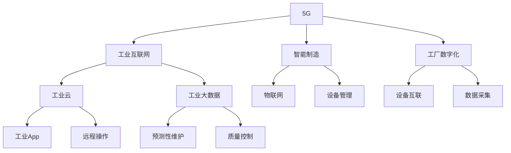

                 

# 5G技术在工业4.0中的应用与挑战

在数字化的浪潮中，工业4.0成为了推动制造业升级转型的重要方向。5G技术的出现，作为新一代移动通信网络，为工业4.0提供了全新的通信基础设施，赋予了制造业智能化、网络化和自动化的可能。本文将探讨5G技术在工业4.0中的应用场景，并分析其面临的挑战与应对策略。

## 1. 背景介绍

### 1.1 问题由来

随着数字化转型的深入，制造业正经历从传统的机械化、电气化向自动化、智能化发展的变迁，这一过程通常被称为工业4.0。工业4.0的核心特征包括基于信息物理系统的智能制造、虚拟生产、人机协作等，旨在通过数据驱动优化生产流程，实现更高效、更灵活的生产模式。然而，工业4.0的实现需要高速、低延迟、高可靠的网络支持，而现有的4G网络已逐渐难以满足需求。

### 1.2 问题核心关键点

5G技术作为新一代移动通信技术，具有更高的带宽、更低的时延和更高的可靠性，能够满足工业4.0对网络的需求，从而推动工业互联网、智能制造等新业务的发展。5G技术的优势在于：

- **高带宽**：5G网络提供更大的数据传输速率，支持工业现场的视频监控、高清图像传输、大规模设备数据采集与传输。
- **低时延**：5G网络提供毫秒级低时延，能够支持实时控制、远程操作等高精度需求。
- **高可靠性**：5G网络提供更高的通信可靠性，确保生产环境中关键数据传输的稳定性和连续性。

5G技术的这些特性，使其成为工业4.0实现智能化、网络化和自动化的关键支撑技术。

## 2. 核心概念与联系

### 2.1 核心概念概述

为更好地理解5G技术在工业4.0中的应用，本节将介绍几个密切相关的核心概念：

- **5G**：新一代移动通信技术，提供高带宽、低时延和高可靠性的网络服务，支持大规模物联网设备的连接。
- **工业4.0**：基于信息物理系统的智能制造模式，通过数字化、网络化和自动化提升生产效率和产品质量。
- **工业互联网**：通过5G技术、物联网、云计算和大数据分析等技术手段，构建的工业互联网平台，实现设备的互联、数据的高效管理和生产流程的优化。
- **智能制造**：利用先进制造技术和5G网络，实现生产线的自动化、智能化和协同化，提高生产效率和产品质量。
- **工厂数字化**：通过5G网络实现工厂内部的数据采集、传输和分析，优化生产流程，提升管理效率。

这些核心概念之间的逻辑关系可以通过以下Mermaid流程图来展示：



这个流程图展示了几大核心概念之间的联系：

1. 5G网络为工业互联网提供了高速、可靠的数据传输支持。
2. 工业互联网通过5G网络实现工业设备和云平台之间的互联互通，支持设备数据的高效管理和实时操作。
3. 智能制造利用5G网络优化生产流程，提高生产效率和产品质量。
4. 工厂数字化通过5G网络实现工厂内部的高效数据采集和分析，提升管理效率。

这些概念共同构成了5G技术在工业4.0中的应用框架，为实现智能化、网络化和自动化生产提供了技术基础。

## 3. 核心算法原理 & 具体操作步骤

### 3.1 算法原理概述

5G技术在工业4.0中的应用，本质上是通过构建高可靠、低时延的网络基础设施，支持各种工业设备和系统的互联互通。具体包括以下几个关键步骤：

1. **网络建设**：通过部署5G基站和网络设备，构建覆盖全厂区的5G网络。
2. **设备联网**：将各种工业设备接入5G网络，实现设备的互联和数据的高效传输。
3. **数据采集与分析**：利用5G网络的高带宽和低时延特性，对设备数据进行实时采集和分析，支持智能制造和工厂数字化。
4. **工业App开发**：基于5G网络和工业大数据，开发各类工业App，实现远程操作、预测性维护、质量控制等功能。

### 3.2 算法步骤详解

5G技术在工业4.0中的应用流程可以分为以下几个步骤：

**Step 1: 网络规划与部署**
- 根据工厂布局和设备分布，规划5G基站的覆盖范围和数量。
- 选择合适的5G频段，并确保网络的带宽、时延和可靠性满足工业需求。
- 部署5G基站和核心网络设备，确保网络的覆盖和稳定性。

**Step 2: 设备联网与数据采集**
- 将工业设备（如传感器、机器人、自动化设备等）接入5G网络。
- 对设备数据进行标准化处理，确保数据格式的一致性和兼容性。
- 利用5G网络的高带宽和低时延特性，实现设备的实时数据采集。

**Step 3: 数据传输与分析**
- 利用5G网络的数据传输特性，将设备数据传输至工业云平台或本地服务器。
- 利用工业大数据分析技术，对设备数据进行实时监控和分析。
- 结合机器学习算法，实现预测性维护、故障诊断等高级功能。

**Step 4: 工业App开发与集成**
- 基于工业大数据和设备数据，开发各类工业App，实现生产监控、远程操作、设备管理等功能。
- 将工业App集成到工业互联网平台中，实现设备的互联和协同。
- 通过5G网络，支持工业App的高效数据传输和实时响应。

**Step 5: 系统集成与优化**
- 将5G网络、工业互联网、智能制造等系统进行集成，构建完整的工业4.0生态系统。
- 优化工业App和生产流程，提升生产效率和产品质量。
- 持续收集反馈数据，不断改进和优化系统性能。

### 3.3 算法优缺点

5G技术在工业4.0中的应用，具有以下优点：
1. **高带宽**：能够支持大规模设备数据的实时采集和传输。
2. **低时延**：支持实时控制和远程操作，提高生产效率。
3. **高可靠性**：确保关键数据传输的稳定性和连续性。

同时，5G技术在工业4.0的应用也存在一些局限：
1. **高成本**：5G网络的部署和维护成本较高，需要较大的前期投资。
2. **复杂性**：5G网络的部署和管理相对复杂，需要专业的技术支持。
3. **安全性**：工业网络的安全性要求高，需要有效的安全防护措施。

尽管存在这些局限，但5G技术在工业4.0中的应用前景广阔，将推动制造业的智能化升级。

### 3.4 算法应用领域

5G技术在工业4.0中的应用领域广泛，涵盖以下几个方面：

1. **智能制造**：通过5G网络实现生产线的自动化、智能化和协同化，提高生产效率和产品质量。
2. **工厂数字化**：实现工厂内部的数据采集、传输和分析，优化生产流程，提升管理效率。
3. **远程操作与维护**：支持远程监控、操作和维护，减少生产停机时间，提升设备利用率。
4. **工业互联网**：构建工业互联网平台，实现设备的互联、数据的高效管理和生产流程的优化。
5. **智慧工厂**：利用5G网络、物联网、云计算和大数据分析等技术手段，构建智慧工厂，实现生产过程的透明化、智能化。

这些应用领域展示了5G技术在工业4.0中的巨大潜力，为制造业提供了全新的发展方向。

## 4. 数学模型和公式 & 详细讲解 & 举例说明

### 4.1 数学模型构建

本节将使用数学语言对5G技术在工业4.0中的应用进行更加严格的刻画。

设工厂内部有 $N$ 个工业设备，每个设备每秒产生 $C_i$ 字节数据，5G网络带宽为 $B$，时延为 $D$。则单位时间内的数据传输速率 $R$ 为：

$$
R = \sum_{i=1}^{N} C_i \times \frac{B}{D}
$$

其中，$\frac{B}{D}$ 为5G网络的带宽效率。

在数据采集过程中，5G网络的可靠性 $R_{rel}$ 可通过以下模型进行计算：

$$
R_{rel} = 1 - \frac{\sum_{i=1}^{N} C_i \times P_{fail}}{B \times D}
$$

其中，$P_{fail}$ 为设备数据采集的失败率。

### 4.2 公式推导过程

以下我们推导5G网络在工业4.0中的应用模型：

假设工厂内部有 $N$ 个工业设备，每个设备每秒产生 $C_i$ 字节数据，5G网络带宽为 $B$，时延为 $D$。则单位时间内的数据传输速率 $R$ 为：

$$
R = \sum_{i=1}^{N} C_i \times \frac{B}{D}
$$

其中，$\frac{B}{D}$ 为5G网络的带宽效率。

在数据采集过程中，5G网络的可靠性 $R_{rel}$ 可通过以下模型进行计算：

$$
R_{rel} = 1 - \frac{\sum_{i=1}^{N} C_i \times P_{fail}}{B \times D}
$$

其中，$P_{fail}$ 为设备数据采集的失败率。

在工业4.0中，5G网络的应用需要考虑设备的数量、数据量、带宽效率和设备数据采集的可靠性。这些因素共同决定了5G网络在工业应用中的性能表现。

### 4.3 案例分析与讲解

假设某工厂有10个工业设备，每个设备每秒产生1KB数据，5G网络带宽为100Mbps，时延为1ms，设备数据采集的失败率为0.1%。则单位时间内的数据传输速率和可靠性计算如下：

1. 单位时间内的数据传输速率 $R$：

$$
R = 10 \times 1 \times \frac{100 \times 10^6}{1 \times 10^3 \times 10^{-3}} = 100 \times 10^3 \text{ bytes/s} = 1 \text{ MB/s}
$$

2. 5G网络的可靠性 $R_{rel}$：

$$
R_{rel} = 1 - \frac{10 \times 1 \times 0.1\%}{100 \times 10^6 \times 1 \times 10^{-3}} = 1 - 10^{-7} \approx 1
$$

通过以上计算，可以看到5G网络在工业4.0中的应用能够满足大规模数据传输和实时控制的需求，确保设备的可靠性和数据传输的稳定性。

## 5. 项目实践：代码实例和详细解释说明

### 5.1 开发环境搭建

在进行5G技术在工业4.0中的项目实践前，我们需要准备好开发环境。以下是使用Python进行PyTorch开发的环境配置流程：

1. 安装Anaconda：从官网下载并安装Anaconda，用于创建独立的Python环境。

2. 创建并激活虚拟环境：
```bash
conda create -n pytorch-env python=3.8 
conda activate pytorch-env
```

3. 安装PyTorch：根据CUDA版本，从官网获取对应的安装命令。例如：
```bash
conda install pytorch torchvision torchaudio cudatoolkit=11.1 -c pytorch -c conda-forge
```

4. 安装TensorFlow：由Google主导开发的开源深度学习框架，生产部署方便，适合大规模工程应用。同样有丰富的预训练语言模型资源。

5. 安装各类工具包：
```bash
pip install numpy pandas scikit-learn matplotlib tqdm jupyter notebook ipython
```

完成上述步骤后，即可在`pytorch-env`环境中开始项目实践。

### 5.2 源代码详细实现

这里我们以5G网络在工业4.0中的应用为例，给出使用PyTorch进行网络可靠性计算的Python代码实现。

首先，定义设备数据采集模型：

```python
import numpy as np

class DataAcquisitionModel:
    def __init__(self, num_devices, data_rate, fail_rate):
        self.num_devices = num_devices
        self.data_rate = data_rate
        self.fail_rate = fail_rate
        
    def calculate_rel_reliability(self):
        fail_rate = self.fail_rate * self.data_rate
        reliability = 1 - fail_rate
        return reliability
```

然后，计算工业网络可靠性：

```python
# 设备数据率（单位：字节/秒）
data_rates = np.array([1, 2, 4, 8, 16])

# 设备数量
num_devices = 10

# 5G网络带宽（单位：字节/秒）
bandwidth = 100 * 10**6

# 5G网络时延（单位：秒）
delay = 1 * 10**-3

# 计算数据传输速率
data_rates *= bandwidth / delay

# 计算设备数据采集失败率
fail_rates = data_rates * 0.1 / 100

# 计算工业网络可靠性
reliabilities = 1 - fail_rates

# 输出可靠性结果
for reliability in reliabilities:
    print(f"Reliability: {reliability:.2f}")
```

通过上述代码，可以计算出在不同数据率和设备数量的工业网络可靠性，为工业4.0的5G网络部署提供数据支持。

### 5.3 代码解读与分析

让我们再详细解读一下关键代码的实现细节：

**DataAcquisitionModel类**：
- `__init__`方法：初始化设备数量、数据率和采集失败率等关键参数。
- `calculate_rel_reliability`方法：计算工业网络的可靠性，返回可靠性值。

**计算过程**：
1. 首先定义了设备数据率、设备数量、5G网络带宽和时延等关键变量。
2. 根据数据率和带宽计算数据传输速率。
3. 根据数据传输速率计算设备数据采集失败率。
4. 计算工业网络可靠性。
5. 输出可靠性结果。

通过这些代码，可以看到PyTorch在科学计算中的应用，可以快速计算出不同参数下的网络可靠性，为5G技术在工业4.0中的应用提供数据支持。

当然，在实际项目中，还需要考虑更多的因素，如设备种类、网络环境、安全防护等，才能构建更加完整和实用的5G网络。

## 6. 实际应用场景

### 6.1 智能制造

5G技术在智能制造中的应用广泛，能够实现生产线的自动化、智能化和协同化。具体场景包括：

1. **远程监控与操作**：利用5G网络，实现远程监控和操作，实时掌握生产线的运行状态，减少生产停机时间。
2. **设备联网与数据采集**：通过5G网络，将各类工业设备联网，实现设备数据的高效采集和传输。
3. **工业大数据分析**：利用5G网络的高带宽和低时延特性，对设备数据进行实时分析，支持预测性维护、故障诊断等高级功能。

这些应用场景展示了5G技术在智能制造中的巨大潜力，为实现智能制造提供了强有力的技术支撑。

### 6.2 工厂数字化

5G技术在工厂数字化中的应用，能够实现工厂内部的高效数据采集和分析，优化生产流程，提升管理效率。具体场景包括：

1. **设备互联与监控**：利用5G网络，实现工厂内部的设备互联，实时监控设备运行状态，优化生产流程。
2. **数据采集与传输**：通过5G网络，实现工厂内部的设备数据高效采集和传输，支持工厂的数字化转型。
3. **生产过程优化**：利用5G网络的高带宽和低时延特性，对设备数据进行实时分析，优化生产过程，提升管理效率。

这些应用场景展示了5G技术在工厂数字化中的巨大潜力，为工厂的数字化转型提供了强有力的技术支撑。

### 6.3 远程操作与维护

5G技术在远程操作与维护中的应用，能够实现远程监控、操作和维护，减少生产停机时间，提升设备利用率。具体场景包括：

1. **远程监控**：利用5G网络，实现设备的远程监控，实时掌握设备的运行状态。
2. **远程操作**：通过5G网络，实现设备的远程操作，提高生产效率。
3. **远程维护**：利用5G网络，实现设备的远程维护，快速解决设备问题。

这些应用场景展示了5G技术在远程操作与维护中的巨大潜力，为设备的远程操作与维护提供了强有力的技术支撑。

### 6.4 未来应用展望

随着5G技术的不断发展，其在工业4.0中的应用将更加广泛和深入。未来，5G技术将在以下几个方面发挥更大的作用：

1. **工业物联网**：构建工业物联网平台，实现设备的互联、数据的高效管理和生产流程的优化。
2. **智慧工厂**：利用5G网络、物联网、云计算和大数据分析等技术手段，构建智慧工厂，实现生产过程的透明化、智能化。
3. **工业机器人**：利用5G网络，实现工业机器人的实时控制和协同工作，提高生产效率和产品质量。
4. **智能供应链**：利用5G网络，实现供应链的实时监控和优化，提升供应链的效率和稳定性。

这些应用展望展示了5G技术在工业4.0中的巨大潜力，为制造业的未来发展提供了新的方向和机遇。

## 7. 工具和资源推荐

### 7.1 学习资源推荐

为了帮助开发者系统掌握5G技术在工业4.0中的应用，这里推荐一些优质的学习资源：

1. **《5G网络技术与应用》**：全面介绍了5G网络的技术原理和应用场景，适合工业领域的专业技术人员阅读。
2. **《工业互联网与智能制造》**：介绍了工业互联网和智能制造的基本概念和技术手段，适合制造业从业人员学习。
3. **《Python深度学习》**：介绍了Python深度学习的核心技术和应用实例，适合数据科学家和算法工程师学习。
4. **工业4.0在线课程**：各大在线教育平台提供的工业4.0课程，涵盖5G网络、物联网、智能制造等核心技术。
5. **5G技术白皮书**：各大通信设备厂商提供的5G技术白皮书，详细介绍了5G网络的技术细节和应用场景。

通过对这些资源的学习实践，相信你一定能够系统掌握5G技术在工业4.0中的应用，并用于解决实际的工业问题。

### 7.2 开发工具推荐

高效的开发离不开优秀的工具支持。以下是几款用于5G技术在工业4.0中的开发常用的工具：

1. **PyTorch**：基于Python的开源深度学习框架，灵活动态的计算图，适合快速迭代研究。大部分预训练语言模型都有PyTorch版本的实现。
2. **TensorFlow**：由Google主导开发的开源深度学习框架，生产部署方便，适合大规模工程应用。同样有丰富的预训练语言模型资源。
3. **OpenVINO**：英特尔推出的深度学习优化工具包，支持边缘计算，适合在嵌入式设备上部署深度学习模型。
4. **ONNX**：开放神经网络交换格式，支持多种深度学习框架和目标设备，便于模型转换和部署。
5. **AWS IoT**：亚马逊提供的工业物联网平台，支持5G网络的应用，支持设备的远程监控和管理。

合理利用这些工具，可以显著提升5G技术在工业4.0中的开发效率，加快创新迭代的步伐。

### 7.3 相关论文推荐

5G技术在工业4.0中的应用源于学界的持续研究。以下是几篇奠基性的相关论文，推荐阅读：

1. **5G网络与工业互联网融合研究**：介绍了5G网络在工业互联网中的应用，探讨了网络融合的技术手段和应用场景。
2. **智能制造与工业4.0**：探讨了智能制造的概念和技术手段，分析了智能制造在工业4.0中的作用和意义。
3. **工业大数据与预测性维护**：介绍了工业大数据在预测性维护中的应用，探讨了数据驱动的生产优化方法。
4. **工业物联网安全与隐私**：探讨了工业物联网的安全性和隐私保护问题，提出了相关的安全防护措施。
5. **5G网络在工业4.0中的应用案例**：详细介绍了5G网络在智能制造、工厂数字化、远程操作与维护等工业场景中的应用案例。

这些论文代表了大规模技术的发展脉络。通过学习这些前沿成果，可以帮助研究者把握学科前进方向，激发更多的创新灵感。

## 8. 总结：未来发展趋势与挑战

### 8.1 总结

本文对5G技术在工业4.0中的应用进行了全面系统的介绍。首先阐述了5G技术在工业4.0中的应用背景和意义，明确了其在实现智能化、网络化和自动化生产中的关键作用。其次，从原理到实践，详细讲解了5G技术在工业4.0中的应用流程，给出了详细的数据计算公式和案例分析。同时，本文还广泛探讨了5G技术在智能制造、工厂数字化、远程操作与维护等工业领域的应用前景，展示了5G技术在工业4.0中的巨大潜力。

通过本文的系统梳理，可以看到，5G技术在工业4.0中的应用已经深入到生产线的各个环节，为制造业带来了新的变革。未来，伴随5G技术的不断进步，其在工业4.0中的应用将更加广泛和深入，推动制造业的智能化升级。

### 8.2 未来发展趋势

展望未来，5G技术在工业4.0中的应用将呈现以下几个发展趋势：

1. **工业物联网普及**：5G网络的普及和工业物联网平台的构建，将进一步推动工业互联网的发展，实现设备的互联、数据的高效管理和生产流程的优化。
2. **智能制造普及**：5G网络的普及和智能制造技术的发展，将推动更多制造业企业实现智能化升级，提高生产效率和产品质量。
3. **远程操作与维护普及**：5G网络的高带宽和低时延特性，将支持更多设备实现远程监控和操作，减少生产停机时间，提升设备利用率。
4. **智慧工厂普及**：利用5G网络、物联网、云计算和大数据分析等技术手段，构建智慧工厂，实现生产过程的透明化、智能化。
5. **工业机器人普及**：5G网络的高带宽和低时延特性，将支持更多工业机器人实现实时控制和协同工作，提高生产效率和产品质量。

这些趋势展示了5G技术在工业4.0中的巨大潜力，为制造业的未来发展提供了新的方向和机遇。

### 8.3 面临的挑战

尽管5G技术在工业4.0中的应用前景广阔，但在迈向更加智能化、网络化和自动化的过程中，它仍面临诸多挑战：

1. **高成本**：5G网络的部署和维护成本较高，需要较大的前期投资。如何降低部署成本，提高经济效益，是亟待解决的问题。
2. **复杂性**：5G网络的部署和管理相对复杂，需要专业的技术支持。如何简化部署流程，提高易用性，是亟待解决的问题。
3. **安全性**：工业网络的安全性要求高，需要有效的安全防护措施。如何提高网络安全性和隐私保护，是亟待解决的问题。
4. **兼容性**：工业设备的多样性导致兼容性问题，如何确保设备的兼容性，是亟待解决的问题。
5. **标准化**：工业4.0的标准化问题较为复杂，需要多方协作，统一标准，才能实现大规模部署和应用。

这些挑战需要技术、管理和政策等多方面协同努力，才能实现5G技术在工业4.0中的大规模应用。

### 8.4 研究展望

面对5G技术在工业4.0中面临的挑战，未来的研究需要在以下几个方面寻求新的突破：

1. **降低部署成本**：开发更高效的5G网络部署方法，降低部署成本，提高经济效益。
2. **简化部署流程**：开发更易用的部署和管理工具，简化部署流程，提高易用性。
3. **提高安全性**：开发更高效的安全防护技术，提高网络安全性和隐私保护。
4. **解决兼容性问题**：开发兼容性解决方案，确保设备的互操作性。
5. **推动标准化**：推动工业4.0的标准化工作，统一标准，实现大规模部署和应用。

这些研究方向将推动5G技术在工业4.0中的大规模应用，为制造业的智能化升级提供强有力的技术支撑。

## 9. 附录：常见问题与解答

**Q1：5G技术在工业4.0中的主要应用场景有哪些？**

A: 5G技术在工业4.0中的主要应用场景包括智能制造、工厂数字化、远程操作与维护、工业互联网、智慧工厂等。这些场景展示了5G技术在工业4.0中的巨大潜力，为制造业带来了新的变革。

**Q2：如何降低5G网络的部署成本？**

A: 降低5G网络的部署成本，可以通过以下几个方面进行优化：
1. 采用更高效的网络设备，降低设备成本。
2. 优化网络规划，减少基站的部署数量。
3. 利用现有4G网络资源，逐步过渡到5G网络。
4. 引入更高效的部署工具和方法，提高部署效率。
5. 采用公有云或边缘计算，降低硬件成本。

**Q3：5G网络在工业4.0中的应用有哪些挑战？**

A: 5G网络在工业4.0中的应用面临以下挑战：
1. 高成本：5G网络的部署和维护成本较高，需要较大的前期投资。
2. 复杂性：5G网络的部署和管理相对复杂，需要专业的技术支持。
3. 安全性：工业网络的安全性要求高，需要有效的安全防护措施。
4. 兼容性：工业设备的多样性导致兼容性问题，需要解决兼容性问题。
5. 标准化：工业4.0的标准化问题较为复杂，需要多方协作，统一标准。

这些挑战需要技术、管理和政策等多方面协同努力，才能实现5G技术在工业4.0中的大规模应用。

**Q4：如何提高5G网络的安全性和隐私保护？**

A: 提高5G网络的安全性和隐私保护，可以通过以下几个方面进行优化：
1. 采用更高效的网络安全技术，如加密通信、访问控制等。
2. 引入区块链技术，确保数据传输的透明性和可追溯性。
3. 建立数据隐私保护机制，确保用户数据的安全。
4. 制定相关的安全标准和法规，推动安全技术的规范化。
5. 引入第三方安全评估机构，确保网络的安全性和可靠性。

这些措施将有助于提高5G网络的安全性和隐私保护，确保工业网络的安全稳定。

**Q5：5G技术在工业4.0中的应用前景如何？**

A: 5G技术在工业4.0中的应用前景广阔，能够推动制造业的智能化升级。未来，5G技术将在以下几个方面发挥更大的作用：
1. 工业物联网普及：5G网络的普及和工业物联网平台的构建，将进一步推动工业互联网的发展。
2. 智能制造普及：5G网络的普及和智能制造技术的发展，将推动更多制造业企业实现智能化升级，提高生产效率和产品质量。
3. 远程操作与维护普及：5G网络的高带宽和低时延特性，将支持更多设备实现远程监控和操作。
4. 智慧工厂普及：利用5G网络、物联网、云计算和大数据分析等技术手段，构建智慧工厂，实现生产过程的透明化、智能化。
5. 工业机器人普及：5G网络的高带宽和低时延特性，将支持更多工业机器人实现实时控制和协同工作。

这些应用前景展示了5G技术在工业4.0中的巨大潜力，为制造业的未来发展提供了新的方向和机遇。

---

作者：禅与计算机程序设计艺术 / Zen and the Art of Computer Programming

