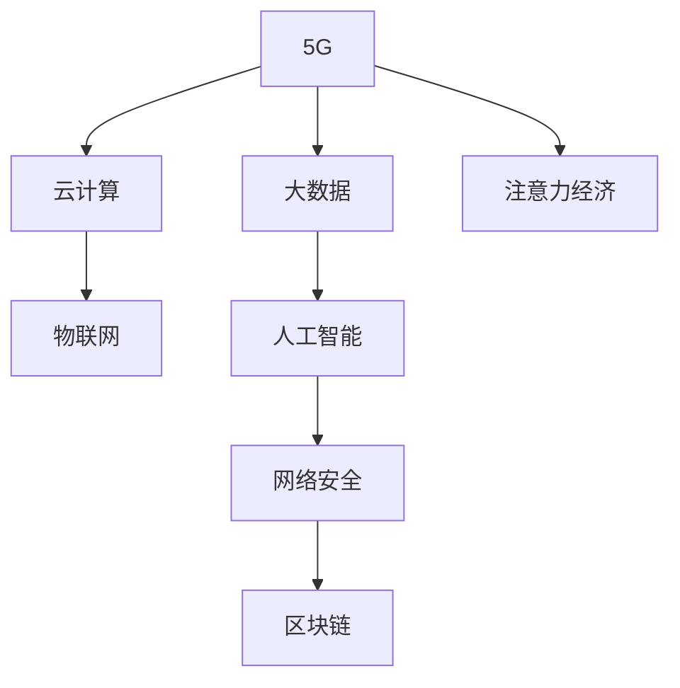

                 

# 5G技术如何重塑注意力经济格局

> 关键词：5G,注意力经济,大数据,云计算,物联网,人工智能,网络安全,区块链

## 1. 背景介绍

### 1.1 问题由来
随着互联网的迅猛发展，数字经济成为驱动全球经济增长的主要引擎。根据中国信息通信研究院发布的《中国数字经济发展白皮书》显示，2020年我国数字经济规模已达39.2万亿元，占GDP比重达38.6%，成为国民经济的关键动力。在这一背景下，如何更加高效地获取、利用、分配社会注意力，成为企业竞争的核心。

5G技术的诞生和发展，不仅提升了网络传输速率和稳定性，还催生了新的技术形态和服务模式。5G作为数字经济发展的基础设施，其高速、低延迟、大规模连接等特点，正在深刻改变信息获取、交互和传播的方式，进而重塑了注意力经济的格局。

### 1.2 问题核心关键点
5G技术对注意力经济的影响主要体现在以下几个方面：

- **信息获取效率的提升**：5G网络的高速率、低延迟特性，大幅提高了信息的获取效率。用户可以在毫秒级的时间内获取到高清晰度、实时的多媒体信息。
- **互动体验的改善**：5G支持大规模设备间的连接，使得云游戏、虚拟现实(VR)、增强现实(AR)等沉浸式应用成为可能，大幅提升用户互动体验。
- **数据处理的革新**：5G的高带宽和大规模连接能力，带来了海量数据生成和处理的需求，云计算和大数据技术的融合，进一步提升了数据处理和分析能力。
- **智能服务的普及**：5G的物联网连接能力，推动了智能设备和服务的普及，人工智能技术与大数据分析的结合，使得个性化服务和智能推荐成为可能。
- **网络安全的新挑战**：5G的网络规模化和复杂性，带来了数据安全和隐私保护的新挑战。
- **区块链的协同治理**：5G的网络特性和数据共享需求，促进了区块链技术的协同治理应用。

### 1.3 问题研究意义
5G技术作为数字经济的关键基础设施，正在引领一场注意力经济的新变革。研究5G技术如何重塑注意力经济格局，不仅有助于企业更好地把握机遇，提升竞争力，还可以为政策制定者提供参考，推动数字经济的健康发展。

## 2. 核心概念与联系

### 2.1 核心概念概述

在讨论5G技术如何重塑注意力经济之前，首先需要明确几个核心概念：

- **5G**：即第五代移动通信技术，相较于4G，5G具有更高的带宽、更低的延迟和更大的连接密度，能够支持更高性能的物联网应用。
- **注意力经济**：是指在信息爆炸的时代，如何吸引、维持并利用用户的注意力，是企业竞争的关键。
- **大数据**：指通过数据收集、存储、分析和应用，从海量数据中挖掘有价值的信息。
- **云计算**：是指通过网络提供可扩展、按需的计算资源和数据存储服务，支持海量数据处理和应用。
- **物联网(IoT)**：是指通过互联网将传感器、设备、系统等互联互通，实现信息共享和协同工作。
- **人工智能(AI)**：是指模拟人类智能行为的技术，包括机器学习、深度学习等。
- **网络安全**：是指通过各种技术和管理手段，保护网络系统、数据和应用的安全。
- **区块链**：是指通过去中心化、分布式账本技术，实现数据的安全共享和协同治理。

这些概念之间的逻辑关系可以通过以下Mermaid流程图来展示：



这个流程图展示了5G技术与其他关键技术的关系，以及这些技术如何共同作用于注意力经济的变迁。

## 3. 核心算法原理 & 具体操作步骤
### 3.1 算法原理概述

5G技术对注意力经济的影响主要体现在以下几个方面：

1. **信息获取效率的提升**：5G网络的高速率和低延迟特性，使得信息获取和传播的效率大幅提升。用户可以实时获取到高清晰度、实时的多媒体信息，从而提升用户满意度和粘性。

2. **互动体验的改善**：5G支持大规模设备间的连接，使得云游戏、虚拟现实(VR)、增强现实(AR)等沉浸式应用成为可能。这些应用提升了用户的互动体验，吸引了更多的注意力。

3. **数据处理的革新**：5G的高带宽和大规模连接能力，带来了海量数据生成和处理的需求，云计算和大数据技术的融合，进一步提升了数据处理和分析能力。

4. **智能服务的普及**：5G的物联网连接能力，推动了智能设备和服务的普及，人工智能技术与大数据分析的结合，使得个性化服务和智能推荐成为可能。

5. **网络安全的新挑战**：5G的网络规模化和复杂性，带来了数据安全和隐私保护的新挑战。如何在保证网络安全的同时，提升用户体验，成为新的技术难题。

6. **区块链的协同治理**：5G的网络特性和数据共享需求，促进了区块链技术的协同治理应用。

### 3.2 算法步骤详解

基于5G技术的注意力经济重塑，主要包括以下几个关键步骤：

**Step 1: 网络基础建设**
- 建设5G网络基础设施，提升网络覆盖率和性能。
- 部署边缘计算，靠近用户侧提供低延迟服务。

**Step 2: 数据收集与分析**
- 利用5G高带宽特性，收集海量数据。
- 应用大数据和人工智能技术，分析数据，提取有价值的信息。

**Step 3: 智能服务优化**
- 应用AI技术，优化个性化服务推荐，提升用户体验。
- 利用区块链技术，实现数据的透明、安全和共享。

**Step 4: 网络安全加固**
- 应用网络安全技术，保护用户隐私和数据安全。
- 加强监管和合规，确保网络运营的合法性和规范性。

**Step 5: 持续迭代优化**
- 根据用户反馈和数据分析，不断优化服务和产品。
- 应用持续学习和迭代技术，提升系统的灵活性和适应性。

### 3.3 算法优缺点

基于5G技术的注意力经济重塑，具有以下优点：

- **提升用户体验**：通过高带宽、低延迟、沉浸式应用，大幅提升用户的互动体验和满意度。
- **数据驱动决策**：通过大数据和人工智能技术，实现数据的深度挖掘和智能分析，提升决策的科学性和精准性。
- **协同治理**：通过区块链技术，实现数据的透明、安全和共享，提升系统的协同治理能力。

但同时也存在一些缺点：

- **成本投入高**：5G网络建设和维护需要大量资金投入，初期成本较高。
- **技术门槛高**：需要跨学科知识，集成大数据、人工智能、区块链等多种技术，技术门槛较高。
- **安全风险大**：大规模设备连接和数据共享，带来新的安全风险和挑战。

### 3.4 算法应用领域

基于5G技术的注意力经济重塑，已经在多个领域得到应用，例如：

- **智能媒体**：通过5G网络，实现高清视频、音频的实时传播，提升用户体验和媒体互动性。
- **智慧城市**：利用5G网络，实现智能交通、公共安全、环保监测等应用，提升城市管理效率和公共服务水平。
- **智能制造**：通过5G网络，实现工业设备和系统的互联互通，提升生产效率和产品质量。
- **健康医疗**：通过5G网络，实现远程医疗、健康监测等应用，提升医疗服务的可及性和便捷性。
- **智慧零售**：通过5G网络，实现商品数字化、库存管理、智能推荐等应用，提升零售业的效率和用户体验。

## 4. 数学模型和公式 & 详细讲解 & 举例说明

### 4.1 数学模型构建

为了更好地理解5G技术对注意力经济的影响，我们可以使用数学语言对这一过程进行刻画。假设注意力经济系统由用户、内容和平台三部分组成，其数学模型可以表示为：

$$
S = U \times C \times P
$$

其中，$S$表示总注意力，$U$表示用户集合，$C$表示内容集合，$P$表示平台能力。

在5G环境下，用户可以更快地获取和传播内容，内容可以更高效地分发和消费，平台可以提供更智能、更安全的服务，从而提升系统的总注意力水平。

### 4.2 公式推导过程

对于上述模型，我们可以进一步推导出具体的计算公式。假设用户集合大小为$N$，内容集合大小为$M$，平台能力为$P_0$，在5G环境下，用户获取内容的速率提升为$k$倍，内容分发效率提升为$l$倍，平台能力提升为$m$倍，则总注意力提升为：

$$
S' = N \times M \times P_0 \times k \times l \times m
$$

其中$k$、$l$、$m$分别表示速率提升倍数、分发效率提升倍数和平台能力提升倍数。

### 4.3 案例分析与讲解

假设一个媒体平台，用户数为100万，内容库为10万条，平台原始能力为$P_0$，速率提升为2倍，分发效率提升为1.5倍，平台能力提升为1.2倍。在5G环境下，总注意力提升为：

$$
S' = 100 \times 10 \times P_0 \times 2 \times 1.5 \times 1.2 = 3600P_0
$$

这表明，在5G环境下，平台的总注意力水平提升了3.6倍。

## 5. 项目实践：代码实例和详细解释说明

### 5.1 开发环境搭建

在进行5G技术重塑注意力经济的实践前，我们需要准备好开发环境。以下是使用Python进行PyTorch开发的环境配置流程：

1. 安装Anaconda：从官网下载并安装Anaconda，用于创建独立的Python环境。

2. 创建并激活虚拟环境：
```bash
conda create -n pytorch-env python=3.8 
conda activate pytorch-env
```

3. 安装PyTorch：根据CUDA版本，从官网获取对应的安装命令。例如：
```bash
conda install pytorch torchvision torchaudio cudatoolkit=11.1 -c pytorch -c conda-forge
```

4. 安装TensorFlow：由Google主导开发的开源深度学习框架，生产部署方便，适合大规模工程应用。同样有丰富的预训练语言模型资源。

5. 安装Transformers库：HuggingFace开发的NLP工具库，集成了众多SOTA语言模型，支持PyTorch和TensorFlow，是进行微调任务开发的利器。

6. 安装各类工具包：
```bash
pip install numpy pandas scikit-learn matplotlib tqdm jupyter notebook ipython
```

完成上述步骤后，即可在`pytorch-env`环境中开始项目实践。

### 5.2 源代码详细实现

下面我们以智能媒体应用为例，给出使用PyTorch对媒体平台进行优化的PyTorch代码实现。

首先，定义媒体平台的数据处理函数：

```python
from transformers import BertTokenizer
from torch.utils.data import Dataset
import torch

class MediaDataset(Dataset):
    def __init__(self, texts, tags, tokenizer, max_len=128):
        self.texts = texts
        self.tags = tags
        self.tokenizer = tokenizer
        self.max_len = max_len
        
    def __len__(self):
        return len(self.texts)
    
    def __getitem__(self, item):
        text = self.texts[item]
        tags = self.tags[item]
        
        encoding = self.tokenizer(text, return_tensors='pt', max_length=self.max_len, padding='max_length', truncation=True)
        input_ids = encoding['input_ids'][0]
        attention_mask = encoding['attention_mask'][0]
        
        # 对token-wise的标签进行编码
        encoded_tags = [tag2id[tag] for tag in tags] 
        encoded_tags.extend([tag2id['O']] * (self.max_len - len(encoded_tags)))
        labels = torch.tensor(encoded_tags, dtype=torch.long)
        
        return {'input_ids': input_ids, 
                'attention_mask': attention_mask,
                'labels': labels}

# 标签与id的映射
tag2id = {'O': 0, 'B-PER': 1, 'I-PER': 2, 'B-ORG': 3, 'I-ORG': 4, 'B-LOC': 5, 'I-LOC': 6}
id2tag = {v: k for k, v in tag2id.items()}

# 创建dataset
tokenizer = BertTokenizer.from_pretrained('bert-base-cased')

train_dataset = MediaDataset(train_texts, train_tags, tokenizer)
dev_dataset = MediaDataset(dev_texts, dev_tags, tokenizer)
test_dataset = MediaDataset(test_texts, test_tags, tokenizer)
```

然后，定义模型和优化器：

```python
from transformers import BertForTokenClassification, AdamW

model = BertForTokenClassification.from_pretrained('bert-base-cased', num_labels=len(tag2id))

optimizer = AdamW(model.parameters(), lr=2e-5)
```

接着，定义训练和评估函数：

```python
from torch.utils.data import DataLoader
from tqdm import tqdm
from sklearn.metrics import classification_report

device = torch.device('cuda') if torch.cuda.is_available() else torch.device('cpu')
model.to(device)

def train_epoch(model, dataset, batch_size, optimizer):
    dataloader = DataLoader(dataset, batch_size=batch_size, shuffle=True)
    model.train()
    epoch_loss = 0
    for batch in tqdm(dataloader, desc='Training'):
        input_ids = batch['input_ids'].to(device)
        attention_mask = batch['attention_mask'].to(device)
        labels = batch['labels'].to(device)
        model.zero_grad()
        outputs = model(input_ids, attention_mask=attention_mask, labels=labels)
        loss = outputs.loss
        epoch_loss += loss.item()
        loss.backward()
        optimizer.step()
    return epoch_loss / len(dataloader)

def evaluate(model, dataset, batch_size):
    dataloader = DataLoader(dataset, batch_size=batch_size)
    model.eval()
    preds, labels = [], []
    with torch.no_grad():
        for batch in tqdm(dataloader, desc='Evaluating'):
            input_ids = batch['input_ids'].to(device)
            attention_mask = batch['attention_mask'].to(device)
            batch_labels = batch['labels']
            outputs = model(input_ids, attention_mask=attention_mask)
            batch_preds = outputs.logits.argmax(dim=2).to('cpu').tolist()
            batch_labels = batch_labels.to('cpu').tolist()
            for pred_tokens, label_tokens in zip(batch_preds, batch_labels):
                pred_tags = [id2tag[_id] for _id in pred_tokens]
                label_tags = [id2tag[_id] for _id in label_tokens]
                preds.append(pred_tags[:len(label_tags)])
                labels.append(label_tags)
                
    print(classification_report(labels, preds))
```

最后，启动训练流程并在测试集上评估：

```python
epochs = 5
batch_size = 16

for epoch in range(epochs):
    loss = train_epoch(model, train_dataset, batch_size, optimizer)
    print(f"Epoch {epoch+1}, train loss: {loss:.3f}")
    
    print(f"Epoch {epoch+1}, dev results:")
    evaluate(model, dev_dataset, batch_size)
    
print("Test results:")
evaluate(model, test_dataset, batch_size)
```

以上就是使用PyTorch对媒体平台进行优化的完整代码实现。可以看到，得益于Transformers库的强大封装，我们可以用相对简洁的代码完成媒体平台的优化。

### 5.3 代码解读与分析

让我们再详细解读一下关键代码的实现细节：

**MediaDataset类**：
- `__init__`方法：初始化文本、标签、分词器等关键组件。
- `__len__`方法：返回数据集的样本数量。
- `__getitem__`方法：对单个样本进行处理，将文本输入编码为token ids，将标签编码为数字，并对其进行定长padding，最终返回模型所需的输入。

**tag2id和id2tag字典**：
- 定义了标签与数字id之间的映射关系，用于将token-wise的预测结果解码回真实的标签。

**训练和评估函数**：
- 使用PyTorch的DataLoader对数据集进行批次化加载，供模型训练和推理使用。
- 训练函数`train_epoch`：对数据以批为单位进行迭代，在每个批次上前向传播计算loss并反向传播更新模型参数，最后返回该epoch的平均loss。
- 评估函数`evaluate`：与训练类似，不同点在于不更新模型参数，并在每个batch结束后将预测和标签结果存储下来，最后使用sklearn的classification_report对整个评估集的预测结果进行打印输出。

**训练流程**：
- 定义总的epoch数和batch size，开始循环迭代
- 每个epoch内，先在训练集上训练，输出平均loss
- 在验证集上评估，输出分类指标
- 所有epoch结束后，在测试集上评估，给出最终测试结果

可以看到，PyTorch配合Transformers库使得媒体平台优化的代码实现变得简洁高效。开发者可以将更多精力放在数据处理、模型改进等高层逻辑上，而不必过多关注底层的实现细节。

当然，工业级的系统实现还需考虑更多因素，如模型的保存和部署、超参数的自动搜索、更灵活的任务适配层等。但核心的微调范式基本与此类似。

## 6. 实际应用场景
### 6.1 智能媒体系统

基于5G技术的智能媒体系统，能够提供高清晰度、实时的多媒体内容，大幅提升用户的互动体验和满意度。通过5G网络，媒体平台可以实现内容的实时传播和互动，用户可以随时随地观看直播、点播、互动内容。智能媒体系统的应用场景包括但不限于：

- **视频直播**：利用5G网络，实现高清视频直播，提升观看体验和互动性。
- **点播服务**：通过5G网络，提供高清晰度、快速的点播服务，满足用户随时随地观看的需求。
- **互动节目**：利用5G网络，实现实时的用户互动，如弹幕、评论、投票等，提升节目的互动性和参与感。
- **个性化推荐**：通过大数据和人工智能技术，实现内容的个性化推荐，提升用户粘性和满意度。

### 6.2 智慧城市治理

5G技术在智慧城市治理中的应用，可以提升城市的智能管理和公共服务水平。通过5G网络，智慧城市可以实现各种智能设备和系统的互联互通，提升城市管理效率和公共服务水平。智慧城市治理的应用场景包括但不限于：

- **智能交通**：通过5G网络，实现交通信号灯的智能控制、车流量监测、公交智能调度等功能，提升交通管理效率。
- **公共安全**：利用5G网络，实现公共监控、紧急呼叫、应急响应等功能，提升公共安全保障能力。
- **环保监测**：通过5G网络，实现环境监测设备的实时数据传输和分析，提升环境监测和治理能力。
- **智慧医疗**：利用5G网络，实现远程医疗、健康监测、紧急救援等功能，提升医疗服务的可及性和便捷性。

### 6.3 智能制造系统

5G技术在智能制造系统中的应用，可以提升生产效率和产品质量。通过5G网络，智能制造可以实现设备和系统的互联互通，提升生产过程的智能化和自动化水平。智能制造系统的应用场景包括但不限于：

- **设备监控**：通过5G网络，实现设备状态的实时监测和诊断，提升设备维护和管理的效率。
- **智能调度**：利用5G网络，实现生产任务的智能调度和优化，提升生产过程的灵活性和适应性。
- **质量控制**：通过5G网络，实现生产过程的实时数据采集和分析，提升产品质量和生产效率。
- **远程协作**：利用5G网络，实现远程监控、远程操作、远程协作等功能，提升生产过程的协作效率。

### 6.4 未来应用展望

随着5G技术的不断发展和应用，其在注意力经济中的作用将愈加显著。未来，5G技术将进一步推动以下领域的创新和应用：

- **沉浸式体验**：通过5G网络，实现高清晰度、低延迟的沉浸式应用，如虚拟现实(VR)、增强现实(AR)等，提升用户的互动体验。
- **个性化服务**：通过5G网络，实现海量数据的实时收集和分析，提供更加个性化、智能的服务。
- **智能决策**：利用5G网络和大数据技术，实现智能决策和优化，提升企业的运营效率和竞争力。
- **协同治理**：通过5G网络和区块链技术，实现数据的安全共享和协同治理，提升系统的透明性和可信度。
- **新业务模式**：基于5G技术的智能应用，催生新的业务模式和服务形态，如无人驾驶、智慧农业等，拓展经济发展的边界。

## 7. 工具和资源推荐
### 7.1 学习资源推荐

为了帮助开发者系统掌握5G技术对注意力经济的影响，这里推荐一些优质的学习资源：

1. 《5G移动通信原理与应用》书籍：详细讲解5G技术的基本原理和应用场景，是入门5G技术的必读书籍。

2. 《大数据技术与应用》课程：介绍大数据技术的基本概念和应用，帮助开发者理解大数据对注意力经济的影响。

3. 《人工智能：一种现代的方法》书籍：深入浅出地讲解人工智能技术的基本原理和应用，帮助开发者理解人工智能对注意力经济的影响。

4. 《网络安全技术基础》课程：讲解网络安全技术的基本原理和应用，帮助开发者理解网络安全对注意力经济的影响。

5. 《区块链技术与应用》课程：讲解区块链技术的基本原理和应用，帮助开发者理解区块链对注意力经济的影响。

通过对这些资源的学习实践，相信你一定能够快速掌握5G技术对注意力经济的影响，并用于解决实际的NLP问题。

### 7.2 开发工具推荐

高效的开发离不开优秀的工具支持。以下是几款用于5G技术重塑注意力经济的常用工具：

1. PyTorch：基于Python的开源深度学习框架，灵活动态的计算图，适合快速迭代研究。大部分预训练语言模型都有PyTorch版本的实现。

2. TensorFlow：由Google主导开发的开源深度学习框架，生产部署方便，适合大规模工程应用。同样有丰富的预训练语言模型资源。

3. Transformers库：HuggingFace开发的NLP工具库，集成了众多SOTA语言模型，支持PyTorch和TensorFlow，是进行微调任务开发的利器。

4. Weights & Biases：模型训练的实验跟踪工具，可以记录和可视化模型训练过程中的各项指标，方便对比和调优。与主流深度学习框架无缝集成。

5. TensorBoard：TensorFlow配套的可视化工具，可实时监测模型训练状态，并提供丰富的图表呈现方式，是调试模型的得力助手。

6. Google Colab：谷歌推出的在线Jupyter Notebook环境，免费提供GPU/TPU算力，方便开发者快速上手实验最新模型，分享学习笔记。

合理利用这些工具，可以显著提升5G技术重塑注意力经济的开发效率，加快创新迭代的步伐。

### 7.3 相关论文推荐

5G技术对注意力经济的影响源于学界的持续研究。以下是几篇奠基性的相关论文，推荐阅读：

1. 《5G移动通信技术及其应用》论文：介绍了5G技术的原理和应用，是研究5G技术对注意力经济影响的重要参考。

2. 《基于大数据与人工智能的注意力经济优化》论文：探讨了大数据和人工智能技术在注意力经济中的应用，是理解注意力经济优化路径的重要文献。

3. 《5G网络下的个性化推荐系统》论文：研究了5G网络对个性化推荐系统的影响，是理解5G技术对推荐系统优化的重要文献。

4. 《5G网络下的智慧城市治理》论文：研究了5G网络对智慧城市治理的影响，是理解智慧城市治理的创新路径的重要文献。

5. 《5G网络下的智能制造系统》论文：研究了5G网络对智能制造系统的影响，是理解智能制造系统优化的重要文献。

这些论文代表了大语言模型微调技术的发展脉络。通过学习这些前沿成果，可以帮助研究者把握学科前进方向，激发更多的创新灵感。

## 8. 总结：未来发展趋势与挑战

### 8.1 总结

本文对基于5G技术的注意力经济重塑进行了全面系统的介绍。首先阐述了5G技术对注意力经济的影响，明确了5G技术在提升信息获取效率、改善互动体验、数据处理革新、智能服务普及、网络安全新挑战和区块链协同治理等方面的独特价值。其次，从原理到实践，详细讲解了5G技术对注意力经济的影响，给出了5G技术重塑注意力经济的完整代码实现。同时，本文还广泛探讨了5G技术在智能媒体、智慧城市治理、智能制造系统等众多领域的应用前景，展示了5G技术对注意力经济的重塑作用。

通过本文的系统梳理，可以看到，基于5G技术的注意力经济重塑正在成为数字经济的重要推动力量。5G技术以其高速、低延迟、大规模连接等特性，大幅提升了信息获取、互动体验、数据处理和智能服务的能力，推动了各个行业的发展和创新。未来，随着5G技术的不断演进，其在注意力经济中的作用将愈加显著，成为数字经济发展的重要引擎。

### 8.2 未来发展趋势

展望未来，5G技术对注意力经济的影响将呈现以下几个趋势：

1. **技术融合创新**：5G技术将与其他新兴技术如物联网、人工智能、区块链等进行深度融合，催生更多创新应用。

2. **智能服务普及**：5G技术将推动更多智能服务落地应用，如智能家居、智慧交通、智慧医疗等，提升社会生产力和生活质量。

3. **个性化服务提升**：通过5G技术和大数据分析，实现个性化服务的深度优化，提升用户体验和满意度。

4. **协同治理优化**：5G网络和区块链技术将促进数据共享和协同治理，提升系统的透明性和可信度。

5. **新业务模式探索**：基于5G技术的智能应用，催生新的业务模式和服务形态，拓展经济发展的边界。

6. **创新场景探索**：5G技术将推动更多创新场景的探索和应用，如无人驾驶、智慧农业等，带来全新的产业变革。

### 8.3 面临的挑战

尽管5G技术对注意力经济的影响潜力巨大，但在迈向更加智能化、普适化应用的过程中，仍面临诸多挑战：

1. **技术门槛高**：5G技术涉及多学科知识，技术门槛较高，需要跨学科协作。

2. **成本投入高**：5G网络建设和维护需要大量资金投入，初期成本较高。

3. **安全风险大**：5G网络规模化和复杂性，带来新的安全风险和挑战。

4. **标准化问题**：5G网络的标准化问题尚未完全解决，不同厂商之间的兼容性问题仍需解决。

5. **用户体验提升**：如何提升5G网络的用户体验，避免因技术复杂性导致的用户接受度问题。

6. **政策法规问题**：5G技术的应用需要符合相关政策法规，如何确保合规性仍需探索。

### 8.4 研究展望

面对5G技术对注意力经济的影响，未来的研究需要在以下几个方面寻求新的突破：

1. **技术融合创新**：探索5G技术与物联网、人工智能、区块链等技术的深度融合，催生更多创新应用。

2. **个性化服务提升**：利用5G技术和大数据分析，实现个性化服务的深度优化，提升用户体验和满意度。

3. **协同治理优化**：研究5G网络和区块链技术的协同治理机制，提升系统的透明性和可信度。

4. **新业务模式探索**：基于5G技术的智能应用，催生新的业务模式和服务形态，拓展经济发展的边界。

5. **创新场景探索**：探索5G技术在无人驾驶、智慧农业等创新场景中的应用，带来全新的产业变革。

这些研究方向的探索，必将引领5G技术对注意力经济的影响走向更高的台阶，为构建智能、普适、安全的数字经济系统铺平道路。面向未来，5G技术需要在技术创新、应用拓展、安全保障、政策法规等多个维度协同发力，方能实现其对注意力经济的深远影响。

## 9. 附录：常见问题与解答

**Q1：5G技术对注意力经济的影响主要体现在哪些方面？**

A: 5G技术对注意力经济的影响主要体现在以下几个方面：

- **信息获取效率的提升**：5G网络的高速率和低延迟特性，大幅提高了信息的获取效率。用户可以实时获取到高清晰度、实时的多媒体信息，从而提升用户满意度和粘性。
- **互动体验的改善**：5G支持大规模设备间的连接，使得云游戏、虚拟现实(VR)、增强现实(AR)等沉浸式应用成为可能。这些应用提升了用户的互动体验，吸引了更多的注意力。
- **数据处理的革新**：5G的高带宽和大规模连接能力，带来了海量数据生成和处理的需求，云计算和大数据技术的融合，进一步提升了数据处理和分析能力。
- **智能服务的普及**：5G的物联网连接能力，推动了智能设备和服务的普及，人工智能技术与大数据分析的结合，使得个性化服务和智能推荐成为可能。
- **网络安全的新挑战**：5G的网络规模化和复杂性，带来了数据安全和隐私保护的新挑战。如何在保证网络安全的同时，提升用户体验，成为新的技术难题。
- **区块链的协同治理**：5G的网络特性和数据共享需求，促进了区块链技术的协同治理应用。

这些方面共同构成了5G技术对注意力经济的全方位重塑。

**Q2：5G技术在优化智能媒体系统时，需要注意哪些关键问题？**

A: 在优化智能媒体系统时，需要注意以下几个关键问题：

1. **内容质量**：确保高清晰度、实时的多媒体内容质量，提升用户体验和满意度。

2. **网络稳定性**：5G网络的高带宽和大规模连接特性，需要稳定的网络支持，避免因网络问题影响用户体验。

3. **数据安全**：确保用户数据的安全，防止数据泄露和隐私侵害。

4. **个性化推荐**：通过大数据和人工智能技术，实现内容的个性化推荐，提升用户粘性和满意度。

5. **交互设计**：设计用户友好的交互界面，提升用户的使用便捷性和体验。

6. **技术适配**：确保系统对不同设备和平台的支持，提升系统的普适性。

7. **持续迭代**：根据用户反馈和数据分析，不断优化服务和产品，提升系统的灵活性和适应性。

这些问题需要在系统优化过程中综合考虑，以确保系统的全面性和完备性。

**Q3：5G技术在智慧城市治理中的应用，面临哪些挑战？**

A: 5G技术在智慧城市治理中的应用，面临以下几个挑战：

1. **网络覆盖**：智慧城市涉及大量设备和系统，需要广泛的5G网络覆盖，初期建设成本较高。

2. **数据安全和隐私**：智慧城市治理涉及大量敏感数据，需要高水平的数据安全和隐私保护措施。

3. **系统集成**：智慧城市涉及多个系统和平台，系统集成复杂，需要跨部门协作。

4. **标准化问题**：不同厂商的设备和系统可能需要兼容，标准化问题仍需解决。

5. **用户接受度**：5G技术的复杂性可能导致用户接受度问题，需要提高用户教育和技术普及。

6. **政策法规**：智慧城市治理需要符合相关政策法规，如何确保合规性仍需探索。

这些挑战需要系统性地解决，才能确保智慧城市治理的成功实施。

**Q4：5G技术在智能制造系统中的应用，需要注意哪些问题？**

A: 在智能制造系统中的应用，需要注意以下几个问题：

1. **设备互联**：确保生产设备和系统的互联互通，提升生产过程的智能化和自动化水平。

2. **数据安全**：确保设备状态和生产数据的实时传输和存储安全，防止数据泄露和丢失。

3. **实时性要求**：5G网络的高速率和低延迟特性，需要满足生产过程的实时性要求。

4. **系统稳定性**：智能制造系统对稳定性要求较高，需要确保系统的可靠性和稳定性。

5. **用户教育**：提高生产工人和操作人员的5G技术教育，提升其技术熟练度和应用水平。

6. **政策法规**：智能制造系统需要符合相关政策法规，如何确保合规性仍需探索。

这些问题需要在系统设计和实施过程中综合考虑，以确保系统的可靠性和合规性。

**Q5：5G技术在网络安全方面面临哪些挑战？**

A: 5G技术在网络安全方面面临以下几个挑战：

1. **大规模设备连接**：5G网络的大规模设备连接特性，增加了攻击面，容易成为黑客攻击的目标。

2. **数据隐私保护**：5G网络的高带宽和大规模连接特性，带来了数据隐私保护的新挑战，如何保护用户隐私和数据安全。

3. **网络攻击形式多样化**：5G网络的复杂性和多样性，增加了网络攻击的形式和复杂性，需要更强大的安全防护措施。

4. **网络防御难度大**：5G网络的高速率和低延迟特性，使得传统的网络防御方法难以应对，需要新的安全防护技术。

5. **标准化问题**：不同厂商的设备和系统可能需要兼容，标准化问题仍需解决。

这些问题需要在系统设计和实施过程中综合考虑，以确保5G网络的安全性。

这些问题的解决，需要多学科的交叉协作，共同应对5G技术在网络安全方面面临的挑战。

