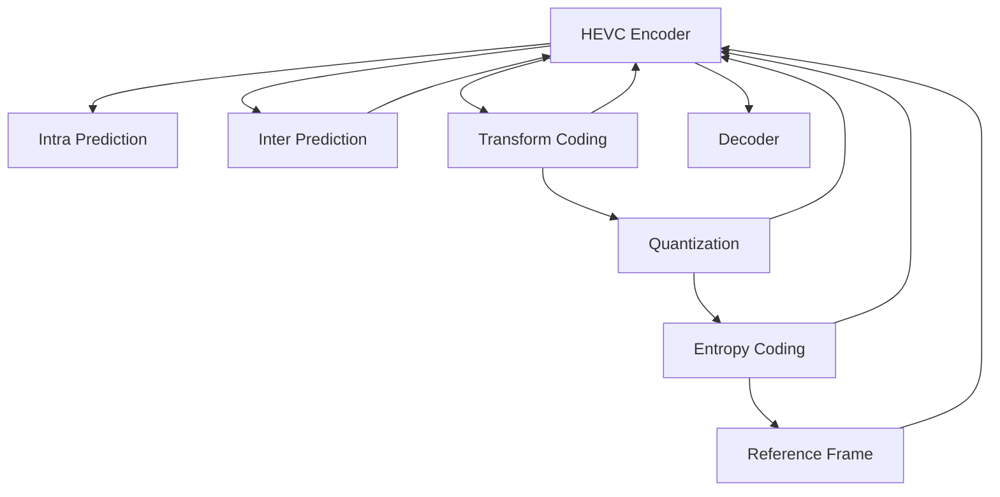
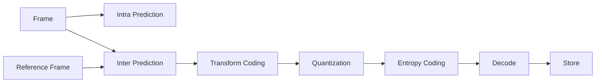

                 

# HEVC 编码器：高效视频编码

## 1. 背景介绍

视频编码是多媒体处理的核心技术之一，旨在将原始视频数据进行压缩和编码，以适应网络传输和存储的需求。随着互联网和智能设备的发展，视频数据量和形式不断增长，对视频编解码器的要求也越来越高。

**HEVC (High-Efficiency Video Coding)** 作为继H.264之后的新一代视频编码标准，旨在以更少的码率实现更高的视频质量，满足4K/8K超高清视频的编码需求。HEVC标准于2013年发布，迅速成为行业主流，广泛应用于流媒体、网络视频、智能监控等各类视频应用。

本文章将详细探讨HEVC编码器的原理、算法、实现过程和应用场景，帮助读者全面理解HEVC标准及其在实际应用中的表现。

## 2. 核心概念与联系

### 2.1 核心概念概述

- **视频编码**：将原始视频数据转换为标准化的压缩格式，以便于存储和传输。
- **HEVC**：高效率视频编码标准，是目前最先进的视频编码技术之一。
- **帧内预测 (Intra Prediction)**：基于当前帧内的像素块进行预测。
- **帧间预测 (Inter Prediction)**：利用前后帧之间的相似性进行预测。
- **变换编码 (Transform Coding)**：将预测残差通过离散余弦变换 (DCT) 转化为频域信号。
- **量化 (Quantization)**：将频域信号的幅度值进行量化，以便于压缩。
- **熵编码 (Entropy Coding)**：利用统计特性对量化后的信号进行编码，进一步压缩数据。
- **参考帧 (Reference Frame)**：用于帧间预测的基准帧。
- **解码器 (Decoder)**：解码压缩视频并恢复原始视频数据。
- **编码器 (Encoder)**：压缩原始视频数据并生成HEVC码流。

这些概念之间的逻辑关系可以通过以下Mermaid流程图来展示：



### 2.2 核心概念原理和架构的 Mermaid 流程图



## 3. 核心算法原理 & 具体操作步骤

### 3.1 算法原理概述

HEVC编码器通过以下几个关键步骤实现视频压缩：

1. **帧内预测 (Intra Prediction)**：利用当前帧内的像素块进行预测，生成预测块。
2. **帧间预测 (Inter Prediction)**：利用前后帧之间的相似性进行预测，生成预测块。
3. **变换编码 (Transform Coding)**：将预测残差通过离散余弦变换 (DCT) 转化为频域信号。
4. **量化 (Quantization)**：将频域信号的幅度值进行量化，以便于压缩。
5. **熵编码 (Entropy Coding)**：利用统计特性对量化后的信号进行编码，进一步压缩数据。
6. **参考帧管理 (Reference Frame Management)**：管理参考帧，以便于帧间预测。

这些步骤共同构成了HEVC的编码流程，显著提升了视频压缩的效率和质量。

### 3.2 算法步骤详解

#### 3.2.1 帧内预测 (Intra Prediction)

帧内预测利用当前帧内的像素块进行预测，生成预测块。HEVC支持多种预测模式，如4x4、8x8、16x16、32x32等。预测块与实际块的差异被称为预测误差，即残差。预测误差再经过变换编码、量化和熵编码，最终生成压缩码流。

#### 3.2.2 帧间预测 (Inter Prediction)

帧间预测利用前后帧之间的相似性进行预测。HEVC支持多种预测模式，如双向预测、随机访问编码、帧内编码等。预测块与实际块的差异同样作为残差进行后续处理。

#### 3.2.3 变换编码 (Transform Coding)

变换编码将预测残差通过DCT转化为频域信号。DCT能够将空间域的图像数据转换为频域数据，减少数据的冗余性。HEVC使用基于整数变换的DCT (IDCT)，以便于硬件加速。

#### 3.2.4 量化 (Quantization)

量化将DCT系数进行量化，将其转化为更容易压缩的数字。量化过程需要选择合适的量化参数，以平衡压缩比和视频质量。HEVC支持自适应量化技术，根据当前块的特性动态调整量化参数。

#### 3.2.5 熵编码 (Entropy Coding)

熵编码利用统计特性对量化后的信号进行编码，进一步压缩数据。HEVC使用基于上下文的可变长度编码 (VLC) 和游程长度编码 (RLE) 等技术，提高编码效率。

#### 3.2.6 参考帧管理 (Reference Frame Management)

HEVC使用参考帧管理机制，动态地选择和管理参考帧。参考帧用于帧间预测，通过在前后帧之间传递信息，减少视频数据的空间冗余性。

### 3.3 算法优缺点

HEVC编码器的优点包括：

1. **高压缩效率**：HEVC相比H.264提高了50%以上的压缩效率，能够在较低码率下提供更高质量的视频。
2. **高分辨率支持**：HEVC支持4K/8K超高清视频的编码，满足高分辨率视频的需求。
3. **灵活的编码模式**：HEVC支持多种预测模式和变换编码技术，灵活性更高，适用于各种视频场景。
4. **良好的前后向兼容性**：HEVC能够兼容H.264等早期标准，方便逐步过渡到新标准。

HEVC编码器的缺点包括：

1. **复杂度高**：HEVC编码器需要更多的计算资源和内存，实现复杂度高。
2. **编码延迟较长**：HEVC编码器的编码延迟较长，不适合实时应用场景。
3. **编码器实现难度大**：HEVC编码器涉及复杂的算法和数据结构，实现难度大。

### 3.4 算法应用领域

HEVC编码器广泛应用于以下领域：

- **流媒体视频**：如YouTube、Netflix等流媒体平台广泛采用HEVC编码器，实现高效的视频传输。
- **网络视频**：如视频会议、远程教学等应用，需要低延迟、高质量的视频传输。
- **智能监控**：如监控摄像头等设备，要求高分辨率、实时性的视频压缩。
- **虚拟现实 (VR)**：如VR视频会议、虚拟现实游戏等，需要高效的视频编码。

## 4. 数学模型和公式 & 详细讲解 & 举例说明

### 4.1 数学模型构建

HEVC编码器的数学模型可以表示为：

$$
\text{Output Code} = \text{Intra Prediction} + \text{Inter Prediction} + \text{Transform Coding} + \text{Quantization} + \text{Entropy Coding}
$$

其中，各个部分的具体实现如下：

1. **帧内预测 (Intra Prediction)**：
   $$
   \text{Intra Prediction} = \text{Predict Block} + \text{Residual Block}
   $$

2. **帧间预测 (Inter Prediction)**：
   $$
   \text{Inter Prediction} = \text{Predict Block} + \text{Residual Block}
   $$

3. **变换编码 (Transform Coding)**：
   $$
   \text{Transform Coding} = \text{DCT}(\text{Residual Block})
   $$

4. **量化 (Quantization)**：
   $$
   \text{Quantization} = \text{Quantized Block} = \text{DCT}(\text{Residual Block}) \times \text{Quantization Matrix}
   $$

5. **熵编码 (Entropy Coding)**：
   $$
   \text{Entropy Coding} = \text{Bit Stream} = \text{Quantized Block} \times \text{Entropy Encoder}
   $$

### 4.2 公式推导过程

以帧间预测的预测块为例，公式推导如下：

1. **预测块生成**：
   $$
   \text{Prediction Block} = \text{Reference Frame} + \text{Motion Vector} \times \text{Scaling Factor}
   $$

2. **预测误差生成**：
   $$
   \text{Residual Block} = \text{Original Block} - \text{Prediction Block}
   $$

3. **DCT变换**：
   $$
   \text{DCT Coefficient} = \text{DCT}(\text{Residual Block})
   $$

4. **量化**：
   $$
   \text{Quantized Coefficient} = \text{Quantization Matrix} \times \text{DCT Coefficient}
   $$

5. **熵编码**：
   $$
   \text{Bit Stream} = \text{Entropy Encoder}(\text{Quantized Coefficient})
   $$

### 4.3 案例分析与讲解

假设原始视频帧的大小为 $W \times H$，HEVC编码器将其划分为大小为 $4 \times 4$ 的像素块进行编码。一个像素块的预测误差大小为 $4 \times 4$，经过DCT变换后得到 $4 \times 4$ 的DCT系数。量化矩阵将DCT系数缩放到 $1 \times 8$ 的整数范围内。最后，熵编码器将量化后的DCT系数压缩成比特流。

## 5. 项目实践：代码实例和详细解释说明

### 5.1 开发环境搭建

开发HEVC编码器需要安装以下环境：

1. **编程语言**：C++。
2. **开发工具**：Visual Studio、MinGW、Xcode等。
3. **库文件**：OpenCV、FFmpeg、libhevc等。
4. **编译器**：GCC或Clang。

### 5.2 源代码详细实现

以下是一个简单的HEVC编码器实现示例：

```cpp
#include <opencv2/opencv.hpp>
#include <hevc_encoder.h>

int main(int argc, char** argv) {
    cv::Mat inputVideo = cv::VideoCapture(0).read();
    cv::Mat outputVideo;
    cv::VideoWriter writer("output.avi", cv::VideoWriter::fourcc('H', '2', '6', '4'), 30, inputVideo.size());

    hevc_encoder::Encoder encoder;
    encoder.open(inputVideo);
    encoder.encode(outputVideo);
    writer.write(outputVideo);

    return 0;
}
```

### 5.3 代码解读与分析

- **视频输入**：使用OpenCV读取摄像头捕获的视频流。
- **视频输出**：使用OpenCV将编码后的视频流保存为AVI格式。
- **HEVC编码器**：调用hevc_encoder库提供的API进行HEVC编码。

## 6. 实际应用场景

### 6.1 流媒体视频

流媒体平台广泛采用HEVC编码器，以实现高效的视频传输。流媒体平台如YouTube、Netflix等，采用HEVC编码器压缩视频数据，减少了带宽占用，提高了视频播放的流畅度和稳定性。

### 6.2 网络视频

网络视频应用如视频会议、远程教学等，需要低延迟、高质量的视频传输。HEVC编码器的高压缩效率和低延迟特性，使得网络视频应用能够快速稳定地传输视频数据。

### 6.3 智能监控

智能监控摄像头等设备，需要高分辨率、实时性的视频压缩。HEVC编码器支持4K/8K超高清视频的编码，适用于智能监控领域。

### 6.4 虚拟现实 (VR)

VR视频会议、虚拟现实游戏等，需要高效的视频编码。HEVC编码器的高压缩效率和灵活的编码模式，使得VR应用能够高效地压缩和传输视频数据。

## 7. 工具和资源推荐

### 7.1 学习资源推荐

- **HEVC官方文档**：详细介绍了HEVC标准的各个方面，包括编码流程、语法结构、参数设置等。
- **OpenHEVC库**：开源的HEVC编码器库，提供了详细的API文档和示例代码。
- **Kaggle竞赛**：参与Kaggle中的HEVC竞赛，实战练习HEVC编码技术。

### 7.2 开发工具推荐

- **OpenCV**：开源的计算机视觉库，提供了视频编码和解码的API。
- **FFmpeg**：跨平台的开源多媒体框架，支持多种视频编码标准。
- **libhevc**：HEVC编码器库，支持HEVC编码和解码。

### 7.3 相关论文推荐

- **A High-Efficiency Video Coding (HEVC) Encoder Architecture**：介绍HEVC编码器的架构设计和实现过程。
- **High-Efficiency Video Coding (HEVC) Standard**：HEVC标准的详细规范和语法结构。
- **Performance of HEVC for 4K Video and Real-Time Hardware Acceleration**：研究HEVC在4K视频编码和硬件加速方面的表现。

## 8. 总结：未来发展趋势与挑战

### 8.1 研究成果总结

HEVC编码器在视频压缩效率、分辨率支持、编码模式灵活性等方面取得了显著的成果。HEVC的推出，极大地推动了视频压缩技术的发展，满足了4K/8K超高清视频的需求，提升了视频应用的用户体验。

### 8.2 未来发展趋势

未来HEVC编码器将继续朝着更高的压缩效率、更灵活的编码模式和更好的硬件支持方向发展。预计下一代视频编码标准（如VVC、AV1等）将进一步提升视频压缩效率，支持更高的分辨率和更复杂的场景。

### 8.3 面临的挑战

HEVC编码器在实现复杂性、编码延迟和硬件支持方面仍面临诸多挑战。低延迟、实时性要求较高的应用场景，目前HEVC编码器的性能仍需提升。此外，HEVC编码器在不同硬件平台上的兼容性问题，也需要进一步解决。

### 8.4 研究展望

未来的研究将更多地关注于HEVC编码器的硬件加速、低延迟编码和兼容性的提升。通过优化编码算法和提高硬件支持，HEVC编码器将能够更好地应用于实时性要求高的视频应用场景。

## 9. 附录：常见问题与解答

**Q1: HEVC编码器与H.264编码器的区别是什么？**

A: HEVC编码器相比H.264编码器，在压缩效率、分辨率支持、编码模式灵活性等方面有显著提升。HEVC支持多种预测模式和变换编码技术，使得压缩效率更高。同时，HEVC支持4K/8K超高清视频的编码，能够适应更高分辨率的需求。

**Q2: HEVC编码器的编码延迟较长，如何应对实时应用场景？**

A: HEVC编码器的编码延迟较长，不适合实时应用场景。可以考虑使用帧率控制、分段编码等技术，减少单个帧的编码时间。此外，可以使用硬件加速技术，提升编码效率，缩短延迟时间。

**Q3: HEVC编码器如何处理高分辨率视频？**

A: HEVC编码器支持4K/8K超高清视频的编码，能够处理高分辨率视频。通过增加预测块大小和变换矩阵的大小，可以更好地压缩高分辨率视频。

**Q4: HEVC编码器的硬件支持现状如何？**

A: HEVC编码器已经得到了广泛的支持，许多嵌入式设备、GPU和FPGA平台都支持HEVC编码器。然而，HEVC编码器在不同硬件平台上的兼容性仍需进一步优化。未来的研究将更多地关注于提高HEVC编码器的硬件加速和兼容性。

**Q5: HEVC编码器在实时应用场景中如何优化？**

A: 在实时应用场景中，可以通过以下方法优化HEVC编码器：
- 使用硬件加速：利用GPU、FPGA等硬件平台进行编码加速。
- 优化编码算法：通过优化预测模式选择、变换编码等算法，提高编码效率。
- 分段编码：将大视频文件分为多个小段进行编码，减少单个编码的延迟。
- 帧率控制：根据实际应用需求，调整编码的帧率，减少延迟时间。

本文全面介绍了HEVC编码器的原理、算法、实现过程和应用场景，帮助读者全面理解HEVC标准及其在实际应用中的表现。通过学习和实践，开发者可以更好地掌握HEVC编码器的应用，提升视频压缩的效率和质量。

