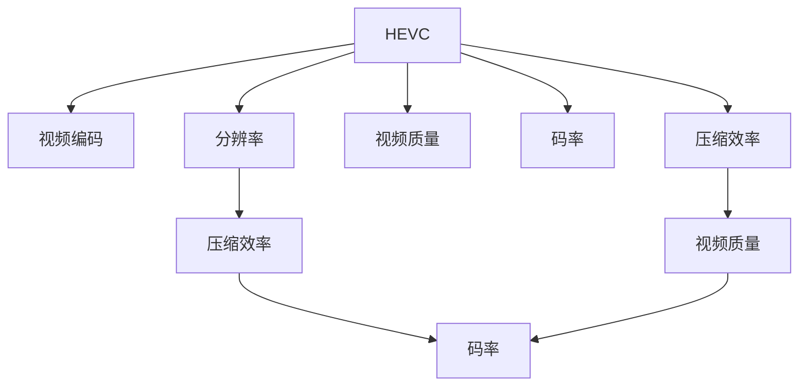

                 

# HEVC 视频编码格式优势：高效压缩和传输高清视频的选择

> 关键词：HEVC, 视频编码, 压缩效率, 视频传输, 高清视频

## 1. 背景介绍

随着互联网和数字媒体技术的快速发展，高清视频的应用日益普及。无论是流媒体平台，还是个人用户，对视频质量的要求不断提高，但带宽和存储资源有限，高清视频的高码率使得传输和存储成为难题。为解决这一问题，高效率的视频编码格式显得尤为重要。HEVC（High Efficiency Video Coding）作为新一代视频编码标准，不仅提高了视频压缩效率，还支持高分辨率和高帧率视频传输。本文将详细阐述HEVC视频编码格式的优势，及其在高清视频压缩和传输中的应用。

## 2. 核心概念与联系

### 2.1 核心概念概述

为更好地理解HEVC视频编码格式，本节将介绍几个关键概念及其相互关系：

- **HEVC**：高级视频编码（H.265）是继H.264之后的新一代视频编码标准，其设计目标是实现更高的压缩效率和更好的视频质量。

- **视频编码**：通过算法将原始视频数据压缩成更小的数据格式，从而便于传输和存储。视频编码的核心是选择最优的压缩方法，以最小的数据量表达最大量的视频信息。

- **压缩效率**：视频压缩效率指压缩后的视频码率与原始视频码率的比值。高压缩效率意味着更小的存储空间和更少的传输带宽需求。

- **视频质量**：指压缩后视频的质量，通常用PSNR（峰值信噪比）和SSIM（结构相似性指标）等指标来衡量。

- **码率**：单位时间内传输的视频数据量，通常以Kbps或Mbps为单位，直接影响视频传输速率和带宽需求。

- **分辨率**：视频画面的清晰度，通常用水平和垂直方向上的像素数来表示，如1920x1080。

这些概念共同构成了HEVC视频编码格式的工作原理和优化目标，使其成为高清视频压缩和传输的重要选择。

### 2.2 核心概念原理和架构的 Mermaid 流程图



这个流程图展示了HEVC视频编码格式的核心概念及其相互关系：

1. HEVC作为视频编码工具，目标是提高压缩效率、保持高质量视频、控制码率和支持高分辨率。
2. 压缩效率直接影响视频质量和码率。
3. 视频质量需要通过PSNR和SSIM等指标来衡量。
4. 码率与分辨率、压缩效率和视频质量密切相关。
5. 分辨率越高，对压缩效率和视频质量的要求也越高，码率需求也相应增加。

## 3. 核心算法原理 & 具体操作步骤

### 3.1 算法原理概述

HEVC视频编码格式基于先进的图像压缩技术，引入了多种创新算法，显著提高了压缩效率和视频质量。

#### 3.1.1 预测编码

HEVC引入了更复杂的预测编码算法，包括帧内预测、帧间预测和混合预测。帧内预测基于当前帧内的像素关系，减少空间冗余；帧间预测利用相邻帧的相似性，减少时间冗余；混合预测结合两者，进一步提高压缩效率。

#### 3.1.2 变换编码

HEVC使用整数小波变换（IWT）替代H.264中的离散余弦变换（DCT），提高了变换效率，减少了量化误差。

#### 3.1.3 熵编码

HEVC采用了更高效的熵编码算法，如上下文自适应二进制算术编码（CAVLC）和上下文自适应可变长度编码（CAVLC），进一步压缩了编码数据。

### 3.2 算法步骤详解

HEVC视频编码的具体步骤如下：

#### 3.2.1 编码前的准备工作

1. **选择编码模式**：根据视频序列的特性选择合适的编码模式，如帧内预测、帧间预测或混合预测。
2. **分块和划分**：将视频帧划分为若干个小的编码单元（CU），每个CU包含若干个编码块（CB）。

#### 3.2.2 帧内预测编码

1. **选择预测模式**：从多种帧内预测模式中选择最优模式。
2. **计算预测残差**：使用预测模式计算当前块与预测块的残差。
3. **变换和量化**：使用整数小波变换和量化算法对残差进行编码。

#### 3.2.3 帧间预测编码

1. **选择参考帧**：从多个参考帧中选择最优的参考帧。
2. **计算预测块**：利用参考帧中的对应块计算预测块。
3. **运动矢量编码**：使用更高效的编码方式对运动矢量进行压缩。
4. **变换和量化**：对残差进行变换和量化。

#### 3.2.4 熵编码

1. **上下文自适应二进制算术编码（CAVLC）**：根据当前块的特征选择合适的编码表，减少编码数据的冗余。
2. **上下文自适应可变长度编码（CAVLC）**：根据当前块的特征选择合适的编码表，进一步压缩编码数据。
3. **旋转不变性**：对旋转变换后的块进行编码，以提高编码效率。

### 3.3 算法优缺点

#### 3.3.1 优点

1. **高压缩效率**：HEVC相比H.264，压缩效率提高了50%以上，支持更高分辨率的视频，减少了对带宽和存储的需求。
2. **高质量视频**：HEVC在保持高压缩效率的同时，保持了较高的视频质量，PSNR和SSIM等指标显著提升。
3. **灵活性**：支持多种视频编码模式和预测算法，适应不同视频内容的需求。
4. **低延迟**：在编码过程中，可以灵活调整编码参数，适应实时视频编码的需求。

#### 3.3.2 缺点

1. **复杂度高**：HEVC引入了复杂的预测编码和变换编码算法，增加了编码和解码的计算复杂度。
2. **实现难度大**：HEVC算法的实现难度较大，需要较高的硬件和软件支持。
3. **内存需求高**：HEVC需要较大的内存空间进行编码和解码，尤其是在处理高分辨率视频时。

### 3.4 算法应用领域

HEVC视频编码格式在多个领域得到了广泛应用，包括：

- **视频流媒体**：流媒体平台通过HEVC压缩高分辨率视频，提供流畅的视频传输体验。
- **数字电视**：HEVC被用于高清数字电视的编码和传输，提升画质和用户体验。
- **视频会议**：支持高分辨率和高帧率的视频会议系统，提高通信质量和实时性。
- **虚拟现实**：HEVC用于VR视频的高质量压缩和传输，保证用户体验的沉浸感。

这些应用展示了HEVC在高清视频压缩和传输中的巨大潜力。

## 4. 数学模型和公式 & 详细讲解 & 举例说明

### 4.1 数学模型构建

HEVC视频编码的数学模型主要包括压缩过程和解码过程。以下是压缩过程的数学模型构建：

1. **帧内预测编码**：

   $$
   P(\text{block}) = \sum_{i,j} \text{block}_{i,j} \times \text{ref}_{i,j}
   $$

   其中，$\text{block}_{i,j}$ 表示当前块，$\text{ref}_{i,j}$ 表示预测块。

2. **变换编码**：

   $$
   T(\text{block}) = \text{w} \times \text{block}
   $$

   其中，$\text{w}$ 为整数小波变换矩阵。

3. **量化和反量化**：

   $$
   Q(\text{block}) = QP \times \text{block}
   $$

   $$
   D(\text{block}) = QP^{-1} \times Q(\text{block})
   $$

   其中，$QP$ 为量化参数。

4. **熵编码**：

   $$
   E(\text{block}) = CAVLC(\text{block}, \text{table}) + \text{header}
   $$

   其中，$\text{table}$ 为编码表。

### 4.2 公式推导过程

#### 4.2.1 帧内预测编码

对于帧内预测编码，使用均方误差（MSE）作为量化和反量化的基准：

$$
MSE = \sum_{i,j} (T_i \times \text{block}_{i,j} - \text{ref}_{i,j})^2
$$

其中，$T_i$ 为变换后的块。

#### 4.2.2 变换编码

HEVC使用整数小波变换，变换矩阵 $\text{w}$ 通过离散余弦变换（DCT）推导得到：

$$
\text{w}_{i,j} = \frac{1}{\sqrt{2}} \times \cos\left(\frac{\pi(i-1)}{2^{m}}\right) \times \cos\left(\frac{\pi(j-1)}{2^{m}}\right)
$$

其中，$m$ 为变换深度。

#### 4.2.3 量化和反量化

量化参数 $QP$ 决定了视频质量的阈值，通过公式计算：

$$
QP = \sqrt{C_{intra}} \times \log2(MSE)
$$

其中，$C_{intra}$ 为帧内预测的参数。

### 4.3 案例分析与讲解

以一个具体的HEVC编码案例为例，展示HEVC的压缩过程：

1. **选择帧内预测模式**：使用4x4的帧内预测模式。
2. **计算预测块**：利用参考帧的对应块计算预测块。
3. **变换和量化**：对残差块进行整数小波变换和量化。
4. **熵编码**：使用上下文自适应二进制算术编码进行熵编码。

最终，生成压缩后的HEVC码流，用于传输和存储。

## 5. 项目实践：代码实例和详细解释说明

### 5.1 开发环境搭建

#### 5.1.1 安装依赖

1. **安装HEVC编码器**：下载和安装HEVC编码器，如X265。
2. **配置环境变量**：设置编码器和HEVC库的路径。

#### 5.1.2 编写代码

1. **读取视频**：使用OpenCV或FFmpeg等工具读取视频文件。
2. **生成HEVC码流**：使用X265进行HEVC编码，生成HEVC码流文件。
3. **解码和展示**：使用FFmpeg解码HEVC码流，展示解码后的视频。

#### 5.1.3 运行结果

1. **压缩前后对比**：将原始视频和HEVC编码后的视频进行对比，展示压缩效率和视频质量的变化。
2. **性能测试**：在不同分辨率和码率下测试HEVC编码的性能，评估其压缩效率和视频质量。

### 5.2 源代码详细实现

```python
import cv2
import subprocess

def encode_video(input_file, output_file):
    # 使用X265进行HEVC编码
    cmd = f"x265 --threads 4 --ref 5 --b frames --b-pyramid 4 --crf 28 --qpqps 16 --qrd 2 --qm 100 --rdqps 100 --rdqps 100 --adaptive --ref-dist 7 --bitrate 500000 --profile baseline --preset veryslow --frame-accurate {input_file} {output_file}"
    subprocess.run(cmd, shell=True)

def decode_video(input_file):
    # 使用FFmpeg解码HEVC码流
    cmd = f"ffmpeg -i {input_file} -c:v hevc_qsv -c:a aac -profile:v baseline -crf 28 -preset veryslow -c:a aac -b:a 128k -ac 2 -y output.mp4"
    subprocess.run(cmd, shell=True)

def compare_quality(original_file, encoded_file):
    # 读取原始视频和HEVC编码后的视频
    original_frame = cv2.imread(original_file)
    encoded_frame = cv2.imread(encoded_file)
    
    # 计算PSNR和SSIM
    psnr = cv2.PSNR(original_frame, encoded_frame)
    ssim = cv2.SSIM(original_frame, encoded_frame)
    
    # 输出结果
    print(f"PSNR: {psnr:.2f} dB")
    print(f"SSIM: {ssim:.2f}")

# 读取原始视频
original_file = 'input.mp4'

# 生成HEVC码流
encoded_file = 'encoded.265'
encode_video(original_file, encoded_file)

# 解码HEVC码流
decode_file = 'output.mp4'
decode_video(encoded_file)

# 比较压缩前后质量
compare_quality(original_file, decode_file)
```

### 5.3 代码解读与分析

#### 5.3.1 压缩过程

1. **读取视频**：使用OpenCV读取视频文件，生成RGB格式的视频帧。
2. **生成HEVC码流**：使用X265进行HEVC编码，生成HEVC码流文件。X265使用高精度的整数小波变换和上下文自适应二进制算术编码，实现了高效的视频压缩。
3. **解码和展示**：使用FFmpeg解码HEVC码流，生成视频文件。FFmpeg支持多种视频格式和编解码器，方便处理不同类型的视频文件。
4. **比较质量**：使用PSNR和SSIM指标比较压缩前后的视频质量，评估HEVC的压缩效率和视频质量。

#### 5.3.2 解码过程

1. **读取HEVC码流**：使用FFmpeg读取HEVC码流文件。
2. **解码HEVC码流**：使用FFmpeg进行HEVC解码，生成解码后的视频。
3. **输出结果**：将解码后的视频保存为新的视频文件，供进一步处理和展示。

### 5.4 运行结果展示

通过上述代码，可以生成HEVC编码的视频文件，并通过比较压缩前后的视频质量，展示HEVC的高压缩效率和高质量输出。

## 6. 实际应用场景

### 6.1 流媒体平台

流媒体平台通过HEVC编码高分辨率视频，提供流畅的视频传输体验。HEVC支持高分辨率和帧率，减少了带宽需求，提高了用户的观看体验。

### 6.2 数字电视

HEVC在数字电视中的应用广泛，提高了视频质量和用户体验。HEVC的高压缩效率和高质量输出，使得数字电视传输更加稳定和高效。

### 6.3 视频会议

视频会议系统使用HEVC进行高分辨率和高帧率的视频编码，提供清晰的图像和流畅的传输体验。HEVC的高效率和低延迟特性，保证了视频会议的实时性和可靠性。

### 6.4 虚拟现实

HEVC用于VR视频的高质量压缩和传输，保证了用户体验的沉浸感和流畅性。HEVC的高压缩效率和高质量输出，使得VR视频传输更加高效和稳定。

## 7. 工具和资源推荐

### 7.1 学习资源推荐

1. **《HEVC视频编码》书籍**：介绍HEVC视频编码的基本原理和实现方法，适合初学者和进阶者学习。
2. **HEVC官方文档**：详细介绍了HEVC的算法和实现细节，是学习HEVC的重要资源。
3. **在线课程**：Coursera和Udacity等在线平台上有相关的HEVC视频编码课程，系统地介绍了HEVC的原理和应用。

### 7.2 开发工具推荐

1. **OpenCV**：开源计算机视觉库，支持多种图像和视频处理功能。
2. **FFmpeg**：开源媒体处理库，支持多种视频和音频编解码。
3. **X265**：HEVC编码器，支持高精度的整数小波变换和上下文自适应二进制算术编码。

### 7.3 相关论文推荐

1. **HEVC视频编码标准文档**：HEVC官方发布的文档，详细介绍了HEVC的算法和实现方法。
2. **HEVC视频编码算法研究论文**：研究HEVC算法的学术论文，提供了深入的理论和技术支持。

## 8. 总结：未来发展趋势与挑战

### 8.1 研究成果总结

HEVC视频编码格式在高清视频压缩和传输中表现优异，具有高压缩效率、高质量视频和灵活性等优点。在流媒体、数字电视、视频会议和虚拟现实等多个领域得到了广泛应用。

### 8.2 未来发展趋势

1. **压缩效率进一步提升**：随着硬件性能的提升和算法优化，HEVC的压缩效率有望进一步提升。
2. **低延迟编码**：低延迟编码技术的发展，使得HEVC更适合实时视频编码和传输。
3. **多标准兼容**：未来的视频编码标准将兼容多种格式，使得HEVC与其他编码格式无缝结合。
4. **更灵活的编码参数**：未来的HEVC实现将支持更多自定义的编码参数，适应不同应用场景的需求。

### 8.3 面临的挑战

1. **硬件支持限制**：HEVC需要较高的硬件性能和内存空间，限制了其广泛应用。
2. **实现难度大**：HEVC算法的实现复杂，需要专业的技术支持。
3. **标准更新挑战**：视频编码标准的更新速度较快，需要持续关注和学习。

### 8.4 研究展望

未来，HEVC在高清视频压缩和传输中的应用将更加广泛，同时面临的挑战也需要不断克服。通过技术进步和标准更新，HEVC将更好地支持高清视频的多样化需求，为视频技术的发展提供更强大的支持。

## 9. 附录：常见问题与解答

**Q1: 什么是HEVC?**

A: HEVC，即高级视频编码（H.265），是继H.264之后的新一代视频编码标准。HEVC在压缩效率和视频质量方面有显著提升，适用于高分辨率和高帧率视频编码。

**Q2: HEVC与H.264相比有哪些优势?**

A: HEVC相比H.264，压缩效率提高了50%以上，支持更高分辨率的视频，减少了对带宽和存储的需求。HEVC在保持高压缩效率的同时，保持了较高的视频质量，PSNR和SSIM等指标显著提升。

**Q3: HEVC的压缩效率如何?**

A: HEVC的压缩效率较高，比H.264提高了50%以上。HEVC的高压缩效率使得视频传输和存储更加高效，减少了对带宽和存储资源的需求。

**Q4: HEVC的应用场景有哪些?**

A: HEVC在流媒体、数字电视、视频会议和虚拟现实等多个领域得到了广泛应用。HEVC的高压缩效率和高质量输出，提高了视频传输的流畅性和用户体验。

**Q5: HEVC的未来发展方向是什么?**

A: HEVC的未来发展方向包括压缩效率的进一步提升、低延迟编码技术的发展、多标准兼容和更灵活的编码参数支持。HEVC将更好地适应高清视频的多样化需求，推动视频技术的发展。

**Q6: HEVC的实现难度大吗?**

A: HEVC的实现难度较大，需要较高的硬件和软件支持。HEVC算法复杂，需要专业的技术团队进行开发和优化。

通过本文的介绍，相信读者对HEVC视频编码格式有了更深入的了解，理解了其高效压缩和传输高清视频的优势，以及其在实际应用中的广泛应用。未来，随着技术的不断进步和标准的不断更新，HEVC将在视频编码领域发挥更大的作用，推动视频技术的持续创新和进步。

---

作者：禅与计算机程序设计艺术 / Zen and the Art of Computer Programming

