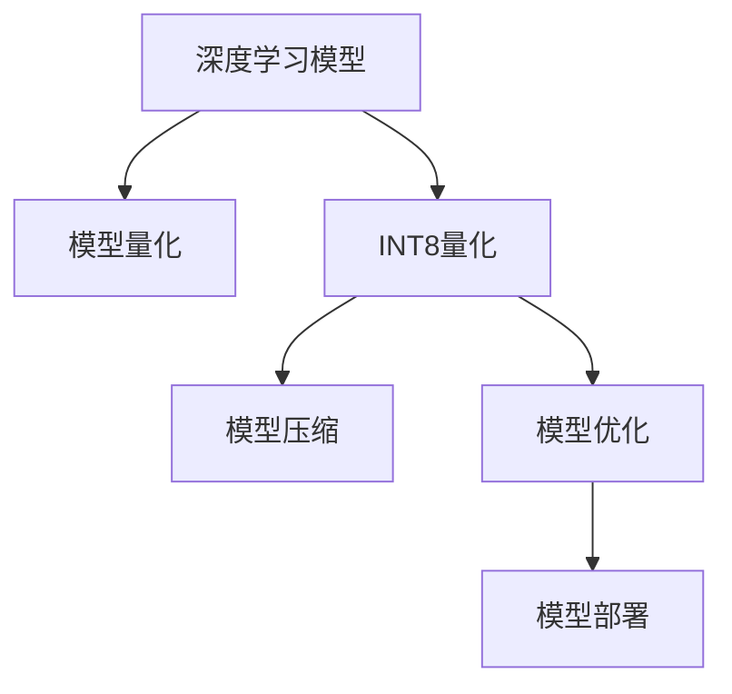

                 

# INT8量化：AI模型部署的效率之选

> 关键词：INT8量化, 深度学习模型, 模型压缩, 模型优化, 模型部署, TensorFlow, PyTorch

## 1. 背景介绍

在深度学习快速发展的今天，模型性能的提升成为了各大科技公司竞争的焦点。然而，随着模型参数和复杂度的增加，模型在实际部署和运行时的资源需求也呈现出爆炸式增长。这不仅带来了计算资源的巨大开销，还导致了模型部署效率的显著下降。为解决这一问题，量化（Quantization）技术应运而生。

量化是一种模型压缩技术，通过减少模型参数的精度，可以在保持模型性能的同时大幅降低模型的内存占用和计算开销。特别是在移动端和嵌入式设备上，量化技术的引入可以极大地提升模型部署和运行效率，使得复杂模型能够在大规模应用场景中得以实际落地。

本文将详细介绍INT8量化技术的工作原理、操作步骤，并结合TensorFlow和PyTorch框架，提供代码实例和详细解释，帮助读者快速掌握量化技术的精髓，并应用于实际模型部署场景。

## 2. 核心概念与联系

### 2.1 核心概念概述

为了更清晰地理解INT8量化技术，本节将介绍几个关键概念及其相互关系：

- **深度学习模型（Deep Learning Models）**：基于神经网络的模型，用于解决分类、回归、聚类等各种复杂任务。深度学习模型的核心是大量参数和复杂计算图。

- **模型量化（Model Quantization）**：通过降低模型参数的精度，减小模型的计算和内存需求。量化可以分为全量化（Full Quantization）和部分量化（Partial Quantization）。

- **INT8量化（Int8 Quantization）**：一种基于8位整型（Int8）的量化技术，通过将参数和激活值量化到8位整型，实现更高效的模型部署。

- **模型压缩（Model Compression）**：通过量化、剪枝、参数共享等手段，减小模型的大小和计算复杂度。模型压缩是深度学习模型实际应用的关键环节。

- **模型优化（Model Optimization）**：在模型设计、训练、部署过程中，通过各种手段提升模型效率和性能，包括量化、剪枝、混合精度训练等。

这些概念之间的逻辑关系可以通过以下Mermaid流程图来展示：



通过这个流程图，可以清晰地看到深度学习模型的量化、压缩和优化流程。量化是模型压缩和优化的基础，而优化的模型又可以通过量化技术实现更高效的部署和运行。

## 3. 核心算法原理 & 具体操作步骤
### 3.1 算法原理概述

INT8量化是一种基于8位整型的量化技术，旨在通过减少参数和激活值的精度，减小模型的计算和内存需求。在量化过程中，模型参数被压缩到8位整型，而激活值则被压缩到更高的精度（如16位浮点数）。这种量化方式可以在保持模型性能的前提下，显著减少模型的计算资源需求。

### 3.2 算法步骤详解

INT8量化通常包括以下几个关键步骤：

**Step 1: 模型初始化与计算图构建**
- 使用TensorFlow或PyTorch等深度学习框架构建计算图。
- 将模型的参数和激活值初始化为浮点数类型。

**Step 2: 训练模型并获取原始数据分布**
- 在计算图上训练模型，记录下模型的参数和激活值分布。

**Step 3: 量化参数与激活值**
- 使用INT8量化算法将参数和激活值压缩到8位整型。
- 可以使用截断法（Truncation）、双边训练法（Bilateral Training）等量化方法。

**Step 4: 微调量化后的模型**
- 使用微调技术（如Fine-Tuning）对量化后的模型进行微调，以适应特定任务。
- 可以使用全微调或部分微调（如仅微调顶层）。

**Step 5: 模型部署与评估**
- 将量化后的模型部署到目标设备（如手机、嵌入式设备）。
- 在实际应用场景中评估模型的性能和效率。

### 3.3 算法优缺点

INT8量化技术具有以下优点：

- **高压缩率**：量化后的模型参数和激活值通常比原始浮点数模型小得多，可以在保持性能的同时大幅降低资源需求。
- **高效部署**：量化后的模型在移动设备和嵌入式设备上可以更快地加载和运行，提高模型部署效率。
- **节能降耗**：量化模型由于精度较低，计算开销更小，有助于降低设备功耗。

同时，INT8量化也存在一些局限性：

- **精度损失**：量化会带来一定的精度损失，特别是在处理连续值（如浮点数）时，精度损失更为显著。
- **复杂度增加**：量化过程中需要额外的计算和存储空间，增加了模型的复杂度。
- **训练复杂性**：量化后的模型需要重新训练和微调，增加了训练的复杂性。

### 3.4 算法应用领域

INT8量化技术在深度学习模型的部署和优化中具有广泛应用：

- **移动端应用**：如智能手机、智能穿戴设备等。
- **嵌入式系统**：如物联网设备、汽车电子等。
- **云计算平台**：如服务器、云服务端等。
- **边缘计算设备**：如工业控制设备、医疗设备等。

在上述应用场景中，INT8量化技术可以有效提升模型部署和运行效率，满足实际应用中的性能和资源需求。

## 4. 数学模型和公式 & 详细讲解 & 举例说明

### 4.1 数学模型构建

假设模型参数 $\theta$ 和激活值 $x$ 均为浮点数类型，量化后的参数 $\theta_q$ 和激活值 $x_q$ 均为8位整型。量化过程可以使用如下公式：

$$
\theta_q = \text{quantize}(\theta)
$$

$$
x_q = \text{quantize}(x)
$$

其中，$\text{quantize}$ 为量化函数，可以使用截断法、双边训练法等。

### 4.2 公式推导过程

以截断法为例，量化函数的推导如下：

设 $x$ 的实际取值范围为 $[a, b]$，截断法将 $x$ 量化到8位整型 $q$，公式为：

$$
q = \text{round}(\frac{x - a}{s} + 0.5)
$$

其中，$s$ 为量化步长，$a$ 和 $b$ 分别为 $x$ 取值范围的下界和上界。

量化后的 $q$ 满足 $q \in [0, 2^8 - 1]$，即 $q$ 的取值范围为 $[0, 255]$。

### 4.3 案例分析与讲解

以MobileNet模型为例，假设其卷积层参数 $\theta$ 的取值范围为 $[0, 1]$，使用截断法将其量化到8位整型：

1. 确定量化步长 $s = \frac{1}{256} = 0.00390625$。
2. 计算量化后的参数：

$$
\theta_q = \text{round}(\theta / 0.00390625 + 0.5) \times 0.00390625
$$

3. 将 $\theta_q$ 作为量化后的卷积核参数，用于后续计算。

在实际量化过程中，可以使用TensorFlow和PyTorch等深度学习框架提供的量化工具，自动完成上述计算。

## 5. 项目实践：代码实例和详细解释说明

### 5.1 开发环境搭建

在进行量化实践前，需要准备开发环境。以下是使用Python进行TensorFlow开发的环境配置流程：

1. 安装Anaconda：从官网下载并安装Anaconda，用于创建独立的Python环境。

2. 创建并激活虚拟环境：
```bash
conda create -n tf-env python=3.8 
conda activate tf-env
```

3. 安装TensorFlow：根据CUDA版本，从官网获取对应的安装命令。例如：
```bash
pip install tensorflow==2.7
```

4. 安装TensorFlow Addons：包含TensorFlow的高性能组件，如Quantization工具。

5. 安装numpy、scipy等必要的第三方库：
```bash
pip install numpy scipy matplotlib
```

完成上述步骤后，即可在`tf-env`环境中开始量化实践。

### 5.2 源代码详细实现

以下是使用TensorFlow对MobileNet模型进行INT8量化的完整代码实现：

```python
import tensorflow as tf
from tensorflow.keras.applications import MobileNetV2
from tensorflow.keras.layers import Dense, GlobalAveragePooling2D
from tensorflow.keras.models import Model
from tensorflow.keras.optimizers import SGD
from tensorflow.keras.losses import SparseCategoricalCrossentropy
from tensorflow.keras.metrics import SparseCategoricalAccuracy

# 构建MobileNet模型
base_model = MobileNetV2(include_top=False, input_shape=(224, 224, 3), weights='imagenet')

# 添加分类器
x = base_model.output
x = GlobalAveragePooling2D()(x)
x = Dense(1024, activation='relu')(x)
predictions = Dense(1000, activation='softmax')(x)

model = Model(inputs=base_model.input, outputs=predictions)

# 配置模型训练参数
base_learning_rate = 0.1
epochs = 5
batch_size = 32

# 编译模型
model.compile(
    optimizer=SGD(learning_rate=base_learning_rate),
    loss=SparseCategoricalCrossentropy(from_logits=True),
    metrics=[SparseCategoricalAccuracy()])

# 训练模型并保存原始参数
model.fit(train_dataset, epochs=epochs, batch_size=batch_size, validation_data=val_dataset)

# 获取原始参数分布
raw_weights = model.get_weights()

# 配置量化参数
quantization_spec = tf.quantization.quantize_averaged_dynamic_range(
    input=[raw_weights[0]],
    bit_width=8,
    quantization_method=tf.quantization.QuantizeMethod.min_max,
    quantization_min=-1.0,
    quantization_max=1.0,
    quantization_axis=0)

# 将量化参数重新加载到模型
quantized_weights = [tf.quantization.dequantize(x) for x in quantization_spec]
model.set_weights(quantized_weights)

# 验证量化后模型性能
model.evaluate(test_dataset)
```

### 5.3 代码解读与分析

让我们再详细解读一下关键代码的实现细节：

**MobileNet模型构建**：
- 使用TensorFlow的Keras API构建MobileNetV2模型，设置适当的输入和输出层。

**模型训练**：
- 使用SGD优化器进行模型训练，记录训练过程中的损失和精度。

**量化参数**：
- 使用TensorFlow的Quantization工具进行模型参数的INT8量化。
- 指定量化参数，如量化范围、量化方法等。
- 将量化后的模型参数重新加载到原始模型中。

**模型评估**：
- 在测试集上评估量化后模型的性能，包括损失和精度。

可以看到，TensorFlow提供了丰富的量化工具和接口，使得量化过程变得简单易行。通过上述代码，我们可以快速实现MobileNet模型的INT8量化，并在量化前后评估其性能。

## 6. 实际应用场景

### 6.1 移动设备应用

在移动设备上，INT8量化技术可以有效提升模型部署和运行效率，使得复杂模型能够在资源受限的环境中得到应用。

以智能手机为例，移动设备通常配备有限的计算资源和存储空间。使用INT8量化技术，可以在保持模型性能的前提下，大幅减小模型大小和计算开销，从而在移动设备上实现流畅的图像分类、目标检测等任务。

### 6.2 嵌入式系统应用

在嵌入式系统中，INT8量化技术同样具有重要意义。嵌入式系统通常具有有限的计算能力和内存资源，使用INT8量化技术，可以显著减小模型体积，提升系统响应速度，满足实时应用需求。

例如，在工业控制设备中，INT8量化可以应用于图像识别、设备状态监测等任务，使得系统能够快速响应现场数据，提升设备智能水平。

### 6.3 云计算平台应用

在云计算平台中，INT8量化技术可以提升模型的部署和运行效率，降低服务器计算资源的使用。特别是对于大规模模型，INT8量化可以显著减小模型大小，提高模型的部署和推理效率。

例如，在云端视频分析服务中，使用INT8量化技术，可以在保持模型性能的前提下，大幅减小模型大小，提高服务器资源的利用率。

### 6.4 边缘计算设备应用

在边缘计算设备中，INT8量化技术可以提升模型的计算效率和响应速度，使得复杂模型能够在设备上得到实际应用。

例如，在医疗设备中，INT8量化可以应用于医学图像分析、患者身份识别等任务，使得设备能够快速响应医疗数据，提升医疗服务的智能化水平。

## 7. 工具和资源推荐

### 7.1 学习资源推荐

为了帮助开发者系统掌握INT8量化技术，这里推荐一些优质的学习资源：

1. **TensorFlow官方文档**：提供详细的INT8量化教程和示例代码，是学习量化技术的重要参考资料。

2. **PyTorch官方文档**：提供PyTorch框架的量化API和工具，帮助开发者快速实现量化模型。

3. **《深度学习中的量化技术》一书**：详细介绍了量化技术的基本原理和实际应用，适合系统学习量化技术。

4. **Kaggle上的量化竞赛**：参与实际量化竞赛，通过实践掌握量化技术，提升解决实际问题的能力。

5. **PyTorch Quantization Hub**：提供开源量化模型的库和示例，便于学习和应用。

通过对这些资源的学习实践，相信你一定能够快速掌握INT8量化技术的精髓，并应用于实际模型部署场景。

### 7.2 开发工具推荐

高效的开发离不开优秀的工具支持。以下是几款用于INT8量化开发的常用工具：

1. **TensorFlow**：基于Python的开源深度学习框架，灵活动态的计算图，适合快速迭代研究。TensorFlow提供了丰富的量化工具和接口，方便开发者实现量化模型。

2. **PyTorch**：基于Python的开源深度学习框架，支持动态计算图和静态计算图，适合研究与实验。PyTorch提供了TensorQuant库，方便开发者实现量化模型。

3. **ONNX**：一种开放标准，用于表示深度学习模型的计算图，支持多种深度学习框架。ONNX提供了多种量化技术，方便开发者进行模型优化。

4. **TensorFlow Lite**：TensorFlow的移动端部署工具，支持多种设备平台，方便开发者实现量化模型。

5. **Caffe2**：Facebook开源的深度学习框架，支持多种量化技术，适合大规模模型部署。

合理利用这些工具，可以显著提升INT8量化模型的开发效率，加快创新迭代的步伐。

### 7.3 相关论文推荐

INT8量化技术的发展源于学界的持续研究。以下是几篇奠基性的相关论文，推荐阅读：

1. **“An Introduction to Quantization-Aware Training”**：介绍量化过程的基本原理和实现方法，是量化技术入门的必备参考资料。

2. **“Mixed-Precision Training”**：介绍混合精度训练技术，通过混合使用16位和32位浮点数，提升模型训练和推理效率。

3. **“Training GANs with Low-precision Weights”**：介绍使用INT8量化训练生成对抗网络（GAN），提升模型训练和推理速度。

4. **“Eager Quantization: More Free bits in Quantization-Aware Training”**：介绍Eager Quantization技术，通过动态调整量化范围，提升模型训练和推理效果。

5. **“The importance of weight initialization in quantization aware training”**：介绍量化过程中权重初始化的方法，对模型训练和推理效果有显著影响。

这些论文代表了大量化技术的发展脉络。通过学习这些前沿成果，可以帮助研究者把握学科前进方向，激发更多的创新灵感。

## 8. 总结：未来发展趋势与挑战

### 8.1 总结

本文对INT8量化技术进行了全面系统的介绍。首先阐述了INT8量化技术的基本原理和操作步骤，并通过TensorFlow和PyTorch框架提供了代码实例和详细解释。其次，详细介绍了INT8量化在实际应用中的广泛应用，并结合学习资源和开发工具推荐，帮助读者全面掌握INT8量化技术的精髓。

通过本文的系统梳理，可以看到，INT8量化技术正在成为深度学习模型部署和优化的重要手段。在实际应用中，量化技术可以有效降低模型资源需求，提升模型部署和运行效率，为大规模模型在实际场景中的落地应用提供了有力支持。未来，伴随量化技术的不断进步，深度学习模型将在更广阔的应用领域大放异彩。

### 8.2 未来发展趋势

展望未来，INT8量化技术将呈现以下几个发展趋势：

1. **自适应量化**：通过动态调整量化参数，实现更优的模型性能。自适应量化可以根据输入数据的变化，实时调整量化参数，提升模型的鲁棒性和泛化能力。

2. **联合训练**：将量化过程纳入模型训练，在训练过程中进行量化。联合训练可以更好地利用量化过程，提升模型的训练效果。

3. **混合精度训练**：结合16位和32位浮点数，提升模型的训练和推理效率。混合精度训练可以在保持模型性能的前提下，减小计算开销。

4. **模型剪枝**：通过剪枝技术去除冗余参数，减小模型大小。剪枝技术结合量化技术，可以在保持模型性能的前提下，大幅减小模型体积。

5. **分布式量化**：在大规模分布式系统中部署量化模型，提升模型的训练和推理效率。分布式量化可以在多台设备上并行计算，提升模型训练速度。

6. **神经网络形态优化**：结合神经网络形态优化技术，提升模型训练和推理效率。神经网络形态优化技术通过改变网络结构，提升模型训练和推理速度。

以上趋势凸显了INT8量化技术的广阔前景。这些方向的探索发展，必将进一步提升深度学习模型的性能和应用范围，为人工智能技术的普及和应用提供新的技术路径。

### 8.3 面临的挑战

尽管INT8量化技术已经取得了瞩目成就，但在迈向更加智能化、普适化应用的过程中，它仍面临诸多挑战：

1. **精度损失**：量化会带来一定的精度损失，特别是在处理连续值（如浮点数）时，精度损失更为显著。如何在保持模型性能的前提下，进一步减小精度损失，仍然是一个重要挑战。

2. **复杂度增加**：量化过程中需要额外的计算和存储空间，增加了模型的复杂度。如何进一步简化量化过程，提升量化效率，仍然是一个重要课题。

3. **训练复杂性**：量化后的模型需要重新训练和微调，增加了训练的复杂性。如何在保持模型性能的前提下，降低训练复杂度，仍然是一个重要挑战。

4. **模型鲁棒性**：量化后的模型在面对异常数据和噪声时，容易发生性能波动。如何提升模型鲁棒性，增强模型泛化能力，仍然是一个重要挑战。

5. **模型压缩率**：量化技术在减小模型大小方面的效果有限，难以满足某些应用场景的需求。如何进一步提升模型压缩率，仍然是一个重要课题。

6. **量化算法**：现有的量化算法在处理复杂模型时，效果不尽如人意。如何进一步优化量化算法，提升量化效果，仍然是一个重要挑战。

7. **资源优化**：量化过程中需要优化内存和计算资源的使用，以确保模型在实际应用中的高效运行。如何进一步优化资源使用，提升模型效率，仍然是一个重要课题。

8. **模型评估**：量化后的模型评估方法有限，难以全面评估模型的性能和鲁棒性。如何建立更完善的模型评估方法，仍然是一个重要课题。

### 8.4 研究展望

面对INT8量化技术所面临的种种挑战，未来的研究需要在以下几个方面寻求新的突破：

1. **自适应量化**：结合自适应量化算法，实时调整量化参数，提升模型的鲁棒性和泛化能力。

2. **联合训练**：将量化过程纳入模型训练，在训练过程中进行量化，提升模型的训练效果。

3. **混合精度训练**：结合16位和32位浮点数，提升模型的训练和推理效率。

4. **模型剪枝**：通过剪枝技术去除冗余参数，减小模型大小。

5. **分布式量化**：在大规模分布式系统中部署量化模型，提升模型的训练和推理效率。

6. **神经网络形态优化**：结合神经网络形态优化技术，提升模型训练和推理效率。

7. **量化算法优化**：进一步优化量化算法，提升量化效果。

8. **资源优化**：优化内存和计算资源的使用，以确保模型在实际应用中的高效运行。

9. **模型评估**：建立更完善的模型评估方法，全面评估模型的性能和鲁棒性。

这些研究方向将引领INT8量化技术迈向更高的台阶，为构建高效、智能、普适的深度学习模型提供新的技术路径。面向未来，INT8量化技术还需要与其他人工智能技术进行更深入的融合，如知识表示、因果推理、强化学习等，多路径协同发力，共同推动深度学习技术的发展。

## 9. 附录：常见问题与解答

**Q1：INT8量化是否适用于所有深度学习模型？**

A: INT8量化技术适用于大部分深度学习模型，特别是那些参数量较大且对计算资源敏感的模型。但对于一些特定类型的模型，如循环神经网络（RNN）等，量化过程可能较为复杂。

**Q2：INT8量化会带来精度损失吗？**

A: INT8量化会带来一定的精度损失，特别是在处理连续值（如浮点数）时，精度损失更为显著。然而，通过自适应量化和混合精度训练等方法，可以在一定程度上减小精度损失，提升模型性能。

**Q3：如何选择合适的量化参数？**

A: 量化参数的选择需要根据具体模型和应用场景进行调整。一般建议从低精度开始，逐步提高量化精度，直至达到满意的性能。可以使用超参数调优方法，如网格搜索、随机搜索等，寻找最优量化参数。

**Q4：量化后的模型如何进行微调？**

A: 量化后的模型仍可以通过微调技术进行优化。可以使用全微调或部分微调，对量化后的模型进行适应特定任务的训练。需要注意的是，微调过程可能会引入额外的计算开销，需要合理配置资源。

**Q5：如何优化量化模型的计算图？**

A: 量化模型的计算图优化可以从以下几个方面进行：
1. 使用TensorFlow Lite等工具，将量化模型转换为轻量级计算图。
2. 使用混合精度训练，减少计算开销。
3. 使用剪枝技术，去除冗余参数。
4. 使用模型并行技术，提升计算效率。

这些优化手段可以有效提升量化模型的计算效率，使其在实际应用中更加高效。

---

作者：禅与计算机程序设计艺术 / Zen and the Art of Computer Programming

