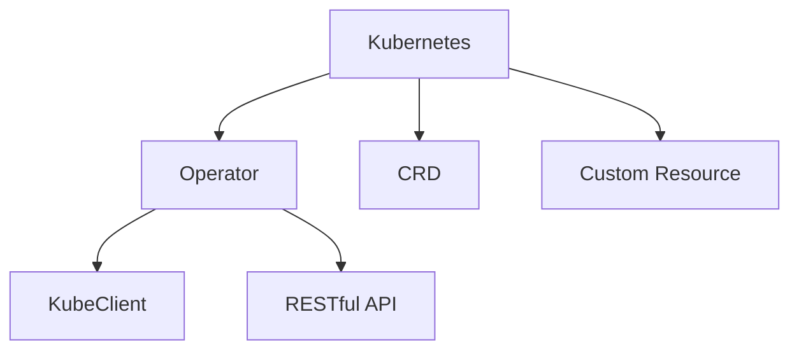

                 

# Kubernetes Operator开发

## 1. 背景介绍

在云计算迅速发展的今天，容器化部署已经成为一种主流的应用部署方式。Kubernetes作为容器编排的领先平台，其强大的资源调度和管理能力使得大规模应用的稳定部署成为可能。但是Kubernetes的复杂性也随之增加，如何高效地管理集群成为了一个重要的问题。Operator的出现，使得Kubernetes可以与传统的操作系统级别的资源管理协议进行交互，从而使得Kubernetes集群的资源管理更加灵活、高效。本文将深入探讨Kubernetes Operator开发的相关问题，帮助开发者更好地理解和实现基于Kubernetes的资源管理应用。

## 2. 核心概念与联系

### 2.1 核心概念概述

在开始深入探讨Kubernetes Operator之前，需要了解一些相关的基础概念：

- Kubernetes：是一个开源的平台，用于自动部署、扩展和操作容器化应用程序，支持多种操作系统和云平台。
- Operator：一种Kubernetes资源，用于实现对操作系统级别资源的管理。
- CRD（Custom Resource Definition）：一种自定义资源，用于描述集群中的资源。
- Custom Resource：一种自定义资源实例，用于管理集群中的资源。
- KubeClient：一个与Kubernetes集群交互的客户端库。
- RESTful API：一种用于网络应用接口的架构风格。

这些概念构成了Kubernetes Operator的核心技术栈，理解这些概念对于Kubernetes Operator的开发至关重要。

### 2.2 核心概念原理和架构的 Mermaid 流程图



## 3. 核心算法原理 & 具体操作步骤

### 3.1 算法原理概述

Kubernetes Operator的核心思想是将操作系统的管理功能封装成Kubernetes的资源，通过定义CRD和Custom Resource，从而使得Kubernetes集群可以管理这些资源。Operator通过暴露RESTful API接口，使得Kubernetes集群和外部系统可以交互。Operator的实现依赖于KubeClient库，该库提供了与Kubernetes集群交互的接口，支持Kubernetes API的CRUD操作。

### 3.2 算法步骤详解

1. **定义CRD和Custom Resource**：
   - 定义CRD（Custom Resource Definition），用于描述集群中的资源。
   - 定义Custom Resource（CR），用于管理集群中的资源实例。
   - 定义CRD和Custom Resource的API版本。

2. **实现Kubernetes资源管理功能**：
   - 实现CRD的API版本定义，包括GET、POST、PUT、DELETE等操作。
   - 实现Custom Resource的CRUD操作，包括Create、Update、Delete、List等操作。
   - 实现CRD和Custom Resource之间的逻辑关系，如父子关系、状态管理等。

3. **实现与Kubernetes集群交互**：
   - 使用KubeClient库与Kubernetes集群交互，实现CRD和Custom Resource的CRUD操作。
   - 实现Operator的状态管理，包括Start、Stop、Delete等操作。

4. **暴露RESTful API接口**：
   - 实现RESTful API接口，使得Kubernetes集群和外部系统可以交互。
   - 实现CRD和Custom Resource的API操作，包括GET、POST、PUT、DELETE等。
   - 实现API的权限控制，确保API操作的安全性。

### 3.3 算法优缺点

**优点**：
- Kubernetes Operator能够实现对操作系统级别资源的灵活管理，使得集群资源的编排更加高效。
- Operator的实现依赖于Kubernetes的API接口，可以方便地与其他Kubernetes资源进行交互。
- Operator提供了RESTful API接口，使得集群和外部系统可以方便地进行交互。

**缺点**：
- Operator的开发需要较高的技术门槛，需要熟悉Kubernetes和RESTful API等相关技术。
- Operator的实现需要考虑API的权限控制，确保API操作的安全性。
- Operator的性能可能受到Kubernetes集群的影响，特别是在大规模集群中。

### 3.4 算法应用领域

Kubernetes Operator主要应用于以下领域：

- 数据库管理：用于管理MySQL、PostgreSQL等数据库，实现数据库的高可用性和自动备份等功能。
- 消息队列管理：用于管理Kafka、RabbitMQ等消息队列，实现消息的自动分发和消费等功能。
- 应用部署和更新：用于管理Docker、Kubernetes等容器化应用，实现应用的自动部署和更新等功能。
- 网络管理：用于管理VPC、LoadBalancer等网络资源，实现网络的高可用性和自动配置等功能。

## 4. 数学模型和公式 & 详细讲解 & 举例说明

### 4.1 数学模型构建

在Kubernetes Operator的开发过程中，主要涉及到以下几个数学模型：

1. **CRD的API版本定义**：
   - 定义CRD的API版本，包括CRD的资源类型、字段类型、字段名称等。

2. **Custom Resource的CRUD操作**：
   - 实现Custom Resource的Create、Update、Delete、List等操作。
   - 实现Custom Resource的状态管理，包括Start、Stop、Delete等操作。

3. **API的权限控制**：
   - 定义API的权限控制策略，确保API操作的安全性。
   - 实现API的认证和授权，防止未授权的访问。

### 4.2 公式推导过程

1. **CRD的API版本定义**：
   ```yaml
   apiVersion: v1
   customResource:
     type: "MyCustomResource"
     version: "v1"
     names:
       kind: "MyCustomResource"
       plural: "mycustomresources"
     metadata:
       labels:
         key1: "value1"
         key2: "value2"
   ```

2. **Custom Resource的CRUD操作**：
   ```go
   // 创建Custom Resource
   response, err := client.Create(context.TODO(), myCustomResource, metav1.CreateOptions{})
   if err != nil {
     // 处理错误
   }
   
   // 更新Custom Resource
   response, err := client.Update(context.TODO(), myCustomResource, metav1.UpdateOptions{})
   if err != nil {
     // 处理错误
   }
   
   // 删除Custom Resource
   err := client.Delete(context.TODO(), myCustomResource, metav1.DeleteOptions{})
   if err != nil {
     // 处理错误
   }
   
   // 获取Custom Resource列表
   listOptions := metav1.ListOptions{}
   response, err := client.List(context.TODO(), myCustomResource, listOptions)
   if err != nil {
     // 处理错误
   }
   ```

3. **API的权限控制**：
   ```yaml
   apiVersion: v1
   kind: "MyCustomResource"
   metadata:
     name: "mycustomresource"
     roleBindings:
       - apiGroups: "rbac.authorization.k8s.io"
         role: "myrole"
         subject:
           type: ServiceAccount
           name: "default"
   ```

### 4.3 案例分析与讲解

以MySQL Operator为例，介绍Kubernetes Operator的开发过程：

1. **定义CRD和Custom Resource**：
   - 定义MySQL的CRD，描述MySQL数据库的资源类型、字段类型、字段名称等。
   - 定义MySQL的Custom Resource，描述MySQL数据库的资源实例。

2. **实现MySQL的CRUD操作**：
   - 实现MySQL的Create、Update、Delete、List等操作。
   - 实现MySQL的状态管理，包括Start、Stop、Delete等操作。

3. **实现与Kubernetes集群交互**：
   - 使用KubeClient库与Kubernetes集群交互，实现MySQL的CRUD操作。
   - 实现MySQL的状态管理，包括Start、Stop、Delete等操作。

4. **暴露RESTful API接口**：
   - 实现MySQL的API操作，包括GET、POST、PUT、DELETE等。
   - 实现API的权限控制，确保API操作的安全性。

## 5. 项目实践：代码实例和详细解释说明

### 5.1 开发环境搭建

在Kubernetes Operator的开发过程中，需要使用到以下几个工具：

1. Kubernetes集群：可以使用Minikube或Amazon EKS等工具搭建Kubernetes集群。
2. Go语言：Operator的开发依赖于Go语言。
3. KubeClient库：使用Kubernetes提供的KubeClient库与集群交互。
4. RESTful API工具：使用Swagger等工具定义RESTful API接口。

### 5.2 源代码详细实现

以下是一个简单的MySQL Operator的实现：

```go
// 定义CRD和Custom Resource
type MyCustomResource struct {
   // CRD的字段定义
}

type MyCustomResourceList struct {
   // CRD的列表定义
}

// 实现CRD的API版本定义
func init() {
   apiVersion := v1.SchemeGroupVersion
   apiVersion.AddResource("mycustomresources")
}

// 实现Custom Resource的CRUD操作
func (client *MyCustomResourceClient) Create(ctx context.Context, myCustomResource *MyCustomResource, options metav1.CreateOptions) (*MyCustomResource, error) {
   // 创建Custom Resource
}

func (client *MyCustomResourceClient) Update(ctx context.Context, myCustomResource *MyCustomResource, options metav1.UpdateOptions) (*MyCustomResource, error) {
   // 更新Custom Resource
}

func (client *MyCustomResourceClient) Delete(ctx context.Context, myCustomResource *MyCustomResource, options metav1.DeleteOptions) error {
   // 删除Custom Resource
}

func (client *MyCustomResourceClient) List(ctx context.Context, options metav1.ListOptions) (*MyCustomResourceList, error) {
   // 获取Custom Resource列表
}

// 实现与Kubernetes集群交互
func (client *MyCustomResourceClient) Get(ctx context.Context, namespace string, name string, options metav1.GetOptions) (*MyCustomResource, error) {
   // 获取Custom Resource
}

func (client *MyCustomResourceClient) DeleteAllOf(ctx context.Context, namespace string, options metav1.DeleteOptions) error {
   // 删除所有Custom Resource
}

// 实现Custom Resource的状态管理
func (myCustomResource *MyCustomResource) Start() error {
   // 启动Custom Resource
}

func (myCustomResource *MyCustomResource) Stop() error {
   // 停止Custom Resource
}

func (myCustomResource *MyCustomResource) Delete() error {
   // 删除Custom Resource
}

// 暴露RESTful API接口
func HandleCRD(w http.ResponseWriter, r *http.Request) {
   // 处理CRD请求
}

func HandleCustomResource(w http.ResponseWriter, r *http.Request) {
   // 处理Custom Resource请求
}

func HandleCustomResourceList(w http.ResponseWriter, r *http.Request) {
   // 处理Custom Resource列表请求
}
```

### 5.3 代码解读与分析

在上述代码中，我们实现了MySQL Operator的CRD定义、Custom Resource的CRUD操作、与Kubernetes集群的交互、Custom Resource的状态管理和RESTful API接口的暴露。这些功能构成了MySQL Operator的核心功能，通过这些功能，我们可以在Kubernetes集群中管理和操作MySQL数据库。

### 5.4 运行结果展示

通过上述代码，我们可以在Kubernetes集群中成功部署MySQL Operator，并对MySQL数据库进行管理和操作。例如，可以通过RESTful API接口创建、更新、删除MySQL数据库实例，查询MySQL数据库实例列表等操作。

## 6. 实际应用场景

### 6.1 数据库管理

Kubernetes Operator可以用于管理MySQL、PostgreSQL等数据库，实现数据库的高可用性和自动备份等功能。

1. **高可用性管理**：通过MySQL Operator，可以在Kubernetes集群中实现MySQL数据库的高可用性管理，包括Master和Slave的自动创建和切换、自动备份和恢复等。
2. **自动备份**：通过MySQL Operator，可以实现MySQL数据库的自动备份，定期备份数据库快照，并存储在S3等云存储中。
3. **监控告警**：通过MySQL Operator，可以实现MySQL数据库的监控告警，实时监控数据库性能指标，并及时发出告警通知。

### 6.2 消息队列管理

Kubernetes Operator可以用于管理Kafka、RabbitMQ等消息队列，实现消息的自动分发和消费等功能。

1. **消息队列创建**：通过Kafka Operator，可以在Kubernetes集群中自动创建Kafka集群，包括Master和Broker的自动创建和配置。
2. **消息消费**：通过Kafka Operator，可以实现Kafka消息的自动消费，将消息自动发送到指定的消费者中。
3. **监控告警**：通过Kafka Operator，可以实现Kafka集群的监控告警，实时监控集群性能指标，并及时发出告警通知。

### 6.3 应用部署和更新

Kubernetes Operator可以用于管理Docker、Kubernetes等容器化应用，实现应用的自动部署和更新等功能。

1. **应用自动部署**：通过Kubernetes Operator，可以实现Docker、Kubernetes等容器化应用的自动部署，包括应用的拉取、启动和停止等。
2. **应用自动更新**：通过Kubernetes Operator，可以实现Docker、Kubernetes等容器化应用的自动更新，包括应用的回滚和恢复等。
3. **监控告警**：通过Kubernetes Operator，可以实现应用的监控告警，实时监控应用的性能指标，并及时发出告警通知。

## 7. 工具和资源推荐

### 7.1 学习资源推荐

为了帮助开发者更好地理解Kubernetes Operator的开发，以下是一些优质的学习资源：

1. Kubernetes官方文档：提供了Kubernetes Operator的详细文档和示例。
2. Operator SDK：提供了Operator SDK的官方文档和示例，帮助开发者快速上手Operator的开发。
3. Kubernetes Operator实战：介绍Kubernetes Operator的实战案例和最佳实践，帮助开发者在实际项目中应用Operator。
4. Kubernetes Operator教程：提供了Kubernetes Operator的教程和实战案例，帮助开发者掌握Operator的开发技巧。
5. Kubernetes Operator视频教程：提供了Kubernetes Operator的视频教程，帮助开发者深入理解Operator的开发过程。

### 7.2 开发工具推荐

在Kubernetes Operator的开发过程中，需要使用到以下几个工具：

1. Go语言：Operator的开发依赖于Go语言。
2. KubeClient库：使用Kubernetes提供的KubeClient库与集群交互。
3. RESTful API工具：使用Swagger等工具定义RESTful API接口。
4. Kubernetes集群管理工具：使用Minikube、Amazon EKS等工具搭建和管理系统。
5. 容器化部署工具：使用Docker等工具构建和部署应用。

### 7.3 相关论文推荐

Kubernetes Operator的研究不断涌现，以下是几篇重要的相关论文：

1. Kubernetes Operator: Automating Operators: Operators are a kind of Kubernetes resource that provide metadata and logic to operate the outside world.
2. Kubernetes Operator Design: Designing Operators for Kubernetes: This paper presents a design methodology for building operators that integrate Kubernetes resource management with the outside world.
3. Kubernetes Operator Best Practices: Best Practices for Operators on Kubernetes: This paper provides best practices for building, deploying, and managing Kubernetes operators.
4. Kubernetes Operator Security: Security Considerations for Kubernetes Operators: This paper discusses the security considerations for building and deploying Kubernetes operators.
5. Kubernetes Operator Patterns: Design Patterns for Operators on Kubernetes: This paper presents design patterns for building and deploying Kubernetes operators.

## 8. 总结：未来发展趋势与挑战

### 8.1 研究成果总结

Kubernetes Operator的开发已经取得了一定的成果，主要集中在以下方面：

1. 实现了对操作系统级别资源的灵活管理，使得集群资源的编排更加高效。
2. 提供了RESTful API接口，使得集群和外部系统可以方便地进行交互。
3. 实现了API的权限控制，确保API操作的安全性。

### 8.2 未来发展趋势

Kubernetes Operator的未来发展趋势主要集中在以下几个方面：

1. 更高效的管理能力：随着Kubernetes集群的规模不断扩大，Operator需要具备更高效的管理能力，以支持大规模集群的管理。
2. 更灵活的扩展性：Operator需要具备更灵活的扩展性，支持更多的自定义资源和自定义操作。
3. 更好的兼容性：Operator需要具备更好的兼容性，支持更多的云平台和操作系统。
4. 更完善的安全性：Operator需要具备更完善的安全性，支持更多的安全机制和防护措施。

### 8.3 面临的挑战

Kubernetes Operator的开发过程中也面临一些挑战：

1. 技术门槛高：Operator的开发需要较高的技术门槛，需要熟悉Kubernetes和RESTful API等相关技术。
2. 安全性问题：Operator需要考虑API的权限控制，确保API操作的安全性。
3. 性能问题：Operator的性能可能受到Kubernetes集群的影响，特别是在大规模集群中。

### 8.4 研究展望

未来的研究主要集中在以下几个方面：

1. 提高Operator的管理效率：通过优化Operator的算法和设计，提高Operator的管理效率。
2. 增强Operator的扩展性：通过增加Operator的功能和扩展性，满足更多的管理需求。
3. 提升Operator的安全性：通过增加Operator的安全机制和防护措施，确保API操作的安全性。
4. 支持更多的云平台和操作系统：通过增加Operator的兼容性和灵活性，支持更多的云平台和操作系统。

## 9. 附录：常见问题与解答

**Q1：什么是Kubernetes Operator？**

A: Kubernetes Operator是一种Kubernetes资源，用于实现对操作系统级别资源的管理。它通过定义Custom Resource和CRD，将操作系统的管理功能封装成Kubernetes的资源，使得Kubernetes集群可以管理这些资源。

**Q2：Kubernetes Operator如何实现与Kubernetes集群的交互？**

A: Kubernetes Operator通过使用KubeClient库与Kubernetes集群交互。KubeClient库提供了与Kubernetes API的CRUD操作接口，可以方便地进行资源的管理。

**Q3：Kubernetes Operator的实现依赖于哪些技术？**

A: Kubernetes Operator的实现依赖于Kubernetes API、Go语言、RESTful API等技术。开发者需要熟悉这些技术，才能成功地实现Operator的功能。

**Q4：Kubernetes Operator的开发流程是什么？**

A: Kubernetes Operator的开发流程包括定义CRD和Custom Resource、实现CRD的API版本定义、实现Custom Resource的CRUD操作、实现与Kubernetes集群交互、实现Custom Resource的状态管理和RESTful API接口的暴露。这些功能构成了Kubernetes Operator的核心功能。

**Q5：Kubernetes Operator的应用场景有哪些？**

A: Kubernetes Operator可以应用于多个领域，如数据库管理、消息队列管理、应用部署和更新等。通过Operator，可以实现对这些资源的灵活管理和高效编排。

---

作者：禅与计算机程序设计艺术 / Zen and the Art of Computer Programming

