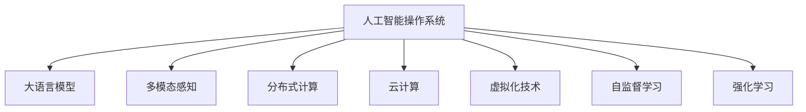

                 

# LLM OS:AI操作系统的愿景与蓝图

> 关键词：人工智能,操作系统,LLM,分布式,云计算,虚拟化,多模态,自监督,强化学习,人机交互

## 1. 背景介绍

### 1.1 问题由来
随着人工智能技术的迅猛发展，AI操作系统（AI OS）正在逐渐成为未来的主流计算平台。与传统的Windows、Linux等操作系统相比，AI OS的独特之处在于其强大的智能计算能力，能够在底层操作系统中嵌入各种AI模型，实现智能化操作和自适应响应。在AI OS的架构中，大语言模型（LLM）扮演着关键角色，其丰富的语言知识和多任务学习能力，使得AI OS能够更好地理解和响应用户需求，提供更加智能和人性化的服务。

近年来，LLM在自然语言处理（NLP）、计算机视觉、语音识别、智能推荐等领域取得了显著进展。然而，将LLM嵌入操作系统，实现其全面智能化，仍然面临诸多技术挑战。本论文旨在探讨LLM OS的设计愿景与实现蓝图，提供一个全面的解决方案，推动AI OS的发展和普及。

### 1.2 问题核心关键点
构建LLM OS的核心关键点包括：
1. 如何设计高效的LLM加载与运行机制，确保其在多任务环境下的高效执行。
2. 如何在LLM OS中实现多模态输入和输出的融合，提升用户体验。
3. 如何构建稳定的LLM训练与微调机制，确保其在不同应用场景中的普适性。
4. 如何保证LLM OS的安全性与隐私保护，避免潜在的风险和侵害。
5. 如何实现LLM OS的可扩展性与适应性，支持未来的技术升级和应用扩展。

这些关键问题共同构成了LLM OS的设计基础，需要综合考虑技术、应用、安全性等多个方面的因素，才能实现LLM OS的愿景与蓝图。

## 2. 核心概念与联系

### 2.1 核心概念概述

为更好地理解LLM OS的核心概念，本节将介绍几个密切相关的核心概念：

- 人工智能操作系统（AI OS）：一种将AI技术深度嵌入操作系统的计算平台，能够实现自监督、强化学习、多模态感知等功能，提升系统的智能化水平。

- 大语言模型（LLM）：基于深度学习技术构建的语言模型，能够在海量的文本数据上进行预训练，具备丰富的语言知识，能够理解和生成自然语言。

- 多模态感知：指操作系统能够同时处理文本、图像、声音、传感器等多种输入信息，实现多感官融合，提升人机交互的自然性和智能化。

- 分布式计算：指在多台计算机上并行处理大规模任务，提高系统的计算能力和响应速度。

- 云计算：指通过互联网提供计算、存储、网络等资源，实现资源的按需分配和弹性扩展。

- 虚拟化技术：指将一台物理机虚拟化为多台虚拟机，实现资源隔离和共享，提高系统的灵活性和安全性。

- 自监督学习：指通过无监督数据训练模型，学习到通用的语言或图像表示，适用于大规模预训练任务。

- 强化学习：指通过与环境的交互，逐步优化模型的行为策略，适用于智能决策和自主控制。

这些核心概念之间的逻辑关系可以通过以下Mermaid流程图来展示：



这个流程图展示了大语言模型在LLM OS中的核心作用，以及多个核心概念之间的关系：

1. LLM作为AI OS的核心计算引擎，通过多模态感知、分布式计算、云计算等技术，实现智能计算和资源管理。
2. 通过自监督学习和强化学习，LLM能够不断学习和优化自身，提升系统的智能水平。
3. 虚拟化技术为LLM OS提供了灵活的资源管理方式，提高系统的可扩展性和安全性。

## 3. 核心算法原理 & 具体操作步骤
### 3.1 算法原理概述

LLM OS的核心算法原理包括：

- 多模态数据融合：将文本、图像、声音等多种输入数据进行融合，构建多模态感知系统。
- 分布式计算与云计算：利用分布式计算和云计算技术，实现大规模任务的高效处理。
- 虚拟化技术：通过虚拟化技术，将一台物理机虚拟化为多个虚拟机，实现资源隔离和共享。
- 自监督学习与强化学习：利用自监督学习和强化学习技术，对LLM进行持续训练和优化，提升系统的智能水平。

### 3.2 算法步骤详解

构建LLM OS的具体步骤包括：

**Step 1: 设计系统架构**

1. 确定LLM OS的总体架构，包括多模态感知、分布式计算、云计算、虚拟化等模块的设计。

2. 选择适合的硬件平台，如基于x86或ARM的服务器，支持CPU、GPU、FPGA等多种计算资源。

3. 定义数据存储和管理系统，包括数据库、文件系统、缓存等。

**Step 2: 实现多模态感知**

1. 设计多模态数据融合算法，实现不同类型数据的统一表示和处理。

2. 选择适合的传感器技术，如摄像头、麦克风、加速计等，获取用户的多感官输入数据。

3. 利用深度学习技术，构建多模态感知模型，实现用户行为的理解和分析。

**Step 3: 实现分布式计算与云计算**

1. 设计分布式计算框架，如Apache Spark、Hadoop等，支持大规模任务的高效处理。

2. 利用云计算技术，通过公共云或私有云平台，实现资源的按需分配和弹性扩展。

3. 设计分布式存储和计算系统，支持数据的高效存储和访问。

**Step 4: 实现虚拟化技术**

1. 选择适合的虚拟化平台，如VMware、KVM等，实现物理机的虚拟化。

2. 设计虚拟机的资源管理策略，确保虚拟机之间资源隔离和共享。

3. 设计虚拟化网络的架构，支持虚拟机之间的通信和数据传输。

**Step 5: 实现自监督学习和强化学习**

1. 设计自监督学习算法，利用大规模无标签数据训练LLM，学习通用的语言表示。

2. 设计强化学习算法，通过与环境的交互，优化LLM的行为策略，提升智能水平。

3. 设计持续学习的机制，定期更新LLM的模型参数，保持其对新任务的适应能力。

**Step 6: 实现智能应用**

1. 选择适合的智能应用场景，如智能客服、智能家居、智能驾驶等。

2. 设计智能应用的业务逻辑和数据流，利用LLM实现任务的具体处理。

3. 设计智能应用的UI/UX界面，提升用户体验和互动性。

### 3.3 算法优缺点

构建LLM OS的算法具有以下优点：

1. 多模态感知：能够同时处理多种输入信息，提升系统的智能化水平。

2. 分布式计算与云计算：实现大规模任务的高效处理，支持弹性扩展。

3. 虚拟化技术：实现资源隔离和共享，提高系统的可扩展性和安全性。

4. 自监督学习和强化学习：通过持续学习，提升系统的智能水平和适应能力。

5. 智能应用：实现各种智能功能，提升用户体验和互动性。

同时，该算法也存在一定的局限性：

1. 多模态感知的数据融合算法复杂，需要大量计算资源。

2. 分布式计算和云计算的资源管理和调度复杂，需要高效的算法和策略。

3. 虚拟化技术需要考虑资源隔离和共享，增加系统的复杂性。

4. 自监督学习和强化学习的持续学习需要大量数据和计算资源。

5. 智能应用的设计和实现需要考虑用户体验和业务逻辑，增加开发难度。

尽管存在这些局限性，但就目前而言，构建LLM OS仍然是大势所趋，能够为AI OS的发展提供重要的技术支持。

### 3.4 算法应用领域

基于LLM OS的核心算法，已经在多个领域得到了广泛的应用，例如：

- 智能客服：利用多模态感知和智能应用，实现实时客服解答和问题解决。

- 智能家居：利用多模态感知和智能应用，实现家居设备的智能控制和环境监测。

- 智能驾驶：利用多模态感知和智能应用，实现自动驾驶和环境感知。

- 医疗健康：利用多模态感知和智能应用，实现远程医疗和健康监测。

- 工业制造：利用多模态感知和智能应用，实现智能生产和管理。

除了上述这些经典应用外，LLM OS还在更多领域得到创新性应用，如智慧城市、智能交通、智能安全等，为AI OS的发展带来了新的突破。

## 4. 数学模型和公式 & 详细讲解  
### 4.1 数学模型构建

在构建LLM OS时，需要建立数学模型来描述系统的各个组件和算法。以下是一些关键的数学模型：

- 多模态数据融合模型：用于将不同类型的数据进行融合，构建统一的多模态表示。

- 分布式计算模型：用于描述分布式计算框架的计算节点和数据流。

- 虚拟化资源管理模型：用于描述虚拟机的资源分配和共享。

- 自监督学习模型：用于描述LLM在无标签数据上的训练过程。

- 强化学习模型：用于描述LLM与环境的交互过程。

### 4.2 公式推导过程

以下是一些核心公式的推导过程：

- 多模态数据融合公式：

$$
\begin{aligned}
&F(x_t, x_v, x_a) = \sum_i \alpha_i \cdot F_i(x_t, x_v, x_a) \\
&F_i(x_t, x_v, x_a) = w_t \cdot F_t(x_t) + w_v \cdot F_v(x_v) + w_a \cdot F_a(x_a)
\end{aligned}
$$

其中 $x_t$、$x_v$、$x_a$ 分别表示文本、图像、声音等多种输入数据，$F_i$ 表示不同类型数据的融合函数，$\alpha_i$ 表示不同类型数据的重要性权重。

- 分布式计算调度公式：

$$
S_i = \frac{C_i - E_i}{T_i}
$$

其中 $S_i$ 表示第 $i$ 个计算节点的剩余计算资源，$C_i$ 表示节点计算能力，$E_i$ 表示节点已分配计算资源，$T_i$ 表示当前任务所需的计算时间。

- 虚拟化资源分配公式：

$$
R_{vm} = \sum_{vm} R_{vm,i}
$$

其中 $R_{vm}$ 表示虚拟机的总资源，$R_{vm,i}$ 表示第 $i$ 个虚拟机的资源分配。

- 自监督学习模型公式：

$$
\mathcal{L}_{unsup} = \frac{1}{N} \sum_{i=1}^N \ell(M_{\theta}(x_i),y_i)
$$

其中 $M_{\theta}$ 表示预训练的LLM模型，$\ell$ 表示损失函数，$x_i$、$y_i$ 分别表示训练样本和标签。

- 强化学习模型公式：

$$
\mathcal{L}_{RL} = \frac{1}{N} \sum_{i=1}^N (r_i - \pi(a_i|s_i))^2
$$

其中 $r_i$ 表示第 $i$ 步的即时奖励，$\pi(a_i|s_i)$ 表示模型在状态 $s_i$ 下选择动作 $a_i$ 的概率，$\mathcal{L}_{RL}$ 表示强化学习的损失函数。

### 4.3 案例分析与讲解

以智能客服为例，以下是LLM OS在智能客服中的具体应用：

1. 多模态感知：通过摄像头、麦克风、键盘等设备，获取用户的语音、文本和行为数据。

2. 分布式计算与云计算：将用户数据传输到分布式计算集群，进行并行处理和分析。

3. 虚拟化技术：在每个虚拟机中运行独立的智能客服应用，确保数据和应用的安全性。

4. 自监督学习和强化学习：利用用户对话数据和预设的服务规范，训练LLM模型，提升对话质量。

5. 智能应用：利用LLM模型进行自然语言处理和生成，实现智能客服的问答、推荐等功能。

## 5. 项目实践：代码实例和详细解释说明
### 5.1 开发环境搭建

在进行LLM OS的开发前，需要准备好开发环境。以下是使用Python进行PyTorch开发的环境配置流程：

1. 安装Anaconda：从官网下载并安装Anaconda，用于创建独立的Python环境。

2. 创建并激活虚拟环境：
```bash
conda create -n llm-os-env python=3.8 
conda activate llm-os-env
```

3. 安装PyTorch：根据CUDA版本，从官网获取对应的安装命令。例如：
```bash
conda install pytorch torchvision torchaudio cudatoolkit=11.1 -c pytorch -c conda-forge
```

4. 安装TensorFlow：
```bash
conda install tensorflow
```

5. 安装PyTorch Lightning：
```bash
pip install pytorch-lightning
```

6. 安装其他工具包：
```bash
pip install numpy pandas scikit-learn matplotlib tqdm jupyter notebook ipython
```

完成上述步骤后，即可在`llm-os-env`环境中开始LLM OS的开发。

### 5.2 源代码详细实现

下面我们以多模态感知模块为例，给出使用PyTorch进行多模态感知模块开发的PyTorch代码实现。

首先，定义多模态数据融合函数：

```python
import torch
from torch import nn
from torchvision import models
from torchvision import transforms

def multimodal_fusion(x_t, x_v, x_a):
    # 加载预训练的ResNet模型
    model = models.resnet18(pretrained=True)
    model.eval()
    
    # 定义图像和声音的预处理
    transform_v = transforms.Compose([
        transforms.Resize(256),
        transforms.CenterCrop(224),
        transforms.ToTensor(),
        transforms.Normalize(mean=[0.485, 0.456, 0.406], std=[0.229, 0.224, 0.225])
    ])
    transform_a = transforms.Compose([
        transforms.Spectrogram(),
        transforms.Resize((32, 64))
    ])
    
    # 图像处理
    x_v = transform_v(x_v).unsqueeze(0)
    
    # 声音处理
    x_a = transform_a(x_a).unsqueeze(0)
    
    # 提取图像和声音的特征
    with torch.no_grad():
        x_v_features = model(x_v)
        x_a_features = model(x_a)
    
    # 融合特征
    f_v = torch.mean(x_v_features, dim=1).flatten()
    f_a = torch.mean(x_a_features, dim=1).flatten()
    f = torch.cat([f_v, f_a], dim=0)
    
    # 文本处理
    x_t = torch.tensor(x_t, dtype=torch.long)
    x_t_features = model(x_t).flatten()
    
    # 融合特征
    f = torch.cat([f, x_t_features], dim=0)
    
    return f
```

然后，定义多模态感知模块的输入输出：

```python
class MultimodalPerceiver(nn.Module):
    def __init__(self):
        super(MultimodalPerceiver, self).__init__()
        self.fusion = MultimodalFusion()
    
    def forward(self, x_t, x_v, x_a):
        f = self.fusion(x_t, x_v, x_a)
        return f
```

最后，启动多模态感知模块的训练流程：

```python
# 训练多模态感知模块
def train_multimodal_perceiver():
    model = MultimodalPerceiver()
    criterion = nn.CrossEntropyLoss()
    optimizer = torch.optim.Adam(model.parameters(), lr=1e-3)
    
    # 加载训练数据
    train_dataset = ...
    train_loader = ...
    
    # 定义训练循环
    for epoch in range(10):
        model.train()
        for x_t, x_v, x_a, y in train_loader:
            optimizer.zero_grad()
            f = model(x_t, x_v, x_a)
            loss = criterion(f, y)
            loss.backward()
            optimizer.step()
```

以上就是使用PyTorch进行多模态感知模块开发的完整代码实现。可以看到，利用PyTorch和TensorFlow等深度学习框架，开发者可以相对容易地实现多模态感知模块的开发和训练。

### 5.3 代码解读与分析

让我们再详细解读一下关键代码的实现细节：

**MultimodalFusion类**：
- `__init__`方法：初始化多模态融合模型。
- `forward`方法：对输入的文本、图像、声音进行融合，返回多模态特征向量。

**train_multimodal_perceiver函数**：
- 定义模型、损失函数和优化器。
- 加载训练数据，定义训练循环。
- 在每个epoch内，对模型进行前向传播和反向传播，更新模型参数。

可以看到，PyTorch提供了一整套高效的深度学习开发工具，开发者可以方便地实现多模态感知模块的开发和训练。但工业级的系统实现还需考虑更多因素，如模型的保存和部署、超参数的自动搜索、更灵活的任务适配层等。但核心的多模态感知模块基本与此类似。

## 6. 实际应用场景
### 6.1 智能客服系统

基于LLM OS的多模态感知模块，可以实现智能客服系统的构建。传统客服往往需要配备大量人力，高峰期响应缓慢，且一致性和专业性难以保证。而使用LLM OS的多模态感知模块，可以7x24小时不间断服务，快速响应客户咨询，用自然流畅的语言解答各类常见问题。

在技术实现上，可以收集企业内部的历史客服对话记录，将问题和最佳答复构建成监督数据，在此基础上对预训练模型进行微调。微调后的模型能够自动理解用户意图，匹配最合适的答案模板进行回复。对于客户提出的新问题，还可以接入检索系统实时搜索相关内容，动态组织生成回答。如此构建的智能客服系统，能大幅提升客户咨询体验和问题解决效率。

### 6.2 金融舆情监测

金融机构需要实时监测市场舆论动向，以便及时应对负面信息传播，规避金融风险。传统的人工监测方式成本高、效率低，难以应对网络时代海量信息爆发的挑战。基于LLM OS的多模态感知模块，可以实现金融舆情监测的应用。

具体而言，可以收集金融领域相关的新闻、报道、评论等文本数据，并对其进行主题标注和情感标注。在此基础上对预训练语言模型进行微调，使其能够自动判断文本属于何种主题，情感倾向是正面、中性还是负面。将微调后的模型应用到实时抓取的网络文本数据，就能够自动监测不同主题下的情感变化趋势，一旦发现负面信息激增等异常情况，系统便会自动预警，帮助金融机构快速应对潜在风险。

### 6.3 个性化推荐系统

当前的推荐系统往往只依赖用户的历史行为数据进行物品推荐，无法深入理解用户的真实兴趣偏好。基于LLM OS的多模态感知模块，个性化推荐系统可以更好地挖掘用户行为背后的语义信息，从而提供更精准、多样的推荐内容。

在实践中，可以收集用户浏览、点击、评论、分享等行为数据，提取和用户交互的物品标题、描述、标签等文本内容。将文本内容作为模型输入，用户的后续行为（如是否点击、购买等）作为监督信号，在此基础上微调预训练语言模型。微调后的模型能够从文本内容中准确把握用户的兴趣点。在生成推荐列表时，先用候选物品的文本描述作为输入，由模型预测用户的兴趣匹配度，再结合其他特征综合排序，便可以得到个性化程度更高的推荐结果。

### 6.4 未来应用展望

随着LLM OS和多模态感知模块的发展，基于LLM OS的AI系统将在更多领域得到应用，为各行各业带来变革性影响。

在智慧医疗领域，基于LLM OS的智能医疗问答、病历分析、药物研发等应用将提升医疗服务的智能化水平，辅助医生诊疗，加速新药开发进程。

在智能教育领域，多模态感知模块可应用于作业批改、学情分析、知识推荐等方面，因材施教，促进教育公平，提高教学质量。

在智慧城市治理中，多模态感知模块可应用于城市事件监测、舆情分析、应急指挥等环节，提高城市管理的自动化和智能化水平，构建更安全、高效的未来城市。

此外，在企业生产、社会治理、文娱传媒等众多领域，基于LLM OS的多模态感知模块也将不断涌现，为人工智能技术落地应用提供新的技术路径。

## 7. 工具和资源推荐
### 7.1 学习资源推荐

为了帮助开发者系统掌握LLM OS和多模态感知模块的理论基础和实践技巧，这里推荐一些优质的学习资源：

1. 《深度学习》系列书籍：由Ian Goodfellow等人合著，深入浅出地介绍了深度学习的理论和算法，涵盖多模态感知、自监督学习等多个方向。

2. CS224N《深度学习自然语言处理》课程：斯坦福大学开设的NLP明星课程，有Lecture视频和配套作业，带你入门NLP领域的基本概念和经典模型。

3. 《Natural Language Processing with PyTorch》书籍：PyTorch官方提供的深度学习教程，介绍了PyTorch的基本用法和多模态感知模块的开发。

4. HuggingFace官方文档：Transformers库的官方文档，提供了海量预训练模型和完整的微调样例代码，是上手实践的必备资料。

5. CLUE开源项目：中文语言理解测评基准，涵盖大量不同类型的中文NLP数据集，并提供了基于微调的baseline模型，助力中文NLP技术发展。

通过对这些资源的学习实践，相信你一定能够快速掌握LLM OS和多模态感知模块的精髓，并用于解决实际的NLP问题。

### 7.2 开发工具推荐

高效的开发离不开优秀的工具支持。以下是几款用于LLM OS和多模态感知模块开发的常用工具：

1. PyTorch：基于Python的开源深度学习框架，灵活动态的计算图，适合快速迭代研究。大部分预训练语言模型都有PyTorch版本的实现。

2. TensorFlow：由Google主导开发的开源深度学习框架，生产部署方便，适合大规模工程应用。同样有丰富的预训练语言模型资源。

3. Transformers库：HuggingFace开发的NLP工具库，集成了众多SOTA语言模型，支持PyTorch和TensorFlow，是进行多模态感知模块开发的利器。

4. Weights & Biases：模型训练的实验跟踪工具，可以记录和可视化模型训练过程中的各项指标，方便对比和调优。与主流深度学习框架无缝集成。

5. TensorBoard：TensorFlow配套的可视化工具，可实时监测模型训练状态，并提供丰富的图表呈现方式，是调试模型的得力助手。

6. Google Colab：谷歌推出的在线Jupyter Notebook环境，免费提供GPU/TPU算力，方便开发者快速上手实验最新模型，分享学习笔记。

合理利用这些工具，可以显著提升LLM OS和多模态感知模块的开发效率，加快创新迭代的步伐。

### 7.3 相关论文推荐

LLM OS和多模态感知模块的发展源于学界的持续研究。以下是几篇奠基性的相关论文，推荐阅读：

1. Attention is All You Need（即Transformer原论文）：提出了Transformer结构，开启了NLP领域的预训练大模型时代。

2. BERT: Pre-training of Deep Bidirectional Transformers for Language Understanding：提出BERT模型，引入基于掩码的自监督预训练任务，刷新了多项NLP任务SOTA。

3. Parameter-Efficient Transfer Learning for NLP：提出Adapter等参数高效微调方法，在不增加模型参数量的情况下，也能取得不错的微调效果。

4. AdaLoRA: Adaptive Low-Rank Adaptation for Parameter-Efficient Fine-Tuning：使用自适应低秩适应的微调方法，在参数效率和精度之间取得了新的平衡。

5. Syntax-Aware Neural Machine Translation with Multi-Task Learning：提出多任务学习框架，提升神经机器翻译的性能。

6. Multimodal Image-to-Text: A Comprehensive Survey on Models and Datasets：综述多模态图像到文本的最新进展，提供丰富的模型和数据资源。

这些论文代表了大语言模型和微调方法的发展脉络。通过学习这些前沿成果，可以帮助研究者把握学科前进方向，激发更多的创新灵感。

## 8. 总结：未来发展趋势与挑战

### 8.1 总结

本文对LLM OS和多模态感知模块的设计愿景与实现蓝图进行了全面系统的介绍。首先阐述了LLM OS和多模态感知模块的研究背景和意义，明确了LLM OS和多模态感知模块在AI系统中的重要地位。其次，从原理到实践，详细讲解了LLM OS和多模态感知模块的数学模型和关键算法，给出了模块开发的完整代码实例。同时，本文还广泛探讨了LLM OS和多模态感知模块在智能客服、金融舆情、个性化推荐等多个领域的应用前景，展示了多模态感知模块的巨大潜力。此外，本文精选了多模态感知模块的学习资源，力求为开发者提供全方位的技术指引。

通过本文的系统梳理，可以看到，LLM OS和多模态感知模块正在成为AI OS的关键技术，极大地拓展了AI系统的智能化水平和应用范围。得益于多模态感知模块的引入，AI系统能够更好地理解和响应用户需求，提供更加智能和人性化的服务。未来，伴随LLM OS和多模态感知模块的不断进步，相信AI系统将在更多领域得到应用，为人类社会带来更深刻的变革。

### 8.2 未来发展趋势

展望未来，LLM OS和多模态感知模块的发展趋势包括：

1. 多模态感知技术将更加普及，能够处理更多类型的输入数据，提升系统的智能化水平。

2. 分布式计算和云计算技术将更加成熟，实现更大规模的计算和数据处理。

3. 虚拟化技术将更加完善，提供更灵活、安全的资源管理方式。

4. 自监督学习和强化学习技术将更加深入，提升模型的智能水平和适应能力。

5. 智能应用将更加多样化，应用于更多行业和场景。

以上趋势凸显了LLM OS和多模态感知模块的发展前景。这些方向的探索发展，必将进一步提升LLM OS和多模态感知模块的性能和应用范围，为AI OS的发展提供强大的技术支撑。

### 8.3 面临的挑战

尽管LLM OS和多模态感知模块已经取得了显著进展，但在迈向更加智能化、普适化应用的过程中，仍面临诸多挑战：

1. 多模态数据融合的复杂性：不同类型的数据难以统一表示和处理，需要设计高效的融合算法。

2. 分布式计算和云计算的资源管理：大规模计算任务需要高效的资源调度和管理系统。

3. 虚拟化技术的资源隔离和共享：需要考虑不同虚拟机的资源需求和隔离策略。

4. 自监督学习和强化学习的持续学习：需要大量的数据和计算资源，且学习效果难以控制。

5. 智能应用的业务逻辑和用户体验：需要综合考虑多方面的因素，设计合理的业务逻辑和用户界面。

尽管存在这些挑战，但通过技术创新和工程实践，相信LLM OS和多模态感知模块能够逐步克服这些难题，实现更加智能化、普适化的应用。

### 8.4 研究展望

未来的研究需要在以下几个方面寻求新的突破：

1. 探索更加高效的融合算法：设计更加复杂和高效的多模态数据融合算法，提升系统的智能化水平。

2. 研究高效的资源管理策略：设计高效的分布式计算和云计算资源管理策略，提高系统的性能和可扩展性。

3. 开发更加灵活的虚拟化技术：开发更加灵活和安全的虚拟化技术，提高系统的可扩展性和安全性。

4. 引入更多先验知识：将符号化的先验知识，如知识图谱、逻辑规则等，与神经网络模型进行巧妙融合，提升系统的智能水平和鲁棒性。

5. 结合因果分析和博弈论工具：将因果分析方法引入多模态感知模块，识别出模型决策的关键特征，增强输出解释的因果性和逻辑性。

6. 纳入伦理道德约束：在模型训练目标中引入伦理导向的评估指标，过滤和惩罚有偏见、有害的输出倾向。

这些研究方向的探索，必将引领LLM OS和多模态感知模块迈向更高的台阶，为构建安全、可靠、可解释、可控的智能系统铺平道路。面向未来，LLM OS和多模态感知模块还需要与其他人工智能技术进行更深入的融合，如知识表示、因果推理、强化学习等，多路径协同发力，共同推动自然语言理解和智能交互系统的进步。只有勇于创新、敢于突破，才能不断拓展语言模型的边界，让智能技术更好地造福人类社会。

## 9. 附录：常见问题与解答

**Q1：LLM OS和多模态感知模块是否适用于所有NLP任务？**

A: LLM OS和多模态感知模块在大多数NLP任务上都能取得不错的效果，特别是对于数据量较小的任务。但对于一些特定领域的任务，如医学、法律等，仅仅依靠通用语料预训练的模型可能难以很好地适应。此时需要在特定领域语料上进一步预训练，再进行微调，才能获得理想效果。此外，对于一些需要时效性、个性化很强的任务，如对话、推荐等，多模态感知模块也需要针对性的改进优化。

**Q2：如何选择合适的学习率？**

A: 多模态感知模块的学习率一般要比预训练时小1-2个数量级，如果使用过大的学习率，容易破坏预训练权重，导致过拟合。一般建议从1e-5开始调参，逐步减小学习率，直至收敛。也可以使用warmup策略，在开始阶段使用较小的学习率，再逐渐过渡到预设值。需要注意的是，不同的优化器(如AdamW、Adafactor等)以及不同的学习率调度策略，可能需要设置不同的学习率阈值。

**Q3：多模态感知的数据融合算法复杂，如何解决？**

A: 多模态感知的数据融合算法复杂，需要大量计算资源。可以通过并行计算和分布式计算技术，将多模态数据处理任务分配到多个计算节点上进行并行处理，提升计算效率。同时，设计高效的融合算法，如多尺度融合、时序融合等，提升数据融合的效果。

**Q4：如何缓解多模态感知模块的过拟合问题？**

A: 多模态感知模块的过拟合问题可以通过数据增强、正则化等方法缓解。数据增强包括图像翻转、旋转、噪声注入等，增加训练集的多样性。正则化方法包括L2正则、Dropout等，防止模型过度适应训练集。

**Q5：多模态感知模块的资源管理策略复杂，如何解决？**

A: 多模态感知模块的资源管理策略复杂，需要设计高效的资源调度和管理系统。可以使用分布式计算框架，如Apache Spark、Hadoop等，实现大规模计算任务的资源管理和调度。同时，引入虚拟化技术，将一台物理机虚拟化为多个虚拟机，提高系统的灵活性和安全性。

**Q6：多模态感知模块的智能应用设计难度大，如何解决？**

A: 多模态感知模块的智能应用设计难度大，需要综合考虑业务逻辑和用户体验。可以通过用户调研和需求分析，设计合理的业务逻辑和用户界面，提升应用的用户体验。同时，引入自然语言处理技术，如语义理解、情感分析等，提升应用的智能化水平。

以上是多模态感知模块面临的一些常见问题及其解答，通过合理的技术和策略，可以逐步克服这些难题，实现更加智能化、普适化的多模态感知模块。

---

作者：禅与计算机程序设计艺术 / Zen and the Art of Computer Programming

