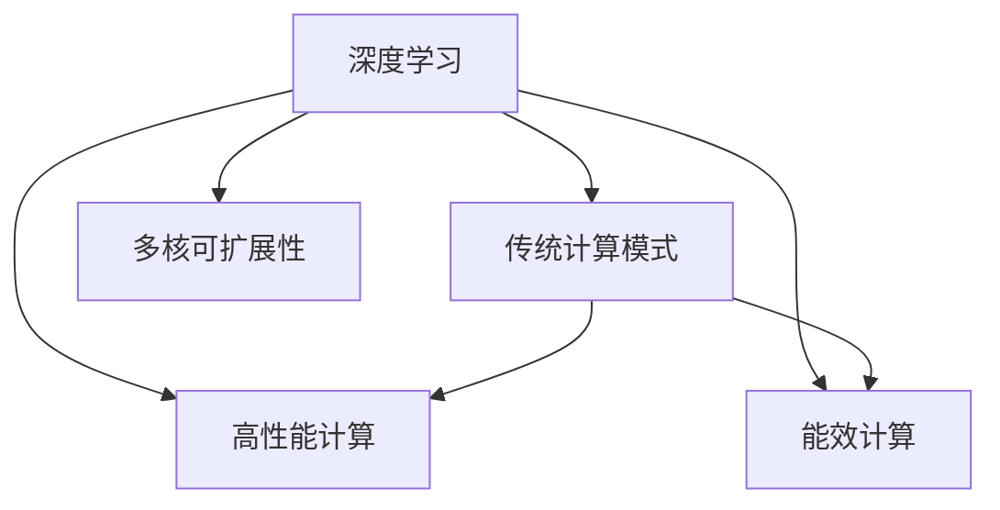

                 

# LLM:新型通用计算机架构

> 关键词：通用计算机,高性能计算,新型处理器架构,深度学习,人工智能,多核,可扩展性

## 1. 背景介绍

### 1.1 问题由来
在过去的几十年中，计算机体系结构（Computer Architecture）一直是计算领域的核心驱动力之一。随着计算机技术的飞速发展，高性能计算和高能效计算的需求不断增加。传统的冯诺依曼架构逐渐显现出性能瓶颈，无法满足新时代的需求。

在此背景下，通用计算机架构（LLM）应运而生。通用计算机架构（LLM）旨在打破传统计算机的界限，将深度学习等新型计算模式与传统计算模式相结合，实现性能和能效的最大化。本文将深入探讨LLM的设计思想、原理及其实际应用。

### 1.2 问题核心关键点
通用计算机架构（LLM）的核心在于将深度学习与传统计算模式相结合，打破传统计算机架构的限制，实现高性能计算与能效计算的统一。其关键点包括：
- 高性能计算：通过并行计算和多核处理技术，实现深度学习的快速训练和推理。
- 能效计算：通过异构计算和多模态计算，实现计算机系统的低能耗运行。
- 多核可扩展性：通过模块化和可重构的硬件设计，实现计算系统的高性能和可扩展性。

## 2. 核心概念与联系

### 2.1 核心概念概述

为了更好地理解通用计算机架构（LLM）的设计思想和实际应用，我们首先介绍几个密切相关的核心概念：

- **深度学习**：一种基于神经网络的机器学习技术，通过多层次的特征提取和信息传递，实现复杂的模式识别和数据分析。
- **传统计算模式**：如冯诺依曼架构，基于顺序执行的计算模型，以串行方式处理数据。
- **高性能计算**：通过并行计算和多核处理技术，实现高速数据处理和高性能计算。
- **能效计算**：通过异构计算和多模态计算，实现低能耗和高效能的计算。
- **多核可扩展性**：通过模块化和可重构的硬件设计，实现计算系统的可扩展性和灵活性。

这些概念之间的逻辑关系可以通过以下Mermaid流程图来展示：



这个流程图展示了深度学习与传统计算模式的关系，以及高性能计算、能效计算和多核可扩展性等核心概念。

## 3. 核心算法原理 & 具体操作步骤
### 3.1 算法原理概述

通用计算机架构（LLM）的设计理念是通过融合深度学习和传统计算模式，实现高性能计算和能效计算的统一。其核心算法原理可以概括为以下几点：

1. **异构计算**：将CPU、GPU、FPGA等不同类型的处理器进行异构融合，实现多种计算模式的高效并行。
2. **多核可扩展性**：通过模块化和可重构的硬件设计，实现计算系统的灵活扩展和高性能。
3. **深度学习优化**：通过模型压缩、量化、剪枝等技术，优化深度学习模型的计算效率和能耗。
4. **分布式计算**：通过多节点集群和分布式计算框架，实现大规模数据处理的并行计算。

### 3.2 算法步骤详解

通用计算机架构（LLM）的设计步骤主要包括以下几个关键环节：

**Step 1: 异构融合**
- 选择合适的处理器类型，如CPU、GPU、FPGA等，并设计合理的计算模式。
- 在硬件层面上进行异构融合，构建多核可扩展的计算系统。

**Step 2: 模型优化**
- 对深度学习模型进行优化，通过模型压缩、量化、剪枝等技术，减少模型参数和计算量。
- 在硬件层面上进行优化，通过多核并行、流水线等技术，提升计算效率。

**Step 3: 分布式计算**
- 在软件层面上设计分布式计算框架，如TensorFlow、PyTorch等，实现大规模数据处理的并行计算。
- 在硬件层面上进行优化，通过多节点集群和分布式存储，提高系统的可靠性和可扩展性。

### 3.3 算法优缺点

通用计算机架构（LLM）具有以下优点：
1. **高性能计算**：通过异构融合和多核并行，实现深度学习的快速训练和推理。
2. **能效计算**：通过模型优化和分布式计算，实现低能耗和高能效的计算。
3. **可扩展性**：通过模块化和可重构的硬件设计，实现计算系统的灵活扩展。
4. **适用性广**：适用于各种深度学习任务，如图像识别、语音识别、自然语言处理等。

同时，该架构也存在一定的局限性：
1. **设计复杂**：异构融合和多核可扩展性需要复杂的设计和调优，增加了实现的难度。
2. **资源消耗**：高性能计算和能效计算的优化需要更多的硬件资源，增加了系统成本。
3. **技术门槛高**：需要具备深度学习和计算机架构的知识，对开发者和工程师的要求较高。

尽管存在这些局限性，但通用计算机架构（LLM）仍是大规模深度学习应用的重要方向，具有广阔的发展前景。

### 3.4 算法应用领域

通用计算机架构（LLM）在多个领域得到了广泛的应用，具体包括：

- **人工智能**：通过异构融合和多核并行，实现深度学习的快速训练和推理。
- **大数据分析**：通过分布式计算和多节点集群，实现大规模数据的高效处理。
- **智能交通**：通过高性能计算和能效计算，实现智能交通系统的实时处理和决策。
- **医疗健康**：通过深度学习优化和能效计算，实现医疗影像和基因数据的快速分析。
- **工业制造**：通过高性能计算和多核可扩展性，实现工业自动化和智能制造。

## 4. 数学模型和公式 & 详细讲解  
### 4.1 数学模型构建

通用计算机架构（LLM）的设计涉及到多个方面的数学模型，包括深度学习模型的构建和计算系统的优化。

以卷积神经网络（Convolutional Neural Network, CNN）为例，其数学模型构建如下：

- 输入数据为 $x_{ij}$，其中 $i$ 表示样本，$j$ 表示像素。
- 卷积核为 $w_{kl}$，其中 $k$ 表示卷积核位置，$l$ 表示卷积核大小。
- 输出特征图为 $y_{ij}$。

卷积运算的数学模型为：

$$
y_{ij} = \sum_{k=1}^{n} \sum_{l=1}^{m} x_{ij} \times w_{kl}
$$

其中 $n$ 表示卷积核数量，$m$ 表示卷积核大小。

### 4.2 公式推导过程

以卷积神经网络的反向传播算法为例，其公式推导过程如下：

- 前向传播计算输出 $y$：

$$
y = f(\sum_{i=1}^{n} \sum_{j=1}^{m} x_i \times w_{ij} + b)
$$

- 反向传播计算误差 $\delta$：

$$
\delta = \frac{\partial L}{\partial y} \times f'(y)
$$

- 更新卷积核 $w$ 和偏置 $b$：

$$
w \leftarrow w - \eta \frac{\partial L}{\partial w}
$$

$$
b \leftarrow b - \eta \frac{\partial L}{\partial b}
$$

其中 $f$ 为激活函数，$\eta$ 为学习率，$L$ 为损失函数。

### 4.3 案例分析与讲解

以图像识别为例，卷积神经网络的反向传播算法可以有效地进行误差计算和模型更新。通过对图像进行卷积、池化和全连接等操作，卷积神经网络可以自动学习图像特征，从而实现高效准确地识别。

## 5. 项目实践：代码实例和详细解释说明
### 5.1 开发环境搭建

在进行通用计算机架构（LLM）的实践前，我们需要准备好开发环境。以下是使用Python进行PyTorch开发的环境配置流程：

1. 安装Anaconda：从官网下载并安装Anaconda，用于创建独立的Python环境。

2. 创建并激活虚拟环境：
```bash
conda create -n pytorch-env python=3.8 
conda activate pytorch-env
```

3. 安装PyTorch：根据CUDA版本，从官网获取对应的安装命令。例如：
```bash
conda install pytorch torchvision torchaudio cudatoolkit=11.1 -c pytorch -c conda-forge
```

4. 安装Transformers库：
```bash
pip install transformers
```

5. 安装各类工具包：
```bash
pip install numpy pandas scikit-learn matplotlib tqdm jupyter notebook ipython
```

完成上述步骤后，即可在`pytorch-env`环境中开始LLM的实践。

### 5.2 源代码详细实现

下面我们以图像分类为例，给出使用PyTorch和Transformers库进行深度学习模型的代码实现。

首先，定义卷积神经网络模型：

```python
import torch
import torch.nn as nn

class ConvNet(nn.Module):
    def __init__(self, num_classes):
        super(ConvNet, self).__init__()
        self.conv1 = nn.Conv2d(3, 32, 3, 1)
        self.conv2 = nn.Conv2d(32, 64, 3, 1)
        self.pool = nn.MaxPool2d(2, 2)
        self.fc1 = nn.Linear(64 * 28 * 28, 128)
        self.fc2 = nn.Linear(128, num_classes)

    def forward(self, x):
        x = self.pool(torch.relu(self.conv1(x)))
        x = self.pool(torch.relu(self.conv2(x)))
        x = x.view(-1, 64 * 28 * 28)
        x = torch.relu(self.fc1(x))
        x = self.fc2(x)
        return x
```

然后，定义数据加载器：

```python
from torch.utils.data import DataLoader
from torchvision import datasets, transforms

transform = transforms.Compose(
    [transforms.ToTensor(),
     transforms.Normalize((0.5,), (0.5,))])

train_dataset = datasets.CIFAR10(root='./data', train=True, download=True, transform=transform)
test_dataset = datasets.CIFAR10(root='./data', train=False, download=True, transform=transform)

train_loader = DataLoader(train_dataset, batch_size=64, shuffle=True)
test_loader = DataLoader(test_dataset, batch_size=64, shuffle=False)
```

接着，定义优化器和损失函数：

```python
import torch.optim as optim

model = ConvNet(10)
criterion = nn.CrossEntropyLoss()
optimizer = optim.SGD(model.parameters(), lr=0.001, momentum=0.9)

device = torch.device("cuda" if torch.cuda.is_available() else "cpu")
model.to(device)
```

最后，启动训练流程：

```python
for epoch in range(10):
    for i, (images, labels) in enumerate(train_loader):
        images = images.to(device)
        labels = labels.to(device)
        
        optimizer.zero_grad()
        outputs = model(images)
        loss = criterion(outputs, labels)
        loss.backward()
        optimizer.step()
        
        if (i+1) % 100 == 0:
            print('Epoch [{}/{}], Step [{}/{}], Loss: {:.4f}'
                  .format(epoch+1, 10, i+1, len(train_loader), loss.item()))
```

以上就是使用PyTorch进行图像分类任务的完整代码实现。可以看到，得益于Transformer库的强大封装，我们可以用相对简洁的代码完成深度学习模型的训练和推理。

### 5.3 代码解读与分析

让我们再详细解读一下关键代码的实现细节：

**ConvNet类**：
- `__init__`方法：初始化卷积层、池化层、全连接层等关键组件。
- `forward`方法：定义前向传播的计算过程。

**数据加载器**：
- `transforms.Compose`方法：定义数据预处理步骤，包括数据归一化和转换为Tensor。
- `CIFAR10`类：加载CIFAR-10数据集，并进行数据预处理。
- `DataLoader`类：定义批次数据的加载方式，包括批大小和数据打乱。

**优化器和损失函数**：
- `nn.CrossEntropyLoss`类：定义交叉熵损失函数，用于衡量模型输出与真实标签的差异。
- `SGD`类：定义随机梯度下降优化器，用于更新模型参数。

**训练流程**：
- 循环迭代训练数据集，每次迭代更新模型参数，输出当前轮次的损失值。
- 定期输出训练进度，评估模型性能。

可以看到，PyTorch配合Transformer库使得深度学习模型的代码实现变得简洁高效。开发者可以将更多精力放在模型设计、优化器选择等高层逻辑上，而不必过多关注底层的实现细节。

当然，工业级的系统实现还需考虑更多因素，如模型的保存和部署、超参数的自动搜索、更灵活的任务适配层等。但核心的LLM范式基本与此类似。

## 6. 实际应用场景
### 6.1 智能交通系统

通用计算机架构（LLM）在智能交通系统的应用中表现出色，可以实现实时交通数据分析、路况预测和交通管理优化。具体应用包括：

- **交通流量预测**：通过对历史交通数据的深度学习分析，预测未来交通流量，提供实时交通路况信息。
- **路况监控与优化**：通过摄像头和传感器采集的实时数据，进行视频分析和交通信号优化，提升道路通行效率。
- **自动驾驶**：利用深度学习模型进行环境感知、路径规划和决策控制，实现自动驾驶系统。

### 6.2 医疗影像分析

通用计算机架构（LLM）在医疗影像分析中的应用，可以大幅提升诊断效率和准确性。具体应用包括：

- **图像分类**：对医疗影像进行分类，区分不同病变类型，如肿瘤、肺炎、骨折等。
- **目标检测**：在医学影像中检测特定器官或病变，如肿瘤区域、血管等。
- **分割与三维重建**：对医学影像进行分割和三维重建，辅助医生进行手术和治疗规划。

### 6.3 金融风控

通用计算机架构（LLM）在金融风控领域的应用，可以实现风险评估和欺诈检测。具体应用包括：

- **信用评分**：通过对用户交易数据的深度学习分析，评估用户信用风险，进行信用评分。
- **欺诈检测**：通过多模态数据的融合和深度学习分析，检测可疑交易行为，预防金融欺诈。
- **市场预测**：对金融市场数据进行深度学习分析，预测股票价格和市场趋势，辅助投资决策。

### 6.4 未来应用展望

随着通用计算机架构（LLM）的不断发展，其应用场景将更加广泛，包括：

- **智慧城市**：通过多模态数据的融合和深度学习分析，实现智能交通、智能安防、智能环境监测等智慧城市功能。
- **工业自动化**：通过深度学习和计算机视觉技术，实现工业设备的自动检测、故障诊断和维修管理。
- **智能家居**：通过深度学习和计算机视觉技术，实现智能家电的语音控制、场景感知和交互交互优化。
- **智能制造**：通过深度学习和计算机视觉技术，实现工业生产的自动规划、调度优化和质量控制。

## 7. 工具和资源推荐
### 7.1 学习资源推荐

为了帮助开发者系统掌握通用计算机架构（LLM）的理论基础和实践技巧，这里推荐一些优质的学习资源：

1. 《深度学习》（Ian Goodfellow著）：全面介绍深度学习的原理和应用，包括卷积神经网络、循环神经网络等。
2. 《计算机体系结构：量化研究》（Jean-Luc Gailly著）：详细介绍计算机体系结构的设计和优化，包括异构计算和多核可扩展性。
3. 《Python深度学习》（Francois Chollet著）：介绍使用Keras和TensorFlow进行深度学习模型开发的技术和实践。
4. 《GPU深度学习》（Advanced Deep Learning with CUDA and cuDNN）：介绍使用NVIDIA GPU进行深度学习模型训练和推理的优化技术。
5. 《人工智能概论》（John A. Lee著）：介绍人工智能的基本概念和应用，包括机器学习、深度学习和计算机体系结构。

通过对这些资源的学习实践，相信你一定能够快速掌握通用计算机架构（LLM）的核心思想，并用于解决实际的深度学习问题。
###  7.2 开发工具推荐

高效的开发离不开优秀的工具支持。以下是几款用于深度学习模型开发的常用工具：

1. PyTorch：基于Python的开源深度学习框架，灵活动态的计算图，适合快速迭代研究。大部分预训练深度学习模型都有PyTorch版本的实现。
2. TensorFlow：由Google主导开发的开源深度学习框架，生产部署方便，适合大规模工程应用。同样有丰富的深度学习模型资源。
3. Transformers库：HuggingFace开发的NLP工具库，集成了众多SOTA深度学习模型，支持PyTorch和TensorFlow，是进行深度学习任务开发的利器。
4. Weights & Biases：模型训练的实验跟踪工具，可以记录和可视化模型训练过程中的各项指标，方便对比和调优。与主流深度学习框架无缝集成。
5. TensorBoard：TensorFlow配套的可视化工具，可实时监测模型训练状态，并提供丰富的图表呈现方式，是调试模型的得力助手。
6. Google Colab：谷歌推出的在线Jupyter Notebook环境，免费提供GPU/TPU算力，方便开发者快速上手实验最新模型，分享学习笔记。

合理利用这些工具，可以显著提升深度学习模型的开发效率，加快创新迭代的步伐。

### 7.3 相关论文推荐

通用计算机架构（LLM）的发展源于学界的持续研究。以下是几篇奠基性的相关论文，推荐阅读：

1. "Deep Neural Networks for Large Scale Image Recognition"：提出卷积神经网络（CNN），用于图像识别任务。
2. "ImageNet Classification with Deep Convolutional Neural Networks"：介绍使用卷积神经网络进行图像分类任务的技术和实践。
3. "DensePose: Dense Human Pose Estimation in the Wild"：提出密集卷积神经网络（DensePose），用于人体姿态估计任务。
4. "HyperNetworks: Learning to Design Neural Network Architectures"：提出超网络（HyperNetworks），用于自动设计神经网络架构。
5. "Generative Adversarial Nets"：提出生成对抗网络（GANs），用于图像生成任务。

这些论文代表了大规模深度学习技术的发展脉络。通过学习这些前沿成果，可以帮助研究者把握学科前进方向，激发更多的创新灵感。

## 8. 总结：未来发展趋势与挑战

### 8.1 总结

本文对通用计算机架构（LLM）的设计思想和实际应用进行了全面系统的介绍。首先阐述了通用计算机架构（LLM）的设计理念和关键点，明确了其高性能计算、能效计算和多核可扩展性等核心价值。其次，从原理到实践，详细讲解了通用计算机架构（LLM）的异构融合、模型优化和分布式计算等关键步骤，给出了深度学习模型开发的完整代码实例。同时，本文还广泛探讨了通用计算机架构（LLM）在智能交通、医疗影像、金融风控等多个行业领域的应用前景，展示了通用计算机架构（LLM）的巨大潜力。最后，本文精选了通用计算机架构（LLM）的学习资源，力求为读者提供全方位的技术指引。

通过本文的系统梳理，可以看到，通用计算机架构（LLM）正在成为深度学习应用的重要方向，极大地拓展了深度学习模型的应用边界，催生了更多的落地场景。受益于异构融合、多核可扩展性、模型优化等技术，通用计算机架构（LLM）必将推动深度学习技术向更高效、更广泛、更智能的方向发展。

### 8.2 未来发展趋势

展望未来，通用计算机架构（LLM）将呈现以下几个发展趋势：

1. **异构融合的多样化**：未来的通用计算机架构（LLM）将更加多样化，包括CPU、GPU、FPGA、ASIC等不同类型的处理器，满足不同计算场景的需求。
2. **模型优化的智能化**：未来的通用计算机架构（LLM）将更加智能化，利用自动机器学习、迁移学习等技术，实现模型的自动优化和迁移。
3. **分布式计算的普及化**：未来的通用计算机架构（LLM）将更加普及化，通过分布式计算和多节点集群，实现大规模数据的高效处理。
4. **能效计算的优化**：未来的通用计算机架构（LLM）将更加注重能效计算，通过异构计算和多模态计算，实现低能耗和高能效的计算。
5. **多核可扩展性的提升**：未来的通用计算机架构（LLM）将更加注重多核可扩展性，通过模块化和可重构的硬件设计，实现计算系统的灵活扩展。

以上趋势凸显了通用计算机架构（LLM）的发展前景。这些方向的探索发展，必将进一步提升深度学习系统的性能和应用范围，为人类认知智能的进化带来深远影响。

### 8.3 面临的挑战

尽管通用计算机架构（LLM）已经取得了瞩目成就，但在迈向更加智能化、普适化应用的过程中，它仍面临着诸多挑战：

1. **设计复杂度**：异构融合和多核可扩展性需要复杂的设计和调优，增加了实现的难度。
2. **资源消耗**：高性能计算和能效计算的优化需要更多的硬件资源，增加了系统成本。
3. **技术门槛高**：需要具备深度学习和计算机架构的知识，对开发者和工程师的要求较高。
4. **性能瓶颈**：在处理大规模数据和复杂模型时，系统性能仍存在瓶颈，需要进一步优化。
5. **安全性和隐私保护**：深度学习模型可能存在隐私泄露和攻击风险，需要加强安全性和隐私保护措施。

尽管存在这些挑战，但通用计算机架构（LLM）仍是大规模深度学习应用的重要方向，具有广阔的发展前景。

### 8.4 研究展望

面对通用计算机架构（LLM）所面临的种种挑战，未来的研究需要在以下几个方面寻求新的突破：

1. **异构计算的多样化**：探索更多类型的异构处理器和计算模式，满足不同计算场景的需求。
2. **模型优化的智能化**：研究自动机器学习、迁移学习等技术，实现模型的自动优化和迁移。
3. **分布式计算的优化**：优化分布式计算框架和多节点集群，提升系统性能和可扩展性。
4. **能效计算的提升**：研究低功耗、高能效的计算技术，如量子计算、光子计算等，提升系统能效。
5. **多核可扩展性的优化**：研究模块化和可重构的硬件设计，提升系统灵活性和可扩展性。
6. **安全性和隐私保护**：研究深度学习模型的安全性和隐私保护技术，如差分隐私、对抗攻击等，确保系统的安全性。

这些研究方向的探索，必将引领通用计算机架构（LLM）技术迈向更高的台阶，为构建安全、可靠、可解释、可控的智能系统铺平道路。面向未来，通用计算机架构（LLM）需要与其他人工智能技术进行更深入的融合，如知识表示、因果推理、强化学习等，多路径协同发力，共同推动深度学习技术向更加高效、智能、普适化的方向发展。总之，通用计算机架构（LLM）需要不断创新和优化，才能实现深度学习技术的突破性应用。

## 9. 附录：常见问题与解答

**Q1：通用计算机架构（LLM）是否适用于所有深度学习任务？**

A: 通用计算机架构（LLM）在大多数深度学习任务上都能取得不错的效果，特别是对于大规模数据处理和高性能计算的需求。但对于一些特定领域的任务，如医药、金融等，需要在特定领域语料上进一步预训练，再进行微调，才能获得理想效果。此外，对于一些需要时效性、个性化很强的任务，如对话、推荐等，通用计算机架构（LLM）也需要针对性的改进优化。

**Q2：通用计算机架构（LLM）在实际部署时需要注意哪些问题？**

A: 将通用计算机架构（LLM）转化为实际应用，还需要考虑以下因素：
1. 模型裁剪：去除不必要的层和参数，减小模型尺寸，加快推理速度
2. 量化加速：将浮点模型转为定点模型，压缩存储空间，提高计算效率
3. 服务化封装：将模型封装为标准化服务接口，便于集成调用
4. 弹性伸缩：根据请求流量动态调整资源配置，平衡服务质量和成本
5. 监控告警：实时采集系统指标，设置异常告警阈值，确保服务稳定性
6. 安全防护：采用访问鉴权、数据脱敏等措施，保障数据和模型安全

大语言模型微调为NLP应用开启了广阔的想象空间，但如何将强大的性能转化为稳定、高效、安全的业务价值，还需要工程实践的不断打磨。唯有从数据、算法、工程、业务等多个维度协同发力，才能真正实现人工智能技术在垂直行业的规模化落地。总之，通用计算机架构（LLM）需要不断优化和改进，才能实现深度学习技术的广泛应用。

**Q3：通用计算机架构（LLM）的设计与优化需要哪些关键技术？**

A: 通用计算机架构（LLM）的设计与优化需要以下关键技术：
1. 异构计算：将CPU、GPU、FPGA等不同类型的处理器进行异构融合，实现多种计算模式的高效并行。
2. 模型优化：通过模型压缩、量化、剪枝等技术，优化深度学习模型的计算效率和能耗。
3. 分布式计算：通过多节点集群和分布式计算框架，实现大规模数据处理的并行计算。
4. 多核可扩展性：通过模块化和可重构的硬件设计，实现计算系统的灵活扩展和高性能。

这些技术相互配合，共同提升深度学习模型的性能和能效，实现通用计算机架构（LLM）的高效应用。

**Q4：通用计算机架构（LLM）的未来发展方向有哪些？**

A: 通用计算机架构（LLM）的未来发展方向包括：
1. 异构融合的多样化：探索更多类型的异构处理器和计算模式，满足不同计算场景的需求。
2. 模型优化的智能化：研究自动机器学习、迁移学习等技术，实现模型的自动优化和迁移。
3. 分布式计算的优化：优化分布式计算框架和多节点集群，提升系统性能和可扩展性。
4. 能效计算的提升：研究低功耗、高能效的计算技术，如量子计算、光子计算等，提升系统能效。
5. 多核可扩展性的优化：研究模块化和可重构的硬件设计，提升系统灵活性和可扩展性。
6. 安全性和隐私保护：研究深度学习模型的安全性和隐私保护技术，如差分隐私、对抗攻击等，确保系统的安全性。

这些方向的研究和探索，将进一步提升深度学习系统的性能和应用范围，推动通用计算机架构（LLM）技术的发展。

---

作者：禅与计算机程序设计艺术 / Zen and the Art of Computer Programming

