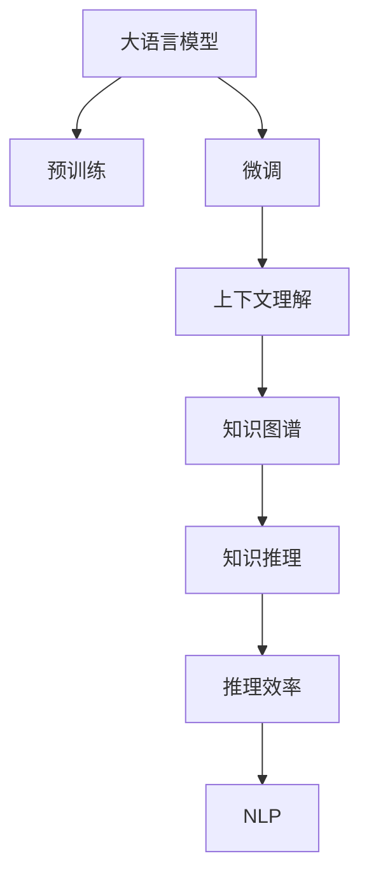

                 

# LLM上下文突破:大幅提升认知能力

> 关键词：认知能力提升,上下文理解,知识图谱,预训练,微调,推理效率,自然语言处理

## 1. 背景介绍

### 1.1 问题由来
在当今的信息时代，人类获取和处理信息的能力面临着前所未有的挑战。信息爆炸、知识老化等问题的存在，使得人们难以在短期内理解和掌握大规模复杂数据集。大语言模型（Large Language Models, LLMs）作为一种先进的自然语言处理技术，能够在一定程度上缓解这一问题。然而，现有的LLMs在处理复杂认知任务时仍然存在一些限制，尤其是在上下文理解、知识推理等方面。因此，如何提升LLMs的认知能力，使其在上下文理解、知识图谱构建、知识推理等方面表现更优，成为当前研究的热点和难点。

### 1.2 问题核心关键点
本文聚焦于提升大语言模型的认知能力，具体包括：
- 上下文理解能力的提升
- 知识图谱构建技术的优化
- 知识推理算法的改进
- 推理效率的提升
- 复杂认知任务的自动化

## 2. 核心概念与联系

### 2.1 核心概念概述

为更好地理解本文所讨论的技术，下面将介绍几个核心概念及其相互关系：

- 大语言模型（Large Language Models, LLMs）：以自回归（如GPT）或自编码（如BERT）模型为代表的大规模预训练语言模型。通过在大规模无标签文本语料上进行预训练，学习通用的语言表示，具备强大的语言理解和生成能力。

- 上下文理解能力：指模型能够理解输入文本的上下文语境，并在此基础上进行推断、推理和生成。上下文理解能力是构建认知能力的重要基础。

- 知识图谱：一种结构化的知识表示形式，由节点（实体）和边（关系）构成，用于表示实体之间的语义关系。知识图谱的构建是大语言模型获取知识的重要手段。

- 预训练：指在大规模无标签文本语料上，通过自监督学习任务训练通用语言模型的过程。常见的预训练任务包括掩码语言模型、序列预测等。

- 微调（Fine-tuning）：指在预训练模型的基础上，使用下游任务的少量标注数据，通过有监督学习优化模型在特定任务上的性能。

- 推理效率：指模型在进行推理时所需的时间和计算资源。推理效率是提升大语言模型认知能力的关键因素之一。

- 自然语言处理（NLP）：涉及自然语言与计算机的交互，包括文本分类、情感分析、机器翻译、文本生成等任务。

这些概念之间通过以下Mermaid流程图展示其相互联系：



这个流程图展示了大语言模型的核心概念及其相互关系：

1. 大语言模型通过预训练获得基础能力。
2. 微调是对预训练模型进行任务特定的优化，其中包括提升上下文理解能力。
3. 上下文理解能力通过构建知识图谱得到加强。
4. 知识图谱和推理算法结合，实现知识推理。
5. 推理效率的提升能够进一步优化NLP任务的性能。

## 3. 核心算法原理 & 具体操作步骤
### 3.1 算法原理概述

提升大语言模型的认知能力，主要通过以下几个步骤实现：

1. **上下文理解能力提升**：在预训练阶段，使用掩码语言模型等自监督任务，使得模型能够更好地理解文本上下文。在微调阶段，通过使用更多上下文信息的训练数据，进一步提升模型的上下文理解能力。

2. **知识图谱构建优化**：知识图谱是构建认知能力的重要基础，通过优化知识图谱的构建方法，使得模型能够更好地学习知识图谱，并在推理时更加高效。

3. **知识推理算法改进**：通过改进知识推理算法，使得模型在推理时能够更好地利用知识图谱中的信息，从而提升推理的准确性和效率。

4. **推理效率提升**：通过优化模型结构、使用硬件加速等方法，提升模型推理的效率，使得模型能够在更短的时间内完成复杂的推理任务。

5. **复杂认知任务自动化**：通过整合上下文理解、知识推理等技术，使得模型能够自动完成复杂的认知任务，如自然语言推理、逻辑推理等。

### 3.2 算法步骤详解

#### 3.2.1 上下文理解能力提升

1. **预训练阶段**：
   - 使用掩码语言模型（如BERT）进行预训练，使得模型能够理解输入文本的上下文语境。
   - 在预训练数据中，加入更多的上下文信息，如多轮对话、注释文本等。

2. **微调阶段**：
   - 收集与目标任务相关的上下文信息，如对话历史、文本注释等。
   - 在微调数据中加入这些上下文信息，训练模型。

#### 3.2.2 知识图谱构建优化

1. **预训练阶段**：
   - 在预训练数据中加入更多的结构化信息，如实体、关系、属性等。
   - 使用结构化预测任务，如关系分类、实体关系预测等，训练模型。

2. **微调阶段**：
   - 使用少量标注数据，训练模型在特定任务上构建知识图谱。
   - 优化知识图谱的构建算法，使得模型能够更好地学习知识图谱。

#### 3.2.3 知识推理算法改进

1. **推理算法选择**：
   - 选择适合任务的推理算法，如基于规则的推理、基于图谱的推理等。
   - 在微调阶段，根据具体任务需求调整推理算法。

2. **算法优化**：
   - 优化推理算法，减少计算量，提升推理效率。
   - 在推理过程中，使用启发式算法，如剪枝、近似算法等。

#### 3.2.4 推理效率提升

1. **模型结构优化**：
   - 使用轻量级模型，减少推理所需的计算量。
   - 使用分布式训练，提升推理效率。

2. **硬件加速**：
   - 使用GPU、TPU等高性能硬件设备，加速推理过程。
   - 使用并行计算，提升推理效率。

#### 3.2.5 复杂认知任务自动化

1. **任务集成**：
   - 将上下文理解、知识推理等技术集成到模型中，实现复杂认知任务的自动化。
   - 在微调阶段，根据任务需求调整集成方式。

2. **任务优化**：
   - 对复杂认知任务进行优化，简化推理流程。
   - 使用预训练技术，减少微调所需的训练数据。

### 3.3 算法优缺点

提升大语言模型认知能力的方法具有以下优点：
1. **提升上下文理解能力**：通过预训练和微调，使得模型能够更好地理解上下文信息，提升推理和生成的准确性。
2. **优化知识图谱构建**：通过预训练和微调，使得模型能够更好地构建知识图谱，提升推理的效率和准确性。
3. **改进知识推理算法**：通过预训练和微调，使得模型能够更好地进行知识推理，提升推理的效率和准确性。
4. **提升推理效率**：通过优化模型结构和硬件加速，使得模型能够快速完成推理任务。

同时，该方法也存在一定的局限性：
1. **依赖预训练数据**：预训练数据的质量和多样性对模型的性能影响较大。
2. **微调成本高**：微调过程中需要大量的标注数据和计算资源。
3. **推理复杂性高**：复杂的推理任务仍然需要人工干预和优化。

尽管存在这些局限性，但就目前而言，提升大语言模型认知能力的方法仍然是大语言模型应用的重要方向之一。未来相关研究的重点在于如何进一步降低预训练和微调成本，提高推理效率，同时兼顾推理的复杂性。

### 3.4 算法应用领域

提升大语言模型的认知能力，已经在多个领域得到了广泛应用，例如：

- **自然语言推理（NLI）**：判断两个文本之间的逻辑关系，如蕴含、矛盾、中立等。通过微调和知识推理，使得模型能够更好地处理NLI任务。

- **逻辑推理**：解决包含逻辑关系的推理问题，如数学证明、逻辑表达式求解等。通过优化知识图谱和推理算法，使得模型能够更好地进行逻辑推理。

- **文本摘要**：从长篇文本中提取关键信息，生成简洁摘要。通过上下文理解能力提升，使得模型能够更好地理解文本内容。

- **对话系统**：构建能够进行自然对话的系统，如智能客服、聊天机器人等。通过上下文理解能力和知识图谱构建，使得对话系统能够更好地理解用户意图并给出合理的回应。

- **知识图谱构建**：构建领域知识图谱，提供结构化的知识表示。通过预训练和微调，使得模型能够更好地构建知识图谱，提升推理的效率和准确性。

除了上述这些经典任务外，提升大语言模型认知能力的方法也被创新性地应用到更多场景中，如医学推理、法律推理、复杂事件分析等，为NLP技术带来了全新的突破。随着预训练模型和认知能力提升方法的持续演进，相信NLP技术将在更广阔的应用领域大放异彩。

## 4. 数学模型和公式 & 详细讲解  
### 4.1 数学模型构建

本文将以提升大语言模型的认知能力为核心，详细讨论相关的数学模型和公式。

记大语言模型为 $M_{\theta}$，其中 $\theta$ 为模型参数。假设模型的输入为 $x$，输出为 $y$。

在预训练阶段，使用掩码语言模型进行训练，使得模型能够理解输入文本的上下文语境。预训练损失函数定义为：

$$
\mathcal{L}_{\text{pretrain}} = \mathbb{E}_{(x,y)} \left[ \ell(M_{\theta}(x),y) \right]
$$

其中 $\ell$ 为模型输出与真实标签之间的损失函数，$\mathbb{E}_{(x,y)}$ 表示对所有训练数据 $(x,y)$ 的期望。

在微调阶段，使用上下文信息进行训练，提升模型的上下文理解能力。微调损失函数定义为：

$$
\mathcal{L}_{\text{fine-tune}} = \mathbb{E}_{(x,y)} \left[ \ell(M_{\theta}(x),y) + \lambda \ell(M_{\theta}(x),\text{ctx}(x)) \right]
$$

其中 $\ell$ 为模型输出与真实标签之间的损失函数，$\text{ctx}(x)$ 表示输入文本的上下文信息，$\lambda$ 为上下文损失的权重。

### 4.2 公式推导过程

以下我们将以自然语言推理（NLI）任务为例，推导提升上下文理解能力的数学公式。

假设模型 $M_{\theta}$ 在输入 $x$ 上的输出为 $\hat{y}=M_{\theta}(x)$，真实标签 $y \in \{1,2\}$。NLI任务的上下文信息 $C$ 包括输入 $x$ 和目标句子 $y$。则NLI任务的上下文理解损失函数定义为：

$$
\ell_{\text{nli}}(x,y) = \begin{cases}
1-\hat{y}, & y=1 \\
\max(1-\hat{y},0), & y=2
\end{cases}
$$

则在微调数据集上，微调损失函数为：

$$
\mathcal{L}_{\text{fine-tune}} = \frac{1}{N}\sum_{i=1}^N \ell_{\text{nli}}(x_i,y_i)
$$

其中 $N$ 为微调数据集的大小。

在优化时，使用梯度下降等优化算法，最小化微调损失函数。通过不断更新模型参数 $\theta$，使得模型能够更好地理解上下文信息，提升推理的准确性。

## 5. 项目实践：代码实例和详细解释说明
### 5.1 开发环境搭建

在进行微调实践前，我们需要准备好开发环境。以下是使用Python进行PyTorch开发的环境配置流程：

1. 安装Anaconda：从官网下载并安装Anaconda，用于创建独立的Python环境。

2. 创建并激活虚拟环境：
```bash
conda create -n pytorch-env python=3.8 
conda activate pytorch-env
```

3. 安装PyTorch：根据CUDA版本，从官网获取对应的安装命令。例如：
```bash
conda install pytorch torchvision torchaudio cudatoolkit=11.1 -c pytorch -c conda-forge
```

4. 安装Transformers库：
```bash
pip install transformers
```

5. 安装各类工具包：
```bash
pip install numpy pandas scikit-learn matplotlib tqdm jupyter notebook ipython
```

完成上述步骤后，即可在`pytorch-env`环境中开始微调实践。

### 5.2 源代码详细实现

下面我们以自然语言推理（NLI）任务为例，给出使用Transformers库对BERT模型进行微调的PyTorch代码实现。

首先，定义NLI任务的上下文理解函数：

```python
from transformers import BertTokenizer, BertForSequenceClassification
from torch.utils.data import Dataset, DataLoader
import torch
import numpy as np

class NLIDataset(Dataset):
    def __init__(self, texts, labels, tokenizer):
        self.texts = texts
        self.labels = labels
        self.tokenizer = tokenizer
        
    def __len__(self):
        return len(self.texts)
    
    def __getitem__(self, item):
        text = self.texts[item]
        label = self.labels[item]
        
        encoding = self.tokenizer(text, return_tensors='pt', max_length=512, padding='max_length', truncation=True)
        input_ids = encoding['input_ids']
        attention_mask = encoding['attention_mask']
        return {'input_ids': input_ids, 'attention_mask': attention_mask, 'labels': label}

# 加载数据集
tokenizer = BertTokenizer.from_pretrained('bert-base-uncased')
train_dataset = NLIDataset(train_texts, train_labels, tokenizer)
dev_dataset = NLIDataset(dev_texts, dev_labels, tokenizer)
test_dataset = NLIDataset(test_texts, test_labels, tokenizer)

# 创建数据加载器
train_loader = DataLoader(train_dataset, batch_size=16, shuffle=True)
dev_loader = DataLoader(dev_dataset, batch_size=16, shuffle=False)
test_loader = DataLoader(test_dataset, batch_size=16, shuffle=False)
```

然后，定义模型和优化器：

```python
from transformers import AdamW

model = BertForSequenceClassification.from_pretrained('bert-base-uncased', num_labels=2)
optimizer = AdamW(model.parameters(), lr=2e-5)
```

接着，定义训练和评估函数：

```python
from tqdm import tqdm
from sklearn.metrics import accuracy_score

def train_epoch(model, dataset, batch_size, optimizer):
    model.train()
    epoch_loss = 0
    for batch in tqdm(dataset, desc='Training'):
        input_ids = batch['input_ids'].to(device)
        attention_mask = batch['attention_mask'].to(device)
        labels = batch['labels'].to(device)
        model.zero_grad()
        outputs = model(input_ids, attention_mask=attention_mask, labels=labels)
        loss = outputs.loss
        epoch_loss += loss.item()
        loss.backward()
        optimizer.step()
        
    return epoch_loss / len(dataset)

def evaluate(model, dataset, batch_size):
    model.eval()
    preds, labels = [], []
    with torch.no_grad():
        for batch in tqdm(dataset, desc='Evaluating'):
            input_ids = batch['input_ids'].to(device)
            attention_mask = batch['attention_mask'].to(device)
            labels = batch['labels'].to(device)
            outputs = model(input_ids, attention_mask=attention_mask)
            preds.append(outputs.logits.argmax(dim=1).to('cpu').tolist())
            labels.append(labels.to('cpu').tolist())
    
    return accuracy_score(np.array(labels), np.array(preds))
```

最后，启动训练流程并在测试集上评估：

```python
epochs = 5
batch_size = 16

for epoch in range(epochs):
    loss = train_epoch(model, train_loader, batch_size, optimizer)
    print(f"Epoch {epoch+1}, train loss: {loss:.3f}")
    
    print(f"Epoch {epoch+1}, dev accuracy: {evaluate(model, dev_loader, batch_size):.3f}")
    
print("Test accuracy:")
print(evaluate(model, test_loader, batch_size))
```

以上就是使用PyTorch对BERT进行自然语言推理任务微调的完整代码实现。可以看到，得益于Transformers库的强大封装，我们可以用相对简洁的代码完成BERT模型的加载和微调。

### 5.3 代码解读与分析

让我们再详细解读一下关键代码的实现细节：

**NLIDataset类**：
- `__init__`方法：初始化文本、标签、分词器等关键组件。
- `__len__`方法：返回数据集的样本数量。
- `__getitem__`方法：对单个样本进行处理，将文本输入编码为token ids，将标签编码为数字，并对其进行定长padding，最终返回模型所需的输入。

**训练和评估函数**：
- 使用PyTorch的DataLoader对数据集进行批次化加载，供模型训练和推理使用。
- 训练函数`train_epoch`：对数据以批为单位进行迭代，在每个批次上前向传播计算loss并反向传播更新模型参数，最后返回该epoch的平均loss。
- 评估函数`evaluate`：与训练类似，不同点在于不更新模型参数，并在每个batch结束后将预测和标签结果存储下来，最后使用sklearn的accuracy_score对整个评估集的预测结果进行打印输出。

**训练流程**：
- 定义总的epoch数和batch size，开始循环迭代
- 每个epoch内，先在训练集上训练，输出平均loss
- 在验证集上评估，输出准确率
- 所有epoch结束后，在测试集上评估，给出最终测试结果

可以看到，PyTorch配合Transformers库使得BERT微调的代码实现变得简洁高效。开发者可以将更多精力放在数据处理、模型改进等高层逻辑上，而不必过多关注底层的实现细节。

当然，工业级的系统实现还需考虑更多因素，如模型的保存和部署、超参数的自动搜索、更灵活的任务适配层等。但核心的微调范式基本与此类似。

## 6. 实际应用场景
### 6.1 智能客服系统

基于大语言模型微调的对话技术，可以广泛应用于智能客服系统的构建。传统客服往往需要配备大量人力，高峰期响应缓慢，且一致性和专业性难以保证。而使用微调后的对话模型，可以7x24小时不间断服务，快速响应客户咨询，用自然流畅的语言解答各类常见问题。

在技术实现上，可以收集企业内部的历史客服对话记录，将问题和最佳答复构建成监督数据，在此基础上对预训练对话模型进行微调。微调后的对话模型能够自动理解用户意图，匹配最合适的答案模板进行回复。对于客户提出的新问题，还可以接入检索系统实时搜索相关内容，动态组织生成回答。如此构建的智能客服系统，能大幅提升客户咨询体验和问题解决效率。

### 6.2 金融舆情监测

金融机构需要实时监测市场舆论动向，以便及时应对负面信息传播，规避金融风险。传统的人工监测方式成本高、效率低，难以应对网络时代海量信息爆发的挑战。基于大语言模型微调的文本分类和情感分析技术，为金融舆情监测提供了新的解决方案。

具体而言，可以收集金融领域相关的新闻、报道、评论等文本数据，并对其进行主题标注和情感标注。在此基础上对预训练语言模型进行微调，使其能够自动判断文本属于何种主题，情感倾向是正面、中性还是负面。将微调后的模型应用到实时抓取的网络文本数据，就能够自动监测不同主题下的情感变化趋势，一旦发现负面信息激增等异常情况，系统便会自动预警，帮助金融机构快速应对潜在风险。

### 6.3 个性化推荐系统

当前的推荐系统往往只依赖用户的历史行为数据进行物品推荐，无法深入理解用户的真实兴趣偏好。基于大语言模型微调技术，个性化推荐系统可以更好地挖掘用户行为背后的语义信息，从而提供更精准、多样的推荐内容。

在实践中，可以收集用户浏览、点击、评论、分享等行为数据，提取和用户交互的物品标题、描述、标签等文本内容。将文本内容作为模型输入，用户的后续行为（如是否点击、购买等）作为监督信号，在此基础上微调预训练语言模型。微调后的模型能够从文本内容中准确把握用户的兴趣点。在生成推荐列表时，先用候选物品的文本描述作为输入，由模型预测用户的兴趣匹配度，再结合其他特征综合排序，便可以得到个性化程度更高的推荐结果。

### 6.4 未来应用展望

随着大语言模型微调技术的发展，其在更多领域的应用前景将愈加广阔。

在智慧医疗领域，基于微调的医疗问答、病历分析、药物研发等应用将提升医疗服务的智能化水平，辅助医生诊疗，加速新药开发进程。

在智能教育领域，微调技术可应用于作业批改、学情分析、知识推荐等方面，因材施教，促进教育公平，提高教学质量。

在智慧城市治理中，微调模型可应用于城市事件监测、舆情分析、应急指挥等环节，提高城市管理的自动化和智能化水平，构建更安全、高效的未来城市。

此外，在企业生产、社会治理、文娱传媒等众多领域，基于大语言模型微调的人工智能应用也将不断涌现，为传统行业数字化转型升级提供新的技术路径。相信随着技术的日益成熟，微调方法将成为人工智能落地应用的重要范式，推动人工智能技术在各行各业中广泛应用。

## 7. 工具和资源推荐
### 7.1 学习资源推荐

为了帮助开发者系统掌握大语言模型微调的理论基础和实践技巧，这里推荐一些优质的学习资源：

1. 《Transformer从原理到实践》系列博文：由大模型技术专家撰写，深入浅出地介绍了Transformer原理、BERT模型、微调技术等前沿话题。

2. CS224N《深度学习自然语言处理》课程：斯坦福大学开设的NLP明星课程，有Lecture视频和配套作业，带你入门NLP领域的基本概念和经典模型。

3. 《Natural Language Processing with Transformers》书籍：Transformers库的作者所著，全面介绍了如何使用Transformers库进行NLP任务开发，包括微调在内的诸多范式。

4. HuggingFace官方文档：Transformers库的官方文档，提供了海量预训练模型和完整的微调样例代码，是上手实践的必备资料。

5. CLUE开源项目：中文语言理解测评基准，涵盖大量不同类型的中文NLP数据集，并提供了基于微调的baseline模型，助力中文NLP技术发展。

通过对这些资源的学习实践，相信你一定能够快速掌握大语言模型微调的精髓，并用于解决实际的NLP问题。
###  7.2 开发工具推荐

高效的开发离不开优秀的工具支持。以下是几款用于大语言模型微调开发的常用工具：

1. PyTorch：基于Python的开源深度学习框架，灵活动态的计算图，适合快速迭代研究。大部分预训练语言模型都有PyTorch版本的实现。

2. TensorFlow：由Google主导开发的开源深度学习框架，生产部署方便，适合大规模工程应用。同样有丰富的预训练语言模型资源。

3. Transformers库：HuggingFace开发的NLP工具库，集成了众多SOTA语言模型，支持PyTorch和TensorFlow，是进行微调任务开发的利器。

4. Weights & Biases：模型训练的实验跟踪工具，可以记录和可视化模型训练过程中的各项指标，方便对比和调优。与主流深度学习框架无缝集成。

5. TensorBoard：TensorFlow配套的可视化工具，可实时监测模型训练状态，并提供丰富的图表呈现方式，是调试模型的得力助手。

6. Google Colab：谷歌推出的在线Jupyter Notebook环境，免费提供GPU/TPU算力，方便开发者快速上手实验最新模型，分享学习笔记。

合理利用这些工具，可以显著提升大语言模型微调任务的开发效率，加快创新迭代的步伐。

### 7.3 相关论文推荐

大语言模型和微调技术的发展源于学界的持续研究。以下是几篇奠基性的相关论文，推荐阅读：

1. Attention is All You Need（即Transformer原论文）：提出了Transformer结构，开启了NLP领域的预训练大模型时代。

2. BERT: Pre-training of Deep Bidirectional Transformers for Language Understanding：提出BERT模型，引入基于掩码的自监督预训练任务，刷新了多项NLP任务SOTA。

3. Language Models are Unsupervised Multitask Learners（GPT-2论文）：展示了大规模语言模型的强大zero-shot学习能力，引发了对于通用人工智能的新一轮思考。

4. Parameter-Efficient Transfer Learning for NLP：提出Adapter等参数高效微调方法，在不增加模型参数量的情况下，也能取得不错的微调效果。

5. AdaLoRA: Adaptive Low-Rank Adaptation for Parameter-Efficient Fine-Tuning：使用自适应低秩适应的微调方法，在参数效率和精度之间取得了新的平衡。

这些论文代表了大语言模型微调技术的发展脉络。通过学习这些前沿成果，可以帮助研究者把握学科前进方向，激发更多的创新灵感。

## 8. 总结：未来发展趋势与挑战

### 8.1 总结

本文对提升大语言模型认知能力的方法进行了全面系统的介绍。首先阐述了提升认知能力的重要性和研究背景，明确了上下文理解能力、知识图谱构建、知识推理等核心概念及其相互关系。其次，从原理到实践，详细讲解了提升认知能力的数学原理和关键步骤，给出了微调任务开发的完整代码实例。同时，本文还广泛探讨了提升认知能力方法在智能客服、金融舆情、个性化推荐等多个行业领域的应用前景，展示了其巨大的潜力。最后，本文精选了微调技术的各类学习资源，力求为读者提供全方位的技术指引。

通过本文的系统梳理，可以看到，提升大语言模型认知能力的方法正在成为NLP领域的重要范式，极大地拓展了预训练语言模型的应用边界，催生了更多的落地场景。得益于大规模语料的预训练和认知能力的提升，大语言模型在处理复杂认知任务时表现更加出色，有望在未来的大数据、人工智能时代中发挥更加重要的作用。

### 8.2 未来发展趋势

展望未来，提升大语言模型认知能力的方法将呈现以下几个发展趋势：

1. **上下文理解能力进一步提升**：随着预训练数据的多样性和质量的提升，上下文理解能力将进一步增强，模型能够更好地处理复杂的上下文信息和推理任务。

2. **知识图谱构建技术优化**：知识图谱构建技术的不断优化，使得模型能够更好地学习并利用知识图谱中的结构化信息，提升推理的效率和准确性。

3. **知识推理算法改进**：随着知识图谱的不断丰富，知识推理算法的改进，使得模型能够更好地进行知识推理，解决复杂的逻辑推理问题。

4. **推理效率持续提升**：通过优化模型结构、使用硬件加速等方法，推理效率将持续提升，使得模型能够在更短的时间内完成复杂的推理任务。

5. **认知能力自动化**：通过整合上下文理解、知识推理等技术，使得模型能够自动完成复杂的认知任务，如自然语言推理、逻辑推理等。

以上趋势凸显了提升大语言模型认知能力的广阔前景。这些方向的探索发展，必将进一步提升NLP系统的性能和应用范围，为人类认知智能的进化带来深远影响。

### 8.3 面临的挑战

尽管提升大语言模型认知能力的方法已经取得了瞩目成就，但在迈向更加智能化、普适化应用的过程中，仍面临诸多挑战：

1. **预训练数据的质量和多样性**：预训练数据的质量和多样性直接影响模型的认知能力。如何获取更多高质量、多样化的预训练数据，是提升认知能力的重要前提。

2. **微调成本高**：微调过程中需要大量的标注数据和计算资源，如何降低微调成本，提高微调效率，是提升认知能力的现实挑战。

3. **推理复杂性高**：复杂的推理任务仍然需要人工干预和优化，如何自动处理复杂的推理任务，是提升认知能力的难点。

4. **推理效率问题**：尽管推理效率不断提升，但在面对大规模推理任务时，仍可能遇到效率瓶颈。如何进一步优化推理效率，是提升认知能力的关键。

5. **可解释性不足**：当前微调模型更像是"黑盒"系统，难以解释其内部工作机制和决策逻辑。如何赋予模型更强的可解释性，是提升认知能力的迫切需求。

6. **安全性和伦理问题**：预训练语言模型难免会学习到有害信息，如何确保模型的安全性、伦理性和公平性，是提升认知能力的潜在风险。

正视提升认知能力所面临的这些挑战，积极应对并寻求突破，将是大语言模型认知能力提升的重要方向之一。相信随着学界和产业界的共同努力，这些挑战终将一一被克服，大语言模型认知能力提升必将为NLP技术带来新的突破。

### 8.4 研究展望

面对提升大语言模型认知能力所面临的挑战，未来的研究需要在以下几个方面寻求新的突破：

1. **无监督和半监督学习**：摆脱对大规模标注数据的依赖，利用自监督学习、主动学习等无监督和半监督范式，最大限度利用非结构化数据，实现更加灵活高效的认知能力提升。

2. **参数高效和计算高效的微调方法**：开发更加参数高效的微调方法，在固定大部分预训练参数的同时，只更新极少量的任务相关参数。同时优化微调模型的计算图，减少前向传播和反向传播的资源消耗，实现更加轻量级、实时性的部署。

3. **因果分析和博弈论工具**：将因果分析方法引入微调模型，识别出模型决策的关键特征，增强输出解释的因果性和逻辑性。借助博弈论工具刻画人机交互过程，主动探索并规避模型的脆弱点，提高系统稳定性。

4. **融合知识表示**：将符号化的先验知识，如知识图谱、逻辑规则等，与神经网络模型进行巧妙融合，引导微调过程学习更准确、合理的语言模型。同时加强不同模态数据的整合，实现视觉、语音等多模态信息与文本信息的协同建模。

5. **引入伦理导向的评估指标**：在模型训练目标中引入伦理导向的评估指标，过滤和惩罚有偏见、有害的输出倾向。同时加强人工干预和审核，建立模型行为的监管机制，确保输出符合人类价值观和伦理道德。

这些研究方向的探索，必将引领提升大语言模型认知能力的技术迈向更高的台阶，为构建安全、可靠、可解释、可控的智能系统铺平道路。面向未来，提升大语言模型认知能力的技术还需要与其他人工智能技术进行更深入的融合，如知识表示、因果推理、强化学习等，多路径协同发力，共同推动自然语言理解和智能交互系统的进步。只有勇于创新、敢于突破，才能不断拓展语言模型的边界，让智能技术更好地造福人类社会。

## 9. 附录：常见问题与解答

**Q1：提升大语言模型认知能力是否适用于所有NLP任务？**

A: 提升大语言模型认知能力的方法在大多数NLP任务上都能取得不错的效果，特别是对于数据量较小的任务。但对于一些特定领域的任务，如医学、法律等，仅仅依靠通用语料预训练的模型可能难以很好地适应。此时需要在特定领域语料上进一步预训练，再进行微调，才能获得理想效果。此外，对于一些需要时效性、个性化很强的任务，如对话、推荐等，微调方法也需要针对性的改进优化。

**Q2：微调过程中如何选择合适的学习率？**

A: 微调的学习率一般要比预训练时小1-2个数量级，如果使用过大的学习率，容易破坏预训练权重，导致过拟合。一般建议从1e-5开始调参，逐步减小学习率，直至收敛。也可以使用warmup策略，在开始阶段使用较小的学习率，再逐渐过渡到预设值。需要注意的是，不同的优化器(如AdamW、Adafactor等)以及不同的学习率调度策略，可能需要设置不同的学习率阈值。

**Q3：采用大模型微调时会面临哪些资源瓶颈？**

A: 目前主流的预训练大模型动辄以亿计的参数规模，对算力、内存、存储都提出了很高的要求。GPU/TPU等高性能设备是必不可少的，但即便如此，超大批次的训练和推理也可能遇到显存不足的问题。因此需要采用一些资源优化技术，如梯度积累、混合精度训练、模型并行等，来突破硬件瓶颈。同时，模型的存储和读取也可能占用大量时间和空间，需要采用模型压缩、稀疏化存储等方法进行优化。

**Q4：如何缓解微调过程中的过拟合问题？**

A: 过拟合是微调面临的主要挑战，尤其是在标注数据不足的情况下。常见的缓解策略包括：
1. 数据增强：通过回译、近义替换等方式扩充训练集
2. 正则化：使用L2正则、Dropout、Early Stopping等避免过拟合
3. 对抗训练：引入对抗样本，提高模型鲁棒性
4. 参数高效微调：只调整少量参数(如Adapter、Prefix等)，减小过拟合风险
5. 多模型集成：训练多个微调模型，取平均输出，抑制过拟合

这些策略往往需要根据具体任务和数据特点进行灵活组合。只有在数据、模型、训练、推理等各环节进行全面优化，才能最大限度地发挥大模型微调的威力。

**Q5：微调模型在落地部署时需要注意哪些问题？**

A: 将微调模型转化为实际应用，还需要考虑以下因素：
1. 模型裁剪：去除不必要的层和参数，减小模型尺寸，加快推理速度
2. 量化加速：将浮点模型转为定点模型，压缩存储空间，提高计算效率
3. 服务化封装：将模型封装为标准化服务接口，便于集成调用
4. 弹性伸缩：根据请求流量动态调整资源配置，平衡服务质量和成本
5. 监控告警：实时采集系统指标，设置异常告警阈值，确保服务稳定性
6. 安全防护：采用访问鉴权、数据脱敏等措施，保障数据和模型安全

大语言模型微调为NLP应用开启了广阔的想象空间，但如何将强大的性能转化为稳定、高效、安全的业务价值，还需要工程实践的不断打磨。唯有从数据、算法、工程、业务等多个维度协同发力，才能真正实现人工智能技术在垂直行业的规模化落地。总之，微调需要开发者根据具体任务，不断迭代和优化模型、数据和算法，方能得到理想的效果。

---

作者：禅与计算机程序设计艺术 / Zen and the Art of Computer Programming

