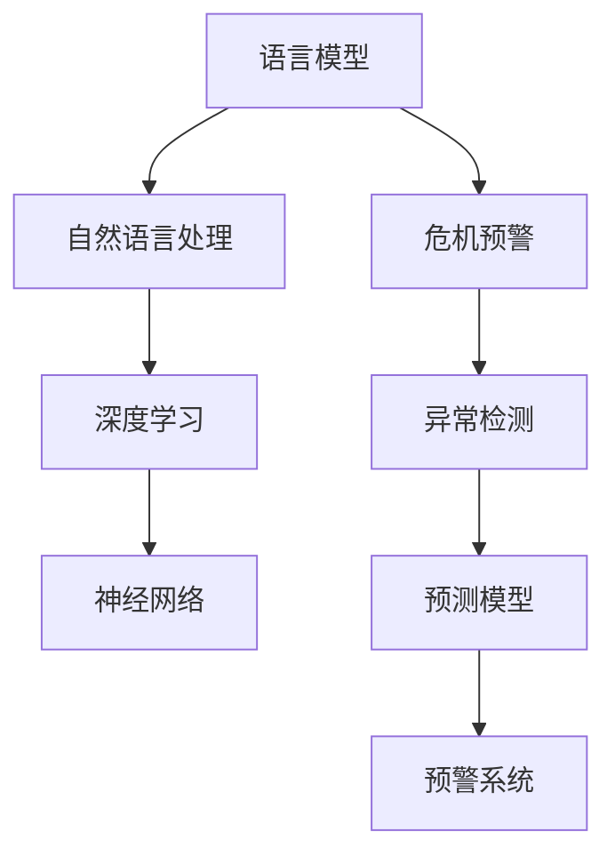

                 

# LLM与危机预警：提前识别潜在风险

> 关键词：语言模型(Language Modeling), 危机预警(Crisis Prediction), 自然语言处理(Natural Language Processing), 深度学习(Deep Learning), 神经网络(Neural Networks), 异常检测(Anomaly Detection)

## 1. 背景介绍

### 1.1 问题由来
在当今高速发展的数字化时代，企业和组织面临的信息环境日趋复杂。危机事件的不确定性和突发性，给社会稳定和企业运营带来了巨大的挑战。如何及时发现并应对危机事件，成为各级决策者必须面对的重要问题。

传统的危机预警方法多依赖于结构化数据和专家经验，难以应对海量的非结构化文本数据。而自然语言处理(NLP)技术的兴起，为解决这一问题提供了新的可能。基于大规模语言模型(Large Language Models, LLMs)的危机预警系统，利用深度学习和NLP技术，从文本数据中挖掘出潜在的危机信号，提前识别和预警。

### 1.2 问题核心关键点
基于LLM的危机预警系统，核心在于利用预训练的语言模型，对大规模非结构化文本数据进行建模，通过多维度的文本特征提取和融合，预测出可能发生的危机事件。其核心步骤包括：

- 收集和预处理文本数据
- 使用预训练的LLM对文本进行编码
- 训练预测模型，识别危机信号
- 实时监控和预警

这种系统能够实时处理大量文本数据，及时发现潜在的危机事件，为决策者提供宝贵的预警信息。

### 1.3 问题研究意义
利用基于LLM的危机预警系统，可以有效降低危机事件的发生概率，保护公众和企业利益，维护社会稳定。其意义在于：

- 提升危机响应速度：能够实时监控大量文本，快速发现异常，提供预警信息。
- 降低决策风险：通过科学的数据分析和模型预测，降低决策过程中的人为误差。
- 优化资源配置：根据预警结果，合理调配资源，预防和减少损失。
- 增强社会信任：透明的预警流程和可靠的预测结果，提升公众和市场对决策者的信任。

## 2. 核心概念与联系

### 2.1 核心概念概述

为更好地理解基于LLM的危机预警方法，本节将介绍几个密切相关的核心概念：

- 语言模型(Language Modeling)：通过对文本数据进行统计建模，学习文本的分布和规律，预测新文本出现的概率。常见的语言模型包括n-gram模型、RNN、Transformer等。

- 危机预警(Crisis Prediction)：利用预测模型对可能的危机事件进行早期识别和预警，以降低其发生概率和影响。

- 自然语言处理(Natural Language Processing)：涉及文本数据的处理、分析、理解和生成，是实现危机预警的重要技术手段。

- 深度学习(Deep Learning)：利用多层神经网络进行复杂非线性建模，广泛应用于图像、语音、文本等数据处理任务。

- 神经网络(Neural Networks)：由多个神经元层组成的计算模型，通过反向传播算法进行参数优化，广泛用于各类预测和分类任务。

- 异常检测(Anomaly Detection)：识别异常数据点的技术，常用于网络安全、金融风险等领域。

这些核心概念之间的逻辑关系可以通过以下Mermaid流程图来展示：



这个流程图展示了大语言模型在危机预警中的关键概念及其之间的关系：

1. 语言模型通过统计文本数据，建立文本分布模型。
2. 自然语言处理对文本数据进行预处理和特征提取。
3. 深度学习利用神经网络进行复杂特征融合和模式识别。
4. 异常检测识别文本中的异常模式，预测危机事件。
5. 危机预警系统根据异常检测结果，提前发出预警信息。

这些概念共同构成了基于LLM的危机预警系统，通过多层次技术融合，实现对危机事件的准确识别和预警。

## 3. 核心算法原理 & 具体操作步骤
### 3.1 算法原理概述

基于LLM的危机预警系统，其核心算法原理是通过深度学习和NLP技术，对大规模文本数据进行建模，提取其中的异常模式，预测潜在危机事件。核心步骤包括：

- 收集和预处理文本数据
- 使用预训练的LLM对文本进行编码
- 训练预测模型，识别危机信号
- 实时监控和预警

形式化地，假设文本数据集为 $D=\{x_1, x_2, ..., x_N\}$，其中 $x_i$ 为文本，$N$ 为文本数量。基于LLM的危机预警算法框架如下：

1. 使用预训练的LLM对文本数据集进行编码，得到表示向量序列 $V=\{v_1, v_2, ..., v_N\}$。
2. 在表示向量序列上训练异常检测模型 $M$，学习识别异常模式。
3. 对实时输入的文本进行编码，得到表示向量 $v_t$。
4. 将 $v_t$ 输入异常检测模型 $M$，输出异常得分 $s_t$。
5. 根据异常得分阈值 $T$，判断是否触发预警。

### 3.2 算法步骤详解

基于LLM的危机预警系统的具体操作步骤如下：

**Step 1: 收集和预处理文本数据**
- 从社交媒体、新闻网站、公共论坛等渠道收集相关文本数据。
- 对文本数据进行清洗，去除停用词、噪声等，进行分词、词性标注等预处理操作。

**Step 2: 使用预训练的LLM对文本进行编码**
- 使用预训练的LLM模型（如BERT、GPT等）对文本数据进行编码，得到表示向量序列。
- 可以使用固定长度的编码方式，或可变长度的编码方式，根据具体应用场景进行选择。

**Step 3: 训练异常检测模型**
- 收集标注的危机事件文本数据，使用预训练的LLM编码后，得到表示向量序列。
- 对表示向量序列进行异常检测，可以使用一阶或二阶统计特征，也可以使用复杂的深度学习模型（如RNN、CNN、Transformer等）进行建模。
- 训练异常检测模型 $M$，通过交叉熵损失函数进行优化。

**Step 4: 实时监控和预警**
- 对实时输入的文本进行编码，得到表示向量 $v_t$。
- 将 $v_t$ 输入训练好的异常检测模型 $M$，输出异常得分 $s_t$。
- 根据预设的阈值 $T$，判断是否触发预警。
- 如果异常得分 $s_t$ 超过阈值 $T$，则发出预警信息。

### 3.3 算法优缺点

基于LLM的危机预警系统具有以下优点：
1. 高效性：能够实时处理大量文本数据，快速识别潜在危机事件。
2. 鲁棒性：LLM经过大规模数据预训练，具有较强的泛化能力和抗干扰能力。
3. 灵活性：可以灵活选择不同的模型和特征提取方式，适应不同的应用场景。

同时，该系统也存在一些局限性：
1. 依赖标注数据：模型的训练和异常检测效果很大程度上取决于标注数据的数量和质量。
2. 数据稀疏性：某些领域（如金融、医学等）的危机事件较为罕见，难以收集足够的数据进行训练。
3. 模型复杂性：复杂的深度学习模型需要较高的计算资源和训练时间。

尽管存在这些局限性，但LLM在危机预警中的应用前景仍然十分广阔，能够为决策者提供实时的危机预警信息，助力社会稳定和企业运营。

### 3.4 算法应用领域

基于LLM的危机预警系统已经在多个领域得到了应用，包括但不限于：

- 金融市场：监测股票价格波动、舆情变化等，提前预警金融危机。
- 公共安全：监控社交媒体、新闻网站等，预测恐怖袭击、自然灾害等事件。
- 医疗健康：监测病患病情变化、医疗资源分布等，预警公共卫生危机。
- 社会治理：监控舆情动态、热点事件，预测社会动荡和矛盾。

除了这些应用领域外，LLM在危机预警中的应用还在不断扩展，为社会治理和企业运营带来了新的思路和工具。

## 4. 数学模型和公式 & 详细讲解 & 举例说明

### 4.1 数学模型构建

本节将使用数学语言对基于LLM的危机预警过程进行更加严格的刻画。

假设预训练的LLM模型为 $M_{\theta}:\mathcal{X} \rightarrow \mathcal{Y}$，其中 $\mathcal{X}$ 为输入空间，$\mathcal{Y}$ 为表示空间，$\theta$ 为模型参数。

定义异常检测模型为 $M_{\phi}:\mathcal{V} \rightarrow \mathbb{R}$，其中 $\mathcal{V}$ 为表示向量空间，$\phi$ 为模型参数。

### 4.2 公式推导过程

以下我们以金融危机预测为例，推导异常检测模型的损失函数及其梯度计算。

假设异常检测模型 $M_{\phi}$ 在表示向量序列 $V$ 上的损失函数为 $\ell(M_{\phi},V)$，其中 $V=\{v_1, v_2, ..., v_N\}$。

在训练阶段，假设标注好的危机事件文本数据集为 $D=\{(x_i,y_i)\}_{i=1}^N, x_i \in \mathcal{X}, y_i \in \{0,1\}$，其中 $0$ 表示正常文本，$1$ 表示危机文本。则异常检测模型的训练目标是最小化经验风险，即：

$$
\mathcal{L}(\phi) = \frac{1}{N}\sum_{i=1}^N \ell(M_{\phi}(v_i),y_i)
$$

其中 $\ell(M_{\phi}(v_i),y_i)$ 为异常检测模型的预测结果 $M_{\phi}(v_i)$ 与真实标签 $y_i$ 之间的交叉熵损失。

在测试阶段，对于实时输入的文本 $x_t$，进行编码得到表示向量 $v_t$，然后计算异常得分 $s_t = M_{\phi}(v_t)$。根据异常得分 $s_t$ 和预设的阈值 $T$，判断是否触发预警。

### 4.3 案例分析与讲解

假设我们已经收集到一定数量的金融危机文本数据 $D=\{(x_i,y_i)\}_{i=1}^N$，其中 $x_i$ 为金融文本，$y_i \in \{0,1\}$。使用预训练的BERT模型对文本进行编码，得到表示向量序列 $V=\{v_1, v_2, ..., v_N\}$。

训练异常检测模型 $M_{\phi}$，可以使用以下步骤：

1. 使用BERT模型对 $D$ 进行编码，得到表示向量序列 $V$。
2. 选择特征提取方式，如MFCC、LDA、HOG 等，对表示向量进行特征提取。
3. 训练异常检测模型 $M_{\phi}$，使用交叉熵损失函数进行优化。

在测试阶段，对于实时输入的金融文本 $x_t$，进行编码得到表示向量 $v_t$，然后计算异常得分 $s_t = M_{\phi}(v_t)$。根据预设的阈值 $T$，判断是否触发预警。

## 5. 项目实践：代码实例和详细解释说明
### 5.1 开发环境搭建

在进行危机预警系统开发前，我们需要准备好开发环境。以下是使用Python进行PyTorch开发的环境配置流程：

1. 安装Anaconda：从官网下载并安装Anaconda，用于创建独立的Python环境。

2. 创建并激活虚拟环境：
```bash
conda create -n pytorch-env python=3.8 
conda activate pytorch-env
```

3. 安装PyTorch：根据CUDA版本，从官网获取对应的安装命令。例如：
```bash
conda install pytorch torchvision torchaudio cudatoolkit=11.1 -c pytorch -c conda-forge
```

4. 安装Transformers库：
```bash
pip install transformers
```

5. 安装各类工具包：
```bash
pip install numpy pandas scikit-learn matplotlib tqdm jupyter notebook ipython
```

完成上述步骤后，即可在`pytorch-env`环境中开始危机预警系统开发。

### 5.2 源代码详细实现

下面我们以金融危机预测为例，给出使用Transformers库进行BERT模型编码和异常检测的PyTorch代码实现。

首先，定义危机预测任务的标注数据集：

```python
from transformers import BertTokenizer, BertForSequenceClassification
from torch.utils.data import Dataset, DataLoader
import torch

class FinanceCrisisDataset(Dataset):
    def __init__(self, texts, labels):
        self.texts = texts
        self.labels = labels
        self.tokenizer = BertTokenizer.from_pretrained('bert-base-cased')

    def __len__(self):
        return len(self.texts)

    def __getitem__(self, item):
        text = self.texts[item]
        label = self.labels[item]
        encoding = self.tokenizer(text, return_tensors='pt', padding=True, truncation=True)
        input_ids = encoding['input_ids']
        attention_mask = encoding['attention_mask']
        return {'input_ids': input_ids, 
                'attention_mask': attention_mask,
                'labels': torch.tensor(label)}

# 标签为1表示危机，0表示正常
train_dataset = FinanceCrisisDataset(train_texts, train_labels)
dev_dataset = FinanceCrisisDataset(dev_texts, dev_labels)
test_dataset = FinanceCrisisDataset(test_texts, test_labels)
```

然后，定义BERT模型和优化器：

```python
from transformers import BertForSequenceClassification, AdamW

model = BertForSequenceClassification.from_pretrained('bert-base-cased', num_labels=2)

optimizer = AdamW(model.parameters(), lr=2e-5)
```

接着，定义训练和评估函数：

```python
from sklearn.metrics import classification_report
from tqdm import tqdm

device = torch.device('cuda') if torch.cuda.is_available() else torch.device('cpu')
model.to(device)

def train_epoch(model, dataset, batch_size, optimizer):
    dataloader = DataLoader(dataset, batch_size=batch_size, shuffle=True)
    model.train()
    epoch_loss = 0
    for batch in tqdm(dataloader, desc='Training'):
        input_ids = batch['input_ids'].to(device)
        attention_mask = batch['attention_mask'].to(device)
        labels = batch['labels'].to(device)
        model.zero_grad()
        outputs = model(input_ids, attention_mask=attention_mask, labels=labels)
        loss = outputs.loss
        epoch_loss += loss.item()
        loss.backward()
        optimizer.step()
    return epoch_loss / len(dataloader)

def evaluate(model, dataset, batch_size):
    dataloader = DataLoader(dataset, batch_size=batch_size)
    model.eval()
    preds, labels = [], []
    with torch.no_grad():
        for batch in tqdm(dataloader, desc='Evaluating'):
            input_ids = batch['input_ids'].to(device)
            attention_mask = batch['attention_mask'].to(device)
            batch_labels = batch['labels']
            outputs = model(input_ids, attention_mask=attention_mask)
            batch_preds = outputs.logits.argmax(dim=1).to('cpu').tolist()
            batch_labels = batch_labels.to('cpu').tolist()
            for pred, label in zip(batch_preds, batch_labels):
                preds.append(pred)
                labels.append(label)
                
    print(classification_report(labels, preds))
```

最后，启动训练流程并在测试集上评估：

```python
epochs = 5
batch_size = 16

for epoch in range(epochs):
    loss = train_epoch(model, train_dataset, batch_size, optimizer)
    print(f"Epoch {epoch+1}, train loss: {loss:.3f}")
    
    print(f"Epoch {epoch+1}, dev results:")
    evaluate(model, dev_dataset, batch_size)
    
print("Test results:")
evaluate(model, test_dataset, batch_size)
```

以上就是使用PyTorch对BERT进行金融危机预测任务微调的完整代码实现。可以看到，得益于Transformers库的强大封装，我们可以用相对简洁的代码完成BERT模型的加载和微调。

### 5.3 代码解读与分析

让我们再详细解读一下关键代码的实现细节：

**FinanceCrisisDataset类**：
- `__init__`方法：初始化文本和标签，以及BERT分词器。
- `__len__`方法：返回数据集的样本数量。
- `__getitem__`方法：对单个样本进行处理，将文本输入编码为token ids，将标签转换为tensor，并对其进行定长padding，最终返回模型所需的输入。

**模型定义**：
- 使用BertForSequenceClassification从预训练模型BERT中加载序列分类模型，并设置输出维度为2（二分类）。
- 优化器AdamW用于模型参数的更新，设置学习率为2e-5。

**训练和评估函数**：
- 使用PyTorch的DataLoader对数据集进行批次化加载，供模型训练和推理使用。
- 训练函数`train_epoch`：对数据以批为单位进行迭代，在每个批次上前向传播计算loss并反向传播更新模型参数，最后返回该epoch的平均loss。
- 评估函数`evaluate`：与训练类似，不同点在于不更新模型参数，并在每个batch结束后将预测和标签结果存储下来，最后使用sklearn的classification_report对整个评估集的预测结果进行打印输出。

**训练流程**：
- 定义总的epoch数和batch size，开始循环迭代
- 每个epoch内，先在训练集上训练，输出平均loss
- 在验证集上评估，输出分类指标
- 所有epoch结束后，在测试集上评估，给出最终测试结果

可以看到，PyTorch配合Transformers库使得BERT微调的代码实现变得简洁高效。开发者可以将更多精力放在数据处理、模型改进等高层逻辑上，而不必过多关注底层的实现细节。

当然，工业级的系统实现还需考虑更多因素，如模型的保存和部署、超参数的自动搜索、更灵活的任务适配层等。但核心的微调范式基本与此类似。

## 6. 实际应用场景
### 6.1 金融市场

基于BERT的危机预警系统，能够实时监控金融市场的新闻、舆情等文本数据，提前预警潜在的金融危机。例如：

- 对财经新闻进行编码，识别负面情感、市场波动等信息，预测市场风险。
- 对社交媒体上的舆情进行分析，识别舆情变化趋势，预警市场动荡。

这些预警信息能够帮助金融决策者及时调整策略，降低投资风险，保护公众利益。

### 6.2 公共安全

在公共安全领域，基于BERT的危机预警系统能够实时监控社交媒体、新闻网站等，预测潜在的恐怖袭击、自然灾害等事件。例如：

- 对恐怖袭击相关的新闻进行编码，识别暴力、恐怖等关键词，预测恐怖事件发生概率。
- 对自然灾害相关的舆情进行分析，识别灾情变化趋势，预警自然灾害。

这些预警信息能够帮助政府和相关部门及时采取措施，降低灾害损失，保障公众安全。

### 6.3 医疗健康

在医疗健康领域，基于BERT的危机预警系统能够实时监控病患病情变化、医疗资源分布等文本数据，预警公共卫生危机。例如：

- 对医疗论坛上的病患讨论进行分析，识别病情变化趋势，预警疫情爆发。
- 对医疗资源的分配情况进行监测，预测资源紧张情况，预警医疗危机。

这些预警信息能够帮助医疗机构及时调配资源，保障病患安全，应对突发疫情。

### 6.4 未来应用展望

随着BERT等大语言模型的不断发展，基于LLM的危机预警系统也将迎来更多应用场景，为社会治理和企业运营提供更强大的支持。

未来，LLM在危机预警中的应用可能进一步拓展到更多领域，如交通、物流、农业等。通过多模态数据的融合，LIM能够更全面地理解危机事件，提供更准确的预警信息。例如：

- 结合视频监控、传感器数据等，构建多模态危机预警系统，提供更全面的预警信息。
- 与气象数据、交通流量数据等结合，预测自然灾害、交通堵塞等事件，提升预警准确度。

此外，LLM在危机预警中的应用还在不断深化，从简单的文本分析到复杂的情感推理、事件预测，能够为社会治理提供更多支持，助力国家治理现代化。

## 7. 工具和资源推荐
### 7.1 学习资源推荐

为了帮助开发者系统掌握大语言模型微调的理论基础和实践技巧，这里推荐一些优质的学习资源：

1. 《深度学习与自然语言处理》系列书籍：深入浅出地介绍了深度学习与NLP的理论和实践，涵盖从基础知识到高级应用的多个层面。

2. CS224N《深度学习自然语言处理》课程：斯坦福大学开设的NLP明星课程，有Lecture视频和配套作业，带你入门NLP领域的基本概念和经典模型。

3. 《自然语言处理入门》课程：Coursera平台提供的入门级课程，涵盖了NLP的基础知识和常用技术。

4. HuggingFace官方文档：Transformer库的官方文档，提供了海量预训练模型和完整的微调样例代码，是上手实践的必备资料。

5. ArXiv论文库：包含大量的NLP和危机预警相关论文，可以帮助你了解前沿研究动态和思路。

通过对这些资源的学习实践，相信你一定能够快速掌握大语言模型微调的精髓，并用于解决实际的NLP问题。
### 7.2 开发工具推荐

高效的开发离不开优秀的工具支持。以下是几款用于危机预警系统开发的常用工具：

1. PyTorch：基于Python的开源深度学习框架，灵活动态的计算图，适合快速迭代研究。BERT等主流预训练模型都有PyTorch版本的实现。

2. TensorFlow：由Google主导开发的开源深度学习框架，生产部署方便，适合大规模工程应用。BERT等预训练模型也有TensorFlow版本的实现。

3. Transformers库：HuggingFace开发的NLP工具库，集成了众多SOTA语言模型，支持PyTorch和TensorFlow，是进行危机预警任务开发的利器。

4. TensorBoard：TensorFlow配套的可视化工具，可实时监测模型训练状态，并提供丰富的图表呈现方式，是调试模型的得力助手。

5. Weights & Biases：模型训练的实验跟踪工具，可以记录和可视化模型训练过程中的各项指标，方便对比和调优。

6. Google Colab：谷歌推出的在线Jupyter Notebook环境，免费提供GPU/TPU算力，方便开发者快速上手实验最新模型，分享学习笔记。

合理利用这些工具，可以显著提升危机预警系统的开发效率，加快创新迭代的步伐。

### 7.3 相关论文推荐

大语言模型和危机预警技术的发展源于学界的持续研究。以下是几篇奠基性的相关论文，推荐阅读：

1. Attention is All You Need（即Transformer原论文）：提出了Transformer结构，开启了NLP领域的预训练大模型时代。

2. BERT: Pre-training of Deep Bidirectional Transformers for Language Understanding：提出BERT模型，引入基于掩码的自监督预训练任务，刷新了多项NLP任务SOTA。

3. Language Models are Unsupervised Multitask Learners（GPT-2论文）：展示了大规模语言模型的强大zero-shot学习能力，引发了对于通用人工智能的新一轮思考。

4. Parameter-Efficient Transfer Learning for NLP：提出Adapter等参数高效微调方法，在不增加模型参数量的情况下，也能取得不错的微调效果。

5. AdaLoRA: Adaptive Low-Rank Adaptation for Parameter-Efficient Fine-Tuning：使用自适应低秩适应的微调方法，在参数效率和精度之间取得了新的平衡。

这些论文代表了大语言模型微调技术的发展脉络。通过学习这些前沿成果，可以帮助研究者把握学科前进方向，激发更多的创新灵感。

## 8. 总结：未来发展趋势与挑战
### 8.1 总结

本文对基于大语言模型的危机预警方法进行了全面系统的介绍。首先阐述了大语言模型在危机预警中的应用背景和意义，明确了预训练语言模型在危机预警中的重要作用。其次，从原理到实践，详细讲解了基于BERT等LLM的危机预警算法，给出了完整的代码实现和详细解释。同时，本文还广泛探讨了危机预警在金融市场、公共安全、医疗健康等多个领域的应用前景，展示了基于LLM的危机预警系统的广阔应用空间。

通过本文的系统梳理，可以看到，基于LLM的危机预警系统已经在多个领域得到了应用，显著提升了危机预警的效率和准确度。未来，伴随BERT等预训练模型和深度学习技术的不断发展，基于LLM的危机预警系统也将迎来更多应用场景，为社会治理和企业运营提供更强大的支持。

### 8.2 未来发展趋势

展望未来，基于LLM的危机预警技术将呈现以下几个发展趋势：

1. 模型规模持续增大。随着算力成本的下降和数据规模的扩张，BERT等预训练模型的参数量还将持续增长。超大批次的训练和推理也可能遇到显存不足的问题。因此需要采用一些资源优化技术，如梯度积累、混合精度训练、模型并行等，来突破硬件瓶颈。

2. 模型结构优化。复杂的深度学习模型需要较高的计算资源和训练时间。未来的危机预警系统将更多采用参数高效微调技术，在固定大部分预训练参数的同时，只更新极少量的任务相关参数。同时优化微调模型的计算图，减少前向传播和反向传播的资源消耗，实现更加轻量级、实时性的部署。

3. 多模态融合。当前危机预警系统主要聚焦于纯文本数据。未来将结合图像、视频、语音等多模态数据，构建更全面、准确的预警系统。例如结合视频监控、传感器数据等，构建多模态危机预警系统，提供更全面的预警信息。

4. 模型迁移能力增强。当前的危机预警系统主要基于特定领域的语料进行预训练和微调。未来的系统将具有更强的跨领域迁移能力，能够适应更多不同的应用场景。

5. 实时性增强。未来的危机预警系统将更多采用分布式计算、边缘计算等技术，提升实时处理能力。例如通过边缘计算，将模型部署在数据源附近，实时处理数据，快速生成预警信息。

6. 集成专家知识。当前的危机预警系统主要依赖于数据和模型，未来的系统将更多地集成专家知识，提高预警的准确度和可靠性。例如结合医疗知识图谱、领域规则库等，引导模型学习更准确、合理的预警模式。

以上趋势凸显了大语言模型在危机预警中的应用前景，通过多层次技术融合和优化，构建更加全面、智能、高效的预警系统。

### 8.3 面临的挑战

尽管基于LLM的危机预警系统已经取得了一定的成果，但在迈向更加智能化、普适化应用的过程中，它仍面临诸多挑战：

1. 数据获取难度。获取高质量、大规模的危机事件文本数据，是构建有效预警系统的基础。但不同领域的危机事件数据获取难度较大，数据集稀疏性高，难以支撑系统的训练和优化。

2. 模型鲁棒性不足。尽管BERT等预训练模型具有较强的泛化能力，但在特定领域的危机事件预测上，仍存在鲁棒性不足的问题。模型对异常数据和噪声的敏感性较高，容易导致误报和漏报。

3. 计算资源消耗。大规模预训练模型需要较高的计算资源和存储资源，训练和推理过程中资源消耗较大。如何在保证系统性能的同时，降低计算成本，是未来需要重点优化的方向。

4. 模型可解释性不足。当前预警模型通常被视为"黑盒"系统，难以解释其内部工作机制和决策逻辑。对于医疗、金融等高风险应用，模型的可解释性和可审计性尤为重要。

5. 安全性有待保障。预训练语言模型难免会学习到有害信息，通过微调传递到下游任务，可能造成误导性、歧视性的输出，给实际应用带来安全隐患。

6. 伦理道德约束。在模型训练目标中引入伦理导向的评估指标，过滤和惩罚有害的输出倾向，是未来需要重点关注的问题。

7. 持续学习能力。随着数据分布的不断变化，预警模型需要持续学习新知识以保持性能。如何在不遗忘原有知识的同时，高效吸收新样本信息，是未来需要重点探索的问题。

这些挑战凸显了大语言模型在危机预警中的应用复杂性，需要通过技术进步和多领域协同合作，逐步解决这些问题，构建更加高效、可靠、安全的预警系统。

### 8.4 研究展望

面对大语言模型在危机预警中的挑战，未来的研究需要在以下几个方面寻求新的突破：

1. 探索无监督和半监督微调方法。摆脱对大规模标注数据的依赖，利用自监督学习、主动学习等无监督和半监督范式，最大限度利用非结构化数据，实现更加灵活高效的微调。

2. 研究参数高效和计算高效的微调范式。开发更加参数高效的微调方法，在固定大部分预训练参数的同时，只更新极少量的任务相关参数。同时优化微调模型的计算图，减少前向传播和反向传播的资源消耗，实现更加轻量级、实时性的部署。

3. 融合因果和对比学习范式。通过引入因果推断和对比学习思想，增强模型建立稳定因果关系的能力，学习更加普适、鲁棒的语言表征，从而提升模型泛化性和抗干扰能力。

4. 结合多模态数据。利用图像、视频、语音等多模态数据，构建更全面、准确的预警系统，提升系统对复杂事件的预警能力。

5. 增强模型鲁棒性和可解释性。结合生成对抗网络（GAN）、解释模型等技术，提升模型的鲁棒性和可解释性，保障模型输出符合伦理道德要求。

6. 结合外部知识库。将符号化的先验知识，如知识图谱、逻辑规则等，与神经网络模型进行巧妙融合，引导微调过程学习更准确、合理的预警模式。

这些研究方向的探索，必将引领大语言模型在危机预警领域的不断进步，为社会治理和企业运营提供更加智能、可靠的预警信息，助力决策者及时采取措施，降低危机事件的负面影响。

## 9. 附录：常见问题与解答

**Q1：危机预警系统如何处理长尾事件？**

A: 长尾事件是指那些发生概率较低、数据量较少的危机事件。危机预警系统处理长尾事件的方法包括：

1. 数据增强：通过迁移学习、主动学习等技术，将长尾事件的数据增强到训练集中，提升模型的泛化能力。
2. 小样本学习：采用小样本学习技术，利用少量标注数据进行微调，提升模型的适应能力。
3. 对抗训练：通过引入对抗样本，提高模型的鲁棒性，减少长尾事件的误报和漏报。

**Q2：如何提高危机预警系统的实时性？**

A: 提高危机预警系统的实时性，可以从以下几个方面入手：

1. 采用分布式计算：将模型部署在多台服务器上，实现并行计算，提升系统处理能力。
2. 使用边缘计算：将模型部署在数据源附近，实时处理数据，减少数据传输延迟。
3. 模型剪枝和量化：通过剪枝和量化技术，减小模型体积和计算量，提升推理速度。
4. 异步处理：采用异步处理技术，并行处理多条输入，提升系统吞吐量。

**Q3：如何保证危机预警系统的安全性？**

A: 确保危机预警系统的安全性，需要从数据、模型、应用等多个层面进行考虑：

1. 数据安全：确保数据来源可靠，采用加密、匿名化等技术，保护数据隐私。
2. 模型安全：采用对抗训练、差分隐私等技术，防止模型被攻击和滥用。
3. 应用安全：采用访问控制、数据脱敏等措施，保障系统应用的安全性。

**Q4：危机预警系统如何集成专家知识？**

A: 集成专家知识是提升危机预警系统性能的重要方法，具体可以从以下几个方面入手：

1. 领域知识图谱：将领域知识图谱与预警模型结合，引导模型学习更准确的预警模式。
2. 领域规则库：将领域规则库与模型结合，提高预警系统的决策能力。
3. 专家指导：邀请领域专家参与模型训练和优化，提高模型的解释性和可靠性。

通过集成专家知识，可以将领域专家的经验和知识融入模型，提升系统的预警能力。

---

作者：禅与计算机程序设计艺术 / Zen and the Art of Computer Programming

