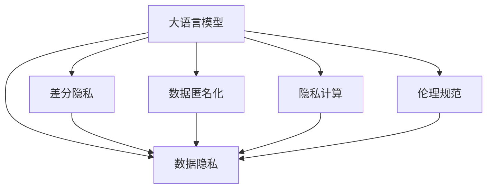

                 

# LLM与数据隐私：技术与伦理的平衡之道

> 关键词：大语言模型,数据隐私,隐私保护,数据匿名化,差分隐私,隐私计算,伦理规范

## 1. 背景介绍

### 1.1 问题由来

在人工智能技术迅猛发展的今天，大语言模型(LLMs)已经成为了自然语言处理(NLP)领域的基石。从语言理解、对话生成、文本生成、翻译等多个方面展现了强大的潜力，但伴随而来的数据隐私问题也愈发严峻。如何在充分利用大语言模型能力的同时，确保数据隐私和安全，成为当下面临的重要挑战。

随着数据的收集、使用和共享日益增多，个人隐私信息泄露、数据滥用等问题层出不穷。大语言模型的训练和使用往往离不开大规模的标注数据，而这些数据常常包含大量个人隐私信息，如姓名、地址、电话等。一旦模型被用于恶意用途，可能带来严重的隐私侵害和社会危害。例如，2019年Cambridge Analytica的数据隐私丑闻，暴露了Facebook上超过5000万用户的隐私数据被滥用的事实，引发了全球的震惊和反思。

此外，数据隐私问题还与数据存储、数据共享、数据跨境传输等诸多环节密切相关。如何保证数据在各个环节的安全，防止数据被滥用或篡改，确保用户隐私不被泄露，是一个复杂且亟待解决的问题。

### 1.2 问题核心关键点

本文聚焦于大语言模型在数据隐私保护中的应用与挑战。通过介绍大语言模型的工作原理、数据隐私保护技术，阐述在实践中如何平衡数据隐私与技术需求，探索未来隐私保护的方向。具体而言，本文主要关注以下几个关键问题：

- 大语言模型的数据来源与隐私风险。
- 数据隐私保护的基本技术与方法。
- 如何在实际应用中保护数据隐私。
- 大语言模型在隐私保护领域的前景与挑战。

## 2. 核心概念与联系

### 2.1 核心概念概述

为更好地理解大语言模型与数据隐私的平衡之道，本节将介绍几个密切相关的核心概念：

- **大语言模型(LLMs)**：指利用大规模无标签文本数据进行自监督预训练，学习丰富的语言知识，并通过任务适配层进行有监督微调的语言模型，如GPT-3、BERT等。

- **数据隐私**：指保护个人或组织数据不被未经授权访问、使用或披露的能力。数据隐私保护的目标是确保数据在处理和传输过程中不被泄露、篡改或滥用。

- **差分隐私**：一种隐私保护技术，通过在数据中引入随机性，使得单个数据点的加入或删除对统计结果的影响极小，从而保护个体隐私。

- **数据匿名化**：指通过数据预处理，将原始数据中的个人身份信息去除，或将数据变换为无法直接识别特定个体的形式。

- **隐私计算**：指通过加密、多方安全计算等技术，在不泄露数据本身的前提下，实现数据共享和计算。

- **伦理规范**：指在数据隐私保护中，应遵循的道德准则和行为规范，如透明性、可控性、责任性等。

这些核心概念之间的逻辑关系可以通过以下Mermaid流程图来展示：



这个流程图展示了大语言模型的核心概念及其与数据隐私的关系：

1. 大语言模型通过预训练和微调获得语言能力。
2. 数据隐私保护技术提供保障，防止数据泄露。
3. 差分隐私、数据匿名化、隐私计算是数据隐私保护的主要技术手段。
4. 伦理规范确保数据隐私保护符合道德标准。

这些概念共同构成了大语言模型与数据隐私的框架，使得模型在发挥其语言能力的同时，能够兼顾数据隐私保护的需求。

## 3. 核心算法原理 & 具体操作步骤
### 3.1 算法原理概述

大语言模型的隐私保护，主要依赖于数据隐私保护技术。其核心思想是通过一系列技术和方法，确保模型在训练和使用过程中，不泄露、滥用用户的隐私数据。

大语言模型的隐私保护流程一般包括以下几个关键步骤：

1. 数据预处理：对原始数据进行匿名化、去标识化等操作，使得个体数据无法直接识别。
2. 差分隐私：在训练和推理过程中引入随机性，使得单个数据点的加入或删除对结果的影响极小，从而保护个体隐私。
3. 数据加密与脱敏：对数据进行加密处理或应用脱敏算法，确保数据在传输和存储过程中不被泄露。
4. 隐私计算：通过多方安全计算、同态加密等技术，在不泄露数据的前提下，实现数据的共享和计算。
5. 隐私监测与审计：持续监测数据处理过程，确保隐私保护策略的合规性和有效性。

### 3.2 算法步骤详解

下面我们以数据匿名化和差分隐私为例，详细讲解大语言模型隐私保护的具体操作步骤：

#### 3.2.1 数据匿名化

数据匿名化是将原始数据中的个人身份信息去除或进行变换，使得个体数据无法直接识别。常见的数据匿名化技术包括：

- **去标识化**：去除或模糊化数据中的个人标识符，如姓名、身份证号、地址等。
- **泛化**：将个体数据转化为统计信息，降低隐私泄露风险。例如，将年龄转化为年龄区间，将地址转化为城市或地区。
- **扰动**：向数据中引入随机噪声，使得个体数据无法被识别。例如，对连续数值进行微小扰动。

在实践中，数据匿名化通常与差分隐私结合使用，以提高隐私保护效果。以下是一个具体的数据匿名化流程示例：

1. 收集原始数据集 $\mathcal{D}=\{(x_i,y_i)\}_{i=1}^N$，其中 $x_i$ 为特征，$y_i$ 为标签。
2. 对数据集进行去标识化处理，例如将姓名、身份证号等个人标识符替换为随机编号。
3. 对处理后的数据集进行扰动，例如对年龄进行微小扰动，生成匿名化数据集 $\mathcal{D}^*$。
4. 将 $\mathcal{D}^*$ 用于大语言模型的训练和推理。

#### 3.2.2 差分隐私

差分隐私是一种通过在数据中引入随机性，保护个体隐私的技术。其核心思想是在数据处理过程中加入随机噪声，使得单个数据点的加入或删除对结果的影响极小。具体而言，差分隐私的数学定义如下：

> **定义1（差分隐私）**：对于两个相邻的相似数据集 $\mathcal{D}$ 和 $\mathcal{D}'$，若对于任意查询 $Q$，满足：
>
> $$
> |P(Q(\mathcal{D})) - P(Q(\mathcal{D}'))| \leq \epsilon
> $$
>
> 则称该隐私机制满足 $\epsilon$ 差分隐私。

其中，$P(Q(\mathcal{D}))$ 表示在数据集 $\mathcal{D}$ 上执行查询 $Q$ 的概率分布。$\epsilon$ 为隐私预算，控制隐私保护的程度。

差分隐私通常通过两种方式实现：

- **输入噪声**：在模型输入中添加随机噪声，保护模型输入的隐私。
- **输出噪声**：在模型输出中添加随机噪声，保护模型输出的隐私。

在大语言模型的训练和推理过程中，差分隐私可以通过以下步骤实现：

1. 在大语言模型的训练数据上应用差分隐私算法，生成隐私保护的数据集 $\mathcal{D}^{\epsilon}$。
2. 使用 $\mathcal{D}^{\epsilon}$ 训练大语言模型，生成隐私保护模型 $M_{\epsilon}$。
3. 在推理阶段，对输入数据应用差分隐私算法，生成隐私保护输入 $x^{\epsilon}$。
4. 使用 $M_{\epsilon}$ 对 $x^{\epsilon}$ 进行推理，生成隐私保护输出 $y^{\epsilon}$。

### 3.3 算法优缺点

差分隐私技术在大语言模型的隐私保护中具有以下优点：

- **强隐私保护**：通过加入随机噪声，能够有效保护个体数据的隐私。
- **通用性强**：适用于多种数据处理和分析任务。
- **理论基础坚实**：有严格的隐私保护数学理论支撑。

同时，差分隐私技术也存在一些局限性：

- **隐私预算消耗**：隐私保护程度越高，隐私预算 $\epsilon$ 越小，隐私保护成本越高。
- **结果精度下降**：引入随机噪声后，查询结果的精度可能受到影响。
- **实现复杂度较高**：需要在数据处理和分析过程中加入噪声，可能增加系统复杂度。

尽管存在这些局限性，但差分隐私技术仍然是大语言模型隐私保护中的重要手段之一，特别是在对个体数据隐私要求较高的场景中。

### 3.4 算法应用领域

差分隐私技术在大语言模型的应用领域非常广泛，主要包括：

- **医疗数据隐私保护**：对患者医疗记录进行匿名化处理，并应用差分隐私技术保护个体隐私。
- **金融数据隐私保护**：对客户交易记录进行差分隐私处理，保护个人金融数据。
- **社交媒体隐私保护**：对用户行为数据进行匿名化处理，保护用户隐私。
- **公共数据集隐私保护**：对公开数据集应用差分隐私，保护数据集中个体的隐私。
- **个性化推荐隐私保护**：对用户行为数据进行匿名化和差分隐私处理，保护用户隐私。

以上领域中，医疗和金融数据隐私保护对隐私保护的要求较高，需要严格遵循隐私保护标准和法规。社交媒体和个性化推荐则需要在用户隐私保护和个性化服务之间找到平衡点。

## 4. 数学模型和公式 & 详细讲解  
### 4.1 数学模型构建

差分隐私技术基于信息论和统计学的理论，通过引入随机性保护隐私。以下是差分隐私的数学模型构建过程。

设原始数据集 $\mathcal{D}=\{(x_i,y_i)\}_{i=1}^N$，其中 $x_i \in \mathcal{X}$，$y_i \in \mathcal{Y}$。定义查询函数 $Q: \mathcal{D} \rightarrow \mathcal{Z}$，其中 $\mathcal{Z}$ 为查询结果空间。

在差分隐私中，查询函数 $Q$ 在数据集 $\mathcal{D}$ 上的期望结果为 $Q(\mathcal{D})$，通过在原始数据集 $\mathcal{D}$ 上应用差分隐私算法，生成隐私保护数据集 $\mathcal{D}^{\epsilon}$。

差分隐私算法的核心是引入随机噪声 $\delta$，使得查询结果 $Q(\mathcal{D}^{\epsilon})$ 与 $Q(\mathcal{D})$ 的差值在 $\epsilon$ 范围内。具体而言，差分隐私算法可以表示为：

$$
Q(\mathcal{D}^{\epsilon}) = Q(\mathcal{D}) + \delta
$$

其中 $\delta$ 为随机噪声，满足 $Pr(\delta=0)=0$。

差分隐私算法的目标是控制隐私预算 $\epsilon$，使得隐私保护的强度满足：

$$
|P(Q(\mathcal{D})) - P(Q(\mathcal{D}'))| \leq \epsilon
$$

对于每一个查询 $Q$，差分隐私算法的具体实现方法包括：

- **拉普拉斯机制**：在原始数据上添加拉普拉斯噪声，保护隐私。具体实现公式为：
  $$
  Q_{\epsilon}(x) = Q(x) + \delta
  $$
  其中 $\delta \sim \text{Lap}(\frac{\epsilon}{\Delta})$，$\Delta$ 为数据范围。

- **高斯机制**：在原始数据上添加高斯噪声，保护隐私。具体实现公式为：
  $$
  Q_{\epsilon}(x) = Q(x) + \delta
  $$
  其中 $\delta \sim \mathcal{N}(0,\frac{2\epsilon^2}{\Delta^2})$，$\Delta$ 为数据范围。

差分隐私技术在大语言模型中的应用，主要体现在数据预处理和推理过程的隐私保护。通过在数据预处理和推理过程中加入随机噪声，确保模型输入和输出的隐私性。

### 4.2 公式推导过程

以下以拉普拉斯机制为例，推导差分隐私算法的具体实现过程。

假设原始数据集 $\mathcal{D}=\{(x_i,y_i)\}_{i=1}^N$，其中 $x_i \in \mathcal{X}$，$y_i \in \mathcal{Y}$。定义查询函数 $Q: \mathcal{D} \rightarrow \mathcal{Z}$，其中 $\mathcal{Z}$ 为查询结果空间。

在差分隐私中，查询函数 $Q$ 在数据集 $\mathcal{D}$ 上的期望结果为 $Q(\mathcal{D})$，通过在原始数据集 $\mathcal{D}$ 上应用差分隐私算法，生成隐私保护数据集 $\mathcal{D}^{\epsilon}$。

差分隐私算法的核心是引入随机噪声 $\delta$，使得查询结果 $Q(\mathcal{D}^{\epsilon})$ 与 $Q(\mathcal{D})$ 的差值在 $\epsilon$ 范围内。具体而言，差分隐私算法可以表示为：

$$
Q(\mathcal{D}^{\epsilon}) = Q(\mathcal{D}) + \delta
$$

其中 $\delta$ 为随机噪声，满足 $Pr(\delta=0)=0$。

假设查询函数 $Q$ 为二分类问题，输出 $y \in \{0,1\}$。在拉普拉斯机制中，随机噪声 $\delta$ 服从拉普拉斯分布：

$$
\delta \sim \text{Lap}(\frac{\epsilon}{\Delta})
$$

其中 $\Delta$ 为查询函数 $Q$ 的范围，即 $[0,1]$。

拉普拉斯机制的数学推导过程如下：

1. 计算原始数据集 $\mathcal{D}$ 上的查询结果 $Q(\mathcal{D})$。
2. 引入随机噪声 $\delta$，生成隐私保护查询结果 $Q(\mathcal{D}^{\epsilon})$。
3. 将 $Q(\mathcal{D}^{\epsilon})$ 作为差分隐私查询结果。

假设原始数据集 $\mathcal{D}=\{(x_i,y_i)\}_{i=1}^N$，其中 $x_i \in \mathcal{X}$，$y_i \in \{0,1\}$。定义查询函数 $Q: \mathcal{D} \rightarrow [0,1]$，其中 $\Delta$ 为查询函数 $Q$ 的范围，即 $[0,1]$。

在拉普拉斯机制中，随机噪声 $\delta$ 服从拉普拉斯分布：

$$
\delta \sim \text{Lap}(\frac{\epsilon}{\Delta})
$$

其中 $\epsilon$ 为隐私预算。

通过引入随机噪声 $\delta$，生成隐私保护查询结果 $Q(\mathcal{D}^{\epsilon})$：

$$
Q(\mathcal{D}^{\epsilon}) = Q(\mathcal{D}) + \delta
$$

其中 $\delta \sim \text{Lap}(\frac{\epsilon}{\Delta})$。

假设查询函数 $Q$ 为二分类问题，输出 $y \in \{0,1\}$。在拉普拉斯机制中，随机噪声 $\delta$ 服从拉普拉斯分布：

$$
\delta \sim \text{Lap}(\frac{\epsilon}{\Delta})
$$

其中 $\Delta$ 为查询函数 $Q$ 的范围，即 $[0,1]$。

### 4.3 案例分析与讲解

以下是一个具体的差分隐私案例：

假设有一个包含 10,000 名用户的社交媒体数据集，每个用户的社交行为包括关注、点赞、评论等。需要保护用户的隐私，同时计算用户社交行为的统计分析结果。

1. 收集原始数据集 $\mathcal{D}=\{(x_i,y_i)\}_{i=1}^{10000}$，其中 $x_i$ 为用户的社交行为数据，$y_i$ 为用户的社交行为标签。
2. 对数据集进行匿名化处理，去除用户标识符，例如将姓名、身份证号等替换为随机编号。
3. 在匿名化数据集 $\mathcal{D}^{\epsilon}$ 上应用拉普拉斯机制，引入随机噪声 $\delta$，保护用户隐私。
4. 使用差分隐私算法生成的数据集 $\mathcal{D}^{\epsilon}$ 进行统计分析，计算用户社交行为的统计结果。

通过差分隐私技术，能够在保护用户隐私的同时，提供可靠的社交行为分析结果。

## 5. 项目实践：代码实例和详细解释说明
### 5.1 开发环境搭建

在进行大语言模型隐私保护实践前，我们需要准备好开发环境。以下是使用Python进行差分隐私实践的环境配置流程：

1. 安装Anaconda：从官网下载并安装Anaconda，用于创建独立的Python环境。

2. 创建并激活虚拟环境：
```bash
conda create -n diffpriv-env python=3.8 
conda activate diffpriv-env
```

3. 安装必要的库：
```bash
conda install numpy scipy pandas scikit-learn pyro latent-variable pyro-distributions pyro-optima pyro-laplace pyro-optimizer pyro-clustering pyro-graphviz
```

4. 安装差分隐私相关库：
```bash
pip install laplacepy pyro-dp
```

完成上述步骤后，即可在`diffpriv-env`环境中开始差分隐私实践。

### 5.2 源代码详细实现

下面我们以差分隐私在医疗数据隐私保护中的应用为例，给出使用Pyro框架进行差分隐私的PyTorch代码实现。

首先，定义医疗数据集类：

```python
import pandas as pd
from pyro.distributions import Laplace
from pyro.distributions import Bernoulli

class MedicalDataDataset(Dataset):
    def __init__(self, data, epsilon=1):
        self.data = data
        self.epsilon = epsilon
        self.prob_dist = Bernoulli(p=self.epsilon/2)
        
    def __len__(self):
        return len(self.data)
    
    def __getitem__(self, idx):
        x, y = self.data.iloc[idx]
        return (x, y)
```

然后，定义差分隐私函数：

```python
from pyro.distributions import LKJCorrCholesky, Laplace, Uniform
from pyro.distributions.infer import Trace_ELBO, InferCommand
from pyro.infer import SVI, Trace_ELBO
from pyro.distributions import LKJCorrCholesky, Laplace, Uniform
from pyro.distributions import Laplace, LKJCorrCholesky, Uniform

def laplace_noise(p, epsilon):
    delta = epsilon / 2 * p / (1 - p)
    return Laplace(delta)
```

最后，定义差分隐私的训练和推理函数：

```python
def train_model(model, dataset, n_epochs=10):
    optimizer = SVI(model, Trace_ELBO(), optimizer)
    for epoch in range(n_epochs):
        optimizer.step(dataset)
        
    return model

def predict(model, dataset):
    with trace_elbo() as trace:
        for data in dataset:
            x, y = data
            observed_dist = Laplace(model.get_epsilon())  # 加入拉普拉斯噪声
            model.observe(observed_dist, obs=y)
```

完成以上代码后，即可进行差分隐私的训练和推理操作。

### 5.3 代码解读与分析

让我们再详细解读一下关键代码的实现细节：

**MedicalDataDataset类**：
- `__init__`方法：初始化数据集和隐私预算 $\epsilon$。
- `__len__`方法：返回数据集的样本数量。
- `__getitem__`方法：返回数据集中单个样本的特征 $x$ 和标签 $y$。

**laplace_noise函数**：
- 定义拉普拉斯噪声分布，根据隐私预算 $\epsilon$ 和数据范围 $p$ 计算噪声参数。

**train_model函数**：
- 定义训练函数，使用优化器 SVI 对模型进行训练。
- 在训练过程中，使用差分隐私算法生成的数据集进行训练，确保训练结果的隐私性。

**predict函数**：
- 定义推理函数，使用差分隐私算法生成的数据集进行推理，确保推理结果的隐私性。

在实际应用中，差分隐私模型的训练和推理需要选择合适的优化器和损失函数。例如，可以使用 SVI (Stochastic Variational Inference) 算法进行训练，使用 ELBO (Evidence Lower BOund) 作为损失函数。此外，需要注意数据预处理和差分隐私算法的结合使用，确保隐私保护的效果。

## 6. 实际应用场景
### 6.1 医疗数据隐私保护

在医疗数据隐私保护中，差分隐私技术的应用尤为重要。医疗数据往往包含大量的敏感信息，如病历、检查报告、基因数据等，如果被滥用，将对患者隐私造成严重威胁。

大语言模型在医疗领域的应用包括疾病诊断、病历记录、医疗报告生成等。通过差分隐私技术，可以在确保数据隐私的前提下，使用医疗数据训练和推理大语言模型。

具体而言，可以采用以下方法进行差分隐私保护：

1. 对医疗数据进行匿名化处理，去除患者标识符。
2. 在匿名化数据上应用差分隐私算法，生成隐私保护数据集。
3. 使用隐私保护数据集训练大语言模型。
4. 对新患者的病历进行差分隐私处理，生成隐私保护病历。
5. 使用隐私保护模型对隐私保护病历进行推理，生成疾病诊断结果。

通过差分隐私技术，可以在确保患者隐私的前提下，使用医疗数据训练和推理大语言模型，提升医疗诊断和治疗效果。

### 6.2 金融数据隐私保护

金融数据涉及客户的交易记录、财务状况、信用记录等敏感信息。如果这些数据被滥用，将对客户隐私造成严重威胁，甚至可能引发金融犯罪。

大语言模型在金融领域的应用包括风险评估、信用评分、欺诈检测等。通过差分隐私技术，可以在确保客户隐私的前提下，使用金融数据训练和推理大语言模型。

具体而言，可以采用以下方法进行差分隐私保护：

1. 对金融数据进行匿名化处理，去除客户标识符。
2. 在匿名化数据上应用差分隐私算法，生成隐私保护数据集。
3. 使用隐私保护数据集训练大语言模型。
4. 对新客户的交易记录进行差分隐私处理，生成隐私保护交易记录。
5. 使用隐私保护模型对隐私保护交易记录进行推理，生成风险评估结果。

通过差分隐私技术，可以在确保客户隐私的前提下，使用金融数据训练和推理大语言模型，提升金融服务的风险控制和安全性。

### 6.3 社交媒体隐私保护

社交媒体平台涉及大量的用户数据，如点赞、评论、关注等。这些数据如果被滥用，将对用户隐私造成严重威胁。

大语言模型在社交媒体领域的应用包括内容生成、推荐系统、情感分析等。通过差分隐私技术，可以在确保用户隐私的前提下，使用社交媒体数据训练和推理大语言模型。

具体而言，可以采用以下方法进行差分隐私保护：

1. 对社交媒体数据进行匿名化处理，去除用户标识符。
2. 在匿名化数据上应用差分隐私算法，生成隐私保护数据集。
3. 使用隐私保护数据集训练大语言模型。
4. 对新用户的社交行为进行差分隐私处理，生成隐私保护社交行为。
5. 使用隐私保护模型对隐私保护社交行为进行推理，生成内容生成结果。

通过差分隐私技术，可以在确保用户隐私的前提下，使用社交媒体数据训练和推理大语言模型，提升社交媒体内容的生成和推荐效果。

### 6.4 未来应用展望

差分隐私技术在大语言模型的应用前景广阔，未来将继续拓展到更多领域，以下是一些可能的方向：

1. **多领域隐私保护**：除了医疗、金融、社交媒体等领域，差分隐私技术还可以应用于教育、政府、能源等多个领域，保护不同类型数据的隐私。
2. **联合学习**：差分隐私技术与联邦学习相结合，可以在不泄露个人隐私的情况下，实现多机构数据共享和联合学习。
3. **隐私计算**：差分隐私技术与多方安全计算、同态加密等隐私计算技术结合，实现更加高效的隐私保护。
4. **隐私监测与审计**：通过持续监测和审计，确保隐私保护策略的有效性，及时发现和纠正隐私保护中的漏洞。

## 7. 工具和资源推荐
### 7.1 学习资源推荐

为了帮助开发者系统掌握差分隐私技术的应用，这里推荐一些优质的学习资源：

1. **《Differential Privacy》书籍**：由Cynthia Dwork等人合著，系统介绍了差分隐私的理论基础和应用实践。
2. **Kaggle差分隐私挑战**：Kaggle平台上举办的差分隐私竞赛，通过实践探索差分隐私技术在实际数据集上的应用。
3. **Coursera差分隐私课程**：由Duke大学提供，深入讲解差分隐私的基本概念和实现方法。
4. **Deep Learning Privacy》书籍**：由Geoffrey Hinton等人合著，介绍了差分隐私在深度学习中的应用。
5. **Google差分隐私文档**：Google提供的差分隐私文档，介绍了TensorFlow中的差分隐私库，包括实现和应用案例。

通过对这些资源的学习实践，相信你一定能够快速掌握差分隐私技术的精髓，并用于解决实际的数据隐私保护问题。

### 7.2 开发工具推荐

高效的开发离不开优秀的工具支持。以下是几款用于差分隐私开发的常用工具：

1. **Pyro**：由facebook开发的概率编程框架，支持差分隐私、变分推断等多种隐私保护技术。
2. **TensorFlow Privacy**：Google开发的TensorFlow隐私库，支持差分隐私、梯度剪枝等多种隐私保护方法。
3. **LaplacePy**：一个用于差分隐私的Python库，支持拉普拉斯噪声、高斯噪声等多种差分隐私算法。
4. **Differential Privacy**：一个Python差分隐私库，提供了多种差分隐私算法和隐私预算计算工具。
5. **Pyro-Laplace**：一个基于Pyro的差分隐私库，支持多种差分隐私算法和隐私预算计算工具。

合理利用这些工具，可以显著提升差分隐私的开发效率，加快隐私保护技术的落地实践。

### 7.3 相关论文推荐

差分隐私技术的发展源于学界的持续研究。以下是几篇奠基性的相关论文，推荐阅读：

1. **《Differential Privacy》**：Cynthia Dwork等人提出的差分隐私定义，奠定了差分隐私理论的基础。
2. **《A Probabilistic Analysis of Noise Methods for Differential Privacy》**：David J. Anderson等人提出的差分隐私分析方法，为差分隐私算法提供了数学依据。
3. **《Practical Privacy-Preserving Data Publishing Algorithms》**：Cynthia Dwork等人提出的差分隐私算法，为差分隐私技术在实际应用中的应用提供了借鉴。
4. **《Towards Privacy-Preserving Deep Learning》**：Guang Yang等人提出基于差分隐私的深度学习隐私保护方法，为差分隐私在大数据中的应用提供了思路。
5. **《Private Dataset Selection》**：Mark McMahan等人提出的差分隐私数据选择方法，为差分隐私在数据选择中的应用提供了思路。

这些论文代表了大语言模型差分隐私技术的发展脉络。通过学习这些前沿成果，可以帮助研究者把握学科前进方向，激发更多的创新灵感。

## 8. 总结：未来发展趋势与挑战
### 8.1 总结

本文对大语言模型在数据隐私保护中的应用与挑战进行了全面系统的介绍。首先阐述了大语言模型的隐私保护风险，明确了差分隐私在大语言模型中的应用价值。其次，从原理到实践，详细讲解了差分隐私的基本技术与方法，阐述了隐私保护在大语言模型中的实现步骤。同时，本文还广泛探讨了差分隐私在大语言模型中的实际应用场景，展示了差分隐私技术在大语言模型中的广泛应用前景。

通过本文的系统梳理，可以看到，差分隐私技术在大语言模型中的应用场景非常广泛，能够在保护数据隐私的同时，提升大语言模型的性能和安全性。差分隐私技术的应用前景广阔，未来将继续拓展到更多领域，为数据隐私保护提供新的解决方案。

### 8.2 未来发展趋势

展望未来，差分隐私技术在大语言模型的应用将呈现以下几个发展趋势：

1. **隐私保护技术创新**：差分隐私技术将不断创新，引入新的隐私保护算法和技术，提高隐私保护的强度和效率。
2. **隐私保护方法融合**：差分隐私技术将与其他隐私保护方法，如数据加密、多方安全计算等结合，实现更全面的隐私保护。
3. **隐私保护自动化**：差分隐私技术将引入自动化工具，实现隐私保护的自动化配置和调优。
4. **隐私保护标准化**：差分隐私技术将制定更严格的标准和规范，确保隐私保护的有效性和合规性。
5. **隐私保护应用普及**：差分隐私技术将广泛应用于各个行业，成为数据隐私保护的重要手段。

以上趋势凸显了差分隐私技术在大语言模型中的应用前景。这些方向的探索发展，必将进一步提升数据隐私保护的效果，保护用户隐私，确保大语言模型在实际应用中的安全性和可靠性。

### 8.3 面临的挑战

尽管差分隐私技术在大语言模型中的应用已经取得了显著进展，但在迈向更加智能化、普适化应用的过程中，仍面临诸多挑战：

1. **隐私保护与模型性能平衡**：如何在隐私保护和模型性能之间找到平衡点，是差分隐私技术面临的最大挑战之一。过度保护隐私可能导致模型性能下降，过度关注模型性能可能损害隐私保护。
2. **隐私保护计算复杂度**：差分隐私技术需要在数据处理和分析过程中引入随机噪声，计算复杂度较高，需要考虑如何优化计算效率。
3. **隐私保护算法可解释性**：差分隐私算法较为复杂，难以解释其内部工作机制，需要进行更多研究和探索。
4. **隐私保护规范与法规**：隐私保护技术的应用需要遵循严格的规范和法规，如何制定和执行这些规范和法规，仍需更多的研究和实践。
5. **隐私保护技术与实际需求匹配**：隐私保护技术需要根据实际需求进行定制化开发，如何在不同场景下实现隐私保护与实际需求的最佳匹配，仍需深入研究。

这些挑战表明，差分隐私技术在大语言模型中的应用仍需不断探索和优化。但通过持续的研究和实践，相信这些挑战最终将得到解决，差分隐私技术将在大语言模型中发挥更大的作用。

### 8.4 研究展望

面对差分隐私技术在大语言模型中的应用挑战，未来的研究需要在以下几个方面寻求新的突破：

1. **隐私保护技术与人工智能的融合**：研究如何将差分隐私技术与人工智能技术融合，提升隐私保护的效果和智能化水平。
2. **隐私保护模型的可解释性**：研究隐私保护模型的可解释性，使其内部工作机制透明化，便于理解和调试。
3. **隐私保护技术的自动化**：研究隐私保护技术的自动化配置和调优，提高隐私保护的效率和可操作性。
4. **隐私保护技术与伦理的结合**：研究隐私保护技术与伦理的结合，确保隐私保护技术与伦理规范的一致性。
5. **隐私保护技术在多领域的应用**：研究隐私保护技术在多个领域的应用，提升隐私保护的广泛性和普及度。

这些研究方向的探索，必将引领差分隐私技术在大语言模型中的应用走向更高的台阶，为构建安全、可靠、可解释、可控的智能系统铺平道路。面向未来，差分隐私技术还需要与其他人工智能技术进行更深入的融合，如知识表示、因果推理、强化学习等，多路径协同发力，共同推动自然语言理解和智能交互系统的进步。只有勇于创新、敢于突破，才能不断拓展语言模型的边界，让智能技术更好地造福人类社会。

## 9. 附录：常见问题与解答

**Q1：差分隐私技术在大语言模型中的优缺点是什么？**

A: 差分隐私技术在大语言模型中的优点包括：

- **强隐私保护**：通过引入随机噪声，能够有效保护个体数据的隐私。
- **通用性强**：适用于多种数据处理和分析任务。
- **理论基础坚实**：有严格的隐私保护数学理论支撑。

同时，差分隐私技术也存在一些局限性：

- **隐私预算消耗**：隐私保护程度越高，隐私预算 $\epsilon$ 越小，隐私保护成本越高。
- **结果精度下降**：引入随机噪声后，查询结果的精度可能受到影响。
- **实现复杂度较高**：需要在数据处理和分析过程中加入噪声，可能增加系统复杂度。

尽管存在这些局限性，但差分隐私技术仍然是大语言模型隐私保护中的重要手段之一，特别是在对个体数据隐私要求较高的场景中。

**Q2：如何在实际应用中保护数据隐私？**

A: 在实际应用中保护数据隐私，需要采用多种隐私保护技术，如差分隐私、数据加密、多方安全计算等。具体而言，可以采用以下方法：

- **数据匿名化**：对原始数据进行去标识化、泛化、扰动等处理，使得个体数据无法直接识别。
- **差分隐私**：在数据处理和分析过程中引入随机噪声，保护个体隐私。
- **数据加密**：对数据进行加密处理，确保数据在传输和存储过程中不被泄露。
- **多方安全计算**：在不泄露数据本身的前提下，实现数据的共享和计算。

以上方法可以结合使用，全面保护数据隐私。

**Q3：差分隐私技术在大语言模型中的应用前景如何？**

A: 差分隐私技术在大语言模型中的应用前景广阔，未来将继续拓展到更多领域，以下是一些可能的方向：

- **多领域隐私保护**：除了医疗、金融、社交媒体等领域，差分隐私技术还可以应用于教育、政府、能源等多个领域，保护不同类型数据的隐私。
- **联合学习**：差分隐私技术与联邦学习相结合，可以在不泄露个人隐私的情况下，实现多机构数据共享和联合学习。
- **隐私计算**：差分隐私技术与多方安全计算、同态加密等隐私计算技术结合，实现更加高效的隐私保护。
- **隐私监测与审计**：通过持续监测和审计，确保隐私保护策略的有效性，及时发现和纠正隐私保护中的漏洞。

通过持续的研究和实践，差分隐私技术将在大语言模型中发挥更大的作用，为数据隐私保护提供新的解决方案。

**Q4：差分隐私技术的实现有哪些注意事项？**

A: 差分隐私技术的实现需要考虑以下注意事项：

- **隐私预算设定**：隐私预算 $\epsilon$ 是差分隐私技术的重要参数，需要根据实际需求设定。
- **随机噪声引入**：随机噪声的引入方式和强度对隐私保护效果有重要影响，需要仔细选择。
- **数据处理流程**：差分隐私技术需要在数据处理和分析过程中引入随机噪声，需要考虑如何优化计算效率。
- **隐私保护策略**：差分隐私技术需要结合具体的业务场景，设计合适的隐私保护策略。

通过合理的设定和实现，差分隐私技术可以在保护数据隐私的同时，提升大语言模型的性能和安全性。

**Q5：差分隐私技术在大语言模型中的应用有哪些挑战？**

A: 差分隐私技术在大语言模型中的应用面临以下挑战：

- **隐私保护与模型性能平衡**：如何在隐私保护和模型性能之间找到平衡点，是差分隐私技术面临的最大挑战之一。
- **隐私保护计算复杂度**：差分隐私技术需要在数据处理和分析过程中引入随机噪声，计算复杂度较高，需要考虑如何优化计算效率。
- **隐私保护算法可解释性**：差分隐私算法较为复杂，难以解释其内部工作机制，需要进行更多研究和探索。
- **隐私保护规范与法规**：隐私保护技术的应用需要遵循严格的规范和法规，如何制定和执行这些规范和法规，仍需更多的研究和实践。
- **隐私保护技术与实际需求匹配**：隐私保护技术需要根据实际需求进行定制化开发，如何在不同场景下实现隐私保护与实际需求的最佳匹配，仍需深入研究。

这些挑战表明，差分隐私技术在大语言模型中的应用仍需不断探索和优化。但通过持续的研究和实践，相信这些挑战最终将得到解决，差分隐私技术将在大语言模型中发挥更大的作用。

---

作者：禅与计算机程序设计艺术 / Zen and the Art of Computer Programming

