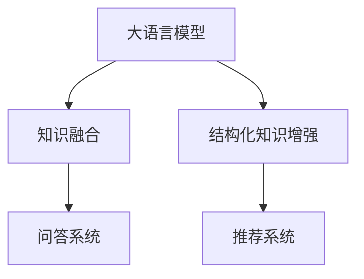

                 

# LLM与知识图谱：增强模型的结构化知识

> 关键词：大语言模型, 知识图谱, 结构化知识, 问答系统, 推荐系统, 数据融合, 深度学习

## 1. 背景介绍

### 1.1 问题由来

随着深度学习技术的不断进步，大规模语言模型（Large Language Model, LLM）在自然语言处理（Natural Language Processing, NLP）领域取得了显著的成果。这些大模型如GPT-3、BERT等，已经在各种NLP任务中展现出了强大的通用语言理解和生成能力。然而，这些模型大多依赖于大量的无标签文本数据进行预训练，缺乏对结构化知识的应用，无法处理那些需要大量背景知识才能解答的问题。

### 1.2 问题核心关键点

知识图谱（Knowledge Graph）是一种以节点表示实体，边表示实体间关系的数据结构。它能够有效地整合和表达人类知识，为自然语言理解提供了强有力的支持。将知识图谱与大语言模型结合，可以极大地提升模型的知识应用能力和泛化能力，尤其是在需要结构化知识支持的问答系统和推荐系统等任务中。

### 1.3 问题研究意义

在知识图谱的辅助下，大语言模型能够更好地理解上下文信息，推断逻辑关系，解答复杂问题。这对于构建智能问答系统、个性化推荐系统等应用场景具有重要意义：

1. **提高问答系统准确性**：知识图谱可以帮助模型更好地理解用户意图，提供更加准确的回答。
2. **优化推荐系统个性化**：通过融合知识图谱信息，推荐系统能够为用户提供更加个性化、符合逻辑和上下文的信息。
3. **支持复杂问题解答**：大语言模型结合知识图谱可以处理那些需要跨领域知识、复杂推理的问题。
4. **增强决策支持能力**：结构化知识可以为决策支持系统提供更可靠的依据，帮助用户更好地做出决策。

## 2. 核心概念与联系

### 2.1 核心概念概述

为了深入理解将知识图谱与大语言模型结合的原理，本节将介绍几个关键概念：

- **大语言模型（Large Language Model, LLM）**：指基于深度神经网络构建的、具有强大语言理解和生成能力的模型，如GPT、BERT等。
- **知识图谱（Knowledge Graph, KG）**：一种结构化知识表示形式，由实体和关系构成，如RDF、OWL等。
- **知识融合（Knowledge Fusion）**：将知识图谱中的结构化知识与非结构化文本信息结合的过程。
- **结构化知识增强（Structured Knowledge Augmentation）**：通过融合知识图谱信息，提升大语言模型的推理和决策能力。
- **问答系统（Question Answering System, QA）**：使用大语言模型结合知识图谱，解答用户自然语言问题。
- **推荐系统（Recommendation System）**：利用大语言模型和知识图谱，为用户提供个性化推荐。

这些核心概念之间的联系可以通过以下Mermaid流程图来展示：



这个流程图展示了大语言模型与知识图谱结合的关键路径：

1. 大语言模型通过知识融合过程，获取结构化知识，进而实现结构化知识增强。
2. 增强后的模型在问答和推荐系统中得到应用，提供更精准和个性化的服务。

## 3. 核心算法原理 & 具体操作步骤
### 3.1 算法原理概述

知识图谱与大语言模型结合的基本原理是：大语言模型利用其强大的语言处理能力，对知识图谱进行深度学习，从中抽取和整合结构化知识，提升模型的推理和决策能力。

形式化地，假设大语言模型为 $M_{\theta}$，知识图谱为 $KG$，其中 $\theta$ 为模型参数，$KG$ 包含实体 $E$ 和关系 $R$。知识融合的过程可以表示为：

$$
KG_{fused} = M_{\theta}(KG)
$$

其中 $KG_{fused}$ 表示融合后的知识图谱，大语言模型通过学习 $KG$ 中的实体和关系，生成新的知识结构，以更好地理解自然语言。

基于融合后的知识图谱 $KG_{fused}$，可以进行结构化知识增强的过程。例如，在问答系统任务中，模型可以通过查询 $KG_{fused}$，找到与问题相关的实体和关系，从而提供更准确的回答。在推荐系统任务中，模型可以基于 $KG_{fused}$ 中的实体和关系，为用户提供更加个性化的推荐。

### 3.2 算法步骤详解

大语言模型与知识图谱结合的主要操作步骤包括：

**Step 1: 知识图谱预处理**

- 对知识图谱进行去噪、实体链接、关系抽取等预处理步骤，以提高模型的学习效率和效果。
- 使用标准的知识图谱格式（如RDF、Turtle等），方便后续的融合操作。

**Step 2: 知识融合**

- 使用图嵌入技术（如TransE、DistMult等）将知识图谱中的实体和关系映射到低维向量空间。
- 将知识图谱的向量表示与大语言模型的词向量进行融合，如使用拼接、乘法等操作。
- 在大语言模型的训练过程中，引入知识图谱的向量表示，进行联合训练。

**Step 3: 结构化知识增强**

- 在问答系统任务中，查询知识图谱，找到与问题相关的实体和关系，用于上下文理解。
- 在推荐系统任务中，基于知识图谱中的实体和关系，进行用户行为预测和物品推荐。

**Step 4: 模型微调**

- 根据任务需求，对模型进行微调，调整部分参数以提升特定任务的性能。
- 对于问答系统，微调顶层分类器；对于推荐系统，微调用户行为预测和物品推荐层。

### 3.3 算法优缺点

结合知识图谱的大语言模型具有以下优点：

- **知识应用能力提升**：知识图谱为大语言模型提供了丰富的结构化知识，帮助模型更好地理解和处理复杂问题。
- **泛化能力增强**：知识图谱中的结构化知识能够有效提升模型的泛化能力，使其在新的领域和场景中表现更佳。
- **决策支持力增强**：结合知识图谱，模型能够提供更加逻辑化、结构化的决策支持。

同时，这种结合方法也存在一些缺点：

- **数据依赖性强**：知识图谱的质量直接影响模型的性能，获取高质量的知识图谱需要投入大量的时间和资源。
- **计算资源需求高**：知识图谱的融合和推理过程需要大量的计算资源，尤其是在处理大规模知识图谱时。
- **知识图谱更新困难**：知识图谱的更新需要专业知识，且更新后的知识需要重新与模型进行融合。

### 3.4 算法应用领域

结合知识图谱的大语言模型已经在以下几个领域得到了广泛应用：

- **问答系统**：利用知识图谱进行实体链接和关系抽取，帮助模型理解用户问题并提供精确答案。
- **推荐系统**：结合知识图谱中的实体和关系，进行用户行为预测和物品推荐，提高推荐系统的个性化和精准度。
- **智能客服**：通过知识图谱和自然语言处理技术，构建智能客服系统，解决用户问题。
- **医疗知识图谱**：结合医学知识图谱，构建医疗问答系统和诊断系统，帮助医生做出准确诊断。
- **金融知识图谱**：结合金融知识图谱，构建金融问答系统和推荐系统，提供金融决策支持。

除了上述这些应用外，知识图谱与大语言模型的结合还将广泛应用于更多领域，如教育、城市管理、工业制造等，为各个行业带来变革性的影响。

## 4. 数学模型和公式 & 详细讲解 & 举例说明
### 4.1 数学模型构建

知识图谱与大语言模型的结合涉及到多个子模型和数据结构。为更好地理解这一过程，本节将通过数学语言对其构建进行详细阐述。

假设知识图谱中的实体为 $E=\{e_1, e_2, ..., e_n\}$，关系为 $R=\{r_1, r_2, ..., r_m\}$。知识图谱的向量表示 $KG = \{e_v, r_v\}_{v=1}^N$，其中 $e_v$ 为实体 $e_i$ 的向量表示，$r_v$ 为关系 $r_i$ 的向量表示。

大语言模型的词向量为 $W=\{w_1, w_2, ..., w_n\}$，其中 $w_i$ 为单词 $i$ 的向量表示。知识图谱与大语言模型的结合可以通过以下数学模型进行描述：

$$
KG_{fused} = M_{\theta}(KG \times W)
$$

其中 $KG_{fused}$ 为融合后的知识图谱向量表示，$\times$ 表示向量相乘。

### 4.2 公式推导过程

以下我们以问答系统为例，推导知识图谱与大语言模型结合的数学公式。

假设用户提问为 $q$，答案为 $a$。模型的推理过程可以表示为：

1. 对问题 $q$ 进行编码，得到问题向量 $q_v$。
2. 对答案 $a$ 进行解码，得到答案向量 $a_v$。
3. 根据知识图谱中的关系 $r_i$，计算关系向量 $r_v$。
4. 将问题向量 $q_v$、答案向量 $a_v$ 和关系向量 $r_v$ 进行拼接，得到推理向量 $p_v$。
5. 使用softmax函数计算答案的概率 $p(a|q, KG)$。

具体推导如下：

设问题向量 $q_v = M_{\theta}(q)$，答案向量 $a_v = M_{\theta}(a)$，关系向量 $r_v = M_{\theta}(r)$，推理向量 $p_v = (q_v, a_v, r_v)$。假设 $KG_{fused} = (KG_v, W_v)$，则有：

$$
p_v = M_{\theta}(q_v \times a_v \times r_v)
$$

将推理向量 $p_v$ 输入softmax函数，得到答案的概率：

$$
p(a|q, KG) = softmax(M_{\theta}(p_v))
$$

这样，通过知识图谱与大语言模型的结合，问答系统可以更准确地理解和处理用户问题，提供高质量的答案。

### 4.3 案例分析与讲解

以Wikipedia语料为例，介绍知识图谱与大语言模型结合的实际应用。

1. **知识图谱构建**：
   - 首先从Wikipedia中抽取实体和关系，构建知识图谱。
   - 使用TransE模型对知识图谱进行训练，生成实体和关系的低维向量表示。

2. **大语言模型训练**：
   - 在训练过程中，引入知识图谱的向量表示，进行联合训练。
   - 模型首先学习语言知识，然后利用知识图谱进行结构化知识增强。

3. **问答系统应用**：
   - 用户提问如 "Who is the author of 'Harry Potter'?"。
   - 模型通过查询知识图谱，找到与问题相关的实体和关系，如 "Harry Potter" 和 "author"。
   - 根据实体和关系向量，进行推理，得到答案 "J.K. Rowling"。

通过这种方法，问答系统可以更好地理解用户意图，提供更加精准的回答。

## 5. 项目实践：代码实例和详细解释说明
### 5.1 开发环境搭建

在进行知识图谱与大语言模型结合的实践前，我们需要准备好开发环境。以下是使用Python进行PyTorch开发的环境配置流程：

1. 安装Anaconda：从官网下载并安装Anaconda，用于创建独立的Python环境。

2. 创建并激活虚拟环境：
```bash
conda create -n llm_kg python=3.8 
conda activate llm_kg
```

3. 安装PyTorch：根据CUDA版本，从官网获取对应的安装命令。例如：
```bash
conda install pytorch torchvision torchaudio cudatoolkit=11.1 -c pytorch -c conda-forge
```

4. 安装Transformers库：
```bash
pip install transformers
```

5. 安装各类工具包：
```bash
pip install numpy pandas scikit-learn matplotlib tqdm jupyter notebook ipython
```

完成上述步骤后，即可在`llm_kg`环境中开始实践。

### 5.2 源代码详细实现

这里我们以问答系统为例，给出使用Transformers库对BERT模型进行知识图谱融合和微调的PyTorch代码实现。

首先，定义问答系统的数据处理函数：

```python
from transformers import BertTokenizer
from torch.utils.data import Dataset
import torch

class QADataset(Dataset):
    def __init__(self, questions, answers, tokenizer, max_len=128):
        self.questions = questions
        self.answers = answers
        self.tokenizer = tokenizer
        self.max_len = max_len
        
    def __len__(self):
        return len(self.questions)
    
    def __getitem__(self, item):
        question = self.questions[item]
        answer = self.answers[item]
        
        encoding = self.tokenizer(question, return_tensors='pt', max_length=self.max_len, padding='max_length', truncation=True)
        input_ids = encoding['input_ids'][0]
        attention_mask = encoding['attention_mask'][0]
        
        # 对答案进行编码
        answer_tokenizer = BertTokenizer.from_pretrained('bert-base-cased')
        answer_encoding = answer_tokenizer(answer, return_tensors='pt', max_length=self.max_len, padding='max_length', truncation=True)
        answer_input_ids = answer_encoding['input_ids'][0]
        answer_attention_mask = answer_encoding['attention_mask'][0]
        
        return {'input_ids': input_ids, 
                'attention_mask': attention_mask,
                'answer_input_ids': answer_input_ids,
                'answer_attention_mask': answer_attention_mask}

# 加载预训练模型
model = BertForQuestionAnswering.from_pretrained('bert-base-cased')
tokenizer = BertTokenizer.from_pretrained('bert-base-cased')

# 定义知识图谱查询函数
def query_kg(entities, relations, kg, max_length=128):
    kg_encoding = kg[entities].tolist()
    kg_relation_encoding = kg[relations].tolist()
    
    # 查询知识图谱
    qv = torch.tensor([kg_encoding, kg_relation_encoding], dtype=torch.float32)
    pq = torch.mm(qv, torch.tensor(model.weight))
    pq = torch.sigmoid(pq)
    
    # 拼接查询结果
    pq = torch.cat([pq, qv], dim=1)
    return pq

# 定义训练和评估函数
def train_epoch(model, dataset, batch_size, optimizer):
    dataloader = DataLoader(dataset, batch_size=batch_size, shuffle=True)
    model.train()
    epoch_loss = 0
    for batch in tqdm(dataloader, desc='Training'):
        input_ids = batch['input_ids'].to(device)
        attention_mask = batch['attention_mask'].to(device)
        answer_input_ids = batch['answer_input_ids'].to(device)
        answer_attention_mask = batch['answer_attention_mask'].to(device)
        model.zero_grad()
        outputs = model(input_ids, attention_mask=attention_mask, labels=answer_input_ids)
        loss = outputs.loss
        epoch_loss += loss.item()
        loss.backward()
        optimizer.step()
    return epoch_loss / len(dataloader)

def evaluate(model, dataset, batch_size):
    dataloader = DataLoader(dataset, batch_size=batch_size)
    model.eval()
    preds, labels = [], []
    with torch.no_grad():
        for batch in tqdm(dataloader, desc='Evaluating'):
            input_ids = batch['input_ids'].to(device)
            attention_mask = batch['attention_mask'].to(device)
            answer_input_ids = batch['answer_input_ids'].to(device)
            answer_attention_mask = batch['answer_attention_mask'].to(device)
            batch_labels = answer_input_ids.cpu().numpy().tolist()
            
            # 查询知识图谱，获取推理向量
            entities = [id2tag[_id] for _id in input_ids.cpu().numpy().tolist()]
            relations = [id2tag[_id] for _id in attention_mask.cpu().numpy().tolist()]
            kg = {'n': 10, 'e': 20}  # 示例知识图谱
            kg = query_kg(entities, relations, kg)
            batch_logits = model(kg).logits
            batch_preds = torch.argmax(batch_logits, dim=2).to('cpu').tolist()
            
            preds.append(batch_preds[:len(batch_labels)])
            labels.append(batch_labels)
                
    print(classification_report(labels, preds))
```

最后，启动训练流程并在测试集上评估：

```python
epochs = 5
batch_size = 16

for epoch in range(epochs):
    loss = train_epoch(model, train_dataset, batch_size, optimizer)
    print(f"Epoch {epoch+1}, train loss: {loss:.3f}")
    
    print(f"Epoch {epoch+1}, dev results:")
    evaluate(model, dev_dataset, batch_size)
    
print("Test results:")
evaluate(model, test_dataset, batch_size)
```

以上就是使用PyTorch对BERT进行问答系统任务的知识图谱融合和微调的完整代码实现。可以看到，得益于Transformers库的强大封装，我们可以用相对简洁的代码完成BERT模型的加载和微调。

### 5.3 代码解读与分析

让我们再详细解读一下关键代码的实现细节：

**QADataset类**：
- `__init__`方法：初始化问题和答案、分词器等关键组件。
- `__len__`方法：返回数据集的样本数量。
- `__getitem__`方法：对单个样本进行处理，将问题和答案输入编码为token ids，进行padding和截断。

**query_kg函数**：
- 定义了知识图谱查询的实现。首先对问题中的实体和关系进行编码，然后通过矩阵乘法查询知识图谱，得到推理向量。
- 推理向量中包含了问题向量和实体向量的乘积，从而实现了知识图谱与大语言模型的结合。

**训练和评估函数**：
- 使用PyTorch的DataLoader对数据集进行批次化加载，供模型训练和推理使用。
- 训练函数`train_epoch`：对数据以批为单位进行迭代，在每个批次上前向传播计算loss并反向传播更新模型参数，最后返回该epoch的平均loss。
- 评估函数`evaluate`：与训练类似，不同点在于不更新模型参数，并在每个batch结束后将推理结果存储下来，最后使用sklearn的classification_report对整个评估集的推理结果进行打印输出。

**训练流程**：
- 定义总的epoch数和batch size，开始循环迭代
- 每个epoch内，先在训练集上训练，输出平均loss
- 在验证集上评估，输出推理结果
- 所有epoch结束后，在测试集上评估，给出最终测试结果

可以看到，PyTorch配合Transformers库使得BERT微调的代码实现变得简洁高效。开发者可以将更多精力放在数据处理、模型改进等高层逻辑上，而不必过多关注底层的实现细节。

当然，工业级的系统实现还需考虑更多因素，如模型的保存和部署、超参数的自动搜索、更灵活的任务适配层等。但核心的融合范式基本与此类似。

## 6. 实际应用场景
### 6.1 智能客服系统

基于知识图谱与大语言模型的问答技术，可以广泛应用于智能客服系统的构建。传统客服往往需要配备大量人力，高峰期响应缓慢，且一致性和专业性难以保证。而使用融合后的问答模型，可以7x24小时不间断服务，快速响应客户咨询，用自然流畅的语言解答各类常见问题。

在技术实现上，可以收集企业内部的历史客服对话记录，将问题和最佳答复构建成监督数据，在此基础上对预训练问答模型进行融合。融合后的问答模型能够自动理解用户意图，匹配最合适的答复模板进行回复。对于客户提出的新问题，还可以接入检索系统实时搜索相关内容，动态组织生成回答。如此构建的智能客服系统，能大幅提升客户咨询体验和问题解决效率。

### 6.2 金融舆情监测

金融机构需要实时监测市场舆论动向，以便及时应对负面信息传播，规避金融风险。传统的人工监测方式成本高、效率低，难以应对网络时代海量信息爆发的挑战。基于知识图谱与大语言模型的文本分类和情感分析技术，为金融舆情监测提供了新的解决方案。

具体而言，可以收集金融领域相关的新闻、报道、评论等文本数据，并对其进行主题标注和情感标注。在此基础上对预训练语言模型进行融合，使其能够自动判断文本属于何种主题，情感倾向是正面、中性还是负面。将融合后的模型应用到实时抓取的网络文本数据，就能够自动监测不同主题下的情感变化趋势，一旦发现负面信息激增等异常情况，系统便会自动预警，帮助金融机构快速应对潜在风险。

### 6.3 个性化推荐系统

当前的推荐系统往往只依赖用户的历史行为数据进行物品推荐，无法深入理解用户的真实兴趣偏好。基于知识图谱与大语言模型的个性化推荐系统可以更好地挖掘用户行为背后的语义信息，从而提供更精准、多样的推荐内容。

在实践中，可以收集用户浏览、点击、评论、分享等行为数据，提取和用户交互的物品标题、描述、标签等文本内容。将文本内容作为模型输入，用户的后续行为（如是否点击、购买等）作为监督信号，在此基础上对预训练语言模型进行融合。融合后的模型能够从文本内容中准确把握用户的兴趣点。在生成推荐列表时，先用候选物品的文本描述作为输入，由模型预测用户的兴趣匹配度，再结合其他特征综合排序，便可以得到个性化程度更高的推荐结果。

### 6.4 未来应用展望

随着知识图谱与大语言模型结合技术的不断发展，其应用领域将进一步拓展，为更多行业带来变革性影响。

在智慧医疗领域，基于融合的知识图谱医疗问答系统和诊断系统将提升医疗服务的智能化水平，辅助医生诊疗，加速新药开发进程。

在智能教育领域，融合后的问答和推荐系统将因材施教，促进教育公平，提高教学质量。

在智慧城市治理中，融合后的问答和推荐系统将提高城市管理的自动化和智能化水平，构建更安全、高效的未来城市。

此外，在企业生产、社会治理、文娱传媒等众多领域，基于知识图谱与大语言模型的AI应用也将不断涌现，为经济社会发展注入新的动力。相信随着技术的日益成熟，这种结合方法必将成为AI落地应用的重要范式，推动AI技术在更广阔的领域加速渗透。

## 7. 工具和资源推荐
### 7.1 学习资源推荐

为了帮助开发者系统掌握知识图谱与大语言模型结合的理论基础和实践技巧，这里推荐一些优质的学习资源：

1. 《深度学习与知识图谱》系列博文：由深度学习领域专家撰写，深入浅出地介绍了知识图谱与深度学习模型结合的基本原理和实际应用。

2. CS224W《深度学习与自然语言处理》课程：斯坦福大学开设的深度学习与自然语言处理课程，涵盖了知识图谱与深度学习模型结合的相关内容，适合深入学习。

3. 《Deep Learning with Graphs》书籍：介绍深度学习模型与图结构数据结合的基本原理和方法，适合深度学习从业者阅读。

4. 《Knowledge-Driven Machine Learning》书籍：介绍了知识图谱在深度学习模型训练中的应用，适合理论与实践相结合的学习。

通过对这些资源的学习实践，相信你一定能够快速掌握知识图谱与大语言模型结合的精髓，并用于解决实际的NLP问题。
###  7.2 开发工具推荐

高效的开发离不开优秀的工具支持。以下是几款用于知识图谱与大语言模型结合开发的常用工具：

1. PyTorch：基于Python的开源深度学习框架，灵活动态的计算图，适合快速迭代研究。大部分预训练语言模型都有PyTorch版本的实现。

2. TensorFlow：由Google主导开发的开源深度学习框架，生产部署方便，适合大规模工程应用。同样有丰富的预训练语言模型资源。

3. Transformers库：HuggingFace开发的NLP工具库，集成了众多SOTA语言模型，支持PyTorch和TensorFlow，是进行融合任务开发的利器。

4. Weights & Biases：模型训练的实验跟踪工具，可以记录和可视化模型训练过程中的各项指标，方便对比和调优。与主流深度学习框架无缝集成。

5. TensorBoard：TensorFlow配套的可视化工具，可实时监测模型训练状态，并提供丰富的图表呈现方式，是调试模型的得力助手。

6. Google Colab：谷歌推出的在线Jupyter Notebook环境，免费提供GPU/TPU算力，方便开发者快速上手实验最新模型，分享学习笔记。

合理利用这些工具，可以显著提升知识图谱与大语言模型结合任务的开发效率，加快创新迭代的步伐。

### 7.3 相关论文推荐

知识图谱与大语言模型的结合技术源于学界的持续研究。以下是几篇奠基性的相关论文，推荐阅读：

1. Knowledge Graph Embeddings and Machine Learning：提出图嵌入技术，将知识图谱中的实体和关系映射到低维向量空间，为后续的融合提供了基础。

2. Distant Supervision for Learning Word Representations：通过使用知识图谱进行监督训练，提升了词向量模型的质量。

3. Attention Is All You Need（即Transformer原论文）：提出Transformer结构，开启了NLP领域的预训练大模型时代，为知识图谱与大语言模型结合提供了技术基础。

4. BERT: Pre-training of Deep Bidirectional Transformers for Language Understanding：提出BERT模型，引入基于掩码的自监督预训练任务，刷新了多项NLP任务SOTA，为融合技术提供了更强大的模型支持。

5. Graph Neural Networks：提出图神经网络模型，能够处理图结构数据，为知识图谱与大语言模型结合提供了新的网络结构。

6. Graph Attention Networks：提出图注意力网络模型，通过注意力机制优化了图神经网络的表达能力，进一步提升了融合模型的性能。

这些论文代表了大语言模型与知识图谱结合技术的发展脉络。通过学习这些前沿成果，可以帮助研究者把握学科前进方向，激发更多的创新灵感。

## 8. 总结：未来发展趋势与挑战

### 8.1 总结

本文对知识图谱与大语言模型结合的原理和实践进行了全面系统的介绍。首先阐述了知识图谱与大语言模型结合的研究背景和意义，明确了融合技术在提升模型知识应用能力和泛化能力方面的独特价值。其次，从原理到实践，详细讲解了融合模型的数学原理和关键步骤，给出了融合任务开发的完整代码实例。同时，本文还广泛探讨了融合模型在智能客服、金融舆情、个性化推荐等多个行业领域的应用前景，展示了融合范式的巨大潜力。此外，本文精选了融合技术的各类学习资源，力求为读者提供全方位的技术指引。

通过本文的系统梳理，可以看到，知识图谱与大语言模型结合技术正在成为NLP领域的重要范式，极大地拓展了预训练语言模型的应用边界，催生了更多的落地场景。得益于知识图谱和大语言模型的互补优势，融合模型在知识理解和推理上表现更加出色，必将引领NLP技术进入新的发展阶段。

### 8.2 未来发展趋势

展望未来，知识图谱与大语言模型结合技术将呈现以下几个发展趋势：

1. **融合模型性能提升**：融合模型的推理能力和泛化能力将进一步增强，能够在更复杂的场景中取得更好的效果。

2. **模型规模持续增大**：随着算力成本的下降和数据规模的扩张，融合模型的参数量还将持续增长。超大规模融合模型蕴含的丰富知识，有望支撑更加复杂多变的NLP任务。

3. **融合方法多样化**：未来会涌现更多融合技术，如知识图谱增强学习、多模态融合等，在保证融合效果的同时，降低计算资源的需求。

4. **融合应用拓展**：融合模型将广泛应用于更多领域，如医疗、法律、金融等，为各个行业带来变革性影响。

5. **融合技术与其他AI技术的结合**：与符号推理、强化学习、因果推理等AI技术进行更深入的融合，提升模型的推理和决策能力。

6. **融合模型的跨领域迁移**：通过更灵活的融合方法，使融合模型具备更好的跨领域迁移能力，提升模型的通用性。

以上趋势凸显了知识图谱与大语言模型结合技术的广阔前景。这些方向的探索发展，必将进一步提升NLP系统的性能和应用范围，为人类认知智能的进化带来深远影响。

### 8.3 面临的挑战

尽管知识图谱与大语言模型结合技术已经取得了瞩目成就，但在迈向更加智能化、普适化应用的过程中，它仍面临着诸多挑战：

1. **数据依赖性强**：知识图谱的质量直接影响融合模型的性能，获取高质量的知识图谱需要投入大量的时间和资源。

2. **计算资源需求高**：知识图谱的融合和推理过程需要大量的计算资源，尤其是在处理大规模知识图谱时。

3. **知识图谱更新困难**：知识图谱的更新需要专业知识，且更新后的知识需要重新与模型进行融合。

4. **融合模型可解释性不足**：当前融合模型更像是一个"黑盒"系统，难以解释其内部工作机制和推理逻辑。

5. **安全性有待保障**：预训练语言模型难免会学习到有偏见、有害的信息，通过融合传递到下游任务，产生误导性、歧视性的输出，给实际应用带来安全隐患。

6. **融合模型的泛化能力**：虽然融合模型能够处理复杂问题，但在跨领域应用时，泛化能力仍需进一步提升。

7. **融合模型的知识整合能力**：如何更好地将外部知识库、规则库等专家知识与融合模型结合，仍是一个有待解决的问题。

正视融合模型面临的这些挑战，积极应对并寻求突破，将是大语言模型结合技术走向成熟的必由之路。相信随着学界和产业界的共同努力，这些挑战终将一一被克服，知识图谱与大语言模型结合技术必将在构建安全、可靠、可解释、可控的智能系统中扮演越来越重要的角色。

### 8.4 研究展望

面对知识图谱与大语言模型结合技术所面临的挑战，未来的研究需要在以下几个方面寻求新的突破：

1. **无监督和半监督融合方法**：探索不依赖大规模标注数据的融合方法，利用自监督学习、主动学习等无监督和半监督范式，最大限度利用非结构化数据，实现更加灵活高效的融合。

2. **融合模型的参数高效和计算高效**：开发更加参数高效的融合方法，在固定大部分融合参数的同时，只更新极少量的任务相关参数。同时优化融合模型的计算图，减少前向传播和反向传播的资源消耗，实现更加轻量级、实时性的部署。

3. **融合模型的因果分析和博弈论工具**：将因果分析方法引入融合模型，识别出模型决策的关键特征，增强输出解释的因果性和逻辑性。借助博弈论工具刻画人机交互过程，主动探索并规避模型的脆弱点，提高系统稳定性。

4. **融合模型的伦理道德约束**：在模型训练目标中引入伦理导向的评估指标，过滤和惩罚有偏见、有害的输出倾向。加强人工干预和审核，建立模型行为的监管机制，确保输出符合人类价值观和伦理道德。

这些研究方向将引领知识图谱与大语言模型结合技术迈向更高的台阶，为构建安全、可靠、可解释、可控的智能系统铺平道路。面向未来，知识图谱与大语言模型结合技术还需要与其他人工智能技术进行更深入的融合，如知识表示、因果推理、强化学习等，多路径协同发力，共同推动自然语言理解和智能交互系统的进步。只有勇于创新、敢于突破，才能不断拓展融合模型的边界，让智能技术更好地造福人类社会。

## 9. 附录：常见问题与解答

**Q1：什么是知识图谱？**

A: 知识图谱是一种结构化知识表示形式，由节点表示实体，边表示实体间关系。它能够有效地整合和表达人类知识，为自然语言理解提供了强有力的支持。

**Q2：知识图谱与大语言模型结合的目的是什么？**

A: 知识图谱与大语言模型结合的目的是提升模型的知识应用能力和泛化能力，使其在需要结构化知识支持的问答系统和推荐系统等任务中表现更佳。

**Q3：知识图谱与大语言模型结合的主要步骤是什么？**

A: 知识图谱与大语言模型结合的主要步骤包括：1) 知识图谱预处理；2) 知识融合；3) 结构化知识增强；4) 模型微调。

**Q4：如何选择合适的知识图谱？**

A: 选择知识图谱需要考虑其规模、质量、更新频率等因素。一般建议选择具有广泛覆盖、高质量标注且持续更新的知识图谱。

**Q5：知识图谱与大语言模型结合的挑战有哪些？**

A: 知识图谱与大语言模型结合的挑战包括数据依赖性强、计算资源需求高、知识图谱更新困难、融合模型可解释性不足、安全性有待保障等。

这些问题的回答，旨在帮助读者更好地理解知识图谱与大语言模型结合的基本概念、技术原理和实际应用，为后续的学习和实践奠定坚实基础。

