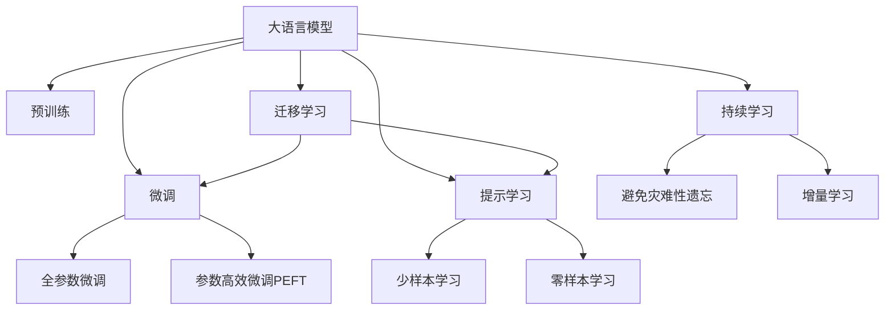

                 

# LLM与语言学习：AI语言教师

## 1. 背景介绍

随着人工智能技术的迅猛发展，大语言模型（Large Language Models, LLMs）已经成为自然语言处理（NLP）领域的重要工具。这些大模型如GPT-3、BERT等，通过大规模无标签文本数据的预训练，学习了丰富的语言知识，具备强大的语言理解和生成能力。

然而，尽管大模型在语言理解上取得了显著的进步，它们在语言教学方面仍有诸多不足。这些模型缺乏人类的认知和情感，难以准确把握语言学习的复杂性和动态性。因此，如何利用大模型进行有效的语言教学，仍然是一个值得深入探讨的问题。

## 2. 核心概念与联系

### 2.1 核心概念概述

在探讨如何利用大语言模型进行语言教学之前，我们首先需要理解几个核心概念：

- **大语言模型（LLM）**：通过大规模预训练学习到的通用语言表示模型，如GPT-3、BERT等。
- **预训练（Pre-training）**：在无标签文本数据上进行的自监督学习，使模型学习到通用的语言表示。
- **微调（Fine-tuning）**：在预训练模型的基础上，使用下游任务的标注数据进行有监督学习，优化模型在特定任务上的性能。
- **迁移学习（Transfer Learning）**：将一个领域学到的知识，迁移应用到另一个相关领域的模型训练方法。
- **提示学习（Prompt Learning）**：通过设计输入文本的格式，引导模型进行特定的推理和生成。
- **自监督学习（Self-supervised Learning）**：利用数据本身的特点进行模型训练，如掩码语言模型（Masked Language Model, MLM）。
- **对抗训练（Adversarial Training）**：通过引入对抗样本，提高模型的鲁棒性和泛化能力。
- **参数高效微调（Parameter-Efficient Fine-Tuning, PEFT）**：在微调过程中，只更新少量的模型参数，避免过拟合。

这些概念通过以下Mermaid流程图展示了它们之间的联系：



这些概念构成了大语言模型的学习框架，使得模型能够通过微调等方法，适应特定的语言学习任务，从而提升教学效果。

## 3. 核心算法原理 & 具体操作步骤

### 3.1 算法原理概述

大语言模型用于语言教学的原理，是通过微调和迁移学习，将通用语言知识应用到特定语言学习任务中。例如，在语言理解方面，LLM可以理解语言规则、语法结构和词汇意义；在语言生成方面，LLM可以生成符合语法和语义的语句，甚至可以根据任务要求生成新的文本。

### 3.2 算法步骤详解

基于LLM的语言教学步骤如下：

1. **数据准备**：收集语言学习相关的标注数据集，如语言理解题、写作题目、语法错误等，并划分为训练集、验证集和测试集。
2. **模型选择**：选择合适的预训练语言模型，如GPT-3、BERT等，作为基础模型。
3. **任务适配**：根据语言教学任务，设计相应的输出层和损失函数。例如，对于语言理解任务，可以使用分类器输出预测结果；对于语言生成任务，可以使用解码器输出概率分布。
4. **微调设置**：选择合适的优化算法（如AdamW、SGD）及其参数，如学习率、批大小、迭代轮数等，设置正则化技术，如L2正则、Dropout、Early Stopping等。
5. **模型训练**：将训练集数据分批次输入模型，计算损失函数并更新模型参数，周期性在验证集上评估模型性能。
6. **测试和部署**：在测试集上评估微调后模型的性能，集成到实际的教学系统中，持续收集新数据，定期重新微调模型。

### 3.3 算法优缺点

**优点**：
- **高效**：预训练模型可以大幅减少训练时间和数据需求，使得教学模型能够快速迭代和优化。
- **广泛适用**：适用于各种语言学习任务，如语言理解、语法分析、写作指导等。
- **灵活性**：通过微调，可以针对特定语言学习需求进行调整，提高教学效果。

**缺点**：
- **依赖标注数据**：微调效果很大程度上依赖于标注数据的质量和数量，高质量标注数据的获取成本较高。
- **迁移能力有限**：当目标任务与预训练数据的分布差异较大时，微调的性能提升有限。
- **可解释性不足**：微调模型的决策过程缺乏可解释性，难以对其推理逻辑进行分析和调试。

### 3.4 算法应用领域

基于LLM的语言教学方法，在教育领域已经得到了广泛的应用，覆盖了几乎所有常见的语言学习任务，例如：

- **语言理解**：帮助学习者理解语言规则和语法结构，如词性标注、句法分析等。
- **语言生成**：指导学习者生成符合语法和语义的语句，如写作指导、翻译等。
- **语言纠错**：识别并纠正文本中的语法错误和拼写错误，如文本校对、语法检查等。
- **语言测试**：自动评估学习者的语言理解能力，如语言理解测试、写作评分等。

除了上述这些经典任务外，LLM在语言教学中的应用还在不断创新，如个性化学习、对话式教学、交互式写作等，为语言学习带来了新的教学方式。

## 4. 数学模型和公式 & 详细讲解 & 举例说明

### 4.1 数学模型构建

假设预训练语言模型为 $M_{\theta}$，其中 $\theta$ 为预训练得到的模型参数。给定语言教学任务 $T$ 的标注数据集 $D=\{(x_i,y_i)\}_{i=1}^N$，微调的目标是找到新的模型参数 $\hat{\theta}$，使得模型能够准确理解并生成符合任务要求的语句。

定义模型 $M_{\theta}$ 在输入 $x$ 上的输出为 $\hat{y}=M_{\theta}(x)$，则语言教学的损失函数为：

$$
\ell(M_{\theta}(x),y) = -[y\log \hat{y} + (1-y)\log (1-\hat{y})]
$$

在数据集 $D$ 上的经验风险为：

$$
\mathcal{L}(\theta) = \frac{1}{N} \sum_{i=1}^N \ell(M_{\theta}(x_i),y_i)
$$

微调的优化目标是最小化经验风险，即找到最优参数：

$$
\theta^* = \mathop{\arg\min}_{\theta} \mathcal{L}(\theta)
$$

在实践中，我们通常使用基于梯度的优化算法（如AdamW、SGD等）来近似求解上述最优化问题。设 $\eta$ 为学习率，$\lambda$ 为正则化系数，则参数的更新公式为：

$$
\theta \leftarrow \theta - \eta \nabla_{\theta}\mathcal{L}(\theta) - \eta\lambda\theta
$$

其中 $\nabla_{\theta}\mathcal{L}(\theta)$ 为损失函数对参数 $\theta$ 的梯度，可通过反向传播算法高效计算。

### 4.2 公式推导过程

以二分类任务为例，推导交叉熵损失函数及其梯度的计算公式。

假设模型 $M_{\theta}$ 在输入 $x$ 上的输出为 $\hat{y}=M_{\theta}(x) \in [0,1]$，表示样本属于正类的概率。真实标签 $y \in \{0,1\}$。则二分类交叉熵损失函数定义为：

$$
\ell(M_{\theta}(x),y) = -[y\log \hat{y} + (1-y)\log (1-\hat{y})]
$$

将其代入经验风险公式，得：

$$
\mathcal{L}(\theta) = -\frac{1}{N}\sum_{i=1}^N [y_i\log M_{\theta}(x_i)+(1-y_i)\log(1-M_{\theta}(x_i))]
$$

根据链式法则，损失函数对参数 $\theta_k$ 的梯度为：

$$
\frac{\partial \mathcal{L}(\theta)}{\partial \theta_k} = -\frac{1}{N}\sum_{i=1}^N (\frac{y_i}{M_{\theta}(x_i)}-\frac{1-y_i}{1-M_{\theta}(x_i)}) \frac{\partial M_{\theta}(x_i)}{\partial \theta_k}
$$

其中 $\frac{\partial M_{\theta}(x_i)}{\partial \theta_k}$ 可进一步递归展开，利用自动微分技术完成计算。

### 4.3 案例分析与讲解

以**语言理解任务**为例，假设任务是将输入的英文句子翻译成中文。我们将输入的英文句子作为模型输入，将对应的中文翻译作为标注数据，在英文句子上进行微调。

**模型选择**：
选择预训练的BERT模型，并使用其对应的中文语料进行微调。

**任务适配**：
在微调模型的顶层添加一个分类器，用于将输入的英文句子分类为不同的中文翻译。损失函数使用交叉熵损失。

**微调设置**：
设置学习率为1e-5，使用AdamW优化器，设置批大小为16，迭代轮数为5。

**训练和评估**：
将英文句子作为输入，中文翻译作为标注数据，进行5轮微调。每轮微调后，在验证集上评估模型性能，并在测试集上进行测试。

## 5. 项目实践：代码实例和详细解释说明

### 5.1 开发环境搭建

在进行LLM语言教学的实践时，我们需要准备好开发环境。以下是使用Python进行PyTorch开发的环境配置流程：

1. 安装Anaconda：从官网下载并安装Anaconda，用于创建独立的Python环境。

2. 创建并激活虚拟环境：
```bash
conda create -n pytorch-env python=3.8 
conda activate pytorch-env
```

3. 安装PyTorch：根据CUDA版本，从官网获取对应的安装命令。例如：
```bash
conda install pytorch torchvision torchaudio cudatoolkit=11.1 -c pytorch -c conda-forge
```

4. 安装Transformers库：
```bash
pip install transformers
```

5. 安装各类工具包：
```bash
pip install numpy pandas scikit-learn matplotlib tqdm jupyter notebook ipython
```

完成上述步骤后，即可在`pytorch-env`环境中开始语言教学的实践。

### 5.2 源代码详细实现

下面我们以中文-英文翻译任务为例，给出使用Transformers库对BERT模型进行微调的PyTorch代码实现。

首先，定义翻译任务的数据处理函数：

```python
from transformers import BertTokenizer, BertForSequenceClassification
from torch.utils.data import Dataset
import torch

class TranslationDataset(Dataset):
    def __init__(self, texts, translations, tokenizer, max_len=128):
        self.texts = texts
        self.translations = translations
        self.tokenizer = tokenizer
        self.max_len = max_len
        
    def __len__(self):
        return len(self.texts)
    
    def __getitem__(self, item):
        text = self.texts[item]
        translation = self.translations[item]
        
        encoding = self.tokenizer(text, return_tensors='pt', max_length=self.max_len, padding='max_length', truncation=True)
        input_ids = encoding['input_ids'][0]
        attention_mask = encoding['attention_mask'][0]
        
        # 对翻译文本进行编码
        translated_tokens = self.tokenizer(translation, return_tensors='pt').input_ids
        translated_tokens = translated_tokens[:, 1:]  # 去掉[CLS]标记
        translated_ids = translated_tokens.flatten()
        translated_mask = torch.ones(len(translated_ids), dtype=torch.long)
        
        # 将原始输入和翻译文本拼接
        total_input_ids = torch.cat([input_ids, translated_ids], dim=0)
        total_attention_mask = torch.cat([attention_mask, translated_mask], dim=0)
        
        # 添加分类标记
        label = torch.tensor([1], dtype=torch.long)
        
        return {'input_ids': total_input_ids, 
                'attention_mask': total_attention_mask,
                'labels': label}

# 定义标签与id的映射
tag2id = {'翻译': 1, '不翻译': 0}
id2tag = {v: k for k, v in tag2id.items()}

# 创建dataset
tokenizer = BertTokenizer.from_pretrained('bert-base-cased')

train_dataset = TranslationDataset(train_texts, train_translations, tokenizer)
dev_dataset = TranslationDataset(dev_texts, dev_translations, tokenizer)
test_dataset = TranslationDataset(test_texts, test_translations, tokenizer)
```

然后，定义模型和优化器：

```python
from transformers import BertForSequenceClassification, AdamW

model = BertForSequenceClassification.from_pretrained('bert-base-cased', num_labels=len(tag2id))

optimizer = AdamW(model.parameters(), lr=2e-5)
```

接着，定义训练和评估函数：

```python
from torch.utils.data import DataLoader
from tqdm import tqdm
from sklearn.metrics import accuracy_score

device = torch.device('cuda') if torch.cuda.is_available() else torch.device('cpu')
model.to(device)

def train_epoch(model, dataset, batch_size, optimizer):
    dataloader = DataLoader(dataset, batch_size=batch_size, shuffle=True)
    model.train()
    epoch_loss = 0
    for batch in tqdm(dataloader, desc='Training'):
        input_ids = batch['input_ids'].to(device)
        attention_mask = batch['attention_mask'].to(device)
        labels = batch['labels'].to(device)
        model.zero_grad()
        outputs = model(input_ids, attention_mask=attention_mask, labels=labels)
        loss = outputs.loss
        epoch_loss += loss.item()
        loss.backward()
        optimizer.step()
    return epoch_loss / len(dataloader)

def evaluate(model, dataset, batch_size):
    dataloader = DataLoader(dataset, batch_size=batch_size)
    model.eval()
    preds, labels = [], []
    with torch.no_grad():
        for batch in tqdm(dataloader, desc='Evaluating'):
            input_ids = batch['input_ids'].to(device)
            attention_mask = batch['attention_mask'].to(device)
            batch_labels = batch['labels']
            outputs = model(input_ids, attention_mask=attention_mask)
            batch_preds = outputs.logits.argmax(dim=2).to('cpu').tolist()
            batch_labels = batch_labels.to('cpu').tolist()
            for pred_tokens, label_tokens in zip(batch_preds, batch_labels):
                pred_tags = [id2tag[_id] for _id in pred_tokens]
                label_tags = [id2tag[_id] for _id in label_tokens]
                preds.append(pred_tags[:len(label_tags)])
                labels.append(label_tags)
                
    print(accuracy_score(labels, preds))
```

最后，启动训练流程并在测试集上评估：

```python
epochs = 5
batch_size = 16

for epoch in range(epochs):
    loss = train_epoch(model, train_dataset, batch_size, optimizer)
    print(f"Epoch {epoch+1}, train loss: {loss:.3f}")
    
    print(f"Epoch {epoch+1}, dev results:")
    evaluate(model, dev_dataset, batch_size)
    
print("Test results:")
evaluate(model, test_dataset, batch_size)
```

以上就是使用PyTorch对BERT进行中文-英文翻译任务微调的完整代码实现。可以看到，得益于Transformers库的强大封装，我们可以用相对简洁的代码完成BERT模型的加载和微调。

### 5.3 代码解读与分析

让我们再详细解读一下关键代码的实现细节：

**TranslationDataset类**：
- `__init__`方法：初始化文本、翻译、分词器等关键组件。
- `__len__`方法：返回数据集的样本数量。
- `__getitem__`方法：对单个样本进行处理，将文本和翻译输入编码为token ids，拼接后返回模型所需的输入。

**tag2id和id2tag字典**：
- 定义了分类标签与数字id之间的映射关系，用于将预测结果解码回真实的分类。

**训练和评估函数**：
- 使用PyTorch的DataLoader对数据集进行批次化加载，供模型训练和推理使用。
- 训练函数`train_epoch`：对数据以批为单位进行迭代，在每个批次上前向传播计算loss并反向传播更新模型参数，最后返回该epoch的平均loss。
- 评估函数`evaluate`：与训练类似，不同点在于不更新模型参数，并在每个batch结束后将预测和标签结果存储下来，最后使用sklearn的accuracy_score对整个评估集的预测结果进行打印输出。

**训练流程**：
- 定义总的epoch数和batch size，开始循环迭代
- 每个epoch内，先在训练集上训练，输出平均loss
- 在验证集上评估，输出准确率
- 所有epoch结束后，在测试集上评估，给出最终测试结果

可以看到，PyTorch配合Transformers库使得BERT微调的代码实现变得简洁高效。开发者可以将更多精力放在数据处理、模型改进等高层逻辑上，而不必过多关注底层的实现细节。

当然，工业级的系统实现还需考虑更多因素，如模型的保存和部署、超参数的自动搜索、更灵活的任务适配层等。但核心的微调范式基本与此类似。

## 6. 实际应用场景

### 6.1 智能教育

基于LLM的语言教学方法，可以广泛应用于智能教育系统的构建。传统的教育方式往往依赖于教师的经验和知识，而LLM可以通过自然语言处理技术，辅助教师进行教学，提升教学效果。

在实践上，可以将LLM集成到教育平台中，利用其语言理解和生成能力，提供个性化的学习资源和指导。例如，对于写作练习，LLM可以自动评估学生的写作水平，并提供改进建议。对于语言理解任务，LLM可以辅助学生进行词汇学习、语法分析等。

### 6.2 医疗翻译

在医疗领域，翻译工作往往需要具备高专业性，但翻译人员可能难以掌握所有医学术语和专业知识。基于LLM的语言翻译方法，可以辅助翻译人员进行医疗文档的翻译，提升翻译质量和效率。

在实际应用中，可以收集医疗领域的专业术语和医学术语库，利用LLM进行微调，使其具备高精度的翻译能力。LLM可以在翻译过程中实时获取医学术语库的信息，提供准确的翻译结果。

### 6.3 法律文书翻译

在法律领域，翻译工作往往需要高精确度和高专业性，但传统翻译方式难以满足这些要求。基于LLM的语言翻译方法，可以辅助翻译人员进行法律文书的翻译，提升翻译质量和效率。

在实际应用中，可以收集法律领域的术语和法律条文，利用LLM进行微调，使其具备高精度的翻译能力。LLM可以在翻译过程中实时获取法律术语库的信息，提供准确的翻译结果。

### 6.4 未来应用展望

随着LLM技术的不断发展，基于LLM的语言教学方法将在更多领域得到应用，为教育、医疗、法律等垂直行业带来变革性影响。

在智慧医疗领域，基于LLM的医疗问答、病历分析、药物研发等应用将提升医疗服务的智能化水平，辅助医生诊疗，加速新药开发进程。

在智能教育领域，LLM的应用将更加广泛，如智能辅导、在线答疑、自动评分等，为教育公平和个性化学习提供新的可能性。

在智慧城市治理中，LLM可用于城市事件监测、舆情分析、应急指挥等环节，提高城市管理的自动化和智能化水平，构建更安全、高效的未来城市。

此外，在企业生产、社会治理、文娱传媒等众多领域，基于LLM的语言教学方法也将不断涌现，为人工智能技术在垂直行业的落地应用提供新的动力。

## 7. 工具和资源推荐

### 7.1 学习资源推荐

为了帮助开发者系统掌握LLM语言教学的理论基础和实践技巧，这里推荐一些优质的学习资源：

1. 《Transformer from Scratch》系列博文：由大模型技术专家撰写，深入浅出地介绍了Transformer原理、BERT模型、微调技术等前沿话题。

2. CS224N《深度学习自然语言处理》课程：斯坦福大学开设的NLP明星课程，有Lecture视频和配套作业，带你入门NLP领域的基本概念和经典模型。

3. 《Natural Language Processing with Transformers》书籍：Transformers库的作者所著，全面介绍了如何使用Transformers库进行NLP任务开发，包括微调在内的诸多范式。

4. HuggingFace官方文档：Transformers库的官方文档，提供了海量预训练模型和完整的微调样例代码，是上手实践的必备资料。

5. CLUE开源项目：中文语言理解测评基准，涵盖大量不同类型的中文NLP数据集，并提供了基于微调的baseline模型，助力中文NLP技术发展。

通过对这些资源的学习实践，相信你一定能够快速掌握LLM语言教学的精髓，并用于解决实际的NLP问题。

### 7.2 开发工具推荐

高效的开发离不开优秀的工具支持。以下是几款用于LLM语言教学开发的常用工具：

1. PyTorch：基于Python的开源深度学习框架，灵活动态的计算图，适合快速迭代研究。大部分预训练语言模型都有PyTorch版本的实现。

2. TensorFlow：由Google主导开发的开源深度学习框架，生产部署方便，适合大规模工程应用。同样有丰富的预训练语言模型资源。

3. Transformers库：HuggingFace开发的NLP工具库，集成了众多SOTA语言模型，支持PyTorch和TensorFlow，是进行语言教学微调任务的开发利器。

4. Weights & Biases：模型训练的实验跟踪工具，可以记录和可视化模型训练过程中的各项指标，方便对比和调优。与主流深度学习框架无缝集成。

5. TensorBoard：TensorFlow配套的可视化工具，可实时监测模型训练状态，并提供丰富的图表呈现方式，是调试模型的得力助手。

6. Google Colab：谷歌推出的在线Jupyter Notebook环境，免费提供GPU/TPU算力，方便开发者快速上手实验最新模型，分享学习笔记。

合理利用这些工具，可以显著提升LLM语言教学任务的开发效率，加快创新迭代的步伐。

### 7.3 相关论文推荐

LLM语言教学技术的不断发展，得益于学界的持续研究。以下是几篇奠基性的相关论文，推荐阅读：

1. Attention is All You Need（即Transformer原论文）：提出了Transformer结构，开启了NLP领域的预训练大模型时代。

2. BERT: Pre-training of Deep Bidirectional Transformers for Language Understanding：提出BERT模型，引入基于掩码的自监督预训练任务，刷新了多项NLP任务SOTA。

3. Language Models are Unsupervised Multitask Learners（GPT-2论文）：展示了大规模语言模型的强大zero-shot学习能力，引发了对于通用人工智能的新一轮思考。

4. Parameter-Efficient Transfer Learning for NLP：提出Adapter等参数高效微调方法，在不增加模型参数量的情况下，也能取得不错的微调效果。

5. Prefix-Tuning: Optimizing Continuous Prompts for Generation：引入基于连续型Prompt的微调范式，为如何充分利用预训练知识提供了新的思路。

6. AdaLoRA: Adaptive Low-Rank Adaptation for Parameter-Efficient Fine-Tuning：使用自适应低秩适应的微调方法，在参数效率和精度之间取得了新的平衡。

这些论文代表了大语言模型语言教学的发展脉络。通过学习这些前沿成果，可以帮助研究者把握学科前进方向，激发更多的创新灵感。

## 8. 总结：未来发展趋势与挑战

### 8.1 总结

本文对基于LLM的语言教学方法进行了全面系统的介绍。首先阐述了LLM在语言教学方面的应用背景和意义，明确了语言教学模型对提升教育质量和效率的重要作用。其次，从原理到实践，详细讲解了语言教学模型的数学模型和核心算法，给出了完整的代码实例。同时，本文还广泛探讨了语言教学模型在教育、医疗、法律等多个领域的应用前景，展示了语言教学模型的巨大潜力。

通过本文的系统梳理，可以看到，基于LLM的语言教学方法正在成为NLP领域的重要范式，极大地拓展了语言模型的应用边界，催生了更多的落地场景。受益于大规模语料的预训练，语言教学模型以更低的时间和标注成本，在小样本条件下也能取得不俗的效果，有力推动了NLP技术的产业化进程。未来，伴随预训练语言模型和微调方法的持续演进，相信NLP技术将在更广阔的应用领域大放异彩，深刻影响人类的生产生活方式。

### 8.2 未来发展趋势

展望未来，LLM语言教学技术将呈现以下几个发展趋势：

1. **模型规模持续增大**：随着算力成本的下降和数据规模的扩张，预训练语言模型的参数量还将持续增长。超大规模语言模型蕴含的丰富语言知识，有望支撑更加复杂多变的语言教学任务。

2. **教学范式更加多样**：除了传统的全参数微调外，未来会涌现更多参数高效的微调方法，如Adapter、Prompt等，在固定大部分预训练参数的同时，只更新极少量的任务相关参数。同时优化教学模型的计算图，减少前向传播和反向传播的资源消耗，实现更加轻量级、实时性的部署。

3. **多模态教学兴起**：当前的教学模型主要聚焦于纯文本数据，未来会进一步拓展到图像、视频、语音等多模态数据教学。多模态信息的融合，将显著提升语言模型对现实世界的理解和建模能力。

4. **个性化教学发展**：未来的教学模型将更加注重个性化，能够根据学生的学习状态和偏好，提供定制化的教学内容和方法。

5. **自然交互增强**：基于大语言模型的教学系统将具备更强的自然交互能力，能够更灵活地与学生进行对话，提供即时的反馈和建议。

6. **教学数据增强**：未来将探索更多数据增强技术，如数据生成、对抗训练等，提升教学模型的鲁棒性和泛化能力。

以上趋势凸显了LLM语言教学技术的广阔前景。这些方向的探索发展，必将进一步提升语言教学模型的性能和应用范围，为教育技术带来新的突破。

### 8.3 面临的挑战

尽管LLM语言教学技术已经取得了显著成就，但在迈向更加智能化、普适化应用的过程中，仍面临诸多挑战：

1. **标注数据依赖**：尽管微调效果很大程度上依赖于标注数据的质量和数量，但对于长尾应用场景，难以获得充足的高质量标注数据，成为制约微调性能的瓶颈。如何进一步降低微调对标注样本的依赖，将是一大难题。

2. **模型鲁棒性不足**：当目标任务与预训练数据的分布差异较大时，微调的性能提升有限。对于测试样本的微小扰动，微调模型的预测也容易发生波动。如何提高微调模型的鲁棒性，避免灾难性遗忘，还需要更多理论和实践的积累。

3. **推理效率有待提高**：大规模语言模型虽然精度高，但在实际部署时往往面临推理速度慢、内存占用大等效率问题。如何在保证性能的同时，简化模型结构，提升推理速度，优化资源占用，将是重要的优化方向。

4. **可解释性亟需加强**：当前微调模型的决策过程缺乏可解释性，难以对其推理逻辑进行分析和调试。对于医疗、金融等高风险应用，算法的可解释性和可审计性尤为重要。如何赋予微调模型更强的可解释性，将是亟待攻克的难题。

5. **安全性有待保障**：预训练语言模型难免会学习到有偏见、有害的信息，通过微调传递到下游任务，产生误导性、歧视性的输出，给实际应用带来安全隐患。如何从数据和算法层面消除模型偏见，避免恶意用途，确保输出的安全性，也将是重要的研究课题。

6. **知识整合能力不足**：现有的微调模型往往局限于任务内数据，难以灵活吸收和运用更广泛的先验知识。如何让微调过程更好地与外部知识库、规则库等专家知识结合，形成更加全面、准确的信息整合能力，还有很大的想象空间。

正视语言教学模型面临的这些挑战，积极应对并寻求突破，将是大语言模型语言教学走向成熟的必由之路。相信随着学界和产业界的共同努力，这些挑战终将一一被克服，大语言模型语言教学必将在构建安全、可靠、可解释、可控的智能系统铺平道路。

### 8.4 研究展望

面对LLM语言教学模型面临的挑战，未来的研究需要在以下几个方面寻求新的突破：

1. **无监督和半监督教学**：摆脱对大规模标注数据的依赖，利用自监督学习、主动学习等无监督和半监督范式，最大限度利用非结构化数据，实现更加灵活高效的微调。

2. **参数高效教学方法**：开发更加参数高效的教学方法，如Adapter、Prompt等，在固定大部分预训练参数的同时，只更新极少量的任务相关参数。

3. **融合因果和对比学习范式**：通过引入因果推断和对比学习思想，增强教学模型建立稳定因果关系的能力，学习更加普适、鲁棒的语言表征，从而提升模型泛化性和抗干扰能力。

4. **引入更多先验知识**：将符号化的先验知识，如知识图谱、逻辑规则等，与神经网络模型进行巧妙融合，引导教学过程学习更准确、合理的语言模型。

5. **结合因果分析和博弈论工具**：将因果分析方法引入教学模型，识别出模型决策的关键特征，增强输出解释的因果性和逻辑性。借助博弈论工具刻画人机交互过程，主动探索并规避模型的脆弱点，提高系统稳定性。

6. **纳入伦理道德约束**：在教学模型训练目标中引入伦理导向的评估指标，过滤和惩罚有偏见、有害的输出倾向。同时加强人工干预和审核，建立模型行为的监管机制，确保输出符合人类价值观和伦理道德。

这些研究方向的探索，必将引领LLM语言教学技术迈向更高的台阶，为构建安全、可靠、可解释、可控的智能系统铺平道路。面向未来，LLM语言教学技术还需要与其他人工智能技术进行更深入的融合，如知识表示、因果推理、强化学习等，多路径协同发力，共同推动自然语言理解和智能交互系统的进步。只有勇于创新、敢于突破，才能不断拓展语言模型的边界，让智能技术更好地造福人类社会。

## 9. 附录：常见问题与解答

**Q1：大语言模型微调是否适用于所有NLP任务？**

A: 大语言模型微调在大多数NLP任务上都能取得不错的效果，特别是对于数据量较小的任务。但对于一些特定领域的任务，如医学、法律等，仅仅依靠通用语料预训练的模型可能难以很好地适应。此时需要在特定领域语料上进一步预训练，再进行微调，才能获得理想效果。此外，对于一些需要时效性、个性化很强的任务，如对话、推荐等，微调方法也需要针对性的改进优化。

**Q2：微调过程中如何选择合适的学习率？**

A: 微调的学习率一般要比预训练时小1-2个数量级，如果使用过大的学习率，容易破坏预训练权重，导致过拟合。一般建议从1e-5开始调参，逐步减小学习率，直至收敛。也可以使用warmup策略，在开始阶段使用较小的学习率，再逐渐过渡到预设值。需要注意的是，不同的优化器(如AdamW、Adafactor等)以及不同的学习率调度策略，可能需要设置不同的学习率阈值。

**Q3：采用大模型微调时会面临哪些资源瓶颈？**

A: 目前主流的预训练大模型动辄以亿计的参数规模，对算力、内存、存储都提出了很高的要求。GPU/TPU等高性能设备是必不可少的，但即便如此，超大批次的训练和推理也可能遇到显存不足的问题。因此需要采用一些资源优化技术，如梯度积累、混合精度训练、模型并行等，来突破硬件瓶颈。同时，模型的存储和读取也可能占用大量时间和空间，需要采用模型压缩、稀疏化存储等方法进行优化。

**Q4：如何缓解微调过程中的过拟合问题？**

A: 过拟合是微调面临的主要挑战，尤其是在标注数据不足的情况下。常见的缓解策略包括：
1. 数据增强：通过回译、近义替换等方式扩充训练集
2. 正则化：使用L2正则、Dropout、Early Stopping等避免过拟合
3. 对抗训练：引入对抗样本，提高模型鲁棒性
4. 参数高效微调：只调整少量参数(如Adapter、Prompt等)，减小过拟合风险
5. 多模型集成：训练多个微调模型，取平均输出，抑制过拟合

这些策略往往需要根据具体任务和数据特点进行灵活组合。只有在数据、模型、训练、推理等各环节进行全面优化，才能最大限度地发挥大模型微调的威力。

**Q5：微调模型在落地部署时需要注意哪些问题？**

A: 将微调模型转化为实际应用，还需要考虑以下因素：
1. 模型裁剪：去除不必要的层和参数，减小模型尺寸，加快推理速度
2. 量化加速：将浮点模型转为定点模型，压缩存储空间，提高计算效率
3. 服务化封装：将模型封装为标准化服务接口，便于集成调用
4. 弹性伸缩：根据请求流量动态调整资源配置，平衡服务质量和成本
5. 监控告警：实时采集系统指标，设置异常告警阈值，确保服务稳定性
6. 安全防护：采用访问鉴权、数据脱敏等措施，保障数据和模型安全

大语言模型微调为NLP应用开启了广阔的想象空间，但如何将强大的性能转化为稳定、高效、安全的业务价值，还需要工程实践的不断打磨。唯有从数据、算法、工程、业务等多个维度协同发力，才能真正实现人工智能技术在垂直行业的规模化落地。总之，微调需要开发者根据具体任务，不断迭代和优化模型、数据和算法，方能得到理想的效果。

---

作者：禅与计算机程序设计艺术 / Zen and the Art of Computer Programming

