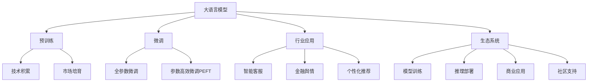

                 

# LLM产业链生态:从无到有的演进

> 关键词：大语言模型产业链,预训练,微调,行业应用,生态系统,技术演进

## 1. 背景介绍

### 1.1 问题由来

人工智能（AI）正在重塑各行各业，其中自然语言处理（NLP）作为AI的重要分支，其应用范围之广、影响力之大，已经超越了传统的IT行业。近年来，大规模语言模型（Large Language Models, LLMs）迅速崛起，以其超越人类水平的语言理解与生成能力，吸引了全世界的关注。从GPT-1到GPT-3，再到最新的GPT-4，大语言模型不断刷新着人类对智能的理解，其背后的商业价值也逐渐显现。

大语言模型产业链生态的演进，从无到有的过程，经历了技术的积累、市场的培育、应用的拓展和生态系统的建立。本文将深入探讨这一过程，为读者揭示大语言模型产业化的成功之道，及其未来可能的发展方向。

### 1.2 问题核心关键点

大语言模型产业链生态的核心关键点包括以下几点：

1. **技术积累**：从最初的序列模型到如今的Transformer架构，大语言模型在技术上的不断迭代和积累，是其发展的基石。
2. **市场培育**：通过一系列应用场景的成功实践，市场对大语言模型的需求逐步增加，推动了产业链的形成。
3. **应用拓展**：从文本生成到对话系统，再到跨模态应用，大语言模型的应用领域不断扩大。
4. **生态系统建立**：包括模型训练、推理部署、商业应用、社区支持等环节，形成了一个完整的产业链。

这些关键点共同构成了大语言模型产业链生态的形成与发展过程。

## 2. 核心概念与联系

### 2.1 核心概念概述

为了更好地理解大语言模型产业链生态的演进，我们需要明确一些核心概念：

- **大语言模型（LLM）**：如GPT-3、BERT、T5等，以Transformer架构为基础，通过大规模无标签文本数据的预训练，学习到丰富的语言知识和常识，具备强大的语言理解和生成能力。
- **预训练（Pre-training）**：在大规模无标签数据上进行自监督学习，学习通用的语言表示，为微调打下基础。
- **微调（Fine-tuning）**：在预训练模型的基础上，使用下游任务的少量标注数据，通过有监督学习优化模型在该任务上的性能。
- **行业应用**：大语言模型在各个行业中的应用，如智能客服、金融舆情、个性化推荐等。
- **生态系统**：包括模型训练、推理部署、商业应用、社区支持等环节，形成了一个完整的产业链。

这些核心概念之间的联系可以通过以下Mermaid流程图来展示：



这个流程图展示了大语言模型的核心概念及其之间的联系：

1. 大语言模型通过预训练获得基础能力。
2. 微调是对预训练模型进行任务特定的优化，可以分为全参数微调和参数高效微调（PEFT）。
3. 大语言模型在各个行业中的广泛应用，如智能客服、金融舆情、个性化推荐等。
4. 产业链生态系统包括模型训练、推理部署、商业应用、社区支持等环节。

## 3. 核心算法原理 & 具体操作步骤
### 3.1 算法原理概述

大语言模型产业链生态的演进，基于以下几个核心算法原理：

1. **预训练算法**：如自回归模型（GPT系列）、自编码器模型（BERT系列），通过在大规模无标签数据上预训练，学习通用的语言知识。
2. **微调算法**：在预训练模型的基础上，通过下游任务的少量标注数据进行微调，优化模型在该任务上的性能。
3. **参数高效微调（PEFT）**：只更新部分模型参数，保留大部分预训练权重不变，以提高微调效率和性能。
4. **对抗训练**：引入对抗样本，提高模型鲁棒性和泛化能力。
5. **持续学习**：定期更新模型，以适应数据分布的变化，保持模型性能。

这些算法原理共同构成了大语言模型产业链生态的技术基础。

### 3.2 算法步骤详解

大语言模型产业链生态的演进，涉及多个关键步骤：

**Step 1: 准备数据和模型**
- 收集大规模无标签数据，进行预训练。
- 选择适合的预训练模型，如GPT-3、BERT等。
- 设计下游任务，收集标注数据。

**Step 2: 预训练**
- 使用自监督学习方法，在无标签数据上预训练模型。
- 选择合适的预训练任务，如语言建模、掩码语言模型等。
- 定期评估预训练效果，调整训练策略。

**Step 3: 微调**
- 在预训练模型的基础上，使用下游任务的少量标注数据进行微调。
- 选择合适的微调算法，如全参数微调和参数高效微调。
- 应用正则化技术，防止过拟合。

**Step 4: 应用部署**
- 将微调后的模型应用于实际业务场景中。
- 集成模型到应用系统中，提供API接口。
- 收集用户反馈，不断优化模型性能。

**Step 5: 生态系统维护**
- 提供模型训练工具和平台，支持开发者训练和部署模型。
- 提供推理服务，支持实时调用模型。
- 提供社区支持，包括技术文档、用户论坛等。

### 3.3 算法优缺点

大语言模型产业链生态的演进，在技术上不断进步，但在应用和部署中，也面临一些挑战：

**优点：**
1. **通用性强**：预训练模型适用于各种NLP任务，可以大幅减少从头训练的时间和成本。
2. **性能提升显著**：微调后的模型在特定任务上，通常能取得比从头训练更好的效果。
3. **参数高效**：通过参数高效微调方法，可以在保持预训练权重不变的情况下，更新少量参数，提高微调效率。
4. **应用广泛**：大语言模型已经广泛应用于智能客服、金融舆情、个性化推荐等多个行业，推动了NLP技术的应用落地。

**缺点：**
1. **标注数据依赖**：微调的效果很大程度上取决于标注数据的质量和数量，获取高质量标注数据的成本较高。
2. **过拟合风险**：在微调过程中，容易发生过拟合，尤其是在标注数据不足的情况下。
3. **技术门槛高**：构建完整的大语言模型产业链生态，需要跨领域的技术积累和应用经验。
4. **资源消耗大**：大规模语言模型在计算资源和存储空间上的消耗较大，需要高性能计算设备和存储设备。

### 3.4 算法应用领域

大语言模型产业链生态在多个领域得到了广泛应用，包括：

- **智能客服**：通过微调后的对话模型，可以构建7x24小时不间断的智能客服系统，提升客户体验和问题解决效率。
- **金融舆情监测**：使用微调后的情感分析模型，可以实时监测金融市场的舆情动向，辅助金融机构及时应对市场变化。
- **个性化推荐**：通过微调后的个性化推荐模型，可以根据用户行为数据，推荐符合用户兴趣的个性化内容。
- **医疗问答系统**：利用微调后的问答模型，可以提供医疗领域的智能问答服务，辅助医生诊疗。
- **智能写作助手**：使用微调后的语言生成模型，可以辅助用户进行文本撰写、摘要生成等任务。

## 4. 数学模型和公式 & 详细讲解  
### 4.1 数学模型构建

大语言模型产业链生态的演进，涉及多个数学模型和公式的推导。

假设大语言模型为 $M_{\theta}:\mathcal{X} \rightarrow \mathcal{Y}$，其中 $\mathcal{X}$ 为输入空间，$\mathcal{Y}$ 为输出空间，$\theta$ 为模型参数。假设微调任务的训练集为 $D=\{(x_i,y_i)\}_{i=1}^N, x_i \in \mathcal{X}, y_i \in \mathcal{Y}$。

定义模型 $M_{\theta}$ 在数据样本 $(x,y)$ 上的损失函数为 $\ell(M_{\theta}(x),y)$，则在数据集 $D$ 上的经验风险为：

$$
\mathcal{L}(\theta) = \frac{1}{N} \sum_{i=1}^N \ell(M_{\theta}(x_i),y_i)
$$

微调的优化目标是最小化经验风险，即找到最优参数：

$$
\theta^* = \mathop{\arg\min}_{\theta} \mathcal{L}(\theta)
$$

在实践中，我们通常使用基于梯度的优化算法（如SGD、Adam等）来近似求解上述最优化问题。设 $\eta$ 为学习率，$\lambda$ 为正则化系数，则参数的更新公式为：

$$
\theta \leftarrow \theta - \eta \nabla_{\theta}\mathcal{L}(\theta) - \eta\lambda\theta
$$

其中 $\nabla_{\theta}\mathcal{L}(\theta)$ 为损失函数对参数 $\theta$ 的梯度，可通过反向传播算法高效计算。

### 4.2 公式推导过程

以下我们以二分类任务为例，推导交叉熵损失函数及其梯度的计算公式。

假设模型 $M_{\theta}$ 在输入 $x$ 上的输出为 $\hat{y}=M_{\theta}(x) \in [0,1]$，表示样本属于正类的概率。真实标签 $y \in \{0,1\}$。则二分类交叉熵损失函数定义为：

$$
\ell(M_{\theta}(x),y) = -[y\log \hat{y} + (1-y)\log (1-\hat{y})]
$$

将其代入经验风险公式，得：

$$
\mathcal{L}(\theta) = -\frac{1}{N}\sum_{i=1}^N [y_i\log M_{\theta}(x_i)+(1-y_i)\log(1-M_{\theta}(x_i))]
$$

根据链式法则，损失函数对参数 $\theta_k$ 的梯度为：

$$
\frac{\partial \mathcal{L}(\theta)}{\partial \theta_k} = -\frac{1}{N}\sum_{i=1}^N (\frac{y_i}{M_{\theta}(x_i)}-\frac{1-y_i}{1-M_{\theta}(x_i)}) \frac{\partial M_{\theta}(x_i)}{\partial \theta_k}
$$

其中 $\frac{\partial M_{\theta}(x_i)}{\partial \theta_k}$ 可进一步递归展开，利用自动微分技术完成计算。

### 4.3 案例分析与讲解

以医疗问答系统为例，分析微调后模型的构建和应用。

**Step 1: 准备数据和模型**
- 收集医疗领域的问答对数据，标注医学知识标签。
- 选择BERT模型作为预训练模型，在无标签医疗数据上预训练。

**Step 2: 微调**
- 在预训练模型的基础上，使用标注数据集进行微调。
- 设计分类任务，微调后的模型可以预测问题对应的医学知识标签。
- 应用对抗训练，提高模型鲁棒性。

**Step 3: 应用部署**
- 将微调后的模型集成到医疗问答系统中。
- 提供API接口，支持医生和患者通过自然语言进行问答。
- 定期评估模型性能，收集用户反馈，持续优化模型。

## 5. 项目实践：代码实例和详细解释说明
### 5.1 开发环境搭建

在进行大语言模型产业链生态的演进实践前，我们需要准备好开发环境。以下是使用Python进行PyTorch开发的环境配置流程：

1. 安装Anaconda：从官网下载并安装Anaconda，用于创建独立的Python环境。

2. 创建并激活虚拟环境：
```bash
conda create -n pytorch-env python=3.8 
conda activate pytorch-env
```

3. 安装PyTorch：根据CUDA版本，从官网获取对应的安装命令。例如：
```bash
conda install pytorch torchvision torchaudio cudatoolkit=11.1 -c pytorch -c conda-forge
```

4. 安装Transformers库：
```bash
pip install transformers
```

5. 安装各类工具包：
```bash
pip install numpy pandas scikit-learn matplotlib tqdm jupyter notebook ipython
```

完成上述步骤后，即可在`pytorch-env`环境中开始实践。

### 5.2 源代码详细实现

这里以医疗问答系统为例，给出使用Transformers库对BERT模型进行微调的PyTorch代码实现。

首先，定义医疗问答系统的数据处理函数：

```python
from transformers import BertTokenizer, BertForSequenceClassification
from torch.utils.data import Dataset
import torch

class MedicalQADataset(Dataset):
    def __init__(self, texts, tags, tokenizer, max_len=128):
        self.texts = texts
        self.tags = tags
        self.tokenizer = tokenizer
        self.max_len = max_len
        
    def __len__(self):
        return len(self.texts)
    
    def __getitem__(self, item):
        text = self.texts[item]
        tags = self.tags[item]
        
        encoding = self.tokenizer(text, return_tensors='pt', max_length=self.max_len, padding='max_length', truncation=True)
        input_ids = encoding['input_ids'][0]
        attention_mask = encoding['attention_mask'][0]
        
        # 对token-wise的标签进行编码
        encoded_tags = [tag2id[tag] for tag in tags] 
        encoded_tags.extend([tag2id['O']] * (self.max_len - len(encoded_tags)))
        labels = torch.tensor(encoded_tags, dtype=torch.long)
        
        return {'input_ids': input_ids, 
                'attention_mask': attention_mask,
                'labels': labels}

# 标签与id的映射
tag2id = {'O': 0, 'B-MED': 1, 'I-MED': 2}
id2tag = {v: k for k, v in tag2id.items()}

# 创建dataset
tokenizer = BertTokenizer.from_pretrained('bert-base-cased')

train_dataset = MedicalQADataset(train_texts, train_tags, tokenizer)
dev_dataset = MedicalQADataset(dev_texts, dev_tags, tokenizer)
test_dataset = MedicalQADataset(test_texts, test_tags, tokenizer)
```

然后，定义模型和优化器：

```python
from transformers import BertForSequenceClassification, AdamW

model = BertForSequenceClassification.from_pretrained('bert-base-cased', num_labels=len(tag2id))

optimizer = AdamW(model.parameters(), lr=2e-5)
```

接着，定义训练和评估函数：

```python
from torch.utils.data import DataLoader
from tqdm import tqdm
from sklearn.metrics import classification_report

device = torch.device('cuda') if torch.cuda.is_available() else torch.device('cpu')
model.to(device)

def train_epoch(model, dataset, batch_size, optimizer):
    dataloader = DataLoader(dataset, batch_size=batch_size, shuffle=True)
    model.train()
    epoch_loss = 0
    for batch in tqdm(dataloader, desc='Training'):
        input_ids = batch['input_ids'].to(device)
        attention_mask = batch['attention_mask'].to(device)
        labels = batch['labels'].to(device)
        model.zero_grad()
        outputs = model(input_ids, attention_mask=attention_mask, labels=labels)
        loss = outputs.loss
        epoch_loss += loss.item()
        loss.backward()
        optimizer.step()
    return epoch_loss / len(dataloader)

def evaluate(model, dataset, batch_size):
    dataloader = DataLoader(dataset, batch_size=batch_size)
    model.eval()
    preds, labels = [], []
    with torch.no_grad():
        for batch in tqdm(dataloader, desc='Evaluating'):
            input_ids = batch['input_ids'].to(device)
            attention_mask = batch['attention_mask'].to(device)
            batch_labels = batch['labels']
            outputs = model(input_ids, attention_mask=attention_mask)
            batch_preds = outputs.logits.argmax(dim=2).to('cpu').tolist()
            batch_labels = batch_labels.to('cpu').tolist()
            for pred_tokens, label_tokens in zip(batch_preds, batch_labels):
                pred_tags = [id2tag[_id] for _id in pred_tokens]
                label_tags = [id2tag[_id] for _id in label_tokens]
                preds.append(pred_tags[:len(label_tags)])
                labels.append(label_tags)
                
    print(classification_report(labels, preds))
```

最后，启动训练流程并在测试集上评估：

```python
epochs = 5
batch_size = 16

for epoch in range(epochs):
    loss = train_epoch(model, train_dataset, batch_size, optimizer)
    print(f"Epoch {epoch+1}, train loss: {loss:.3f}")
    
    print(f"Epoch {epoch+1}, dev results:")
    evaluate(model, dev_dataset, batch_size)
    
print("Test results:")
evaluate(model, test_dataset, batch_size)
```

以上就是使用PyTorch对BERT进行医疗问答系统微调的完整代码实现。可以看到，得益于Transformers库的强大封装，我们可以用相对简洁的代码完成BERT模型的加载和微调。

### 5.3 代码解读与分析

让我们再详细解读一下关键代码的实现细节：

**MedicalQADataset类**：
- `__init__`方法：初始化文本、标签、分词器等关键组件。
- `__len__`方法：返回数据集的样本数量。
- `__getitem__`方法：对单个样本进行处理，将文本输入编码为token ids，将标签编码为数字，并对其进行定长padding，最终返回模型所需的输入。

**tag2id和id2tag字典**：
- 定义了标签与数字id之间的映射关系，用于将token-wise的预测结果解码回真实的标签。

**训练和评估函数**：
- 使用PyTorch的DataLoader对数据集进行批次化加载，供模型训练和推理使用。
- 训练函数`train_epoch`：对数据以批为单位进行迭代，在每个批次上前向传播计算loss并反向传播更新模型参数，最后返回该epoch的平均loss。
- 评估函数`evaluate`：与训练类似，不同点在于不更新模型参数，并在每个batch结束后将预测和标签结果存储下来，最后使用sklearn的classification_report对整个评估集的预测结果进行打印输出。

**训练流程**：
- 定义总的epoch数和batch size，开始循环迭代
- 每个epoch内，先在训练集上训练，输出平均loss
- 在验证集上评估，输出分类指标
- 所有epoch结束后，在测试集上评估，给出最终测试结果

可以看到，PyTorch配合Transformers库使得BERT微调的代码实现变得简洁高效。开发者可以将更多精力放在数据处理、模型改进等高层逻辑上，而不必过多关注底层的实现细节。

当然，工业级的系统实现还需考虑更多因素，如模型的保存和部署、超参数的自动搜索、更灵活的任务适配层等。但核心的微调范式基本与此类似。

## 6. 实际应用场景
### 6.1 智能客服系统

基于大语言模型微调的对话技术，可以广泛应用于智能客服系统的构建。传统客服往往需要配备大量人力，高峰期响应缓慢，且一致性和专业性难以保证。而使用微调后的对话模型，可以7x24小时不间断服务，快速响应客户咨询，用自然流畅的语言解答各类常见问题。

在技术实现上，可以收集企业内部的历史客服对话记录，将问题和最佳答复构建成监督数据，在此基础上对预训练对话模型进行微调。微调后的对话模型能够自动理解用户意图，匹配最合适的答案模板进行回复。对于客户提出的新问题，还可以接入检索系统实时搜索相关内容，动态组织生成回答。如此构建的智能客服系统，能大幅提升客户咨询体验和问题解决效率。

### 6.2 金融舆情监测

金融机构需要实时监测市场舆论动向，以便及时应对负面信息传播，规避金融风险。传统的人工监测方式成本高、效率低，难以应对网络时代海量信息爆发的挑战。基于大语言模型微调的文本分类和情感分析技术，为金融舆情监测提供了新的解决方案。

具体而言，可以收集金融领域相关的新闻、报道、评论等文本数据，并对其进行主题标注和情感标注。在此基础上对预训练语言模型进行微调，使其能够自动判断文本属于何种主题，情感倾向是正面、中性还是负面。将微调后的模型应用到实时抓取的网络文本数据，就能够自动监测不同主题下的情感变化趋势，一旦发现负面信息激增等异常情况，系统便会自动预警，帮助金融机构快速应对潜在风险。

### 6.3 个性化推荐系统

当前的推荐系统往往只依赖用户的历史行为数据进行物品推荐，无法深入理解用户的真实兴趣偏好。基于大语言模型微调技术，个性化推荐系统可以更好地挖掘用户行为背后的语义信息，从而提供更精准、多样的推荐内容。

在实践中，可以收集用户浏览、点击、评论、分享等行为数据，提取和用户交互的物品标题、描述、标签等文本内容。将文本内容作为模型输入，用户的后续行为（如是否点击、购买等）作为监督信号，在此基础上微调预训练语言模型。微调后的模型能够从文本内容中准确把握用户的兴趣点。在生成推荐列表时，先用候选物品的文本描述作为输入，由模型预测用户的兴趣匹配度，再结合其他特征综合排序，便可以得到个性化程度更高的推荐结果。

### 6.4 未来应用展望

随着大语言模型和微调方法的不断发展，基于微调范式将在更多领域得到应用，为传统行业带来变革性影响。

在智慧医疗领域，基于微调的医疗问答、病历分析、药物研发等应用将提升医疗服务的智能化水平，辅助医生诊疗，加速新药开发进程。

在智能教育领域，微调技术可应用于作业批改、学情分析、知识推荐等方面，因材施教，促进教育公平，提高教学质量。

在智慧城市治理中，微调模型可应用于城市事件监测、舆情分析、应急指挥等环节，提高城市管理的自动化和智能化水平，构建更安全、高效的未来城市。

此外，在企业生产、社会治理、文娱传媒等众多领域，基于大模型微调的人工智能应用也将不断涌现，为经济社会发展注入新的动力。相信随着技术的日益成熟，微调方法将成为人工智能落地应用的重要范式，推动人工智能技术在垂直行业的规模化落地。总之，微调需要开发者根据具体任务，不断迭代和优化模型、数据和算法，方能得到理想的效果。

## 7. 工具和资源推荐
### 7.1 学习资源推荐

为了帮助开发者系统掌握大语言模型产业链生态的理论基础和实践技巧，这里推荐一些优质的学习资源：

1. 《Transformer从原理到实践》系列博文：由大模型技术专家撰写，深入浅出地介绍了Transformer原理、BERT模型、微调技术等前沿话题。

2. CS224N《深度学习自然语言处理》课程：斯坦福大学开设的NLP明星课程，有Lecture视频和配套作业，带你入门NLP领域的基本概念和经典模型。

3. 《Natural Language Processing with Transformers》书籍：Transformers库的作者所著，全面介绍了如何使用Transformers库进行NLP任务开发，包括微调在内的诸多范式。

4. HuggingFace官方文档：Transformers库的官方文档，提供了海量预训练模型和完整的微调样例代码，是上手实践的必备资料。

5. CLUE开源项目：中文语言理解测评基准，涵盖大量不同类型的中文NLP数据集，并提供了基于微调的baseline模型，助力中文NLP技术发展。

通过对这些资源的学习实践，相信你一定能够快速掌握大语言模型微调的精髓，并用于解决实际的NLP问题。
###  7.2 开发工具推荐

高效的开发离不开优秀的工具支持。以下是几款用于大语言模型微调开发的常用工具：

1. PyTorch：基于Python的开源深度学习框架，灵活动态的计算图，适合快速迭代研究。大部分预训练语言模型都有PyTorch版本的实现。

2. TensorFlow：由Google主导开发的开源深度学习框架，生产部署方便，适合大规模工程应用。同样有丰富的预训练语言模型资源。

3. Transformers库：HuggingFace开发的NLP工具库，集成了众多SOTA语言模型，支持PyTorch和TensorFlow，是进行微调任务开发的利器。

4. Weights & Biases：模型训练的实验跟踪工具，可以记录和可视化模型训练过程中的各项指标，方便对比和调优。与主流深度学习框架无缝集成。

5. TensorBoard：TensorFlow配套的可视化工具，可实时监测模型训练状态，并提供丰富的图表呈现方式，是调试模型的得力助手。

6. Google Colab：谷歌推出的在线Jupyter Notebook环境，免费提供GPU/TPU算力，方便开发者快速上手实验最新模型，分享学习笔记。

合理利用这些工具，可以显著提升大语言模型微调任务的开发效率，加快创新迭代的步伐。

### 7.3 相关论文推荐

大语言模型和微调技术的发展源于学界的持续研究。以下是几篇奠基性的相关论文，推荐阅读：

1. Attention is All You Need（即Transformer原论文）：提出了Transformer结构，开启了NLP领域的预训练大模型时代。

2. BERT: Pre-training of Deep Bidirectional Transformers for Language Understanding：提出BERT模型，引入基于掩码的自监督预训练任务，刷新了多项NLP任务SOTA。

3. Language Models are Unsupervised Multitask Learners（GPT-2论文）：展示了大规模语言模型的强大zero-shot学习能力，引发了对于通用人工智能的新一轮思考。

4. Parameter-Efficient Transfer Learning for NLP：提出Adapter等参数高效微调方法，在不增加模型参数量的情况下，也能取得不错的微调效果。

5. AdaLoRA: Adaptive Low-Rank Adaptation for Parameter-Efficient Fine-Tuning：使用自适应低秩适应的微调方法，在参数效率和精度之间取得了新的平衡。

这些论文代表了大语言模型微调技术的发展脉络。通过学习这些前沿成果，可以帮助研究者把握学科前进方向，激发更多的创新灵感。

## 8. 总结：未来发展趋势与挑战
### 8.1 总结

本文对大语言模型产业链生态的演进进行了全面系统的介绍。首先阐述了大语言模型和微调技术的研究背景和意义，明确了微调在拓展预训练模型应用、提升下游任务性能方面的独特价值。其次，从原理到实践，详细讲解了微调过程中的关键步骤和关键技术，给出了微调任务开发的完整代码实例。同时，本文还广泛探讨了微调方法在智能客服、金融舆情、个性化推荐等多个行业领域的应用前景，展示了微调范式的巨大潜力。此外，本文精选了微调技术的各类学习资源，力求为读者提供全方位的技术指引。

通过本文的系统梳理，可以看到，大语言模型产业链生态的演进是一个技术积累、市场培育、应用拓展和生态系统建立的过程。在这一过程中，技术的不断迭代、算力的持续提升、数据的不断积累和应用场景的不断丰富，共同推动了大语言模型产业链生态的快速发展。未来，伴随预训练语言模型和微调方法的持续演进，大语言模型产业链生态必将在更广阔的应用领域大放异彩，深刻影响人类的生产生活方式。

### 8.2 未来发展趋势

展望未来，大语言模型产业链生态的发展趋势如下：

1. **技术不断演进**：大语言模型在模型规模、参数高效微调、持续学习等方面将持续进步，推动其性能的不断提升。
2. **应用场景丰富**：随着技术的发展，大语言模型将在更多领域得到应用，如医疗、教育、智能城市等，带来全新的创新和变革。
3. **生态系统完善**：预训练模型、推理服务、社区支持等环节将更加完善，形成更加完整的大语言模型产业链。
4. **跨领域融合**：大语言模型将与知识图谱、逻辑推理、多模态信息融合等技术进一步结合，提升其跨领域迁移能力和通用性。

以上趋势凸显了大语言模型产业链生态的广阔前景。这些方向的探索发展，必将进一步提升大语言模型系统的性能和应用范围，为人类认知智能的进化带来深远影响。

### 8.3 面临的挑战

尽管大语言模型产业链生态已经取得了瞩目成就，但在迈向更加智能化、普适化应用的过程中，它仍面临着诸多挑战：

1. **技术门槛高**：大语言模型的构建和微调需要跨领域的技术积累和应用经验，对开发者提出了较高的要求。
2. **数据依赖大**：微调的效果很大程度上取决于标注数据的质量和数量，获取高质量标注数据的成本较高。
3. **伦理与安全**：大语言模型可能学习到有偏见、有害的信息，需要通过数据筛选、模型训练等手段减少有害内容的输出。
4. **计算资源消耗大**：大规模语言模型在计算资源和存储空间上的消耗较大，需要高性能计算设备和存储设备。

### 8.4 研究展望

面对大语言模型产业链生态面临的挑战，未来的研究需要在以下几个方面寻求新的突破：

1. **降低对标注数据的依赖**：探索无监督和半监督微调方法，利用自监督学习、主动学习等无监督和半监督范式，最大限度利用非结构化数据。
2. **提高模型鲁棒性**：研究模型鲁棒性和泛化能力的提升方法，提高模型在不同数据分布上的表现。
3. **提升推理效率**：优化模型结构和计算图，提升推理速度和资源占用，实现更加轻量级、实时性的部署。
4. **增强可解释性**：赋予模型更强的可解释性，通过因果分析和博弈论工具，提高系统的稳定性和安全性。
5. **强化跨领域迁移能力**：加强不同模态数据的整合，实现视觉、语音等多模态信息与文本信息的协同建模。

这些研究方向将引领大语言模型产业链生态的不断进步，为构建安全、可靠、可解释、可控的智能系统铺平道路。面向未来，大语言模型产业链生态需要更多跨领域的合作与创新，共同推动人工智能技术在各个行业的应用与发展。总之，微调需要开发者根据具体任务，不断迭代和优化模型、数据和算法，方能得到理想的效果。

---

作者：禅与计算机程序设计艺术 / Zen and the Art of Computer Programming

