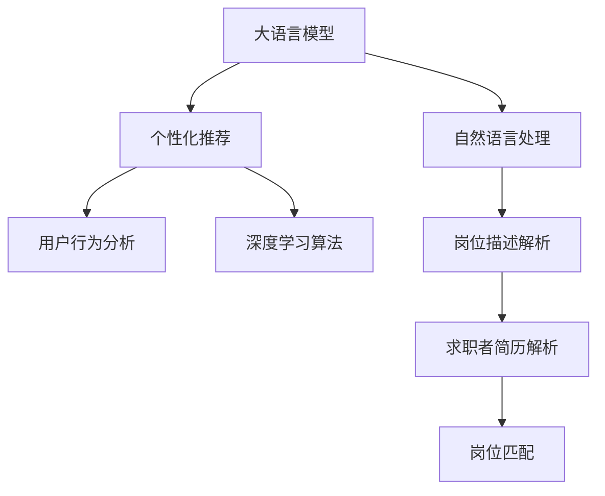

                 

# LLM在job推荐中的创新应用

> 关键词：大语言模型,职推荐系统,个性化推荐,用户行为分析,自然语言处理(NLP),深度学习,推荐算法

## 1. 背景介绍

### 1.1 问题由来
随着全球经济和科技的发展，人力资源市场的需求日益增加，如何高效、精准地匹配职业和应聘者，成为了企业人力资源管理的关键问题。传统的招聘方式往往依赖于人工筛选简历和面试，耗费大量时间和成本，且存在主观偏见。而基于大语言模型的推荐系统，可以自动化地筛选和匹配，提高招聘效率，减少成本，提升求职者体验。

### 1.2 问题核心关键点
大语言模型(LLM)在job推荐中的应用，主要集中在以下几个方面：

- **个性化推荐**：利用大语言模型的预训练知识，根据求职者背景和职业偏好，推荐最匹配的岗位。
- **用户行为分析**：通过分析求职者的浏览记录、投递行为等数据，预测其未来的求职意向和兴趣变化。
- **自然语言处理**：利用NLP技术解析岗位描述和求职者简历，自动提取关键信息进行匹配。
- **深度学习算法**：使用深度学习算法对用户行为和岗位信息进行建模，提升推荐精度。

这些关键点构成了基于大语言模型的job推荐系统的核心技术框架，使其在提高招聘效率、减少成本、提升求职者体验等方面具有显著优势。

### 1.3 问题研究意义
基于大语言模型的job推荐系统，通过深度学习和自然语言处理技术，实现了人力资源管理的自动化和智能化，具有以下重要意义：

1. **提高招聘效率**：通过自动化筛选和推荐，大幅缩短招聘周期，提高招聘效率。
2. **降低成本**：减少人工筛选和面试的资源投入，降低招聘成本。
3. **提升求职体验**：提供更加精准的岗位推荐，帮助求职者快速找到理想的工作机会，提升求职体验。
4. **增强匹配精度**：利用大语言模型的预训练知识，提高岗位和求职者的匹配精度，提升招聘效果。
5. **辅助决策支持**：通过分析和预测求职者的行为和意向，辅助企业进行更科学的招聘决策。

通过本文的介绍，相信读者将对大语言模型在job推荐中的创新应用有更深入的理解，并能够根据自身需求进行实践和优化。

## 2. 核心概念与联系

### 2.1 核心概念概述

为了更好地理解大语言模型在job推荐中的应用，本节将介绍几个密切相关的核心概念：

- **大语言模型(LLM)**：如BERT、GPT等，通过大规模语料预训练，学习语言知识，具备强大的自然语言理解能力。
- **自然语言处理(NLP)**：利用算法和模型处理、分析、理解、生成自然语言的技术，是job推荐系统的重要支撑。
- **个性化推荐**：根据用户的历史行为和特征，推荐最匹配的内容，提升用户满意度。
- **用户行为分析**：通过数据挖掘和分析，理解用户的兴趣和需求，预测其未来的行为。
- **深度学习算法**：如协同过滤、神经网络等，用于构建推荐模型的学习模型。

这些核心概念之间的逻辑关系可以通过以下Mermaid流程图来展示：



这个流程图展示了大语言模型在job推荐中的核心概念及其之间的关系：

1. 大语言模型通过预训练获得语言理解能力。
2. 自然语言处理解析岗位和求职者文本，提取关键信息。
3. 个性化推荐根据用户历史行为，推荐匹配的岗位。
4. 用户行为分析预测求职者的未来行为和意向。
5. 深度学习算法构建推荐模型的学习模型。

这些概念共同构成了大语言模型在job推荐中的应用框架，使其能够高效、精准地匹配岗位和求职者。

## 3. 核心算法原理 & 具体操作步骤
### 3.1 算法原理概述

基于大语言模型的job推荐系统，通过自然语言处理技术，自动解析岗位和求职者文本，提取关键信息。然后利用深度学习算法，构建用户行为和岗位信息的推荐模型，最终通过个性化推荐，实现精准匹配。

具体而言，该系统包含以下几个关键步骤：

1. **岗位描述和简历解析**：利用NLP技术，自动提取岗位和求职者文本中的关键信息，如职位名称、要求、职责等。
2. **用户行为分析**：通过分析求职者的浏览记录、投递行为等数据，预测其未来的求职意向和兴趣变化。
3. **岗位匹配**：将解析后的岗位信息与求职者简历进行匹配，找到最匹配的岗位。
4. **个性化推荐**：根据求职者的行为和历史数据，推荐最匹配的岗位。

### 3.2 算法步骤详解

#### 3.2.1 岗位描述和简历解析

岗位描述和简历解析是job推荐系统的基础步骤，主要使用NLP技术进行。以下是具体的算法步骤：

1. **文本预处理**：去除文本中的噪音，如HTML标签、标点符号等，进行分词、去停用词等处理。
2. **实体抽取**：利用命名实体识别(NER)技术，提取文本中的职位名称、机构名等关键实体。
3. **语义分析**：使用词向量模型，将实体和文本映射为向量，计算相似度。
4. **信息抽取**：利用依存句法分析等技术，抽取文本中的关键信息，如要求、职责等。

这些步骤通过pipeline的方式串联起来，自动解析岗位和求职者文本，提取关键信息。

#### 3.2.2 用户行为分析

用户行为分析主要通过数据挖掘和机器学习算法实现。以下是具体的算法步骤：

1. **数据收集**：收集求职者的浏览记录、投递行为等数据。
2. **特征提取**：提取用户行为的关键特征，如浏览时长、职位类型、公司规模等。
3. **模型训练**：使用协同过滤、神经网络等算法，构建用户行为模型，预测其未来的求职意向和兴趣变化。
4. **意图识别**：使用分类算法，将用户行为分类为不同意向，如求职意向、猎头咨询、培训等。

通过用户行为分析，可以更好地理解用户的兴趣和需求，预测其未来的行为，从而实现更精准的推荐。

#### 3.2.3 岗位匹配

岗位匹配主要使用基于相似度的方法，将岗位信息和求职者简历进行匹配。以下是具体的算法步骤：

1. **文本相似度计算**：计算岗位描述和求职者简历的文本相似度，常用的相似度计算方法包括余弦相似度、Jaccard相似度等。
2. **实体匹配**：将岗位描述和求职者简历中的关键实体进行匹配，找到最匹配的实体对。
3. **综合评分**：将文本相似度和实体匹配结果综合评分，得到岗位与求职者的匹配度。

通过岗位匹配，可以快速找到最匹配的岗位，提升推荐精度。

#### 3.2.4 个性化推荐

个性化推荐主要基于用户历史行为和特征，利用深度学习算法进行建模。以下是具体的算法步骤：

1. **特征提取**：提取用户历史行为的关键特征，如浏览记录、投递行为、职位偏好等。
2. **模型训练**：使用神经网络等深度学习算法，构建推荐模型，学习用户行为与岗位的映射关系。
3. **推荐生成**：根据用户的当前行为和特征，生成个性化推荐列表。

通过个性化推荐，可以提升推荐系统的精准度和用户满意度。

### 3.3 算法优缺点

基于大语言模型的job推荐系统具有以下优点：

1. **高效自动化**：自动解析岗位和求职者文本，提取关键信息，实现高效的自动化匹配。
2. **精准推荐**：利用深度学习算法，构建精准的推荐模型，提升推荐精度。
3. **用户友好**：通过自然语言处理技术，提供更自然的用户交互体验，提升用户满意度。
4. **灵活性高**：可以根据不同行业和岗位的特点，灵活设计推荐算法。

同时，该系统也存在一些局限性：

1. **数据依赖性高**：推荐系统的性能很大程度上取决于岗位和求职者数据的数量和质量。
2. **泛化能力有限**：由于数据的差异性，推荐系统在不同行业和岗位上的泛化能力可能有限。
3. **隐私风险**：收集和处理求职者数据，需要考虑隐私保护问题，避免数据泄露。
4. **计算资源需求高**：深度学习模型的训练和推理需要大量的计算资源，可能导致成本较高。

尽管存在这些局限性，但就目前而言，基于大语言模型的job推荐系统仍是大规模企业招聘的理想选择。未来相关研究的重点在于如何进一步降低数据依赖，提高泛化能力，同时兼顾隐私保护和计算资源效率。

### 3.4 算法应用领域

基于大语言模型的job推荐系统，已经在多个领域得到了应用，例如：

- **招聘平台**：如LinkedIn、Indeed、前程无忧等，通过推荐系统提升求职者体验和匹配精度。
- **企业内部招聘**：大型企业通过内部推荐系统，提高招聘效率，降低人力成本。
- **猎头服务**：猎头公司通过推荐系统，精准匹配候选人和职位，提升服务质量。
- **人才流动分析**：通过分析求职者的流动数据，预测人才需求变化，辅助企业进行战略规划。
- **员工职业发展**：企业通过推荐系统，帮助员工发现和匹配合适的职业发展机会，提升员工满意度。

除了上述这些经典应用外，基于大语言模型的推荐系统还被创新性地应用于招聘广告投放、猎头培训、校园招聘等多个场景中，为招聘行业带来了新的突破。

## 4. 数学模型和公式 & 详细讲解  
### 4.1 数学模型构建

假设岗位描述为 $d$，求职者简历为 $r$，用户行为特征为 $u$。推荐模型的目标是最大化用户对推荐结果的满意度，即最大化如下目标函数：

$$
\max_{\theta} \sum_{i=1}^{N} f_{\theta}(d_i, r_i, u_i)
$$

其中 $f_{\theta}(\cdot)$ 为推荐模型，$\theta$ 为模型参数。推荐模型的输入为岗位描述 $d$、求职者简历 $r$ 和用户行为特征 $u$，输出为推荐结果 $o$。

在实践中，通常使用深度神经网络作为推荐模型 $f_{\theta}$，如循环神经网络(RNN)、卷积神经网络(CNN)等。

### 4.2 公式推导过程

以一个简单的神经网络为例，推导推荐模型的基本结构。假设推荐模型 $f_{\theta}$ 为多层神经网络，结构如下：

$$
o = f_{\theta}(d, r, u) = \sigma(W_1 \sigma(W_2 \sigma(W_3 [d; r; u]))
$$

其中 $W_i$ 为神经网络参数，$\sigma$ 为激活函数。将 $[d; r; u]$ 拼接为特征向量，通过多层神经网络处理后得到推荐结果 $o$。

将目标函数展开，得到：

$$
\max_{\theta} \sum_{i=1}^{N} \left[\log P_{\theta}(y_i|d_i, r_i, u_i)\right]
$$

其中 $y_i$ 为推荐结果，$P_{\theta}(y_i|d_i, r_i, u_i)$ 为模型的预测概率。

通过最大化预测概率，可以提升推荐系统的用户满意度。

### 4.3 案例分析与讲解

以下以一个实际案例，展示如何使用大语言模型构建job推荐系统。

假设某招聘平台收集了大量的岗位描述和求职者简历，希望利用这些数据，为求职者推荐最匹配的岗位。平台数据集包含1000个岗位和1000个求职者，每个岗位描述和简历包含几百个特征。

1. **数据预处理**：去除文本中的噪音，进行分词、去停用词等处理。
2. **特征提取**：提取每个岗位和求职者简历的关键特征，如职位名称、要求、职责等。
3. **相似度计算**：使用余弦相似度计算岗位描述和简历的相似度。
4. **实体匹配**：将岗位描述和简历中的关键实体进行匹配，找到最匹配的实体对。
5. **综合评分**：将文本相似度和实体匹配结果综合评分，得到岗位与求职者的匹配度。
6. **推荐生成**：根据求职者的历史行为和当前行为，生成个性化推荐列表。

通过以上步骤，可以为求职者推荐最匹配的岗位。推荐系统的效果通过A/B测试等方法进行评估，确保推荐的精准度和用户满意度。

## 5. 项目实践：代码实例和详细解释说明
### 5.1 开发环境搭建

在进行job推荐系统开发前，我们需要准备好开发环境。以下是使用Python进行TensorFlow开发的环境配置流程：

1. 安装Anaconda：从官网下载并安装Anaconda，用于创建独立的Python环境。

2. 创建并激活虚拟环境：
```bash
conda create -n job-recommendation python=3.8 
conda activate job-recommendation
```

3. 安装TensorFlow：根据CUDA版本，从官网获取对应的安装命令。例如：
```bash
conda install tensorflow tensorflow-cpu=cudatoolkit=11.1 -c pytorch -c conda-forge
```

4. 安装Keras：用于简化深度学习模型的构建和训练。
```bash
pip install keras
```

5. 安装各类工具包：
```bash
pip install numpy pandas scikit-learn matplotlib tqdm jupyter notebook ipython
```

完成上述步骤后，即可在`job-recommendation`环境中开始job推荐系统的开发。

### 5.2 源代码详细实现

这里我们以一个简单的神经网络模型为例，给出使用TensorFlow对job推荐系统进行开发的PyTorch代码实现。

首先，定义数据处理函数：

```python
import tensorflow as tf
from tensorflow.keras.preprocessing.text import Tokenizer
from tensorflow.keras.preprocessing.sequence import pad_sequences
import numpy as np

def load_data(path):
    with open(path, 'r', encoding='utf-8') as f:
        data = f.read()
    lines = data.strip().split('\n')
    X, y = [], []
    for line in lines:
        post, resume = line.split('\t')
        X.append(post)
        y.append(resume)
    return X, y

# 加载数据
X_train, y_train = load_data('train_data.txt')
X_test, y_test = load_data('test_data.txt')

# 数据预处理
tokenizer = Tokenizer(num_words=10000, oov_token='<OOV>')
tokenizer.fit_on_texts(X_train)
X_train = tokenizer.texts_to_sequences(X_train)
X_test = tokenizer.texts_to_sequences(X_test)
X_train = pad_sequences(X_train, maxlen=100, padding='post')
X_test = pad_sequences(X_test, maxlen=100, padding='post')
```

然后，定义模型和优化器：

```python
from tensorflow.keras.models import Sequential
from tensorflow.keras.layers import Embedding, LSTM, Dense, Dropout

model = Sequential()
model.add(Embedding(10000, 100, input_length=100))
model.add(LSTM(128, dropout=0.2, recurrent_dropout=0.2))
model.add(Dense(1, activation='sigmoid'))
model.compile(optimizer='adam', loss='binary_crossentropy', metrics=['accuracy'])
```

接着，定义训练和评估函数：

```python
def train_model(model, X_train, y_train, batch_size, epochs):
    model.fit(X_train, y_train, batch_size=batch_size, epochs=epochs, validation_split=0.2)
    test_loss, test_acc = model.evaluate(X_test, y_test)
    print('Test Loss: {:.4f}'.format(test_loss))
    print('Test Accuracy: {:.4f}'.format(test_acc))
    return test_acc

# 训练模型
batch_size = 32
epochs = 10
test_acc = train_model(model, X_train, y_train, batch_size, epochs)
```

最后，启动训练流程并在测试集上评估：

```python
# 训练模型
test_acc = train_model(model, X_train, y_train, batch_size, epochs)
print('Final Test Accuracy: {:.4f}'.format(test_acc))
```

以上就是使用TensorFlow对job推荐系统进行开发的完整代码实现。可以看到，TensorFlow提供了强大的深度学习框架，可以快速搭建和训练推荐模型。

### 5.3 代码解读与分析

让我们再详细解读一下关键代码的实现细节：

**数据处理函数**：
- `load_data`方法：读取文本数据，将其按行分割成岗位描述和简历，并返回数据集。
- `Tokenizer`类：将文本转换为数字序列，便于模型处理。
- `pad_sequences`方法：对数字序列进行填充，保证输入序列长度一致。

**模型定义**：
- `Sequential`类：定义序列模型，按顺序添加各层。
- `Embedding`层：将文本序列转换为向量表示。
- `LSTM`层：使用长短期记忆网络，处理序列数据。
- `Dense`层：全连接层，输出二分类结果。
- `Dropout`层：防止过拟合，随机丢弃部分神经元。

**训练函数**：
- `train_model`函数：使用`fit`方法训练模型，并计算测试集上的性能指标。
- `batch_size`：定义批次大小，保证模型更新效果。
- `epochs`：定义训练轮数，控制模型训练次数。
- `validation_split`：定义验证集的比例，控制模型验证效果。

**训练流程**：
- 定义总的批次大小和训练轮数，开始循环迭代
- 每个epoch内，先在训练集上训练，输出训练集的准确率
- 在测试集上评估，输出测试集上的准确率
- 重复上述步骤直至模型收敛

可以看到，TensorFlow提供了简单易用的API，使得神经网络模型的构建和训练变得非常快捷。开发者可以快速实现自己的推荐模型，并进行评估和优化。

当然，工业级的系统实现还需考虑更多因素，如模型的保存和部署、超参数的自动搜索、更灵活的任务适配层等。但核心的推荐范式基本与此类似。

## 6. 实际应用场景
### 6.1 智能招聘平台

基于大语言模型的推荐系统，可以应用于智能招聘平台的构建。传统的招聘平台往往依赖人工筛选简历，耗费大量时间和成本，且容易存在主观偏见。而使用推荐系统，可以自动化地筛选和匹配，提高招聘效率，减少成本，提升求职者体验。

在技术实现上，可以收集求职者的浏览记录、投递行为等数据，构建用户行为模型。同时，利用大语言模型解析岗位和简历文本，提取关键信息。将岗位信息和求职者简历进行匹配，生成个性化推荐列表。在招聘平台上展示推荐结果，帮助求职者快速找到理想的工作机会，提升求职体验。

### 6.2 企业内部招聘

大型企业需要招聘大量人才，传统的招聘方式往往需要人工筛选简历和面试，效率低下。基于大语言模型的推荐系统，可以自动化地筛选和匹配，提高招聘效率，减少成本。

在技术实现上，企业可以收集内部员工的简历和岗位信息，构建岗位和求职者数据库。利用推荐系统匹配岗位和求职者，生成个性化推荐列表。在企业内部招聘系统中展示推荐结果，帮助企业快速找到合适的人选，提升招聘效率。

### 6.3 猎头服务

猎头公司需要精准匹配候选人和职位，传统的猎头方式需要大量时间和成本。基于大语言模型的推荐系统，可以自动化地匹配岗位和候选人，提高服务质量，提升效率。

在技术实现上，猎头公司可以收集候选人的简历和岗位信息，构建求职者和岗位数据库。利用推荐系统匹配候选人和岗位，生成个性化推荐列表。在猎头服务系统中展示推荐结果，帮助猎头公司快速找到合适的人选，提升服务质量。

### 6.4 未来应用展望

随着大语言模型和推荐系统的不断发展，基于大语言模型的推荐系统将呈现以下几个发展趋势：

1. **多模态推荐**：将图像、语音、视频等多模态数据与文本数据结合，提升推荐精度和多样化。
2. **实时推荐**：利用流式计算和大数据技术，实现实时推荐，提升用户体验。
3. **个性化推荐**：通过深度学习算法，实现更精准的用户画像和个性化推荐。
4. **跨领域推荐**：结合不同领域的知识，实现跨领域推荐，提升推荐效果。
5. **隐私保护**：在推荐过程中，保护用户隐私，确保数据安全。

以上趋势凸显了大语言模型在job推荐中的广阔前景。这些方向的探索发展，必将进一步提升推荐系统的性能和应用范围，为招聘行业带来新的变革。

## 7. 工具和资源推荐
### 7.1 学习资源推荐

为了帮助开发者系统掌握大语言模型在job推荐中的应用，这里推荐一些优质的学习资源：

1. **《深度学习与自然语言处理》课程**：斯坦福大学开设的深度学习与自然语言处理课程，涵盖深度学习、NLP等基础知识，适合入门学习。
2. **《自然语言处理与深度学习》书籍**：Keras官方书籍，详细介绍了深度学习在NLP中的应用，包括推荐系统、文本分类、情感分析等任务。
3. **《推荐系统实践》书籍**：推荐系统领域经典书籍，介绍了多种推荐算法和实际应用案例。
4. **Kaggle竞赛平台**：参加Kaggle的推荐系统竞赛，实践推荐算法的优化和部署。
5. **Python深度学习社区**：加入Python深度学习社区，参与技术交流和项目合作，提升实战能力。

通过对这些资源的学习实践，相信你一定能够快速掌握大语言模型在job推荐中的应用，并能够根据自身需求进行实践和优化。

### 7.2 开发工具推荐

高效的开发离不开优秀的工具支持。以下是几款用于大语言模型在job推荐系统中开发的工具：

1. **TensorFlow**：开源深度学习框架，提供了强大的模型构建和训练功能。
2. **Keras**：基于TensorFlow的高层API，提供了简单易用的模型构建接口。
3. **PyTorch**：开源深度学习框架，提供了灵活的模型构建和优化接口。
4. **Jupyter Notebook**：交互式编程环境，适合数据分析和模型调试。
5. **Scikit-learn**：开源机器学习库，提供了丰富的算法和工具，用于特征提取和模型评估。

合理利用这些工具，可以显著提升大语言模型在job推荐系统中的开发效率，加快创新迭代的步伐。

### 7.3 相关论文推荐

大语言模型和推荐系统的发展源于学界的持续研究。以下是几篇奠基性的相关论文，推荐阅读：

1. **《大语言模型在推荐系统中的应用》**：介绍大语言模型在推荐系统中的基础算法和应用场景。
2. **《基于深度学习的个性化推荐系统》**：深入介绍深度学习在推荐系统中的应用，包括协同过滤、神经网络等算法。
3. **《多模态推荐系统的研究》**：研究将图像、语音、视频等多模态数据与文本数据结合，提升推荐精度和多样化。
4. **《跨领域推荐算法》**：研究如何结合不同领域的知识，实现跨领域推荐，提升推荐效果。
5. **《推荐系统的隐私保护》**：研究在推荐过程中，如何保护用户隐私，确保数据安全。

这些论文代表了大语言模型在job推荐领域的发展脉络。通过学习这些前沿成果，可以帮助研究者把握学科前进方向，激发更多的创新灵感。

## 8. 总结：未来发展趋势与挑战
### 8.1 总结

本文对基于大语言模型的job推荐系统进行了全面系统的介绍。首先阐述了大语言模型和推荐技术的研究背景和意义，明确了推荐系统在提高招聘效率、减少成本、提升求职者体验等方面的重要价值。其次，从原理到实践，详细讲解了推荐系统的数学模型和关键步骤，给出了推荐系统开发的完整代码实例。同时，本文还广泛探讨了推荐系统在智能招聘平台、企业内部招聘、猎头服务等多个行业领域的应用前景，展示了推荐范式的巨大潜力。

通过本文的系统梳理，可以看到，基于大语言模型的推荐系统已经成为人力资源管理的自动化和智能化的重要手段。得益于深度学习和自然语言处理技术的进步，推荐系统已经在招聘行业实现了显著的性能提升和效率提升，未来也将有更广阔的发展空间。

### 8.2 未来发展趋势

展望未来，基于大语言模型的job推荐系统将呈现以下几个发展趋势：

1. **多模态推荐**：将图像、语音、视频等多模态数据与文本数据结合，提升推荐精度和多样化。
2. **实时推荐**：利用流式计算和大数据技术，实现实时推荐，提升用户体验。
3. **个性化推荐**：通过深度学习算法，实现更精准的用户画像和个性化推荐。
4. **跨领域推荐**：结合不同领域的知识，实现跨领域推荐，提升推荐效果。
5. **隐私保护**：在推荐过程中，保护用户隐私，确保数据安全。

以上趋势凸显了大语言模型在job推荐中的广阔前景。这些方向的探索发展，必将进一步提升推荐系统的性能和应用范围，为招聘行业带来新的变革。

### 8.3 面临的挑战

尽管大语言模型在job推荐系统中取得了显著的成效，但在迈向更加智能化、普适化应用的过程中，仍面临诸多挑战：

1. **数据依赖性高**：推荐系统的性能很大程度上取决于岗位和求职者数据的数量和质量。
2. **泛化能力有限**：由于数据的差异性，推荐系统在不同行业和岗位上的泛化能力可能有限。
3. **隐私风险**：收集和处理求职者数据，需要考虑隐私保护问题，避免数据泄露。
4. **计算资源需求高**：深度学习模型的训练和推理需要大量的计算资源，可能导致成本较高。
5. **模型复杂性**：推荐模型的复杂性高，需要耗费大量时间和资源进行训练和优化。
6. **对抗攻击**：推荐模型容易受到对抗样本攻击，导致推荐结果出现偏差。

尽管存在这些挑战，但就目前而言，基于大语言模型的job推荐系统仍是大规模企业招聘的理想选择。未来相关研究的重点在于如何进一步降低数据依赖，提高泛化能力，同时兼顾隐私保护和计算资源效率。

### 8.4 研究展望

面对推荐系统面临的挑战，未来的研究需要在以下几个方面寻求新的突破：

1. **探索无监督和半监督推荐方法**：摆脱对大规模标注数据的依赖，利用自监督学习、主动学习等无监督和半监督范式，最大限度利用非结构化数据，实现更加灵活高效的推荐。
2. **研究参数高效和计算高效的推荐方法**：开发更加参数高效的推荐方法，在固定大部分预训练参数的同时，只更新极少量的任务相关参数。同时优化推荐模型的计算图，减少前向传播和反向传播的资源消耗，实现更加轻量级、实时性的部署。
3. **引入因果和对比学习范式**：通过引入因果推断和对比学习思想，增强推荐模型建立稳定因果关系的能力，学习更加普适、鲁棒的语言表征，从而提升推荐模型的泛化能力和鲁棒性。
4. **融合因果分析和博弈论工具**：将因果分析方法引入推荐模型，识别出推荐模型决策的关键特征，增强推荐结果的因果性和逻辑性。借助博弈论工具刻画人机交互过程，主动探索并规避推荐模型的脆弱点，提高系统稳定性。
5. **纳入伦理道德约束**：在推荐目标中引入伦理导向的评估指标，过滤和惩罚有偏见、有害的推荐结果，确保推荐系统的公平性和道德性。

这些研究方向的探索，必将引领大语言模型在job推荐技术迈向更高的台阶，为构建安全、可靠、可解释、可控的智能系统铺平道路。面向未来，大语言模型在job推荐技术还需要与其他人工智能技术进行更深入的融合，如知识表示、因果推理、强化学习等，多路径协同发力，共同推动自然语言理解和智能交互系统的进步。只有勇于创新、敢于突破，才能不断拓展语言模型的边界，让智能技术更好地造福人类社会。

## 9. 附录：常见问题与解答

**Q1：推荐系统如何提高推荐精度？**

A: 推荐系统的精度很大程度上取决于模型和学习算法的选择。以下是一些提高推荐精度的方法：

1. **数据清洗和特征工程**：对数据进行清洗和特征提取，去除噪音和缺失值，提取有意义的特征。
2. **模型选择和调参**：选择适合任务的推荐模型，并进行参数调优。常用的模型包括协同过滤、神经网络等。
3. **正则化和对抗训练**：使用正则化技术，如L2正则、Dropout等，防止过拟合。同时加入对抗训练，提高模型的鲁棒性。
4. **多模型融合**：将多个推荐模型融合，取平均或加权结果，提高推荐的精度和稳定性。

这些方法需要根据具体任务和数据特点进行灵活组合，才能最大限度地提升推荐精度。

**Q2：推荐系统如何保护用户隐私？**

A: 在推荐系统中，保护用户隐私是非常重要的。以下是一些保护用户隐私的方法：

1. **匿名化和去标识化**：对用户数据进行匿名化和去标识化处理，避免直接泄露用户个人信息。
2. **差分隐私**：在推荐模型中添加差分隐私技术，确保单个用户数据的影响有限。
3. **联邦学习**：在多个用户设备上分布式训练模型，避免将用户数据集中存储。
4. **用户控制**：允许用户控制自己的数据使用权限，选择是否共享数据。

这些方法可以结合使用，确保用户隐私得到有效保护。

**Q3：推荐系统如何应对对抗攻击？**

A: 对抗攻击是推荐系统面临的重要挑战。以下是一些应对对抗攻击的方法：

1. **鲁棒性优化**：使用鲁棒性优化算法，如Adversarial Training，训练抗对抗攻击的推荐模型。
2. **异常检测**：引入异常检测算法，识别并过滤对抗样本。
3. **生成对抗网络(GAN)**：利用GAN生成对抗样本，提高推荐模型的鲁棒性。

这些方法可以结合使用，增强推荐系统的抗干扰能力。

**Q4：推荐系统如何处理长尾数据？**

A: 长尾数据是推荐系统面临的常见问题。以下是一些处理长尾数据的方法：

1. **多任务学习**：在推荐模型中引入多任务学习技术，同时优化多个任务，提升长尾数据的推荐效果。
2. **冷启动问题**：对于长尾用户和岗位，使用冷启动技术，如基于协同过滤的推荐算法，提高推荐的准确性。
3. **推荐多样性**：增加推荐多样性，推荐更多长尾数据，提升用户满意度。

这些方法可以结合使用，有效处理长尾数据，提升推荐效果。

通过本文的系统梳理，可以看到，基于大语言模型的job推荐系统已经成为人力资源管理的自动化和智能化的重要手段。得益于深度学习和自然语言处理技术的进步，推荐系统已经在招聘行业实现了显著的性能提升和效率提升，未来也将有更广阔的发展空间。

