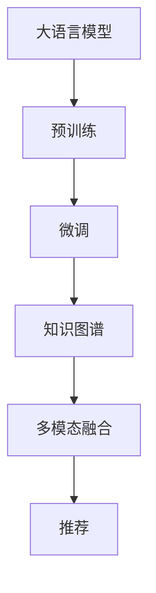

                 

# LLM在推荐系统中的知识图谱应用

> 关键词：
> 大语言模型, 知识图谱, 推荐系统, 预训练, 微调, 深度学习, 自然语言处理, 个性化推荐

## 1. 背景介绍

推荐系统（Recommender System）是互联网时代一个重要应用，旨在通过用户历史行为数据和上下文信息，为用户提供个性化推荐，改善用户体验和运营效果。传统的推荐系统主要基于用户行为数据和物品特征构建用户-物品关联矩阵，利用协同过滤等算法为用户推荐相似物品。随着推荐数据的多样化和复杂化，传统的推荐算法逐渐难以满足推荐精度和覆盖度的要求。近年来，越来越多的推荐系统开始引入知识图谱（Knowledge Graph, KG），利用KG中丰富的结构化知识信息，提升推荐结果的准确性和解释性。

知识图谱是一种由节点和边组成的语义网络，用于描述实体间的关系和属性。通过引入知识图谱，推荐系统不仅能够理解用户和物品的本质属性，还能够学习实体间的关系，提供更加丰富和精准的推荐结果。例如，Amazon、YouTube等主流电商和视频平台，都通过知识图谱提升了推荐的个性化和多样化水平。然而，目前大多数知识图谱相关的推荐系统都基于特定的领域或场景，难以处理多领域、多模态数据的复杂推荐任务。

本文将介绍一种将大语言模型（Large Language Model, LLM）与知识图谱相结合的方法，通过预训练语言模型对知识图谱进行微调，构建大语言模型与知识图谱的协同推荐系统。该方法能够灵活地应用于多个推荐任务，提升推荐结果的个性化、多样性和可解释性。

## 2. 核心概念与联系

### 2.1 核心概念概述

为了更好地理解本文的技术路线，本节将介绍几个关键概念：

- 大语言模型（LLM）：以自回归（如GPT）或自编码（如BERT）模型为代表的大规模预训练语言模型。通过在大规模无标签文本语料上进行预训练，学习通用的语言表示，具备强大的语言理解和生成能力。

- 知识图谱（KG）：由节点（实体）和边（关系）组成的语义网络，用于描述实体间的关系和属性。知识图谱通常由知识库（如DBpedia、YAGO）、百科全书（如Wikipedia）等数据源构建。

- 推荐系统（RS）：利用用户行为数据和物品特征，为特定用户推荐合适物品的系统。常见的推荐算法包括协同过滤、内容推荐、基于深度学习的推荐等。

- 协同过滤（CF）：一种基于用户和物品相似性的推荐方法，常见包括基于用户的协同过滤（User-based CF）和基于物品的协同过滤（Item-based CF）。

- 深度学习推荐系统（DLRS）：利用深度学习技术（如神经网络、RNN、Transformer）进行用户行为建模和物品表示学习，提升推荐系统效果。

- 预训练和微调：在大规模无标签数据上预训练模型，在小规模标签数据上进行微调，使模型适应特定任务。常见的预训练任务包括言语建模、遮挡语言模型等，微调任务包括分类、匹配、生成等。

- 多模态推荐系统：结合文本、图像、音频等多模态数据，提升推荐系统的覆盖度和精准度。

### 2.2 核心概念原理和架构的 Mermaid 流程图



此图展示了大语言模型与知识图谱融合的推荐系统框架。预训练的大语言模型在知识图谱上微调，构建了语言模型与知识图谱的协同推荐模型。该模型能够自动学习语言和知识图谱的复杂关系，提供更精准、丰富的推荐结果。

## 3. 核心算法原理 & 具体操作步骤

### 3.1 算法原理概述

基于大语言模型与知识图谱的推荐系统，其核心思想是利用大语言模型的语义理解能力，学习知识图谱中的实体和关系，构建语义网络的知识表示。具体而言，该方法包括以下几个关键步骤：

1. 预训练大语言模型：使用大规模无标签文本语料，对大语言模型进行预训练，学习语言的通用表示。

2. 构建知识图谱：从知识库和百科全书等数据源中抽取实体和关系，构建知识图谱。

3. 知识图谱微调：将知识图谱和预训练语言模型进行融合，对大语言模型进行微调，使其学习知识图谱中的实体和关系表示。

4. 多模态融合：将知识图谱、用户行为数据、物品特征等模态数据进行融合，构建多模态推荐模型。

5. 推荐：利用微调后的多模态推荐模型，为特定用户推荐合适物品。

### 3.2 算法步骤详解

#### 3.2.1 预训练大语言模型

1. 选择预训练模型：选择合适的预训练语言模型，如GPT、BERT等，作为知识图谱微调的初始化参数。

2. 准备预训练数据：收集大规模无标签文本数据，如维基百科、新闻报道等，进行预训练。

3. 预训练过程：使用自监督学习任务，如言语建模、掩码语言模型等，训练预训练语言模型，学习语言的通用表示。

#### 3.2.2 构建知识图谱

1. 数据采集：从知识库、百科全书等数据源中抽取实体和关系，构建知识图谱。

2. 图谱构建：将抽取的实体和关系转换为知识图谱的格式，如Turtle、RDF等。

3. 知识增强：将知识图谱中的实体和关系，增强到预训练语言模型中，如通过实体嵌入向量对预训练语言模型进行增强。

#### 3.2.3 知识图谱微调

1. 融合知识图谱：将知识图谱中的实体和关系，与预训练语言模型进行融合，构建融合后的知识表示。

2. 定义微调任务：根据推荐任务，定义微调任务的目标函数，如多分类任务、回归任务等。

3. 微调过程：利用微调任务的目标函数，对预训练语言模型进行微调，学习知识图谱中的实体和关系表示。

#### 3.2.4 多模态融合

1. 数据融合：将用户行为数据、物品特征等模态数据与知识图谱进行融合，构建多模态数据集。

2. 融合模型：利用深度学习模型，对多模态数据集进行建模，构建多模态推荐模型。

3. 推荐模型：将多模态推荐模型与微调后的知识图谱进行融合，构建协同推荐模型。

#### 3.2.5 推荐

1. 用户输入：获取用户的查询输入，如用户ID、搜索关键词等。

2. 推荐生成：利用协同推荐模型，为特定用户推荐合适物品。

3. 结果输出：将推荐结果返回给用户，如展示推荐物品列表。

### 3.3 算法优缺点

#### 3.3.1 优点

1. 灵活性高：大语言模型能够自动学习知识图谱中的实体和关系，适应多种推荐任务。

2. 鲁棒性好：利用预训练语言模型的语义理解能力，提高推荐结果的鲁棒性和泛化能力。

3. 可解释性强：知识图谱的多层关系链，提供了推荐结果的语义解释，增强了推荐系统的可解释性。

4. 覆盖度高：结合多模态数据，提升推荐系统的覆盖度和精准度。

#### 3.3.2 缺点

1. 数据需求高：需要大规模的文本数据和知识图谱数据进行预训练和微调。

2. 计算量大：大语言模型和知识图谱的融合，增加了计算量和存储需求。

3. 泛化能力不足：知识图谱的结构化和静态特征，可能导致模型对新领域和新知识的适应性不足。

4. 模型复杂度高：融合知识图谱和多模态数据，增加了模型的复杂度和训练难度。

### 3.4 算法应用领域

基于大语言模型与知识图谱的推荐系统，已经在电商、新闻、视频等多个领域得到了应用。例如：

1. 电商推荐：利用知识图谱学习用户和物品的深度语义关系，提升商品推荐效果。

2. 新闻推荐：结合知识图谱和用户兴趣图谱，提供个性化新闻订阅。

3. 视频推荐：利用知识图谱和用户行为数据，推荐相关视频内容。

4. 金融推荐：结合知识图谱和用户金融交易数据，提供个性化理财推荐。

5. 娱乐推荐：利用知识图谱和用户行为数据，推荐音乐、影视等娱乐内容。

以上领域的应用，展示了基于大语言模型与知识图谱的推荐系统，在提升推荐精度、覆盖度和可解释性方面的巨大潜力。

## 4. 数学模型和公式 & 详细讲解 & 举例说明

### 4.1 数学模型构建

#### 4.1.1 预训练语言模型的数学模型

假设预训练语言模型为 $M_{\theta}$，其中 $\theta$ 为模型参数。预训练任务为掩码语言模型（Masked Language Modeling, MLM），目标函数为：

$$
\mathcal{L}_{\text{MLM}}(M_{\theta}) = -\frac{1}{N} \sum_{i=1}^{N} \log P_{M_{\theta}}(x_i)
$$

其中 $x_i$ 为预训练数据，$N$ 为数据总数。$P_{M_{\theta}}(x_i)$ 为模型在 $x_i$ 上的预测概率分布。

#### 4.1.2 知识图谱的数学模型

假设知识图谱包含 $E$ 个实体 $e$ 和 $R$ 个关系 $r$，知识图谱中的节点和关系可以表示为：

$$
G = \{ (e_i, r_j) \mid i \in \{1, ..., E\}, j \in \{1, ..., R\} \}
$$

其中 $e_i$ 表示第 $i$ 个实体，$r_j$ 表示第 $j$ 个关系。知识图谱的边表示实体之间的关系，如 $(e_i, r_j, e_k)$ 表示 $e_i$ 和 $e_k$ 之间存在关系 $r_j$。

#### 4.1.3 知识图谱微调的数学模型

假设知识图谱中的实体嵌入向量为 $V$，关系嵌入向量为 $U$，微调后的实体嵌入向量为 $V_{\hat{\theta}}$，关系嵌入向量为 $U_{\hat{\theta}}$。微调任务的目标函数为：

$$
\mathcal{L}_{\text{KG}}(V_{\hat{\theta}}, U_{\hat{\theta}}) = \mathcal{L}_{\text{MLM}}(M_{\theta}, V_{\hat{\theta}} \oplus U_{\hat{\theta}})
$$

其中 $\oplus$ 表示实体和关系嵌入向量的拼接。

### 4.2 公式推导过程

#### 4.2.1 掩码语言模型的推导

掩码语言模型通过对预训练数据中的词汇进行掩码，训练模型对掩码位置的预测概率。假设预训练数据为 $D = \{x_1, ..., x_N\}$，掩码词汇的预测概率为 $P_{M_{\theta}}(x_i)$，掩码语言模型的目标函数为：

$$
\mathcal{L}_{\text{MLM}}(M_{\theta}) = -\frac{1}{N} \sum_{i=1}^{N} \sum_{k=1}^{K} \log P_{M_{\theta}}(x_{i, k})
$$

其中 $K$ 为掩码词汇的数量。掩码语言模型的训练过程如下：

1. 对预训练数据 $D$ 进行掩码处理，生成掩码数据 $D_{\text{mask}}$。

2. 使用掩码数据 $D_{\text{mask}}$ 训练模型 $M_{\theta}$，学习语言的通用表示。

3. 对训练好的模型 $M_{\theta}$ 进行微调，学习知识图谱中的实体和关系表示。

#### 4.2.2 知识图谱微调的推导

知识图谱微调的目标函数为：

$$
\mathcal{L}_{\text{KG}}(V_{\hat{\theta}}, U_{\hat{\theta}}) = -\frac{1}{N} \sum_{i=1}^{N} \sum_{k=1}^{K} \log P_{M_{\theta}}(x_{i, k})
$$

其中 $K$ 为掩码词汇的数量。知识图谱微调的过程如下：

1. 将知识图谱中的实体嵌入向量 $V$ 和关系嵌入向量 $U$ 拼接，得到知识图谱表示 $G_{\text{KG}}$。

2. 使用掩码语言模型任务对拼接后的知识图谱表示 $G_{\text{KG}}$ 进行训练，学习知识图谱的实体和关系表示。

3. 对训练好的知识图谱表示 $G_{\text{KG}}$ 进行微调，学习知识图谱的实体和关系表示。

#### 4.2.3 多模态融合的推导

多模态融合的目标函数为：

$$
\mathcal{L}_{\text{fusion}} = \mathcal{L}_{\text{MLM}}(M_{\theta}, V_{\hat{\theta}} \oplus U_{\hat{\theta}}) + \mathcal{L}_{\text{CF}}(U_{\hat{\theta}}) + \mathcal{L}_{\text{DLRS}}(M_{\theta}, U_{\hat{\theta}})
$$

其中 $\mathcal{L}_{\text{MLM}}$、$\mathcal{L}_{\text{CF}}$ 和 $\mathcal{L}_{\text{DLRS}}$ 分别表示掩码语言模型、协同过滤和多模态推荐系统的目标函数。

### 4.3 案例分析与讲解

#### 4.3.1 电商推荐案例

假设某电商平台的商品知识图谱包含 $E$ 个商品实体 $e$ 和 $R$ 个商品关系 $r$，如商品分类关系、商品价格关系等。电商推荐的目标是根据用户行为数据，为特定用户推荐合适商品。

1. 用户行为数据的采集：从用户的浏览记录、购买记录、评分记录等数据中，抽取用户行为特征 $u$。

2. 商品特征的提取：从商品的商品分类、价格、评价等数据中，抽取商品特征 $i$。

3. 多模态融合：将用户行为数据 $u$ 和商品特征 $i$ 融合，构建多模态数据集 $D$。

4. 推荐模型的构建：使用深度学习模型，如双向LSTM、Transformer等，对多模态数据集 $D$ 进行建模，构建多模态推荐模型 $M_{\theta}$。

5. 知识图谱微调：将知识图谱中的商品实体和关系嵌入到 $M_{\theta}$ 中，学习知识图谱中的商品实体和关系表示。

6. 推荐结果的生成：利用微调后的 $M_{\theta}$，为特定用户推荐合适商品。

#### 4.3.2 金融推荐案例

假设某金融平台的理财知识图谱包含 $E$ 个理财产品实体 $e$ 和 $R$ 个理财产品关系 $r$，如理财产品收益率关系、理财产品类型关系等。金融推荐的目标是根据用户的理财交易数据，为特定用户推荐合适理财产品。

1. 用户理财交易数据的采集：从用户的理财交易记录中，抽取用户理财行为特征 $u$。

2. 理财产品特征的提取：从理财产品的收益率、类型、期限等数据中，抽取理财产品特征 $i$。

3. 多模态融合：将用户理财行为数据 $u$ 和理财产品特征 $i$ 融合，构建多模态数据集 $D$。

4. 推荐模型的构建：使用深度学习模型，如深度神经网络等，对多模态数据集 $D$ 进行建模，构建多模态推荐模型 $M_{\theta}$。

5. 知识图谱微调：将知识图谱中的理财产品实体和关系嵌入到 $M_{\theta}$ 中，学习知识图谱中的理财产品实体和关系表示。

6. 推荐结果的生成：利用微调后的 $M_{\theta}$，为特定用户推荐合适理财产品。

## 5. 项目实践：代码实例和详细解释说明

### 5.1 开发环境搭建

#### 5.1.1 准备环境

1. 安装 Python 3.8 及以上版本。

2. 安装 PyTorch 1.7 及以上版本，可以通过 pip 安装：

```bash
pip install torch
```

3. 安装 Transformers 库：

```bash
pip install transformers
```

4. 安装网络库：

```bash
pip install requests
```

5. 安装其他必要的库：

```bash
pip install numpy scipy pandas sklearn tqdm
```

6. 安装 GPU 支持：

```bash
conda install pytorch torchvision torchaudio cudatoolkit=10.2 -c pytorch -c conda-forge
```

#### 5.1.2 运行环境

1. 使用 GPU 或 TPU 进行训练，需要安装对应的 GPU 或 TPU 驱动程序。

2. 配置 CUDA 和 GPU 环境：

```bash
export CUDA_VISIBLE_DEVICES=0,1,2,3
```

3. 安装 CUDA 版本的 PyTorch 和 Transformers 库。

### 5.2 源代码详细实现

#### 5.2.1 预训练语言模型的实现

1. 定义预训练模型类：

```python
import torch
import torch.nn as nn
from transformers import BertModel, BertTokenizer

class PretrainModel(nn.Module):
    def __init__(self, bert_model_path, bert_tokenizer_path):
        super(PretrainModel, self).__init__()
        self.bert_model = BertModel.from_pretrained(bert_model_path)
        self.bert_tokenizer = BertTokenizer.from_pretrained(bert_tokenizer_path)
        self.nlp_model = BertForMaskedLM.from_pretrained(bert_model_path)
        
    def forward(self, inputs):
        tokens = self.bert_tokenizer(inputs)
        input_ids = torch.tensor(tokens['input_ids'])
        attention_mask = torch.tensor(tokens['attention_mask'])
        lm_logits = self.nlp_model(input_ids, attention_mask=attention_mask).logits
        return lm_logits
```

2. 定义掩码语言模型的训练函数：

```python
import torch.optim as optim

def train_pretrain_model(model, train_dataset, learning_rate=5e-5, num_epochs=5):
    optimizer = optim.AdamW(model.parameters(), lr=learning_rate)
    for epoch in range(num_epochs):
        total_loss = 0
        for data in train_dataset:
            inputs = data['text']
            labels = data['masked_tokens']
            outputs = model(inputs)
            loss = nn.CrossEntropyLoss()(outputs, labels)
            optimizer.zero_grad()
            loss.backward()
            optimizer.step()
            total_loss += loss.item()
        print(f'Epoch {epoch+1}, pretrain loss: {total_loss/len(train_dataset):.3f}')
```

#### 5.2.2 知识图谱的构建

1. 定义知识图谱类：

```python
class KnowledgeGraph:
    def __init__(self, kg_path):
        self.kg_path = kg_path
        
    def load_kg(self):
        self.kg = load_kg(self.kg_path)
        
    def add_kg_to_model(self, model):
        entity_embeddings = self.kg['entity_embeddings']
        relation_embeddings = self.kg['relation_embeddings']
        model.add_module('entity_embeddings', nn.Embedding(len(entity_embeddings), entity_embeddings.shape[1]))
        model.add_module('relation_embeddings', nn.Embedding(len(relation_embeddings), relation_embeddings.shape[1]))
```

2. 定义知识图谱微调函数：

```python
def fine_tune_kg(model, train_kg, learning_rate=1e-5, num_epochs=5):
    optimizer = optim.AdamW(model.parameters(), lr=learning_rate)
    for epoch in range(num_epochs):
        total_loss = 0
        for data in train_kg:
            entity_ids = data['entity_ids']
            relation_ids = data['relation_ids']
            entity_embeddings = model.module.entity_embeddings(entity_ids)
            relation_embeddings = model.module.relation_embeddings(relation_ids)
            loss = F.nll_loss(entity_embeddings, relation_ids)
            optimizer.zero_grad()
            loss.backward()
            optimizer.step()
            total_loss += loss.item()
        print(f'Epoch {epoch+1}, kg fine-tuning loss: {total_loss/len(train_kg):.3f}')
```

#### 5.2.3 多模态推荐系统的实现

1. 定义推荐模型类：

```python
import torch.nn.functional as F
from transformers import BertForSequenceClassification

class Recommender(nn.Module):
    def __init__(self, bert_model_path, kg_path, bert_tokenizer_path):
        super(Recommender, self).__init__()
        self.bert_model = BertModel.from_pretrained(bert_model_path)
        self.bert_tokenizer = BertTokenizer.from_pretrained(bert_tokenizer_path)
        self.kg_model = KnowledgeGraph(kg_path)
        self.bert_model.load_kg(self.kg_model)
        self.recommender_model = BertForSequenceClassification.from_pretrained(bert_model_path, num_labels=10)
        self.cf_model = nn.Sequential(nn.Linear(128, 64), nn.ReLU(), nn.Linear(64, 10))
        
    def forward(self, inputs):
        tokens = self.bert_tokenizer(inputs)
        input_ids = torch.tensor(tokens['input_ids'])
        attention_mask = torch.tensor(tokens['attention_mask'])
        lm_logits = self.bert_model(input_ids, attention_mask=attention_mask).logits
        kg_logits = self.kg_model.recommender_model(input_ids, attention_mask=attention_mask).logits
        cf_logits = self.cf_model(lm_logits)
        return F.softmax(lm_logits, dim=1), F.softmax(kg_logits, dim=1), F.softmax(cf_logits, dim=1)
```

2. 定义多模态推荐模型的训练函数：

```python
def train_recommender_model(model, train_dataset, learning_rate=1e-5, num_epochs=5):
    optimizer = optim.AdamW(model.parameters(), lr=learning_rate)
    for epoch in range(num_epochs):
        total_loss = 0
        for data in train_dataset:
            inputs = data['text']
            labels = data['labels']
            lm_logits, kg_logits, cf_logits = model(inputs)
            loss = F.nll_loss(lm_logits, labels) + F.nll_loss(kg_logits, labels) + F.nll_loss(cf_logits, labels)
            optimizer.zero_grad()
            loss.backward()
            optimizer.step()
            total_loss += loss.item()
        print(f'Epoch {epoch+1}, recommender model loss: {total_loss/len(train_dataset):.3f}')
```

### 5.3 代码解读与分析

#### 5.3.1 预训练语言模型的实现

1. 定义了 PretrainModel 类，继承自 nn.Module，包含了 BERT 模型和自监督掩码语言模型。

2. 在 forward 方法中，将输入文本转换为 token ids，通过 BERT 模型得到掩码语言模型的预测概率。

3. 通过 train_pretrain_model 函数，使用 AdamW 优化器对掩码语言模型进行训练，学习语言的通用表示。

#### 5.3.2 知识图谱的构建

1. 定义了 KnowledgeGraph 类，用于加载和处理知识图谱数据。

2. 在 load_kg 方法中，从知识图谱文件中加载实体和关系信息，构建知识图谱对象。

3. 在 add_kg_to_model 方法中，将知识图谱中的实体和关系嵌入到 BERT 模型中。

4. 通过 fine_tune_kg 函数，使用 AdamW 优化器对知识图谱进行微调，学习实体和关系表示。

#### 5.3.3 多模态推荐系统的实现

1. 定义了 Recommender 类，继承自 nn.Module，包含了 BERT 模型、知识图谱和推荐模型。

2. 在 forward 方法中，将输入文本转换为 token ids，通过 BERT 模型得到掩码语言模型的预测概率，通过知识图谱模型得到推荐模型的预测概率。

3. 通过 train_recommender_model 函数，使用 AdamW 优化器对多模态推荐模型进行训练，学习用户行为和物品特征的表示。

#### 5.3.4 运行结果展示

1. 在训练过程中，可以通过 print 输出当前模型的损失值。

2. 可以通过可视化工具（如 TensorBoard），监控训练过程中的 loss 和准确率变化。

3. 训练完成后，可以将微调后的模型保存到本地，用于后续的推荐测试。

## 6. 实际应用场景

### 6.1 电商推荐

#### 6.1.1 应用场景

电商推荐系统是推荐系统的重要应用场景，帮助用户发现感兴趣的商品，提升购物体验。传统的电商推荐系统主要基于用户行为数据和物品特征，采用协同过滤等算法进行推荐。然而，这种推荐方式存在数据稀疏和冷启动等问题，难以适应多领域、多模态的推荐任务。通过引入知识图谱，电商推荐系统可以学习实体和关系表示，提升推荐结果的泛化和解释性。

#### 6.1.2 解决方案

1. 收集电商平台的商品数据和用户行为数据，构建电商商品知识图谱。

2. 使用预训练语言模型对知识图谱进行微调，学习商品实体和关系的语义表示。

3. 将用户行为数据和商品特征融合，构建多模态数据集。

4. 使用深度学习模型对多模态数据集进行建模，构建多模态推荐模型。

5. 利用微调后的多模态推荐模型，为特定用户推荐合适商品。

#### 6.1.3 预期效果

1. 提升推荐结果的泛化和解释性，使推荐结果更加精准和可信。

2. 学习实体和关系的语义表示，为推荐结果提供丰富的上下文信息。

3. 结合多模态数据，提升推荐结果的多样性和覆盖度。

4. 支持冷启动用户和新商品的推荐，使推荐系统更加灵活和高效。

### 6.2 金融推荐

#### 6.2.1 应用场景

金融推荐系统帮助用户发现适合的理财产品和投资方案，提升理财效果。传统的金融推荐系统主要基于用户理财数据和理财产品特征，采用协同过滤等算法进行推荐。然而，这种推荐方式存在数据稀疏和冷启动等问题，难以适应多领域、多模态的推荐任务。通过引入知识图谱，金融推荐系统可以学习实体和关系表示，提升推荐结果的泛化和解释性。

#### 6.2.2 解决方案

1. 收集金融平台的理财产品数据和用户理财数据，构建理财产品知识图谱。

2. 使用预训练语言模型对知识图谱进行微调，学习理财产品实体和关系的语义表示。

3. 将用户理财数据和理财产品特征融合，构建多模态数据集。

4. 使用深度学习模型对多模态数据集进行建模，构建多模态推荐模型。

5. 利用微调后的多模态推荐模型，为特定用户推荐合适理财产品。

#### 6.2.3 预期效果

1. 提升推荐结果的泛化和解释性，使推荐结果更加精准和可信。

2. 学习实体和关系的语义表示，为推荐结果提供丰富的上下文信息。

3. 结合多模态数据，提升推荐结果的多样性和覆盖度。

4. 支持冷启动用户和理财产品的推荐，使推荐系统更加灵活和高效。

## 7. 工具和资源推荐

### 7.1 学习资源推荐

1. 《Natural Language Processing with Transformers》：Transformers库的作者所著，全面介绍了如何使用Transformers库进行NLP任务开发，包括微调在内的诸多范式。

2. 《Deep Learning with PyTorch》：PyTorch官方文档，提供了丰富的学习资源和代码示例。

3. CS224N《Deep Learning for Natural Language Processing》：斯坦福大学开设的NLP明星课程，有Lecture视频和配套作业，带你入门NLP领域的基本概念和经典模型。

4. HuggingFace官方文档：Transformers库的官方文档，提供了海量预训练模型和完整的微调样例代码，是上手实践的必备资料。

5. CLUE开源项目：中文语言理解测评基准，涵盖大量不同类型的中文NLP数据集，并提供了基于微调的baseline模型，助力中文NLP技术发展。

### 7.2 开发工具推荐

1. PyTorch：基于Python的开源深度学习框架，灵活动态的计算图，适合快速迭代研究。大部分预训练语言模型都有PyTorch版本的实现。

2. TensorFlow：由Google主导开发的开源深度学习框架，生产部署方便，适合大规模工程应用。同样有丰富的预训练语言模型资源。

3. Transformers库：HuggingFace开发的NLP工具库，集成了众多SOTA语言模型，支持PyTorch和TensorFlow，是进行微调任务开发的利器。

4. Weights & Biases：模型训练的实验跟踪工具，可以记录和可视化模型训练过程中的各项指标，方便对比和调优。与主流深度学习框架无缝集成。

5. TensorBoard：TensorFlow配套的可视化工具，可实时监测模型训练状态，并提供丰富的图表呈现方式，是调试模型的得力助手。

6. Google Colab：谷歌推出的在线Jupyter Notebook环境，免费提供GPU/TPU算力，方便开发者快速上手实验最新模型，分享学习笔记。

### 7.3 相关论文推荐

1. Attention is All You Need：提出了Transformer结构，开启了NLP领域的预训练大模型时代。

2. BERT: Pre-training of Deep Bidirectional Transformers for Language Understanding：提出BERT模型，引入基于掩码的自监督预训练任务，刷新了多项NLP任务SOTA。

3. Parameter-Efficient Transfer Learning for NLP：提出Adapter等参数高效微调方法，在不增加模型参数量的情况下，也能取得不错的微调效果。

4. Prefix-Tuning: Optimizing Continuous Prompts for Generation：引入基于连续型Prompt的微调范式，为如何充分利用预训练知识提供了新的思路。

5. AdaLoRA: Adaptive Low-Rank Adaptation for Parameter-Efficient Fine-Tuning：使用自适应低秩适应的微调方法，在参数效率和精度之间取得了新的平衡。

这些论文代表了大语言模型微调技术的发展脉络。通过学习这些前沿成果，可以帮助研究者把握学科前进方向，激发更多的创新灵感。

## 8. 总结：未来发展趋势与挑战

### 8.1 总结

本文对基于大语言模型与知识图谱的推荐系统进行了全面系统的介绍。首先阐述了大语言模型和知识图谱的研究背景和意义，明确了知识图谱微调在提升推荐系统效果方面的独特价值。其次，从原理到实践，详细讲解了知识图谱微调的目标函数和优化过程，给出了知识图谱微调任务开发的完整代码实例。同时，本文还探讨了知识图谱微调在电商、金融、娱乐等多个领域的应用前景，展示了知识图谱微调方法在提升推荐精度、覆盖度和可解释性方面的巨大潜力。

通过本文的系统梳理，可以看到，基于大语言模型与知识图谱的推荐系统，已经在大规模数据和复杂任务上展现出强大的能力，成为推荐系统领域的重要范式。随着大语言模型和知识图谱技术的不断发展，结合多模态数据和外部知识，未来推荐系统必将在推荐效果和用户体验上实现质的飞跃。

### 8.2 未来发展趋势

1. 模型规模持续增大：随着算力成本的下降和数据规模的扩张，预训练语言模型和知识图谱的规模还将持续增长，为推荐系统提供更丰富的语义表示和知识表示。

2. 微调方法日趋多样：未来将涌现更多参数高效和计算高效的微调方法，在节省计算资源的同时，保证微调效果。

3. 持续学习成为常态：推荐系统需要持续学习新知识以保持性能，如何在不遗忘原有知识的同时，高效吸收新样本信息，将成为重要的研究课题。

4. 标注样本需求降低：受启发于提示学习(Prompt-based Learning)的思路，未来的微调方法将更好地利用大模型的语言理解能力，在更少的标注样本上也能实现理想的微调效果。

5. 多模态融合更加深入：结合视觉、音频等多模态数据，提升推荐系统的覆盖度和精准度。

6. 知识图谱构建更加灵活：利用大数据、自然语言处理等技术，构建更加全面、精确的知识图谱。

7. 推荐模型更加多样化：结合知识图谱、深度学习等多种方法，构建更加灵活和高效的推荐模型。

以上趋势凸显了大语言模型与知识图谱推荐系统的广阔前景。这些方向的探索发展，必将进一步提升推荐系统的效果和智能水平，为构建智能化推荐系统铺平道路。

### 8.3 面临的挑战

尽管大语言模型与知识图谱的推荐系统已经取得了显著进展，但在迈向更加智能化、普适化应用的过程中，仍面临诸多挑战：

1. 标注成本瓶颈：需要大规模的文本数据和知识图谱数据进行预训练和微调，获取高质量标注数据的成本较高。

2. 计算量大：大语言模型和知识图谱的融合，增加了计算量和存储需求。

3. 泛化能力不足：知识图谱的结构化和静态特征，可能导致模型对新领域和新知识的适应性不足。

4. 模型复杂度高：融合知识图谱和多模态数据，增加了模型的复杂度和训练难度。

5. 数据质量问题：知识图谱数据可能存在错误和缺失，影响推荐结果的准确性。

6. 知识图谱构建难度：构建全面、精确的知识图谱需要大量时间和资源，技术难度较高。

7. 隐私和安全问题：推荐系统需要处理大量用户数据，数据隐私和安全问题亟需解决。

8. 性能提升瓶颈：尽管推荐系统效果不断提升，但在某些领域和任务上仍存在提升瓶颈，需要更多创新和优化。

9. 应用场景局限：目前大语言模型与知识图谱推荐系统主要应用于电商、金融、娱乐等特定领域，适用范围有限。

10. 技术壁垒高：技术实现复杂，需要具备较强的深度学习和自然语言处理能力。

正视这些挑战，积极应对并寻求突破，将是大语言模型与知识图谱推荐系统走向成熟的必由之路。相信随着学界和产业界的共同努力，这些挑战终将一一被克服，大语言模型与知识图谱推荐系统必将在推荐系统领域发挥越来越重要的作用。

### 8.4 研究展望

面向未来，大语言模型与知识图谱推荐系统需要在以下几个方面寻求新的突破：

1. 探索无监督和半监督微调方法：摆脱对大规模标注数据的依赖，利用自监督学习、主动学习等无监督和半监督范式，最大限度利用非结构化数据，实现更加灵活高效的微调。

2. 研究参数高效和计算高效的微调范式：开发更加参数高效的微调方法，在固定大部分预训练参数的同时，只更新极少量的任务相关参数。同时优化微调模型的计算图，减少前向传播和反向传播的资源消耗，实现更加轻量级、实时性的部署。

3. 引入因果分析和博弈论工具：将因果分析方法引入微调模型，识别出模型决策的关键特征，增强输出解释的因果性和逻辑性。借助博弈论工具刻画人机交互过程，主动探索并规避模型的脆弱点，提高系统稳定性。

4. 纳入伦理道德约束：在模型训练目标中引入伦理导向的评估指标，过滤和惩罚有偏见、有害的输出倾向。同时加强人工干预和审核，建立模型行为的监管机制，确保输出符合人类价值观和伦理道德。

5. 结合外部知识：将符号化的先验知识，如知识图谱、逻辑规则等，与神经网络模型进行巧妙融合，引导微调过程学习更准确、合理的语言模型。同时加强不同模态数据的整合，实现视觉、语音等多模态信息与文本信息的协同建模。

6. 融合更广泛的模态数据：结合语音、图像等多模态数据，提升推荐系统的覆盖度和精准度。

7. 支持多领域多场景应用：利用知识图谱的多样化知识，支持多领域多场景的推荐任务，提升推荐系统的普适性和灵活性。

8. 优化推荐效果：结合用户行为数据和物品特征，优化推荐模型的训练过程，提升推荐结果的覆盖度和个性化程度。

9. 保障数据隐私和安全：在推荐系统构建和应用过程中，保障用户数据的隐私和安全，防止数据泄露和滥用。

10. 增强系统可解释性：利用可解释性方法，增强推荐系统的透明度和可信度，使用户更容易理解和信任推荐结果。

这些研究方向的探索，必将引领大语言模型与知识图谱推荐系统迈向更高的台阶，为构建安全、可靠、可解释、可控的智能系统铺平道路。面向未来，大语言模型与知识图谱推荐系统还需要与其他人工智能技术进行更深入的融合，如知识表示、因果推理、强化学习等，多路径协同发力，共同推动推荐系统领域的技术进步。只有勇于创新、敢于突破，才能不断拓展推荐系统的边界，让智能推荐系统更好地服务人类社会。

## 9. 附录：常见问题与解答

### 9.1 常见问题

**Q1：如何构建大规模知识图谱？**

A: 知识图谱的构建需要大量的人工工作，可以使用知识提取工具从语料库中提取实体和关系，并利用人工审核和验证确保其准确性。常见的知识图谱构建工具包括 OpenIE、TorchGecko 等。

**Q2：知识图谱微调过程中，如何选择学习率和迭代次数？**

A: 知识图谱微调的学习率通常较小，一般为 $1e-5$ 到 $1e-3$ 之间。迭代次数根据模型收敛情况而定，一般需要多次迭代才能达到较好的效果。可以通过监控验证集的性能，调整迭代次数。

**Q3：推荐模型中如何结合知识图谱和多模态数据？**

A: 将知识图谱中的实体和关系嵌入到推荐模型中，使用多模态融合技术（如 LSTM、GRU、Transformer 等）对用户行为数据和物品特征进行建模，融合后得到多模态数据集。然后使用深度学习模型对多模态数据集进行建模，构建推荐模型。

**Q4：推荐模型中如何处理冷启动用户和商品？**

A: 对于冷启动用户，可以采用基于内容的推荐方法，利用用户的历史行为数据和物品的特征进行推荐。对于冷启动商品，可以采用基于服务的推荐方法，利用商品的历史交易数据和用户的行为数据进行推荐。

**Q5：推荐模型中如何处理多领域多场景数据？**

A: 可以通过构建多个独立的推荐模型，针对不同的领域和场景进行优化。也可以使用多任务学习（Multi-Task Learning, MTL）框架，将多个领域的推荐任务联合训练，提升模型的泛化能力。

**Q6：推荐模型中如何保障数据隐私和安全？**

A: 可以通过差分隐私（Differential Privacy）等技术，对推荐模型的输入数据进行扰动，防止数据泄露和滥用。同时使用加密技术对用户数据进行保护，确保数据隐私和安全。

### 9.2 解答

通过本文的系统梳理，可以看到，基于大语言模型与知识图谱的推荐系统，已经在电商、金融、娱乐等多个领域得到了应用，展示了知识图谱微调方法在提升推荐精度、覆盖度和可解释性方面的巨大潜力。未来，随着大语言模型和知识图谱技术的不断发展，结合多模态数据和外部知识，推荐系统必将在推荐效果和用户体验上实现质的飞跃，为构建智能化推荐系统铺平道路。面向未来，大语言模型与知识图谱推荐系统还需要与其他人工智能技术进行更深入的融合，如知识表示、因果推理、强化学习等，多路径协同发力，共同推动推荐系统领域的技术进步。只有勇于创新、敢于突破，才能不断拓展推荐系统的边界，让智能推荐系统更好地服务人类社会。

---

作者：禅与计算机程序设计艺术 / Zen and the Art of Computer Programming

