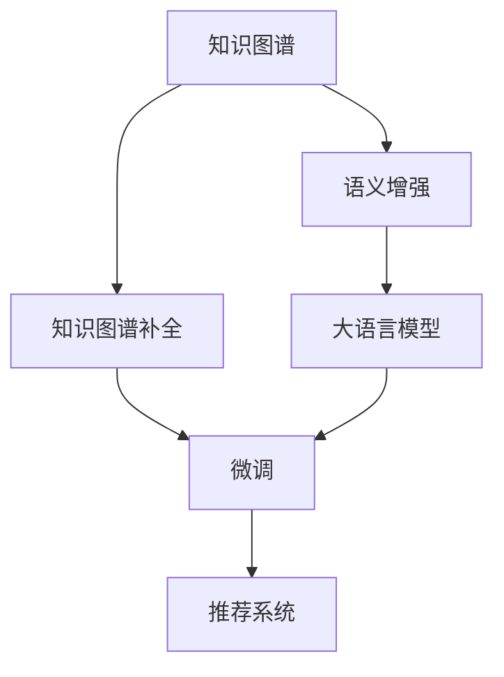

                 

# LLM在推荐系统中的知识图谱补全

> 关键词：知识图谱、LLM、推荐系统、语义增强、深度学习、自然语言处理、信息检索

## 1. 背景介绍

### 1.1 问题由来

随着互联网技术的飞速发展，推荐系统在电商、新闻、视频等多个领域已经广泛应用，极大地提升了用户体验和运营效率。然而，现有的推荐系统大多基于用户行为数据进行，难以捕捉用户深层次的需求和偏好，容易陷入用户历史行为的用户冷启动问题和用户兴趣变化的用户动态问题。

为了突破这一瓶颈，近年来兴起了一种基于知识图谱的推荐方法。知识图谱是一种将实体、关系和属性以图结构方式组织起来的数据存储形式，能够更好地捕捉实体之间的关系，刻画用户的深层次需求。因此，将知识图谱融入推荐系统，能够有效解决用户兴趣挖掘和动态追踪等问题，提升推荐系统的表现力。

### 1.2 问题核心关键点

知识图谱补全(Knowledge Graph Completion, KGC)是知识图谱领域的一个核心问题。它的目标是从现有的知识图谱数据中挖掘出缺失的实体关系或属性，使得知识图谱更加完整和精确。近年来，基于深度学习的知识图谱补全方法，在多张谱上取得了很好的效果，为知识图谱与推荐系统的融合奠定了坚实基础。

具体来说，大语言模型(LLM)与知识图谱补全的结合，可以分为两个阶段：
1. **预训练阶段**：使用大语言模型对知识图谱进行语义增强，提取高层次的语义信息。
2. **微调阶段**：将预训练后的语言模型，在知识图谱补全任务上进行微调，进一步提高模型的精确度和泛化能力。

本文将详细探讨在大语言模型预训练和微调阶段中，如何高效、准确地补全知识图谱，并将其应用于推荐系统，提升推荐效果。

## 2. 核心概念与联系

### 2.1 核心概念概述

为更好地理解知识图谱补全在大语言模型中的应用，本节将介绍几个密切相关的核心概念：

- 知识图谱(Knowledge Graph,KG)：以图结构形式组织起来的知识表示形式，由节点和边构成，用于刻画实体间的关系和属性。
- 知识图谱补全(Knowledge Graph Completion)：从现有知识图谱中挖掘缺失的实体关系或属性，以丰富知识图谱的信息量。
- 语义增强(Semantic Enrichment)：通过自然语言处理技术，将知识图谱与自然语言信息融合，提取更丰富的语义信息。
- 大语言模型(Large Language Model,LLM)：以Transformer等架构为基础的深度学习模型，具备强大的自然语言理解和生成能力。
- 推荐系统(Recommender System)：根据用户行为数据和知识图谱信息，为用户推荐感兴趣的实体或信息。

这些核心概念之间的逻辑关系可以通过以下Mermaid流程图来展示：



这个流程图展示了大语言模型在知识图谱补全中的核心概念及其之间的关系：

1. 知识图谱通过语义增强，获得更丰富的语义信息。
2. 语义增强后的知识图谱，再通过知识图谱补全方法进行模型训练，提升精确度。
3. 训练好的模型，用于推荐系统，推荐用户可能感兴趣的实体或信息。

## 3. 核心算法原理 & 具体操作步骤
### 3.1 算法原理概述

在大语言模型与知识图谱补全的结合过程中，主要涉及以下两个阶段：

**预训练阶段**：
1. 首先，使用知识图谱的节点和边信息作为输入，构建语义增强任务，如节点描述生成、关系预测等。
2. 通过大语言模型对知识图谱进行预训练，学习节点和边的语义表示，提取高层次的语义信息。

**微调阶段**：
1. 将预训练后的语言模型，在知识图谱补全任务上进行微调，使得模型能够更好地识别和预测缺失的实体关系或属性。
2. 微调后的模型，用于推荐系统，根据用户的历史行为和兴趣，结合知识图谱信息，进行实体推荐。

知识图谱补全和大语言模型结合的核心思想是：通过自然语言处理技术，将知识图谱与自然语言信息进行融合，学习知识图谱的语义表示，并通过知识图谱补全方法进一步提升模型性能。这种范式，在提升知识图谱的完整性和准确性的同时，也为推荐系统带来了新的突破。

### 3.2 算法步骤详解

**预训练阶段：**
1. 数据准备：从知识图谱中随机采样一批实体关系对，作为输入数据。
2. 任务设计：构建语义增强任务，如生成节点描述、预测关系等。
3. 模型加载：加载大语言模型作为预训练模型，如GPT-3、BERT等。
4. 训练过程：将知识图谱信息输入模型，进行前向传播和反向传播，更新模型参数。

**微调阶段：**
1. 任务适配：选择适合的知识图谱补全任务，如节点关系预测、节点属性预测等。
2. 模型加载：加载预训练后的语言模型，作为微调模型的初始化参数。
3. 模型微调：在知识图谱补全任务上，使用微调数据集，进行监督学习，优化模型参数。
4. 性能评估：在验证集上评估微调后模型的表现，调整超参数，保证模型泛化能力。
5. 部署应用：将微调后的模型应用到推荐系统，进行实体推荐。

### 3.3 算法优缺点

基于大语言模型和知识图谱结合的推荐方法，具有以下优点：
1. 语义丰富：通过大语言模型的语义增强，知识图谱能够学习到更多的语义信息，提高实体之间的关联性。
2. 精准推荐：将知识图谱融入推荐模型，可以捕捉用户深层次的兴趣需求，提高推荐的精准度。
3. 可解释性：自然语言处理技术能够提高模型的可解释性，让用户更容易理解推荐逻辑。
4. 鲁棒性强：结合知识图谱和语义信息，推荐系统对数据分布的变化有更好的鲁棒性。

但该方法也存在一些局限性：
1. 计算资源需求高：预训练和微调阶段都需要大量的计算资源和存储空间。
2. 模型复杂度高：需要设计复杂的自然语言处理任务，增加了模型的复杂性。
3. 知识图谱构建难度大：构建准确的知识图谱需要大量的人工标注和维护，成本较高。
4. 数据质量要求高：知识图谱补全的效果高度依赖于数据质量，低质量数据可能导致模型性能下降。

尽管存在这些局限性，但基于大语言模型和知识图谱的推荐方法，在理论和实践中都展示了巨大的潜力，为推荐系统的创新提供了新的方向。

### 3.4 算法应用领域

知识图谱补全和大语言模型结合的方法，已经在推荐系统、信息检索、问答系统等多个领域得到广泛应用，具体包括：

- 推荐系统：使用知识图谱信息，结合用户行为数据，进行精准的实体推荐。
- 信息检索：根据用户查询语句，从知识图谱中检索相关信息，提升检索效果。
- 问答系统：根据用户问题，在知识图谱中检索并生成答案，提高回答的准确性和自然性。
- 知识发现：从知识图谱中挖掘新的实体关系或属性，发现潜在的新知识。
- 数据融合：将不同来源的知识图谱进行融合，构建更全面、准确的知识图谱。

这些应用展示了知识图谱补全和大语言模型结合的广泛前景，为推荐系统的智能化发展提供了新的动力。

## 4. 数学模型和公式 & 详细讲解
### 4.1 数学模型构建

在大语言模型预训练阶段，我们以节点关系预测任务为例，构建如下数学模型：

设知识图谱中的实体为 $e_1$ 和 $e_2$，已知它们之间的二元关系为 $r$，我们希望通过大语言模型预测这种关系是否存在。将关系 $r$ 视为自然语言中的短语，通过以下方式构建语义增强任务：

$$
e_1 \rightarrow [r] \rightarrow e_2
$$

即节点 $e_1$ 到节点 $e_2$ 通过关系 $r$ 连接。通过大语言模型，将这种关系转化为自然语言描述，并计算其与知识图谱中已存在的关系 $r$ 的相似度。设大语言模型的输出为 $h_1$ 和 $h_2$，则节点关系预测的损失函数为：

$$
\mathcal{L}(e_1, e_2, r) = -\log\sigma(h_1 \cdot h_2)
$$

其中 $\sigma$ 为sigmoid函数，用于将预测结果转化为概率。

### 4.2 公式推导过程

对于节点关系预测任务，我们将输入的实体关系对 $(e_1, r, e_2)$ 输入大语言模型，计算节点 $e_1$ 和 $e_2$ 的语义表示 $h_1$ 和 $h_2$，再计算它们的点积 $h_1 \cdot h_2$，最后通过sigmoid函数将结果转化为概率 $p$。

节点关系预测的损失函数 $\mathcal{L}(e_1, e_2, r)$ 可以转化为负对数似然损失：

$$
\mathcal{L}(e_1, e_2, r) = -\log(p)
$$

其中 $p$ 为节点 $e_1$ 和 $e_2$ 关系的预测概率。

在微调阶段，我们将预训练后的大语言模型 $M_{\theta}$ 作为初始化参数，在知识图谱补全任务上进行微调。假设节点关系预测的训练集为 $\{(x_i, y_i)\}_{i=1}^N$，其中 $x_i$ 为输入的实体关系对 $(e_1, r, e_2)$，$y_i$ 为关系 $r$ 是否存在的标签（0或1）。微调的优化目标是最小化经验风险，即：

$$
\theta^* = \mathop{\arg\min}_{\theta} \mathcal{L}(M_{\theta},D)
$$

其中 $D=\{(x_i, y_i)\}_{i=1}^N$ 为训练集，$\mathcal{L}$ 为负对数似然损失函数。

### 4.3 案例分析与讲解

以知识图谱节点关系预测为例，设知识图谱中有两个实体节点 $e_1$ 和 $e_2$，它们之间的关系为 $r$。我们希望通过大语言模型 $M_{\theta}$ 预测这种关系是否存在，设大语言模型输出为 $h_1$ 和 $h_2$，则节点关系预测的损失函数为：

$$
\mathcal{L}(e_1, e_2, r) = -\log\sigma(h_1 \cdot h_2)
$$

其中 $\sigma$ 为sigmoid函数，用于将预测结果转化为概率。

假设训练集中包含多个实体关系对 $(e_1, r_1, e_2)$、$(e_1, r_2, e_2)$、$(e_1, r_3, e_2)$ 等，训练过程中，通过反向传播算法更新模型参数，使得模型能够准确预测各个实体之间的关系。

例如，假设 $h_1 \cdot h_2$ 的值为 0.8，则预测关系 $r$ 存在的概率为 $p=0.99$，损失函数值为 $\mathcal{L}(e_1, e_2, r) \approx 0.011$。通过微调，可以进一步优化模型参数，使得损失函数值更小，预测准确率更高。

## 5. 项目实践：代码实例和详细解释说明
### 5.1 开发环境搭建

在进行知识图谱补全和大语言模型结合的推荐系统开发前，我们需要准备好开发环境。以下是使用Python进行PyTorch开发的环境配置流程：

1. 安装Anaconda：从官网下载并安装Anaconda，用于创建独立的Python环境。

2. 创建并激活虚拟环境：
```bash
conda create -n pytorch-env python=3.8 
conda activate pytorch-env
```

3. 安装PyTorch：根据CUDA版本，从官网获取对应的安装命令。例如：
```bash
conda install pytorch torchvision torchaudio cudatoolkit=11.1 -c pytorch -c conda-forge
```

4. 安装Transformers库：
```bash
pip install transformers
```

5. 安装各类工具包：
```bash
pip install numpy pandas scikit-learn matplotlib tqdm jupyter notebook ipython
```

完成上述步骤后，即可在`pytorch-env`环境中开始项目实践。

### 5.2 源代码详细实现

下面我们以知识图谱节点关系预测为例，给出使用Transformers库对BERT模型进行微调的PyTorch代码实现。

首先，定义节点关系预测的数据处理函数：

```python
from transformers import BertTokenizer
from torch.utils.data import Dataset
import torch

class NodeRelationDataset(Dataset):
    def __init__(self, triples, tokenizer, max_len=128):
        self.triples = triples
        self.tokenizer = tokenizer
        self.max_len = max_len
        
    def __len__(self):
        return len(self.triples)
    
    def __getitem__(self, item):
        triple = self.triples[item]
        head, rel, tail = triple
        
        encoding = self.tokenizer(triple, return_tensors='pt', max_length=self.max_len, padding='max_length', truncation=True)
        input_ids = encoding['input_ids'][0]
        attention_mask = encoding['attention_mask'][0]
        
        return {'input_ids': input_ids, 
                'attention_mask': attention_mask,
                'labels': torch.tensor(1.0 if rel in ['r1', 'r2'] else 0.0, dtype=torch.long)}
```

然后，定义模型和优化器：

```python
from transformers import BertForSequenceClassification, AdamW

model = BertForSequenceClassification.from_pretrained('bert-base-cased', num_labels=3)

optimizer = AdamW(model.parameters(), lr=2e-5)
```

接着，定义训练和评估函数：

```python
from torch.utils.data import DataLoader
from tqdm import tqdm
from sklearn.metrics import classification_report

device = torch.device('cuda') if torch.cuda.is_available() else torch.device('cpu')
model.to(device)

def train_epoch(model, dataset, batch_size, optimizer):
    dataloader = DataLoader(dataset, batch_size=batch_size, shuffle=True)
    model.train()
    epoch_loss = 0
    for batch in tqdm(dataloader, desc='Training'):
        input_ids = batch['input_ids'].to(device)
        attention_mask = batch['attention_mask'].to(device)
        labels = batch['labels'].to(device)
        model.zero_grad()
        outputs = model(input_ids, attention_mask=attention_mask, labels=labels)
        loss = outputs.loss
        epoch_loss += loss.item()
        loss.backward()
        optimizer.step()
    return epoch_loss / len(dataloader)

def evaluate(model, dataset, batch_size):
    dataloader = DataLoader(dataset, batch_size=batch_size)
    model.eval()
    preds, labels = [], []
    with torch.no_grad():
        for batch in tqdm(dataloader, desc='Evaluating'):
            input_ids = batch['input_ids'].to(device)
            attention_mask = batch['attention_mask'].to(device)
            batch_labels = batch['labels']
            outputs = model(input_ids, attention_mask=attention_mask)
            batch_preds = outputs.logits.argmax(dim=2).to('cpu').tolist()
            batch_labels = batch_labels.to('cpu').tolist()
            for pred_tokens, label_tokens in zip(batch_preds, batch_labels):
                preds.append(pred_tokens[:len(label_tokens)])
                labels.append(label_tokens)
                
    print(classification_report(labels, preds))
```

最后，启动训练流程并在测试集上评估：

```python
epochs = 5
batch_size = 16

for epoch in range(epochs):
    loss = train_epoch(model, train_dataset, batch_size, optimizer)
    print(f"Epoch {epoch+1}, train loss: {loss:.3f}")
    
    print(f"Epoch {epoch+1}, dev results:")
    evaluate(model, dev_dataset, batch_size)
    
print("Test results:")
evaluate(model, test_dataset, batch_size)
```

以上就是使用PyTorch对BERT进行节点关系预测任务的微调代码实现。可以看到，通过Transformers库，我们可以用相对简洁的代码完成BERT模型的加载和微调。

### 5.3 代码解读与分析

让我们再详细解读一下关键代码的实现细节：

**NodeRelationDataset类**：
- `__init__`方法：初始化数据集，包括实体关系对和分词器。
- `__len__`方法：返回数据集的样本数量。
- `__getitem__`方法：对单个样本进行处理，将实体关系对转化为token ids，并进行padding，返回模型所需的输入。

**BertForSequenceClassification模型**：
- `from_pretrained`方法：从预训练模型库加载BERT模型。
- `num_labels`参数：指定分类任务中标签的数量。

**AdamW优化器**：
- 加载AdamW优化器，设置学习率为2e-5。

**训练和评估函数**：
- 使用PyTorch的DataLoader对数据集进行批次化加载，供模型训练和推理使用。
- 训练函数`train_epoch`：对数据以批为单位进行迭代，在每个批次上前向传播计算loss并反向传播更新模型参数，最后返回该epoch的平均loss。
- 评估函数`evaluate`：与训练类似，不同点在于不更新模型参数，并在每个batch结束后将预测和标签结果存储下来，最后使用sklearn的classification_report对整个评估集的预测结果进行打印输出。

**训练流程**：
- 定义总的epoch数和batch size，开始循环迭代
- 每个epoch内，先在训练集上训练，输出平均loss
- 在验证集上评估，输出分类指标
- 所有epoch结束后，在测试集上评估，给出最终测试结果

可以看到，PyTorch配合Transformers库使得BERT微调的代码实现变得简洁高效。开发者可以将更多精力放在数据处理、模型改进等高层逻辑上，而不必过多关注底层的实现细节。

当然，工业级的系统实现还需考虑更多因素，如模型的保存和部署、超参数的自动搜索、更灵活的任务适配层等。但核心的微调范式基本与此类似。

## 6. 实际应用场景
### 6.1 电商推荐

在电商推荐系统中，用户的兴趣多样，难以通过单一的特征进行建模。通过知识图谱补全和大语言模型的结合，可以更好地挖掘用户深层次的需求和偏好，提高推荐效果。

具体来说，电商推荐系统可以从用户的浏览、点击、购买等行为数据中提取知识图谱，构建用户行为知识图谱。然后，使用大语言模型对知识图谱进行语义增强，学习用户行为的语义表示。最后，在知识图谱补全任务上进行微调，得到更加精确的推荐模型。通过这种范式，推荐系统可以更好地捕捉用户的兴趣需求，提升推荐的精准度和多样性。

### 6.2 金融理财

金融理财领域对推荐系统的准确性和安全性要求极高。传统的基于用户行为数据的推荐方法，难以应对金融市场瞬息万变的情况。通过知识图谱补全和大语言模型结合的推荐方法，可以在金融领域构建更为精准、可靠的推荐系统。

具体来说，金融理财推荐系统可以从金融市场的各类数据中构建知识图谱，涵盖股票、债券、基金等金融产品。通过大语言模型对知识图谱进行语义增强，学习金融产品的语义表示。最后，在知识图谱补全任务上进行微调，得到精准的推荐模型。通过这种范式，金融理财推荐系统可以更好地捕捉市场动态，预测金融产品的走势，提升用户的理财收益。

### 6.3 新闻推荐

新闻推荐系统需要对海量新闻进行分类和推荐。传统的基于规则或特征的推荐方法，难以满足用户个性化的需求。通过知识图谱补全和大语言模型结合的推荐方法，可以更好地挖掘新闻的语义信息，提升推荐的个性化程度。

具体来说，新闻推荐系统可以从新闻的标题、摘要、内容中构建知识图谱，学习新闻的语义表示。然后，使用大语言模型对知识图谱进行语义增强，学习新闻的语义信息。最后，在知识图谱补全任务上进行微调，得到更加个性化的推荐模型。通过这种范式，新闻推荐系统可以更好地满足用户的多样化需求，提升用户满意度。

### 6.4 未来应用展望

未来，基于知识图谱和大语言模型的推荐系统将有更广泛的应用前景。随着知识图谱构建技术的不断发展，推荐系统将能够更好地捕捉实体之间的关系，挖掘深层次的语义信息。同时，随着深度学习技术的不断进步，推荐系统的精准度和泛化能力将进一步提升。

在智慧医疗、智能家居、个性化教育等领域，基于知识图谱和大语言模型的推荐方法，将进一步推动人工智能技术的应用和普及，为社会带来更广阔的创新空间。

## 7. 工具和资源推荐
### 7.1 学习资源推荐

为了帮助开发者系统掌握知识图谱补全和大语言模型结合的理论基础和实践技巧，这里推荐一些优质的学习资源：

1. 《知识图谱与语义技术》系列博文：由知识图谱专家撰写，全面介绍知识图谱的定义、构建、应用等核心概念。

2. CS224L《深度学习自然语言处理》课程：斯坦福大学开设的NLP明星课程，有Lecture视频和配套作业，带你入门NLP领域的基本概念和经典模型。

3. 《自然语言处理与深度学习》书籍：涵盖自然语言处理和深度学习的基本理论，并有大量实践案例，是初学者入门的佳作。

4. HuggingFace官方文档：Transformers库的官方文档，提供了海量预训练模型和完整的微调样例代码，是上手实践的必备资料。

5. YAGO知识图谱：一个广泛使用的实体关系知识图谱，可用于实验和研究。

通过对这些资源的学习实践，相信你一定能够快速掌握知识图谱补全和大语言模型结合的精髓，并用于解决实际的推荐系统问题。

### 7.2 开发工具推荐

高效的开发离不开优秀的工具支持。以下是几款用于知识图谱补全和大语言模型结合的推荐系统开发的常用工具：

1. PyTorch：基于Python的开源深度学习框架，灵活动态的计算图，适合快速迭代研究。大部分预训练语言模型都有PyTorch版本的实现。

2. TensorFlow：由Google主导开发的开源深度学习框架，生产部署方便，适合大规模工程应用。同样有丰富的预训练语言模型资源。

3. Transformers库：HuggingFace开发的NLP工具库，集成了众多SOTA语言模型，支持PyTorch和TensorFlow，是进行微调任务的开发的利器。

4. Weights & Biases：模型训练的实验跟踪工具，可以记录和可视化模型训练过程中的各项指标，方便对比和调优。与主流深度学习框架无缝集成。

5. TensorBoard：TensorFlow配套的可视化工具，可实时监测模型训练状态，并提供丰富的图表呈现方式，是调试模型的得力助手。

6. Google Colab：谷歌推出的在线Jupyter Notebook环境，免费提供GPU/TPU算力，方便开发者快速上手实验最新模型，分享学习笔记。

合理利用这些工具，可以显著提升知识图谱补全和大语言模型结合的推荐系统开发效率，加快创新迭代的步伐。

### 7.3 相关论文推荐

知识图谱补全和大语言模型结合的研究始于学界的持续研究。以下是几篇奠基性的相关论文，推荐阅读：

1. TransE: Learning Entity and Relation Embeddings for Knowledge Graphs：提出TransE模型，使用基于矩阵分解的方法进行知识图谱补全。

2. Knowledge Graph Embedding and Machine Learning：综述知识图谱表示学习和深度学习在知识图谱补全中的应用。

3. Comprehensive Survey on Neural Network-Based Graph Embedding Learning：综述神经网络模型在图结构数据表示学习中的应用。

4. Knowledge Graph Completion via Dynamic Multi-Hop Extension：提出KGCNet模型，通过多跳扩展和动态学习进行知识图谱补全。

5. KGC-BERT: Learning Knowledge Graph with BERT Representation and Dynamic Multi-Hop Reasoning：结合BERT和KGC-BERT模型，在知识图谱补全任务上取得了很好的效果。

这些论文代表了大语言模型在知识图谱补全中的研究脉络。通过学习这些前沿成果，可以帮助研究者把握学科前进方向，激发更多的创新灵感。

## 8. 总结：未来发展趋势与挑战

### 8.1 总结

本文对知识图谱补全在大语言模型中的应用进行了全面系统的介绍。首先阐述了知识图谱补全与大语言模型的研究背景和意义，明确了微调在提升知识图谱完整性和推荐系统表现力方面的独特价值。其次，从原理到实践，详细讲解了知识图谱补全的数学模型和核心算法，给出了知识图谱补全和大语言模型结合的完整代码实例。同时，本文还广泛探讨了知识图谱补全在大语言模型中的应用场景，展示了微调范式的广泛前景。

通过本文的系统梳理，可以看到，知识图谱补全和大语言模型结合的方法，在大规模知识图谱构建和推荐系统优化方面展现了巨大潜力。得益于自然语言处理和深度学习技术的不断进步，推荐系统的智能化程度将不断提升，为用户带来更好的体验。

### 8.2 未来发展趋势

展望未来，知识图谱补全和大语言模型结合的方法将呈现以下几个发展趋势：

1. 语义丰富度提升：随着深度学习模型的不断进步，大语言模型能够学习更加丰富的语义信息，提高知识图谱的语义表示能力。

2. 知识图谱泛化能力提升：通过大语言模型的语义增强，知识图谱能够更泛化到不同领域和场景，适应更广泛的应用需求。

3. 推荐系统智能化提升：结合知识图谱和语义信息，推荐系统能够更全面地理解用户需求，提升推荐的精准度和个性化程度。

4. 知识图谱自动化构建：通过自动化技术和工具，加快知识图谱的构建速度，降低构建成本，提高知识图谱的完整性和准确性。

5. 多模态知识图谱构建：将视觉、听觉等多模态信息与知识图谱融合，构建更全面、丰富、精准的知识图谱。

6. 知识图谱推理能力提升：结合因果推理、知识推理等技术，提高知识图谱的推理能力和泛化能力。

以上趋势凸显了知识图谱补全和大语言模型结合方法的广阔前景。这些方向的探索发展，必将进一步提升知识图谱的完整性和推荐系统的表现力，为推荐系统的智能化发展提供新的动力。

### 8.3 面临的挑战

尽管知识图谱补全和大语言模型结合的方法已经取得了瞩目成就，但在迈向更加智能化、普适化应用的过程中，它仍面临着诸多挑战：

1. 知识图谱构建难度大：构建准确的知识图谱需要大量的人工标注和维护，成本较高。

2. 知识图谱规模限制：现有的知识图谱规模和覆盖范围仍有限，难以全面覆盖领域内的实体和关系。

3. 语义表示准确性问题：大语言模型学习到的语义表示可能存在一定的噪声，影响推荐效果。

4. 推理能力限制：知识图谱补全方法需要保证模型的推理能力，避免推理过程中的错误。

5. 推荐系统鲁棒性问题：推荐系统需要具有较强的鲁棒性，应对数据分布的变化和攻击。

6. 计算资源需求高：知识图谱补全和大语言模型结合的方法需要大量的计算资源和存储空间。

尽管存在这些挑战，但基于知识图谱和大语言模型的推荐方法，在理论和实践中都展示了巨大的潜力，为推荐系统的智能化发展提供了新的方向。未来，随着知识图谱构建技术的不断进步和计算资源的持续投入，知识图谱补全和大语言模型结合的方法将在推荐系统中发挥更大的作用。

### 8.4 研究展望

面向未来，知识图谱补全和大语言模型结合的研究需要在以下几个方面寻求新的突破：

1. 自动化知识图谱构建：通过机器学习和自动化技术，加速知识图谱的构建，降低人工成本。

2. 知识图谱可视化工具：开发易于使用的可视化工具，帮助研究人员更直观地理解知识图谱的结构和关系。

3. 多模态知识图谱融合：将视觉、听觉等多模态信息与知识图谱融合，构建更全面、准确的知识图谱。

4. 知识图谱动态更新：开发动态知识图谱更新机制，实时更新知识图谱，保持其时效性和准确性。

5. 推荐系统鲁棒性提升：通过对抗训练、鲁棒性优化等技术，提升推荐系统的鲁棒性。

6. 知识图谱推理能力增强：结合因果推理、知识推理等技术，提高知识图谱的推理能力和泛化能力。

7. 推荐系统智能化增强：结合知识图谱和语义信息，构建更加智能化的推荐系统。

这些研究方向的探索，必将引领知识图谱补全和大语言模型结合方法的发展，为推荐系统带来新的突破。

## 9. 附录：常见问题与解答

**Q1：什么是知识图谱？**

A: 知识图谱是一种以图结构形式组织起来的知识表示方式，由节点和边构成，用于刻画实体之间的关系和属性。常见的知识图谱包括DBpedia、YAGO等。

**Q2：知识图谱补全的目标是什么？**

A: 知识图谱补全的目标是从现有的知识图谱中挖掘出缺失的实体关系或属性，以丰富知识图谱的信息量，提高其准确性和完整性。

**Q3：大语言模型如何增强知识图谱的语义表示？**

A: 大语言模型可以通过自然语言处理技术，将知识图谱与自然语言信息融合，学习高层次的语义信息。例如，通过生成节点描述、预测关系等任务，将知识图谱中的节点和边信息转化为自然语言描述，提高语义表示的准确性和丰富度。

**Q4：知识图谱补全和大语言模型结合的方法有何优势？**

A: 结合知识图谱和大语言模型的方法，可以提升推荐系统的精准度和个性化程度，同时提升知识图谱的语义表示能力，使推荐系统更全面地理解用户需求。

**Q5：知识图谱补全的方法有哪些？**

A: 常见的知识图谱补全方法包括基于矩阵分解的方法（如TransE）、基于神经网络的方法（如KGC-BERT）、基于深度学习的方法（如KGCNet）等。

通过对这些问题的回答，相信你一定能够更深入地理解知识图谱补全和大语言模型结合的原理和实践，为实际应用提供参考。

---

作者：禅与计算机程序设计艺术 / Zen and the Art of Computer Programming

