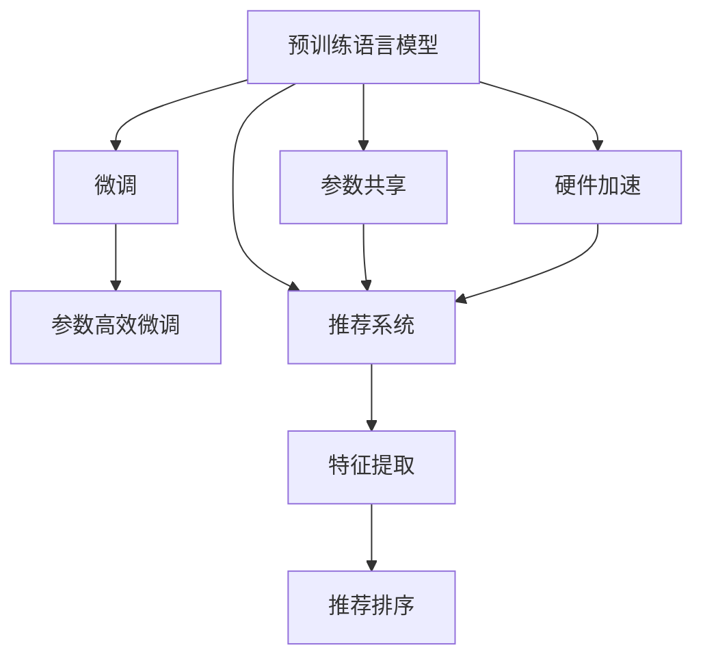

                 

# LLM在推荐系统的局限与成本：对硬件与算力需求的平衡

> 关键词：自然语言处理, 推荐系统, 深度学习, 预训练语言模型, 微调, 参数高效微调, 硬件加速, 成本优化

## 1. 背景介绍

### 1.1 问题由来
在自然语言处理(NLP)领域，预训练语言模型(LLMs)的应用已经从文本分类、情感分析、机器翻译等任务拓展到推荐系统。推荐系统旨在根据用户历史行为和偏好，推荐最符合用户兴趣的商品或内容。传统的推荐系统主要依赖于基于用户行为的数据特征提取，而预训练语言模型则通过在大规模文本数据上进行预训练，学习到了广泛的语义和知识表示。在微调框架下，预训练语言模型可以被广泛应用于推荐系统，从而提升推荐的个性化和多样化。

然而，预训练语言模型的应用也面临着一些挑战。由于其参数量巨大，对硬件和算力提出了较高的要求，使得推荐系统在实际部署和运行中，常常面临资源紧张和成本高昂的问题。如何平衡硬件需求和算力消耗，以低成本实现高质量推荐，成为当前研究的关键问题。

### 1.2 问题核心关键点
预训练语言模型在推荐系统中的应用主要集中在以下几个方面：
- 基于文本的用户行为分析：通过文本预训练和微调，将用户评论、商品描述等文本特征转化为模型输入，提升用户行为建模的深度和广度。
- 基于文本的推荐内容生成：利用预训练语言模型的生成能力，自动生成高质量的推荐内容摘要或说明，提升推荐的多样性和个性化。
- 基于文本的推荐排序优化：结合预训练语言模型的语义相似度和情感分析结果，对推荐结果进行排序优化，提升推荐的相关性和用户体验。

但同时，预训练语言模型在推荐系统中的应用也存在以下问题：
- 高计算成本：大规模预训练模型的参数量庞大，对计算硬件和存储提出了高要求，导致推荐系统的训练和推理成本高昂。
- 高内存消耗：预训练语言模型通常需要较大的显存，使得推荐系统在实际部署时，面临着内存不足的问题。
- 低推理速度：预训练语言模型的推理速度较慢，无法满足推荐系统对实时性的要求。
- 泛化能力不足：预训练语言模型通常依赖于大量无标签文本数据进行预训练，其泛化能力可能与特定领域数据分布不符，影响推荐的泛化性。

## 2. 核心概念与联系

### 2.1 核心概念概述

为更好地理解预训练语言模型在推荐系统中的应用和局限，本节将介绍几个密切相关的核心概念：

- 预训练语言模型(LLMs)：如BERT、GPT等，通过在大规模无标签文本语料上进行自监督学习任务训练，学习到丰富的语言知识和表示。
- 微调(Fine-Tuning)：在预训练模型的基础上，使用推荐系统任务的少量标注数据，通过有监督学习优化模型在特定任务上的性能。
- 参数高效微调(PEFT)：指在微调过程中，只更新少量的模型参数，而固定大部分预训练权重不变，以提高微调效率，避免过拟合的方法。
- 推荐系统(Recommendation System)：根据用户历史行为和偏好，推荐最符合用户兴趣的商品或内容，包括基于内容的推荐、协同过滤推荐、混合推荐等。
- 特征提取(Feature Extraction)：从用户行为数据中提取出有意义的特征，构建推荐系统的输入。
- 推荐排序(Ranking)：对推荐结果进行排序优化，提升推荐的相关性和用户体验。
- 参数共享(Parameter Sharing)：在推荐模型中，共享部分预训练参数以提升模型效率。
- 硬件加速(Hardware Acceleration)：通过GPU、TPU等硬件设备进行计算加速。

这些核心概念之间的逻辑关系可以通过以下Mermaid流程图来展示：



这个流程图展示了大语言模型在推荐系统中的应用流程：

1. 预训练语言模型通过在大规模无标签文本语料上进行自监督学习任务训练，学习到丰富的语言知识和表示。
2. 在推荐系统中，通过微调框架将预训练模型应用于特定任务，如用户行为分析、内容生成、推荐排序等。
3. 参数高效微调方法用于优化微调过程，提高模型效率。
4. 推荐系统通过特征提取和推荐排序，为用户提供个性化的推荐结果。
5. 参数共享策略用于提高推荐模型的训练和推理效率。
6. 硬件加速技术用于提升推荐系统的计算性能。

## 3. 核心算法原理 & 具体操作步骤
### 3.1 算法原理概述

预训练语言模型在推荐系统中的应用，本质上是一个有监督的迁移学习过程。其核心思想是：将预训练的语言模型视作一个强大的"特征提取器"，通过在推荐系统任务的少量标注数据上进行有监督的微调，使得模型输出能够匹配推荐系统任务的目标，从而获得针对特定任务优化的推荐模型。

形式化地，假设预训练语言模型为 $M_{\theta}$，其中 $\theta$ 为预训练得到的模型参数。给定推荐系统任务 $T$ 的标注数据集 $D=\{(x_i,y_i)\}_{i=1}^N, x_i \in \mathcal{X}, y_i \in \mathcal{Y}$，微调的目标是找到新的模型参数 $\hat{\theta}$，使得：

$$
\hat{\theta}=\mathop{\arg\min}_{\theta} \mathcal{L}(M_{\theta},D)
$$

其中 $\mathcal{L}$ 为针对推荐系统任务设计的损失函数，用于衡量模型预测输出与真实标签之间的差异。常见的损失函数包括交叉熵损失、均方误差损失等。

通过梯度下降等优化算法，微调过程不断更新模型参数 $\theta$，最小化损失函数 $\mathcal{L}$，使得模型输出逼近真实标签。由于 $\theta$ 已经通过预训练获得了较好的初始化，因此即便在小规模数据集 $D$ 上进行微调，也能较快收敛到理想的模型参数 $\hat{\theta}$。

### 3.2 算法步骤详解

预训练语言模型在推荐系统中的应用，通常包括以下几个关键步骤：

**Step 1: 准备预训练模型和数据集**
- 选择合适的预训练语言模型 $M_{\theta}$ 作为初始化参数，如 BERT、GPT 等。
- 准备推荐系统任务的标注数据集 $D$，划分为训练集、验证集和测试集。一般要求标注数据与预训练数据的分布不要差异过大。

**Step 2: 设计任务适配层**
- 根据推荐系统任务类型，在预训练语言模型顶层设计合适的输出层和损失函数。
- 对于分类任务，通常在顶层添加线性分类器和交叉熵损失函数。
- 对于生成任务，通常使用语言模型的解码器输出概率分布，并以负对数似然为损失函数。

**Step 3: 设置微调超参数**
- 选择合适的优化算法及其参数，如 AdamW、SGD 等，设置学习率、批大小、迭代轮数等。
- 设置正则化技术及强度，包括权重衰减、Dropout、Early Stopping 等。
- 确定冻结预训练参数的策略，如仅微调顶层，或全部参数都参与微调。

**Step 4: 执行梯度训练**
- 将训练集数据分批次输入模型，前向传播计算损失函数。
- 反向传播计算参数梯度，根据设定的优化算法和学习率更新模型参数。
- 周期性在验证集上评估模型性能，根据性能指标决定是否触发 Early Stopping。
- 重复上述步骤直到满足预设的迭代轮数或 Early Stopping 条件。

**Step 5: 测试和部署**
- 在测试集上评估微调后模型 $M_{\hat{\theta}}$ 的性能，对比微调前后的精度提升。
- 使用微调后的模型对新样本进行推理预测，集成到实际的应用系统中。
- 持续收集新的数据，定期重新微调模型，以适应数据分布的变化。

以上是预训练语言模型在推荐系统中的应用的一般流程。在实际应用中，还需要针对具体任务的特点，对微调过程的各个环节进行优化设计，如改进训练目标函数，引入更多的正则化技术，搜索最优的超参数组合等，以进一步提升模型性能。

### 3.3 算法优缺点

预训练语言模型在推荐系统中的应用，具有以下优点：
1. 提升推荐质量：预训练语言模型通过学习大规模文本数据，能够提供更加丰富和准确的语义表示，从而提升推荐的深度和广度。
2. 增强泛化能力：预训练语言模型在大规模数据上预训练，能够更好地泛化到不同领域和场景，提升推荐系统的通用性。
3. 提供多样性：预训练语言模型具备生成能力，能够自动生成高质量的推荐内容，增强推荐的多样性和个性化。

但同时，预训练语言模型在推荐系统中的应用也存在以下缺点：
1. 高计算成本：大规模预训练模型的参数量庞大，对计算硬件和存储提出了高要求，导致推荐系统的训练和推理成本高昂。
2. 高内存消耗：预训练语言模型通常需要较大的显存，使得推荐系统在实际部署时，面临着内存不足的问题。
3. 低推理速度：预训练语言模型的推理速度较慢，无法满足推荐系统对实时性的要求。
4. 泛化能力不足：预训练语言模型通常依赖于大量无标签文本数据进行预训练，其泛化能力可能与特定领域数据分布不符，影响推荐的泛化性。

尽管存在这些局限性，但就目前而言，预训练语言模型在推荐系统中的应用仍然是最主流范式。未来相关研究的重点在于如何进一步降低预训练模型的计算成本，提高模型的泛化能力和推理效率，同时兼顾可解释性和伦理安全性等因素。

### 3.4 算法应用领域

预训练语言模型在推荐系统中的应用，已经在商品推荐、内容推荐、广告推荐等多个领域得到了广泛的应用，取得了显著的效果。

**商品推荐**：通过预训练语言模型，对用户评论、商品描述等文本进行微调，学习用户对商品的语义表示。在推荐系统中，根据用户输入的商品查询，生成商品推荐列表。预训练语言模型能够提供更加精准和多样化的商品推荐，提升用户购物体验。

**内容推荐**：在新闻、视频、音乐等平台中，通过预训练语言模型，对用户评论、内容描述等文本进行微调，学习用户对内容的兴趣和偏好。在推荐系统中，根据用户输入的查询，生成内容推荐列表。预训练语言模型能够提供更加个性化和多样化的内容推荐，提升用户娱乐体验。

**广告推荐**：在广告投放平台上，通过预训练语言模型，对广告文本进行微调，学习广告的语义表示。在推荐系统中，根据用户兴趣和行为，生成精准的广告推荐。预训练语言模型能够提供更加高效的广告推荐，提升广告点击率和转化率。

除了上述这些经典应用外，预训练语言模型在推荐系统中的应用还在不断拓展，如可控文本生成、情感分析、代码推荐等，为推荐系统带来了新的突破。随着预训练语言模型和微调方法的不断进步，相信推荐系统必将在更广阔的应用领域大放异彩。

## 4. 数学模型和公式 & 详细讲解 & 举例说明
### 4.1 数学模型构建

本节将使用数学语言对预训练语言模型在推荐系统中的应用进行更加严格的刻画。

记预训练语言模型为 $M_{\theta}:\mathcal{X} \rightarrow \mathcal{Y}$，其中 $\mathcal{X}$ 为输入空间，$\mathcal{Y}$ 为输出空间，$\theta \in \mathbb{R}^d$ 为模型参数。假设推荐系统任务为 $T$ 的标注数据集为 $D=\{(x_i,y_i)\}_{i=1}^N, x_i \in \mathcal{X}, y_i \in \mathcal{Y}$。

定义模型 $M_{\theta}$ 在数据样本 $(x,y)$ 上的损失函数为 $\ell(M_{\theta}(x),y)$，则在数据集 $D$ 上的经验风险为：

$$
\mathcal{L}(\theta) = \frac{1}{N} \sum_{i=1}^N \ell(M_{\theta}(x_i),y_i)
$$

微调的优化目标是最小化经验风险，即找到最优参数：

$$
\theta^* = \mathop{\arg\min}_{\theta} \mathcal{L}(\theta)
$$

在实践中，我们通常使用基于梯度的优化算法（如SGD、Adam等）来近似求解上述最优化问题。设 $\eta$ 为学习率，$\lambda$ 为正则化系数，则参数的更新公式为：

$$
\theta \leftarrow \theta - \eta \nabla_{\theta}\mathcal{L}(\theta) - \eta\lambda\theta
$$

其中 $\nabla_{\theta}\mathcal{L}(\theta)$ 为损失函数对参数 $\theta$ 的梯度，可通过反向传播算法高效计算。

### 4.2 公式推导过程

以下我们以商品推荐任务为例，推导交叉熵损失函数及其梯度的计算公式。

假设模型 $M_{\theta}$ 在输入 $x$ 上的输出为 $\hat{y}=M_{\theta}(x) \in [0,1]$，表示商品被用户喜欢的概率。真实标签 $y \in \{0,1\}$。则二分类交叉熵损失函数定义为：

$$
\ell(M_{\theta}(x),y) = -[y\log \hat{y} + (1-y)\log (1-\hat{y})]
$$

将其代入经验风险公式，得：

$$
\mathcal{L}(\theta) = -\frac{1}{N}\sum_{i=1}^N [y_i\log M_{\theta}(x_i)+(1-y_i)\log(1-M_{\theta}(x_i))]
$$

根据链式法则，损失函数对参数 $\theta_k$ 的梯度为：

$$
\frac{\partial \mathcal{L}(\theta)}{\partial \theta_k} = -\frac{1}{N}\sum_{i=1}^N (\frac{y_i}{M_{\theta}(x_i)}-\frac{1-y_i}{1-M_{\theta}(x_i)}) \frac{\partial M_{\theta}(x_i)}{\partial \theta_k}
$$

其中 $\frac{\partial M_{\theta}(x_i)}{\partial \theta_k}$ 可进一步递归展开，利用自动微分技术完成计算。

在得到损失函数的梯度后，即可带入参数更新公式，完成模型的迭代优化。重复上述过程直至收敛，最终得到适应推荐系统任务的最优模型参数 $\theta^*$。

## 5. 项目实践：代码实例和详细解释说明
### 5.1 开发环境搭建

在进行推荐系统微调实践前，我们需要准备好开发环境。以下是使用Python进行PyTorch开发的环境配置流程：

1. 安装Anaconda：从官网下载并安装Anaconda，用于创建独立的Python环境。

2. 创建并激活虚拟环境：
```bash
conda create -n pytorch-env python=3.8 
conda activate pytorch-env
```

3. 安装PyTorch：根据CUDA版本，从官网获取对应的安装命令。例如：
```bash
conda install pytorch torchvision torchaudio cudatoolkit=11.1 -c pytorch -c conda-forge
```

4. 安装Transformers库：
```bash
pip install transformers
```

5. 安装各类工具包：
```bash
pip install numpy pandas scikit-learn matplotlib tqdm jupyter notebook ipython
```

完成上述步骤后，即可在`pytorch-env`环境中开始推荐系统微调实践。

### 5.2 源代码详细实现

这里我们以商品推荐任务为例，给出使用Transformers库对BERT模型进行微调的PyTorch代码实现。

首先，定义商品推荐任务的数据处理函数：

```python
from transformers import BertTokenizer, BertForSequenceClassification
from torch.utils.data import Dataset
import torch

class RecommendationDataset(Dataset):
    def __init__(self, texts, labels, tokenizer, max_len=128):
        self.texts = texts
        self.labels = labels
        self.tokenizer = tokenizer
        self.max_len = max_len
        
    def __len__(self):
        return len(self.texts)
    
    def __getitem__(self, item):
        text = self.texts[item]
        label = self.labels[item]
        
        encoding = self.tokenizer(text, return_tensors='pt', max_length=self.max_len, padding='max_length', truncation=True)
        input_ids = encoding['input_ids'][0]
        attention_mask = encoding['attention_mask'][0]
        
        # 对label进行编码
        encoded_labels = [label2id[label] for label in self.labels] 
        encoded_labels.extend([label2id['not interested']] * (self.max_len - len(encoded_labels)))
        labels = torch.tensor(encoded_labels, dtype=torch.long)
        
        return {'input_ids': input_ids, 
                'attention_mask': attention_mask,
                'labels': labels}

# 标签与id的映射
label2id = {'not interested': 0, 'recommend': 1}
id2label = {v: k for k, v in label2id.items()}

# 创建dataset
tokenizer = BertTokenizer.from_pretrained('bert-base-cased')

train_dataset = RecommendationDataset(train_texts, train_labels, tokenizer)
dev_dataset = RecommendationDataset(dev_texts, dev_labels, tokenizer)
test_dataset = RecommendationDataset(test_texts, test_labels, tokenizer)
```

然后，定义模型和优化器：

```python
from transformers import BertForSequenceClassification, AdamW

model = BertForSequenceClassification.from_pretrained('bert-base-cased', num_labels=len(label2id))

optimizer = AdamW(model.parameters(), lr=2e-5)
```

接着，定义训练和评估函数：

```python
from torch.utils.data import DataLoader
from tqdm import tqdm
from sklearn.metrics import accuracy_score

device = torch.device('cuda') if torch.cuda.is_available() else torch.device('cpu')
model.to(device)

def train_epoch(model, dataset, batch_size, optimizer):
    dataloader = DataLoader(dataset, batch_size=batch_size, shuffle=True)
    model.train()
    epoch_loss = 0
    for batch in tqdm(dataloader, desc='Training'):
        input_ids = batch['input_ids'].to(device)
        attention_mask = batch['attention_mask'].to(device)
        labels = batch['labels'].to(device)
        model.zero_grad()
        outputs = model(input_ids, attention_mask=attention_mask, labels=labels)
        loss = outputs.loss
        epoch_loss += loss.item()
        loss.backward()
        optimizer.step()
    return epoch_loss / len(dataloader)

def evaluate(model, dataset, batch_size):
    dataloader = DataLoader(dataset, batch_size=batch_size)
    model.eval()
    preds, labels = [], []
    with torch.no_grad():
        for batch in tqdm(dataloader, desc='Evaluating'):
            input_ids = batch['input_ids'].to(device)
            attention_mask = batch['attention_mask'].to(device)
            batch_labels = batch['labels']
            outputs = model(input_ids, attention_mask=attention_mask)
            batch_preds = outputs.logits.argmax(dim=2).to('cpu').tolist()
            batch_labels = batch_labels.to('cpu').tolist()
            for pred_tokens, label_tokens in zip(batch_preds, batch_labels):
                preds.append(pred_tokens[:len(label_tokens)])
                labels.append(label_tokens)
                
    return accuracy_score(labels, preds)
```

最后，启动训练流程并在测试集上评估：

```python
epochs = 5
batch_size = 16

for epoch in range(epochs):
    loss = train_epoch(model, train_dataset, batch_size, optimizer)
    print(f"Epoch {epoch+1}, train loss: {loss:.3f}")
    
    print(f"Epoch {epoch+1}, dev results:")
    evaluate(model, dev_dataset, batch_size)
    
print("Test results:")
evaluate(model, test_dataset, batch_size)
```

以上就是使用PyTorch对BERT进行商品推荐任务微调的完整代码实现。可以看到，得益于Transformers库的强大封装，我们可以用相对简洁的代码完成BERT模型的加载和微调。

### 5.3 代码解读与分析

让我们再详细解读一下关键代码的实现细节：

**RecommendationDataset类**：
- `__init__`方法：初始化文本、标签、分词器等关键组件。
- `__len__`方法：返回数据集的样本数量。
- `__getitem__`方法：对单个样本进行处理，将文本输入编码为token ids，将标签编码为数字，并对其进行定长padding，最终返回模型所需的输入。

**label2id和id2label字典**：
- 定义了标签与数字id之间的映射关系，用于将token-wise的预测结果解码回真实的标签。

**训练和评估函数**：
- 使用PyTorch的DataLoader对数据集进行批次化加载，供模型训练和推理使用。
- 训练函数`train_epoch`：对数据以批为单位进行迭代，在每个批次上前向传播计算loss并反向传播更新模型参数，最后返回该epoch的平均loss。
- 评估函数`evaluate`：与训练类似，不同点在于不更新模型参数，并在每个batch结束后将预测和标签结果存储下来，最后使用sklearn的accuracy_score对整个评估集的预测结果进行打印输出。

**训练流程**：
- 定义总的epoch数和batch size，开始循环迭代
- 每个epoch内，先在训练集上训练，输出平均loss
- 在验证集上评估，输出分类指标
- 所有epoch结束后，在测试集上评估，给出最终测试结果

可以看到，PyTorch配合Transformers库使得BERT微调的代码实现变得简洁高效。开发者可以将更多精力放在数据处理、模型改进等高层逻辑上，而不必过多关注底层的实现细节。

当然，工业级的系统实现还需考虑更多因素，如模型的保存和部署、超参数的自动搜索、更灵活的任务适配层等。但核心的微调范式基本与此类似。

## 6. 实际应用场景
### 6.1 智能推荐系统

基于预训练语言模型微调的推荐系统，可以广泛应用于电子商务、视频流媒体、在线广告等多个领域。推荐系统旨在根据用户历史行为和偏好，推荐最符合用户兴趣的商品或内容。

在技术实现上，可以收集用户浏览、点击、购买等行为数据，提取和商品、内容等文本特征。将文本特征作为模型输入，用户的后续行为作为监督信号，在此基础上对预训练语言模型进行微调。微调后的推荐模型能够从文本特征中准确把握用户的兴趣点，提供个性化和多样化的推荐结果。

### 6.2 广告投放系统

在广告投放平台上，通过预训练语言模型，对广告文本进行微调，学习广告的语义表示。在推荐系统中，根据用户兴趣和行为，生成精准的广告推荐。预训练语言模型能够提供更加高效的广告推荐，提升广告点击率和转化率。

在技术实现上，可以收集用户的历史行为数据，如点击、观看等，提取广告文本和用户行为特征。将广告文本作为模型输入，用户行为作为监督信号，在此基础上对预训练语言模型进行微调。微调后的广告推荐模型能够根据用户兴趣和行为，生成精准的广告推荐。

### 6.3 新闻推荐系统

在新闻推荐平台上，通过预训练语言模型，对新闻标题和内容进行微调，学习新闻的语义表示。在推荐系统中，根据用户的历史行为和兴趣，生成个性化的新闻推荐。预训练语言模型能够提供更加精准和多样化的新闻推荐，提升用户阅读体验。

在技术实现上，可以收集用户的历史浏览数据，提取新闻标题和内容文本特征。将新闻文本作为模型输入，用户浏览行为作为监督信号，在此基础上对预训练语言模型进行微调。微调后的新闻推荐模型能够根据用户兴趣和行为，生成个性化的新闻推荐。

### 6.4 未来应用展望

随着预训练语言模型和微调方法的不断发展，基于微调范式将在更多领域得到应用，为各行各业带来变革性影响。

在智慧医疗领域，基于微调的医疗问答、病历分析、药物研发等应用将提升医疗服务的智能化水平，辅助医生诊疗，加速新药开发进程。

在智能教育领域，微调技术可应用于作业批改、学情分析、知识推荐等方面，因材施教，促进教育公平，提高教学质量。

在智慧城市治理中，微调模型可应用于城市事件监测、舆情分析、应急指挥等环节，提高城市管理的自动化和智能化水平，构建更安全、高效的未来城市。

此外，在企业生产、社会治理、文娱传媒等众多领域，基于大模型微调的人工智能应用也将不断涌现，为经济社会发展注入新的动力。相信随着技术的日益成熟，微调方法将成为人工智能落地应用的重要范式，推动人工智能向更广阔的领域加速渗透。

## 7. 工具和资源推荐
### 7.1 学习资源推荐

为了帮助开发者系统掌握预训练语言模型微调的理论基础和实践技巧，这里推荐一些优质的学习资源：

1. 《Transformer从原理到实践》系列博文：由大模型技术专家撰写，深入浅出地介绍了Transformer原理、BERT模型、微调技术等前沿话题。

2. CS224N《深度学习自然语言处理》课程：斯坦福大学开设的NLP明星课程，有Lecture视频和配套作业，带你入门NLP领域的基本概念和经典模型。

3. 《Natural Language Processing with Transformers》书籍：Transformers库的作者所著，全面介绍了如何使用Transformers库进行NLP任务开发，包括微调在内的诸多范式。

4. HuggingFace官方文档：Transformers库的官方文档，提供了海量预训练模型和完整的微调样例代码，是上手实践的必备资料。

5. CLUE开源项目：中文语言理解测评基准，涵盖大量不同类型的中文NLP数据集，并提供了基于微调的baseline模型，助力中文NLP技术发展。

通过对这些资源的学习实践，相信你一定能够快速掌握预训练语言模型微调的精髓，并用于解决实际的NLP问题。
###  7.2 开发工具推荐

高效的开发离不开优秀的工具支持。以下是几款用于预训练语言模型微调开发的常用工具：

1. PyTorch：基于Python的开源深度学习框架，灵活动态的计算图，适合快速迭代研究。大部分预训练语言模型都有PyTorch版本的实现。

2. TensorFlow：由Google主导开发的开源深度学习框架，生产部署方便，适合大规模工程应用。同样有丰富的预训练语言模型资源。

3. Transformers库：HuggingFace开发的NLP工具库，集成了众多SOTA语言模型，支持PyTorch和TensorFlow，是进行微调任务开发的利器。

4. Weights & Biases：模型训练的实验跟踪工具，可以记录和可视化模型训练过程中的各项指标，方便对比和调优。与主流深度学习框架无缝集成。

5. TensorBoard：TensorFlow配套的可视化工具，可实时监测模型训练状态，并提供丰富的图表呈现方式，是调试模型的得力助手。

6. Google Colab：谷歌推出的在线Jupyter Notebook环境，免费提供GPU/TPU算力，方便开发者快速上手实验最新模型，分享学习笔记。

合理利用这些工具，可以显著提升预训练语言模型微调的开发效率，加快创新迭代的步伐。

### 7.3 相关论文推荐

预训练语言模型和微调技术的发展源于学界的持续研究。以下是几篇奠基性的相关论文，推荐阅读：

1. Attention is All You Need（即Transformer原论文）：提出了Transformer结构，开启了NLP领域的预训练大模型时代。

2. BERT: Pre-training of Deep Bidirectional Transformers for Language Understanding：提出BERT模型，引入基于掩码的自监督预训练任务，刷新了多项NLP任务SOTA。

3. Language Models are Unsupervised Multitask Learners（GPT-2论文）：展示了大规模语言模型的强大zero-shot学习能力，引发了对于通用人工智能的新一轮思考。

4. Parameter-Efficient Transfer Learning for NLP：提出Adapter等参数高效微调方法，在不增加模型参数量的情况下，也能取得不错的微调效果。

5. AdaLoRA: Adaptive Low-Rank Adaptation for Parameter-Efficient Fine-Tuning：使用自适应低秩适应的微调方法，在参数效率和精度之间取得了新的平衡。

6. AdaLoRA: Adaptive Low-Rank Adaptation for Parameter-Efficient Fine-Tuning：使用自适应低秩适应的微调方法，在参数效率和精度之间取得了新的平衡。

这些论文代表了大模型微调技术的发展脉络。通过学习这些前沿成果，可以帮助研究者把握学科前进方向，激发更多的创新灵感。

## 8. 总结：未来发展趋势与挑战

### 8.1 总结

本文对预训练语言模型在推荐系统中的应用进行了全面系统的介绍。首先阐述了预训练语言模型和微调技术的研究背景和意义，明确了微调在拓展预训练模型应用、提升推荐系统性能方面的独特价值。其次，从原理到实践，详细讲解了微调数学原理和关键步骤，给出了微调任务开发的完整代码实例。同时，本文还广泛探讨了微调方法在智能推荐、广告投放、新闻推荐等多个行业领域的应用前景，展示了微调范式的巨大潜力。

通过本文的系统梳理，可以看到，预训练语言模型在推荐系统中的应用面临着计算成本高、内存消耗大、推理速度慢等挑战。但通过参数高效微调、硬件加速等策略，可以在一定程度上缓解这些挑战，提升推荐系统的性能和可扩展性。未来，伴随预训练语言模型和微调方法的持续演进，推荐系统必将在更广阔的应用领域大放异彩，深刻影响人类的生产生活方式。

### 8.2 未来发展趋势

展望未来，预训练语言模型在推荐系统中的应用将呈现以下几个发展趋势：

1. 模型规模持续增大。随着算力成本的下降和数据规模的扩张，预训练语言模型的参数量还将持续增长。超大规模语言模型蕴含的丰富语言知识，有望支撑更加复杂多变的推荐系统微调。

2. 微调方法日趋多样。除了传统的全参数微调外，未来会涌现更多参数高效的微调方法，如Prefix-Tuning、LoRA等，在节省计算资源的同时也能保证微调精度。

3. 持续学习成为常态。随着数据分布的不断变化，微调模型也需要持续学习新知识以保持性能。如何在不遗忘原有知识的同时，高效吸收新样本信息，将成为重要的研究课题。

4. 标注样本需求降低。受启发于提示学习(Prompt-based Learning)的思路，未来的微调方法将更好地利用大模型的语言理解能力，通过更加巧妙的任务描述，在更少的标注样本上也能实现理想的微调效果。

5. 多模态微调崛起。当前的微调主要聚焦于纯文本数据，未来会进一步拓展到图像、视频、语音等多模态数据微调。多模态信息的融合，将显著提升语言模型对现实世界的理解和建模能力。

6. 模型通用性增强。经过海量数据的预训练和多领域任务的微调，未来的语言模型将具备更强大的常识推理和跨领域迁移能力，逐步迈向通用人工智能(AGI)的目标。

以上趋势凸显了预训练语言模型微调技术的广阔前景。这些方向的探索发展，必将进一步提升推荐系统的性能和应用范围，为人类认知智能的进化带来深远影响。

### 8.3 面临的挑战

尽管预训练语言模型在推荐系统中的应用已经取得了显著效果，但在迈向更加智能化、普适化应用的过程中，它仍面临着诸多挑战：

1. 标注成本瓶颈。虽然微调大大降低了标注数据的需求，但对于长尾应用场景，难以获得充足的高质量标注数据，成为制约微调性能的瓶颈。如何进一步降低微调对标注样本的依赖，将是一大难题。

2. 模型鲁棒性不足。当前微调模型面对域外数据时，泛化性能往往大打折扣。对于测试样本的微小扰动，微调模型的预测也容易发生波动。如何提高微调模型的鲁棒性，避免灾难性遗忘，还需要更多理论和实践的积累。

3. 推理效率有待提高。大规模语言模型虽然精度高，但在实际部署时往往面临推理速度慢、内存占用大等效率问题。如何在保证性能的同时，简化模型结构，提升推理速度，优化资源占用，将是重要的优化方向。

4. 可解释性亟需加强。当前微调模型更像是"黑盒"系统，难以解释其内部工作机制和决策逻辑。对于医疗、金融等高风险应用，算法的可解释性和可审计性尤为重要。如何赋予微调模型更强的可解释性，将是亟待攻克的难题。

5. 安全性有待保障。预训练语言模型难免会学习到有偏见、有害的信息，通过微调传递到下游任务，产生误导性、歧视性的输出，给实际应用带来安全隐患。如何从数据和算法层面消除模型偏见，避免恶意用途，确保输出的安全性，也将是重要的研究课题。

6. 知识整合能力不足。现有的微调模型往往局限于任务内数据，难以灵活吸收和运用更广泛的先验知识。如何让微调过程更好地与外部知识库、规则库等专家知识结合，形成更加全面、准确的信息整合能力，还有很大的想象空间。

正视预训练语言模型微调面临的这些挑战，积极应对并寻求突破，将是大模型微调走向成熟的必由之路。相信随着学界和产业界的共同努力，这些挑战终将一一被克服，预训练语言模型微调必将在构建人机协同的智能时代中扮演越来越重要的角色。

### 8.4 研究展望

面对预训练语言模型微调所面临的种种挑战，未来的研究需要在以下几个方面寻求新的突破：

1. 探索无监督和半监督微调方法。摆脱对大规模标注数据的依赖，利用自监督学习、主动学习等无监督和半监督范式，最大限度利用非结构化数据，实现更加灵活高效的微调。

2. 研究参数高效和计算高效的微调范式。开发更加参数高效的微调方法，在固定大部分预训练参数的同时，只更新极少量的任务相关参数。同时优化微调模型的计算图，减少前向传播和反向传播的资源消耗，实现更加轻量级、实时性的部署。

3. 融合因果和对比学习范式。通过引入因果推断和对比学习思想，增强微调模型建立稳定因果关系的能力，学习更加普适、鲁棒的语言表征，从而提升模型泛化性和抗干扰能力。

4. 引入更多先验知识。将符号化的先验知识，如知识图谱、逻辑规则等，与神经网络模型进行巧妙融合，引导微调过程学习更准确、合理的语言模型。同时加强不同模态数据的整合，实现视觉、语音等多模态信息与文本信息的协同建模。

5. 结合因果分析和博弈论工具。将因果分析方法引入微调模型，识别出模型决策的关键特征，增强输出解释的因果性和逻辑性。借助博弈论工具刻画人机交互过程，主动探索并规避模型的脆弱点，提高系统稳定性。

6. 纳入伦理道德约束。在模型训练目标中引入伦理导向的评估指标，过滤和惩罚有偏见、有害的输出倾向。同时加强人工干预和审核，建立模型行为的监管机制，确保输出符合人类价值观和伦理道德。

这些研究方向的探索，必将引领预训练语言模型微调技术迈向更高的台阶，为构建安全、可靠、可解释、可控的智能系统铺平道路。面向未来，预训练语言模型微调技术还需要与其他人工智能技术进行更深入的融合，如知识表示、因果推理、强化学习等，多路径协同发力，共同推动自然语言理解和智能交互系统的进步。只有勇于创新、敢于突破，才能不断拓展语言模型的边界，让智能技术更好地造福人类社会。

## 9. 附录：常见问题与解答

**Q1：预训练语言模型在推荐系统中的作用是什么？**

A: 预训练语言模型在推荐系统中的作用主要体现在以下几个方面：
1. 特征提取：通过预训练语言模型，将用户评论、商品描述等文本特征转化为模型输入，提升用户行为建模的深度和广度。
2. 生成内容：利用预训练语言模型的生成能力，自动生成高质量的推荐内容摘要或说明，提升推荐的多样性和个性化。
3. 排序优化：结合预训练语言模型的语义相似度和情感分析结果，对推荐结果进行排序优化，提升推荐的相关性和用户体验。

**Q2：微调过程中如何选择合适的学习率？**

A: 微调的学习率一般要比预训练时小1-2个数量级，如果使用过大的学习率，容易破坏预训练权重，导致过拟合。一般建议从1e-5开始调参，逐步减小学习率，直至收敛。也可以使用warmup策略，在开始阶段使用较小的学习率，再逐渐过渡到预设值。需要注意的是，不同的优化器(如AdamW、Adafactor等)以及不同的学习率调度策略，可能需要设置不同的学习率阈值。

**Q3：如何缓解微调过程中的过拟合问题？**

A: 过拟合是微调面临的主要挑战，尤其是在标注数据不足的情况下。常见的缓解策略包括：
1. 数据增强：通过回译、近义替换等方式扩充训练集
2. 正则化：使用L2正则、Dropout、Early Stopping等避免过拟合
3. 对抗训练：引入对抗样本，提高模型鲁棒性
4. 参数高效微调：只调整少量参数(如Adapter、Prefix等)，减小过拟合风险
5. 多模型集成：训练多个微调模型，取平均输出，抑制过拟合

这些策略往往需要根据具体任务和数据特点进行灵活组合。只有在数据、模型、训练、推理等各环节进行全面优化，才能最大限度地发挥预训练语言模型的潜力。

**Q4：预训练语言模型在推荐系统中的应用面临哪些挑战？**

A: 预训练语言模型在推荐系统中的应用面临以下挑战：
1. 高计算成本：大规模预训练模型的参数量庞大，对计算硬件和存储提出了高要求，导致推荐系统的训练和推理成本高昂。
2. 高内存消耗：预训练语言模型通常需要较大的显存，使得推荐系统在实际部署时，面临着内存不足的问题。
3. 低推理速度：预训练语言模型的推理速度较慢，无法满足推荐系统对实时性的要求。
4. 泛化能力不足：预训练语言模型通常依赖于大量无标签文本数据进行预训练，其泛化能力可能与特定领域数据分布不符，影响推荐的泛化性。

尽管存在这些局限性，但就目前而言，预训练语言模型在推荐系统中的应用仍然是最主流范式。未来相关研究的重点在于如何进一步降低预训练模型的计算成本，提高模型的泛化能力和推理效率，同时兼顾可解释性和伦理安全性等因素。

**Q5：如何在推荐系统中优化预训练语言模型的性能？**

A: 在推荐系统中优化预训练语言模型的性能，可以从以下几个方面入手：
1. 参数高效微调：只更新少量的模型参数，而固定大部分预训练权重不变，以提高微调效率，避免过拟合。
2. 硬件加速：利用GPU、TPU等硬件设备进行计算加速，提升推荐系统的计算性能。
3. 模型裁剪：去除不必要的层和参数，减小模型尺寸，加快推理速度。
4. 量化加速：将浮点模型转为定点模型，压缩存储空间，提高计算效率。
5. 模型并行：利用分布式训练和推理，平衡资源利用率和计算效率。

合理利用这些优化策略，可以在保证预训练语言模型性能的同时，降低推荐系统的计算成本和内存消耗，提升推荐系统的实时性和可扩展性。

总之，预训练语言模型在推荐系统中的应用，已经展现出了巨大的潜力和价值。尽管面临诸多挑战，但通过不断的技术创新和优化，预训练语言模型必将在推荐系统中发挥更大的作用，为人类带来更加智能化、个性化、高效化的信息推荐体验。

---

作者：禅与计算机程序设计艺术 / Zen and the Art of Computer Programming

