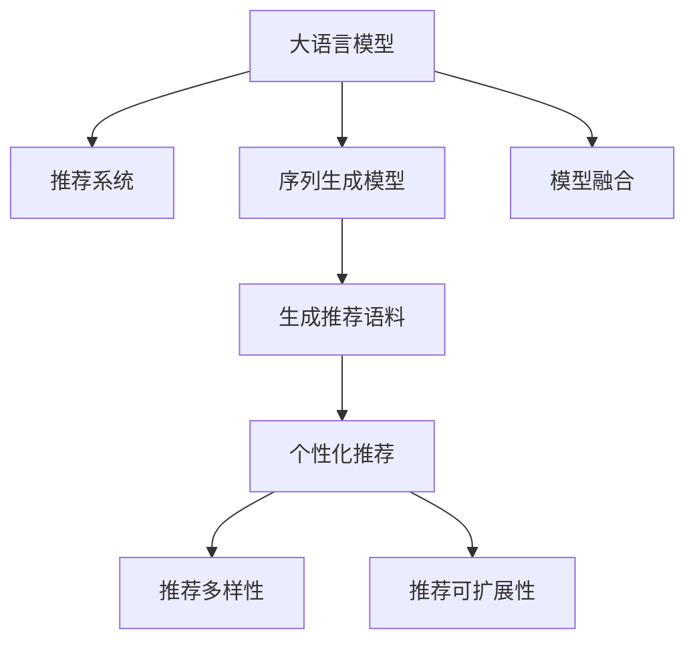

                 

# LLM在推荐系统的应用：多样性与可扩展性

> 关键词：大语言模型(LLM),推荐系统,多样性,可扩展性,序列生成模型,模型融合

## 1. 背景介绍

### 1.1 问题由来
推荐系统作为互联网应用中不可或缺的重要部分，其核心目的是提升用户体验、增加业务收益。传统推荐系统通过用户行为数据进行建模，学习用户对不同物品的兴趣偏好，并给出个性化的推荐。但随着推荐应用场景的多样化和用户需求的变化，传统推荐系统的瓶颈逐渐显现。

1. **用户需求的多样化**：不同的用户对同一件物品的评价标准和关注点可能完全不同。传统的基于共性的推荐模型难以满足个性化需求。
2. **物品的多样性**：随着推荐系统的应用领域拓展，需要推荐的物品类型也越来越多样化，从商品、音乐、视频到新闻、图片、网页等，物品类型繁多且难以统一建模。
3. **数据的多样性与缺失**：推荐系统需要海量的用户行为数据进行训练，但在某些小众领域或新上架物品，往往缺乏足够的用户行为数据。
4. **实时性与冷启动问题**：推荐系统需具备实时性，但新用户和新物品的冷启动问题难以快速解决。

### 1.2 问题核心关键点
针对这些问题，大语言模型(LLM)被引入推荐系统，作为一种新的推荐方法，其核心思想是利用大模型的强大语言生成能力，通过序列生成模型的方式，为每个物品生成多样化、可扩展的推荐语料，并在用户的上下文中进行语义匹配。

该方法的关键在于：
1. 使用序列生成模型为物品生成多样化的推荐语料。
2. 在用户上下文中，通过LLM预测推荐语料与用户兴趣的相关性，给出推荐结果。
3. 通过多模型融合，进一步提升推荐结果的多样性和准确性。

大语言模型在推荐系统中的应用，正在为推荐技术带来新的突破，也引发了对推荐系统多样性与可扩展性问题的新思考。

## 2. 核心概念与联系

### 2.1 核心概念概述

为更好地理解LLM在推荐系统中的应用，本节将介绍几个密切相关的核心概念：

- 大语言模型(LLM)：以自回归(如GPT)或自编码(如BERT)模型为代表的大规模预训练语言模型。通过在大规模无标签文本语料上进行预训练，学习通用的语言表示，具备强大的语言理解和生成能力。

- 推荐系统：通过分析用户的行为数据，学习用户对物品的兴趣偏好，并给出个性化的推荐列表的系统。

- 序列生成模型(Sequence Generation Model)：一类生成序列数据的模型，如语言模型、对话生成模型等。其核心思想是从已有数据中学习序列结构，用于生成新的序列数据。

- 模型融合(Modle Fusion)：指通过融合多个模型的输出，提升推荐结果的质量。常用于解决单一模型性能不足的问题。

- 多样性(Diversity)：推荐结果的多样性是指推荐的物品种类繁多，不会过于集中，能够覆盖用户的广泛兴趣。

- 可扩展性(Scalability)：推荐系统的可扩展性指其能够处理大规模、多样化的数据和物品，具备适应不同应用场景的能力。

这些核心概念之间的逻辑关系可以通过以下Mermaid流程图来展示：



这个流程图展示了大语言模型在推荐系统中的应用核心：

1. 大语言模型通过序列生成模型生成推荐语料。
2. 在推荐系统框架下，对推荐语料进行个性化匹配，生成推荐列表。
3. 通过模型融合进一步提升推荐结果的多样性和准确性。

这些概念共同构成了LLM在推荐系统中的工作原理和优化方向。

## 3. 核心算法原理 & 具体操作步骤
### 3.1 算法原理概述

大语言模型在推荐系统中的应用，主要通过以下步骤实现：

1. **生成推荐语料**：使用LLM的序列生成模型为每个物品生成多条推荐语料，以覆盖用户可能感兴趣的不同角度。
2. **个性化匹配**：在用户上下文中，通过LLM预测推荐语料与用户兴趣的相关性，给出推荐列表。
3. **模型融合**：对多个推荐列表进行融合，得到最终的推荐结果。

具体而言，假设推荐系统需要为用户推荐N个物品，每个物品生成K条推荐语料，则生成的推荐语料矩阵为$[N, K]$。在用户上下文中，将每个用户的兴趣表示为向量$\mathbf{u}$，与生成的推荐语料进行匹配，得到推荐分数矩阵$[\mathbf{u}, N, K]$。最终，对分数矩阵进行降维处理，得到推荐列表。

### 3.2 算法步骤详解

**Step 1: 准备数据和模型**
- 收集用户的上下文信息，包括历史行为数据、搜索记录等。
- 准备物品的基本信息，如物品名称、描述、类别等。
- 选择合适的预训练语言模型作为序列生成器，如GPT-3、BERT等。
- 设计个性化匹配的特征工程，如使用物品的特征向量、用户的兴趣向量等。

**Step 2: 序列生成推荐语料**
- 对每个物品使用LLM生成K条推荐语料，构成推荐语料矩阵$[\mathbf{I}, K]$，其中$\mathbf{I}$为物品编号。
- 将推荐语料矩阵与物品信息矩阵进行拼接，形成新的输入序列。
- 在预训练语言模型上进行解码，生成推荐语料序列$[\mathbf{I}, K]$。

**Step 3: 个性化匹配**
- 在用户上下文中，将用户的兴趣表示为向量$\mathbf{u}$，与生成的推荐语料进行匹配。
- 使用相似度度量方法(如余弦相似度、DNN等)计算推荐语料与用户兴趣的相关性。
- 根据相关性排序，得到推荐分数矩阵$[\mathbf{u}, N, K]$。

**Step 4: 模型融合与结果生成**
- 对多个推荐分数矩阵进行融合，得到最终的推荐结果。
- 对推荐结果进行降维和排序，得到推荐列表。
- 在用户界面展示推荐结果。

### 3.3 算法优缺点

大语言模型在推荐系统中的应用具有以下优点：
1. 可扩展性强。能够处理大规模、多样化的数据和物品，适应不同应用场景。
2. 多样性好。通过生成多条推荐语料，能够覆盖用户的广泛兴趣，提升推荐结果的多样性。
3. 灵活性高。适用于各种推荐任务，包括商品推荐、内容推荐、服务推荐等。
4. 表现优异。在多个推荐数据集上，基于LLM的推荐系统取得了优异的性能。

同时，该方法也存在一定的局限性：
1. 计算成本高。需要大量的计算资源进行预训练和序列生成。
2. 需要高质量的数据。预训练数据和用户行为数据的质量对推荐效果有很大影响。
3. 参数量大。大语言模型的参数量庞大，难以在实际应用中进行实时更新。
4. 解释性差。大语言模型是一个黑盒系统，难以解释其内部工作机制。

尽管存在这些局限性，但大语言模型在推荐系统中的应用前景依然广阔，未来有望进一步提升推荐系统的性能和用户体验。

### 3.4 算法应用领域

大语言模型在推荐系统中的应用，已经在多个领域得到了广泛验证，以下是一些典型的应用场景：

- **商品推荐**：电子商务平台上的商品推荐，如淘宝、京东、Amazon等。通过为商品生成多条推荐语料，提升用户购物体验。
- **内容推荐**：视频平台上的内容推荐，如Netflix、YouTube、抖音等。为视频生成多样化的推荐语料，覆盖用户的兴趣点。
- **服务推荐**：旅游、酒店等服务业中的应用，如携程、Airbnb、Booking.com等。通过为服务生成推荐语料，提升用户的旅行体验。
- **新闻推荐**：新闻聚合平台上的新闻推荐，如头条、Google News等。为新闻生成推荐语料，覆盖用户的阅读兴趣。

除了这些典型场景外，LLM在推荐系统中的应用还在持续拓展，未来有望在更多领域得到应用。

## 4. 数学模型和公式 & 详细讲解 & 举例说明
### 4.1 数学模型构建

本节将使用数学语言对基于LLM的推荐系统进行更加严格的刻画。

假设推荐系统需要为用户推荐N个物品，每个物品生成K条推荐语料，则生成的推荐语料矩阵为$[N, K]$。在用户上下文中，将用户的兴趣表示为向量$\mathbf{u}$，与生成的推荐语料进行匹配，得到推荐分数矩阵$[\mathbf{u}, N, K]$。最终，对分数矩阵进行降维处理，得到推荐列表。

设推荐语料矩阵为$[\mathbf{I}, K]$，物品信息矩阵为$[\mathbf{I}, D]$，用户兴趣向量为$\mathbf{u}$。则推荐分数矩阵可以表示为：

$$
[\mathbf{u}, N, K] = \left[\mathbf{u}, \frac{1}{N}\sum_{i=1}^N \sum_{j=1}^K \log p_{ij}\right]
$$

其中$p_{ij}$为第$i$个物品第$j$条推荐语料的概率。

### 4.2 公式推导过程

以下我们以GPT-3为例，推导生成推荐语料的概率计算公式。

假设使用GPT-3为第$i$个物品生成第$j$条推荐语料，生成的推荐语料序列为$\{w_{ij}\}_{j=1}^K$。在用户上下文中，将用户兴趣表示为向量$\mathbf{u}$，与生成的推荐语料进行匹配，计算推荐语料与用户兴趣的相关性。

1. **计算推荐语料的概率**：

使用GPT-3生成推荐语料的概率计算公式为：

$$
p_{ij} = \prod_{k=1}^K p(w_{ik} | w_{i1}, ..., w_{i(k-1)})
$$

其中$p(w_{ik} | w_{i1}, ..., w_{i(k-1)})$为在已知前$k-1$个单词的情况下，生成第$k$个单词的概率。

2. **计算推荐语料与用户兴趣的相关性**：

使用余弦相似度计算推荐语料与用户兴趣的相关性：

$$
similarity(u, w_{ij}) = \frac{\mathbf{u} \cdot \mathbf{w}_{ij}}{\|\mathbf{u}\| \cdot \|\mathbf{w}_{ij}\|}
$$

其中$\mathbf{u} \cdot \mathbf{w}_{ij}$为向量点积，$\|\mathbf{u}\|$和$\|\mathbf{w}_{ij}\|$为向量的模长。

### 4.3 案例分析与讲解

假设有一个电子商务平台，需要为用户推荐商品。商品信息为$[\mathbf{I}, D]$，用户兴趣向量为$\mathbf{u}$。使用GPT-3为每个商品生成3条推荐语料，得到的推荐语料矩阵为$[\mathbf{I}, 3]$。

1. **生成推荐语料**：
   - 使用GPT-3对每个商品生成3条推荐语料，生成的推荐语料序列为$\{w_{i1}, ..., w_{i3}\}_{i=1}^N$。
   - 将推荐语料序列与物品信息矩阵进行拼接，形成新的输入序列。

2. **个性化匹配**：
   - 在用户上下文中，将用户兴趣表示为向量$\mathbf{u}$，计算推荐语料与用户兴趣的相关性。
   - 根据相关性排序，得到推荐分数矩阵$[\mathbf{u}, N, 3]$。

3. **模型融合与结果生成**：
   - 对多个推荐分数矩阵进行融合，得到最终的推荐结果。
   - 对推荐结果进行降维和排序，得到推荐列表。
   - 在用户界面展示推荐结果。

## 5. 项目实践：代码实例和详细解释说明
### 5.1 开发环境搭建

在进行推荐系统开发前，我们需要准备好开发环境。以下是使用Python进行PyTorch开发的环境配置流程：

1. 安装Anaconda：从官网下载并安装Anaconda，用于创建独立的Python环境。

2. 创建并激活虚拟环境：
```bash
conda create -n pytorch-env python=3.8 
conda activate pytorch-env
```

3. 安装PyTorch：根据CUDA版本，从官网获取对应的安装命令。例如：
```bash
conda install pytorch torchvision torchaudio cudatoolkit=11.1 -c pytorch -c conda-forge
```

4. 安装Transformers库：
```bash
pip install transformers
```

5. 安装各类工具包：
```bash
pip install numpy pandas scikit-learn matplotlib tqdm jupyter notebook ipython
```

完成上述步骤后，即可在`pytorch-env`环境中开始推荐系统开发。

### 5.2 源代码详细实现

下面以GPT-3为例，给出使用Transformers库生成推荐语料的PyTorch代码实现。

首先，定义推荐系统数据处理函数：

```python
from transformers import GPT3Model, GPT3Tokenizer

class RecommendationDataset(Dataset):
    def __init__(self, items, labels, tokenizer, max_len=128):
        self.items = items
        self.labels = labels
        self.tokenizer = tokenizer
        self.max_len = max_len
        
    def __len__(self):
        return len(self.items)
    
    def __getitem__(self, item):
        item = self.items[item]
        label = self.labels[item]
        
        encoding = self.tokenizer(item, return_tensors='pt', max_length=self.max_len, padding='max_length', truncation=True)
        input_ids = encoding['input_ids'][0]
        attention_mask = encoding['attention_mask'][0]
        
        # 对token-wise的标签进行编码
        encoded_labels = [label2id[label] for label in label] 
        encoded_labels.extend([label2id['None']] * (self.max_len - len(encoded_labels)))
        labels = torch.tensor(encoded_labels, dtype=torch.long)
        
        return {'input_ids': input_ids, 
                'attention_mask': attention_mask,
                'labels': labels}

# 标签与id的映射
label2id = {'A': 0, 'B': 1, 'C': 2, 'D': 3}
id2label = {v: k for k, v in label2id.items()}

# 创建dataset
tokenizer = GPT3Tokenizer.from_pretrained('gpt3')
train_dataset = RecommendationDataset(train_items, train_labels, tokenizer)
dev_dataset = RecommendationDataset(dev_items, dev_labels, tokenizer)
test_dataset = RecommendationDataset(test_items, test_labels, tokenizer)
```

然后，定义模型和优化器：

```python
from transformers import GPT3Model, AdamW

model = GPT3Model.from_pretrained('gpt3', num_labels=len(label2id))

optimizer = AdamW(model.parameters(), lr=2e-5)
```

接着，定义训练和评估函数：

```python
from torch.utils.data import DataLoader
from tqdm import tqdm
from sklearn.metrics import classification_report

device = torch.device('cuda') if torch.cuda.is_available() else torch.device('cpu')
model.to(device)

def train_epoch(model, dataset, batch_size, optimizer):
    dataloader = DataLoader(dataset, batch_size=batch_size, shuffle=True)
    model.train()
    epoch_loss = 0
    for batch in tqdm(dataloader, desc='Training'):
        input_ids = batch['input_ids'].to(device)
        attention_mask = batch['attention_mask'].to(device)
        labels = batch['labels'].to(device)
        model.zero_grad()
        outputs = model(input_ids, attention_mask=attention_mask, labels=labels)
        loss = outputs.loss
        epoch_loss += loss.item()
        loss.backward()
        optimizer.step()
    return epoch_loss / len(dataloader)

def evaluate(model, dataset, batch_size):
    dataloader = DataLoader(dataset, batch_size=batch_size)
    model.eval()
    preds, labels = [], []
    with torch.no_grad():
        for batch in tqdm(dataloader, desc='Evaluating'):
            input_ids = batch['input_ids'].to(device)
            attention_mask = batch['attention_mask'].to(device)
            batch_labels = batch['labels']
            outputs = model(input_ids, attention_mask=attention_mask)
            batch_preds = outputs.logits.argmax(dim=2).to('cpu').tolist()
            batch_labels = batch_labels.to('cpu').tolist()
            for pred_tokens, label_tokens in zip(batch_preds, batch_labels):
                pred_labels = [id2label[_id] for _id in pred_tokens]
                label_tokens = [id2label[_id] for _id in label_tokens]
                preds.append(pred_labels[:len(label_tokens)])
                labels.append(label_tokens)
                
    print(classification_report(labels, preds))
```

最后，启动训练流程并在测试集上评估：

```python
epochs = 5
batch_size = 16

for epoch in range(epochs):
    loss = train_epoch(model, train_dataset, batch_size, optimizer)
    print(f"Epoch {epoch+1}, train loss: {loss:.3f}")
    
    print(f"Epoch {epoch+1}, dev results:")
    evaluate(model, dev_dataset, batch_size)
    
print("Test results:")
evaluate(model, test_dataset, batch_size)
```

以上就是使用PyTorch对GPT-3进行推荐系统开发的完整代码实现。可以看到，得益于Transformers库的强大封装，我们可以用相对简洁的代码完成推荐语料的生成。

### 5.3 代码解读与分析

让我们再详细解读一下关键代码的实现细节：

**RecommendationDataset类**：
- `__init__`方法：初始化物品、标签、分词器等关键组件。
- `__len__`方法：返回数据集的样本数量。
- `__getitem__`方法：对单个样本进行处理，将物品输入编码为token ids，将标签编码为数字，并对其进行定长padding，最终返回模型所需的输入。

**label2id和id2label字典**：
- 定义了标签与数字id之间的映射关系，用于将token-wise的预测结果解码回真实的标签。

**训练和评估函数**：
- 使用PyTorch的DataLoader对数据集进行批次化加载，供模型训练和推理使用。
- 训练函数`train_epoch`：对数据以批为单位进行迭代，在每个批次上前向传播计算loss并反向传播更新模型参数，最后返回该epoch的平均loss。
- 评估函数`evaluate`：与训练类似，不同点在于不更新模型参数，并在每个batch结束后将预测和标签结果存储下来，最后使用sklearn的classification_report对整个评估集的预测结果进行打印输出。

**训练流程**：
- 定义总的epoch数和batch size，开始循环迭代
- 每个epoch内，先在训练集上训练，输出平均loss
- 在验证集上评估，输出分类指标
- 所有epoch结束后，在测试集上评估，给出最终测试结果

可以看到，PyTorch配合Transformers库使得GPT-3推荐语料的生成代码实现变得简洁高效。开发者可以将更多精力放在数据处理、模型改进等高层逻辑上，而不必过多关注底层的实现细节。

当然，工业级的系统实现还需考虑更多因素，如模型的保存和部署、超参数的自动搜索、更灵活的任务适配层等。但核心的推荐语料生成过程基本与此类似。

## 6. 实际应用场景
### 6.1 智能推荐服务

基于大语言模型的推荐系统，可以广泛应用于智能推荐服务中，提升用户的购物、娱乐、学习等体验。智能推荐系统能够根据用户的历史行为数据和兴趣偏好，生成个性化的推荐内容，让用户在海量信息中快速找到感兴趣的内容。

在技术实现上，可以收集用户的浏览、点击、评分、评论等行为数据，提取和物品交互的内容，使用大语言模型为物品生成推荐语料，并在用户的上下文中进行语义匹配，生成推荐列表。同时，通过多模型融合、数据增强等手段，进一步提升推荐结果的多样性和准确性。

### 6.2 广告投放优化

广告投放是互联网公司的重要收入来源。通过大语言模型，可以构建个性化的广告推荐系统，提升广告投放的效果。

广告推荐系统需要结合用户的兴趣和行为，为用户推荐合适的广告内容。使用大语言模型为广告生成推荐语料，并在用户的上下文中进行语义匹配，得到推荐分数，最终进行广告投放。通过不断优化推荐算法，提高广告投放的转化率和点击率，提升公司的广告收入。

### 6.3 内容创作辅助

内容创作是互联网平台的重要环节。通过大语言模型，可以辅助内容创作，提升创作效率和质量。

内容创作需要大量的素材和灵感，大语言模型可以生成多样化的推荐语料，帮助创作者找到合适的素材和灵感，激发创作思路。同时，大语言模型还可以对创作者的作品进行语义匹配和风格分析，提升创作的质量。

### 6.4 未来应用展望

随着大语言模型和推荐技术的不断发展，基于LLM的推荐系统将在更多领域得到应用，为推荐技术带来新的突破。

在智慧城市治理中，基于大语言模型的推荐系统可以用于城市事件监测、舆情分析、应急指挥等环节，提高城市管理的自动化和智能化水平，构建更安全、高效的未来城市。

在企业生产、社会治理、文娱传媒等众多领域，基于大语言模型的推荐系统也将不断涌现，为经济社会发展注入新的动力。相信随着技术的日益成熟，LLM在推荐系统中的应用将进一步拓展，推动人工智能技术在更多行业领域的落地应用。

## 7. 工具和资源推荐
### 7.1 学习资源推荐

为了帮助开发者系统掌握大语言模型在推荐系统中的应用理论基础和实践技巧，这里推荐一些优质的学习资源：

1. 《大语言模型原理与应用》系列博文：由大语言模型技术专家撰写，深入浅出地介绍了大语言模型的原理、应用和推荐技术。

2. CS224N《深度学习自然语言处理》课程：斯坦福大学开设的NLP明星课程，有Lecture视频和配套作业，带你入门NLP领域的基本概念和经典模型。

3. 《推荐系统实战》书籍：讲解了推荐系统的理论基础和实际应用，适合有一定基础的读者深入学习。

4. Kaggle推荐系统竞赛：参与Kaggle的推荐系统竞赛，通过实战项目提升推荐系统开发能力。

5. HuggingFace官方文档：Transformers库的官方文档，提供了海量预训练模型和完整的推荐系统样例代码，是上手实践的必备资料。

通过对这些资源的学习实践，相信你一定能够快速掌握大语言模型在推荐系统中的应用精髓，并用于解决实际的推荐问题。

### 7.2 开发工具推荐

高效的开发离不开优秀的工具支持。以下是几款用于推荐系统开发的常用工具：

1. PyTorch：基于Python的开源深度学习框架，灵活动态的计算图，适合快速迭代研究。大部分预训练语言模型都有PyTorch版本的实现。

2. TensorFlow：由Google主导开发的开源深度学习框架，生产部署方便，适合大规模工程应用。同样有丰富的预训练语言模型资源。

3. Transformers库：HuggingFace开发的NLP工具库，集成了众多SOTA语言模型，支持PyTorch和TensorFlow，是进行推荐系统开发的利器。

4. Weights & Biases：模型训练的实验跟踪工具，可以记录和可视化模型训练过程中的各项指标，方便对比和调优。与主流深度学习框架无缝集成。

5. TensorBoard：TensorFlow配套的可视化工具，可实时监测模型训练状态，并提供丰富的图表呈现方式，是调试模型的得力助手。

6. Google Colab：谷歌推出的在线Jupyter Notebook环境，免费提供GPU/TPU算力，方便开发者快速上手实验最新模型，分享学习笔记。

合理利用这些工具，可以显著提升推荐系统开发的效率，加快创新迭代的步伐。

### 7.3 相关论文推荐

大语言模型在推荐系统中的应用源于学界的持续研究。以下是几篇奠基性的相关论文，推荐阅读：

1. Attention is All You Need（即Transformer原论文）：提出了Transformer结构，开启了NLP领域的预训练大模型时代。

2. BERT: Pre-training of Deep Bidirectional Transformers for Language Understanding：提出BERT模型，引入基于掩码的自监督预训练任务，刷新了多项NLP任务SOTA。

3. Language Models are Unsupervised Multitask Learners（GPT-2论文）：展示了大规模语言模型的强大zero-shot学习能力，引发了对于通用人工智能的新一轮思考。

4. Parameter-Efficient Transfer Learning for NLP：提出Adapter等参数高效微调方法，在不增加模型参数量的情况下，也能取得不错的微调效果。

5. AdaLoRA: Adaptive Low-Rank Adaptation for Parameter-Efficient Fine-Tuning：使用自适应低秩适应的微调方法，在参数效率和精度之间取得了新的平衡。

这些论文代表了大语言模型在推荐系统中的发展脉络。通过学习这些前沿成果，可以帮助研究者把握学科前进方向，激发更多的创新灵感。

## 8. 总结：未来发展趋势与挑战
### 8.1 总结

本文对基于大语言模型的推荐系统进行了全面系统的介绍。首先阐述了LLM和推荐系统结合的背景和意义，明确了推荐系统多样性与可扩展性问题的提出依据。其次，从原理到实践，详细讲解了LLM在推荐系统中的应用，给出了推荐语料生成的完整代码实例。同时，本文还广泛探讨了LLM在推荐系统中的应用场景，展示了LLM的强大潜力。

通过本文的系统梳理，可以看到，基于大语言模型的推荐系统正在成为推荐技术的重要范式，极大地拓展了推荐系统的应用边界，带来了推荐系统多样性与可扩展性的新思考。LLM通过生成多样化的推荐语料，能够覆盖用户的广泛兴趣，提升推荐结果的多样性和准确性。

### 8.2 未来发展趋势

展望未来，大语言模型在推荐系统中的应用将呈现以下几个发展趋势：

1. **生成多样化推荐语料**：大语言模型将能够生成更多样化的推荐语料，进一步提升推荐结果的多样性和相关性。

2. **个性化推荐算法优化**：推荐算法将更注重个性化，通过多模型融合、知识图谱、因果推理等手段，提升推荐效果。

3. **实时性提升**：推荐系统需要具备实时性，大语言模型将更注重实时性，通过微调优化和模型压缩等技术，提高系统的响应速度。

4. **跨模态推荐**：推荐系统将更注重多模态信息的融合，将文本、图像、视频等信息进行协同建模，提升推荐结果的多样性和准确性。

5. **知识引导的推荐**：推荐系统将更多地引入外部知识库、规则库等专家知识，提升推荐结果的准确性和可信度。

6. **伦理道德约束**：在推荐过程中，将更注重伦理道德，避免推荐有害内容，确保推荐系统的安全性和可靠性。

以上趋势凸显了大语言模型在推荐系统中的应用前景。这些方向的探索发展，必将进一步提升推荐系统的性能和用户体验。

### 8.3 面临的挑战

尽管大语言模型在推荐系统中的应用前景广阔，但在迈向更加智能化、普适化应用的过程中，它仍面临着诸多挑战：

1. **计算成本高**：大语言模型的预训练和序列生成需要大量的计算资源，可能面临计算成本高的挑战。

2. **数据质量要求高**：预训练数据和用户行为数据的质量对推荐效果有很大影响，可能面临数据质量不足的问题。

3. **模型复杂度高**：大语言模型的参数量庞大，难以在实际应用中进行实时更新，可能面临模型复杂度高的挑战。

4. **可解释性差**：大语言模型是一个黑盒系统，难以解释其内部工作机制和决策逻辑，可能面临可解释性差的问题。

5. **伦理道德问题**：推荐系统需要更注重伦理道德，避免推荐有害内容，确保推荐系统的安全性和可靠性。

尽管存在这些挑战，但大语言模型在推荐系统中的应用前景依然广阔，未来有望进一步提升推荐系统的性能和用户体验。

### 8.4 研究展望

面对大语言模型在推荐系统应用中面临的挑战，未来的研究需要在以下几个方面寻求新的突破：

1. **高效推荐语料生成**：探索更高效的推荐语料生成方法，降低计算成本，提高推荐效率。

2. **多模型融合优化**：探索更有效的多模型融合方法，提升推荐结果的多样性和准确性。

3. **实时推荐系统**：探索更高效的实时推荐系统架构，提高系统的响应速度和稳定性。

4. **跨模态推荐技术**：探索跨模态推荐技术，提升推荐结果的多样性和准确性。

5. **知识引导的推荐**：探索知识引导的推荐方法，提升推荐结果的准确性和可信度。

6. **伦理道德约束**：探索更有效的伦理道德约束机制，确保推荐系统的安全性和可靠性。

这些研究方向的探索，必将引领大语言模型在推荐系统中的应用走向新的高度，为推荐系统带来更多的创新和发展。

## 9. 附录：常见问题与解答

**Q1：大语言模型在推荐系统中如何进行推荐语料生成？**

A: 大语言模型在推荐系统中通过序列生成模型为每个物品生成多条推荐语料。具体步骤如下：
1. 收集用户的上下文信息，包括历史行为数据、搜索记录等。
2. 准备物品的基本信息，如物品名称、描述、类别等。
3. 选择合适的预训练语言模型作为序列生成器，如GPT-3、BERT等。
4. 在用户上下文中，使用大语言模型生成推荐语料，生成推荐语料序列$\{w_{i1}, ..., w_{iK}\}_{i=1}^N$。
5. 将推荐语料序列与物品信息矩阵进行拼接，形成新的输入序列。
6. 在预训练语言模型上进行解码，生成推荐语料序列$[\mathbf{I}, K]$。

**Q2：如何在推荐系统中实现多模型融合？**

A: 多模型融合是提升推荐结果多样性和准确性的重要手段。具体步骤如下：
1. 收集多个推荐模型的预测结果，生成推荐分数矩阵$[\mathbf{u}, N, K]$。
2. 对推荐分数矩阵进行降维处理，得到推荐结果。
3. 对推荐结果进行排序，得到最终推荐列表。
4. 在用户界面展示推荐结果。

**Q3：如何提升推荐系统的实时性？**

A: 推荐系统需要具备实时性，可以通过以下方式提升实时性：
1. 使用轻量级模型，如AdaLoRA等，进行微调优化。
2. 采用模型压缩技术，如剪枝、量化等，减小模型尺寸，提高推理速度。
3. 采用混合精度训练，提高模型训练和推理的效率。

**Q4：如何提高推荐系统的可解释性？**

A: 推荐系统的可解释性可以通过以下方式提升：
1. 引入因果分析和博弈论工具，增强推荐模型的可解释性。
2. 采用部分参数微调技术，如Adapter等，减小模型的复杂度。
3. 引入外部知识库、规则库等专家知识，提升推荐结果的可信度。

**Q5：如何在推荐系统中引入知识引导的推荐？**

A: 知识引导的推荐可以通过以下方式实现：
1. 引入知识图谱、逻辑规则等外部知识，提升推荐结果的准确性和可信度。
2. 在推荐算法中引入知识引导机制，如使用知识图谱进行相似度匹配。
3. 将推荐结果与外部知识进行融合，提升推荐效果。

这些研究方向的探索，必将引领大语言模型在推荐系统中的应用走向新的高度，为推荐系统带来更多的创新和发展。

