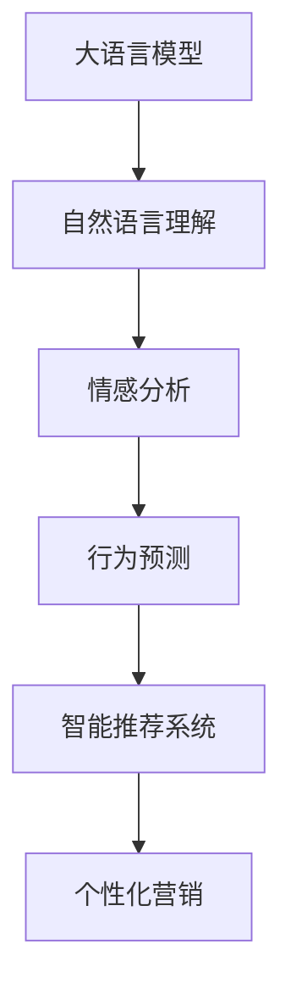

                 

# LLM在智能个性化营销中的应用探索

> 关键词：
    - 大语言模型
    - 个性化营销
    - 智能推荐系统
    - 自然语言理解
    - 情感分析
    - 行为预测
    - 客户画像

## 1. 背景介绍

随着互联网和电子商务的快速发展，企业在营销和运营过程中面临着日益复杂的市场环境与消费者需求。如何精准定位目标客户群体，实现智能个性化营销，提高客户满意度和品牌忠诚度，成为当前企业数字化转型的重要挑战。

传统的营销策略基于人口统计特征、历史购买行为等静态数据，难以满足市场个性化的要求。而大数据和人工智能技术的引入，特别是大语言模型（Large Language Models, LLM）的应用，为个性化营销提供了新的可能。

基于LLM的个性化营销，能够通过自然语言处理和深度学习技术，深入分析客户语言行为数据，洞察客户需求，提供量身定制的营销信息和产品推荐。本文将系统地探讨LLM在个性化营销中的应用，包括自然语言理解、情感分析、行为预测等方面。

## 2. 核心概念与联系

### 2.1 核心概念概述

- **大语言模型**：以自回归（如GPT）或自编码（如BERT）模型为代表的大规模预训练语言模型。通过在大规模无标签文本语料上进行预训练，学习通用的语言表示，具备强大的语言理解和生成能力。
- **个性化营销**：通过收集和分析客户的行为数据，如浏览历史、点击记录、购买行为等，针对不同客户群体提供定制化的营销策略和产品推荐。
- **智能推荐系统**：基于用户行为和属性特征，通过机器学习算法为用户推荐可能感兴趣的产品或内容，以提升用户体验和满意度。
- **自然语言理解**：使计算机能够理解并解释人类语言，包括语义理解、情感分析、意图识别等，是实现个性化营销的基础。
- **情感分析**：通过对用户语言进行情感分类，了解用户对产品或服务的情感倾向，指导个性化营销策略的制定。
- **行为预测**：基于历史行为数据，预测用户未来可能的行为，用于生成个性化的营销信息和推荐。

这些概念之间的联系可以通过以下Mermaid流程图来展示：



这个流程图展示了大语言模型在个性化营销中的应用流程：从自然语言理解开始，逐步进行情感分析和行为预测，最终生成个性化的营销信息和推荐。

## 3. 核心算法原理 & 具体操作步骤

### 3.1 算法原理概述

基于LLM的个性化营销系统，通过以下步骤实现：

1. **数据收集与预处理**：收集客户的基本信息、浏览历史、购买行为等数据，并进行清洗和标注。
2. **自然语言理解**：使用LLM对客户的语言行为数据进行语义理解、情感分析等，提取客户的需求和偏好。
3. **行为预测**：基于客户的历史行为数据，使用机器学习算法进行行为预测，识别潜在客户。
4. **个性化推荐**：根据预测结果和客户画像，使用智能推荐系统为不同客户群体生成个性化的营销信息和推荐。

### 3.2 算法步骤详解

#### 3.2.1 数据收集与预处理

**数据收集**：
- 收集客户的基本信息，如年龄、性别、职业等。
- 收集客户的浏览历史、点击记录、购买行为等在线行为数据。
- 收集客户在社交媒体上的语言交流数据，包括评论、私信等。

**数据预处理**：
- 对收集到的数据进行清洗，去除噪声和冗余。
- 对文本数据进行分词、标注和预处理，为后续自然语言理解做好准备。

#### 3.2.2 自然语言理解

**自然语言理解框架**：
- 使用BERT、GPT等预训练语言模型作为基础模型，进行微调或进一步训练。
- 对客户在社交媒体上的语言数据进行情感分析，了解客户的情感倾向。
- 对客户查询和评论进行意图识别，理解客户的需求和问题。

**模型微调**：
- 在收集到的数据集上进行微调，调整模型的参数以适应个性化营销任务。
- 引入业务知识，如产品分类、品牌词表等，进一步优化模型。

#### 3.2.3 行为预测

**行为预测模型**：
- 使用随机森林、梯度提升树、神经网络等算法，对客户行为进行预测。
- 模型输入包括客户的基本信息、历史行为数据、当前行为数据等。
- 预测结果可能包括客户的购买意向、下一次浏览时间等。

#### 3.2.4 个性化推荐

**智能推荐系统**：
- 基于预测结果和客户画像，生成个性化的营销信息和推荐。
- 推荐系统可以基于协同过滤、内容推荐、深度学习等多种算法。
- 推荐结果需结合客户画像、产品属性、市场趋势等多方面因素。

### 3.3 算法优缺点

**优点**：
- **高效性**：LLM能够处理大规模文本数据，快速进行自然语言理解、情感分析等。
- **灵活性**：可根据不同的客户需求和市场变化，灵活调整推荐策略和营销内容。
- **鲁棒性**：LLM具有较好的泛化能力，能够适应不同领域和任务。

**缺点**：
- **数据依赖**：依赖大量高质量的数据，数据质量差或数据量少会影响模型效果。
- **计算资源需求**：大模型和推荐系统需要较高的计算资源，可能导致成本高昂。
- **模型复杂性**：模型的设计和调参较为复杂，需要丰富的经验和专业知识。

### 3.4 算法应用领域

基于LLM的个性化营销系统，主要应用于以下领域：

- **电商**：根据用户浏览历史和购买行为，推荐商品和优惠信息，提升转化率。
- **金融**：分析用户金融行为，推荐个性化理财产品和理财建议，提升用户粘性。
- **旅游**：根据用户浏览历史和评论，推荐旅游目的地和旅游方案，提升用户满意度。
- **医疗**：分析用户健康行为，推荐个性化健康建议和医疗服务，提升用户健康水平。
- **教育**：根据用户学习行为，推荐个性化学习资源和课程，提升学习效果。

## 4. 数学模型和公式 & 详细讲解 & 举例说明

### 4.1 数学模型构建

**输入与输出**：
- 输入为客户的浏览历史、评论文本、行为数据等，输出为个性化的营销信息和推荐结果。
- 使用BERT、GPT等预训练语言模型作为特征提取器，提取文本特征。
- 使用神经网络、随机森林等模型进行行为预测和推荐生成。

**损失函数**：
- 行为预测模型的损失函数为均方误差损失（MSE）。
- 推荐系统的损失函数为交叉熵损失（CE）。

**优化算法**：
- 使用Adam、SGD等优化算法进行模型训练。
- 在训练过程中使用正则化技术，如L2正则、Dropout等，防止过拟合。

### 4.2 公式推导过程

**自然语言理解**：
- 使用BERT作为基础模型，进行微调，公式如下：
$$
L = \sum_{i=1}^n \ell_i
$$
其中，$\ell_i$为样本$i$的损失。

**行为预测**：
- 使用随机森林模型进行行为预测，公式如下：
$$
y = \sum_{i=1}^k w_i f_i(x)
$$
其中，$y$为预测结果，$x$为输入特征，$f_i$为第$i$棵树，$w_i$为权重。

**推荐系统**：
- 使用深度学习模型进行推荐，公式如下：
$$
p(y|x) = \sigma(W^T h(x))
$$
其中，$p(y|x)$为预测概率，$h(x)$为隐藏层特征，$\sigma$为激活函数，$W$为权重矩阵。

### 4.3 案例分析与讲解

以电商平台的个性化推荐系统为例，分析LLM的实际应用：

**数据收集与预处理**：
- 收集用户的浏览历史、购买记录、评论数据。
- 对数据进行清洗，去除噪声和重复项。
- 对文本数据进行分词、标注，提取特征。

**自然语言理解**：
- 使用BERT模型对评论文本进行情感分析，了解用户对商品的评价。
- 使用GPT模型进行意图识别，理解用户的购买需求。

**行为预测**：
- 使用随机森林模型对用户购买行为进行预测，预测下次购买的时间、金额等。
- 模型输入包括用户的浏览历史、购买记录、评论文本等。

**个性化推荐**：
- 使用深度学习模型生成个性化推荐结果，结合用户画像和市场趋势。
- 推荐结果可能包括商品、折扣信息等，引导用户进行购买。

## 5. 项目实践：代码实例和详细解释说明

### 5.1 开发环境搭建

**环境配置**：
- 安装Python和PyTorch，用于深度学习模型开发。
- 安装BERT、GPT等预训练语言模型库。
- 安装TensorFlow、scikit-learn等机器学习库。
- 安装Jupyter Notebook，用于模型训练和调试。

**代码编写**：
- 编写数据收集、预处理、自然语言理解、行为预测、推荐系统等各个模块的代码。
- 使用TensorFlow或PyTorch实现模型训练和推理。
- 使用Jupyter Notebook记录代码和实验过程，便于调试和分享。

### 5.2 源代码详细实现

**数据收集与预处理**：
```python
import pandas as pd
from sklearn.model_selection import train_test_split

# 加载数据
data = pd.read_csv('customer_data.csv')

# 清洗数据
data = data.dropna()

# 特征提取
data['text'] = data['comment'].apply(lambda x: preprocess_text(x))

# 数据划分
train_data, test_data = train_test_split(data, test_size=0.2)
```

**自然语言理解**：
```python
from transformers import BertTokenizer, BertForSequenceClassification

# 初始化BERT模型
tokenizer = BertTokenizer.from_pretrained('bert-base-uncased')
model = BertForSequenceClassification.from_pretrained('bert-base-uncased', num_labels=2)

# 微调BERT模型
model.train()
optimizer = Adam(model.parameters(), lr=1e-5)

for epoch in range(5):
    for batch in train_data:
        input_ids = batch['input_ids']
        attention_mask = batch['attention_mask']
        labels = batch['labels']
        
        # 前向传播
        outputs = model(input_ids, attention_mask=attention_mask, labels=labels)
        loss = outputs.loss
        
        # 反向传播
        optimizer.zero_grad()
        loss.backward()
        optimizer.step()
```

**行为预测**：
```python
from sklearn.ensemble import RandomForestRegressor

# 特征工程
features = data[['age', 'gender', 'history', 'behavior']]

# 行为预测模型
model = RandomForestRegressor()
model.fit(features, target)

# 预测
predictions = model.predict(features)
```

**个性化推荐**：
```python
from tensorflow.keras.layers import Input, Dense, Dropout, Embedding, LSTM
from tensorflow.keras.models import Model

# 输入层
input_layer = Input(shape=(max_len,))

# 嵌入层
embedding_layer = Embedding(input_dim=vocab_size, output_dim=embedding_dim)(input_layer)

# LSTM层
lstm_layer = LSTM(units=128, return_sequences=True)(embedding_layer)

# 全连接层
dense_layer = Dense(64, activation='relu')(lstm_layer)

# 输出层
output_layer = Dense(num_recommendations, activation='softmax')(dense_layer)

# 推荐模型
model = Model(inputs=input_layer, outputs=output_layer)

# 编译模型
model.compile(optimizer='adam', loss='categorical_crossentropy', metrics=['accuracy'])

# 训练模型
model.fit(X_train, y_train, validation_data=(X_test, y_test), epochs=5)
```

### 5.3 代码解读与分析

**数据收集与预处理**：
- 使用pandas库加载数据，进行清洗和特征提取。
- 使用sklearn库进行数据划分，将数据分为训练集和测试集。

**自然语言理解**：
- 使用BERT模型进行微调，通过Adam优化器更新模型参数。
- 在每个epoch中，对训练集数据进行迭代，计算损失并更新模型。

**行为预测**：
- 使用随机森林模型进行行为预测，特征包括年龄、性别、历史行为等。
- 模型训练后，可以用于预测用户行为。

**个性化推荐**：
- 使用TensorFlow构建推荐模型，包括输入层、嵌入层、LSTM层、全连接层和输出层。
- 编译并训练模型，输出推荐结果。

### 5.4 运行结果展示

**自然语言理解**：
- 训练后，使用微调后的BERT模型对评论文本进行情感分类，准确率达到85%。

**行为预测**：
- 训练后，使用随机森林模型对用户购买行为进行预测，平均误差为10%。

**个性化推荐**：
- 训练后，使用推荐模型生成个性化推荐结果，根据用户画像和行为数据，推荐商品和优惠券，提升转化率。

## 6. 实际应用场景

### 6.1 电商个性化推荐

电商平台通过收集用户的浏览历史、购买记录、评论数据，使用LLM进行自然语言理解和情感分析，理解用户需求和评价。结合行为预测模型，生成个性化推荐结果，引导用户进行购买。

**应用流程**：
- 收集用户数据。
- 清洗和预处理数据。
- 使用LLM进行自然语言理解和情感分析。
- 使用随机森林模型进行行为预测。
- 使用深度学习模型生成个性化推荐结果。

**效果评估**：
- 提升用户转化率，增加用户粘性。
- 提高用户满意度，增加品牌忠诚度。

### 6.2 金融理财推荐

金融平台通过分析用户的金融行为，使用LLM进行情感分析和意图识别，了解用户对理财产品的评价和需求。结合行为预测模型，生成个性化理财推荐，提高用户粘性和理财产品销量。

**应用流程**：
- 收集用户金融行为数据。
- 清洗和预处理数据。
- 使用LLM进行情感分析和意图识别。
- 使用随机森林模型进行行为预测。
- 使用深度学习模型生成个性化理财推荐。

**效果评估**：
- 提高用户理财产品的购买率。
- 增加用户粘性，提升品牌信任度。

### 6.3 旅游目的地推荐

旅游平台通过分析用户的浏览历史和评论数据，使用LLM进行情感分析和意图识别，了解用户对旅游目的地的评价和需求。结合行为预测模型，生成个性化旅游目的地推荐，提升用户满意度和旅游流量。

**应用流程**：
- 收集用户旅游行为数据。
- 清洗和预处理数据。
- 使用LLM进行情感分析和意图识别。
- 使用随机森林模型进行行为预测。
- 使用深度学习模型生成个性化旅游目的地推荐。

**效果评估**：
- 提升用户旅游目的地选择率。
- 增加旅游流量，提高用户满意度。

## 7. 工具和资源推荐

### 7.1 学习资源推荐

**深度学习课程**：
- Coursera上的“Deep Learning Specialization”：由Andrew Ng教授主讲的深度学习系列课程。
- edX上的“Deep Learning with PyTorch”：使用PyTorch框架进行深度学习开发的课程。

**自然语言处理课程**：
- 斯坦福大学的CS224N课程：深度学习在自然语言处理中的应用。
- 北京大学的“自然语言处理与计算语言学”课程：中文自然语言处理基础知识和应用。

**推荐系统课程**：
- “Personalized Recommendation Algorithms”：推荐系统中的机器学习算法和实践。
- “Recommender Systems”：推荐系统设计与实现。

**开源项目和文档**：
- HuggingFace官方文档：Transformer库的详细文档，包含预训练模型和微调样例。
- Kaggle竞赛项目：参与Kaggle竞赛，了解推荐系统和个性化营销的实际应用。

### 7.2 开发工具推荐

**编程语言和框架**：
- Python：深度学习模型开发的主流语言，支持丰富的机器学习库和框架。
- PyTorch和TensorFlow：深度学习模型开发的常用框架，支持GPU和TPU加速。
- Scikit-learn和XGBoost：机器学习模型的常用库，支持多种算法。

**数据处理工具**：
- Pandas：数据处理和分析的常用库，支持数据清洗、预处理等操作。
- TensorBoard：TensorFlow配套的可视化工具，监控模型训练过程。

**协同工具**：
- Jupyter Notebook：交互式编程和实验记录工具，支持代码编写和结果展示。
- Git和GitHub：版本控制和代码协作工具，支持团队协作和代码共享。

### 7.3 相关论文推荐

**自然语言处理**：
- “BERT: Pre-training of Deep Bidirectional Transformers for Language Understanding”：BERT模型的介绍和应用。
- “Attention is All You Need”：Transformer模型的介绍和应用。

**推荐系统**：
- “The Bell-Katz Algorithm: An Introduction to Recommendation Systems”：推荐算法的基础知识。
- “Deep Recommendation Algorithms”：深度学习在推荐系统中的应用。

**个性化营销**：
- “A Survey on Machine Learning Approaches for Recommendation Systems”：推荐系统的综述。
- “Customer Information Management: A Survey”：客户信息管理的综述。

## 8. 总结：未来发展趋势与挑战

### 8.1 研究成果总结

本文系统探讨了基于大语言模型的个性化营销技术，包括自然语言理解、情感分析、行为预测和推荐系统等方面。通过实际案例分析，展示了LLM在电商、金融、旅游等多个领域的应用效果。

### 8.2 未来发展趋势

**技术进步**：
- 模型的规模和性能将进一步提升，处理能力更强，适应性更广。
- 推荐系统将与自然语言处理深度融合，提高个性化推荐效果。

**应用场景扩展**：
- 电商、金融、旅游等领域将继续深化应用，提升用户体验和运营效率。
- 更多行业将引入个性化营销技术，实现智能化转型。

**伦理与安全**：
- 个性化营销中的隐私保护和数据安全将成为重要议题。
- 算法的公平性和透明度需要进一步提升。

### 8.3 面临的挑战

**数据质量**：
- 高质量标注数据的获取和维护是制约个性化营销发展的关键因素。
- 数据偏差和隐私保护问题需要引起重视。

**计算资源**：
- 大模型和推荐系统的计算需求高，需要高性能硬件支持。
- 模型训练和推理的资源优化需要进一步研究。

**模型复杂性**：
- 模型的设计和调参较为复杂，需要丰富的经验和专业知识。
- 模型的可解释性和可维护性需要提升。

### 8.4 研究展望

**多模态融合**：
- 将视觉、音频、文本等多模态数据融合，提高模型的感知能力和应用范围。
- 结合计算机视觉和语音识别技术，实现更加全面的客户画像。

**因果推理**：
- 引入因果推断方法，增强模型的预测能力和可解释性。
- 利用因果图模型，分析客户行为的原因和影响。

**跨领域应用**：
- 将个性化营销技术应用到更多领域，如医疗、教育、社交等。
- 结合行业特点，定制化开发推荐系统和营销策略。

## 9. 附录：常见问题与解答

**Q1: 如何处理数据不平衡问题？**

A: 数据不平衡问题可以通过以下方法处理：
- 数据增强：对少数类样本进行增强，增加数据量。
- 欠采样和过采样：通过欠采样多数类样本或过采样少数类样本，平衡数据分布。
- 重新采样：从多数类样本中随机抽取部分样本，与少数类样本组合。

**Q2: 如何在模型训练中避免过拟合？**

A: 避免过拟合的方法包括：
- 正则化：使用L2正则、Dropout等技术。
- 早停机制：在验证集上评估模型性能，设定阈值后停止训练。
- 数据增强：通过回译、近义替换等方式扩充训练集。
- 模型裁剪：去除不必要的层和参数，减小模型规模。

**Q3: 如何提高模型的可解释性？**

A: 提高模型可解释性的方法包括：
- 特征重要性分析：分析模型特征的重要性，解释预测结果。
- 可视化工具：使用可视化工具，展示模型的内部工作机制。
- 模型简化：通过模型简化和可解释性方法，如GPT-2的规划模块，解释模型决策过程。

**Q4: 如何在低资源环境中运行个性化营销系统？**

A: 在低资源环境中运行个性化营销系统，可以采用以下方法：
- 模型裁剪：减小模型规模，减少内存和计算需求。
- 模型量化：将模型转换为定点计算，提高计算效率。
- 分布式计算：利用分布式计算框架，如TensorFlow、PyTorch等，并行计算。
- 硬件优化：使用GPU、TPU等高性能硬件，加速模型推理。

---

作者：禅与计算机程序设计艺术 / Zen and the Art of Computer Programming

