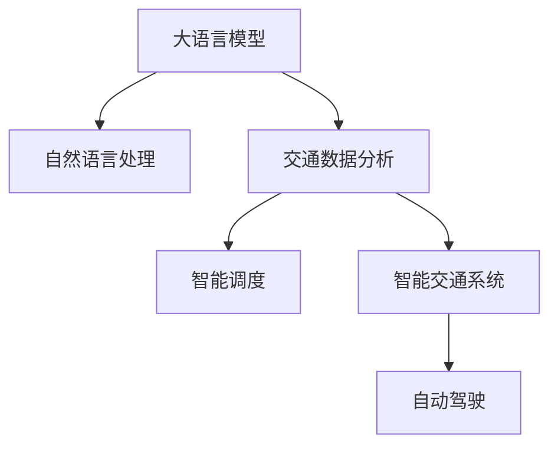

                 

# LLM在智能交通系统中的应用

> 关键词：智能交通系统、自然语言处理(NLP)、大语言模型(LLM)、交通数据分析、智能调度、自动驾驶

## 1. 背景介绍

随着城市化进程的不断加快，交通拥堵、事故频发、环境污染等问题愈加凸显，智能交通系统成为城市发展的重要方向。智能交通系统旨在通过先进的信息化、智能化手段，提高交通运行效率，优化资源配置，保障出行安全。大语言模型（LLM）作为人工智能领域的前沿技术，以其强大的自然语言处理能力，为智能交通系统提供了新的突破点。

### 1.1 问题由来

传统的智能交通系统多依赖传感器、摄像头、GPS等物理设备，通过收集海量交通数据进行实时分析和预测。然而，这些方法成本高、安装和维护困难，且难以对复杂情境和语义信息进行理解和处理。大语言模型通过深度学习技术，在自然语言处理领域取得了突破性进展，能够理解复杂的语义信息，具备良好的推理能力。因此，利用大语言模型来处理交通领域的海量文本数据，能够提升智能交通系统的智能化水平。

### 1.2 问题核心关键点

大语言模型在智能交通系统中的应用核心关键点包括：

- **语义理解**：利用大语言模型强大的自然语言处理能力，对交通信号、路标、指示牌等文本信息进行语义理解。
- **事件识别**：自动分析交通事件，如交通事故、交通堵塞等，并生成报警信息。
- **路线推荐**：根据用户输入的起点、终点等信息，通过自然语言生成推荐最优路线。
- **语音交互**：实现智能交通系统的语音助手，提供自然流畅的语音交互体验。
- **数据分析**：利用自然语言处理技术，对交通数据进行自动化的分析和挖掘。

这些关键点共同构成了大语言模型在智能交通系统中的重要应用场景，极大地拓展了智能交通系统的功能和应用范围。

## 2. 核心概念与联系

### 2.1 核心概念概述

为更好地理解大语言模型在智能交通系统中的应用，本节将介绍几个密切相关的核心概念：

- **大语言模型（LLM）**：以自回归模型（如GPT）或自编码模型（如BERT）为代表的大规模预训练语言模型。通过在大规模无标签文本语料上进行预训练，学习通用的语言表示，具备强大的语言理解和生成能力。

- **自然语言处理（NLP）**：涉及计算机对自然语言（如文本、语音、图像等）进行理解、处理和生成的技术。是大语言模型应用的基础。

- **智能交通系统（ITS）**：通过应用先进的通信、信息和控制技术，实现交通系统的智能管理和控制，提高道路利用效率和交通安全。

- **交通数据分析**：对交通数据进行采集、存储、分析和处理，获取有价值的交通信息。是大语言模型在智能交通系统中应用的前提。

- **智能调度**：基于交通数据，通过优化算法，实现交通流量的智能管理和调控，缓解交通拥堵。

- **自动驾驶**：利用计算机视觉、传感器、人工智能等技术，使汽车能够在没有人类直接操控的情况下自主行驶。是大语言模型在智能交通系统中的高级应用。

这些核心概念之间的逻辑关系可以通过以下Mermaid流程图来展示：



这个流程图展示了大语言模型在智能交通系统中的核心概念及其之间的关系：

1. 大语言模型通过自然语言处理技术，对交通领域的海量文本数据进行语义理解和事件识别。
2. 利用交通数据分析技术，对交通事件进行自动化的分析和挖掘。
3. 基于智能调度算法，实现交通流量的优化和管理。
4. 自动驾驶技术进一步提升了交通系统的智能化水平，是大语言模型的高级应用。

## 3. 核心算法原理 & 具体操作步骤
### 3.1 算法原理概述

大语言模型在智能交通系统中的应用，本质上是将自然语言处理技术应用于交通数据分析和智能调度等任务中。具体而言，大语言模型通过以下步骤实现：

1. **数据收集**：收集交通领域的各种文本数据，如交通信号、路标、指示牌、交通事故报告、用户出行需求等。
2. **数据预处理**：对收集到的文本数据进行清洗、分词、去停用词等预处理，便于后续的模型训练。
3. **模型训练**：在预处理后的数据上，使用大语言模型进行预训练或微调，学习通用的语言表示。
4. **事件识别与分析**：利用训练好的大语言模型，对交通事件进行自动化的识别和分析，生成报警信息或建议。
5. **路线推荐**：通过自然语言生成技术，根据用户输入的信息，生成最优路线。
6. **语音交互**：实现智能交通系统的语音助手，提供自然流畅的语音交互体验。

### 3.2 算法步骤详解

以下是详细的算法步骤：

**Step 1: 数据收集与预处理**
- 收集交通领域的各种文本数据，如交通信号、路标、指示牌、交通事故报告、用户出行需求等。
- 对收集到的文本数据进行清洗、分词、去停用词等预处理，便于后续的模型训练。

**Step 2: 模型训练**
- 选择合适的预训练语言模型，如BERT、GPT等，进行预训练或微调。
- 在预处理后的数据上，使用模型进行训练，学习通用的语言表示。

**Step 3: 事件识别与分析**
- 利用训练好的大语言模型，对交通事件进行自动化的识别和分析。例如，对交通事故报告进行自动分类，生成报警信息。
- 对于自然语言描述的交通事件，使用模型进行事件识别和分类。例如，将“前方车辆突然减速”自动识别为交通堵塞事件。

**Step 4: 路线推荐**
- 根据用户输入的起点、终点等信息，使用模型进行自然语言生成，生成最优路线。例如，将“从北京到上海”自动生成推荐路线。
- 结合历史交通数据和实时交通状况，优化推荐结果。例如，根据实时交通流量调整推荐路线。

**Step 5: 语音交互**
- 实现智能交通系统的语音助手，提供自然流畅的语音交互体验。例如，用户通过语音查询路线信息或交通状况。
- 使用模型理解用户语音输入，提供相应的反馈和建议。例如，“你的路线需要修改吗？”或“当前交通状况如何？”

### 3.3 算法优缺点

大语言模型在智能交通系统中的应用具有以下优点：

1. **语义理解能力强**：利用大语言模型强大的自然语言处理能力，能够理解复杂的交通事件和语义信息，提高决策的准确性。
2. **数据处理灵活**：大语言模型能够处理各种形式的数据，如文本、语音等，适用于多种交通场景。
3. **自动化程度高**：通过自然语言处理技术，实现自动化的数据分析和事件识别，减少人工干预。
4. **用户友好**：通过语音助手等技术，提升用户交互体验，使用户能够自然流畅地与系统进行沟通。

同时，也存在一些局限性：

1. **依赖高质量数据**：模型的性能很大程度上取决于输入数据的质量，需要大量的标注数据进行训练和微调。
2. **资源消耗大**：大语言模型通常需要较高的计算资源和存储空间，对于实时性要求高的应用，需要优化模型结构和部署方式。
3. **可解释性不足**：大语言模型通常是一个黑盒系统，难以解释其内部的推理过程，这对于需要高透明度的应用场景可能是一个挑战。
4. **安全性和隐私问题**：在处理用户出行需求和交通数据时，需要保障数据的安全性和隐私保护，避免数据泄露。

尽管存在这些局限性，但大语言模型在智能交通系统中的应用仍具有巨大的潜力，随着技术的不断进步，这些挑战也将逐步被克服。

### 3.4 算法应用领域

大语言模型在智能交通系统中的应用主要包括以下几个领域：

1. **交通数据分析**：利用自然语言处理技术，对交通数据进行自动化的分析和挖掘，生成有价值的交通报告和建议。例如，自动分析交通事故报告，识别高风险路段。
2. **智能调度**：基于大语言模型对交通事件和路况的语义理解，进行智能调度，优化交通流量。例如，根据实时交通状况，动态调整信号灯控制策略。
3. **自动驾驶**：在大语言模型的帮助下，自动驾驶车辆能够更好地理解和处理路标、指示牌等文本信息，提高行驶安全性。例如，通过语音助手与用户交互，获取导航信息。
4. **语音助手**：实现智能交通系统的语音助手，提供自然流畅的语音交互体验，提升用户体验。例如，用户通过语音查询实时交通状况或路线信息。
5. **应急处理**：利用大语言模型对交通事件的自动分析和报警，提升应急处理效率。例如，对交通事故报告进行自动化分类和处理，及时通知相关部门。

这些应用领域展示了大语言模型在智能交通系统中的广泛适用性和巨大潜力。

## 4. 数学模型和公式 & 详细讲解 & 举例说明

### 4.1 数学模型构建

在本节中，我们将使用数学语言对大语言模型在智能交通系统中的应用进行更加严格的刻画。

记大语言模型为 $M_{\theta}$，其中 $\theta$ 为模型参数。假设智能交通系统收集到的交通事件描述为 $X=\{x_1, x_2, \ldots, x_N\}$，其中 $x_i$ 为事件描述文本，$y_i$ 为事件类型标签。模型在输入 $x_i$ 上的输出为 $y_i \in \{0, 1\}$，表示事件属于某一类型（例如交通堵塞）的概率。

定义模型 $M_{\theta}$ 在输入 $x_i$ 上的损失函数为 $\ell(M_{\theta}(x_i),y_i)$，则在数据集 $D=\{(x_i,y_i)\}_{i=1}^N$ 上的经验风险为：

$$
\mathcal{L}(\theta) = \frac{1}{N} \sum_{i=1}^N \ell(M_{\theta}(x_i),y_i)
$$

微调的优化目标是最小化经验风险，即找到最优参数：

$$
\theta^* = \mathop{\arg\min}_{\theta} \mathcal{L}(\theta)
$$

在实践中，我们通常使用基于梯度的优化算法（如SGD、Adam等）来近似求解上述最优化问题。设 $\eta$ 为学习率，$\lambda$ 为正则化系数，则参数的更新公式为：

$$
\theta \leftarrow \theta - \eta \nabla_{\theta}\mathcal{L}(\theta) - \eta\lambda\theta
$$

其中 $\nabla_{\theta}\mathcal{L}(\theta)$ 为损失函数对参数 $\theta$ 的梯度，可通过反向传播算法高效计算。

### 4.2 公式推导过程

以下我们以交通事故分类为例，推导交叉熵损失函数及其梯度的计算公式。

假设模型 $M_{\theta}$ 在输入 $x_i$ 上的输出为 $\hat{y}=M_{\theta}(x_i) \in [0,1]$，表示事件属于某一类型的概率。真实标签 $y_i \in \{0,1\}$。则二分类交叉熵损失函数定义为：

$$
\ell(M_{\theta}(x_i),y_i) = -[y_i\log \hat{y} + (1-y_i)\log (1-\hat{y})]
$$

将其代入经验风险公式，得：

$$
\mathcal{L}(\theta) = -\frac{1}{N}\sum_{i=1}^N [y_i\log M_{\theta}(x_i)+(1-y_i)\log(1-M_{\theta}(x_i))]
$$

根据链式法则，损失函数对参数 $\theta_k$ 的梯度为：

$$
\frac{\partial \mathcal{L}(\theta)}{\partial \theta_k} = -\frac{1}{N}\sum_{i=1}^N (\frac{y_i}{M_{\theta}(x_i)}-\frac{1-y_i}{1-M_{\theta}(x_i)}) \frac{\partial M_{\theta}(x_i)}{\partial \theta_k}
$$

其中 $\frac{\partial M_{\theta}(x_i)}{\partial \theta_k}$ 可进一步递归展开，利用自动微分技术完成计算。

在得到损失函数的梯度后，即可带入参数更新公式，完成模型的迭代优化。重复上述过程直至收敛，最终得到适应交通事件分类任务的最优模型参数 $\theta^*$。

### 4.3 案例分析与讲解

以交通事故分类为例，我们可以具体解释一下公式推导过程和应用场景：

**场景描述**：假设有大量的交通事故报告，其中每条报告由自然语言描述。我们的目标是训练一个模型，能够自动分类这些报告，判断是否属于“交通堵塞”类型。

**模型定义**：使用BERT模型作为基础，通过微调来适应交通事故分类的任务。定义输入为报告的文本描述，输出为“交通堵塞”的预测概率。

**损失函数**：采用二分类交叉熵损失函数，衡量模型预测与真实标签之间的差异。

**优化过程**：使用Adam优化算法，设定较小的学习率，避免破坏预训练权重。在训练集上迭代优化模型参数，最小化损失函数。

**结果评估**：在测试集上评估模型的性能，计算分类准确率、召回率和F1分数，评估模型效果。

## 5. 项目实践：代码实例和详细解释说明

### 5.1 开发环境搭建

在进行智能交通系统开发前，我们需要准备好开发环境。以下是使用Python进行PyTorch开发的环境配置流程：

1. 安装Anaconda：从官网下载并安装Anaconda，用于创建独立的Python环境。

2. 创建并激活虚拟环境：
```bash
conda create -n pytorch-env python=3.8 
conda activate pytorch-env
```

3. 安装PyTorch：根据CUDA版本，从官网获取对应的安装命令。例如：
```bash
conda install pytorch torchvision torchaudio cudatoolkit=11.1 -c pytorch -c conda-forge
```

4. 安装Transformers库：
```bash
pip install transformers
```

5. 安装各类工具包：
```bash
pip install numpy pandas scikit-learn matplotlib tqdm jupyter notebook ipython
```

完成上述步骤后，即可在`pytorch-env`环境中开始智能交通系统的开发。

### 5.2 源代码详细实现

下面我们以交通事故分类为例，给出使用Transformers库对BERT模型进行微调的PyTorch代码实现。

首先，定义交通事故分类任务的数据处理函数：

```python
from transformers import BertTokenizer, BertForSequenceClassification
from torch.utils.data import Dataset
import torch

class TrafficAccidentDataset(Dataset):
    def __init__(self, texts, labels, tokenizer, max_len=128):
        self.texts = texts
        self.labels = labels
        self.tokenizer = tokenizer
        self.max_len = max_len
        
    def __len__(self):
        return len(self.texts)
    
    def __getitem__(self, item):
        text = self.texts[item]
        label = self.labels[item]
        
        encoding = self.tokenizer(text, return_tensors='pt', max_length=self.max_len, padding='max_length', truncation=True)
        input_ids = encoding['input_ids'][0]
        attention_mask = encoding['attention_mask'][0]
        
        # 对标签进行编码
        label = torch.tensor(label, dtype=torch.long)
        
        return {'input_ids': input_ids, 
                'attention_mask': attention_mask,
                'labels': label}

# 标签与id的映射
label2id = {'traffic blockage': 0, 'normal': 1}
id2label = {v: k for k, v in label2id.items()}

# 创建dataset
tokenizer = BertTokenizer.from_pretrained('bert-base-cased')

train_dataset = TrafficAccidentDataset(train_texts, train_labels, tokenizer)
dev_dataset = TrafficAccidentDataset(dev_texts, dev_labels, tokenizer)
test_dataset = TrafficAccidentDataset(test_texts, test_labels, tokenizer)
```

然后，定义模型和优化器：

```python
from transformers import AdamW

model = BertForSequenceClassification.from_pretrained('bert-base-cased', num_labels=len(label2id))

optimizer = AdamW(model.parameters(), lr=2e-5)
```

接着，定义训练和评估函数：

```python
from torch.utils.data import DataLoader
from tqdm import tqdm
from sklearn.metrics import classification_report

device = torch.device('cuda') if torch.cuda.is_available() else torch.device('cpu')
model.to(device)

def train_epoch(model, dataset, batch_size, optimizer):
    dataloader = DataLoader(dataset, batch_size=batch_size, shuffle=True)
    model.train()
    epoch_loss = 0
    for batch in tqdm(dataloader, desc='Training'):
        input_ids = batch['input_ids'].to(device)
        attention_mask = batch['attention_mask'].to(device)
        labels = batch['labels'].to(device)
        model.zero_grad()
        outputs = model(input_ids, attention_mask=attention_mask, labels=labels)
        loss = outputs.loss
        epoch_loss += loss.item()
        loss.backward()
        optimizer.step()
    return epoch_loss / len(dataloader)

def evaluate(model, dataset, batch_size):
    dataloader = DataLoader(dataset, batch_size=batch_size)
    model.eval()
    preds, labels = [], []
    with torch.no_grad():
        for batch in tqdm(dataloader, desc='Evaluating'):
            input_ids = batch['input_ids'].to(device)
            attention_mask = batch['attention_mask'].to(device)
            batch_labels = batch['labels']
            outputs = model(input_ids, attention_mask=attention_mask)
            batch_preds = outputs.logits.argmax(dim=2).to('cpu').tolist()
            batch_labels = batch_labels.to('cpu').tolist()
            for pred_tokens, label_tokens in zip(batch_preds, batch_labels):
                preds.append(pred_tokens[:len(label_tokens)])
                labels.append(label_tokens)
                
    print(classification_report(labels, preds))
```

最后，启动训练流程并在测试集上评估：

```python
epochs = 5
batch_size = 16

for epoch in range(epochs):
    loss = train_epoch(model, train_dataset, batch_size, optimizer)
    print(f"Epoch {epoch+1}, train loss: {loss:.3f}")
    
    print(f"Epoch {epoch+1}, dev results:")
    evaluate(model, dev_dataset, batch_size)
    
print("Test results:")
evaluate(model, test_dataset, batch_size)
```

以上就是使用PyTorch对BERT进行交通事故分类任务的微调的完整代码实现。可以看到，得益于Transformers库的强大封装，我们可以用相对简洁的代码完成BERT模型的加载和微调。

### 5.3 代码解读与分析

让我们再详细解读一下关键代码的实现细节：

**TrafficAccidentDataset类**：
- `__init__`方法：初始化文本、标签、分词器等关键组件。
- `__len__`方法：返回数据集的样本数量。
- `__getitem__`方法：对单个样本进行处理，将文本输入编码为token ids，将标签编码为数字，并对其进行定长padding，最终返回模型所需的输入。

**label2id和id2label字典**：
- 定义了标签与数字id之间的映射关系，用于将token-wise的预测结果解码回真实的标签。

**训练和评估函数**：
- 使用PyTorch的DataLoader对数据集进行批次化加载，供模型训练和推理使用。
- 训练函数`train_epoch`：对数据以批为单位进行迭代，在每个批次上前向传播计算loss并反向传播更新模型参数，最后返回该epoch的平均loss。
- 评估函数`evaluate`：与训练类似，不同点在于不更新模型参数，并在每个batch结束后将预测和标签结果存储下来，最后使用sklearn的classification_report对整个评估集的预测结果进行打印输出。

**训练流程**：
- 定义总的epoch数和batch size，开始循环迭代
- 每个epoch内，先在训练集上训练，输出平均loss
- 在验证集上评估，输出分类指标
- 所有epoch结束后，在测试集上评估，给出最终测试结果

可以看到，PyTorch配合Transformers库使得BERT微调的代码实现变得简洁高效。开发者可以将更多精力放在数据处理、模型改进等高层逻辑上，而不必过多关注底层的实现细节。

当然，工业级的系统实现还需考虑更多因素，如模型的保存和部署、超参数的自动搜索、更灵活的任务适配层等。但核心的微调范式基本与此类似。

## 6. 实际应用场景

### 6.1 智能调度

智能调度是大语言模型在智能交通系统中的重要应用场景之一。通过自动化的数据分析和事件识别，大语言模型能够实时监测交通流量，动态调整信号灯和路线，缓解交通拥堵。

具体而言，可以收集交通数据，使用大语言模型自动分类交通事故、交通堵塞等事件，生成报警信息。同时，结合历史交通数据和实时路况，利用优化算法生成最优的信号灯控制策略和路线推荐方案。例如，在高峰期自动调整信号灯配时，在拥堵路段提供替代路线建议。

### 6.2 自动驾驶

自动驾驶是智能交通系统的高级应用，涉及到复杂的视觉、传感器数据处理和自然语言理解。大语言模型能够帮助自动驾驶系统更好地理解和处理路标、指示牌等文本信息，提升行驶安全性和可靠性。

具体而言，可以利用大语言模型对道路标识进行语义理解，例如将“禁止左转”等指示牌自动转换为机器可读格式。同时，通过自然语言生成技术，生成导航信息，指导车辆行驶。例如，“前方100米左转”等指令可以自动转化为车辆行驶指令。

### 6.3 应急处理

大语言模型能够自动分析和报警交通事件，提升应急处理效率。例如，对交通事故报告进行自动分类和处理，及时通知相关部门，发布交通管制信息。同时，利用自然语言处理技术，自动生成事件描述和解决方案，辅助应急人员处理事故。

具体而言，可以收集交通事故报告，使用大语言模型自动分类事件类型（例如交通事故、交通堵塞），生成报警信息和解决方案。例如，自动将“多车相撞”分类为交通事故，生成报警信息并通知交警、消防等部门。

### 6.4 未来应用展望

随着大语言模型和智能交通技术的不断发展，未来基于大语言模型的智能交通系统将呈现以下几个趋势：

1. **多模态融合**：大语言模型能够处理多模态数据，例如文本、图像、语音等。未来交通系统将能够更好地整合视觉和听觉信息，提升感知能力。
2. **实时性增强**：利用高性能计算设备，大语言模型能够实现实时数据分析和处理，提升交通调度的及时性。
3. **协同优化**：结合交通系统中的各类传感器和设备，大语言模型能够进行协同优化，提升整体系统的效率和可靠性。
4. **跨领域应用**：大语言模型能够应用于各种交通场景，例如城市交通、高速交通、公共交通等，提升交通管理的智能化水平。
5. **数据驱动决策**：基于大语言模型的数据分析和处理，交通系统将能够更加科学地制定决策，优化交通资源配置。

总之，大语言模型在智能交通系统中的应用具有广阔的前景，随着技术的不断进步，必将带来交通管理水平的全面提升。

## 7. 工具和资源推荐
### 7.1 学习资源推荐

为了帮助开发者系统掌握大语言模型在智能交通系统中的应用，这里推荐一些优质的学习资源：

1. 《Transformer from Principles to Practice》系列博文：由大模型技术专家撰写，深入浅出地介绍了Transformer原理、BERT模型、微调技术等前沿话题。

2. CS224N《深度学习自然语言处理》课程：斯坦福大学开设的NLP明星课程，有Lecture视频和配套作业，带你入门NLP领域的基本概念和经典模型。

3. 《Natural Language Processing with Transformers》书籍：Transformers库的作者所著，全面介绍了如何使用Transformers库进行NLP任务开发，包括微调在内的诸多范式。

4. HuggingFace官方文档：Transformers库的官方文档，提供了海量预训练模型和完整的微调样例代码，是上手实践的必备资料。

5. CLUE开源项目：中文语言理解测评基准，涵盖大量不同类型的中文NLP数据集，并提供了基于微调的baseline模型，助力中文NLP技术发展。

通过对这些资源的学习实践，相信你一定能够快速掌握大语言模型在智能交通系统中的应用精髓，并用于解决实际的NLP问题。
### 7.2 开发工具推荐

高效的开发离不开优秀的工具支持。以下是几款用于大语言模型在智能交通系统中的应用开发的常用工具：

1. PyTorch：基于Python的开源深度学习框架，灵活动态的计算图，适合快速迭代研究。大部分预训练语言模型都有PyTorch版本的实现。

2. TensorFlow：由Google主导开发的开源深度学习框架，生产部署方便，适合大规模工程应用。同样有丰富的预训练语言模型资源。

3. Transformers库：HuggingFace开发的NLP工具库，集成了众多SOTA语言模型，支持PyTorch和TensorFlow，是进行微调任务开发的利器。

4. Weights & Biases：模型训练的实验跟踪工具，可以记录和可视化模型训练过程中的各项指标，方便对比和调优。与主流深度学习框架无缝集成。

5. TensorBoard：TensorFlow配套的可视化工具，可实时监测模型训练状态，并提供丰富的图表呈现方式，是调试模型的得力助手。

6. Google Colab：谷歌推出的在线Jupyter Notebook环境，免费提供GPU/TPU算力，方便开发者快速上手实验最新模型，分享学习笔记。

合理利用这些工具，可以显著提升大语言模型在智能交通系统中的开发效率，加快创新迭代的步伐。

### 7.3 相关论文推荐

大语言模型在智能交通系统中的应用源于学界的持续研究。以下是几篇奠基性的相关论文，推荐阅读：

1. Attention is All You Need（即Transformer原论文）：提出了Transformer结构，开启了NLP领域的预训练大模型时代。

2. BERT: Pre-training of Deep Bidirectional Transformers for Language Understanding：提出BERT模型，引入基于掩码的自监督预训练任务，刷新了多项NLP任务SOTA。

3. Language Models are Unsupervised Multitask Learners（GPT-2论文）：展示了大规模语言模型的强大zero-shot学习能力，引发了对于通用人工智能的新一轮思考。

4. Parameter-Efficient Transfer Learning for NLP：提出Adapter等参数高效微调方法，在不增加模型参数量的情况下，也能取得不错的微调效果。

5. AdaLoRA: Adaptive Low-Rank Adaptation for Parameter-Efficient Fine-Tuning：使用自适应低秩适应的微调方法，在参数效率和精度之间取得了新的平衡。

6. Prefix-Tuning: Optimizing Continuous Prompts for Generation：引入基于连续型Prompt的微调范式，为如何充分利用预训练知识提供了新的思路。

这些论文代表了大语言模型在智能交通系统中的研究脉络。通过学习这些前沿成果，可以帮助研究者把握学科前进方向，激发更多的创新灵感。

## 8. 总结：未来发展趋势与挑战

### 8.1 总结

本文对大语言模型在智能交通系统中的应用进行了全面系统的介绍。首先阐述了大语言模型和智能交通系统的研究背景和意义，明确了大语言模型在智能交通系统中的应用场景。其次，从原理到实践，详细讲解了大语言模型在智能交通系统中的应用方法和步骤，给出了微调任务开发的完整代码实例。同时，本文还广泛探讨了大语言模型在智能交通系统中的实际应用场景，展示了其在智能调度、自动驾驶、应急处理等领域的巨大潜力。

通过本文的系统梳理，可以看到，大语言模型在智能交通系统中的应用具有广阔的前景，不仅能够提升交通管理的智能化水平，还能够优化资源配置，保障出行安全。大语言模型强大的自然语言处理能力，使其能够处理复杂的语义信息，提升交通系统的效率和可靠性。未来，随着技术的不断进步，大语言模型在智能交通系统中的应用将更加广泛和深入。

### 8.2 未来发展趋势

展望未来，大语言模型在智能交通系统中的应用将呈现以下几个发展趋势：

1. **多模态融合**：大语言模型能够处理多模态数据，例如文本、图像、语音等。未来交通系统将能够更好地整合视觉和听觉信息，提升感知能力。
2. **实时性增强**：利用高性能计算设备，大语言模型能够实现实时数据分析和处理，提升交通调度的及时性。
3. **协同优化**：结合交通系统中的各类传感器和设备，大语言模型能够进行协同优化，提升整体系统的效率和可靠性。
4. **跨领域应用**：大语言模型能够应用于各种交通场景，例如城市交通、高速交通、公共交通等，提升交通管理的智能化水平。
5. **数据驱动决策**：基于大语言模型的数据分析和处理，交通系统将能够更加科学地制定决策，优化交通资源配置。

这些趋势凸显了大语言模型在智能交通系统中的广阔前景。这些方向的探索发展，必将进一步提升智能交通系统的智能化水平，为交通管理带来新的突破。

### 8.3 面临的挑战

尽管大语言模型在智能交通系统中的应用已经取得了一定的进展，但在迈向更加智能化、普适化应用的过程中，它仍面临诸多挑战：

1. **依赖高质量数据**：模型的性能很大程度上取决于输入数据的质量，需要大量的标注数据进行训练和微调。如何进一步降低对标注样本的依赖，将是一大难题。
2. **资源消耗大**：大语言模型通常需要较高的计算资源和存储空间，对于实时性要求高的应用，需要优化模型结构和部署方式。
3. **可解释性不足**：大语言模型通常是一个黑盒系统，难以解释其内部的推理过程，这对于需要高透明度的应用场景可能是一个挑战。
4. **安全性和隐私问题**：在处理用户出行需求和交通数据时，需要保障数据的安全性和隐私保护，避免数据泄露。
5. **技术成熟度不足**：大语言模型在智能交通系统中的应用还处于初步探索阶段，技术成熟度不足，需要更多的实践和经验积累。

尽管存在这些挑战，但大语言模型在智能交通系统中的应用仍具有巨大的潜力，随着技术的不断进步，这些挑战也将逐步被克服。

### 8.4 研究展望

面向未来，大语言模型在智能交通系统中的应用需要在以下几个方面寻求新的突破：

1. **参数高效微调**：开发更加参数高效的微调方法，在固定大部分预训练参数的同时，只更新极少量的任务相关参数。同时优化微调模型的计算图，减少前向传播和反向传播的资源消耗，实现更加轻量级、实时性的部署。
2. **跨领域迁移学习**：利用大语言模型的跨领域迁移能力，在不同类型的交通场景中应用，提升系统适应性和泛化能力。
3. **多模态信息融合**：结合视觉、听觉等多模态信息，提升交通系统的感知能力和智能化水平。
4. **实时数据处理**：利用高性能计算设备和大语言模型，实现实时数据分析和处理，提升交通调度的及时性。
5. **协同优化算法**：开发协同优化算法，结合交通系统中的各类传感器和设备，提升整体系统的效率和可靠性。

这些研究方向的探索，必将引领大语言模型在智能交通系统中的应用走向新的高度，为交通管理带来更智能、更高效的解决方案。

## 9. 附录：常见问题与解答

**Q1：大语言模型在智能交通系统中的应用是否适用于所有交通场景？**

A: 大语言模型在智能交通系统中的应用具有广泛的适用性，但不同的交通场景可能需要针对性地进行模型训练和微调。例如，对于高度自动化的自动驾驶场景，大语言模型可以更好地理解和处理道路标识、交通信号等文本信息。而对于半自动驾驶和人工驾驶场景，大语言模型可以通过自然语言生成技术，提供驾驶建议和导航信息。

**Q2：大语言模型在智能交通系统中的计算资源需求如何？**

A: 大语言模型在智能交通系统中的应用需要较高的计算资源，特别是在实时性要求高的场景中。为了降低计算资源消耗，可以采用参数高效微调方法，只更新任务相关参数，保留大部分预训练权重不变。同时，可以利用模型压缩、稀疏化存储等技术，优化模型的存储空间和计算速度。

**Q3：如何提高大语言模型在智能交通系统中的可解释性？**

A: 提高大语言模型在智能交通系统中的可解释性，可以通过引入因果推断方法、提供详细的推理过程解释、增加模型的透明度等方式。例如，在自动驾驶场景中，可以提供详细的决策路径和推理依据，帮助用户理解和信任模型输出。

**Q4：如何保障大语言模型在智能交通系统中的数据安全和隐私保护？**

A: 保障大语言模型在智能交通系统中的数据安全和隐私保护，需要采取多种措施。例如，使用差分隐私技术保护用户隐私，采用数据加密和访问控制措施，确保数据安全。同时，需要建立严格的数据使用规范和隐私保护机制，确保模型训练和应用过程中的数据合规。

**Q5：大语言模型在智能交通系统中的应用未来有哪些发展方向？**

A: 大语言模型在智能交通系统中的应用未来将向以下几个方向发展：
1. 多模态融合：结合视觉、听觉等多模态信息，提升交通系统的感知能力和智能化水平。
2. 实时数据处理：利用高性能计算设备和大语言模型，实现实时数据分析和处理，提升交通调度的及时性。
3. 协同优化算法：开发协同优化算法，结合交通系统中的各类传感器和设备，提升整体系统的效率和可靠性。
4. 跨领域迁移学习：利用大语言模型的跨领域迁移能力，在不同类型的交通场景中应用，提升系统适应性和泛化能力。
5. 参数高效微调：开发更加参数高效的微调方法，在固定大部分预训练参数的同时，只更新极少量的任务相关参数。

总之，大语言模型在智能交通系统中的应用前景广阔，随着技术的不断进步，必将带来交通管理水平的全面提升。

