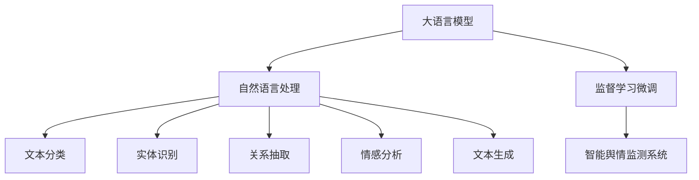

                 

# LLM在智能舆情监测系统中的应用前景

## 1. 背景介绍

### 1.1 问题由来
随着互联网技术的发展，信息的传播速度和规模都大幅提升。舆情监测作为信息获取和分析的重要手段，对企业、政府和公共机构都具有重要意义。传统舆情监测往往依赖人工进行数据收集、分析和报告生成，成本高、效率低，且难以应对海量信息的实时处理需求。

随着大语言模型(LLM)的崛起，基于LLM的智能舆情监测系统开始受到广泛关注。LLM通过大量无标签文本数据的预训练，学习到了丰富的语言知识，具备强大的自然语言理解和生成能力，可以在自然语言处理(NLP)任务的监督学习微调下，实现高效、自动化的舆情监测。

### 1.2 问题核心关键点
目前，基于LLM的智能舆情监测系统主要通过以下几个关键技术实现：
1. 文本分类：对文本内容进行分类，识别出不同类别的舆情信息。
2. 实体识别：从文本中提取实体信息，如人名、地名、机构名等。
3. 关系抽取：从文本中抽取实体间的关系信息，如组织与事件的关系、个人与事件的关系等。
4. 情感分析：对文本情感进行分类，判断是正面、负面还是中性。
5. 事件追踪：自动跟踪舆情事件的发展趋势和变化情况。
6. 舆情预警：根据舆情信息的紧急程度，自动生成预警报告。

这些技术可以帮助企业、政府和公共机构快速准确地获取和分析舆情信息，制定相应的应对策略。

### 1.3 问题研究意义
通过基于LLM的智能舆情监测系统，可以实现：
1. 提升舆情监测效率：自动处理海量文本数据，缩短舆情监测的响应时间。
2. 提高舆情监测的准确性：利用预训练的强大语言知识，提升对文本分类、实体识别、关系抽取等任务的识别准确率。
3. 增强舆情监测的及时性：实时跟踪舆情信息，及时预警和响应。
4. 降低舆情监测成本：减少人工操作和人力投入，提升企业、政府和公共机构的经济效益。
5. 保障舆情监测的全面性：覆盖更多的媒体平台和渠道，获取更全面的舆情信息。

## 2. 核心概念与联系

### 2.1 核心概念概述

为了更好地理解基于LLM的智能舆情监测系统，本节将介绍几个密切相关的核心概念：

- 大语言模型(LLM)：基于Transformer等架构构建的、在大规模无标签文本数据上预训练的通用语言模型，具备强大的自然语言理解和生成能力。
- 自然语言处理(NLP)：研究如何让计算机处理、理解和生成自然语言的技术，主要涉及文本分类、实体识别、关系抽取、情感分析、文本生成等任务。
- 监督学习微调：通过在标注数据上监督学习，调整模型参数，使其适应特定任务的过程，是提升模型性能的有效手段。
- 预训练-微调框架：先在大规模无标签数据上进行预训练，再在标注数据上微调，充分利用预训练模型的知识，提升模型性能。
- 智能舆情监测系统：利用NLP和机器学习技术，自动监测和分析网络舆情，及时预警和响应，提升舆情应对的效率和准确性。

这些概念之间的逻辑关系可以通过以下Mermaid流程图来展示：



这个流程图展示了LLM在智能舆情监测系统中的应用：

1. 大语言模型通过大规模无标签文本数据进行预训练，学习通用语言表示。
2. 在监督学习微调的指导下，模型适配特定任务，如文本分类、实体识别等。
3. 最后，适配后的模型被应用到智能舆情监测系统中，进行舆情监测和分析。

## 3. 核心算法原理 & 具体操作步骤
### 3.1 算法原理概述

基于LLM的智能舆情监测系统主要利用预训练语言模型的文本分类、实体识别、关系抽取、情感分析等能力，实现对网络舆情的自动监测和分析。其核心算法包括：

1. 文本分类：利用预训练语言模型，对舆情文本进行分类，识别出负面、中性、正面等不同类别。
2. 实体识别：利用预训练语言模型，从舆情文本中识别出实体信息，如人名、地名、机构名等。
3. 关系抽取：利用预训练语言模型，从舆情文本中抽取实体间的关系信息，如组织与事件的关系、个人与事件的关系等。
4. 情感分析：利用预训练语言模型，对舆情文本的情感进行分类，判断是正面、负面还是中性。
5. 事件追踪：利用预训练语言模型，自动跟踪舆情事件的发展趋势和变化情况。
6. 舆情预警：根据舆情信息的紧急程度，自动生成预警报告。

### 3.2 算法步骤详解

基于LLM的智能舆情监测系统一般包括以下几个关键步骤：

**Step 1: 准备预训练模型和数据集**
- 选择合适的预训练语言模型，如BERT、GPT等。
- 准备舆情监测任务的数据集，划分为训练集、验证集和测试集。

**Step 2: 添加任务适配层**
- 根据任务类型，在预训练语言模型顶层设计合适的输出层和损失函数。
- 对于分类任务，通常在顶层添加线性分类器和交叉熵损失函数。
- 对于生成任务，通常使用语言模型的解码器输出概率分布，并以负对数似然为损失函数。

**Step 3: 设置微调超参数**
- 选择合适的优化算法及其参数，如 AdamW、SGD 等，设置学习率、批大小、迭代轮数等。
- 设置正则化技术及强度，包括权重衰减、Dropout、Early Stopping 等。
- 确定冻结预训练参数的策略，如仅微调顶层，或全部参数都参与微调。

**Step 4: 执行梯度训练**
- 将训练集数据分批次输入模型，前向传播计算损失函数。
- 反向传播计算参数梯度，根据设定的优化算法和学习率更新模型参数。
- 周期性在验证集上评估模型性能，根据性能指标决定是否触发 Early Stopping。
- 重复上述步骤直到满足预设的迭代轮数或 Early Stopping 条件。

**Step 5: 测试和部署**
- 在测试集上评估微调后模型，对比微调前后的精度提升。
- 使用微调后的模型对新样本进行推理预测，集成到实际的应用系统中。
- 持续收集新的数据，定期重新微调模型，以适应数据分布的变化。

### 3.3 算法优缺点

基于LLM的智能舆情监测系统具有以下优点：
1. 高效自动：自动化处理海量舆情数据，降低人工操作成本。
2. 准确性高：利用预训练模型的语言知识，提高文本分类、实体识别等任务的准确性。
3. 实时性高：实时跟踪舆情事件，快速响应。
4. 覆盖面广：覆盖更多的媒体平台和渠道，获取更全面的舆情信息。
5. 可扩展性强：利用现有预训练模型的强大知识库，可快速部署到不同的应用场景。

同时，该方法也存在以下局限性：
1. 依赖标签数据：需要标注数据进行微调，标注成本较高。
2. 模型复杂度：大模型往往参数量庞大，对硬件要求较高。
3. 过拟合风险：在标注数据不足的情况下，模型可能出现过拟合现象。
4. 泛化能力：模型的泛化能力可能受到预训练数据分布的影响。
5. 隐私问题：对舆情数据的处理可能涉及隐私问题，需要合规处理。

尽管存在这些局限性，但就目前而言，基于LLM的智能舆情监测系统仍然是大规模舆情监测的理想范式。未来相关研究的重点在于如何进一步降低微调对标注数据的依赖，提高模型的泛化能力和可解释性，同时兼顾隐私和伦理等问题。

### 3.4 算法应用领域

基于LLM的智能舆情监测系统已经在多个领域得到了广泛应用，例如：

- 企业舆情监测：监测企业的品牌声誉和市场反馈，提升品牌形象和市场竞争力。
- 政府舆情监测：监测政府政策实施效果和公众反应，优化政策制定和实施。
- 公共舆情监测：监测公共安全事件和舆情热点，保障公共安全。
- 媒体舆情监测：监测媒体报道和公众评论，提升新闻报道质量和媒体公信力。
- 舆情预警：基于舆情数据分析，自动生成预警报告，帮助相关部门及时应对和处理。

这些应用场景展示了LLM在智能舆情监测中的广泛潜力，为提升各类机构舆情应对能力和效率提供了新的解决方案。

## 4. 数学模型和公式 & 详细讲解 & 举例说明
### 4.1 数学模型构建

假设舆情监测任务的数据集为 $D=\{(x_i,y_i)\}_{i=1}^N, x_i \in \mathcal{X}, y_i \in \mathcal{Y}$，其中 $\mathcal{X}$ 为输入空间，$\mathcal{Y}$ 为输出空间，$y_i$ 表示舆情文本的分类标签。

定义模型 $M_{\theta}$ 在输入 $x_i$ 上的输出为 $\hat{y}=M_{\theta}(x_i) \in \mathcal{Y}$，即模型预测的舆情分类。则分类损失函数定义为：

$$
\ell(M_{\theta}(x),y) = -\mathbb{I}(y=M_{\theta}(x))
$$

其中 $\mathbb{I}(\cdot)$ 为示性函数，当 $y$ 与 $M_{\theta}(x)$ 相等时，$\mathbb{I}(y=M_{\theta}(x))=1$，否则 $\mathbb{I}(y=M_{\theta}(x))=0$。

在数据集 $D$ 上的经验风险为：

$$
\mathcal{L}(\theta) = \frac{1}{N} \sum_{i=1}^N \ell(M_{\theta}(x_i),y_i)
$$

微调的优化目标是最小化经验风险，即找到最优参数：

$$
\theta^* = \mathop{\arg\min}_{\theta} \mathcal{L}(\theta)
$$

在实践中，我们通常使用基于梯度的优化算法（如SGD、Adam等）来近似求解上述最优化问题。设 $\eta$ 为学习率，$\lambda$ 为正则化系数，则参数的更新公式为：

$$
\theta \leftarrow \theta - \eta \nabla_{\theta}\mathcal{L}(\theta) - \eta\lambda\theta
$$

其中 $\nabla_{\theta}\mathcal{L}(\theta)$ 为损失函数对参数 $\theta$ 的梯度，可通过反向传播算法高效计算。

### 4.2 公式推导过程

以下我们以文本分类任务为例，推导分类损失函数及其梯度的计算公式。

假设模型 $M_{\theta}$ 在输入 $x_i$ 上的输出为 $\hat{y}=M_{\theta}(x_i) \in \mathcal{Y}$，表示模型预测的舆情分类。真实标签 $y_i \in \{1,2,\ldots,K\}$，其中 $K$ 为分类类别数。则二分类交叉熵损失函数定义为：

$$
\ell(M_{\theta}(x),y) = -\sum_{k=1}^K y_k \log \hat{y}_k
$$

将其代入经验风险公式，得：

$$
\mathcal{L}(\theta) = -\frac{1}{N}\sum_{i=1}^N \sum_{k=1}^K y_{ik} \log \hat{y}_{ik}
$$

根据链式法则，损失函数对参数 $\theta_k$ 的梯度为：

$$
\frac{\partial \mathcal{L}(\theta)}{\partial \theta_k} = -\frac{1}{N}\sum_{i=1}^N \sum_{k=1}^K y_{ik} \frac{\partial \hat{y}_{ik}}{\partial \theta_k}
$$

其中 $\frac{\partial \hat{y}_{ik}}{\partial \theta_k}$ 可进一步递归展开，利用自动微分技术完成计算。

在得到损失函数的梯度后，即可带入参数更新公式，完成模型的迭代优化。重复上述过程直至收敛，最终得到适应舆情监测任务的最优模型参数 $\theta^*$。

### 4.3 案例分析与讲解

假设我们构建一个基于BERT的舆情分类系统，使用标注数据进行微调。以下是一个简单的案例分析：

1. **数据准备**：收集舆情数据集，划分为训练集、验证集和测试集。
2. **模型选择**：选择BERT模型作为预训练模型，并进行微调。
3. **任务适配**：在BERT模型的顶层添加线性分类器和交叉熵损失函数。
4. **超参数设置**：选择AdamW优化器，设置学习率为2e-5，批大小为16，迭代轮数为5。
5. **训练过程**：在训练集上进行梯度训练，每轮迭代在验证集上评估性能，每轮迭代末进行Early Stopping。
6. **测试与部署**：在测试集上评估模型性能，部署到实际应用系统中，持续收集新数据进行模型更新。

具体实现代码如下：

```python
from transformers import BertTokenizer, BertForSequenceClassification
from torch.utils.data import Dataset, DataLoader
import torch

# 数据集准备
tokenizer = BertTokenizer.from_pretrained('bert-base-uncased')
train_dataset = Dataset(...)
dev_dataset = Dataset(...)
test_dataset = Dataset(...)

# 模型选择与适配
model = BertForSequenceClassification.from_pretrained('bert-base-uncased', num_labels=2)
model.train()

# 超参数设置
optimizer = torch.optim.AdamW(model.parameters(), lr=2e-5)
scheduler = torch.optim.lr_scheduler.StepLR(optimizer, step_size=1, gamma=0.1)

# 训练过程
device = torch.device('cuda' if torch.cuda.is_available() else 'cpu')
model.to(device)
criterion = torch.nn.CrossEntropyLoss()
for epoch in range(epochs):
    model.train()
    for batch in DataLoader(train_dataset, batch_size=16):
        inputs = tokenizer(batch['input'], padding='max_length', truncation=True, return_tensors='pt').to(device)
        outputs = model(inputs['input_ids'], attention_mask=inputs['attention_mask'], labels=inputs['labels']).logits
        loss = criterion(outputs, inputs['labels'])
        optimizer.zero_grad()
        loss.backward()
        optimizer.step()
        scheduler.step()
        
    if (epoch + 1) % 5 == 0:
        val_loss = []
        model.eval()
        for batch in DataLoader(dev_dataset, batch_size=16):
            inputs = tokenizer(batch['input'], padding='max_length', truncation=True, return_tensors='pt').to(device)
            outputs = model(inputs['input_ids'], attention_mask=inputs['attention_mask'])
            val_loss.append(criterion(outputs, inputs['labels']))
        
        avg_val_loss = sum(val_loss) / len(val_loss)
        print(f'Epoch {epoch+1}, Val Loss: {avg_val_loss:.3f}')

# 测试与部署
test_loss = []
model.eval()
for batch in DataLoader(test_dataset, batch_size=16):
    inputs = tokenizer(batch['input'], padding='max_length', truncation=True, return_tensors='pt').to(device)
    outputs = model(inputs['input_ids'], attention_mask=inputs['attention_mask'])
    test_loss.append(criterion(outputs, inputs['labels']))
    
avg_test_loss = sum(test_loss) / len(test_loss)
print(f'Test Loss: {avg_test_loss:.3f}')
```

## 5. 项目实践：代码实例和详细解释说明
### 5.1 开发环境搭建

在进行舆情监测系统开发前，我们需要准备好开发环境。以下是使用Python进行PyTorch开发的环境配置流程：

1. 安装Anaconda：从官网下载并安装Anaconda，用于创建独立的Python环境。

2. 创建并激活虚拟环境：
```bash
conda create -n pytorch-env python=3.8 
conda activate pytorch-env
```

3. 安装PyTorch：根据CUDA版本，从官网获取对应的安装命令。例如：
```bash
conda install pytorch torchvision torchaudio cudatoolkit=11.1 -c pytorch -c conda-forge
```

4. 安装Transformers库：
```bash
pip install transformers
```

5. 安装各类工具包：
```bash
pip install numpy pandas scikit-learn matplotlib tqdm jupyter notebook ipython
```

完成上述步骤后，即可在`pytorch-env`环境中开始舆情监测系统的开发。

### 5.2 源代码详细实现

我们以舆情分类任务为例，给出使用Transformers库对BERT模型进行舆情分类任务的PyTorch代码实现。

首先，定义舆情分类任务的数据处理函数：

```python
from transformers import BertTokenizer
from torch.utils.data import Dataset
import torch

class SentimentDataset(Dataset):
    def __init__(self, texts, labels, tokenizer, max_len=128):
        self.texts = texts
        self.labels = labels
        self.tokenizer = tokenizer
        self.max_len = max_len
        
    def __len__(self):
        return len(self.texts)
    
    def __getitem__(self, item):
        text = self.texts[item]
        label = self.labels[item]
        
        encoding = self.tokenizer(text, return_tensors='pt', max_length=self.max_len, padding='max_length', truncation=True)
        input_ids = encoding['input_ids'][0]
        attention_mask = encoding['attention_mask'][0]
        
        # 对label进行one-hot编码
        one_hot_labels = torch.tensor(label == 'positive', dtype=torch.long)
        
        return {'input_ids': input_ids, 
                'attention_mask': attention_mask,
                'labels': one_hot_labels}

# 标签与id的映射
label2id = {'negative': 0, 'positive': 1}
id2label = {v: k for k, v in label2id.items()}

# 创建dataset
tokenizer = BertTokenizer.from_pretrained('bert-base-uncased')

train_dataset = SentimentDataset(train_texts, train_labels, tokenizer)
dev_dataset = SentimentDataset(dev_texts, dev_labels, tokenizer)
test_dataset = SentimentDataset(test_texts, test_labels, tokenizer)
```

然后，定义模型和优化器：

```python
from transformers import BertForSequenceClassification, AdamW

model = BertForSequenceClassification.from_pretrained('bert-base-uncased', num_labels=len(label2id))

optimizer = AdamW(model.parameters(), lr=2e-5)
```

接着，定义训练和评估函数：

```python
from torch.utils.data import DataLoader
from tqdm import tqdm
from sklearn.metrics import classification_report

device = torch.device('cuda') if torch.cuda.is_available() else torch.device('cpu')
model.to(device)

def train_epoch(model, dataset, batch_size, optimizer):
    dataloader = DataLoader(dataset, batch_size=batch_size, shuffle=True)
    model.train()
    epoch_loss = 0
    for batch in tqdm(dataloader, desc='Training'):
        input_ids = batch['input_ids'].to(device)
        attention_mask = batch['attention_mask'].to(device)
        labels = batch['labels'].to(device)
        model.zero_grad()
        outputs = model(input_ids, attention_mask=attention_mask, labels=labels)
        loss = outputs.loss
        epoch_loss += loss.item()
        loss.backward()
        optimizer.step()
    return epoch_loss / len(dataloader)

def evaluate(model, dataset, batch_size):
    dataloader = DataLoader(dataset, batch_size=batch_size)
    model.eval()
    preds, labels = [], []
    with torch.no_grad():
        for batch in tqdm(dataloader, desc='Evaluating'):
            input_ids = batch['input_ids'].to(device)
            attention_mask = batch['attention_mask'].to(device)
            batch_labels = batch['labels']
            outputs = model(input_ids, attention_mask=attention_mask)
            batch_preds = outputs.logits.argmax(dim=1).to('cpu').tolist()
            batch_labels = batch_labels.to('cpu').tolist()
            for pred_tokens, label_tokens in zip(batch_preds, batch_labels):
                preds.append(pred_tokens)
                labels.append(label_tokens)
                
    print(classification_report(labels, preds))
```

最后，启动训练流程并在测试集上评估：

```python
epochs = 5
batch_size = 16

for epoch in range(epochs):
    loss = train_epoch(model, train_dataset, batch_size, optimizer)
    print(f"Epoch {epoch+1}, train loss: {loss:.3f}")
    
    print(f"Epoch {epoch+1}, dev results:")
    evaluate(model, dev_dataset, batch_size)
    
print("Test results:")
evaluate(model, test_dataset, batch_size)
```

以上就是使用PyTorch对BERT进行舆情分类任务微调的完整代码实现。可以看到，得益于Transformers库的强大封装，我们可以用相对简洁的代码完成BERT模型的加载和微调。

### 5.3 代码解读与分析

让我们再详细解读一下关键代码的实现细节：

**SentimentDataset类**：
- `__init__`方法：初始化文本、标签、分词器等关键组件。
- `__len__`方法：返回数据集的样本数量。
- `__getitem__`方法：对单个样本进行处理，将文本输入编码为token ids，将标签进行one-hot编码，并对其进行定长padding，最终返回模型所需的输入。

**label2id和id2label字典**：
- 定义了标签与数字id之间的映射关系，用于将模型预测结果解码回真实的标签。

**训练和评估函数**：
- 使用PyTorch的DataLoader对数据集进行批次化加载，供模型训练和推理使用。
- 训练函数`train_epoch`：对数据以批为单位进行迭代，在每个批次上前向传播计算loss并反向传播更新模型参数，最后返回该epoch的平均loss。
- 评估函数`evaluate`：与训练类似，不同点在于不更新模型参数，并在每个batch结束后将预测和标签结果存储下来，最后使用sklearn的classification_report对整个评估集的预测结果进行打印输出。

**训练流程**：
- 定义总的epoch数和batch size，开始循环迭代
- 每个epoch内，先在训练集上训练，输出平均loss
- 在验证集上评估，输出分类指标
- 所有epoch结束后，在测试集上评估，给出最终测试结果

可以看到，PyTorch配合Transformers库使得BERT微调的代码实现变得简洁高效。开发者可以将更多精力放在数据处理、模型改进等高层逻辑上，而不必过多关注底层的实现细节。

当然，工业级的系统实现还需考虑更多因素，如模型的保存和部署、超参数的自动搜索、更灵活的任务适配层等。但核心的微调范式基本与此类似。

## 6. 实际应用场景
### 6.1 智能舆情监测系统的应用场景

基于LLM的智能舆情监测系统已经在多个实际应用场景中得到了广泛应用，具体包括：

- **企业舆情监测**：企业可以通过智能舆情监测系统，快速了解市场对企业的反馈，及时调整产品和服务策略，提升品牌形象和市场竞争力。例如，电商平台可以通过智能舆情监测系统，了解用户对产品的评价，及时发现和解决用户问题，提升用户体验。
- **政府舆情监测**：政府机构可以通过智能舆情监测系统，实时掌握社会舆情动态，及时发现和处理舆情热点，维护社会稳定和公众利益。例如，应急管理部门可以通过智能舆情监测系统，监测自然灾害、突发事件等相关信息，快速响应和处理，保障公众安全。
- **公共舆情监测**：公共机构可以通过智能舆情监测系统，获取社会热点事件的信息，及时掌握舆情动态，制定相应的应对策略。例如，公共安全部门可以通过智能舆情监测系统，监测网络上的涉恐、涉暴等信息，及时发现和预防安全隐患。
- **媒体舆情监测**：媒体机构可以通过智能舆情监测系统，实时监测舆情变化，获取用户反馈，优化新闻报道和内容发布策略。例如，新闻机构可以通过智能舆情监测系统，了解公众对新闻报道的反应，及时调整报道内容，提升新闻质量和公信力。

### 6.2 未来应用展望

随着LLM和智能舆情监测技术的不断进步，未来的智能舆情监测系统将具备更强大的语言理解和生成能力，能够处理更多样化和复杂化的舆情信息。具体来说，未来可以预期以下几个方面的发展：

1. **多模态数据融合**：未来的智能舆情监测系统将能够处理多种形式的数据，如文本、图片、视频、音频等，提高对复杂舆情信息的处理能力。例如，在公共安全事件中，智能舆情监测系统可以同时处理网络上的文字、图片和视频信息，全面了解事件的发展情况和公众反应。
2. **跨语言支持**：未来的智能舆情监测系统将能够支持多语言的数据处理，帮助全球范围内的事件监测和分析。例如，在跨国公司的全球舆情监测中，智能舆情监测系统可以同时处理不同语言的数据，全面了解各地区的舆情动态。
3. **实时分析能力**：未来的智能舆情监测系统将具备实时分析能力，能够实时监控舆情变化，快速响应和处理突发事件。例如，在突发事件发生时，智能舆情监测系统可以实时监测相关舆情信息，及时向相关部门报告，帮助其快速制定应对策略。
4. **个性化推荐**：未来的智能舆情监测系统将能够根据用户的个性化需求，推荐相关的舆情信息。例如，在个人用户的新闻阅读应用中，智能舆情监测系统可以根据用户的兴趣偏好，推荐相关的新闻和舆情信息，提高用户的阅读体验。
5. **自动化报告生成**：未来的智能舆情监测系统将能够自动生成舆情报告，帮助用户快速了解舆情动态。例如，在企业舆情监测中，智能舆情监测系统可以根据预设的舆情指标，自动生成舆情报告，供企业管理层参考决策。

## 7. 工具和资源推荐
### 7.1 学习资源推荐

为了帮助开发者系统掌握LLM在智能舆情监测系统中的应用，这里推荐一些优质的学习资源：

1. 《深度学习与自然语言处理》课程：斯坦福大学开设的深度学习课程，系统介绍了深度学习的基本概念和应用，特别是自然语言处理领域的前沿技术。
2. 《Transformers: A Survey of Recent Advances and Breakthroughs》论文：总结了Transformer及其变种模型的最新进展，包括BERT、GPT等。
3. 《Natural Language Processing with Python》书籍：HuggingFace官方文档，提供了丰富的LLM应用案例和代码实现，适合初学者入门。
4. CLUE开源项目：中文语言理解测评基准，涵盖了多种NLP任务，包括舆情监测，提供了大量的训练数据和基线模型，适合中文舆情监测的应用开发。
5. Weights & Biases：模型训练的实验跟踪工具，可以实时监测模型训练过程中的各项指标，方便对比和调优。

通过对这些资源的学习实践，相信你一定能够快速掌握LLM在智能舆情监测系统中的应用，并用于解决实际的舆情监测问题。
### 7.2 开发工具推荐

高效的开发离不开优秀的工具支持。以下是几款用于智能舆情监测系统开发的常用工具：

1. PyTorch：基于Python的开源深度学习框架，灵活动态的计算图，适合快速迭代研究。大部分预训练语言模型都有PyTorch版本的实现。
2. TensorFlow：由Google主导开发的开源深度学习框架，生产部署方便，适合大规模工程应用。同样有丰富的预训练语言模型资源。
3. Transformers库：HuggingFace开发的NLP工具库，集成了众多SOTA语言模型，支持PyTorch和TensorFlow，是进行舆情监测任务开发的利器。
4. Weights & Biases：模型训练的实验跟踪工具，可以实时监测模型训练过程中的各项指标，方便对比和调优。
5. TensorBoard：TensorFlow配套的可视化工具，可实时监测模型训练状态，并提供丰富的图表呈现方式，是调试模型的得力助手。

合理利用这些工具，可以显著提升智能舆情监测系统的开发效率，加快创新迭代的步伐。

### 7.3 相关论文推荐

LLM和智能舆情监测技术的发展源于学界的持续研究。以下是几篇奠基性的相关论文，推荐阅读：

1. Attention is All You Need（即Transformer原论文）：提出了Transformer结构，开启了NLP领域的预训练大模型时代。
2. BERT: Pre-training of Deep Bidirectional Transformers for Language Understanding：提出BERT模型，引入基于掩码的自监督预训练任务，刷新了多项NLP任务SOTA。
3. Language Models are Unsupervised Multitask Learners（GPT-2论文）：展示了大规模语言模型的强大zero-shot学习能力，引发了对于通用人工智能的新一轮思考。
4. Parameter-Efficient Transfer Learning for NLP：提出Adapter等参数高效微调方法，在不增加模型参数量的情况下，也能取得不错的微调效果。
5. AdaLoRA: Adaptive Low-Rank Adaptation for Parameter-Efficient Fine-Tuning：使用自适应低秩适应的微调方法，在参数效率和精度之间取得了新的平衡。

这些论文代表了大语言模型微调技术的发展脉络。通过学习这些前沿成果，可以帮助研究者把握学科前进方向，激发更多的创新灵感。

## 8. 总结：未来发展趋势与挑战
### 8.1 总结

本文对基于LLM的智能舆情监测系统进行了全面系统的介绍。首先阐述了LLM和智能舆情监测系统在当前技术环境下的重要性和应用前景，明确了两者结合的潜力。其次，从原理到实践，详细讲解了基于LLM的舆情分类、实体识别、关系抽取、情感分析等任务的数学模型和算法步骤，给出了完整的代码实例。最后，文章还探讨了LLM在智能舆情监测系统中的实际应用场景，展望了未来的发展趋势和挑战。

通过本文的系统梳理，可以看到，基于LLM的智能舆情监测系统正在成为舆情监测领域的强大助力，通过预训练-微调框架，利用大语言模型强大的语言理解和生成能力，可以实现自动化的舆情监测和分析，提升舆情应对的效率和准确性。相信随着技术的发展，LLM在智能舆情监测中的应用将越来越广泛，为提升各类机构舆情应对能力和效率提供新的解决方案。

### 8.2 未来发展趋势

展望未来，LLM在智能舆情监测系统中的应用将呈现以下几个发展趋势：

1. **模型规模持续增大**：随着算力成本的下降和数据规模的扩张，预训练语言模型的参数量还将持续增长。超大批次的训练和推理也可能遇到显存不足的问题，需要采用资源优化技术，如梯度积累、混合精度训练、模型并行等，以突破硬件瓶颈。
2. **微调方法日趋多样**：未来将涌现更多参数高效的微调方法，如Prefix-Tuning、LoRA等，在固定大部分预训练参数的同时，只更新极少量的任务相关参数，节省计算资源。
3. **持续学习成为常态**：随着数据分布的不断变化，智能舆情监测系统需要持续学习新知识以保持性能，如何实现高效持续学习，避免灾难性遗忘，将成为重要的研究方向。
4. **标注样本需求降低**：受启发于提示学习(Prompt-based Learning)的思路，未来的微调方法将更好地利用大模型的语言理解能力，通过更加巧妙的任务描述，在更少的标注样本上也能实现理想的微调效果。
5. **多模态微调崛起**：未来的智能舆情监测系统将能够处理更多形式的数据，如图片、视频、音频等，提高对复杂舆情信息的处理能力。
6. **模型通用性增强**：经过海量数据的预训练和多领域任务的微调，LLM将具备更强大的常识推理和跨领域迁移能力，逐步迈向通用人工智能(AGI)的目标。

以上趋势凸显了LLM在智能舆情监测系统中的广泛前景。这些方向的探索发展，必将进一步提升智能舆情监测系统的性能和应用范围，为提升各类机构舆情应对能力和效率提供新的解决方案。

### 8.3 面临的挑战

尽管LLM在智能舆情监测系统中的应用前景广阔，但在迈向更加智能化、普适化应用的过程中，它仍面临诸多挑战：

1. **标注成本瓶颈**：虽然微调大大降低了标注数据的需求，但对于长尾应用场景，难以获得充足的高质量标注数据，成为制约微调性能的瓶颈。如何进一步降低微调对标注样本的依赖，将是一大难题。
2. **模型鲁棒性不足**：当前微调模型面对域外数据时，泛化性能往往大打折扣。对于测试样本的微小扰动，微调模型的预测也容易发生波动。如何提高微调模型的鲁棒性，避免灾难性遗忘，还需要更多理论和实践的积累。
3. **推理效率有待提高**：大规模语言模型虽然精度高，但在实际部署时往往面临推理速度慢、内存占用大等效率问题。如何在保证性能的同时，简化模型结构，提升推理速度，优化资源占用，将是重要的优化方向。
4. **可解释性亟需加强**：当前微调模型更像是"黑盒"系统，难以解释其内部工作机制和决策逻辑。对于舆情信息的敏感领域，模型的可解释性尤为重要。如何赋予微调模型更强的可解释性，将是亟待攻克的难题。
5. **安全性有待保障**：预训练语言模型难免会学习到有偏见、有害的信息，通过微调传递到舆情监测系统中，可能造成误导性、歧视性的输出，给实际应用带来安全隐患。如何从数据和算法层面消除模型偏见，避免恶意用途，确保输出的安全性，也将是重要的研究课题。

6. **知识整合能力不足**：现有的微调模型往往局限于任务内数据，难以灵活吸收和运用更广泛的先验知识。如何让微调过程更好地与外部知识库、规则库等专家知识结合，形成更加全面、准确的信息整合能力，还有很大的想象空间。

正视LLM在智能舆情监测系统应用中面临的这些挑战，积极应对并寻求突破，将使LLM在舆情监测领域实现更广泛的应用，为提升各类机构舆情应对能力和效率提供新的解决方案。

### 8.4 研究展望

面对LLM在智能舆情监测系统应用中面临的挑战，未来的研究需要在以下几个方面寻求新的突破：

1. **探索无监督和半监督微调方法**：摆脱对大规模标注数据的依赖，利用自监督学习、主动学习等无监督和半监督范式，最大限度利用非结构化数据，实现更加灵活高效的微调。
2. **研究参数高效和计算高效的微调范式**：开发更加参数高效的微调方法，在固定大部分预训练参数的同时，只更新极少量的任务相关参数。同时优化微调模型的计算图，减少前向传播和反向传播的资源消耗，实现更加轻量级、实时性的部署。
3. **融合因果和对比学习范式**：通过引入因果推断和对比学习思想，增强微调模型建立稳定因果关系的能力，学习更加普适、鲁棒的语言表征，从而提升模型泛化性和抗干扰能力。
4. **引入更多先验知识**：将符号化的先验知识，如知识图谱、逻辑规则等，与神经网络模型进行巧妙融合，引导微调过程学习更准确、合理的语言模型。同时加强不同模态数据的整合，实现视觉、语音等多模态信息与文本信息的协同建模。
5. **结合因果分析和博弈论工具**：将因果分析方法引入微调模型，识别出模型决策的关键特征，增强输出解释的因果性和逻辑性。借助博弈论工具刻画人机交互过程，主动探索并规避模型的脆弱点，提高系统稳定性。
6. **纳入伦理道德约束**：在模型训练目标中引入伦理导向的评估指标，过滤和惩罚有偏见、有害的输出倾向。同时加强人工干预和审核，建立模型行为的监管机制，确保输出符合人类价值观和伦理道德。

这些研究方向的探索，必将引领LLM在智能舆情监测系统中的应用走向更高的台阶，为构建安全、可靠、可解释、可控的智能系统铺平道路。面向未来，LLM在智能舆情监测系统中的应用还需要与其他人工智能技术进行更深入的融合，如知识表示、因果推理、强化学习等，多路径协同发力，共同推动自然语言理解和智能交互系统的进步。只有勇于创新、敢于突破，才能不断拓展语言模型的边界，让智能技术更好地造福人类社会。

## 9. 附录：常见问题与解答
**Q1：大语言模型在智能舆情监测中能否处理非文本信息？**

A: 是的，大语言模型可以通过扩展模型架构或引入其他模块来处理非文本信息。例如，在多媒体舆情监测中，可以使用多模态数据融合技术，将文本、图片、视频、音频等不同形式的数据整合处理，提升对复杂舆情信息的处理能力。

**Q2：大语言模型在智能舆情监测中是否需要大量的标注数据？**

A: 大语言模型在智能舆情监测中的应用可以通过少样本学习、零样本学习等技术，使得对标注数据的需求降低。例如，使用预训练模型的知识，可以通过精心设计的输入模板（Prompt）引导模型进行特定任务的推理，从而减少微调所需标注数据量。

**Q3：大语言模型在智能舆情监测中是否需要频繁的微调？**

A: 大语言模型在智能舆情监测中的应用可以通过持续学习技术，使得模型能够动态适应舆情数据的分布变化。例如，定期使用新增数据进行微调，更新模型参数，保持模型的时效性和适应性。

**Q4：大语言模型在智能舆情监测中如何保证模型的鲁棒性和泛化能力？**

A: 大语言模型在智能舆情监测中的应用可以通过对抗训练、数据增强等技术，增强模型的鲁棒性和泛化能力。例如，使用对抗样本进行训练，提高模型对噪声数据的鲁棒性，防止模型过拟合。

**Q5：大语言模型在智能舆情监测中如何保证模型的可解释性？**

A: 大语言模型在智能舆情监测中的应用可以通过可解释性技术，使得模型的决策过程能够被理解和解释。例如，使用可视化工具展示模型的推理过程，或者使用可解释性模型进行替代，提高模型的可解释性。

---

作者：禅与计算机程序设计艺术 / Zen and the Art of Computer Programming

