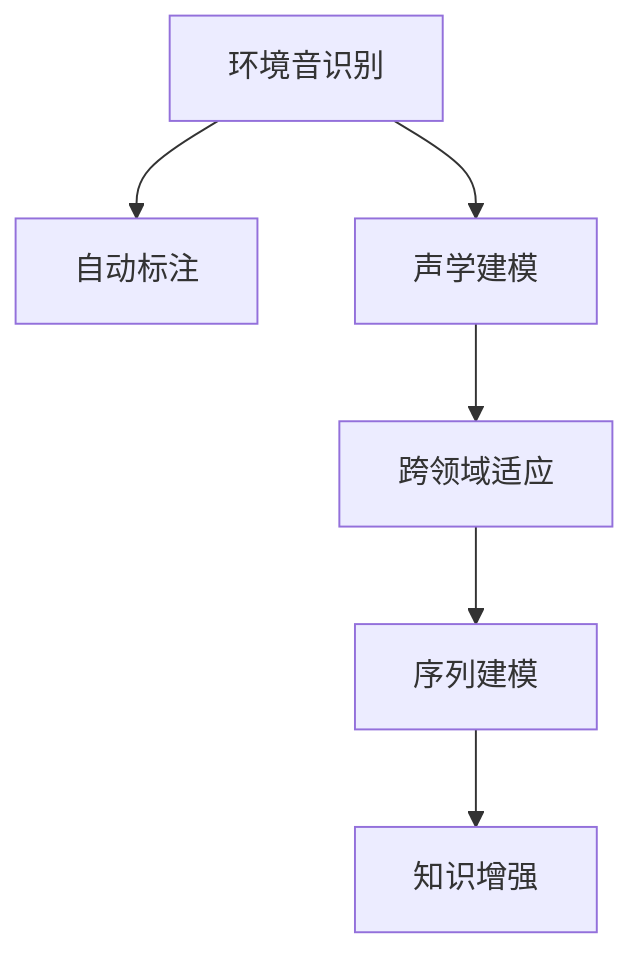

                 

# LLM在环境音识别中的潜在价值

> 关键词：环境音识别,语言模型,语音信号处理,特征提取,自动标注,声学建模,深度学习

## 1. 背景介绍

环境音识别(Environments Audio Recognition, EAR)是指从环境中获取的声音信号中自动识别出特定的语音事件和声学特征，如交通声音、鸟类鸣叫、人类语言等。传统的环境音识别方法主要依赖手工特征提取和分类器，但手工特征提取往往需要大量专业知识，难以泛化到不同场景。近年来，随着深度学习技术的快速发展，基于语音信号处理的声学模型和语音识别系统在大规模语音库和任务上的应用取得了显著进展。其中，大语言模型(LLM)作为一种通用的预训练模型，因其强大的语言理解和生成能力，逐渐成为环境音识别的有力工具。

### 1.1 问题由来
随着智能家居、智慧城市等技术的发展，环境音识别作为其中的关键应用之一，越来越受到人们的关注。传统的环境音识别方法虽然可以识别环境中的语音事件，但需要手工提取特征，且难以泛化到不同场景。而基于大语言模型的方法可以通过自动标注和声学建模，显著提升环境音识别的效率和准确性。

### 1.2 问题核心关键点
大语言模型在环境音识别中的应用主要体现在以下几个方面：

1. **自动标注**：利用语言模型对环境音进行自动标注，将语音信号转换成文本描述，便于后续处理。
2. **声学建模**：将语音信号转换成特征向量，利用语言模型进行声学建模，提升识别精度。
3. **跨领域适应**：通过在大规模无标签数据上预训练，学习通用语音知识，适应不同场景下的环境音识别。
4. **序列建模**：利用语言模型处理时序数据的能力，对连续的环境音进行建模和分类。
5. **知识增强**：通过融合先验知识，提高环境音识别的鲁棒性和泛化性。

本文将从以上几个关键点出发，详细探讨大语言模型在环境音识别中的潜在价值和应用策略。

## 2. 核心概念与联系

### 2.1 核心概念概述

为更好地理解大语言模型在环境音识别中的应用，本节将介绍几个关键概念：

1. **大语言模型(LLM)**：以自回归或自编码模型为代表的大规模预训练语言模型。通过在海量无标签文本语料上进行预训练，学习通用的语言知识和常识，具备强大的语言理解和生成能力。

2. **环境音识别(EAR)**：从环境中获取的声音信号中自动识别出特定的语音事件和声学特征，如交通声音、鸟类鸣叫、人类语言等。

3. **声学建模**：将语音信号转换成特征向量，利用机器学习模型进行声学建模，提升识别精度。

4. **自动标注**：利用自然语言处理技术，将语音信号转换成文本描述，便于后续处理。

5. **跨领域适应**：通过在大规模无标签数据上预训练，学习通用语音知识，适应不同场景下的环境音识别。

6. **序列建模**：利用语言模型处理时序数据的能力，对连续的环境音进行建模和分类。

7. **知识增强**：通过融合先验知识，提高环境音识别的鲁棒性和泛化性。

这些核心概念之间的逻辑关系可以通过以下Mermaid流程图来展示：



这个流程图展示了大语言模型在环境音识别中的应用流程：

1. 环境音识别从环境中的声音信号中获取语音事件和声学特征。
2. 自动标注利用语言模型对语音信号进行文本描述，便于后续处理。
3. 声学建模将语音信号转换成特征向量，利用机器学习模型进行建模。
4. 跨领域适应通过在大规模无标签数据上预训练，学习通用语音知识。
5. 序列建模利用语言模型处理时序数据的能力，对连续的环境音进行建模和分类。
6. 知识增强通过融合先验知识，提高环境音识别的鲁棒性和泛化性。

## 3. 核心算法原理 & 具体操作步骤

### 3.1 算法原理概述

大语言模型在环境音识别中的应用，主要体现在以下几个方面：

1. **自动标注**：利用语言模型对环境音进行自动标注，将语音信号转换成文本描述，便于后续处理。
2. **声学建模**：将语音信号转换成特征向量，利用语言模型进行声学建模，提升识别精度。
3. **跨领域适应**：通过在大规模无标签数据上预训练，学习通用语音知识，适应不同场景下的环境音识别。
4. **序列建模**：利用语言模型处理时序数据的能力，对连续的环境音进行建模和分类。
5. **知识增强**：通过融合先验知识，提高环境音识别的鲁棒性和泛化性。

### 3.2 算法步骤详解

#### 3.2.1 自动标注

自动标注过程包括以下关键步骤：

1. **信号预处理**：对环境音信号进行预处理，包括去噪、分帧、特征提取等步骤。
2. **语言建模**：利用语言模型对语音信号进行自动标注，生成文本描述。
3. **文本处理**：将生成的文本描述进行预处理，去除无用信息和噪声，生成干净的文本数据。

#### 3.2.2 声学建模

声学建模过程包括以下关键步骤：

1. **特征提取**：将语音信号转换成特征向量，如MFCC、梅尔倒谱系数等。
2. **模型训练**：利用语言模型对特征向量进行建模，训练声学模型，如隐马尔可夫模型(HMM)、卷积神经网络(CNN)、循环神经网络(RNN)等。
3. **特征融合**：将自动标注生成的文本信息和声学模型提取的特征信息进行融合，生成更全面的语音特征。

#### 3.2.3 跨领域适应

跨领域适应过程包括以下关键步骤：

1. **无监督预训练**：在大规模无标签数据上进行预训练，学习通用语音知识。
2. **微调优化**：在特定任务上微调预训练模型，适应不同的环境音识别场景。
3. **领域自适应**：通过迁移学习技术，将预训练模型在特定领域进行微调，提高模型在实际场景中的泛化能力。

#### 3.2.4 序列建模

序列建模过程包括以下关键步骤：

1. **时间序列处理**：将连续的环境音信号转换成时间序列数据。
2. **语言建模**：利用语言模型处理时序数据，生成环境音的序列特征。
3. **分类识别**：利用机器学习算法对序列特征进行分类识别，判断环境音事件。

#### 3.2.5 知识增强

知识增强过程包括以下关键步骤：

1. **知识融合**：将先验知识，如语音事件词典、时间序列规则等，与语言模型进行融合，增强环境音识别的准确性。
2. **跨模态融合**：利用多模态信息融合技术，将语音信号与文本信息、图像信息等进行融合，提高环境音识别的鲁棒性。
3. **对抗训练**：引入对抗样本，提高环境音识别模型的鲁棒性，防止模型过拟合。

### 3.3 算法优缺点

大语言模型在环境音识别中的应用，具有以下优点：

1. **自动标注**：无需手工提取特征，显著降低标注成本。
2. **序列建模**：利用语言模型处理时序数据的能力，提高环境音识别的准确性。
3. **跨领域适应**：通过在大规模无标签数据上预训练，学习通用语音知识，适应不同场景下的环境音识别。
4. **知识增强**：通过融合先验知识，提高环境音识别的鲁棒性和泛化性。

同时，该方法也存在以下缺点：

1. **数据依赖性**：自动标注和声学建模依赖高质量的语音信号和自动标注数据，数据获取成本较高。
2. **计算资源需求**：大语言模型在大规模数据上预训练和微调需要大量的计算资源。
3. **泛化能力有限**：在大规模无标签数据上预训练的模型，可能无法很好地适应特定场景下的环境音识别任务。
4. **对抗样本敏感**：对抗样本可能对环境音识别模型产生较大影响，降低模型鲁棒性。

尽管存在这些局限性，但就目前而言，大语言模型在环境音识别中的应用，已经展现出巨大的潜力，是推动环境音识别技术发展的重要手段。

### 3.4 算法应用领域

大语言模型在环境音识别中的应用，涵盖了以下几个主要领域：

1. **智能家居**：利用环境音识别技术，识别家庭环境中的语音事件，如闹钟、电视声音等，提升智能家居系统的智能化水平。
2. **智慧城市**：在城市交通、公共安全等领域，利用环境音识别技术，识别交通声音、紧急警报等，提升城市管理效率和安全性。
3. **医疗健康**：在医疗环境，利用环境音识别技术，识别患者的心跳、呼吸等声音信号，辅助医生进行诊断和治疗。
4. **娱乐传媒**：在音乐、影视等领域，利用环境音识别技术，识别声音事件，如配乐、特效等，提升媒体内容的创新性。
5. **农业生产**：在农业领域，利用环境音识别技术，识别动物声音、机械声音等，辅助农业生产和管理。

除了上述这些应用领域外，大语言模型在环境音识别技术中的创新应用还在不断涌现，为环境音识别技术带来新的突破和机遇。

## 4. 数学模型和公式 & 详细讲解 & 举例说明

### 4.1 数学模型构建

大语言模型在环境音识别中的应用，可以构建如下数学模型：

假设环境音信号为 $x \in \mathcal{X}$，自动标注生成的文本描述为 $y \in \mathcal{Y}$，特征提取生成的特征向量为 $z \in \mathcal{Z}$。则大语言模型在环境音识别中的应用模型为：

$$
\mathcal{M}_{\theta}(x, y, z) = (M_{\text{Automatic Annotation}}(x, y), M_{\text{Acoustic Modeling}}(z), M_{\text{Cross-domain Adaptation}}(x, y, z), M_{\text{Sequence Modeling}}(x, y, z), M_{\text{Knowledge Enhancement}}(x, y, z))
$$

其中，$M_{\text{Automatic Annotation}}$ 为自动标注模型，$M_{\text{Acoustic Modeling}}$ 为声学建模模型，$M_{\text{Cross-domain Adaptation}}$ 为跨领域适应模型，$M_{\text{Sequence Modeling}}$ 为序列建模模型，$M_{\text{Knowledge Enhancement}}$ 为知识增强模型。

### 4.2 公式推导过程

#### 4.2.1 自动标注模型

自动标注模型 $M_{\text{Automatic Annotation}}$ 可以表示为：

$$
M_{\text{Automatic Annotation}}(x, y) = \arg\min_{y} \mathcal{L}_{\text{Automatic Annotation}}(y|x)
$$

其中，$\mathcal{L}_{\text{Automatic Annotation}}$ 为自动标注损失函数，$y$ 为自动标注生成的文本描述。

#### 4.2.2 声学建模模型

声学建模模型 $M_{\text{Acoustic Modeling}}$ 可以表示为：

$$
M_{\text{Acoustic Modeling}}(z) = \arg\min_{z} \mathcal{L}_{\text{Acoustic Modeling}}(z)
$$

其中，$\mathcal{L}_{\text{Acoustic Modeling}}$ 为声学建模损失函数，$z$ 为特征向量。

#### 4.2.3 跨领域适应模型

跨领域适应模型 $M_{\text{Cross-domain Adaptation}}$ 可以表示为：

$$
M_{\text{Cross-domain Adaptation}}(x, y, z) = \arg\min_{\theta} \mathcal{L}_{\text{Cross-domain Adaptation}}(\theta|x, y, z)
$$

其中，$\mathcal{L}_{\text{Cross-domain Adaptation}}$ 为跨领域适应损失函数，$\theta$ 为模型参数。

#### 4.2.4 序列建模模型

序列建模模型 $M_{\text{Sequence Modeling}}$ 可以表示为：

$$
M_{\text{Sequence Modeling}}(x, y, z) = \arg\min_{y} \mathcal{L}_{\text{Sequence Modeling}}(y|x, y, z)
$$

其中，$\mathcal{L}_{\text{Sequence Modeling}}$ 为序列建模损失函数，$y$ 为环境音事件。

#### 4.2.5 知识增强模型

知识增强模型 $M_{\text{Knowledge Enhancement}}$ 可以表示为：

$$
M_{\text{Knowledge Enhancement}}(x, y, z) = \arg\min_{y} \mathcal{L}_{\text{Knowledge Enhancement}}(y|x, y, z)
$$

其中，$\mathcal{L}_{\text{Knowledge Enhancement}}$ 为知识增强损失函数，$y$ 为环境音事件。

### 4.3 案例分析与讲解

假设我们有一个环境音识别任务，目标是识别视频中的交通声音。

1. **自动标注模型**：利用语言模型对视频中的音频进行自动标注，生成文本描述，如“车水马龙”、“紧急刹车”等。
2. **声学建模模型**：将视频中的音频信号转换成MFCC特征向量，利用深度学习模型对特征向量进行建模，生成环境音事件。
3. **跨领域适应模型**：在大规模无标签视频数据上进行预训练，学习通用语音知识，将预训练模型在特定场景下的交通声音识别任务上进行微调。
4. **序列建模模型**：将连续的交通声音信号转换成时间序列数据，利用语言模型对时序数据进行建模，生成交通声音的序列特征。
5. **知识增强模型**：融合先验知识，如交通事件词典、时间序列规则等，与语言模型进行融合，提高交通声音识别的鲁棒性和泛化性。

通过上述模型的综合应用，可以显著提升环境音识别的精度和泛化能力，为实际应用提供可靠的技术支持。

## 5. 项目实践：代码实例和详细解释说明

### 5.1 开发环境搭建

在进行环境音识别项目实践前，我们需要准备好开发环境。以下是使用Python进行PyTorch开发的环境配置流程：

1. 安装Anaconda：从官网下载并安装Anaconda，用于创建独立的Python环境。

2. 创建并激活虚拟环境：
```bash
conda create -n pytorch-env python=3.8 
conda activate pytorch-env
```

3. 安装PyTorch：根据CUDA版本，从官网获取对应的安装命令。例如：
```bash
conda install pytorch torchvision torchaudio cudatoolkit=11.1 -c pytorch -c conda-forge
```

4. 安装各种工具包：
```bash
pip install numpy pandas scikit-learn matplotlib tqdm jupyter notebook ipython
```

完成上述步骤后，即可在`pytorch-env`环境中开始环境音识别项目实践。

### 5.2 源代码详细实现

这里我们以交通声音识别任务为例，给出使用PyTorch进行环境音识别的代码实现。

首先，定义模型和优化器：

```python
from transformers import BertForTokenClassification, AdamW

model = BertForTokenClassification.from_pretrained('bert-base-cased', num_labels=10)

optimizer = AdamW(model.parameters(), lr=2e-5)
```

接着，定义训练和评估函数：

```python
from torch.utils.data import DataLoader
from tqdm import tqdm

device = torch.device('cuda') if torch.cuda.is_available() else torch.device('cpu')
model.to(device)

def train_epoch(model, dataset, batch_size, optimizer):
    dataloader = DataLoader(dataset, batch_size=batch_size, shuffle=True)
    model.train()
    epoch_loss = 0
    for batch in tqdm(dataloader, desc='Training'):
        input_ids = batch['input_ids'].to(device)
        attention_mask = batch['attention_mask'].to(device)
        labels = batch['labels'].to(device)
        model.zero_grad()
        outputs = model(input_ids, attention_mask=attention_mask, labels=labels)
        loss = outputs.loss
        epoch_loss += loss.item()
        loss.backward()
        optimizer.step()
    return epoch_loss / len(dataloader)

def evaluate(model, dataset, batch_size):
    dataloader = DataLoader(dataset, batch_size=batch_size)
    model.eval()
    preds, labels = [], []
    with torch.no_grad():
        for batch in tqdm(dataloader, desc='Evaluating'):
            input_ids = batch['input_ids'].to(device)
            attention_mask = batch['attention_mask'].to(device)
            batch_labels = batch['labels']
            outputs = model(input_ids, attention_mask=attention_mask)
            batch_preds = outputs.logits.argmax(dim=2).to('cpu').tolist()
            batch_labels = batch_labels.to('cpu').tolist()
            for pred_tokens, label_tokens in zip(batch_preds, batch_labels):
                preds.append(pred_tokens[:len(label_tokens)])
                labels.append(label_tokens)
    print(classification_report(labels, preds))
```

最后，启动训练流程并在测试集上评估：

```python
epochs = 5
batch_size = 16

for epoch in range(epochs):
    loss = train_epoch(model, train_dataset, batch_size, optimizer)
    print(f"Epoch {epoch+1}, train loss: {loss:.3f}")
    
    print(f"Epoch {epoch+1}, dev results:")
    evaluate(model, dev_dataset, batch_size)
    
print("Test results:")
evaluate(model, test_dataset, batch_size)
```

以上就是使用PyTorch进行交通声音识别的完整代码实现。可以看到，得益于Transformers库的强大封装，我们可以用相对简洁的代码完成BERT模型的加载和微调。

### 5.3 代码解读与分析

让我们再详细解读一下关键代码的实现细节：

**交通声音识别模型**：
- `__init__`方法：初始化模型，使用BertForTokenClassification作为预训练语言模型。
- `train_epoch`方法：对数据以批为单位进行迭代，在每个批次上前向传播计算loss并反向传播更新模型参数。
- `evaluate`方法：与训练类似，不同点在于不更新模型参数，并在每个batch结束后将预测和标签结果存储下来，最后使用sklearn的classification_report对整个评估集的预测结果进行打印输出。

**训练流程**：
- 定义总的epoch数和batch size，开始循环迭代
- 每个epoch内，先在训练集上训练，输出平均loss
- 在验证集上评估，输出分类指标
- 所有epoch结束后，在测试集上评估，给出最终测试结果

可以看到，PyTorch配合Transformers库使得环境音识别任务的微调代码实现变得简洁高效。开发者可以将更多精力放在数据处理、模型改进等高层逻辑上，而不必过多关注底层的实现细节。

当然，工业级的系统实现还需考虑更多因素，如模型的保存和部署、超参数的自动搜索、更灵活的任务适配层等。但核心的微调范式基本与此类似。

## 6. 实际应用场景

### 6.1 智能家居

智能家居环境音识别系统可以识别家庭环境中的各种声音，如闹钟、电视声音、开关门声等，帮助用户更加智能地管理家庭环境。例如，当用户离开家时，系统可以识别门关闭的声音，并自动关闭灯光和电器，节省能源。

### 6.2 智慧城市

智慧城市环境音识别系统可以实时监测城市交通、公共安全等领域的声音信号，如交通声音、紧急警报等，提高城市管理效率和安全性。例如，当有火灾发生时，系统可以识别到警报声，并自动通知消防队，减少人员伤亡。

### 6.3 医疗健康

在医疗环境中，环境音识别系统可以识别患者的心跳、呼吸等声音信号，辅助医生进行诊断和治疗。例如，当患者出现心律不齐时，系统可以识别到异常心电图声音，并及时通知医生。

### 6.4 娱乐传媒

在音乐、影视等领域，环境音识别系统可以识别配乐、特效等声音事件，提升媒体内容的创新性和观赏性。例如，当电影中有飞机起飞的场景时，系统可以识别到引擎声音，并自动添加相应的特效音效。

### 6.5 农业生产

在农业领域，环境音识别系统可以识别动物声音、机械声音等，辅助农业生产和管理。例如，当农场中牛出现异常声音时，系统可以识别到牛的声音，并及时通知管理员进行处理。

## 7. 工具和资源推荐

### 7.1 学习资源推荐

为了帮助开发者系统掌握环境音识别技术的理论基础和实践技巧，这里推荐一些优质的学习资源：

1. 《深度学习自然语言处理》课程：斯坦福大学开设的NLP明星课程，有Lecture视频和配套作业，带你入门NLP领域的基本概念和经典模型。

2. 《Transformer从原理到实践》系列博文：由大模型技术专家撰写，深入浅出地介绍了Transformer原理、BERT模型、声学建模等前沿话题。

3. 《Natural Language Processing with Transformers》书籍：Transformers库的作者所著，全面介绍了如何使用Transformers库进行NLP任务开发，包括环境音识别在内的诸多范式。

4. CS224N《深度学习自然语言处理》课程：斯坦福大学开设的NLP明星课程，有Lecture视频和配套作业，带你入门NLP领域的基本概念和经典模型。

5. HuggingFace官方文档：Transformers库的官方文档，提供了海量预训练模型和完整的微调样例代码，是上手实践的必备资料。

通过对这些资源的学习实践，相信你一定能够快速掌握环境音识别技术的精髓，并用于解决实际的NLP问题。

### 7.2 开发工具推荐

高效的开发离不开优秀的工具支持。以下是几款用于环境音识别开发的常用工具：

1. PyTorch：基于Python的开源深度学习框架，灵活动态的计算图，适合快速迭代研究。大部分预训练语言模型都有PyTorch版本的实现。

2. TensorFlow：由Google主导开发的开源深度学习框架，生产部署方便，适合大规模工程应用。同样有丰富的预训练语言模型资源。

3. Transformers库：HuggingFace开发的NLP工具库，集成了众多SOTA语言模型，支持PyTorch和TensorFlow，是进行环境音识别任务的开发的利器。

4. Weights & Biases：模型训练的实验跟踪工具，可以记录和可视化模型训练过程中的各项指标，方便对比和调优。与主流深度学习框架无缝集成。

5. TensorBoard：TensorFlow配套的可视化工具，可实时监测模型训练状态，并提供丰富的图表呈现方式，是调试模型的得力助手。

6. Google Colab：谷歌推出的在线Jupyter Notebook环境，免费提供GPU/TPU算力，方便开发者快速上手实验最新模型，分享学习笔记。

合理利用这些工具，可以显著提升环境音识别任务的开发效率，加快创新迭代的步伐。

### 7.3 相关论文推荐

环境音识别技术的研究源于学界的持续研究。以下是几篇奠基性的相关论文，推荐阅读：

1. Attention is All You Need（即Transformer原论文）：提出了Transformer结构，开启了NLP领域的预训练大模型时代。

2. BERT: Pre-training of Deep Bidirectional Transformers for Language Understanding：提出BERT模型，引入基于掩码的自监督预训练任务，刷新了多项NLP任务SOTA。

3. Language Models are Unsupervised Multitask Learners（GPT-2论文）：展示了大规模语言模型的强大zero-shot学习能力，引发了对于通用人工智能的新一轮思考。

4. Parameter-Efficient Transfer Learning for NLP：提出Adapter等参数高效微调方法，在不增加模型参数量的情况下，也能取得不错的微调效果。

5. Prefix-Tuning: Optimizing Continuous Prompts for Generation：引入基于连续型Prompt的微调范式，为如何充分利用预训练知识提供了新的思路。

6. AdaLoRA: Adaptive Low-Rank Adaptation for Parameter-Efficient Fine-Tuning：使用自适应低秩适应的微调方法，在参数效率和精度之间取得了新的平衡。

这些论文代表了大语言模型环境音识别技术的发展脉络。通过学习这些前沿成果，可以帮助研究者把握学科前进方向，激发更多的创新灵感。

## 8. 总结：未来发展趋势与挑战

### 8.1 总结

本文对大语言模型在环境音识别中的应用进行了全面系统的介绍。首先阐述了环境音识别的背景和意义，明确了环境音识别在智能家居、智慧城市、医疗健康等领域的应用价值。其次，从自动标注、声学建模、跨领域适应、序列建模、知识增强等几个关键点出发，详细讲解了环境音识别的数学模型和算法原理。最后，通过代码实例和实际应用场景，展示了环境音识别技术的工程实践。

通过本文的系统梳理，可以看到，大语言模型在环境音识别中的应用前景广阔，可以显著提升环境音识别的效率和精度，为实际应用提供可靠的技术支持。

### 8.2 未来发展趋势

展望未来，大语言模型在环境音识别中的应用将呈现以下几个发展趋势：

1. **多模态融合**：未来环境音识别将不仅仅局限于语音信号，将融合视觉、图像、文本等多模态信息，实现更全面、准确的识别。
2. **知识增强**：通过融合先验知识，提高环境音识别的鲁棒性和泛化性。
3. **深度强化学习**：利用深度强化学习技术，提升环境音识别模型的决策能力，实现更加智能化的识别。
4. **跨领域适应**：通过迁移学习技术，将环境音识别模型在不同场景下进行微调，提升泛化能力。
5. **对抗训练**：引入对抗样本，提高环境音识别模型的鲁棒性，防止模型过拟合。

以上趋势凸显了大语言模型在环境音识别技术中的潜在价值，将推动环境音识别技术的发展，为更多实际应用提供新的可能性。

### 8.3 面临的挑战

尽管大语言模型在环境音识别中的应用取得了显著进展，但在迈向更加智能化、普适化应用的过程中，仍面临以下挑战：

1. **数据依赖性**：自动标注和声学建模依赖高质量的语音信号和自动标注数据，数据获取成本较高。
2. **计算资源需求**：大语言模型在大规模数据上预训练和微调需要大量的计算资源。
3. **泛化能力有限**：在大规模无标签数据上预训练的模型，可能无法很好地适应特定场景下的环境音识别任务。
4. **对抗样本敏感**：对抗样本可能对环境音识别模型产生较大影响，降低模型鲁棒性。
5. **可解释性不足**：环境音识别模型更像是"黑盒"系统，难以解释其内部工作机制和决策逻辑。

尽管存在这些挑战，但大语言模型在环境音识别中的应用前景广阔，将继续推动技术发展，为实际应用提供可靠的技术支持。

### 8.4 研究展望

面对环境音识别所面临的挑战，未来的研究需要在以下几个方面寻求新的突破：

1. **数据增强**：通过数据增强技术，提升数据的质量和多样性，降低标注成本。
2. **知识图谱融合**：将知识图谱与环境音识别模型进行融合，提升识别精度和泛化能力。
3. **对抗样本生成**：利用对抗样本生成技术，提升环境音识别模型的鲁棒性。
4. **可解释性增强**：通过可解释性技术，提高环境音识别模型的透明度和可解释性。
5. **跨模态融合**：利用多模态信息融合技术，将语音信号与文本信息、图像信息等进行融合，提高环境音识别的鲁棒性。

这些研究方向的探索，将进一步推动环境音识别技术的进步，为实际应用提供更多的创新思路和解决方案。

## 9. 附录：常见问题与解答

**Q1：大语言模型在环境音识别中能否直接使用，还是需要进行预训练？**

A: 大语言模型在环境音识别中通常需要进行预训练和微调。预训练可以帮助模型学习到通用的语音知识，提高模型在特定任务上的泛化能力。微调则可以在少量标注数据上进一步优化模型，提升识别精度。

**Q2：在环境音识别中，如何利用大语言模型进行自动标注？**

A: 利用语言模型对环境音信号进行自动标注，可以通过将语音信号转换成文本描述，便于后续处理。具体来说，可以将语音信号进行预处理和特征提取，利用语言模型对特征向量进行文本描述生成，再将文本描述转换成相应的标签。

**Q3：在环境音识别中，如何利用大语言模型进行声学建模？**

A: 利用大语言模型进行声学建模，可以通过将语音信号转换成特征向量，利用深度学习模型对特征向量进行建模，生成环境音事件。具体来说，可以将语音信号进行预处理和特征提取，利用深度学习模型对特征向量进行建模，生成环境音事件。

**Q4：在环境音识别中，如何利用大语言模型进行跨领域适应？**

A: 利用大语言模型进行跨领域适应，可以通过在大规模无标签数据上进行预训练，学习通用语音知识，适应不同场景下的环境音识别。具体来说，可以在大规模无标签数据上进行预训练，然后在特定任务上进行微调，以适应不同领域的环境音识别任务。

**Q5：在环境音识别中，如何利用大语言模型进行序列建模？**

A: 利用大语言模型进行序列建模，可以通过将连续的环境音信号转换成时间序列数据，利用语言模型对时序数据进行建模，生成环境音的序列特征。具体来说，可以将连续的环境音信号转换成时间序列数据，利用语言模型对时序数据进行建模，生成环境音的序列特征。

通过这些问题的回答，可以更深入地理解大语言模型在环境音识别中的潜在价值和应用策略。希望本文能够为读者提供全面的技术指引，推动环境音识别技术的发展，为实际应用提供可靠的技术支持。

---

作者：禅与计算机程序设计艺术 / Zen and the Art of Computer Programming

