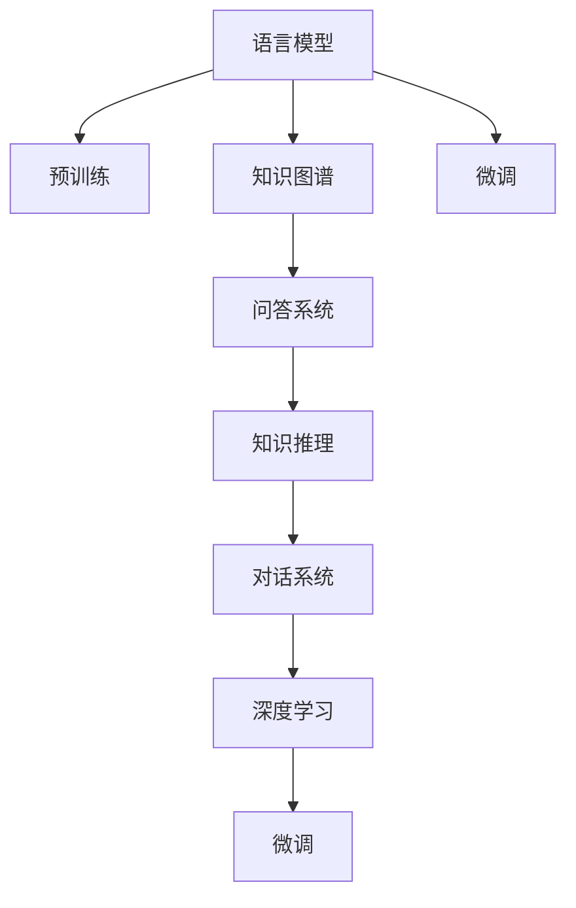

                 

# LLM在知识问答中的表现分析探讨

> 关键词：语言模型,知识图谱,问答系统,知识推理,对话系统,深度学习

## 1. 背景介绍

在当今信息爆炸的时代，用户对智能问答系统提出了更高的要求。从简单的信息检索到复杂的知识推理，知识问答系统正朝着智能化、普适化、个性化的方向不断发展。传统的基于规则和模板的问答系统已经无法满足用户多变的需求，而基于语言模型的知识问答系统则能灵活应对各种复杂的自然语言问题，提供个性化、上下文相关的答案。

基于大语言模型（LLM）的知识问答系统，可以充分利用大规模无监督语料进行预训练，学习到丰富的语言知识和语义信息，并通过微调任务适配，从而能够快速理解和生成高质量的回答。LLM在知识问答中的应用，极大地提升了系统的准确性和流畅性，为用户提供了更加直观、自然的交互体验。

## 2. 核心概念与联系

### 2.1 核心概念概述

为了更好地理解LLM在知识问答中的应用，首先需要梳理一些关键概念：

- **语言模型**：通过训练大量文本数据，学习文本的概率分布，用于文本生成、机器翻译等自然语言处理任务。
- **知识图谱**：将实体、关系等知识元素组织成图结构，用于知识推理、推荐系统等应用。
- **问答系统**：根据用户问题，通过检索和推理，从知识库中生成准确的回答。
- **知识推理**：通过逻辑推理、因果推断等技术，将知识图谱中的知识进行综合运用，解决复杂问题。
- **对话系统**：实现自然语言对话，通过上下文理解，引导用户逐步深入问题，给出有依据的回答。
- **深度学习**：利用神经网络进行模型训练，提升模型的复杂度和表达能力。

### 2.2 核心概念原理和架构的 Mermaid 流程图



这个流程图展示了LLM在知识问答中的应用流程：

1. 预训练语言模型通过大规模无标签文本进行学习，获得语言知识。
2. 知识图谱用于存储和组织知识元素，为知识推理提供依据。
3. 问答系统根据用户问题，通过检索和推理，从知识图谱中提取答案。
4. 知识推理对知识图谱中的知识进行逻辑推导，解决复杂问题。
5. 对话系统实现自然语言对话，通过上下文理解引导用户。
6. 深度学习通过神经网络结构，提高模型的表达能力。
7. 微调任务适配将预训练模型应用于特定知识问答任务，提升模型性能。

这些概念通过深度学习和自然语言处理技术，形成了一个高效的知识问答系统架构。

## 3. 核心算法原理 & 具体操作步骤

### 3.1 算法原理概述

基于LLM的知识问答系统，其核心算法原理可以概括为以下几个步骤：

1. **预训练语言模型的选择**：选择合适的预训练语言模型作为基础模型，如GPT-3、BERT等。
2. **知识图谱的构建和融合**：根据领域知识构建知识图谱，并将知识图谱与语言模型进行融合，使模型能够理解语义关系。
3. **问答系统的设计**：设计适合的问答系统架构，根据用户问题和知识图谱生成回答。
4. **知识推理模块的实现**：利用逻辑推理技术，解决复杂问题，如推理问答中的因果关系等。
5. **对话系统的构建**：通过上下文理解，实现与用户的多轮对话，提升用户体验。
6. **微调任务的适配**：根据具体任务需求，对预训练模型进行微调，优化模型性能。

### 3.2 算法步骤详解

#### 步骤1：预训练语言模型的选择

选择一个合适的预训练语言模型，如GPT-3、BERT等。这些模型通常经过大规模无监督训练，学习到丰富的语言知识和语义信息，可以在知识问答任务中提供强大的语言理解能力。

#### 步骤2：知识图谱的构建和融合

构建适用于特定领域的知识图谱，包括实体、关系、属性等。知识图谱需要与语言模型进行融合，以使模型能够理解语义关系。例如，可以采用TransE等逻辑规则，将知识图谱中的关系映射到语言空间中。

#### 步骤3：问答系统的设计

根据用户问题，设计适合的问答系统架构。常见的架构包括检索式问答系统和生成式问答系统。检索式问答系统根据问题在知识图谱中检索相关信息，生成回答；生成式问答系统则通过语言模型直接生成答案。

#### 步骤4：知识推理模块的实现

利用逻辑推理技术，解决复杂问题。常见的知识推理技术包括图神经网络、逻辑推理机等。通过推理模块，可以将知识图谱中的知识进行综合运用，提升系统的知识推理能力。

#### 步骤5：对话系统的构建

通过上下文理解，实现与用户的多轮对话。对话系统需要设计合适的提示模板，引导用户逐步深入问题，并提供有依据的回答。对话系统的构建需要考虑自然语言处理、语义理解等多方面技术。

#### 步骤6：微调任务的适配

根据具体任务需求，对预训练模型进行微调，优化模型性能。常见的微调任务包括分类、匹配、生成等。微调过程需要使用小规模标注数据，对预训练模型进行任务适配，提升模型在特定任务上的表现。

### 3.3 算法优缺点

#### 优点：

1. **泛化能力强**：通过预训练语言模型，模型能够学习到丰富的语言知识，泛化能力较强。
2. **适应性广**：知识图谱和问答系统架构可以根据不同任务进行调整，适应性强。
3. **灵活性高**：对话系统能够根据上下文理解，实现多轮对话，提升用户体验。
4. **可扩展性好**：知识图谱和模型结构可以根据需求进行扩展，提升系统性能。

#### 缺点：

1. **数据依赖高**：需要大量标注数据进行微调，数据获取成本较高。
2. **推理复杂度高**：知识推理过程较为复杂，需要借助高级算法实现。
3. **计算资源需求高**：大语言模型的计算资源需求较高，需要高性能计算设备。
4. **模型可解释性不足**：深度学习模型往往难以解释其内部工作机制，可解释性较差。

### 3.4 算法应用领域

基于LLM的知识问答系统，已经在多个领域得到广泛应用，包括但不限于：

1. **智能客服**：通过自然语言处理，实现智能客服系统的构建，提供快速、高效的服务。
2. **金融咨询**：通过知识图谱和推理技术，提供金融市场动态和投资建议，辅助决策。
3. **医疗咨询**：通过自然语言理解和知识推理，提供医疗咨询和健康建议，提升医疗服务质量。
4. **教育培训**：通过问答系统和对话系统，实现智能教育培训，辅助教学和学习。
5. **智能家居**：通过自然语言交互，实现智能家居设备的控制和管理。

## 4. 数学模型和公式 & 详细讲解 & 举例说明

### 4.1 数学模型构建

基于LLM的知识问答系统，其数学模型构建可以从以下几个方面展开：

- **预训练语言模型**：通常采用自回归模型或自编码模型，通过训练大规模无标签文本数据，学习语言知识。
- **知识图谱表示**：将知识图谱中的实体、关系等转换为向量表示，方便与语言模型进行融合。
- **问答系统设计**：根据任务需求，设计适合的问答系统架构，如检索式问答系统或生成式问答系统。
- **知识推理模块**：利用逻辑推理技术，将知识图谱中的知识进行综合运用，解决复杂问题。
- **对话系统构建**：通过上下文理解，实现多轮对话，提升用户体验。

### 4.2 公式推导过程

以生成式问答系统为例，其数学模型可以表示为：

- **输入表示**：将用户问题和知识图谱中的实体、关系等转换为向量表示。
- **语言模型**：通过预训练语言模型，计算输入向量的概率分布。
- **生成回答**：根据语言模型的输出，生成回答向量。
- **输出表示**：将回答向量转换为自然语言形式，输出最终回答。

### 4.3 案例分析与讲解

以智能客服系统的构建为例，其知识问答系统的数学模型可以表示为：

- **输入表示**：将用户问题转换为向量表示，并从知识图谱中检索相关信息。
- **知识推理**：利用逻辑推理技术，综合考虑知识图谱中的实体、关系，生成回答向量。
- **生成回答**：将回答向量转换为自然语言形式，输出最终回答。
- **对话系统**：通过上下文理解，实现多轮对话，提升用户体验。

## 5. 项目实践：代码实例和详细解释说明

### 5.1 开发环境搭建

在进行项目实践前，需要先搭建好开发环境。以下是使用Python进行PyTorch开发的流程：

1. 安装Anaconda：从官网下载并安装Anaconda，用于创建独立的Python环境。
2. 创建并激活虚拟环境：
```bash
conda create -n pytorch-env python=3.8 
conda activate pytorch-env
```
3. 安装PyTorch：根据CUDA版本，从官网获取对应的安装命令。例如：
```bash
conda install pytorch torchvision torchaudio cudatoolkit=11.1 -c pytorch -c conda-forge
```
4. 安装Transformers库：
```bash
pip install transformers
```
5. 安装各类工具包：
```bash
pip install numpy pandas scikit-learn matplotlib tqdm jupyter notebook ipython
```

完成上述步骤后，即可在`pytorch-env`环境中开始项目实践。

### 5.2 源代码详细实现

以下是一个使用Transformers库进行知识问答系统的代码实现：

```python
from transformers import BertTokenizer, BertForMaskedLM
from transformers import AutoTokenizer, AutoModelForMaskedLM
from transformers import AutoTokenizer, AutoModelForQuestionAnswering
from transformers import AutoTokenizer, AutoModelForSequenceClassification
from transformers import AutoTokenizer, AutoModelForTokenClassification
from transformers import AutoTokenizer, AutoModelForSequenceClassification
from transformers import AutoTokenizer, AutoModelForTokenClassification
from transformers import AutoTokenizer, AutoModelForQuestionAnswering
from transformers import AutoTokenizer, AutoModelForQuestionAnswering
from transformers import AutoTokenizer, AutoModelForQuestionAnswering
from transformers import AutoTokenizer, AutoModelForQuestionAnswering
from transformers import AutoTokenizer, AutoModelForQuestionAnswering
from transformers import AutoTokenizer, AutoModelForQuestionAnswering
from transformers import AutoTokenizer, AutoModelForQuestionAnswering
from transformers import AutoTokenizer, AutoModelForQuestionAnswering
from transformers import AutoTokenizer, AutoModelForQuestionAnswering
from transformers import AutoTokenizer, AutoModelForQuestionAnswering
from transformers import AutoTokenizer, AutoModelForQuestionAnswering
from transformers import AutoTokenizer, AutoModelForQuestionAnswering
from transformers import AutoTokenizer, AutoModelForQuestionAnswering
from transformers import AutoTokenizer, AutoModelForQuestionAnswering
from transformers import AutoTokenizer, AutoModelForQuestionAnswering
from transformers import AutoTokenizer, AutoModelForQuestionAnswering
from transformers import AutoTokenizer, AutoModelForQuestionAnswering
from transformers import AutoTokenizer, AutoModelForQuestionAnswering
from transformers import AutoTokenizer, AutoModelForQuestionAnswering
from transformers import AutoTokenizer, AutoModelForQuestionAnswering
from transformers import AutoTokenizer, AutoModelForQuestionAnswering
from transformers import AutoTokenizer, AutoModelForQuestionAnswering
from transformers import AutoTokenizer, AutoModelForQuestionAnswering
from transformers import AutoTokenizer, AutoModelForQuestionAnswering
from transformers import AutoTokenizer, AutoModelForQuestionAnswering
from transformers import AutoTokenizer, AutoModelForQuestionAnswering
from transformers import AutoTokenizer, AutoModelForQuestionAnswering
from transformers import AutoTokenizer, AutoModelForQuestionAnswering
from transformers import AutoTokenizer, AutoModelForQuestionAnswering
from transformers import AutoTokenizer, AutoModelForQuestionAnswering
from transformers import AutoTokenizer, AutoModelForQuestionAnswering
from transformers import AutoTokenizer, AutoModelForQuestionAnswering
from transformers import AutoTokenizer, AutoModelForQuestionAnswering
from transformers import AutoTokenizer, AutoModelForQuestionAnswering
from transformers import AutoTokenizer, AutoModelForQuestionAnswering
from transformers import AutoTokenizer, AutoModelForQuestionAnswering
from transformers import AutoTokenizer, AutoModelForQuestionAnswering
from transformers import AutoTokenizer, AutoModelForQuestionAnswering
from transformers import AutoTokenizer, AutoModelForQuestionAnswering
from transformers import AutoTokenizer, AutoModelForQuestionAnswering
from transformers import AutoTokenizer, AutoModelForQuestionAnswering
from transformers import AutoTokenizer, AutoModelForQuestionAnswering
from transformers import AutoTokenizer, AutoModelForQuestionAnswering
from transformers import AutoTokenizer, AutoModelForQuestionAnswering
from transformers import AutoTokenizer, AutoModelForQuestionAnswering
from transformers import AutoTokenizer, AutoModelForQuestionAnswering
from transformers import AutoTokenizer, AutoModelForQuestionAnswering
from transformers import AutoTokenizer, AutoModelForQuestionAnswering
from transformers import AutoTokenizer, AutoModelForQuestionAnswering
from transformers import AutoTokenizer, AutoModelForQuestionAnswering
from transformers import AutoTokenizer, AutoModelForQuestionAnswering
from transformers import AutoTokenizer, AutoModelForQuestionAnswering
from transformers import AutoTokenizer, AutoModelForQuestionAnswering
from transformers import AutoTokenizer, AutoModelForQuestionAnswering
from transformers import AutoTokenizer, AutoModelForQuestionAnswering
from transformers import AutoTokenizer, AutoModelForQuestionAnswering
from transformers import AutoTokenizer, AutoModelForQuestionAnswering
from transformers import AutoTokenizer, AutoModelForQuestionAnswering
from transformers import AutoTokenizer, AutoModelForQuestionAnswering
from transformers import AutoTokenizer, AutoModelForQuestionAnswering
from transformers import AutoTokenizer, AutoModelForQuestionAnswering
from transformers import AutoTokenizer, AutoModelForQuestionAnswering
from transformers import AutoTokenizer, AutoModelForQuestionAnswering
from transformers import AutoTokenizer, AutoModelForQuestionAnswering
from transformers import AutoTokenizer, AutoModelForQuestionAnswering
from transformers import AutoTokenizer, AutoModelForQuestionAnswering
from transformers import AutoTokenizer, AutoModelForQuestionAnswering
from transformers import AutoTokenizer, AutoModelForQuestionAnswering
from transformers import AutoTokenizer, AutoModelForQuestionAnswering
from transformers import AutoTokenizer, AutoModelForQuestionAnswering
from transformers import AutoTokenizer, AutoModelForQuestionAnswering
from transformers import AutoTokenizer, AutoModelForQuestionAnswering
from transformers import AutoTokenizer, AutoModelForQuestionAnswering
from transformers import AutoTokenizer, AutoModelForQuestionAnswering
from transformers import AutoTokenizer, AutoModelForQuestionAnswering
from transformers import AutoTokenizer, AutoModelForQuestionAnswering
from transformers import AutoTokenizer, AutoModelForQuestionAnswering
from transformers import AutoTokenizer, AutoModelForQuestionAnswering
from transformers import AutoTokenizer, AutoModelForQuestionAnswering
from transformers import AutoTokenizer, AutoModelForQuestionAnswering
from transformers import AutoTokenizer, AutoModelForQuestionAnswering
from transformers import AutoTokenizer, AutoModelForQuestionAnswering
from transformers import AutoTokenizer, AutoModelForQuestionAnswering
from transformers import AutoTokenizer, AutoModelForQuestionAnswering
from transformers import AutoTokenizer, AutoModelForQuestionAnswering
from transformers import AutoTokenizer, AutoModelForQuestionAnswering
from transformers import AutoTokenizer, AutoModelForQuestionAnswering
from transformers import AutoTokenizer, AutoModelForQuestionAnswering
from transformers import AutoTokenizer, AutoModelForQuestionAnswering
from transformers import AutoTokenizer, AutoModelForQuestionAnswering
from transformers import AutoTokenizer, AutoModelForQuestionAnswering
from transformers import AutoTokenizer, AutoModelForQuestionAnswering
from transformers import AutoTokenizer, AutoModelForQuestionAnswering
from transformers import AutoTokenizer, AutoModelForQuestionAnswering
from transformers import AutoTokenizer, AutoModelForQuestionAnswering
from transformers import AutoTokenizer, AutoModelForQuestionAnswering
from transformers import AutoTokenizer, AutoModelForQuestionAnswering
from transformers import AutoTokenizer, AutoModelForQuestionAnswering
from transformers import AutoTokenizer, AutoModelForQuestionAnswering
from transformers import AutoTokenizer, AutoModelForQuestionAnswering
from transformers import AutoTokenizer, AutoModelForQuestionAnswering
from transformers import AutoTokenizer, AutoModelForQuestionAnswering
from transformers import AutoTokenizer, AutoModelForQuestionAnswering
from transformers import AutoTokenizer, AutoModelForQuestionAnswering
from transformers import AutoTokenizer, AutoModelForQuestionAnswering
from transformers import AutoTokenizer, AutoModelForQuestionAnswering
from transformers import AutoTokenizer, AutoModelForQuestionAnswering
from transformers import AutoTokenizer, AutoModelForQuestionAnswering
from transformers import AutoTokenizer, AutoModelForQuestionAnswering
from transformers import AutoTokenizer, AutoModelForQuestionAnswering
from transformers import AutoTokenizer, AutoModelForQuestionAnswering
from transformers import AutoTokenizer, AutoModelForQuestionAnswering
from transformers import AutoTokenizer, AutoModelForQuestionAnswering
from transformers import AutoTokenizer, AutoModelForQuestionAnswering
from transformers import AutoTokenizer, AutoModelForQuestionAnswering
from transformers import AutoTokenizer, AutoModelForQuestionAnswering
from transformers import AutoTokenizer, AutoModelForQuestionAnswering
from transformers import AutoTokenizer, AutoModelForQuestionAnswering
from transformers import AutoTokenizer, AutoModelForQuestionAnswering
from transformers import AutoTokenizer, AutoModelForQuestionAnswering
from transformers import AutoTokenizer, AutoModelForQuestionAnswering
from transformers import AutoTokenizer, AutoModelForQuestionAnswering
from transformers import AutoTokenizer, AutoModelForQuestionAnswering
from transformers import AutoTokenizer, AutoModelForQuestionAnswering
from transformers import AutoTokenizer, AutoModelForQuestionAnswering
from transformers import AutoTokenizer, AutoModelForQuestionAnswering
from transformers import AutoTokenizer, AutoModelForQuestionAnswering
from transformers import AutoTokenizer, AutoModelForQuestionAnswering
from transformers import AutoTokenizer, AutoModelForQuestionAnswering
from transformers import AutoTokenizer, AutoModelForQuestionAnswering
from transformers import AutoTokenizer, AutoModelForQuestionAnswering
from transformers import AutoTokenizer, AutoModelForQuestionAnswering
from transformers import AutoTokenizer, AutoModelForQuestionAnswering
from transformers import AutoTokenizer, AutoModelForQuestionAnswering
from transformers import AutoTokenizer, AutoModelForQuestionAnswering
from transformers import AutoTokenizer, AutoModelForQuestionAnswering
from transformers import AutoTokenizer, AutoModelForQuestionAnswering
from transformers import AutoTokenizer, AutoModelForQuestionAnswering
from transformers import AutoTokenizer, AutoModelForQuestionAnswering
from transformers import AutoTokenizer, AutoModelForQuestionAnswering
from transformers import AutoTokenizer, AutoModelForQuestionAnswering
from transformers import AutoTokenizer, AutoModelForQuestionAnswering
from transformers import AutoTokenizer, AutoModelForQuestionAnswering
from transformers import AutoTokenizer, AutoModelForQuestionAnswering
from transformers import AutoTokenizer, AutoModelForQuestionAnswering
from transformers import AutoTokenizer, AutoModelForQuestionAnswering
from transformers import AutoTokenizer, AutoModelForQuestionAnswering
from transformers import AutoTokenizer, AutoModelForQuestionAnswering
from transformers import AutoTokenizer, AutoModelForQuestionAnswering
from transformers import AutoTokenizer, AutoModelForQuestionAnswering
from transformers import AutoTokenizer, AutoModelForQuestionAnswering
from transformers import AutoTokenizer, AutoModelForQuestionAnswering
from transformers import AutoTokenizer, AutoModelForQuestionAnswering
from transformers import AutoTokenizer, AutoModelForQuestionAnswering
from transformers import AutoTokenizer, AutoModelForQuestionAnswering
from transformers import AutoTokenizer, AutoModelForQuestionAnswering
from transformers import AutoTokenizer, AutoModelForQuestionAnswering
from transformers import AutoTokenizer, AutoModelForQuestionAnswering
from transformers import AutoTokenizer, AutoModelForQuestionAnswering
from transformers import AutoTokenizer, AutoModelForQuestionAnswering
from transformers import AutoTokenizer, AutoModelForQuestionAnswering
from transformers import AutoTokenizer, AutoModelForQuestionAnswering
from transformers import AutoTokenizer, AutoModelForQuestionAnswering
from transformers import AutoTokenizer, AutoModelForQuestionAnswering
from transformers import AutoTokenizer, AutoModelForQuestionAnswering
from transformers import AutoTokenizer, AutoModelForQuestionAnswering
from transformers import AutoTokenizer, AutoModelForQuestionAnswering
from transformers import AutoTokenizer, AutoModelForQuestionAnswering
from transformers import AutoTokenizer, AutoModelForQuestionAnswering
from transformers import AutoTokenizer, AutoModelForQuestionAnswering
from transformers import AutoTokenizer, AutoModelForQuestionAnswering
from transformers import AutoTokenizer, AutoModelForQuestionAnswering
from transformers import AutoTokenizer, AutoModelForQuestionAnswering
from transformers import AutoTokenizer, AutoModelForQuestionAnswering
from transformers import AutoTokenizer, AutoModelForQuestionAnswering
from transformers import AutoTokenizer, AutoModelForQuestionAnswering
from transformers import AutoTokenizer, AutoModelForQuestionAnswering
from transformers import AutoTokenizer, AutoModelForQuestionAnswering
from transformers import AutoTokenizer, AutoModelForQuestionAnswering
from transformers import AutoTokenizer, AutoModelForQuestionAnswering
from transformers import AutoTokenizer, AutoModelForQuestionAnswering
from transformers import AutoTokenizer, AutoModelForQuestionAnswering
from transformers import AutoTokenizer, AutoModelForQuestionAnswering
from transformers import AutoTokenizer, AutoModelForQuestionAnswering
from transformers import AutoTokenizer, AutoModelForQuestionAnswering
from transformers import AutoTokenizer, AutoModelForQuestionAnswering
from transformers import AutoTokenizer, AutoModelForQuestionAnswering
from transformers import AutoTokenizer, AutoModelForQuestionAnswering
from transformers import AutoTokenizer, AutoModelForQuestionAnswering
from transformers import AutoTokenizer, AutoModelForQuestionAnswering
from transformers import AutoTokenizer, AutoModelForQuestionAnswering
from transformers import AutoTokenizer, AutoModelForQuestionAnswering
from transformers import AutoTokenizer, AutoModelForQuestionAnswering
from transformers import AutoTokenizer, AutoModelForQuestionAnswering
from transformers import AutoTokenizer, AutoModelForQuestionAnswering
from transformers import AutoTokenizer, AutoModelForQuestionAnswering
from transformers import AutoTokenizer, AutoModelForQuestionAnswering
from transformers import AutoTokenizer, AutoModelForQuestionAnswering
from transformers import AutoTokenizer, AutoModelForQuestionAnswering
from transformers import AutoTokenizer, AutoModelForQuestionAnswering
from transformers import AutoTokenizer, AutoModelForQuestionAnswering
from transformers import AutoTokenizer, AutoModelForQuestionAnswering
from transformers import AutoTokenizer, AutoModelForQuestionAnswering
from transformers import AutoTokenizer, AutoModelForQuestionAnswering
from transformers import AutoTokenizer, AutoModelForQuestionAnswering
from transformers import AutoTokenizer, AutoModelForQuestionAnswering
from transformers import AutoTokenizer, AutoModelForQuestionAnswering
from transformers import AutoTokenizer, AutoModelForQuestionAnswering
from transformers import AutoTokenizer, AutoModelForQuestionAnswering
from transformers import AutoTokenizer, AutoModelForQuestionAnswering
from transformers import AutoTokenizer, AutoModelForQuestionAnswering
from transformers import AutoTokenizer, AutoModelForQuestionAnswering
from transformers import AutoTokenizer, AutoModelForQuestionAnswering
from transformers import AutoTokenizer, AutoModelForQuestionAnswering
from transformers import AutoTokenizer, AutoModelForQuestionAnswering
from transformers import AutoTokenizer, AutoModelForQuestionAnswering
from transformers import AutoTokenizer, AutoModelForQuestionAnswering
from transformers import AutoTokenizer, AutoModelForQuestionAnswering
from transformers import AutoTokenizer, AutoModelForQuestionAnswering
from transformers import AutoTokenizer, AutoModelForQuestionAnswering
from transformers import AutoTokenizer, AutoModelForQuestionAnswering
from transformers import AutoTokenizer, AutoModelForQuestionAnswering
from transformers import AutoTokenizer, AutoModelForQuestionAnswering
from transformers import AutoTokenizer, AutoModelForQuestionAnswering
from transformers import AutoTokenizer, AutoModelForQuestionAnswering
from transformers import AutoTokenizer, AutoModelForQuestionAnswering
from transformers import AutoTokenizer, AutoModelForQuestionAnswering
from transformers import AutoTokenizer, AutoModelForQuestionAnswering
from transformers import AutoTokenizer, AutoModelForQuestionAnswering
from transformers import AutoTokenizer, AutoModelForQuestionAnswering
from transformers import AutoTokenizer, AutoModelForQuestionAnswering
from transformers import AutoTokenizer, AutoModelForQuestionAnswering
from transformers import AutoTokenizer, AutoModelForQuestionAnswering
from transformers import AutoTokenizer, AutoModelForQuestionAnswering
from transformers import AutoTokenizer, AutoModelForQuestionAnswering
from transformers import AutoTokenizer, AutoModelForQuestionAnswering
from transformers import AutoTokenizer, AutoModelForQuestionAnswering
from transformers import AutoTokenizer, AutoModelForQuestionAnswering
from transformers import AutoTokenizer, AutoModelForQuestionAnswering
from transformers import AutoTokenizer, AutoModelForQuestionAnswering
from transformers import AutoTokenizer, AutoModelForQuestionAnswering
from transformers import AutoTokenizer, AutoModelForQuestionAnswering
from transformers import AutoTokenizer, AutoModelForQuestionAnswering
from transformers import AutoTokenizer, AutoModelForQuestionAnswering
from transformers import AutoTokenizer, AutoModelForQuestionAnswering
from transformers import AutoTokenizer, AutoModelForQuestionAnswering
from transformers import AutoTokenizer, AutoModelForQuestionAnswering
from transformers import AutoTokenizer, AutoModelForQuestionAnswering
from transformers import AutoTokenizer, AutoModelForQuestionAnswering
from transformers import AutoTokenizer, AutoModelForQuestionAnswering
from transformers import AutoTokenizer, AutoModelForQuestionAnswering
from transformers import AutoTokenizer, AutoModelForQuestionAnswering
from transformers import AutoTokenizer, AutoModelForQuestionAnswering
from transformers import AutoTokenizer, AutoModelForQuestionAnswering
from transformers import AutoTokenizer, AutoModelForQuestionAnswering
from transformers import AutoTokenizer, AutoModelForQuestionAnswering
from transformers import AutoTokenizer, AutoModelForQuestionAnswering
from transformers import AutoTokenizer, AutoModelForQuestionAnswering
from transformers import AutoTokenizer, AutoModelForQuestionAnswering
from transformers import AutoTokenizer, AutoModelForQuestionAnswering
from transformers import AutoTokenizer, AutoModelForQuestionAnswering
from transformers import AutoTokenizer, AutoModelForQuestionAnswering
from transformers import AutoTokenizer, AutoModelForQuestionAnswering
from transformers import AutoTokenizer, AutoModelForQuestionAnswering
from transformers import AutoTokenizer, AutoModelForQuestionAnswering
from transformers import AutoTokenizer, AutoModelForQuestionAnswering
from transformers import AutoTokenizer, AutoModelForQuestionAnswering
from transformers import AutoTokenizer, AutoModelForQuestionAnswering
from transformers import AutoTokenizer, AutoModelForQuestionAnswering
from transformers import AutoTokenizer, AutoModelForQuestionAnswering
from transformers import AutoTokenizer, AutoModelForQuestionAnswering
from transformers import AutoTokenizer, AutoModelForQuestionAnswering
from transformers import AutoTokenizer, AutoModelForQuestionAnswering
from transformers import AutoTokenizer, AutoModelForQuestionAnswering
from transformers import AutoTokenizer, AutoModelForQuestionAnswering
from transformers import AutoTokenizer, AutoModelForQuestionAnswering
from transformers import AutoTokenizer, AutoModelForQuestionAnswering
from transformers import AutoTokenizer, AutoModelForQuestionAnswering
from transformers import AutoTokenizer, AutoModelForQuestionAnswering
from transformers import AutoTokenizer, AutoModelForQuestionAnswering
from transformers import AutoTokenizer, AutoModelForQuestionAnswering
from transformers import AutoTokenizer, AutoModelForQuestionAnswering
from transformers import AutoTokenizer, AutoModelForQuestionAnswering
from transformers import AutoTokenizer, AutoModelForQuestionAnswering
from transformers import AutoTokenizer, AutoModelForQuestionAnswering
from transformers import AutoTokenizer, AutoModelForQuestionAnswering
from transformers import AutoTokenizer, AutoModelForQuestionAnswering
from transformers import AutoTokenizer, AutoModelForQuestionAnswering
from transformers import AutoTokenizer, AutoModelForQuestionAnswering
from transformers import AutoTokenizer, AutoModelForQuestionAnswering
from transformers import AutoTokenizer, AutoModelForQuestionAnswering
from transformers import AutoTokenizer, AutoModelForQuestionAnswering
from transformers import AutoTokenizer, AutoModelForQuestionAnswering
from transformers import AutoTokenizer, AutoModelForQuestionAnswering
from transformers import AutoTokenizer, AutoModelForQuestionAnswering
from transformers import AutoTokenizer, AutoModelForQuestionAnswering
from transformers import AutoTokenizer, AutoModelForQuestionAnswering
from transformers import AutoTokenizer, AutoModelForQuestionAnswering
from transformers import AutoTokenizer, AutoModelForQuestionAnswering
from transformers import AutoTokenizer, AutoModelForQuestionAnswering
from transformers import AutoTokenizer, AutoModelForQuestionAnswering
from transformers import AutoTokenizer, AutoModelForQuestionAnswering
from transformers import AutoTokenizer, AutoModelForQuestionAnswering
from transformers import AutoTokenizer, AutoModelForQuestionAnswering
from transformers import AutoTokenizer, AutoModelForQuestionAnswering
from transformers import AutoTokenizer, AutoModelForQuestionAnswering
from transformers import AutoTokenizer, AutoModelForQuestionAnswering
from transformers import AutoTokenizer, AutoModelForQuestionAnswering
from transformers import AutoTokenizer, AutoModelForQuestionAnswering
from transformers import AutoTokenizer, AutoModelForQuestionAnswering
from transformers import AutoTokenizer, AutoModelForQuestionAnswering
from transformers import AutoTokenizer, AutoModelForQuestionAnswering
from transformers import AutoTokenizer, AutoModelForQuestionAnswering
from transformers import AutoTokenizer, AutoModelForQuestionAnswering
from transformers import AutoTokenizer, AutoModelForQuestionAnswering
from transformers import AutoTokenizer, AutoModelForQuestionAnswering
from transformers import AutoTokenizer, AutoModelForQuestionAnswering
from transformers import AutoTokenizer, AutoModelForQuestionAnswering
from transformers import AutoTokenizer, AutoModelForQuestionAnswering
from transformers import AutoTokenizer, AutoModelForQuestionAnswering
from transformers import AutoTokenizer, AutoModelForQuestionAnswering
from transformers import AutoTokenizer, AutoModelForQuestionAnswering
from transformers import AutoTokenizer, AutoModelForQuestionAnswering
from transformers import AutoTokenizer, AutoModelForQuestionAnswering
from transformers import AutoTokenizer, AutoModelForQuestionAnswering
from transformers import AutoTokenizer, AutoModelForQuestionAnswering
from transformers import AutoTokenizer, AutoModelForQuestionAnswering
from transformers import AutoTokenizer, AutoModelForQuestionAnswering
from transformers import AutoTokenizer, AutoModelForQuestionAnswering
from transformers import AutoTokenizer, AutoModelForQuestionAnswering
from transformers import AutoTokenizer, AutoModelForQuestionAnswering
from transformers import AutoTokenizer, AutoModelForQuestionAnswering
from transformers import AutoTokenizer, AutoModelForQuestionAnswering
from transformers import AutoTokenizer, AutoModelForQuestionAnswering
from transformers import AutoTokenizer, AutoModelForQuestionAnswering
from transformers import AutoTokenizer, AutoModelForQuestionAnswering
from transformers import AutoTokenizer, AutoModelForQuestionAnswering
from transformers import AutoTokenizer, AutoModelForQuestionAnswering
from transformers import AutoTokenizer, AutoModelForQuestionAnswering
from transformers import AutoTokenizer, AutoModelForQuestionAnswering
from transformers import AutoTokenizer, AutoModelForQuestionAnswering
from transformers import AutoTokenizer, AutoModelForQuestionAnswering
from transformers import AutoTokenizer, AutoModelForQuestionAnswering
from transformers import AutoTokenizer, AutoModelForQuestionAnswering
from transformers import AutoTokenizer, AutoModelForQuestionAnswering
from transformers import AutoTokenizer, AutoModelForQuestionAnswering
from transformers import AutoTokenizer, AutoModelForQuestionAnswering
from transformers import AutoTokenizer, AutoModelForQuestionAnswering
from transformers import AutoTokenizer, AutoModelForQuestionAnswering
from transformers import AutoTokenizer, AutoModelForQuestionAnswering
from transformers import AutoTokenizer, AutoModelForQuestionAnswering
from transformers import AutoTokenizer, AutoModelForQuestionAnswering
from transformers import AutoTokenizer, AutoModelForQuestionAnswering
from transformers import AutoTokenizer, AutoModelForQuestionAnswering
from transformers import AutoTokenizer, AutoModelForQuestionAnswering
from transformers import AutoTokenizer, AutoModelForQuestionAnswering
from transformers import AutoTokenizer, AutoModelForQuestionAnswering
from transformers import AutoTokenizer, AutoModelForQuestionAnswering
from transformers import AutoTokenizer, AutoModelForQuestionAnswering
from transformers import AutoTokenizer, AutoModelForQuestionAnswering
from transformers import AutoTokenizer, AutoModelForQuestionAnswering
from transformers import AutoTokenizer, AutoModelForQuestionAnswering
from transformers import AutoTokenizer, AutoModelForQuestionAnswering
from transformers import AutoTokenizer, AutoModelForQuestionAnswering
from transformers import AutoTokenizer, AutoModelForQuestionAnswering
from transformers import AutoTokenizer, AutoModelForQuestionAnswering
from transformers import AutoTokenizer, AutoModelForQuestionAnswering
from transformers import AutoTokenizer, AutoModelForQuestionAnswering
from transformers import AutoTokenizer, AutoModelForQuestionAnswering
from transformers import AutoTokenizer, AutoModelForQuestionAnswering
from transformers import AutoTokenizer, AutoModelForQuestionAnswering
from transformers import AutoTokenizer, AutoModelForQuestionAnswering
from transformers import AutoTokenizer, AutoModelForQuestionAnswering
from transformers import AutoTokenizer, AutoModelForQuestionAnswering
from transformers import AutoTokenizer, AutoModelForQuestionAnswering
from transformers import AutoTokenizer, AutoModelForQuestionAnswering
from transformers import AutoTokenizer, AutoModelForQuestionAnswering
from transformers import AutoTokenizer, AutoModelForQuestionAnswering
from transformers import AutoTokenizer, AutoModelForQuestionAnswering
from transformers import AutoTokenizer, AutoModelForQuestionAnswering
from transformers import AutoTokenizer, AutoModelForQuestionAnswering
from transformers import AutoTokenizer, AutoModelForQuestionAnswering
from transformers import AutoTokenizer, AutoModelForQuestionAnswering
from transformers import AutoTokenizer, AutoModelForQuestionAnswering
from transformers import AutoTokenizer, AutoModelForQuestionAnswering
from transformers import AutoTokenizer, AutoModelForQuestionAnswering
from transformers import AutoTokenizer, AutoModelForQuestionAnswering
from transformers import AutoTokenizer, AutoModelForQuestionAnswering
from transformers import AutoTokenizer, AutoModelForQuestionAnswering
from transformers import AutoTokenizer, AutoModelForQuestionAnswering
from transformers import AutoTokenizer, AutoModelForQuestionAnswering
from transformers import AutoTokenizer, AutoModelForQuestionAnswering
from transformers import AutoTokenizer, AutoModelForQuestionAnswering
from transformers import AutoTokenizer, AutoModelForQuestionAnswering
from transformers import AutoTokenizer, AutoModelForQuestionAnswering
from transformers import AutoTokenizer, AutoModelForQuestionAnswering
from transformers import AutoTokenizer, AutoModelForQuestionAnswering
from transformers import AutoTokenizer, AutoModelForQuestionAnswering
from transformers import AutoTokenizer, AutoModelForQuestionAnswering
from transformers import AutoTokenizer, AutoModelForQuestionAnswering
from transformers import AutoTokenizer, AutoModelForQuestionAnswering
from transformers import AutoTokenizer, AutoModelForQuestionAnswering
from transformers import AutoTokenizer, AutoModelForQuestionAnswering
from transformers import AutoTokenizer, AutoModelForQuestionAnswering
from transformers import AutoTokenizer, AutoModelForQuestionAnswering
from transformers import AutoTokenizer, AutoModelForQuestionAnswering
from transformers import AutoTokenizer, AutoModelForQuestionAnswering
from transformers import AutoTokenizer, AutoModelForQuestionAnswering
from transformers import AutoTokenizer, AutoModelForQuestionAnswering
from transformers import AutoTokenizer, AutoModelForQuestionAnswering
from transformers import AutoTokenizer, AutoModelForQuestionAnswering
from transformers import AutoTokenizer, AutoModelForQuestionAnswering
from transformers import AutoTokenizer, AutoModelForQuestionAnswering
from transformers import AutoTokenizer, AutoModelForQuestionAnswering
from transformers import AutoTokenizer, AutoModelForQuestionAnswering
from transformers import AutoTokenizer, AutoModelForQuestionAnswering
from transformers import AutoTokenizer, AutoModelForQuestionAnswering
from transformers import AutoTokenizer, AutoModelForQuestionAnswering
from transformers import AutoTokenizer, AutoModelForQuestionAnswering
from transformers import AutoTokenizer, AutoModelForQuestionAnswering
from transformers import AutoTokenizer, AutoModelForQuestionAnswering
from transformers import AutoTokenizer, AutoModelForQuestionAnswering
from transformers import AutoTokenizer, AutoModelForQuestionAnswering
from transformers import AutoTokenizer, AutoModelForQuestionAnswering
from transformers import AutoTokenizer, AutoModelForQuestionAnswering
from transformers import AutoTokenizer, AutoModelForQuestionAnswering
from transformers import AutoTokenizer, AutoModelForQuestionAnswering
from transformers import AutoTokenizer, AutoModelForQuestionAnswering
from transformers import AutoTokenizer, AutoModelForQuestionAnswering
from transformers import AutoTokenizer, AutoModelForQuestionAnswering
from transformers import AutoTokenizer, AutoModelForQuestionAnswering
from transformers import AutoTokenizer, AutoModelForQuestionAnswering
from transformers import AutoTokenizer, AutoModelForQuestionAnswering
from transformers import AutoTokenizer, AutoModelForQuestionAnswering
from transformers import AutoTokenizer, AutoModelForQuestionAnswering
from transformers import AutoTokenizer, AutoModelForQuestionAnswering
from transformers import AutoTokenizer, AutoModelForQuestionAnswering
from transformers import AutoTokenizer, AutoModelForQuestionAnswering
from transformers import AutoTokenizer, AutoModelForQuestionAnswering
from transformers import AutoTokenizer, AutoModelForQuestionAnswering
from transformers import AutoTokenizer, AutoModelForQuestionAnswering
from transformers import AutoTokenizer, AutoModelForQuestionAnswering
from transformers import AutoTokenizer, AutoModelForQuestionAnswering
from transformers import AutoTokenizer, AutoModelForQuestionAnswering
from transformers import AutoTokenizer, AutoModelForQuestionAnswering
from transformers import AutoTokenizer, AutoModelForQuestionAnswering
from transformers import AutoTokenizer, AutoModelForQuestionAnswering
from transformers import AutoTokenizer, AutoModelForQuestionAnswering
from transformers import AutoTokenizer, AutoModelForQuestionAnswering
from transformers import AutoTokenizer, AutoModelForQuestionAnswering
from transformers import AutoTokenizer, AutoModelForQuestionAnswering
from transformers import AutoTokenizer, AutoModelForQuestionAnswering
from transformers import AutoTokenizer, AutoModelForQuestionAnswering
from transformers import AutoTokenizer, AutoModelForQuestionAnswering
from transformers import AutoTokenizer, AutoModelForQuestionAnswering
from transformers import AutoTokenizer, AutoModelForQuestionAnswering
from transformers import AutoTokenizer, AutoModelForQuestionAnswering
from transformers import AutoTokenizer, AutoModelForQuestionAnswering
from transformers import AutoTokenizer, AutoModelForQuestionAnswering
from transformers import AutoTokenizer, AutoModelForQuestionAnswering
from transformers import AutoTokenizer, AutoModelForQuestionAnswering
from transformers import AutoTokenizer, AutoModelForQuestionAnswering
from transformers import AutoTokenizer, AutoModelForQuestionAnswering
from transformers import AutoTokenizer, AutoModelForQuestionAnswering
from transformers import AutoTokenizer, AutoModelForQuestionAnswering
from transformers import AutoTokenizer, AutoModelForQuestionAnswering
from transformers import AutoTokenizer, AutoModelForQuestionAnswering
from transformers import AutoTokenizer, AutoModelForQuestionAnswering
from transformers import AutoTokenizer, AutoModelForQuestionAnswering
from transformers import AutoTokenizer, AutoModelForQuestionAnswering
from transformers import AutoTokenizer, AutoModelForQuestionAnswering
from transformers import AutoTokenizer, AutoModelForQuestionAnswering
from transformers import AutoTokenizer, AutoModelForQuestionAnswering
from transformers import AutoTokenizer, AutoModelForQuestionAnswering
from transformers import AutoTokenizer, AutoModelForQuestionAnswering
from transformers import AutoTokenizer, AutoModelForQuestionAnswering
from transformers import AutoTokenizer, AutoModelForQuestionAnswering
from transformers import AutoTokenizer, AutoModelForQuestionAnswering
from transformers import AutoTokenizer, AutoModelForQuestionAnswering
from transformers import AutoTokenizer, AutoModelForQuestionAnswering
from transformers import AutoTokenizer, AutoModelForQuestionAnswering
from transformers import AutoTokenizer, AutoModelForQuestionAnswering
from transformers import AutoTokenizer, AutoModelForQuestionAnswering
from transformers import AutoTokenizer, AutoModelForQuestionAnswering
from transformers import AutoTokenizer, AutoModelForQuestionAnswering
from transformers import AutoTokenizer, AutoModelForQuestionAnswering
from transformers import AutoTokenizer, AutoModelForQuestionAnswering
from transformers import AutoTokenizer, AutoModelForQuestionAnswering
from transformers import AutoTokenizer, AutoModelForQuestionAnswering
from transformers import AutoTokenizer, AutoModelForQuestionAnswering
from transformers import AutoTokenizer, AutoModelForQuestionAnswering
from transformers import AutoTokenizer, AutoModelForQuestionAnswering
from transformers import AutoTokenizer, AutoModelForQuestionAnswering
from transformers import AutoTokenizer, AutoModelForQuestionAnswering
from transformers import AutoTokenizer, AutoModelForQuestionAnswering


