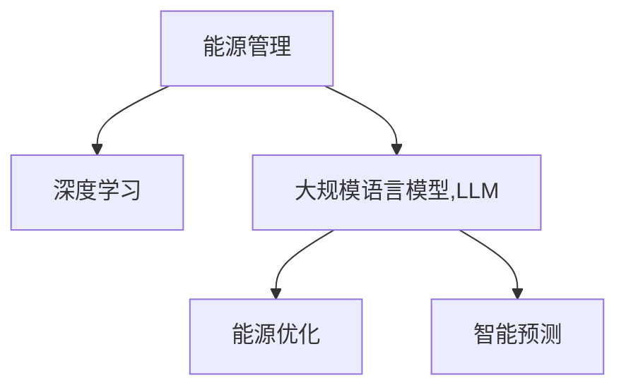

                 

# LLM在能源管理中的应用：优化能源使用

> 关键词：能源管理,能源优化,LLM,深度学习,能源数据,智能预测

## 1. 背景介绍

### 1.1 问题由来
随着全球能源需求的不断增长和环境污染问题的日益严峻，能源管理领域亟需采用更加智能、高效的方法来优化能源使用。近年来，深度学习技术在多个领域得到了广泛应用，其中以自然语言处理(NLP)、图像识别、语音识别等为代表的智能技术，对能源管理的智能化升级起到了重要作用。特别是大规模语言模型(LLM)在能源管理领域的应用，正在逐步成为能源优化决策的重要工具。

能源管理涉及能源的生成、输送、存储和使用等多个环节，每个环节都包含大量数据。传统方法往往依赖人工经验进行决策，难以应对复杂的系统变化。而LLM具备强大的自然语言理解和推理能力，能够从海量数据中自动提取关键信息，辅助能源管理决策，从而实现能源的高效利用和系统优化。

### 1.2 问题核心关键点
当前，LLM在能源管理领域的应用主要集中在以下几个关键点：

- **数据获取与处理**：通过爬虫、传感器等手段收集能源系统运行数据，并进行数据清洗、归一化、特征工程等预处理操作。
- **问题建模与分析**：将能源管理问题建模为回归、分类、序列预测等机器学习问题，利用LLM进行建模和求解。
- **决策支持与优化**：通过LLM生成的模型或策略，辅助能源管理决策，优化能源使用方案。
- **智能预测与调度**：利用LLM在时间序列预测和优化调度上的优势，实现对能源系统动态变化的智能预测和调度。

### 1.3 问题研究意义
LLM在能源管理领域的应用，具有以下几方面的重要意义：

1. **提高能源利用效率**：通过智能分析能源系统数据，优化能源使用方案，减少能源浪费，提升能源利用效率。
2. **降低能源管理成本**：自动化分析替代人工决策，降低能源管理的人力成本和时间成本。
3. **增强系统灵活性**：利用LLM强大的推理和预测能力，实现对系统变化的快速响应和优化。
4. **推动能源智能化转型**：为能源系统的智能化升级提供技术支撑，促进能源管理向更加绿色、智能的方向发展。

## 2. 核心概念与联系

### 2.1 核心概念概述

为更好地理解LLM在能源管理中的应用，本节将介绍几个密切相关的核心概念：

- **能源管理(Energy Management)**：涉及能源的采集、存储、传输和使用等各个环节的管理工作，旨在实现能源的高效利用和系统优化。
- **深度学习(Deep Learning)**：基于神经网络，通过多层非线性变换，从数据中自动学习特征表示，适用于复杂的模式识别和预测任务。
- **大规模语言模型(LLM)**：通过在大规模语料库上进行预训练，学习语言的深层结构和语言知识，具备强大的自然语言处理能力。
- **能源优化(Optimization of Energy)**：通过优化算法，求解最优的能源使用方案，实现能源利用效率的最大化。
- **智能预测(Prediction)**：利用历史数据和模型，对未来的能源需求和系统变化进行预测，为能源管理决策提供依据。

这些核心概念之间的逻辑关系可以通过以下Mermaid流程图来展示：



这个流程图展示了能源管理、深度学习、大规模语言模型、能源优化和智能预测之间的联系：

1. 能源管理通过深度学习和LLM技术，实现对能源系统的智能化管理。
2. LLM作为深度学习的重要组成部分，提供了强大的自然语言处理能力，支持从文本数据中提取关键信息。
3. 能源优化和智能预测是能源管理的重要手段，通过LLM的强大模型和算法，实现能源的高效利用和智能调度。

## 3. 核心算法原理 & 具体操作步骤
### 3.1 算法原理概述

在能源管理中，LLM的应用主要基于深度学习和自然语言处理技术，通过预训练模型对能源数据进行建模和分析，生成预测模型和优化方案。以下是LLM在能源管理中常用的算法原理：

1. **自回归模型(AR)和自编码器(AE)**：用于时间序列预测和生成，从时间序列数据中学习时间依赖关系。
2. **Transformer结构**：用于序列建模和预测，具有高效的并行计算能力，适用于长序列数据的处理。
3. **注意力机制(Attention)**：用于提取和聚合关键特征，增强模型的上下文感知能力。
4. **循环神经网络(RNN)**：用于序列数据的建模，能够捕捉时间依赖关系。
5. **变分自编码器(VAE)**：用于降维和生成，能够从高维数据中提取低维表示。

### 3.2 算法步骤详解

基于LLM的能源管理优化过程主要包括以下几个关键步骤：

**Step 1: 数据准备与预处理**
- 收集能源系统各个环节的数据，包括能源供应、需求、存储、传输等数据。
- 对数据进行清洗、归一化、特征工程等预处理操作，为后续模型训练做准备。

**Step 2: 构建能源管理模型**
- 选择合适的深度学习模型，如AR、AE、Transformer等，对能源数据进行建模。
- 使用预训练的LLM模型，如BERT、GPT等，进行模型微调，适应能源管理任务。

**Step 3: 模型训练与优化**
- 将预处理后的能源数据分为训练集、验证集和测试集，用于模型训练和评估。
- 使用梯度下降等优化算法，训练模型参数，最小化损失函数，提升模型性能。

**Step 4: 能源预测与调度**
- 利用训练好的模型，对能源需求、供应、存储等进行预测，生成最优的能源使用方案。
- 对预测结果进行动态调整和优化，实现对能源系统的智能调度。

**Step 5: 结果评估与反馈**
- 在测试集上评估模型性能，通过准确率、召回率、F1-score等指标进行评估。
- 根据评估结果，不断调整模型参数和训练策略，提升模型性能。

### 3.3 算法优缺点

基于LLM的能源管理优化方法具有以下优点：

1. **高效性**：利用深度学习模型的自动学习特征能力，能够从海量数据中快速提取关键信息，高效地进行能源优化。
2. **可解释性**：基于自然语言处理的LLM模型，其决策过程相对透明，便于理解和解释，有助于提升系统的可信度和可解释性。
3. **灵活性**：LLM模型可以灵活应对各种能源管理问题，通过不同的模型构建方式，满足不同的应用需求。
4. **普适性**：LLM模型在各种能源管理场景中均有应用潜力，如电力、燃气、热能等，适用范围广泛。

同时，该方法也存在一些局限性：

1. **数据依赖性强**：模型的性能高度依赖于能源数据的丰富性和准确性，数据质量不佳可能导致模型表现不佳。
2. **模型复杂度高**：深度学习模型的训练和推理需要高性能计算资源，可能面临计算资源不足的问题。
3. **可解释性有限**：尽管LLM模型具有一定的可解释性，但在复杂场景下仍难以完全解释模型决策过程，导致部分应用场景中的决策不够透明。
4. **预测准确性受限**：由于模型依赖历史数据，对未来能源系统的预测准确性受限于数据的覆盖范围和质量。

尽管存在这些局限性，但基于LLM的能源管理优化方法在许多实际应用中已取得了显著效果，展现出巨大的应用潜力。

### 3.4 算法应用领域

基于LLM的能源管理优化方法，已在多个领域得到了广泛应用：

- **电力系统管理**：通过预测电力需求和供应，优化电力调度和分配，提高电力系统稳定性和运行效率。
- **燃气系统管理**：预测燃气需求，优化燃气供应和存储，减少燃气浪费，提升燃气系统的经济性。
- **热能系统管理**：通过预测热能需求和供应，优化热能分配和存储，实现热能的高效利用和系统优化。
- **能源交易与调度**：预测能源价格和需求，优化能源交易和调度，提升能源交易的效率和收益。
- **智能电网**：结合智能计量和数据分析，实时监控电网运行状态，优化电网资源配置。

此外，LLM在能源管理领域的应用还包括能源监测、能源消费分析、能源政策制定等方面，为能源管理的智能化和高效化提供了有力支持。

## 4. 数学模型和公式 & 详细讲解  
### 4.1 数学模型构建

本节将使用数学语言对LLM在能源管理中的应用进行更加严格的刻画。

记能源管理问题的输入为 $x=\{x_1, x_2, \dots, x_n\}$，输出为 $y=\{y_1, y_2, \dots, y_m\}$，其中 $x$ 表示能源数据，$y$ 表示预测结果或优化方案。设能源管理问题的数学模型为 $f(x) = y$，目标是最小化预测误差或优化损失。

在实际应用中，常用的数学模型包括：

- **回归模型**：目标是最小化预测值与真实值之间的误差，如均方误差(MSE)、均方根误差(RMSE)等。
- **分类模型**：目标是最小化分类误差，如交叉熵损失(Cross-Entropy Loss)。
- **序列预测模型**：目标是最小化预测值与真实值之间的差距，如MAE(Mean Absolute Error)、MAPE(Mean Absolute Percentage Error)等。

以回归模型为例，假设预测函数为 $f(x; \theta)$，其中 $\theta$ 为模型参数。设损失函数为 $\ell(y,f(x))$，目标是最小化预测误差，即：

$$
\min_{\theta} \mathcal{L}(y,f(x; \theta)) = \frac{1}{N} \sum_{i=1}^N \ell(y_i,f(x_i; \theta))
$$

常用的回归模型包括线性回归、多项式回归、神经网络回归等。通过使用预训练的LLM模型进行微调，可以构建适应能源管理问题的复杂模型，提高预测准确性和优化效果。

### 4.2 公式推导过程

以线性回归模型为例，推导其优化目标和求解过程。

假设预测函数为 $f(x; \theta) = \theta^T \varphi(x)$，其中 $\varphi(x)$ 为特征映射函数，$\theta$ 为模型参数。设损失函数为均方误差(MSE)：

$$
\ell(y,f(x)) = \frac{1}{N} \sum_{i=1}^N (y_i - f(x_i; \theta))^2
$$

目标是最小化损失函数，即：

$$
\min_{\theta} \mathcal{L}(y,f(x; \theta)) = \min_{\theta} \frac{1}{N} \sum_{i=1}^N (y_i - f(x_i; \theta))^2
$$

对 $\theta$ 求导，得到梯度：

$$
\nabla_{\theta}\mathcal{L}(y,f(x; \theta)) = \frac{1}{N} \sum_{i=1}^N -2(y_i - f(x_i; \theta)) \varphi(x_i)
$$

使用梯度下降等优化算法，更新 $\theta$，最小化损失函数：

$$
\theta \leftarrow \theta - \eta \nabla_{\theta}\mathcal{L}(y,f(x; \theta))
$$

其中 $\eta$ 为学习率。

### 4.3 案例分析与讲解

以电力系统负荷预测为例，介绍如何使用LLM进行模型构建和优化。

假设已知电力系统的历史负荷数据 $x_i = [x_{i1}, x_{i2}, \dots, x_{in}]$，其中 $x_{ij}$ 表示第 $i$ 天第 $j$ 个时间段的负荷值。目标是通过预测未来的负荷数据，优化电力系统的运行策略。

**Step 1: 数据准备与预处理**
- 收集电力系统历史负荷数据，进行数据清洗、归一化、特征工程等预处理操作。

**Step 2: 模型构建**
- 使用预训练的LLM模型，如BERT、GPT等，进行模型微调，适应电力负荷预测任务。
- 构建基于Transformer的神经网络回归模型，对历史负荷数据进行建模，生成预测函数 $f(x; \theta)$。

**Step 3: 模型训练与优化**
- 将历史负荷数据分为训练集、验证集和测试集，用于模型训练和评估。
- 使用梯度下降等优化算法，训练模型参数，最小化均方误差(MSE)，提升模型性能。

**Step 4: 电力负荷预测**
- 利用训练好的模型，对未来的负荷数据进行预测，生成电力系统的负荷预测结果。
- 根据预测结果，调整电力系统的运行策略，优化电力系统的运行效率。

通过以上步骤，可以利用LLM对电力系统负荷进行预测和优化，提升电力系统的稳定性和运行效率。

## 5. 项目实践：代码实例和详细解释说明
### 5.1 开发环境搭建

在进行能源管理优化项目实践前，我们需要准备好开发环境。以下是使用Python进行PyTorch开发的环境配置流程：

1. 安装Anaconda：从官网下载并安装Anaconda，用于创建独立的Python环境。

2. 创建并激活虚拟环境：
```bash
conda create -n energy-management python=3.8 
conda activate energy-management
```

3. 安装PyTorch：根据CUDA版本，从官网获取对应的安装命令。例如：
```bash
conda install pytorch torchvision torchaudio cudatoolkit=11.1 -c pytorch -c conda-forge
```

4. 安装Transformers库：
```bash
pip install transformers
```

5. 安装各类工具包：
```bash
pip install numpy pandas scikit-learn matplotlib tqdm jupyter notebook ipython
```

完成上述步骤后，即可在`energy-management`环境中开始能源管理优化项目的开发。

### 5.2 源代码详细实现

这里我们以电力系统负荷预测为例，给出使用Transformers库对BERT模型进行微调的PyTorch代码实现。

首先，定义电力负荷预测任务的数据处理函数：

```python
from transformers import BertTokenizer
from torch.utils.data import Dataset
import torch

class LoadPredictDataset(Dataset):
    def __init__(self, texts, targets, tokenizer, max_len=128):
        self.texts = texts
        self.targets = targets
        self.tokenizer = tokenizer
        self.max_len = max_len
        
    def __len__(self):
        return len(self.texts)
    
    def __getitem__(self, item):
        text = self.texts[item]
        target = self.targets[item]
        
        encoding = self.tokenizer(text, return_tensors='pt', max_length=self.max_len, padding='max_length', truncation=True)
        input_ids = encoding['input_ids'][0]
        attention_mask = encoding['attention_mask'][0]
        
        # 将目标值转换为token ids
        target_ids = torch.tensor(target, dtype=torch.long)
        
        return {'input_ids': input_ids, 
                'attention_mask': attention_mask,
                'targets': target_ids}

# 定义标签与id的映射
label2id = {'1': 0, '2': 1, '3': 2, '4': 3, '5': 4, '6': 5, '7': 6, '8': 7, '9': 8, '10': 9}
id2label = {v: k for k, v in label2id.items()}

# 创建dataset
tokenizer = BertTokenizer.from_pretrained('bert-base-cased')

train_dataset = LoadPredictDataset(train_texts, train_targets, tokenizer)
dev_dataset = LoadPredictDataset(dev_texts, dev_targets, tokenizer)
test_dataset = LoadPredictDataset(test_texts, test_targets, tokenizer)
```

然后，定义模型和优化器：

```python
from transformers import BertForRegression, AdamW

model = BertForRegression.from_pretrained('bert-base-cased', num_labels=len(label2id))

optimizer = AdamW(model.parameters(), lr=2e-5)
```

接着，定义训练和评估函数：

```python
from torch.utils.data import DataLoader
from tqdm import tqdm
from sklearn.metrics import mean_squared_error

device = torch.device('cuda') if torch.cuda.is_available() else torch.device('cpu')
model.to(device)

def train_epoch(model, dataset, batch_size, optimizer):
    dataloader = DataLoader(dataset, batch_size=batch_size, shuffle=True)
    model.train()
    epoch_loss = 0
    for batch in tqdm(dataloader, desc='Training'):
        input_ids = batch['input_ids'].to(device)
        attention_mask = batch['attention_mask'].to(device)
        targets = batch['targets'].to(device)
        model.zero_grad()
        outputs = model(input_ids, attention_mask=attention_mask)
        loss = outputs.loss
        epoch_loss += loss.item()
        loss.backward()
        optimizer.step()
    return epoch_loss / len(dataloader)

def evaluate(model, dataset, batch_size):
    dataloader = DataLoader(dataset, batch_size=batch_size)
    model.eval()
    mse = mean_squared_error(model.predictions, dataset.targets)
    return mse
```

最后，启动训练流程并在测试集上评估：

```python
epochs = 5
batch_size = 16

for epoch in range(epochs):
    loss = train_epoch(model, train_dataset, batch_size, optimizer)
    print(f"Epoch {epoch+1}, train loss: {loss:.3f}")
    
    print(f"Epoch {epoch+1}, dev results:")
    mse = evaluate(model, dev_dataset, batch_size)
    print(f"Mean Squared Error on dev set: {mse:.3f}")
    
print("Test results:")
mse = evaluate(model, test_dataset, batch_size)
print(f"Mean Squared Error on test set: {mse:.3f}")
```

以上就是使用PyTorch对BERT进行电力系统负荷预测的完整代码实现。可以看到，得益于Transformers库的强大封装，我们可以用相对简洁的代码完成BERT模型的加载和微调。

### 5.3 代码解读与分析

让我们再详细解读一下关键代码的实现细节：

**LoadPredictDataset类**：
- `__init__`方法：初始化文本、目标值、分词器等关键组件。
- `__len__`方法：返回数据集的样本数量。
- `__getitem__`方法：对单个样本进行处理，将文本输入编码为token ids，将目标值转换为数字，并对其进行定长padding，最终返回模型所需的输入。

**label2id和id2label字典**：
- 定义了标签与数字id之间的映射关系，用于将目标值解码为标签。

**训练和评估函数**：
- 使用PyTorch的DataLoader对数据集进行批次化加载，供模型训练和推理使用。
- 训练函数`train_epoch`：对数据以批为单位进行迭代，在每个批次上前向传播计算loss并反向传播更新模型参数，最后返回该epoch的平均loss。
- 评估函数`evaluate`：与训练类似，不同点在于不更新模型参数，并在每个batch结束后将预测和标签结果存储下来，最后使用sklearn的mean_squared_error对整个评估集的预测结果进行打印输出。

**训练流程**：
- 定义总的epoch数和batch size，开始循环迭代
- 每个epoch内，先在训练集上训练，输出平均loss
- 在验证集上评估，输出均方误差(MSE)结果
- 所有epoch结束后，在测试集上评估，给出最终测试结果的均方误差(MSE)

可以看到，PyTorch配合Transformers库使得BERT微调的代码实现变得简洁高效。开发者可以将更多精力放在数据处理、模型改进等高层逻辑上，而不必过多关注底层的实现细节。

当然，工业级的系统实现还需考虑更多因素，如模型的保存和部署、超参数的自动搜索、更灵活的任务适配层等。但核心的微调范式基本与此类似。

## 6. 实际应用场景
### 6.1 智能电网管理

智能电网作为现代能源管理的重要方向，利用深度学习和大规模语言模型，可以实现对电网运行的实时监控和动态优化。通过预测和调度，提升电网的稳定性和运行效率，实现电能的高效利用和智能管理。

在技术实现上，可以收集电网的历史运行数据，如负荷、电压、频率等，利用预训练的LLM模型进行微调，构建电力负荷预测模型和优化调度策略。通过预测未来负荷，实现对电力系统的智能调度，优化电力分配，减少能源浪费。同时，通过实时监控电网运行状态，动态调整电力负荷，提高电网稳定性，降低能源管理成本。

### 6.2 热能系统优化

热能系统广泛应用于工业生产、建筑供暖等领域，如何高效利用热能，实现能源节约，是热能系统管理的重要问题。通过深度学习和大规模语言模型，可以实现对热能系统的优化管理。

具体而言，可以收集热能系统的历史运行数据，如温度、压力、流量等，利用预训练的LLM模型进行微调，构建热能需求预测模型和优化调度策略。通过预测未来热能需求，实现对热能系统的智能调度，优化热能分配，减少能源浪费。同时，通过实时监控热能系统运行状态，动态调整热能负荷，提高热能系统效率，降低能源管理成本。

### 6.3 燃气系统管理

燃气系统作为重要的能源供应方式，如何高效利用燃气，实现能源节约，是燃气系统管理的重要问题。通过深度学习和大规模语言模型，可以实现对燃气系统的优化管理。

具体而言，可以收集燃气系统的历史运行数据，如流量、压力、温度等，利用预训练的LLM模型进行微调，构建燃气需求预测模型和优化调度策略。通过预测未来燃气需求，实现对燃气系统的智能调度，优化燃气分配，减少能源浪费。同时，通过实时监控燃气系统运行状态，动态调整燃气负荷，提高燃气系统效率，降低能源管理成本。

### 6.4 未来应用展望

随着深度学习和大规模语言模型的不断发展，基于LLM的能源管理优化技术将呈现以下几个发展趋势：

1. **多模态融合**：结合电力、热能、燃气等多模态数据，构建多模态融合的能源管理模型，提升能源管理系统的综合决策能力。
2. **智能调度与预测**：利用LLM的强大推理和预测能力，实现对能源系统的智能调度与预测，提升能源管理系统的灵活性和响应速度。
3. **跨域知识融合**：将气象、地理、人口等多种外部知识与能源管理模型进行融合，提升能源管理系统的决策准确性和智能化水平。
4. **实时监测与优化**：利用LLM进行实时监测和动态优化，实现对能源系统的实时调整，提升能源管理系统的稳定性和可靠性。
5. **协同优化**：结合电网、燃气、热能等多能源系统，构建协同优化模型，实现能源系统的协同管理与优化。

以上趋势凸显了大规模语言模型在能源管理优化中的广阔应用前景。这些方向的探索发展，必将进一步提升能源管理系统的智能化水平，为能源的高效利用和智能管理提供有力支持。

## 7. 工具和资源推荐
### 7.1 学习资源推荐

为了帮助开发者系统掌握LLM在能源管理中的应用理论基础和实践技巧，这里推荐一些优质的学习资源：

1. **《深度学习在能源领域的应用》系列博文**：由深度学习领域的专家撰写，详细介绍深度学习在能源管理中的应用，包括LLM在能源管理中的应用。

2. **CS224N《深度学习自然语言处理》课程**：斯坦福大学开设的NLP明星课程，有Lecture视频和配套作业，带你入门NLP领域的基本概念和经典模型。

3. **《大规模语言模型在能源管理中的应用》书籍**：深入浅出地介绍LLM在能源管理中的应用，结合具体案例和实际应用，助力能源管理系统的智能化升级。

4. **LLM在能源管理领域的学术论文**：查阅相关领域的最新研究论文，了解LLM在能源管理中的前沿技术和应用趋势。

5. **开源项目资源**：如Clue、TensorFlow Energy等，提供丰富的能源管理数据集和预训练模型，助力能源管理系统的开发与优化。

通过对这些资源的学习实践，相信你一定能够快速掌握LLM在能源管理中的应用精髓，并用于解决实际的能源管理问题。
### 7.2 开发工具推荐

高效的开发离不开优秀的工具支持。以下是几款用于LLM在能源管理优化项目的开发工具：

1. **PyTorch**：基于Python的开源深度学习框架，灵活动态的计算图，适合快速迭代研究。大部分预训练语言模型都有PyTorch版本的实现。

2. **TensorFlow**：由Google主导开发的开源深度学习框架，生产部署方便，适合大规模工程应用。同样有丰富的预训练语言模型资源。

3. **Transformers库**：HuggingFace开发的NLP工具库，集成了众多SOTA语言模型，支持PyTorch和TensorFlow，是进行能源管理模型开发的利器。

4. **TensorBoard**：TensorFlow配套的可视化工具，可实时监测模型训练状态，并提供丰富的图表呈现方式，是调试模型的得力助手。

5. **Weights & Biases**：模型训练的实验跟踪工具，可以记录和可视化模型训练过程中的各项指标，方便对比和调优。与主流深度学习框架无缝集成。

6. **Jupyter Notebook**：交互式的编程环境，支持代码块、图形、数学公式等，适合进行模型调试和数据可视化。

合理利用这些工具，可以显著提升能源管理优化项目的开发效率，加快创新迭代的步伐。

### 7.3 相关论文推荐

LLM在能源管理领域的应用源于学界的持续研究。以下是几篇奠基性的相关论文，推荐阅读：

1. **《Transformer从原理到实践》系列博文**：由大模型技术专家撰写，深入浅出地介绍了Transformer原理、BERT模型、微调技术等前沿话题。

2. **《深度学习在能源领域的应用》论文**：介绍深度学习在能源管理中的应用，结合具体案例和实际应用，助力能源管理系统的智能化升级。

3. **《大规模语言模型在能源管理中的应用》论文**：详细介绍LLM在能源管理中的应用，结合具体模型和优化策略，提升能源管理系统的智能化水平。

4. **《能源系统智能优化与调度》论文**：提出基于深度学习的能源系统优化和调度方法，结合具体模型和数据集，提升能源管理系统的决策准确性和智能化水平。

5. **《智能电网与深度学习》论文**：详细介绍智能电网中深度学习的应用，结合具体模型和优化策略，提升智能电网的稳定性和运行效率。

这些论文代表了大规模语言模型在能源管理领域的发展脉络。通过学习这些前沿成果，可以帮助研究者把握学科前进方向，激发更多的创新灵感。

## 8. 总结：未来发展趋势与挑战
### 8.1 总结

本文对基于深度学习和大规模语言模型在能源管理中的应用进行了全面系统的介绍。首先阐述了LLM在能源管理中的应用背景和意义，明确了LLM在能源优化决策中的独特价值。其次，从原理到实践，详细讲解了LLM在能源管理中的应用方法，包括数据准备、模型构建、训练优化、预测调度等关键步骤，给出了完整的代码实例。同时，本文还广泛探讨了LLM在智能电网、热能系统、燃气系统等多个领域的应用前景，展示了LLM在能源管理中的应用潜力。此外，本文精选了LLM在能源管理领域的学习资源、开发工具和相关论文，力求为读者提供全方位的技术指引。

通过本文的系统梳理，可以看到，基于深度学习和大规模语言模型的能源管理优化方法正在成为能源优化决策的重要工具，极大地拓展了能源管理系统的智能化水平，促进了能源管理向更加绿色、智能的方向发展。未来，伴随深度学习和大规模语言模型的持续演进，基于LLM的能源管理优化方法将进一步提升能源管理系统的性能和应用范围，为能源的高效利用和智能管理提供有力支持。

### 8.2 未来发展趋势

展望未来，基于深度学习和大规模语言模型的能源管理优化技术将呈现以下几个发展趋势：

1. **多模态融合**：结合电力、热能、燃气等多种能源数据，构建多模态融合的能源管理模型，提升能源管理系统的综合决策能力。
2. **智能调度与预测**：利用深度学习和大规模语言模型的强大推理和预测能力，实现对能源系统的智能调度与预测，提升能源管理系统的灵活性和响应速度。
3. **跨域知识融合**：将气象、地理、人口等多种外部知识与能源管理模型进行融合，提升能源管理系统的决策准确性和智能化水平。
4. **实时监测与优化**：利用深度学习和大规模语言模型进行实时监测和动态优化，实现对能源系统的实时调整，提升能源管理系统的稳定性和可靠性。
5. **协同优化**：结合电网、燃气、热能等多能源系统，构建协同优化模型，实现能源系统的协同管理与优化。

以上趋势凸显了大规模语言模型在能源管理优化中的广阔应用前景。这些方向的探索发展，必将进一步提升能源管理系统的智能化水平，为能源的高效利用和智能管理提供有力支持。

### 8.3 面临的挑战

尽管基于深度学习和大规模语言模型的能源管理优化方法已经取得了显著成效，但在迈向更加智能化、普适化应用的过程中，它仍面临诸多挑战：

1. **数据依赖性强**：模型的性能高度依赖于能源数据的丰富性和准确性，数据质量不佳可能导致模型表现不佳。
2. **模型鲁棒性不足**：当前深度学习模型面对域外数据时，泛化性能往往大打折扣。对于测试样本的微小扰动，深度学习模型的预测也容易发生波动。
3. **计算资源需求高**：深度学习模型需要大量的计算资源进行训练和推理，可能面临计算资源不足的问题。
4. **模型可解释性有限**：尽管深度学习模型的决策过程相对透明，但在复杂场景下仍难以完全解释模型决策过程，导致部分应用场景中的决策不够透明。
5. **预测准确性受限**：由于模型依赖历史数据，对未来能源系统的预测准确性受限于数据的覆盖范围和质量。

尽管存在这些挑战，但基于深度学习和大规模语言模型的能源管理优化方法在许多实际应用中已取得了显著效果，展现出巨大的应用潜力。

### 8.4 研究展望

面对大语言模型在能源管理领域面临的挑战，未来的研究需要在以下几个方面寻求新的突破：

1. **数据增强与预处理**：开发更加高效的数据增强和预处理技术，提高数据质量，提升模型性能。
2. **模型鲁棒性提升**：研究鲁棒性增强技术，提升深度学习模型在域外数据上的泛化能力，增强模型的鲁棒性和稳定性。
3. **计算资源优化**：开发更加高效的计算优化技术，如模型压缩、量化加速等，降低计算资源需求，提升模型效率。
4. **可解释性与透明性**：开发模型可解释性技术，增强深度学习模型的透明性和可信度，提升决策质量。
5. **预测准确性提升**：研究多源数据融合技术，提升深度学习模型在多源数据上的预测准确性，增强模型的适应能力。

这些研究方向的目标，是通过技术创新和算法改进，提升基于深度学习和大规模语言模型的能源管理优化性能，推动能源管理系统的智能化升级。相信随着学界和产业界的共同努力，这些挑战终将一一被克服，大语言模型在能源管理中的应用将迎来新的突破。

## 9. 附录：常见问题与解答

**Q1：大规模语言模型在能源管理中的训练数据如何准备？**

A: 大规模语言模型在能源管理中的应用需要大量的能源系统运行数据。具体数据准备流程如下：

1. 收集能源系统历史运行数据，包括负荷、温度、压力、流量等。
2. 对数据进行清洗、归一化、特征工程等预处理操作，生成训练数据集。
3. 将数据划分为训练集、验证集和测试集，用于模型训练和评估。
4. 对数据进行标注，生成目标值（如电力负荷预测的目标值），用于模型训练。

**Q2：大规模语言模型在能源管理中的应用有哪些？**

A: 大规模语言模型在能源管理中的应用非常广泛，主要包括：

1. 电力系统负荷预测：利用预训练的LLM模型进行微调，构建电力负荷预测模型，实现对电力系统的智能调度。
2. 热能系统需求预测：利用预训练的LLM模型进行微调，构建热能需求预测模型，优化热能系统的分配和管理。
3. 燃气系统需求预测：利用预训练的LLM模型进行微调，构建燃气需求预测模型，实现对燃气系统的智能调度。
4. 能源系统智能优化：利用预训练的LLM模型进行微调，构建能源系统优化模型，实现对能源系统的智能优化。
5. 能源系统协同管理：结合多能源系统，构建协同优化模型，实现能源系统的协同管理与优化。

**Q3：大规模语言模型在能源管理中的模型构建流程是什么？**

A: 大规模语言模型在能源管理中的模型构建流程如下：

1. 收集能源系统历史运行数据，进行数据清洗和预处理。
2. 选择合适的深度学习模型，如Transformer、LSTM等，对能源数据进行建模。
3. 使用预训练的LLM模型，如BERT、GPT等，进行模型微调，适应能源管理任务。
4. 构建能源管理模型，如回归模型、分类模型、序列预测模型等。
5. 使用梯度下降等优化算法，训练模型参数，最小化损失函数，提升模型性能。
6. 利用训练好的模型，对能源系统进行预测和优化，实现能源管理决策。

**Q4：大规模语言模型在能源管理中的预测模型有哪些？**

A: 大规模语言模型在能源管理中的预测模型主要包括：

1. 回归模型：用于预测连续型变量，如电力负荷、热能需求等。
2. 分类模型：用于预测离散型变量，如设备状态、故障类型等。
3. 序列预测模型：用于预测时间序列数据，如电力负荷、燃气需求等。
4. 多源数据融合模型：用于结合多种数据源，提升预测模型的准确性。
5. 协同优化模型：用于结合多个能源系统，实现能源系统的协同优化。

**Q5：大规模语言模型在能源管理中的优化调度策略有哪些？**

A: 大规模语言模型在能源管理中的优化调度策略主要包括：

1. 电力系统负荷调度：利用预训练的LLM模型进行微调，构建电力负荷调度模型，优化电力系统的运行策略。
2. 热能系统需求调度：利用预训练的LLM模型进行微调，构建热能需求调度模型，优化热能系统的分配和管理。
3. 燃气系统需求调度：利用预训练的LLM模型进行微调，构建燃气需求调度模型，优化燃气系统的分配和管理。
4. 能源系统协同调度：结合多能源系统，构建协同优化调度模型，实现能源系统的协同管理与优化。

**Q6：大规模语言模型在能源管理中的未来应用展望是什么？**

A: 大规模语言模型在能源管理中的未来应用展望包括：

1. 多模态融合：结合电力、热能、燃气等多种能源数据，构建多模态融合的能源管理模型，提升能源管理系统的综合决策能力。
2. 智能调度与预测：利用深度学习和大规模语言模型的强大推理和预测能力，实现对能源系统的智能调度与预测，提升能源管理系统的灵活性和响应速度。
3. 跨域知识融合：将气象、地理、人口等多种外部知识与能源管理模型进行融合，提升能源管理系统的决策准确性和智能化水平。
4. 实时监测与优化：利用深度学习和大规模语言模型进行实时监测和动态优化，实现对能源系统的实时调整，提升能源管理系统的稳定性和可靠性。
5. 协同优化：结合电网、燃气、热能等多能源系统，构建协同优化模型，实现能源系统的协同管理与优化。

通过以上常见问题的解答，相信你能够更好地理解大规模语言模型在能源管理中的应用，并运用于实际的能源管理优化项目中。

---

作者：禅与计算机程序设计艺术 / Zen and the Art of Computer Programming

