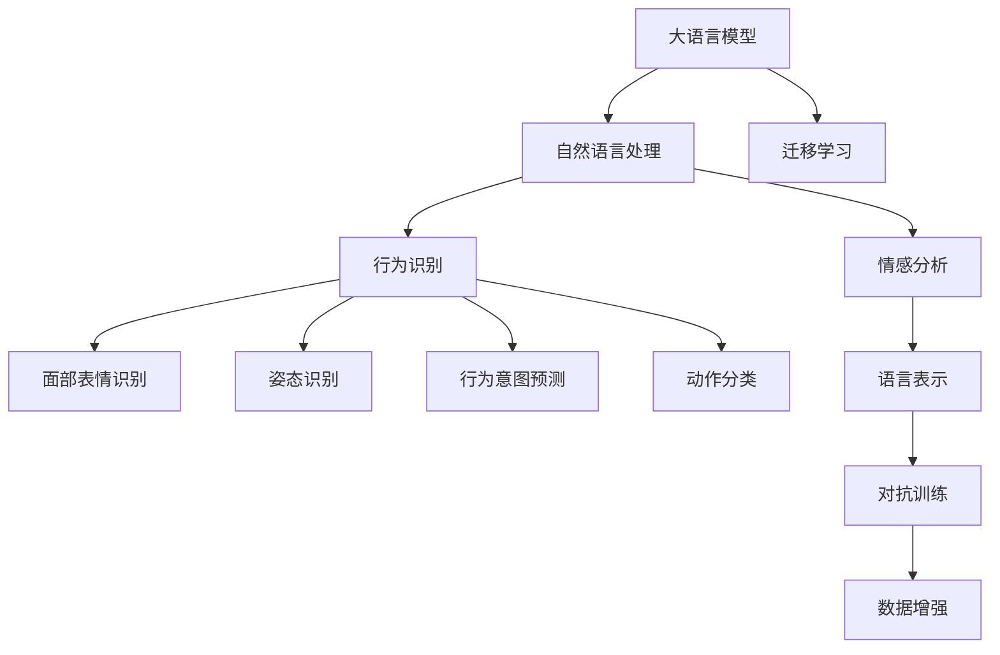

                 

# LLM在行为识别领域的研究新思路

> 关键词：大语言模型(LLM), 行为识别, 行为分析, 自然语言处理(NLP), 人工智能(AI)

## 1. 背景介绍

### 1.1 问题由来
行为识别，即识别和分析个体的行为特征和模式，是心理学、行为学、人工智能等领域的重要研究课题。传统的行为识别方法包括监控录像分析、传感器数据挖掘等，但这些方法依赖于昂贵的设备和高昂的运营成本。随着深度学习和计算机视觉技术的迅速发展，行为识别领域正逐渐向大规模自动化和大数据处理转型。近年来，大语言模型(Large Language Models, LLMs)在自然语言处理(Natural Language Processing, NLP)领域取得了显著的进展，具备了较强的语言理解和生成能力。这使得基于自然语言处理的行为识别方法成为新的研究热点。

### 1.2 问题核心关键点
行为识别涉及多个子领域，包括但不限于面部表情识别、姿态识别、行为意图预测、动作分类等。基于大语言模型的行为识别方法，通过文本描述或指令来引导大语言模型进行行为识别或行为分析，从而为大规模、低成本的行为识别研究提供了新的解决方案。

该方法的优点在于：
1. 低成本、高效率：利用自然语言处理技术，避免了昂贵的设备和高昂的运营成本。
2. 自然语言表示：自然语言是人类最直观的交流方式，可以更自然、更直接地描述行为特征。
3. 高泛化能力：大语言模型经过大规模预训练，具备较强的语言表示能力和泛化能力，可以处理各种不同形式的输入数据。

尽管如此，该方法也存在以下局限性：
1. 缺乏可视化的辅助：大语言模型主要通过自然语言理解和生成，难以直观展示行为特征和模式。
2. 对抗性问题：大语言模型可能受到伪造文本或恶意指令的干扰，导致错误的识别结果。
3. 数据稀疏性：在处理特定领域的行为数据时，可能存在数据稀疏或标注数据不足的问题。

## 2. 核心概念与联系

### 2.1 核心概念概述

为更好地理解大语言模型在行为识别领域的应用，本节将介绍几个密切相关的核心概念：

- 大语言模型(Large Language Model, LLM)：以自回归(如GPT)或自编码(如BERT)模型为代表的大规模预训练语言模型。通过在大规模无标签文本语料上进行预训练，学习通用的语言知识和常识。

- 自然语言处理(Natural Language Processing, NLP)：使用计算机技术处理和分析自然语言，包括文本分类、文本生成、信息抽取、机器翻译等任务。

- 行为识别(Behavior Recognition)：识别和分析个体的行为特征和模式，包括面部表情识别、姿态识别、行为意图预测、动作分类等。

- 迁移学习(Transfer Learning)：指将一个领域学习到的知识，迁移应用到另一个不同但相关的领域的学习范式。大模型的预训练-微调过程即是一种典型的迁移学习方式。

- 对抗训练(Adversarial Training)：指在训练过程中引入对抗样本，提高模型对噪声和攻击的鲁棒性。

- 数据增强(Data Augmentation)：通过一系列变换或数据扩充，增加训练数据的丰富性和多样性，提高模型的泛化能力。

- 情感分析(Sentiment Analysis)：分析文本中蕴含的情感倾向，判断情感极性。

这些核心概念之间的逻辑关系可以通过以下Mermaid流程图来展示：



这个流程图展示了大语言模型在行为识别领域的应用核心概念及其之间的关系：

1. 大语言模型通过预训练获得基础能力。
2. 自然语言处理技术用于文本数据处理和特征提取。
3. 行为识别技术利用自然语言处理技术，识别和分析个体的行为特征和模式。
4. 数据增强和对抗训练等技术用于提升模型的鲁棒性和泛化能力。
5. 迁移学习将大模型迁移到特定领域，提升模型在该领域的表现。

这些概念共同构成了大语言模型在行为识别领域的应用框架，使其能够在各种场景下发挥强大的语言理解和生成能力。通过理解这些核心概念，我们可以更好地把握大语言模型在行为识别领域的工作原理和优化方向。

## 3. 核心算法原理 & 具体操作步骤
### 3.1 算法原理概述

大语言模型在行为识别领域的应用，主要是通过自然语言处理技术将行为数据转换为自然语言描述，然后利用大语言模型进行理解和生成。具体来说，将行为数据转换为自然语言描述的过程包括文本编码、行为描述生成、自然语言理解等步骤。

以下以面部表情识别为例，阐述大语言模型在行为识别中的应用：

1. 文本编码：将行为数据(如面部图像)转换为文本描述，如“某人微笑”、“某人皱眉”等。

2. 行为描述生成：利用自然语言处理技术生成更加详细、具体的行为描述，如“某人微笑并露出牙齿”、“某人皱眉并咬唇”等。

3. 自然语言理解：利用大语言模型对生成的行为描述进行理解和分析，提取行为特征和模式。

4. 行为识别：根据提取的行为特征和模式，进行行为分类和识别。

形式化地，假设行为数据为 $X$，自然语言描述为 $Y$，大语言模型为 $M_{\theta}$，则大语言模型在行为识别任务中的工作流程可以表示为：

$$
Y = M_{\theta}(X)
$$

$$
\hat{B} = M_{\theta}(Y)
$$

其中，$\hat{B}$ 为行为识别结果，$M_{\theta}$ 为预训练大语言模型。

### 3.2 算法步骤详解

大语言模型在行为识别中的应用主要包括以下几个关键步骤：

**Step 1: 数据收集与处理**
- 收集行为数据，如监控录像、传感器数据等。
- 对行为数据进行预处理，如图像裁剪、数据增强等，确保数据质量。

**Step 2: 自然语言描述生成**
- 将行为数据转换为自然语言描述，生成文本输入。
- 利用自然语言处理技术，生成更加详细、具体的行为描述。

**Step 3: 大语言模型预训练与微调**
- 在通用数据集上进行大语言模型的预训练，学习通用的语言知识和常识。
- 将预训练模型微调到特定行为识别任务，如面部表情识别、姿态识别等。

**Step 4: 行为理解与识别**
- 利用大语言模型对行为描述进行理解和分析，提取行为特征和模式。
- 根据提取的行为特征和模式，进行行为分类和识别。

**Step 5: 结果验证与反馈**
- 对行为识别结果进行验证，评估识别准确率和鲁棒性。
- 根据反馈调整模型参数，优化模型性能。

### 3.3 算法优缺点

大语言模型在行为识别领域的应用，具有以下优点：
1. 成本低：利用自然语言处理技术，避免了昂贵的设备和高昂的运营成本。
2. 数据通用性：大语言模型在多个领域进行了预训练，具备较强的数据泛化能力。
3. 易用性：自然语言是人类最直观的交流方式，易于理解和操作。

同时，该方法也存在以下局限性：
1. 数据稀疏性：在特定领域的行为数据可能存在数据稀疏或标注数据不足的问题。
2. 对抗性问题：大语言模型可能受到伪造文本或恶意指令的干扰，导致错误的识别结果。
3. 可视化问题：大语言模型主要通过自然语言理解和生成，难以直观展示行为特征和模式。

尽管存在这些局限性，但就目前而言，大语言模型在行为识别领域仍具有广阔的应用前景。未来相关研究的重点在于如何进一步降低数据稀疏性，提高模型的鲁棒性和可视化能力，同时兼顾自然语言处理的易用性和自然性。

### 3.4 算法应用领域

大语言模型在行为识别领域的应用广泛，可以覆盖多个子领域，例如：

- 面部表情识别：识别个体的面部表情，判断情绪状态。
- 姿态识别：分析个体的身体姿态，识别运动类型。
- 行为意图预测：根据行为数据，预测个体的行为意图。
- 动作分类：识别个体的行为动作，如行走、跳跃、跑步等。

除了上述这些经典任务外，大语言模型在行为识别领域的应用还在不断拓展，如社交行为分析、情感行为识别、动作序列预测等，为行为识别技术带来了新的突破。

## 4. 数学模型和公式 & 详细讲解
### 4.1 数学模型构建

假设大语言模型为 $M_{\theta}$，行为数据为 $X$，自然语言描述为 $Y$，行为识别结果为 $\hat{B}$，则行为识别任务可以形式化表示为：

$$
Y = M_{\theta}(X)
$$

$$
\hat{B} = M_{\theta}(Y)
$$

其中，$M_{\theta}$ 为预训练大语言模型。

### 4.2 公式推导过程

以面部表情识别为例，假设面部图像 $X$ 转换为自然语言描述 $Y$，大语言模型输出行为识别结果 $\hat{B}$，推导如下：

1. 文本编码：假设 $X$ 转换为文本描述 $Y$ 的模型为 $E_{\theta}$，则有：

$$
Y = E_{\theta}(X)
$$

2. 行为描述生成：假设自然语言处理模型 $G_{\phi}$ 生成详细行为描述 $Y'$，则有：

$$
Y' = G_{\phi}(Y)
$$

3. 行为理解与识别：假设大语言模型 $M_{\theta}$ 对行为描述 $Y'$ 进行理解和分析，输出行为识别结果 $\hat{B}$，则有：

$$
\hat{B} = M_{\theta}(Y')
$$

### 4.3 案例分析与讲解

假设一个面部表情识别任务，已知输入为监控录像中的面部图像 $X$，输出为面部表情标签 $\hat{B}$。首先，将面部图像 $X$ 转换为自然语言描述 $Y$，如“某人微笑”。然后，利用自然语言处理模型 $G_{\phi}$ 生成详细行为描述 $Y'$，如“某人微笑并露出牙齿”。最后，利用大语言模型 $M_{\theta}$ 对行为描述 $Y'$ 进行理解和分析，输出面部表情标签 $\hat{B}$，如“微笑”。

具体计算过程如下：

1. 文本编码：将面部图像 $X$ 转换为文本描述 $Y$，如：

$$
Y = E_{\theta}(X)
$$

2. 行为描述生成：利用自然语言处理模型 $G_{\phi}$ 生成详细行为描述 $Y'$，如：

$$
Y' = G_{\phi}(Y)
$$

3. 行为理解与识别：利用大语言模型 $M_{\theta}$ 对行为描述 $Y'$ 进行理解和分析，输出面部表情标签 $\hat{B}$，如：

$$
\hat{B} = M_{\theta}(Y')
$$

## 5. 项目实践：代码实例和详细解释说明
### 5.1 开发环境搭建

在进行面部表情识别任务的大语言模型应用实践前，我们需要准备好开发环境。以下是使用Python进行PyTorch开发的环境配置流程：

1. 安装Anaconda：从官网下载并安装Anaconda，用于创建独立的Python环境。

2. 创建并激活虚拟环境：
```bash
conda create -n pytorch-env python=3.8 
conda activate pytorch-env
```

3. 安装PyTorch：根据CUDA版本，从官网获取对应的安装命令。例如：
```bash
conda install pytorch torchvision torchaudio cudatoolkit=11.1 -c pytorch -c conda-forge
```

4. 安装Natural Language Toolkit (NLTK)：
```bash
pip install nltk
```

5. 安装transformers库：
```bash
pip install transformers
```

6. 安装各类工具包：
```bash
pip install numpy pandas scikit-learn matplotlib tqdm jupyter notebook ipython
```

完成上述步骤后，即可在`pytorch-env`环境中开始面部表情识别任务的大语言模型应用实践。

### 5.2 源代码详细实现

这里我们以面部表情识别任务为例，给出使用PyTorch和transformers库进行面部表情识别的代码实现。

首先，定义面部表情识别任务的数据处理函数：

```python
from transformers import BertTokenizer
from torch.utils.data import Dataset
import torch

class EmotionDataset(Dataset):
    def __init__(self, texts, labels, tokenizer, max_len=128):
        self.texts = texts
        self.labels = labels
        self.tokenizer = tokenizer
        self.max_len = max_len
        
    def __len__(self):
        return len(self.texts)
    
    def __getitem__(self, item):
        text = self.texts[item]
        label = self.labels[item]
        
        encoding = self.tokenizer(text, return_tensors='pt', max_length=self.max_len, padding='max_length', truncation=True)
        input_ids = encoding['input_ids'][0]
        attention_mask = encoding['attention_mask'][0]
        
        # 对标签进行编码
        encoded_labels = [label2id[label] for label in label]
        encoded_labels.extend([label2id['neutral']] * (self.max_len - len(encoded_labels)))
        labels = torch.tensor(encoded_labels, dtype=torch.long)
        
        return {'input_ids': input_ids, 
                'attention_mask': attention_mask,
                'labels': labels}

# 标签与id的映射
label2id = {'happy': 0, 'sad': 1, 'angry': 2, 'neutral': 3, id2label = {v: k for k, v in label2id.items()}}
```

然后，定义模型和优化器：

```python
from transformers import BertForTokenClassification, AdamW

model = BertForTokenClassification.from_pretrained('bert-base-cased', num_labels=len(label2id))

optimizer = AdamW(model.parameters(), lr=2e-5)
```

接着，定义训练和评估函数：

```python
from torch.utils.data import DataLoader
from tqdm import tqdm
from sklearn.metrics import classification_report

device = torch.device('cuda') if torch.cuda.is_available() else torch.device('cpu')
model.to(device)

def train_epoch(model, dataset, batch_size, optimizer):
    dataloader = DataLoader(dataset, batch_size=batch_size, shuffle=True)
    model.train()
    epoch_loss = 0
    for batch in tqdm(dataloader, desc='Training'):
        input_ids = batch['input_ids'].to(device)
        attention_mask = batch['attention_mask'].to(device)
        labels = batch['labels'].to(device)
        model.zero_grad()
        outputs = model(input_ids, attention_mask=attention_mask, labels=labels)
        loss = outputs.loss
        epoch_loss += loss.item()
        loss.backward()
        optimizer.step()
    return epoch_loss / len(dataloader)

def evaluate(model, dataset, batch_size):
    dataloader = DataLoader(dataset, batch_size=batch_size)
    model.eval()
    preds, labels = [], []
    with torch.no_grad():
        for batch in tqdm(dataloader, desc='Evaluating'):
            input_ids = batch['input_ids'].to(device)
            attention_mask = batch['attention_mask'].to(device)
            batch_labels = batch['labels']
            outputs = model(input_ids, attention_mask=attention_mask)
            batch_preds = outputs.logits.argmax(dim=2).to('cpu').tolist()
            batch_labels = batch_labels.to('cpu').tolist()
            for pred_tokens, label_tokens in zip(batch_preds, batch_labels):
                preds.append(pred_tokens[:len(label_tokens)])
                labels.append(label_tokens)
                
    print(classification_report(labels, preds))
```

最后，启动训练流程并在验证集上评估：

```python
epochs = 5
batch_size = 16

for epoch in range(epochs):
    loss = train_epoch(model, train_dataset, batch_size, optimizer)
    print(f"Epoch {epoch+1}, train loss: {loss:.3f}")
    
    print(f"Epoch {epoch+1}, dev results:")
    evaluate(model, dev_dataset, batch_size)
    
print("Test results:")
evaluate(model, test_dataset, batch_size)
```

以上就是使用PyTorch和transformers库进行面部表情识别任务的大语言模型应用实践代码实现。可以看到，得益于transformers库的强大封装，我们可以用相对简洁的代码完成BERT模型的加载和微调。

### 5.3 代码解读与分析

让我们再详细解读一下关键代码的实现细节：

**EmotionDataset类**：
- `__init__`方法：初始化文本、标签、分词器等关键组件。
- `__len__`方法：返回数据集的样本数量。
- `__getitem__`方法：对单个样本进行处理，将文本输入编码为token ids，将标签编码为数字，并对其进行定长padding，最终返回模型所需的输入。

**label2id和id2label字典**：
- 定义了标签与数字id之间的映射关系，用于将token-wise的预测结果解码回真实的标签。

**训练和评估函数**：
- 使用PyTorch的DataLoader对数据集进行批次化加载，供模型训练和推理使用。
- 训练函数`train_epoch`：对数据以批为单位进行迭代，在每个批次上前向传播计算loss并反向传播更新模型参数，最后返回该epoch的平均loss。
- 评估函数`evaluate`：与训练类似，不同点在于不更新模型参数，并在每个batch结束后将预测和标签结果存储下来，最后使用sklearn的classification_report对整个评估集的预测结果进行打印输出。

**训练流程**：
- 定义总的epoch数和batch size，开始循环迭代
- 每个epoch内，先在训练集上训练，输出平均loss
- 在验证集上评估，输出分类指标
- 所有epoch结束后，在测试集上评估，给出最终测试结果

可以看到，PyTorch配合transformers库使得面部表情识别任务的代码实现变得简洁高效。开发者可以将更多精力放在数据处理、模型改进等高层逻辑上，而不必过多关注底层的实现细节。

当然，工业级的系统实现还需考虑更多因素，如模型的保存和部署、超参数的自动搜索、更灵活的任务适配层等。但核心的微调范式基本与此类似。

## 6. 实际应用场景
### 6.1 智能监控系统

基于大语言模型的面部表情识别技术，可以广泛应用于智能监控系统的构建。传统监控系统往往需要耗费大量人力进行视频监控和异常行为分析，而使用大语言模型进行面部表情识别，能够实时监控视频中的行为，自动识别和报警异常行为。

在技术实现上，可以收集监控系统中的视频数据，将视频帧转换为面部图像，将图像转换为自然语言描述，送入大语言模型进行理解和分析，最后输出面部表情标签。对于检测到的异常表情，如微笑、皱眉等，系统自动报警，并生成报警记录，便于后续处理。

### 6.2 心理健康评估

心理健康评估是当前社会亟待解决的重要问题。大语言模型可以用于心理健康的早期识别和评估，帮助心理咨询师及时发现个体的心理健康问题，提供相应的支持和帮助。

在应用中，可以收集个体的社交媒体数据、聊天记录、自述文章等文本数据，将其转换为自然语言描述，送入大语言模型进行理解和分析，识别个体的情绪和心理状态。对于识别到的负面情绪和心理问题，系统自动触发预警，并建议心理咨询师进行跟进。

### 6.3 教育个性化辅导

传统的教育模式往往缺乏对学生行为和情绪的及时了解和分析，难以提供个性化的辅导和支持。基于大语言模型的面部表情识别技术，可以实时监测学生的行为和情绪，为教育系统提供精准的个性化辅导。

在课堂教学中，可以部署大语言模型进行实时面部表情识别，识别学生的情绪状态和学习行为，如困惑、低落、不集中等。系统根据学生的情绪状态和学习行为，自动推送相应的教学资源和辅导方案，提供个性化的学习支持。

### 6.4 未来应用展望

随着大语言模型和面部表情识别技术的不断发展，基于微调范式将在更多领域得到应用，为传统行业带来变革性影响。

在智慧城市治理中，基于大语言模型的面部表情识别技术可以用于城市事件监测、舆情分析、应急指挥等环节，提高城市管理的自动化和智能化水平，构建更安全、高效的未来城市。

在娱乐行业，大语言模型可以用于影视剧情感分析、游戏行为监测等场景，提升用户体验和互动性。

此外，在企业生产、医疗健康、金融安全等众多领域，基于大语言模型的面部表情识别技术也将不断拓展，为各行各业带来新的技术革新和应用场景。相信随着技术的日益成熟，微调方法将成为大语言模型在行为识别领域的重要范式，推动人工智能技术在更多垂直行业的落地应用。

## 7. 工具和资源推荐
### 7.1 学习资源推荐

为了帮助开发者系统掌握大语言模型在行为识别领域的应用，这里推荐一些优质的学习资源：

1. 《Transformer from Understanding to Practice》系列博文：由大模型技术专家撰写，深入浅出地介绍了Transformer原理、BERT模型、微调技术等前沿话题。

2. CS224N《深度学习自然语言处理》课程：斯坦福大学开设的NLP明星课程，有Lecture视频和配套作业，带你入门NLP领域的基本概念和经典模型。

3. 《Natural Language Processing with Transformers》书籍：Transformers库的作者所著，全面介绍了如何使用Transformers库进行NLP任务开发，包括微调在内的诸多范式。

4. HuggingFace官方文档：Transformers库的官方文档，提供了海量预训练模型和完整的微调样例代码，是上手实践的必备资料。

5. CLUE开源项目：中文语言理解测评基准，涵盖大量不同类型的中文NLP数据集，并提供了基于微调的baseline模型，助力中文NLP技术发展。

通过对这些资源的学习实践，相信你一定能够快速掌握大语言模型在行为识别领域的应用精髓，并用于解决实际的NLP问题。
###  7.2 开发工具推荐

高效的开发离不开优秀的工具支持。以下是几款用于面部表情识别任务的大语言模型应用开发的常用工具：

1. PyTorch：基于Python的开源深度学习框架，灵活动态的计算图，适合快速迭代研究。大部分预训练语言模型都有PyTorch版本的实现。

2. TensorFlow：由Google主导开发的开源深度学习框架，生产部署方便，适合大规模工程应用。同样有丰富的预训练语言模型资源。

3. Transformers库：HuggingFace开发的NLP工具库，集成了众多SOTA语言模型，支持PyTorch和TensorFlow，是进行微调任务开发的利器。

4. Weights & Biases：模型训练的实验跟踪工具，可以记录和可视化模型训练过程中的各项指标，方便对比和调优。与主流深度学习框架无缝集成。

5. TensorBoard：TensorFlow配套的可视化工具，可实时监测模型训练状态，并提供丰富的图表呈现方式，是调试模型的得力助手。

6. Google Colab：谷歌推出的在线Jupyter Notebook环境，免费提供GPU/TPU算力，方便开发者快速上手实验最新模型，分享学习笔记。

合理利用这些工具，可以显著提升大语言模型在面部表情识别任务中的应用开发效率，加快创新迭代的步伐。

### 7.3 相关论文推荐

大语言模型在面部表情识别领域的应用源于学界的持续研究。以下是几篇奠基性的相关论文，推荐阅读：

1. Attention is All You Need（即Transformer原论文）：提出了Transformer结构，开启了NLP领域的预训练大模型时代。

2. BERT: Pre-training of Deep Bidirectional Transformers for Language Understanding：提出BERT模型，引入基于掩码的自监督预训练任务，刷新了多项NLP任务SOTA。

3. Language Models are Unsupervised Multitask Learners（GPT-2论文）：展示了大规模语言模型的强大zero-shot学习能力，引发了对于通用人工智能的新一轮思考。

4. Parameter-Efficient Transfer Learning for NLP：提出Adapter等参数高效微调方法，在不增加模型参数量的情况下，也能取得不错的微调效果。

5. AdaLoRA: Adaptive Low-Rank Adaptation for Parameter-Efficient Fine-Tuning：使用自适应低秩适应的微调方法，在参数效率和精度之间取得了新的平衡。

这些论文代表了大语言模型在面部表情识别领域的研究方向。通过学习这些前沿成果，可以帮助研究者把握学科前进方向，激发更多的创新灵感。

## 8. 总结：未来发展趋势与挑战

### 8.1 总结

本文对大语言模型在面部表情识别领域的应用进行了全面系统的介绍。首先阐述了面部表情识别技术的研究背景和意义，明确了基于大语言模型的行为识别方法的优势和局限性。其次，从原理到实践，详细讲解了大语言模型在面部表情识别中的应用流程，给出了微调任务开发的完整代码实例。同时，本文还广泛探讨了面部表情识别技术在智能监控、心理健康评估、教育个性化辅导等多个行业领域的应用前景，展示了微调范式的巨大潜力。此外，本文精选了面部表情识别技术的各类学习资源，力求为开发者提供全方位的技术指引。

通过本文的系统梳理，可以看到，基于大语言模型的面部表情识别技术正逐渐成为NLP领域的新热门话题，为大规模、低成本的行为识别研究提供了新的解决方案。得益于自然语言处理技术的强大支持，大语言模型有望在更多领域带来新的突破，为NLP技术的应用开拓新的天地。

### 8.2 未来发展趋势

展望未来，大语言模型在面部表情识别领域的应用将呈现以下几个发展趋势：

1. 模型规模持续增大。随着算力成本的下降和数据规模的扩张，预训练语言模型的参数量还将持续增长。超大规模语言模型蕴含的丰富语言知识，有望支撑更加复杂多变的面部表情识别任务。

2. 微调方法日趋多样。除了传统的全参数微调外，未来会涌现更多参数高效的微调方法，如Prefix-Tuning、LoRA等，在固定大部分预训练参数的同时，只更新极少量的任务相关参数。同时优化微调模型的计算图，减少前向传播和反向传播的资源消耗，实现更加轻量级、实时性的部署。

3. 持续学习成为常态。随着数据分布的不断变化，微调模型也需要持续学习新知识以保持性能。如何在不遗忘原有知识的同时，高效吸收新样本信息，将成为重要的研究课题。

4. 标注样本需求降低。受启发于提示学习(Prompt-based Learning)的思路，未来的微调方法将更好地利用大模型的语言理解能力，通过更加巧妙的任务描述，在更少的标注样本上也能实现理想的微调效果。

5. 对抗性问题缓解。引入对抗样本和对抗训练，提高模型对噪声和攻击的鲁棒性，确保面部表情识别的准确性和安全性。

6. 可视化能力增强。利用可视化工具和增强技术，提升面部表情识别的可视化和可解释性，增强用户信任和满意度。

以上趋势凸显了大语言模型在面部表情识别领域的应用前景。这些方向的探索发展，必将进一步提升面部表情识别系统的性能和应用范围，为NLP技术的应用开拓新的天地。

### 8.3 面临的挑战

尽管大语言模型在面部表情识别领域的应用已经取得了一定的成果，但在迈向更加智能化、普适化应用的过程中，它仍面临着诸多挑战：

1. 数据稀疏性：在特定领域的行为数据可能存在数据稀疏或标注数据不足的问题，如何扩大数据量、提升数据质量，仍是重大难题。

2. 对抗性问题：大语言模型可能受到伪造文本或恶意指令的干扰，导致错误的识别结果。如何增强模型的鲁棒性，避免误报和漏报，仍然是一个重要研究方向。

3. 可视化问题：大语言模型主要通过自然语言理解和生成，难以直观展示面部表情特征和模式。如何增强面部表情识别的可视化和可解释性，将是未来的研究重点。

4. 多模态融合：面部表情识别不仅仅是文本理解问题，还涉及视觉、语音等多模态数据的融合，如何实现多模态数据的有效整合，是未来的一大挑战。

5. 计算效率：超大规模面部表情识别任务可能面临计算资源不足的问题，如何优化计算图和模型结构，提高模型训练和推理的效率，是未来的一个重要研究方向。

6. 伦理与安全：面部表情识别技术的应用可能涉及用户隐私和伦理问题，如何确保数据安全和用户隐私保护，避免误用和滥用，是未来必须考虑的关键问题。

这些挑战需要通过更多的研究和实践不断攻克，才能使大语言模型在面部表情识别领域发挥其最大的潜力。

### 8.4 研究展望

未来，在大语言模型在面部表情识别领域的研究，可以从以下几个方面进行深入探索：

1. 探索无监督和半监督微调方法。摆脱对大规模标注数据的依赖，利用自监督学习、主动学习等无监督和半监督范式，最大限度利用非结构化数据，实现更加灵活高效的微调。

2. 研究参数高效和计算高效的微调范式。开发更加参数高效的微调方法，在固定大部分预训练参数的同时，只更新极少量的任务相关参数。同时优化微调模型的计算图，减少前向传播和反向传播的资源消耗，实现更加轻量级、实时性的部署。

3. 引入因果分析和博弈论工具。将因果分析方法引入微调模型，识别出模型决策的关键特征，增强输出解释的因果性和逻辑性。借助博弈论工具刻画人机交互过程，主动探索并规避模型的脆弱点，提高系统稳定性。

4. 结合知识图谱和逻辑规则。将符号化的先验知识，如知识图谱、逻辑规则等，与神经网络模型进行巧妙融合，引导微调过程学习更准确、合理的语言模型。同时加强不同模态数据的整合，实现视觉、语音等多模态信息与文本信息的协同建模。

5. 纳入伦理道德约束。在模型训练目标中引入伦理导向的评估指标，过滤和惩罚有偏见、有害的输出倾向。同时加强人工干预和审核，建立模型行为的监管机制，确保输出符合人类价值观和伦理道德。

这些研究方向将推动大语言模型在面部表情识别领域的技术进步，实现更加智能化、普适化、可靠性的应用。相信随着学界和产业界的共同努力，大语言模型在面部表情识别领域必将成为变革性的力量，为人类行为分析提供新的视角和工具。

## 9. 附录：常见问题与解答

**Q1：大语言模型在面部表情识别中面临哪些挑战？**

A: 大语言模型在面部表情识别中面临以下挑战：

1. 数据稀疏性：特定领域的行为数据可能存在数据稀疏或标注数据不足的问题，难以获得高质量的训练样本。

2. 对抗性问题：大语言模型可能受到伪造文本或恶意指令的干扰，导致错误的识别结果。

3. 可视化问题：大语言模型主要通过自然语言理解和生成，难以直观展示面部表情特征和模式。

4. 多模态融合：面部表情识别不仅仅是文本理解问题，还涉及视觉、语音等多模态数据的融合，如何实现多模态数据的有效整合，是未来的一大挑战。

5. 计算效率：超大规模面部表情识别任务可能面临计算资源不足的问题，如何优化计算图和模型结构，提高模型训练和推理的效率，是未来的一个重要研究方向。

6. 伦理与安全：面部表情识别技术的应用可能涉及用户隐私和伦理问题，如何确保数据安全和用户隐私保护，避免误用和滥用，是未来必须考虑的关键问题。

**Q2：如何缓解大语言模型在面部表情识别中的对抗性问题？**

A: 缓解大语言模型在面部表情识别中的对抗性问题，可以采取以下措施：

1. 对抗训练：在训练过程中引入对抗样本，提高模型对噪声和攻击的鲁棒性。

2. 数据增强：通过一系列变换或数据扩充，增加训练数据的丰富性和多样性，提高模型的泛化能力。

3. 特征提取：利用特征提取技术，提取更加稳定、鲁棒的面部表情特征，减少对抗样本的影响。

4. 模型解释：利用可视化工具和解释技术，分析模型决策过程，识别模型的脆弱点，并针对性地进行优化。

5. 用户监督：利用用户反馈和人工标注，及时发现和纠正对抗样本的误识别结果，增强模型的鲁棒性。

通过以上措施，可以有效地缓解大语言模型在面部表情识别中的对抗性问题，提高模型的识别准确性和安全性。

**Q3：大语言模型在面部表情识别中的可视化问题如何缓解？**

A: 缓解大语言模型在面部表情识别中的可视化问题，可以采取以下措施：

1. 可视化技术：利用可视化工具和增强技术，增强面部表情识别的可视化和可解释性，如热力图、轮廓图等。

2. 图像处理：对输入的面部图像进行预处理，增强面部特征的清晰度和区分度，提高识别的准确性。

3. 多模态融合：将面部表情识别与视频分析、语音分析等多模态数据融合，提供更全面、更准确的行为理解。

4. 特征提取：利用特征提取技术，提取更加稳定、鲁棒的面部表情特征，减少对抗样本的影响。

5. 模型解释：利用可视化工具和解释技术，分析模型决策过程，识别模型的脆弱点，并针对性地进行优化。

通过以上措施，可以有效地缓解大语言模型在面部表情识别中的可视化问题，增强用户信任和满意度，提升系统的实用性和可靠性。

**Q4：如何在大语言模型面部表情识别中实现参数高效微调？**

A: 实现大语言模型面部表情识别的参数高效微调，可以采取以下措施：

1. Adapter方法：在模型顶部添加Adapter层，只微调这些适配器层，保留大部分预训练权重不变。

2. Prefix-Tuning：利用基于连续型Prompt的微调范式，通过精心设计的输入文本格式，引导模型按期望方式输出，减少微调参数。

3. LoRA方法：利用低秩分解技术，在固定大部分预训练参数的情况下，只微调小部分的低秩分解矩阵，实现参数高效的微调。

4. 集成学习：通过将多个微调模型集成，提高模型的鲁棒性和泛化能力。

5. 迁移学习：利用预训练大模型的知识，减少微调任务的训练时间和计算资源。

通过以上措施，可以有效地实现大语言模型面部表情识别的参数高效微调，提高微调效率，减少对标注数据的依赖，增强模型的泛化能力。

---

作者：禅与计算机程序设计艺术 / Zen and the Art of Computer Programming

