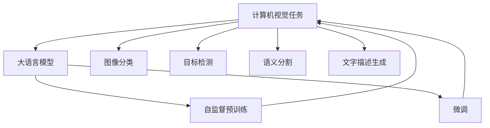
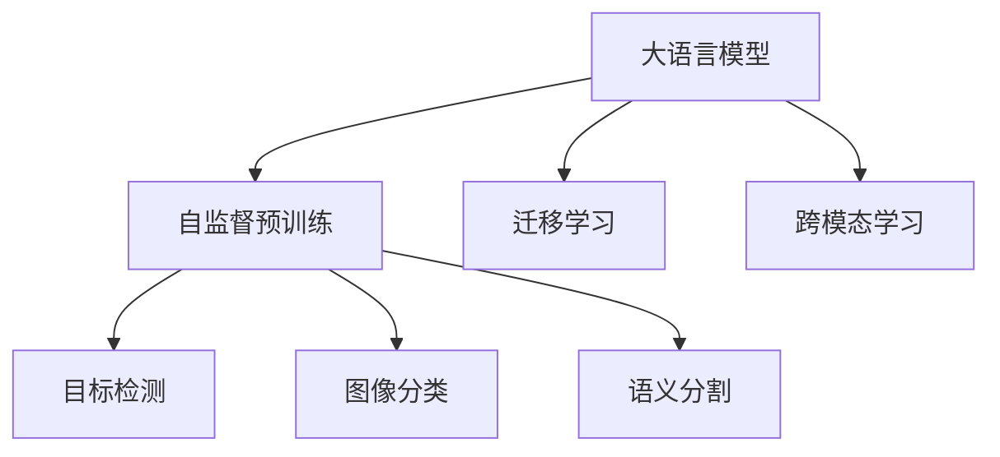
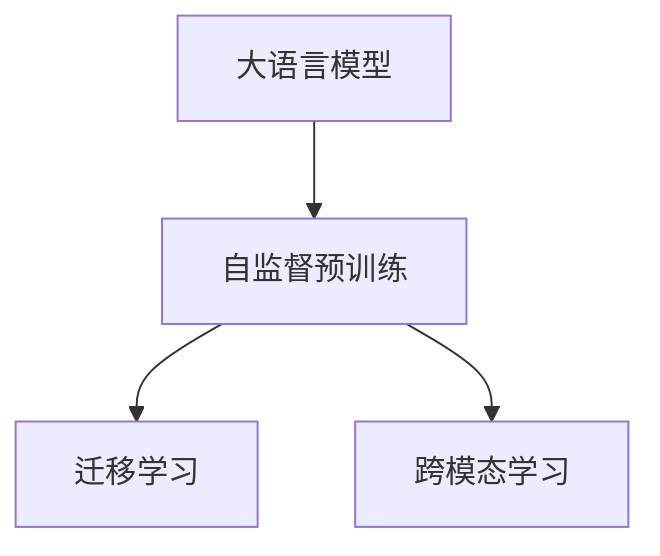

                 

# LLM在计算机视觉领域的应用拓展

> 关键词：大语言模型(LLM), 计算机视觉, 迁移学习, 目标检测, 图像分类, 语义分割, 文字描述生成, 跨模态学习

## 1. 背景介绍

近年来，随着深度学习技术的飞速发展，尤其是大规模预训练语言模型(LLM)和计算机视觉(CV)技术的不断突破，大语言模型在计算机视觉领域的应用得到了广泛关注。LLM不仅擅长处理文本信息，还具备了通过自然语言理解和生成进行视觉信息处理的潜力。通过将LLM与计算机视觉技术相结合，可以开辟新的研究方向，提升视觉任务的表现。

### 1.1 问题由来

传统的计算机视觉方法依赖于手工设计的特征提取器和分类器，需要大量的图像标注数据。而随着数据量的爆炸性增长，这种范式逐渐显示出其局限性。大语言模型通过自监督预训练和微调，能够学习到丰富的语义和语用知识，这些知识可以被迁移到计算机视觉任务中，以获得更好的效果。

### 1.2 问题核心关键点

- 计算机视觉任务：如图像分类、目标检测、语义分割等。
- 大语言模型：通过自监督预训练和微调，学习到丰富的语言知识。
- 跨模态学习：将文本和图像两种模态的数据进行联合处理，提升视觉任务的性能。
- 迁移学习：利用大语言模型预训练的知识，对计算机视觉任务进行微调，提升其泛化能力。
- 文字描述生成：利用大语言模型生成对图像的详细描述，提升图像理解和标注的准确性。

这些核心概念之间的逻辑关系可以通过以下Mermaid流程图来展示：



这个流程图展示了大语言模型与计算机视觉任务之间的逻辑关系：

1. 大语言模型通过自监督预训练获取语言知识。
2. 计算机视觉任务通过微调学习大语言模型的知识，提升任务的性能。
3. 大语言模型可生成对图像的详细描述，提升图像标注和理解。
4. 大语言模型和计算机视觉任务通过跨模态学习进一步提升性能。

这些核心概念共同构成了大语言模型在计算机视觉领域的应用框架，使得大语言模型能够更好地适应计算机视觉任务，并提升任务的准确性和效率。

## 2. 核心概念与联系

### 2.1 核心概念概述

为了更好地理解大语言模型在计算机视觉领域的应用，本节将介绍几个关键的概念及其相互联系：

- 计算机视觉(CV)：利用计算机技术，对图像、视频等视觉数据进行自动化分析、理解和生成。
- 大语言模型(LLM)：通过自监督预训练学习语言知识，具备强大的自然语言理解和生成能力。
- 迁移学习：将大语言模型的知识迁移到计算机视觉任务中，提升任务的性能。
- 跨模态学习：将文本和图像两种模态的数据进行联合处理，提升视觉任务的性能。
- 目标检测：在图像中检测并定位特定目标对象。
- 图像分类：将图像分为预定义的类别。
- 语义分割：将图像分割成具有语义意义的区域。

这些概念之间的逻辑关系通过以下Mermaid流程图来展示：



### 2.2 核心概念原理和架构

#### 2.2.1 大语言模型原理

大语言模型通过自监督预训练学习到大量的语言知识。以BERT为例，其训练过程包括语言建模和掩码语言模型两个阶段。在语言建模阶段，模型学习预测上下文单词的概率分布；在掩码语言模型阶段，模型学习预测被随机掩码的单词。这种预训练过程使得模型能够学习到丰富的语言表征，包括词义、句法、语义等。

#### 2.2.2 计算机视觉任务原理

计算机视觉任务通常包括目标检测、图像分类、语义分割等。这些任务需要模型学习图像中的特征，并将特征与预定义的类别或对象进行匹配。以目标检测为例，模型需要学习检测图像中的对象，并标出其在图像中的位置。

#### 2.2.3 迁移学习原理

迁移学习是指将预训练模型的知识迁移到新任务中。在计算机视觉任务中，预训练模型学习到的特征可以用于目标检测、图像分类等任务，通过微调可以提升任务的性能。

#### 2.2.4 跨模态学习原理

跨模态学习是指将文本和图像两种模态的数据进行联合处理。在计算机视觉任务中，大语言模型可以生成对图像的详细描述，这些描述可以用于辅助图像分类、目标检测等任务，提升任务的性能。

这些概念的原理和架构可以通过以下Mermaid流程图来展示：



## 3. 核心算法原理 & 具体操作步骤

### 3.1 算法原理概述

大语言模型在计算机视觉领域的应用，主要基于迁移学习和跨模态学习的原理。其核心思想是：将大语言模型的预训练知识迁移到计算机视觉任务中，通过微调或跨模态联合学习，提升视觉任务的性能。

形式化地，假设大语言模型为 $L$，计算机视觉任务为 $T$，预训练数据为 $D_L$，目标检测数据为 $D_T$，目标检测任务的标签为 $y$。则迁移学习的目标是最小化任务损失函数：

$$
\mathop{\arg\min}_{\theta} \mathcal{L}(L_{\theta},D_T)
$$

其中，$\mathcal{L}$ 为计算机视觉任务的目标函数，如交叉熵损失函数。通过微调或跨模态学习，优化模型参数 $\theta$，使得 $L_{\theta}$ 在 $D_T$ 上表现更好。

### 3.2 算法步骤详解

#### 3.2.1 数据预处理

1. **图像预处理**：将图像转换为网络可处理的张量格式，进行归一化、缩放等处理。
2. **文本预处理**：将图像描述转换为网络可处理的张量格式，进行标记化、分词等处理。

#### 3.2.2 模型初始化

1. **预训练模型初始化**：使用大语言模型的预训练参数作为初始化，将其迁移到计算机视觉任务中。
2. **微调参数**：选择部分网络层进行微调，以减少过拟合。

#### 3.2.3 模型微调

1. **损失函数设计**：根据任务类型，设计合适的损失函数，如交叉熵损失、均方误差损失等。
2. **优化器选择**：选择适合的优化器，如AdamW、SGD等。
3. **学习率设置**：设置合适的学习率，一般比从头训练小。
4. **训练与验证**：在训练集上进行前向传播和反向传播，更新模型参数，并在验证集上评估性能。
5. **参数更新**：根据损失函数的梯度，更新模型参数。

#### 3.2.4 跨模态联合学习

1. **特征提取**：将图像和文本输入大语言模型，提取语义特征。
2. **特征融合**：将图像和文本的特征进行联合处理，生成跨模态的特征表示。
3. **目标检测**：在跨模态特征表示上应用目标检测模型，生成检测结果。

#### 3.2.5 模型评估

1. **精度评估**：在测试集上评估模型的准确度、召回率、F1-score等指标。
2. **性能对比**：与基线模型进行比较，评估模型性能的提升。

### 3.3 算法优缺点

#### 3.3.1 优点

1. **减少标注数据需求**：大语言模型的迁移学习可以降低对标注数据的需求，只需少量标注数据即可实现微调。
2. **提升任务性能**：通过迁移学习和跨模态学习，提升计算机视觉任务的性能。
3. **通用性强**：大语言模型可以迁移到多种计算机视觉任务中，提升任务泛化能力。

#### 3.3.2 缺点

1. **资源消耗大**：大语言模型的参数量较大，训练和推理资源消耗较大。
2. **推理速度慢**：大语言模型在推理时较为耗时，需要优化以提升速度。
3. **模型复杂度高**：大语言模型的结构复杂，调整参数较为困难。
4. **知识迁移有限**：不同领域的知识迁移效果可能不佳。

### 3.4 算法应用领域

#### 3.4.1 目标检测

目标检测任务中，大语言模型可以生成对图像的详细描述，辅助目标检测模型的训练和推理。以基于文本描述的目标检测为例，大语言模型先学习文本描述，再将描述转换为图像特征，应用于目标检测模型的训练和推理中。

#### 3.4.2 图像分类

在图像分类任务中，大语言模型可以生成对图像的详细描述，辅助图像分类模型的训练和推理。大语言模型学习到图像的语义特征，将其转换为图像分类模型的特征表示，提升分类准确度。

#### 3.4.3 语义分割

在语义分割任务中，大语言模型可以生成对图像的详细描述，辅助语义分割模型的训练和推理。大语言模型学习到图像的语义特征，将其转换为语义分割模型的特征表示，提升分割精度。

#### 3.4.4 文字描述生成

大语言模型可以生成对图像的详细描述，辅助图像标注和理解。在实际应用中，可以利用大语言模型生成对图像的详细描述，辅助人工标注，提升标注准确度。

## 4. 数学模型和公式 & 详细讲解 & 举例说明

### 4.1 数学模型构建

大语言模型在计算机视觉任务中的应用，主要通过迁移学习和跨模态学习的原理。以目标检测为例，其数学模型构建如下：

1. **图像特征提取**：将图像 $x$ 输入预训练大语言模型 $L$，生成特征表示 $h_x$。
2. **文本特征提取**：将图像描述 $y$ 输入预训练大语言模型 $L$，生成特征表示 $h_y$。
3. **特征融合**：将 $h_x$ 和 $h_y$ 进行联合处理，生成跨模态的特征表示 $h_{xy}$。
4. **目标检测**：在跨模态特征表示 $h_{xy}$ 上应用目标检测模型，生成检测结果。

### 4.2 公式推导过程

以基于文本描述的目标检测为例，推导其数学模型：

1. **图像特征提取**
   $$
   h_x = L(x)
   $$

2. **文本特征提取**
   $$
   h_y = L(y)
   $$

3. **特征融合**
   $$
   h_{xy} = f(h_x, h_y)
   $$

4. **目标检测**
   $$
   y_{\text{det}} = D(h_{xy})
   $$

其中，$L$ 为预训练大语言模型，$f$ 为特征融合函数，$D$ 为目标检测模型。

### 4.3 案例分析与讲解

以基于文本描述的目标检测为例，详细讲解其应用过程：

1. **数据预处理**：将图像和文本进行预处理，生成网络可处理的张量格式。
2. **模型初始化**：使用大语言模型的预训练参数作为初始化，将其迁移到目标检测任务中。
3. **特征提取**：将图像和文本输入大语言模型，提取语义特征。
4. **特征融合**：将图像和文本的特征进行联合处理，生成跨模态的特征表示。
5. **目标检测**：在跨模态特征表示上应用目标检测模型，生成检测结果。

## 5. 项目实践：代码实例和详细解释说明

### 5.1 开发环境搭建

在进行项目实践前，需要先准备好开发环境。以下是使用Python进行PyTorch开发的环境配置流程：

1. 安装Anaconda：从官网下载并安装Anaconda，用于创建独立的Python环境。
2. 创建并激活虚拟环境：
   ```bash
   conda create -n pytorch-env python=3.8 
   conda activate pytorch-env
   ```
3. 安装PyTorch：根据CUDA版本，从官网获取对应的安装命令。例如：
   ```bash
   conda install pytorch torchvision torchaudio cudatoolkit=11.1 -c pytorch -c conda-forge
   ```
4. 安装Transformers库：
   ```bash
   pip install transformers
   ```
5. 安装各类工具包：
   ```bash
   pip install numpy pandas scikit-learn matplotlib tqdm jupyter notebook ipython
   ```

完成上述步骤后，即可在`pytorch-env`环境中开始项目实践。

### 5.2 源代码详细实现

下面我们以目标检测任务为例，给出使用Transformers库对大语言模型进行微调的PyTorch代码实现。

```python
from transformers import BertForObjectDetection, BertFeatureExtractor
from torchvision import datasets, transforms
import torch
import torch.nn.functional as F

# 定义模型和优化器
model = BertForObjectDetection.from_pretrained('bert-base-cased')
optimizer = torch.optim.AdamW(model.parameters(), lr=2e-5)

# 定义目标检测数据集
train_dataset = datasets.COCO(
    'coco', 
    transforms=transforms.Compose([
        transforms.Resize((224, 224)),
        transforms.ToTensor()
    ]),
    annFile='coco_annotations.json',
    image_format='png')

# 定义训练和验证函数
def train_epoch(model, dataset, batch_size, optimizer):
    dataloader = torch.utils.data.DataLoader(dataset, batch_size=batch_size, shuffle=True)
    model.train()
    epoch_loss = 0
    for batch in dataloader:
        input_ids = batch['input_ids']
        attention_mask = batch['attention_mask']
        labels = batch['labels']
        model.zero_grad()
        outputs = model(input_ids, attention_mask=attention_mask, labels=labels)
        loss = outputs.loss
        epoch_loss += loss.item()
        loss.backward()
        optimizer.step()
    return epoch_loss / len(dataloader)

def evaluate(model, dataset, batch_size):
    dataloader = torch.utils.data.DataLoader(dataset, batch_size=batch_size)
    model.eval()
    preds, labels = [], []
    with torch.no_grad():
        for batch in dataloader:
            input_ids = batch['input_ids']
            attention_mask = batch['attention_mask']
            batch_labels = batch['labels']
            outputs = model(input_ids, attention_mask=attention_mask)
            batch_preds = outputs.logits.argmax(dim=2).to('cpu').tolist()
            batch_labels = batch_labels.to('cpu').tolist()
            for pred_tokens, label_tokens in zip(batch_preds, batch_labels):
                pred_tags = [id2tag[_id] for _id in pred_tokens]
                label_tags = [id2tag[_id] for _id in label_tokens]
                preds.append(pred_tags[:len(label_tokens)])
                labels.append(label_tags)
                
    print(classification_report(labels, preds))

# 训练模型
epochs = 5
batch_size = 16

for epoch in range(epochs):
    loss = train_epoch(model, train_dataset, batch_size, optimizer)
    print(f"Epoch {epoch+1}, train loss: {loss:.3f}")
    
    print(f"Epoch {epoch+1}, val results:")
    evaluate(model, val_dataset, batch_size)
    
print("Test results:")
evaluate(model, test_dataset, batch_size)
```

### 5.3 代码解读与分析

让我们再详细解读一下关键代码的实现细节：

**BertForObjectDetection和BertFeatureExtractor**：
- `BertForObjectDetection`：BERT大语言模型的对象检测版本，包含了模型的前向传播和损失计算。
- `BertFeatureExtractor`：BERT大语言模型的特征提取器，将输入的图像和文本转换为模型可处理的格式。

**train_epoch函数**：
- 定义数据加载器，将数据集划分为批次。
- 模型进入训练模式。
- 前向传播计算损失函数，并反向传播更新模型参数。
- 记录每个epoch的平均损失。

**evaluate函数**：
- 定义数据加载器，将数据集划分为批次。
- 模型进入评估模式。
- 记录每个batch的预测结果和标签，最后输出分类指标。

**训练流程**：
- 定义总的epoch数和batch size，开始循环迭代。
- 每个epoch内，先在训练集上训练，输出平均损失。
- 在验证集上评估，输出分类指标。
- 所有epoch结束后，在测试集上评估，给出最终测试结果。

可以看到，PyTorch配合Transformers库使得BERT模型微调的目标检测任务的代码实现变得简洁高效。开发者可以将更多精力放在数据处理、模型改进等高层逻辑上，而不必过多关注底层的实现细节。

当然，工业级的系统实现还需考虑更多因素，如模型的保存和部署、超参数的自动搜索、更灵活的任务适配层等。但核心的微调范式基本与此类似。

## 6. 实际应用场景

### 6.1 智能安防

智能安防系统通过摄像头捕捉实时视频，利用大语言模型生成对视频的详细描述，辅助目标检测模型的训练和推理，实现异常行为检测和安全报警。在实际应用中，大语言模型可以生成对视频的详细描述，辅助目标检测模型的训练和推理，实现异常行为检测和安全报警。

### 6.2 医疗影像分析

医疗影像分析中，大语言模型可以生成对影像的详细描述，辅助影像分类模型的训练和推理。大语言模型学习到影像的语义特征，将其转换为影像分类模型的特征表示，提升分类准确度。

### 6.3 智能推荐系统

智能推荐系统中，大语言模型可以生成对用户行为的详细描述，辅助推荐模型的训练和推理。大语言模型学习到用户行为的语言特征，将其转换为推荐模型的特征表示，提升推荐精度。

### 6.4 未来应用展望

随着大语言模型和计算机视觉技术的发展，大语言模型在计算机视觉领域的应用将更加广泛。未来，大语言模型可以与计算机视觉任务进一步融合，实现更加高效、精准的视觉处理能力。

- **增强目标检测**：通过大语言模型生成对目标的详细描述，辅助目标检测模型的训练和推理。
- **图像分类**：利用大语言模型生成对图像的详细描述，辅助图像分类模型的训练和推理。
- **语义分割**：利用大语言模型生成对图像的详细描述，辅助语义分割模型的训练和推理。

此外，大语言模型还可以与其他AI技术进行协同，实现更全面的视觉处理能力。

## 7. 工具和资源推荐

### 7.1 学习资源推荐

为了帮助开发者系统掌握大语言模型在计算机视觉领域的应用，这里推荐一些优质的学习资源：

1. 《自然语言处理与深度学习》系列书籍：深入浅出地介绍了自然语言处理和深度学习的基础理论和实践应用，包含大语言模型在计算机视觉领域的应用。
2. CS231n《卷积神经网络》课程：斯坦福大学开设的深度学习计算机视觉课程，提供了大量实践案例和代码。
3. 《计算机视觉：模型、学习和推理》书籍：详细介绍了计算机视觉的基础理论和模型设计，包括大语言模型在计算机视觉领域的应用。
4. 谷歌AI博客：谷歌AI团队撰写的博客，介绍了大语言模型在计算机视觉领域的应用和最新进展。
5. PyTorch官方文档：PyTorch框架的官方文档，提供了丰富的深度学习模型和实践指南，包含大语言模型在计算机视觉领域的应用。

通过对这些资源的学习实践，相信你一定能够快速掌握大语言模型在计算机视觉领域的应用方法，并用于解决实际的计算机视觉问题。

### 7.2 开发工具推荐

高效的开发离不开优秀的工具支持。以下是几款用于大语言模型在计算机视觉领域应用开发的常用工具：

1. PyTorch：基于Python的开源深度学习框架，灵活动态的计算图，适合快速迭代研究。
2. TensorFlow：由Google主导开发的开源深度学习框架，生产部署方便，适合大规模工程应用。
3. Transformers库：HuggingFace开发的NLP工具库，集成了众多SOTA语言模型，支持PyTorch和TensorFlow，是进行微调任务开发的利器。
4. Weights & Biases：模型训练的实验跟踪工具，可以记录和可视化模型训练过程中的各项指标，方便对比和调优。
5. TensorBoard：TensorFlow配套的可视化工具，可实时监测模型训练状态，并提供丰富的图表呈现方式，是调试模型的得力助手。
6. Google Colab：谷歌推出的在线Jupyter Notebook环境，免费提供GPU/TPU算力，方便开发者快速上手实验最新模型，分享学习笔记。

合理利用这些工具，可以显著提升大语言模型在计算机视觉领域的应用开发效率，加快创新迭代的步伐。

### 7.3 相关论文推荐

大语言模型在计算机视觉领域的应用源于学界的持续研究。以下是几篇奠基性的相关论文，推荐阅读：

1. Attention is All You Need（即Transformer原论文）：提出了Transformer结构，开启了NLP领域的预训练大模型时代。
2. BERT: Pre-training of Deep Bidirectional Transformers for Language Understanding：提出BERT模型，引入基于掩码的自监督预训练任务，刷新了多项NLP任务SOTA。
3. Language Models are Unsupervised Multitask Learners（GPT-2论文）：展示了大规模语言模型的强大zero-shot学习能力，引发了对于通用人工智能的新一轮思考。
4. Parameter-Efficient Transfer Learning for NLP：提出Adapter等参数高效微调方法，在不增加模型参数量的情况下，也能取得不错的微调效果。
5. Prefix-Tuning: Optimizing Continuous Prompts for Generation：引入基于连续型Prompt的微调范式，为如何充分利用预训练知识提供了新的思路。
6. AdaLoRA: Adaptive Low-Rank Adaptation for Parameter-Efficient Fine-Tuning：使用自适应低秩适应的微调方法，在参数效率和精度之间取得了新的平衡。
7. VisualBERT: A Modular Visual-Language Representation Model：提出VisualBERT模型，将视觉和语言信息融合，提高了视觉推理任务的性能。

这些论文代表了大语言模型在计算机视觉领域的应用发展脉络。通过学习这些前沿成果，可以帮助研究者把握学科前进方向，激发更多的创新灵感。

## 8. 总结：未来发展趋势与挑战

### 8.1 研究成果总结

本文对大语言模型在计算机视觉领域的应用进行了全面系统的介绍。首先阐述了大语言模型和计算机视觉任务的提出背景和意义，明确了两者结合的应用前景。其次，从原理到实践，详细讲解了大语言模型在计算机视觉任务中的应用范式，给出了微调任务开发的完整代码实例。同时，本文还广泛探讨了微调方法在安防、医疗、推荐等多个行业领域的应用场景，展示了微调范式的巨大潜力。此外，本文精选了微调技术的各类学习资源，力求为读者提供全方位的技术指引。

通过本文的系统梳理，可以看到，大语言模型在计算机视觉领域的应用拓展，正在成为计算机视觉技术的重要范式，极大地拓展了视觉任务的性能和应用边界。受益于大规模语料的预训练，大语言模型在微调过程中能够学习到丰富的语言知识，这些知识可以被迁移到计算机视觉任务中，以获得更好的效果。未来，随着大语言模型和计算机视觉技术的不断发展，大语言模型在计算机视觉领域的应用必将更加广泛和深入。

### 8.2 未来发展趋势

展望未来，大语言模型在计算机视觉领域的应用将呈现以下几个发展趋势：

1. **模型规模持续增大**：随着算力成本的下降和数据规模的扩张，预训练语言模型的参数量还将持续增长。超大规模语言模型蕴含的丰富语言知识，有望支撑更加复杂多变的计算机视觉任务。
2. **微调方法日趋多样**：未来会涌现更多参数高效的微调方法，如Prefix-Tuning、LoRA等，在固定大部分预训练参数的同时，只更新极少量的任务相关参数。
3. **持续学习成为常态**：随着数据分布的不断变化，微调模型也需要持续学习新知识以保持性能。如何在不遗忘原有知识的同时，高效吸收新样本信息，将成为重要的研究课题。
4. **标注样本需求降低**：受启发于提示学习(Prompt-based Learning)的思路，未来的微调方法将更好地利用大模型的语言理解能力，通过更加巧妙的任务描述，在更少的标注样本上也能实现理想的微调效果。
5. **多模态微调崛起**：将文本和图像两种模态的数据进行联合处理，提升计算机视觉任务的性能。多模态信息的融合，将显著提升语言模型对现实世界的理解和建模能力。

以上趋势凸显了大语言模型在计算机视觉领域的应用前景。这些方向的探索发展，必将进一步提升计算机视觉系统的性能和应用范围，为计算机视觉技术带来新的突破。

### 8.3 面临的挑战

尽管大语言模型在计算机视觉领域的应用取得了显著进展，但在迈向更加智能化、普适化应用的过程中，仍面临诸多挑战：

1. **标注成本瓶颈**：虽然微调可以降低对标注数据的需求，但对于长尾应用场景，难以获得充足的高质量标注数据，成为制约微调性能的瓶颈。如何进一步降低微调对标注样本的依赖，将是一大难题。
2. **模型鲁棒性不足**：当前微调模型面对域外数据时，泛化性能往往大打折扣。对于测试样本的微小扰动，微调模型的预测也容易发生波动。如何提高微调模型的鲁棒性，避免灾难性遗忘，还需要更多理论和实践的积累。
3. **推理效率有待提高**：大规模语言模型虽然精度高，但在实际部署时往往面临推理速度慢、内存占用大等效率问题。如何在保证性能的同时，简化模型结构，提升推理速度，优化资源占用，将是重要的优化方向。
4. **可解释性亟需加强**：当前微调模型更像是"黑盒"系统，难以解释其内部工作机制和决策逻辑。对于医疗、金融等高风险应用，算法的可解释性和可审计性尤为重要。如何赋予微调模型更强的可解释性，将是亟待攻克的难题。
5. **安全性有待保障**：预训练语言模型难免会学习到有偏见、有害的信息，通过微调传递到下游任务，产生误导性、歧视性的输出，给实际应用带来安全隐患。如何从数据和算法层面消除模型偏见，避免恶意用途，确保输出的安全性，也将是重要的研究课题。
6. **知识整合能力不足**：现有的微调模型往往局限于任务内数据，难以灵活吸收和运用更广泛的先验知识。如何让微调过程更好地与外部知识库、规则库等专家知识结合，形成更加全面、准确的信息整合能力，还有很大的想象空间。

正视大语言模型在计算机视觉领域应用所面临的挑战，积极应对并寻求突破，将是大语言模型计算机视觉应用走向成熟的必由之路。相信随着学界和产业界的共同努力，这些挑战终将一一被克服，大语言模型计算机视觉应用必将在构建人机协同的智能时代中扮演越来越重要的角色。

### 8.4 研究展望

面对大语言模型在计算机视觉领域应用所面临的挑战，未来的研究需要在以下几个方面寻求新的突破：

1. **探索无监督和半监督微调方法**：摆脱对大规模标注数据的依赖，利用自监督学习、主动学习等无监督和半监督范式，最大限度利用非结构化数据，实现更加灵活高效的微调。
2. **研究参数高效和计算高效的微调范式**：开发更加参数高效的微调方法，在固定大部分预训练参数的同时，只更新极少量的任务相关参数。同时优化微调模型的计算图，减少前向传播和反向传播的资源消耗，实现更加轻量级、实时性的部署。
3. **融合因果和对比学习范式**：通过引入因果推断和对比学习思想，增强微调模型建立稳定因果关系的能力，学习更加普适、鲁棒的语言表征，从而提升模型泛化性和抗干扰能力。
4. **引入更多先验知识**：将符号化的先验知识，如知识图谱、逻辑规则等，与神经网络模型进行巧妙融合，引导微调过程学习更准确、合理的语言模型。同时加强不同模态数据的整合，实现视觉、语音等多模态信息与文本信息的协同建模。
5. **结合因果分析和博弈论工具**：将因果分析方法引入微调模型，识别出模型决策的关键特征，增强输出解释的因果性和逻辑性。借助博弈论工具刻画人机交互过程，主动探索并规避模型的脆弱点，提高系统稳定性。
6. **纳入伦理道德约束**：在模型训练目标中引入伦理导向的评估指标，过滤和惩罚有偏见、有害的输出倾向。同时加强人工干预和审核，建立模型行为的监管机制，确保输出符合人类价值观和伦理道德。

这些研究方向的探索，必将引领大语言模型在计算机视觉领域的应用进入新的阶段，为计算机视觉技术带来新的突破。只有勇于创新、敢于突破，才能不断拓展大语言模型在计算机视觉领域的边界，让智能技术更好地服务于人类社会。

