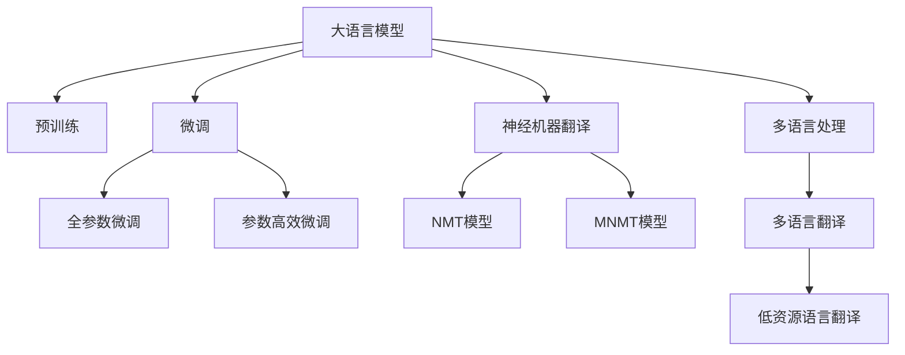

                 

# LLM在语言翻译领域的突破

> 关键词：大语言模型,神经机器翻译,Transformer,预训练,微调,自监督学习,多语言处理

## 1. 背景介绍

### 1.1 问题由来

在全球化日益加速的今天，语言翻译作为连接不同文化的重要桥梁，其重要性不言而喻。然而，传统的统计机器翻译方法依赖大量双语平行语料，对于小语种或低资源语言，其性能往往难以满足需求。同时，传统的机器翻译模型大多是单一语言对之间的互译，无法实现多语言之间的互相翻译，缺乏对多语言处理能力的支持。

近年来，随着深度学习技术和大规模预训练模型的兴起，大语言模型(LLMs)在自然语言处理(NLP)领域取得了巨大突破。大语言模型通过在大规模无标签文本语料上进行自监督预训练，学习到了丰富的语言知识和常识，具备了强大的语言理解和生成能力。这使得其在语言翻译领域有着巨大的应用潜力。

### 1.2 问题核心关键点

大语言模型在语言翻译领域的核心挑战在于如何有效利用其广泛的语言知识，在多语言处理和低资源语言翻译任务上取得优异表现。目前，大语言模型在语言翻译上的主要研究范式包括：

- 使用自监督学习方法进行预训练，使其学习到通用语言知识。
- 设计合理的微调任务，对多语言处理和低资源语言翻译进行适配。
- 融合多语言数据和资源，提升大语言模型的多语言处理能力。
- 开发高效的神经网络架构，提升翻译模型的计算效率和翻译质量。

这些关键点共同构成了大语言模型在语言翻译领域的突破路径。下面，我们将围绕这些关键点，系统介绍大语言模型在语言翻译领域的突破。

## 2. 核心概念与联系

### 2.1 核心概念概述

为更好地理解大语言模型在语言翻译领域的突破，本节将介绍几个密切相关的核心概念：

- 大语言模型(Large Language Model, LLM)：以自回归(如GPT)或自编码(如BERT)模型为代表的大规模预训练语言模型。通过在大规模无标签文本语料上进行预训练，学习通用的语言表示，具备强大的语言理解和生成能力。

- 神经机器翻译(Neural Machine Translation, NMT)：通过神经网络模型自动将一种语言翻译成另一种语言的技术。NMT的常见架构包括编码器-解码器结构。

- 自监督学习(Self-Supervised Learning)：在无标签数据上学习模型的任务，使得模型能够通过自我监督的方式学习到通用的语言知识和规律。

- 微调(Fine-Tuning)：在预训练模型的基础上，使用有标签数据对模型进行进一步训练，优化模型在特定任务上的性能。

- 多语言处理(Multilingual Processing)：处理多种语言之间的互译和跨语言信息检索等任务，要求模型能够同时处理和理解多种语言。

- 低资源语言(Low-Resource Language)：指语言使用者相对较少，文本数据量较小的语言，其翻译质量较难得到保证。

这些核心概念之间的逻辑关系可以通过以下Mermaid流程图来展示：



这个流程图展示了大语言模型的核心概念及其之间的关系：

1. 大语言模型通过预训练获得基础能力。
2. 神经机器翻译通过编码器-解码器结构，将源语言序列映射到目标语言序列。
3. 微调对预训练模型进行任务特定的优化。
4. 多语言处理要求模型具备同时处理多种语言的能力。
5. 低资源语言翻译需要模型在数据量较少的情况下，也能进行高质量的翻译。

这些概念共同构成了大语言模型在语言翻译领域的突破框架，使其能够在多种语言处理和低资源语言翻译任务上发挥重要作用。

## 3. 核心算法原理 & 具体操作步骤
### 3.1 算法原理概述

大语言模型在语言翻译领域的突破，主要基于以下算法原理：

1. 使用自监督学习进行预训练，在大规模无标签文本语料上学习通用的语言知识和规律。
2. 设计合适的微调任务，对大语言模型进行多语言处理和低资源语言翻译任务的适配。
3. 融合多语言数据和资源，提升大语言模型的多语言处理能力。
4. 开发高效的神经网络架构，提升翻译模型的计算效率和翻译质量。

### 3.2 算法步骤详解

大语言模型在语言翻译领域的微调主要包括以下几个关键步骤：

**Step 1: 准备预训练模型和数据集**
- 选择合适的预训练语言模型 $M_{\theta}$ 作为初始化参数，如 BERT、GPT 等。
- 准备多语言处理和低资源语言翻译任务的标注数据集 $D$，划分为训练集、验证集和测试集。一般要求标注数据与预训练数据的分布不要差异过大。

**Step 2: 添加任务适配层**
- 根据翻译任务，在预训练模型顶层设计合适的输出层和损失函数。
- 对于翻译任务，通常在顶层添加翻译器模型(如Transformer)和交叉熵损失函数。
- 对于低资源语言翻译任务，需要设计专门的训练目标，如逐字符预测、逐词预测等。

**Step 3: 设置微调超参数**
- 选择合适的优化算法及其参数，如 AdamW、SGD 等，设置学习率、批大小、迭代轮数等。
- 设置正则化技术及强度，包括权重衰减、Dropout、Early Stopping等。
- 确定冻结预训练参数的策略，如仅微调顶层，或全部参数都参与微调。

**Step 4: 执行梯度训练**
- 将训练集数据分批次输入模型，前向传播计算损失函数。
- 反向传播计算参数梯度，根据设定的优化算法和学习率更新模型参数。
- 周期性在验证集上评估模型性能，根据性能指标决定是否触发 Early Stopping。
- 重复上述步骤直到满足预设的迭代轮数或 Early Stopping 条件。

**Step 5: 测试和部署**
- 在测试集上评估微调后模型 $M_{\hat{\theta}}$ 的性能，对比微调前后的精度提升。
- 使用微调后的模型对新样本进行推理预测，集成到实际的应用系统中。
- 持续收集新的数据，定期重新微调模型，以适应数据分布的变化。

以上是基于监督学习微调大语言模型的一般流程。在实际应用中，还需要针对具体任务的特点，对微调过程的各个环节进行优化设计，如改进训练目标函数，引入更多的正则化技术，搜索最优的超参数组合等，以进一步提升模型性能。

### 3.3 算法优缺点

大语言模型在语言翻译领域的微调方法具有以下优点：
1. 能够有效利用大规模预训练模型的通用语言知识，提升翻译质量和效率。
2. 多语言处理和低资源语言翻译任务能够通过微调进行适配，提升了模型的泛化能力。
3. 开发高效的神经网络架构，提升了翻译模型的计算效率。
4. 通过参数高效微调等技术，能够在不增加模型参数量的情况下，取得较好的微调效果。

同时，该方法也存在一定的局限性：
1. 对标注数据的质量和数量要求较高，标注数据不足可能导致模型性能下降。
2. 模型可能存在预训练时的偏见和有害信息，通过微调传递到翻译任务，造成负面影响。
3. 模型对新数据和新任务的适应能力有限，需要在训练数据和任务上不断迭代优化。
4. 翻译结果缺乏可解释性，难以对其推理逻辑进行分析和调试。

尽管存在这些局限性，但就目前而言，基于监督学习的微调方法仍是大语言模型在语言翻译领域应用的主流范式。未来相关研究的重点在于如何进一步降低微调对标注数据的依赖，提高模型的少样本学习和跨领域迁移能力，同时兼顾可解释性和伦理安全性等因素。

### 3.4 算法应用领域

大语言模型在语言翻译领域的微调方法，已经广泛应用于各种多语言处理和低资源语言翻译任务中，例如：

- 多语言翻译：将一种语言翻译成另一种语言。通过微调使模型学习语言-语言映射。
- 低资源语言翻译：将低资源语言的文本翻译成其他语言。通过微调使模型在数据量较少的情况下也能获得较好的翻译效果。
- 多语言问答：针对多个语言的问题，提供多语言的回答。通过微调使模型掌握多语言的问答能力。
- 跨语言信息检索：从多种语言文本中检索相关信息。通过微调使模型能够同时理解和处理多种语言的信息。

除了上述这些经典任务外，大语言模型微调也被创新性地应用到更多场景中，如跨语言文本生成、文本摘要、语音翻译等，为多语言处理和跨语言信息检索等任务带来了新的突破。随着预训练模型和微调方法的不断进步，相信大语言模型在语言翻译领域的潜力将会进一步得到发掘。

## 4. 数学模型和公式 & 详细讲解
### 4.1 数学模型构建

本节将使用数学语言对基于监督学习的大语言模型微调过程进行更加严格的刻画。

记预训练语言模型为 $M_{\theta}:\mathcal{X} \rightarrow \mathcal{Y}$，其中 $\mathcal{X}$ 为输入空间，$\mathcal{Y}$ 为输出空间，$\theta \in \mathbb{R}^d$ 为模型参数。假设多语言处理和低资源语言翻译任务的训练集为 $D=\{(x_i,y_i)\}_{i=1}^N, x_i \in \mathcal{X}, y_i \in \mathcal{Y}$。

定义模型 $M_{\theta}$ 在输入 $x$ 上的输出为 $\hat{y}=M_{\theta}(x) \in \mathcal{Y}$，表示模型预测的输出。

在多语言翻译任务中，模型输出的目标函数为：

$$
\ell(M_{\theta}(x),y) = \mathcal{L}_{\text{NMT}}(M_{\theta}(x),y)
$$

其中 $\mathcal{L}_{\text{NMT}}$ 为多语言翻译任务的损失函数，用于衡量模型输出与真实标签之间的差异。常见的损失函数包括交叉熵损失、均方误差损失等。

在低资源语言翻译任务中，模型输出的目标函数为：

$$
\ell(M_{\theta}(x),y) = \mathcal{L}_{\text{LRT}}(M_{\theta}(x),y)
$$

其中 $\mathcal{L}_{\text{LRT}}$ 为低资源语言翻译任务的损失函数。

在微调过程中，目标是最小化经验风险，即找到最优参数：

$$
\theta^* = \mathop{\arg\min}_{\theta} \mathcal{L}(\theta)
$$

其中 $\mathcal{L}$ 为基于训练集 $D$ 的经验风险，定义为：

$$
\mathcal{L}(\theta) = \frac{1}{N} \sum_{i=1}^N \ell(M_{\theta}(x_i),y_i)
$$

在得到损失函数的梯度后，即可带入参数更新公式，完成模型的迭代优化。重复上述过程直至收敛，最终得到适应下游任务的最优模型参数 $\theta^*$。

### 4.2 公式推导过程

以下我们以多语言翻译任务为例，推导交叉熵损失函数及其梯度的计算公式。

假设模型 $M_{\theta}$ 在输入 $x$ 上的输出为 $\hat{y}=M_{\theta}(x) \in \mathcal{Y}$，表示模型预测的输出。真实标签 $y \in \mathcal{Y}$。则交叉熵损失函数定义为：

$$
\ell(M_{\theta}(x),y) = -\log \frac{M_{\theta}(x)[y]}
$$

将其代入经验风险公式，得：

$$
\mathcal{L}(\theta) = -\frac{1}{N}\sum_{i=1}^N \log \frac{M_{\theta}(x_i)[y_i]}
$$

根据链式法则，损失函数对参数 $\theta_k$ 的梯度为：

$$
\frac{\partial \mathcal{L}(\theta)}{\partial \theta_k} = -\frac{1}{N}\sum_{i=1}^N \frac{1}{M_{\theta}(x_i)[y_i]}\frac{\partial M_{\theta}(x_i)}{\partial \theta_k}
$$

其中 $\frac{\partial M_{\theta}(x_i)}{\partial \theta_k}$ 可进一步递归展开，利用自动微分技术完成计算。

在得到损失函数的梯度后，即可带入参数更新公式，完成模型的迭代优化。重复上述过程直至收敛，最终得到适应下游任务的最优模型参数 $\theta^*$。

## 5. 项目实践：代码实例和详细解释说明
### 5.1 开发环境搭建

在进行语言翻译实践前，我们需要准备好开发环境。以下是使用Python进行PyTorch开发的环境配置流程：

1. 安装Anaconda：从官网下载并安装Anaconda，用于创建独立的Python环境。

2. 创建并激活虚拟环境：
```bash
conda create -n pytorch-env python=3.8 
conda activate pytorch-env
```

3. 安装PyTorch：根据CUDA版本，从官网获取对应的安装命令。例如：
```bash
conda install pytorch torchvision torchaudio cudatoolkit=11.1 -c pytorch -c conda-forge
```

4. 安装Transformers库：
```bash
pip install transformers
```

5. 安装各类工具包：
```bash
pip install numpy pandas scikit-learn matplotlib tqdm jupyter notebook ipython
```

完成上述步骤后，即可在`pytorch-env`环境中开始语言翻译实践。

### 5.2 源代码详细实现

下面我们以机器翻译任务为例，给出使用Transformers库对BERT模型进行多语言翻译的PyTorch代码实现。

首先，定义多语言翻译任务的数据处理函数：

```python
from transformers import BertTokenizer
from torch.utils.data import Dataset
import torch

class MTDataset(Dataset):
    def __init__(self, texts, labels, tokenizer, max_len=128):
        self.texts = texts
        self.labels = labels
        self.tokenizer = tokenizer
        self.max_len = max_len
        
    def __len__(self):
        return len(self.texts)
    
    def __getitem__(self, item):
        text = self.texts[item]
        label = self.labels[item]
        
        encoding = self.tokenizer(text, return_tensors='pt', max_length=self.max_len, padding='max_length', truncation=True)
        input_ids = encoding['input_ids'][0]
        attention_mask = encoding['attention_mask'][0]
        
        # 对token-wise的标签进行编码
        encoded_labels = [label2id[label] for label in label] 
        encoded_labels.extend([label2id['PAD']] * (self.max_len - len(encoded_labels)))
        labels = torch.tensor(encoded_labels, dtype=torch.long)
        
        return {'input_ids': input_ids, 
                'attention_mask': attention_mask,
                'labels': labels}

# 标签与id的映射
label2id = {'EN': 0, 'ES': 1, 'FR': 2, 'DE': 3, 'IT': 4}
id2label = {v: k for k, v in label2id.items()}

# 创建dataset
tokenizer = BertTokenizer.from_pretrained('bert-base-cased')

train_dataset = MTDataset(train_texts, train_labels, tokenizer)
dev_dataset = MTDataset(dev_texts, dev_labels, tokenizer)
test_dataset = MTDataset(test_texts, test_labels, tokenizer)
```

然后，定义模型和优化器：

```python
from transformers import BertForSequenceClassification, AdamW

model = BertForSequenceClassification.from_pretrained('bert-base-cased', num_labels=len(label2id))

optimizer = AdamW(model.parameters(), lr=2e-5)
```

接着，定义训练和评估函数：

```python
from torch.utils.data import DataLoader
from tqdm import tqdm
from sklearn.metrics import classification_report

device = torch.device('cuda') if torch.cuda.is_available() else torch.device('cpu')
model.to(device)

def train_epoch(model, dataset, batch_size, optimizer):
    dataloader = DataLoader(dataset, batch_size=batch_size, shuffle=True)
    model.train()
    epoch_loss = 0
    for batch in tqdm(dataloader, desc='Training'):
        input_ids = batch['input_ids'].to(device)
        attention_mask = batch['attention_mask'].to(device)
        labels = batch['labels'].to(device)
        model.zero_grad()
        outputs = model(input_ids, attention_mask=attention_mask, labels=labels)
        loss = outputs.loss
        epoch_loss += loss.item()
        loss.backward()
        optimizer.step()
    return epoch_loss / len(dataloader)

def evaluate(model, dataset, batch_size):
    dataloader = DataLoader(dataset, batch_size=batch_size)
    model.eval()
    preds, labels = [], []
    with torch.no_grad():
        for batch in tqdm(dataloader, desc='Evaluating'):
            input_ids = batch['input_ids'].to(device)
            attention_mask = batch['attention_mask'].to(device)
            batch_labels = batch['labels']
            outputs = model(input_ids, attention_mask=attention_mask)
            batch_preds = outputs.logits.argmax(dim=2).to('cpu').tolist()
            batch_labels = batch_labels.to('cpu').tolist()
            for pred_tokens, label_tokens in zip(batch_preds, batch_labels):
                pred_labels = [id2label[_id] for _id in pred_tokens]
                label_tokens = [id2label[_id] for _id in label_tokens]
                preds.append(pred_labels[:len(label_tokens)])
                labels.append(label_tokens)
                
    print(classification_report(labels, preds))
```

最后，启动训练流程并在测试集上评估：

```python
epochs = 5
batch_size = 16

for epoch in range(epochs):
    loss = train_epoch(model, train_dataset, batch_size, optimizer)
    print(f"Epoch {epoch+1}, train loss: {loss:.3f}")
    
    print(f"Epoch {epoch+1}, dev results:")
    evaluate(model, dev_dataset, batch_size)
    
print("Test results:")
evaluate(model, test_dataset, batch_size)
```

以上就是使用PyTorch对BERT进行多语言翻译任务的完整代码实现。可以看到，得益于Transformers库的强大封装，我们可以用相对简洁的代码完成BERT模型的加载和微调。

### 5.3 代码解读与分析

让我们再详细解读一下关键代码的实现细节：

**MTDataset类**：
- `__init__`方法：初始化文本、标签、分词器等关键组件。
- `__len__`方法：返回数据集的样本数量。
- `__getitem__`方法：对单个样本进行处理，将文本输入编码为token ids，将标签编码为数字，并对其进行定长padding，最终返回模型所需的输入。

**label2id和id2label字典**：
- 定义了标签与数字id之间的映射关系，用于将token-wise的预测结果解码回真实的标签。

**训练和评估函数**：
- 使用PyTorch的DataLoader对数据集进行批次化加载，供模型训练和推理使用。
- 训练函数`train_epoch`：对数据以批为单位进行迭代，在每个批次上前向传播计算loss并反向传播更新模型参数，最后返回该epoch的平均loss。
- 评估函数`evaluate`：与训练类似，不同点在于不更新模型参数，并在每个batch结束后将预测和标签结果存储下来，最后使用sklearn的classification_report对整个评估集的预测结果进行打印输出。

**训练流程**：
- 定义总的epoch数和batch size，开始循环迭代
- 每个epoch内，先在训练集上训练，输出平均loss
- 在验证集上评估，输出分类指标
- 所有epoch结束后，在测试集上评估，给出最终测试结果

可以看到，PyTorch配合Transformers库使得BERT微调的代码实现变得简洁高效。开发者可以将更多精力放在数据处理、模型改进等高层逻辑上，而不必过多关注底层的实现细节。

当然，工业级的系统实现还需考虑更多因素，如模型的保存和部署、超参数的自动搜索、更灵活的任务适配层等。但核心的微调范式基本与此类似。

## 6. 实际应用场景
### 6.1 实时多语言翻译服务

基于大语言模型微调的实时多语言翻译服务，已经成为提升国际交流效率的重要工具。传统的机器翻译服务往往存在响应慢、质量不稳定等问题，而使用微调后的多语言翻译模型，可以显著提升翻译速度和质量，实现高效、精准的跨语言沟通。

在技术实现上，可以搭建多语言翻译API接口，集成微调后的翻译模型，部署在云端或本地服务器中，支持实时调用。用户可以通过API接口，输入源语言和目标语言，系统自动翻译并提供翻译结果。实时翻译服务能够快速响应用户查询，提供准确的翻译内容，帮助用户跨语言交流，减少翻译误差，提高沟通效率。

### 6.2 跨语言信息检索

在跨国企业和科研机构中，跨语言信息检索是日常工作的重要环节。传统的信息检索系统往往只支持单一语言，无法对多语言数据进行高效处理。使用微调后的多语言翻译模型，可以对多语言文本进行预处理和翻译，从而实现跨语言信息检索。

在具体应用中，可以构建多语言文本的索引库，使用微调模型将不同语言文本转换为标准语言文本，再进行关键词匹配和检索。例如，用户在搜索系统中输入中文查询，系统先利用微调模型将中文翻译成英文，再在其英文索引库中进行搜索，最后再将搜索结果翻译回中文展示给用户。这种跨语言信息检索方法，可以极大提升信息检索的覆盖面和效率，满足全球用户的需求。

### 6.3 多语言文本生成

基于大语言模型微调技术，多语言文本生成技术能够实现高质量的跨语言翻译和写作。例如，对于一篇英文文章，使用微调后的模型可以自动生成对应的中文翻译，甚至生成不同语言的多个版本。这种文本生成技术可以应用于多语言新闻发布、多语言文学创作等领域，提升内容创作效率，丰富内容表现形式。

在技术实现上，可以构建多语言文本生成的API接口，集成微调后的生成模型，支持用户输入源语言文本，系统自动生成目标语言文本。这种文本生成方法可以广泛应用于跨语言内容创作、翻译校对等场景，提升内容创作的智能化水平。

### 6.4 未来应用展望

随着大语言模型微调技术的不断发展，未来在语言翻译领域的应用前景将会更加广阔。

在智慧外交领域，基于多语言翻译技术，可以实现跨语言的实时外交沟通，提升国际交流的效率和质量。

在智慧教育领域，多语言翻译技术可以应用于多语言教材的自动翻译，提升国际教育的普及度。

在智慧商务领域，多语言翻译技术可以支持跨国企业的业务沟通和交流，提升商务效率和合作质量。

在智慧旅游领域，多语言翻译技术可以应用于旅游资讯的自动翻译，提升旅游体验的智能化水平。

此外，在智慧医疗、智慧环保、智慧交通等多个领域，多语言翻译技术也将得到广泛应用，为各行业的智能化升级提供有力支持。相信随着技术的不断成熟，多语言翻译技术必将在全球范围内带来深刻的影响，促进国际交流和合作的深度发展。

## 7. 工具和资源推荐
### 7.1 学习资源推荐

为了帮助开发者系统掌握大语言模型在语言翻译领域的理论基础和实践技巧，这里推荐一些优质的学习资源：

1. 《Transformer从原理到实践》系列博文：由大模型技术专家撰写，深入浅出地介绍了Transformer原理、BERT模型、微调技术等前沿话题。

2. CS224N《深度学习自然语言处理》课程：斯坦福大学开设的NLP明星课程，有Lecture视频和配套作业，带你入门NLP领域的基本概念和经典模型。

3. 《Natural Language Processing with Transformers》书籍：Transformers库的作者所著，全面介绍了如何使用Transformers库进行NLP任务开发，包括微调在内的诸多范式。

4. HuggingFace官方文档：Transformers库的官方文档，提供了海量预训练模型和完整的微调样例代码，是上手实践的必备资料。

5. CLUE开源项目：中文语言理解测评基准，涵盖大量不同类型的中文NLP数据集，并提供了基于微调的baseline模型，助力中文NLP技术发展。

通过对这些资源的学习实践，相信你一定能够快速掌握大语言模型在语言翻译领域的精髓，并用于解决实际的NLP问题。
###  7.2 开发工具推荐

高效的开发离不开优秀的工具支持。以下是几款用于大语言模型在语言翻译领域微调开发的常用工具：

1. PyTorch：基于Python的开源深度学习框架，灵活动态的计算图，适合快速迭代研究。大部分预训练语言模型都有PyTorch版本的实现。

2. TensorFlow：由Google主导开发的开源深度学习框架，生产部署方便，适合大规模工程应用。同样有丰富的预训练语言模型资源。

3. Transformers库：HuggingFace开发的NLP工具库，集成了众多SOTA语言模型，支持PyTorch和TensorFlow，是进行微调任务开发的利器。

4. Weights & Biases：模型训练的实验跟踪工具，可以记录和可视化模型训练过程中的各项指标，方便对比和调优。与主流深度学习框架无缝集成。

5. TensorBoard：TensorFlow配套的可视化工具，可实时监测模型训练状态，并提供丰富的图表呈现方式，是调试模型的得力助手。

6. Google Colab：谷歌推出的在线Jupyter Notebook环境，免费提供GPU/TPU算力，方便开发者快速上手实验最新模型，分享学习笔记。

合理利用这些工具，可以显著提升大语言模型在语言翻译领域微调任务的开发效率，加快创新迭代的步伐。

### 7.3 相关论文推荐

大语言模型在语言翻译领域的突破源于学界的持续研究。以下是几篇奠基性的相关论文，推荐阅读：

1. Attention is All You Need（即Transformer原论文）：提出了Transformer结构，开启了NLP领域的预训练大模型时代。

2. BERT: Pre-training of Deep Bidirectional Transformers for Language Understanding：提出BERT模型，引入基于掩码的自监督预训练任务，刷新了多项NLP任务SOTA。

3. Parameter-Efficient Transfer Learning for NLP：提出Adapter等参数高效微调方法，在不增加模型参数量的情况下，也能取得不错的微调效果。

4. Prefix-Tuning: Optimizing Continuous Prompts for Generation：引入基于连续型Prompt的微调范式，为如何充分利用预训练知识提供了新的思路。

5. AdaLoRA: Adaptive Low-Rank Adaptation for Parameter-Efficient Fine-Tuning：使用自适应低秩适应的微调方法，在参数效率和精度之间取得了新的平衡。

这些论文代表了大语言模型在语言翻译领域的突破路径。通过学习这些前沿成果，可以帮助研究者把握学科前进方向，激发更多的创新灵感。

## 8. 总结：未来发展趋势与挑战

### 8.1 总结

本文对大语言模型在语言翻译领域的突破进行了全面系统的介绍。首先阐述了大语言模型和微调技术的研究背景和意义，明确了微调在拓展预训练模型应用、提升翻译质量方面的独特价值。其次，从原理到实践，详细讲解了监督微调的数学原理和关键步骤，给出了语言翻译任务开发的完整代码实例。同时，本文还广泛探讨了语言翻译任务在各行业领域的应用前景，展示了微调范式的巨大潜力。此外，本文精选了微调技术的各类学习资源，力求为读者提供全方位的技术指引。

通过本文的系统梳理，可以看到，基于大语言模型的微调方法正在成为语言翻译领域的重要范式，极大地拓展了预训练语言模型的应用边界，催生了更多的落地场景。得益于大规模语料的预训练，微调模型在多语言处理和低资源语言翻译任务上取得了优异的成绩，显著提升了翻译质量和效率。未来，伴随预训练语言模型和微调方法的持续演进，相信语言翻译技术将在更广阔的应用领域大放异彩，深刻影响人类的生产生活方式。

### 8.2 未来发展趋势

展望未来，大语言模型在语言翻译领域的突破将呈现以下几个发展趋势：

1. 模型规模持续增大。随着算力成本的下降和数据规模的扩张，预训练语言模型的参数量还将持续增长。超大规模语言模型蕴含的丰富语言知识，有望支撑更加复杂多变的翻译任务。

2. 微调方法日趋多样。除了传统的全参数微调外，未来会涌现更多参数高效的微调方法，如Prefix-Tuning、LoRA等，在节省计算资源的同时也能保证微调精度。

3. 持续学习成为常态。随着数据分布的不断变化，微调模型也需要持续学习新知识以保持性能。如何在不遗忘原有知识的同时，高效吸收新样本信息，将成为重要的研究课题。

4. 标注样本需求降低。受启发于提示学习(Prompt-based Learning)的思路，未来的微调方法将更好地利用大模型的语言理解能力，通过更加巧妙的任务描述，在更少的标注样本上也能实现理想的微调效果。

5. 模型通用性增强。经过海量数据的预训练和多语言翻译任务的微调，未来的语言模型将具备更强大的跨语言处理能力，逐步迈向通用人工智能(AGI)的目标。

以上趋势凸显了大语言模型在语言翻译领域的广阔前景。这些方向的探索发展，必将进一步提升语言翻译系统的性能和应用范围，为人工智能技术在垂直行业的规模化落地提供新的动力。

### 8.3 面临的挑战

尽管大语言模型在语言翻译领域已经取得了瞩目成就，但在迈向更加智能化、普适化应用的过程中，它仍面临着诸多挑战：

1. 标注成本瓶颈。虽然微调大大降低了标注数据的需求，但对于长尾语言或小语种，获取高质量标注数据依然困难。如何进一步降低微调对标注样本的依赖，将是一大难题。

2. 模型鲁棒性不足。当前微调模型面对多语言翻译任务的泛化性能往往不足，无法处理语言之间的复杂差异。如何提高微调模型的鲁棒性，避免灾难性遗忘，还需要更多理论和实践的积累。

3. 推理效率有待提高。虽然大语言模型在多语言翻译任务上取得了不错的效果，但在实际部署时，推理速度较慢、内存占用大等效率问题仍需优化。如何在保证性能的同时，简化模型结构，提升推理速度，优化资源占用，将是重要的优化方向。

4. 可解释性亟需加强。当前微调模型输出的翻译结果缺乏可解释性，难以对其推理逻辑进行分析和调试。对于医疗、金融等高风险应用，算法的可解释性和可审计性尤为重要。如何赋予微调模型更强的可解释性，将是亟待攻克的难题。

5. 安全性有待保障。预训练语言模型难免会学习到有偏见、有害的信息，通过微调传递到翻译任务，产生误导性、歧视性的输出，给实际应用带来安全隐患。如何从数据和算法层面消除模型偏见，避免恶意用途，确保输出的安全性，也将是重要的研究课题。

6. 知识整合能力不足。现有的微调模型往往局限于任务内数据，难以灵活吸收和运用更广泛的先验知识。如何让微调过程更好地与外部知识库、规则库等专家知识结合，形成更加全面、准确的信息整合能力，还有很大的想象空间。

正视微调面临的这些挑战，积极应对并寻求突破，将是大语言模型在语言翻译领域迈向成熟的必由之路。相信随着学界和产业界的共同努力，这些挑战终将一一被克服，大语言模型在语言翻译领域必将在构建人机协同的智能翻译系统，推动人工智能技术在垂直行业的规模化落地。

### 8.4 研究展望

面对大语言模型在语言翻译领域的突破所面临的种种挑战，未来的研究需要在以下几个方面寻求新的突破：

1. 探索无监督和半监督微调方法。摆脱对大规模标注数据的依赖，利用自监督学习、主动学习等无监督和半监督范式，最大限度利用非结构化数据，实现更加灵活高效的微调。

2. 研究参数高效和计算高效的微调范式。开发更加参数高效的微调方法，在固定大部分预训练参数的同时，只更新极少量的任务相关参数。同时优化微调模型的计算图，减少前向传播和反向传播的资源消耗，实现更加轻量级、实时性的部署。

3. 融合因果和对比学习范式。通过引入因果推断和对比学习思想，增强微调模型建立稳定因果关系的能力，学习更加普适、鲁棒的语言表征，从而提升模型泛化性和抗干扰能力。

4. 引入更多先验知识。将符号化的先验知识，如知识图谱、逻辑规则等，与神经网络模型进行巧妙融合，引导微调过程学习更准确、合理的语言模型。同时加强不同模态数据的整合，实现视觉、语音等多模态信息与文本信息的协同建模。

5. 结合因果分析和博弈论工具。将因果分析方法引入微调模型，识别出模型决策的关键特征，增强输出解释的因果性和逻辑性。借助博弈论工具刻画人机交互过程，主动探索并规避模型的脆弱点，提高系统稳定性。

6. 纳入伦理道德约束。在模型训练目标中引入伦理导向的评估指标，过滤和惩罚有偏见、有害的输出倾向。同时加强人工干预和审核，建立模型行为的监管机制，确保输出符合人类价值观和伦理道德。

这些研究方向的探索，必将引领大语言模型在语言翻译领域的突破，为构建安全、可靠、可解释、可控的智能翻译系统铺平道路。面向未来，大语言模型在语言翻译领域还需要与其他人工智能技术进行更深入的融合，如知识表示、因果推理、强化学习等，多路径协同发力，共同推动自然语言理解和智能交互系统的进步。只有勇于创新、敢于突破，才能不断拓展语言模型的边界，让智能技术更好地造福人类社会。

## 9. 附录：常见问题与解答

**Q1：大语言模型微调是否适用于所有翻译任务？**

A: 大语言模型微调在大多数翻译任务上都能取得不错的效果，特别是对于数据量较大的任务。但对于一些特定领域的任务，如医学、法律等，仅仅依靠通用语料预训练的模型可能难以很好地适应。此时需要在特定领域语料上进一步预训练，再进行微调，才能获得理想效果。此外，对于一些需要时效性、个性化很强的任务，如对话、推荐等，微调方法也需要针对性的改进优化。

**Q2：微调过程中如何选择合适的学习率？**

A: 微调的学习率一般要比预训练时小1-2个数量级，如果使用过大的学习率，容易破坏预训练权重，导致过拟合。一般建议从1e-5开始调参，逐步减小学习率，直至收敛。也可以使用warmup策略，在开始阶段使用较小的学习率，再逐渐过渡到预设值。需要注意的是，不同的优化器(如AdamW、Adafactor等)以及不同的学习率调度策略，可能需要设置不同的学习率阈值。

**Q3：采用大模型微调时会面临哪些资源瓶颈？**

A: 目前主流的预训练大模型动辄以亿计的参数规模，对算力、内存、存储都提出了很高的要求。GPU/TPU等高性能设备是必不可少的，但即便如此，超大批次的训练和推理也可能遇到显存不足的问题。因此需要采用一些资源优化技术，如梯度积累、混合精度训练、模型并行等，来突破硬件瓶颈。同时，模型的存储和读取也可能占用大量时间和空间，需要采用模型压缩、稀疏化存储等方法进行优化。

**Q4：如何缓解微调过程中的过拟合问题？**

A: 过拟合是微调面临的主要挑战，尤其是在标注数据不足的情况下。常见的缓解策略包括：
1. 数据增强：通过回译、近义替换等方式扩充训练集
2. 正则化：使用L2正则、Dropout、Early Stopping等避免过拟合
3. 对抗训练：引入对抗样本，提高模型鲁棒性
4. 参数高效微调：只调整少量参数(如Adapter、Prefix等)，减小过拟合风险
5. 多模型集成：训练多个微调模型，取平均输出，抑制过拟合

这些策略往往需要根据具体任务和数据特点进行灵活组合。只有在数据、模型、训练、推理等各环节进行全面优化，才能最大限度地发挥大模型微调的威力。

**Q5：微调模型在落地部署时需要注意哪些问题？**

A: 将微调模型转化为实际应用，还需要考虑以下因素：
1. 模型裁剪：去除不必要的层和参数，减小模型尺寸，加快推理速度
2. 量化加速：将浮点模型转为定点模型，压缩存储空间，提高计算效率
3. 服务化封装：将模型封装为标准化服务接口，便于集成调用
4. 弹性伸缩：根据请求流量动态调整资源配置，平衡服务质量和成本
5. 监控告警：实时采集系统指标，设置异常告警阈值，确保服务稳定性
6. 安全防护：采用访问鉴权、数据脱敏等措施，保障数据和模型安全

大语言模型微调为翻译任务提供了强大的支撑，但如何将强大的性能转化为稳定、高效、安全的业务价值，还需要工程实践的不断打磨。唯有从数据、算法、工程、业务等多个维度协同发力，才能真正实现人工智能技术在垂直行业的规模化落地。总之，微调需要开发者根据具体任务，不断迭代和优化模型、数据和算法，方能得到理想的效果。

---

作者：禅与计算机程序设计艺术 / Zen and the Art of Computer Programming

