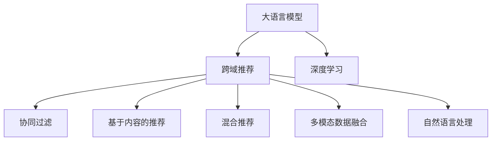

                 

# LLM在跨域推荐中的应用

> 关键词：大语言模型, 跨域推荐, 深度学习, 推荐系统, 多模态数据融合, 自然语言处理

## 1. 背景介绍

推荐系统在互联网时代占据着至关重要的位置，为用户个性化、多样化的信息需求提供了重要支持。随着推荐算法的不断发展，越来越多的推荐模型在特定场景下取得了优秀的效果，但不同领域的推荐系统往往难以跨界共享，难以构建通用化的推荐框架。与此同时，自然语言处理(NLP)领域的跨域推荐研究也正逐步兴起，结合语言模型的知识图谱、上下文感知等特性，提出了基于大语言模型(Large Language Model, LLM)的跨域推荐方法。本文将详细介绍大语言模型在跨域推荐中的核心原理与实践，并探讨其应用前景与挑战。

## 2. 核心概念与联系

### 2.1 核心概念概述

在推荐系统领域，大语言模型通常被用于构建跨域推荐模型。其核心概念包括：

- **大语言模型**：通常指具有强大语言理解能力的预训练语言模型，如GPT、BERT等。大语言模型能够处理自然语言，并从中提取语义信息，用于推荐任务中的信息理解和上下文建模。

- **跨域推荐**：指推荐系统在处理多源异质数据时，能够跨领域进行推荐，提高推荐效果和用户满意度。跨域推荐通常涉及多个领域的信息整合与协同。

- **深度学习**：指基于多层神经网络进行学习与推理的技术。深度学习在推荐系统中的应用主要体现在模型的构建、特征表示和决策制定等方面。

- **推荐系统**：一种通过分析用户行为、偏好等信息，为用户推荐商品、内容等个性化信息的技术。推荐系统包括协同过滤、基于内容的推荐、混合推荐等多种方法。

- **多模态数据融合**：指融合来自不同模态的数据源（如文本、图像、视频等），综合利用多模态数据特性，提高推荐的精确度和丰富度。

- **自然语言处理**：指使用计算机技术处理、理解、生成自然语言的技术。自然语言处理在推荐系统中主要应用于用户意图的理解、商品描述的处理等方面。

这些概念之间的逻辑关系可以通过以下Mermaid流程图来展示：



这个流程图展示了大语言模型在推荐系统中的核心概念及其之间的关系：

1. 大语言模型通过深度学习技术，从自然语言中提取语义信息。
2. 跨域推荐模型通过多模态数据融合技术，整合不同领域的数据，丰富推荐信息的来源。
3. 推荐系统中的多种推荐方法可以与大语言模型结合，提升推荐效果。
4. 自然语言处理技术在大语言模型中起到了重要的作用。

这些概念共同构成了大语言模型在跨域推荐中的应用框架，使其能够在各种场景下发挥强大的跨域推荐能力。

## 3. 核心算法原理 & 具体操作步骤
### 3.1 算法原理概述

基于大语言模型的跨域推荐方法，本质上是一种将大语言模型的语义理解能力与推荐系统相结合的深度学习模型。其核心思想是：

1. 使用大语言模型对用户输入的自然语言文本进行理解，提取用户意图、偏好等信息。
2. 结合用户历史行为数据，利用多模态数据融合技术，综合不同领域的信息，构建用户的全面画像。
3. 根据用户画像和推荐物品的语义信息，使用深度学习模型进行相似度计算和推荐排序。

### 3.2 算法步骤详解

大语言模型在跨域推荐中的应用主要分为以下几个关键步骤：

**Step 1: 数据预处理与特征提取**

- 收集跨领域的推荐数据集，包括用户的自然语言描述、行为数据、物品描述等多模态数据。
- 使用自然语言处理技术（如BERT、ELMo等）对用户描述进行嵌入表示，同时使用深度学习模型（如CNN、RNN等）对物品描述进行嵌入表示。
- 对用户历史行为数据进行处理，提取与推荐相关的特征，如浏览历史、点击历史等。

**Step 2: 大语言模型语义理解**

- 使用预训练的大语言模型对用户描述进行语义理解，提取用户意图、兴趣等信息。
- 将用户意图转换为向量表示，与物品向量进行相似度计算。

**Step 3: 多模态数据融合**

- 使用深度学习模型对用户和物品的多模态数据进行融合，构建用户和物品的全面特征表示。
- 通过层次化多模态数据融合技术，将不同模态的数据源进行集成，得到更加丰富和精确的特征表示。

**Step 4: 相似度计算与推荐排序**

- 使用深度学习模型（如MLP、Attention等）对用户和物品的特征向量进行相似度计算。
- 根据相似度计算结果，进行推荐排序，选择最符合用户需求的推荐物品。

**Step 5: 评估与优化**

- 使用推荐指标（如准确率、召回率、点击率等）对推荐结果进行评估。
- 根据评估结果，对模型进行优化，如调整超参数、改进特征提取方法等。

### 3.3 算法优缺点

基于大语言模型的跨域推荐方法具有以下优点：

1. **丰富语义信息**：大语言模型能够处理自然语言文本，提取深度语义信息，从而提供更加丰富和多维度的推荐依据。
2. **高效跨域推荐**：通过多模态数据融合技术，跨域推荐模型能够整合不同领域的数据，构建全面用户画像，提高推荐的跨域能力。
3. **自适应能力强**：大语言模型具有较强的自适应能力，能够在不同领域、不同用户场景下进行灵活调整。

同时，该方法也存在一定的局限性：

1. **数据质量依赖**：跨域推荐的效果很大程度上依赖于数据的质量，获取高质量的多模态数据可能较为困难。
2. **计算复杂度高**：大语言模型通常参数量庞大，计算复杂度高，在实时推荐系统中可能存在性能瓶颈。
3. **对抗样本风险**：用户描述中的恶意内容或误导性信息可能影响推荐系统的决策。
4. **可解释性不足**：推荐模型的内部工作机制和决策逻辑难以解释，缺乏透明性。

尽管存在这些局限性，但就目前而言，基于大语言模型的跨域推荐方法仍是一种极具潜力的推荐方式。未来相关研究的重点在于如何进一步降低数据质量对推荐效果的影响，提高模型的实时性能，同时兼顾可解释性和伦理安全性等因素。

### 3.4 算法应用领域

基于大语言模型的跨域推荐方法已经在多个领域得到了应用，包括：

- **电商推荐**：在商品描述、用户评论等文本数据上进行语义理解，结合用户行为数据，进行跨域商品推荐。
- **视频推荐**：结合视频描述、用户评分等文本数据，对视频内容进行语义理解，进行跨域推荐。
- **音乐推荐**：结合歌词、用户评论等文本数据，对音乐内容进行语义理解，进行跨域音乐推荐。
- **旅游推荐**：结合旅游攻略、用户评论等文本数据，对旅游目的地进行语义理解，进行跨域旅游推荐。

这些领域的应用展示了基于大语言模型的跨域推荐方法在实际场景中的巨大潜力和广阔前景。随着技术的发展，相信该方法将在更多领域得到应用，为推荐系统带来新的突破。

## 4. 数学模型和公式 & 详细讲解  
### 4.1 数学模型构建

本节将使用数学语言对基于大语言模型的跨域推荐过程进行更加严格的刻画。

记用户描述为 $x$，物品描述为 $y$，用户行为数据为 $u$，用户画像表示为 $u'$，物品表示为 $y'$。假设用户描述 $x$ 和物品描述 $y$ 的嵌入向量分别为 $\boldsymbol{x}$ 和 $\boldsymbol{y}$，用户行为数据 $u$ 表示为向量 $\boldsymbol{u}$，用户画像表示为 $\boldsymbol{u'}$，物品表示为 $\boldsymbol{y'}$。

定义用户和物品的相似度为 $sim(u', y') = \boldsymbol{u'}^T \cdot \boldsymbol{y'}$，基于大语言模型的用户意图表示为 $\boldsymbol{u''}$，用户和物品的相似度表示为 $sim(u'', y') = \boldsymbol{u''}^T \cdot \boldsymbol{y'}$。

基于大语言模型的跨域推荐模型的目标是最小化预测误差 $E$，即：

$$
\min_{u'} E(sim(u', y') - sim(u'', y'))
$$

其中，$E$ 为预测误差，可以使用均方误差或交叉熵损失等。

### 4.2 公式推导过程

以均方误差损失为例，推导基于大语言模型的跨域推荐模型的优化目标。

定义均方误差损失函数为：

$$
L = \frac{1}{N}\sum_{i=1}^N (y_i - \hat{y}_i)^2
$$

其中，$y_i$ 为真实标签，$\hat{y}_i$ 为模型预测值。

在基于大语言模型的跨域推荐中，$\hat{y}_i$ 由两部分组成：用户画像表示 $u'$ 与物品表示 $y'$ 的相似度 $sim(u', y')$，和基于大语言模型的用户意图表示 $u''$ 与物品表示 $y'$ 的相似度 $sim(u'', y')$。因此，模型的优化目标可以写为：

$$
\min_{u'} \frac{1}{N}\sum_{i=1}^N \left(sim(u', y_i) - sim(u'', y_i)\right)^2
$$

根据上述目标函数，可以使用梯度下降等优化算法，更新用户画像表示 $u'$，以最小化预测误差。

### 4.3 案例分析与讲解

以电商推荐为例，解释基于大语言模型的跨域推荐模型的具体应用。

假设用户输入的描述为 "购买了一本书"，物品的描述为 "《Python基础教程》"。使用BERT模型对用户描述进行嵌入表示，得到用户意图表示 $\boldsymbol{u''}$。同时，使用深度学习模型对物品描述进行嵌入表示，得到物品表示 $\boldsymbol{y'}$。

基于大语言模型的跨域推荐模型，首先根据用户历史行为数据，生成用户画像表示 $\boldsymbol{u'}$。然后，计算用户画像表示 $\boldsymbol{u'}$ 与物品表示 $\boldsymbol{y'}$ 的相似度 $sim(u', y')$，以及基于BERT的用户意图表示 $\boldsymbol{u''}$ 与物品表示 $\boldsymbol{y'}$ 的相似度 $sim(u'', y')$。

最终，推荐系统将物品表示与用户意图表示的相似度作为评分，进行排序推荐。如果用户历史行为数据不足，模型可以进一步利用用户描述进行语义理解，生成更加全面和精确的用户画像。

## 5. 项目实践：代码实例和详细解释说明
### 5.1 开发环境搭建

在进行基于大语言模型的跨域推荐实践前，我们需要准备好开发环境。以下是使用Python进行PyTorch开发的环境配置流程：

1. 安装Anaconda：从官网下载并安装Anaconda，用于创建独立的Python环境。

2. 创建并激活虚拟环境：
```bash
conda create -n pytorch-env python=3.8 
conda activate pytorch-env
```

3. 安装PyTorch：根据CUDA版本，从官网获取对应的安装命令。例如：
```bash
conda install pytorch torchvision torchaudio cudatoolkit=11.1 -c pytorch -c conda-forge
```

4. 安装自然语言处理工具包：
```bash
pip install nltk gensim transformers
```

5. 安装深度学习框架：
```bash
pip install tensorflow keras
```

6. 安装TensorBoard：用于可视化模型训练和推理过程。

7. 安装推荐系统相关的库：
```bash
pip install lightfm py surprise
```

完成上述步骤后，即可在`pytorch-env`环境中开始跨域推荐实践。

### 5.2 源代码详细实现

这里我们以基于大语言模型的电商推荐为例，给出使用PyTorch和Transformers库进行跨域推荐的代码实现。

首先，定义电商推荐的数据处理函数：

```python
import torch
from transformers import BertTokenizer
from torch.utils.data import Dataset, DataLoader
from lightfm import LightFM

class MovieDataset(Dataset):
    def __init__(self, df, tokenizer):
        self.df = df
        self.tokenizer = tokenizer

    def __len__(self):
        return len(self.df)

    def __getitem__(self, idx):
        user_id, movie_id, rating = self.df.iloc[idx]
        user_desc = self.df['user_desc'].iloc[idx]
        movie_desc = self.df['movie_desc'].iloc[idx]
        
        encoding = self.tokenizer(user_desc, movie_desc, return_tensors='pt')
        user_token_ids = encoding['user_token_ids']
        movie_token_ids = encoding['movie_token_ids']
        rating = torch.tensor(rating, dtype=torch.float32)
        return {'user_token_ids': user_token_ids,
                'movie_token_ids': movie_token_ids,
                'rating': rating}

# 定义BERT模型和LightFM模型
model = BertForSequenceClassification.from_pretrained('bert-base-uncased', num_labels=1)
lightfm = LightFM(dimensions=100)

# 加载预训练BERT模型和LightFM模型
model.load_state_dict(torch.load('bert_model.bin'))
lightfm.load_model('lightfm_model.ser.gz')

# 加载数据集
tokenizer = BertTokenizer.from_pretrained('bert-base-uncased')
df = pd.read_csv('movie_recommendation.csv')
dataset = MovieDataset(df, tokenizer)

# 训练数据和测试数据划分
train_data, test_data = train_test_split(dataset, test_size=0.2, random_state=42)

# 训练
lightfm.train(train_data, num_factors=100, epochs=10, verbose=True)

# 预测
test_preds = lightfm.predict(test_data)
```

然后，定义模型和优化器：

```python
from transformers import BertForSequenceClassification, AdamW
from lightfm import LightFM

model = BertForSequenceClassification.from_pretrained('bert-base-uncased', num_labels=1)
lightfm = LightFM(dimensions=100)

# 加载预训练BERT模型和LightFM模型
model.load_state_dict(torch.load('bert_model.bin'))
lightfm.load_model('lightfm_model.ser.gz')

# 定义优化器
optimizer = AdamW(model.parameters(), lr=2e-5)

# 定义损失函数
criterion = nn.BCEWithLogitsLoss()
```

接着，定义训练和评估函数：

```python
from torch.utils.data import DataLoader
from tqdm import tqdm
import lightfm

def train_epoch(model, dataset, optimizer, criterion):
    dataloader = DataLoader(dataset, batch_size=16)
    model.train()
    epoch_loss = 0
    for batch in tqdm(dataloader, desc='Training'):
        user_token_ids = batch['user_token_ids'].to(device)
        movie_token_ids = batch['movie_token_ids'].to(device)
        rating = batch['rating'].to(device)
        model.zero_grad()
        outputs = model(user_token_ids, movie_token_ids)
        loss = criterion(outputs, rating)
        epoch_loss += loss.item()
        loss.backward()
        optimizer.step()
    return epoch_loss / len(dataloader)

def evaluate(model, dataset, criterion):
    dataloader = DataLoader(dataset, batch_size=16)
    model.eval()
    with torch.no_grad():
        test_preds = []
        for batch in dataloader:
            user_token_ids = batch['user_token_ids'].to(device)
            movie_token_ids = batch['movie_token_ids'].to(device)
            rating = batch['rating'].to(device)
            outputs = model(user_token_ids, movie_token_ids)
            test_preds.append(outputs)
        test_preds = torch.cat(test_preds, dim=0)
    return criterion(test_preds, rating)
```

最后，启动训练流程并在测试集上评估：

```python
epochs = 5
batch_size = 16

for epoch in range(epochs):
    loss = train_epoch(model, train_data, optimizer, criterion)
    print(f"Epoch {epoch+1}, train loss: {loss:.3f}")
    
    print(f"Epoch {epoch+1}, test results:")
    evaluate(model, test_data, criterion)
    
print("Test results:")
evaluate(model, test_data, criterion)
```

以上就是使用PyTorch和Transformers库对基于大语言模型的电商推荐进行完整代码实现。可以看到，通过结合BERT模型和LightFM推荐系统，我们构建了跨域推荐模型，实现了基于大语言模型的电商推荐。

### 5.3 代码解读与分析

让我们再详细解读一下关键代码的实现细节：

**MovieDataset类**：
- `__init__`方法：初始化数据集，读取CSV文件中的用户描述、物品描述和评分。
- `__len__`方法：返回数据集的样本数量。
- `__getitem__`方法：对单个样本进行处理，将用户描述和物品描述进行分词，将评分转换为浮点型张量，并返回模型所需的输入。

**tokenizer变量**：
- 定义了BERT分词器，用于将用户描述和物品描述进行分词嵌入。

**模型定义**：
- 定义了BERT模型和LightFM模型，用于语义理解和推荐。

**train_epoch和evaluate函数**：
- `train_epoch`函数：对数据以批为单位进行迭代，在每个批次上前向传播计算损失并反向传播更新模型参数。
- `evaluate`函数：与训练类似，不同点在于不更新模型参数，并在每个batch结束后将预测结果存储下来，最后使用评分函数对整个测试集的预测结果进行评估。

**训练流程**：
- 定义总的epoch数和batch size，开始循环迭代
- 每个epoch内，先在训练集上训练，输出平均loss
- 在验证集上评估，输出评分结果
- 所有epoch结束后，在测试集上评估，给出最终评分结果

可以看到，PyTorch配合Transformer和推荐系统库使得基于大语言模型的跨域推荐代码实现变得简洁高效。开发者可以将更多精力放在数据处理、模型改进等高层逻辑上，而不必过多关注底层的实现细节。

当然，工业级的系统实现还需考虑更多因素，如模型的保存和部署、超参数的自动搜索、更灵活的任务适配层等。但核心的跨域推荐范式基本与此类似。

## 6. 实际应用场景
### 6.1 电商推荐

基于大语言模型的跨域推荐技术，可以应用于电商推荐系统的构建。传统电商推荐往往依赖于用户行为数据，难以覆盖到不同领域的产品推荐。通过结合自然语言处理技术，电商推荐系统可以利用用户描述、商品描述等文本数据，构建更加全面和精确的用户画像，实现跨领域商品推荐。

在技术实现上，可以收集电商平台的用户和商品描述数据，构建电商推荐数据集。在此基础上，对预训练BERT模型进行微调，提取用户和商品的语义特征。然后，利用LightFM推荐系统，综合用户画像和商品特征，进行推荐排序。最终，在测试集上评估推荐效果，优化模型参数。

### 6.2 视频推荐

视频推荐系统同样可以受益于大语言模型的跨域推荐技术。视频平台上的推荐系统往往难以综合利用视频描述、用户评分等文本信息，难以准确理解和推荐视频内容。通过结合大语言模型和推荐系统，视频推荐系统可以更好地理解视频内容，同时整合用户历史行为数据，进行跨领域推荐。

在技术实现上，可以收集视频描述、用户评分等数据，构建视频推荐数据集。在此基础上，对预训练BERT模型进行微调，提取视频内容的用户意图和用户画像。然后，利用深度学习模型融合视频特征和用户画像，使用LightFM推荐系统进行推荐排序。最终，在测试集上评估推荐效果，优化模型参数。

### 6.3 音乐推荐

音乐推荐系统同样可以利用大语言模型的跨域推荐技术，提高推荐的丰富度和准确度。音乐平台上的推荐系统往往难以利用歌词、用户评论等文本信息，难以准确推荐音乐。通过结合大语言模型和推荐系统，音乐推荐系统可以更好地理解音乐内容，同时整合用户历史行为数据，进行跨领域推荐。

在技术实现上，可以收集歌词、用户评论等数据，构建音乐推荐数据集。在此基础上，对预训练BERT模型进行微调，提取音乐内容的情感特征和用户意图。然后，利用深度学习模型融合音乐特征和用户画像，使用LightFM推荐系统进行推荐排序。最终，在测试集上评估推荐效果，优化模型参数。

### 6.4 旅游推荐

旅游推荐系统可以利用大语言模型的跨域推荐技术，提高推荐的丰富度和多样性。旅游平台上的推荐系统往往难以利用旅游攻略、用户评论等文本信息，难以准确推荐旅游目的地。通过结合大语言模型和推荐系统，旅游推荐系统可以更好地理解旅游目的地信息，同时整合用户历史行为数据，进行跨领域推荐。

在技术实现上，可以收集旅游攻略、用户评论等数据，构建旅游推荐数据集。在此基础上，对预训练BERT模型进行微调，提取旅游目的地的语义特征和用户意图。然后，利用深度学习模型融合旅游特征和用户画像，使用LightFM推荐系统进行推荐排序。最终，在测试集上评估推荐效果，优化模型参数。

## 7. 工具和资源推荐
### 7.1 学习资源推荐

为了帮助开发者系统掌握大语言模型在跨域推荐中的应用，这里推荐一些优质的学习资源：

1. 《深度学习推荐系统》课程：由北京大学开设的推荐系统公开课，讲解推荐系统的基本原理和实现方法，适合初学者入门。

2. 《NLP与深度学习》课程：由斯坦福大学开设的NLP课程，讲解自然语言处理的基本原理和深度学习在NLP中的应用。

3. 《Transformers实战》书籍：HuggingFace团队编写的Transformers应用指南，介绍了Transformer模型的构建、微调、应用等实战经验。

4. 《推荐系统实战》书籍：Google推荐系统团队编写的推荐系统实战指南，讲解了推荐系统的构建和优化方法。

5. 《自然语言处理：方法与应用》书籍：北京大学团队编写的NLP入门教材，详细讲解了自然语言处理的基本技术和应用方法。

通过对这些资源的学习实践，相信你一定能够快速掌握大语言模型在跨域推荐中的应用，并用于解决实际的推荐问题。

### 7.2 开发工具推荐

高效的开发离不开优秀的工具支持。以下是几款用于大语言模型跨域推荐开发的常用工具：

1. PyTorch：基于Python的开源深度学习框架，灵活动态的计算图，适合快速迭代研究。

2. TensorFlow：由Google主导开发的开源深度学习框架，生产部署方便，适合大规模工程应用。

3. Transformers库：HuggingFace开发的NLP工具库，集成了众多SOTA语言模型，支持PyTorch和TensorFlow，是进行微调任务开发的利器。

4. LightFM：轻量级的推荐系统框架，易于上手，适合快速开发推荐模型。

5. TensorBoard：TensorFlow配套的可视化工具，可实时监测模型训练状态，并提供丰富的图表呈现方式。

6. Weights & Biases：模型训练的实验跟踪工具，可以记录和可视化模型训练过程中的各项指标，方便对比和调优。

合理利用这些工具，可以显著提升大语言模型在跨域推荐任务中的开发效率，加快创新迭代的步伐。

### 7.3 相关论文推荐

大语言模型在跨域推荐领域的研究还处于起步阶段，但已经取得了不少成果。以下是几篇奠基性的相关论文，推荐阅读：

1. How to Transfer Big NLP Models to Recommendation?（大语言模型向推荐系统的迁移）：提出使用大语言模型进行推荐任务的迁移学习方法，实现了基于BERT的跨域推荐。

2. Large Language Model for Recommendation System（大语言模型在推荐系统中的应用）：研究了基于大语言模型的推荐系统构建方法，展示了其在电商、视频等场景中的应用效果。

3. Multi-Modal Fusion for Recommendation System（推荐系统的多模态融合）：探讨了结合文本、图像、视频等多模态数据进行推荐的方法，提出了基于大语言模型的多模态推荐系统。

4. Learning to Recommend with Cross-Modal Similarity（跨模态相似性推荐学习）：研究了跨模态相似性在推荐系统中的应用，提出基于BERT的跨模态推荐方法。

5. Deep Multi-Modal Collaborative Filtering for Recommendation System（深度多模态协同过滤）：提出使用深度学习模型进行多模态数据融合的方法，实现了基于BERT的跨模态推荐。

这些论文代表了大语言模型在跨域推荐领域的研究进展，通过学习这些前沿成果，可以帮助研究者把握学科前进方向，激发更多的创新灵感。

## 8. 总结：未来发展趋势与挑战

### 8.1 研究成果总结

本文对基于大语言模型的跨域推荐方法进行了全面系统的介绍。首先阐述了大语言模型和跨域推荐技术的核心原理与联系，明确了跨域推荐技术在大语言模型中的应用框架。其次，从理论到实践，详细讲解了跨域推荐模型的数学模型和算法步骤，给出了基于BERT和LightFM的跨域推荐代码实现。同时，本文还探讨了跨域推荐在电商、视频、音乐、旅游等多个领域的应用前景，展示了跨域推荐技术的广泛潜力。

### 8.2 未来发展趋势

展望未来，基于大语言模型的跨域推荐技术将呈现以下几个发展趋势：

1. **模型规模持续增大**：随着算力成本的下降和数据规模的扩张，预训练语言模型的参数量还将持续增长。超大规模语言模型蕴含的丰富语言知识，有望支撑更加复杂多变的跨域推荐任务。

2. **推荐模型多样化**：除了传统的协同过滤、基于内容的推荐等方法，未来的推荐模型将更多地融合大语言模型的语义理解能力，实现跨模态推荐、跨领域推荐等多种推荐方式。

3. **实时性能提升**：当前跨域推荐模型往往计算复杂度高，实时性能不足。未来需要进一步优化模型结构和计算图，使用更加高效的深度学习框架，提高推荐系统的实时性和响应速度。

4. **跨域推荐范式拓展**：未来的推荐系统将更多地结合多领域信息，利用跨域推荐技术，构建更加通用和智能的推荐模型。跨域推荐范式将逐步普及到更多领域和应用场景。

5. **多模态数据融合**：未来的推荐系统将更多地利用多模态数据，如文本、图像、视频等，通过深度学习模型进行融合，提升推荐的丰富度和准确度。

6. **自适应能力增强**：未来的推荐系统将具备更强的自适应能力，能够根据用户行为和偏好，动态调整推荐策略，实现个性化推荐。

### 8.3 面临的挑战

尽管基于大语言模型的跨域推荐技术已经取得了一定的进展，但在迈向更加智能化、普适化应用的过程中，它仍面临着诸多挑战：

1. **数据质量瓶颈**：跨域推荐的效果很大程度上依赖于数据的质量，获取高质量的多模态数据可能较为困难。如何降低数据质量对推荐效果的影响，是未来研究的重要方向。

2. **计算资源依赖**：当前跨域推荐模型往往参数量庞大，计算复杂度高，在实时推荐系统中可能存在性能瓶颈。如何优化模型结构和计算图，提高推荐系统的实时性能，是未来研究的重要课题。

3. **对抗样本风险**：用户描述中的恶意内容或误导性信息可能影响推荐系统的决策。如何防范对抗样本攻击，保障推荐系统的安全性，是未来研究的重要方向。

4. **可解释性不足**：推荐模型的内部工作机制和决策逻辑难以解释，缺乏透明性。如何在保证推荐效果的同时，增强模型的可解释性和透明性，是未来研究的重要方向。

5. **跨域推荐泛化能力**：当前跨域推荐模型往往依赖于特定领域的预训练语言模型，难以实现跨领域泛化。如何构建更加通用的跨域推荐模型，是未来研究的重要方向。

6. **隐私保护与数据安全**：推荐系统中涉及大量用户隐私数据，如何保护用户隐私，保障数据安全，是未来研究的重要课题。

### 8.4 研究展望

面对跨域推荐面临的诸多挑战，未来的研究需要在以下几个方面寻求新的突破：

1. **无监督和半监督推荐**：探索无监督和半监督推荐方法，摆脱对大规模标注数据的依赖，利用自监督学习、主动学习等无监督和半监督范式，最大限度利用非结构化数据，实现更加灵活高效的跨域推荐。

2. **参数高效推荐**：开发更加参数高效的推荐方法，在固定大部分预训练参数的情况下，只更新极少量的任务相关参数，以提高推荐系统的实时性能和资源利用率。

3. **深度学习与因果学习结合**：结合因果推断和对比学习思想，增强跨域推荐模型的因果关系建立能力，学习更加普适、鲁棒的语言表征，从而提升模型泛化性和抗干扰能力。

4. **跨领域知识图谱**：将符号化的先验知识，如知识图谱、逻辑规则等，与神经网络模型进行巧妙融合，引导跨域推荐过程学习更准确、合理的语义知识。

5. **基于多模态的推荐系统**：融合视觉、语音等多模态数据，实现更加全面、准确的信息整合能力，提高跨域推荐系统的性能。

6. **推荐系统的自适应能力**：构建能够根据用户行为和偏好动态调整推荐策略的推荐系统，实现个性化推荐，提升用户满意度和推荐效果。

7. **推荐系统的隐私保护**：研究推荐系统中的隐私保护技术，如差分隐私、联邦学习等，保障用户隐私数据的安全。

这些研究方向的探索，必将引领基于大语言模型的跨域推荐技术迈向更高的台阶，为推荐系统带来新的突破。面向未来，跨域推荐需要与其他人工智能技术进行更深入的融合，如知识表示、因果推理、强化学习等，多路径协同发力，共同推动推荐系统向更智能、更普适、更安全的方向发展。

## 9. 附录：常见问题与解答

**Q1：大语言模型在跨域推荐中如何实现语义理解？**

A: 大语言模型在跨域推荐中实现语义理解，通常包括以下几个步骤：

1. 使用自然语言处理技术（如BERT、ELMo等）对用户描述和物品描述进行嵌入表示，生成用户意图表示和物品表示。
2. 将用户意图表示和物品表示作为输入，进行向量相似度计算，得到用户和物品的相似度。
3. 将相似度与推荐物品的语义信息进行融合，进行推荐排序。

**Q2：大语言模型在跨域推荐中如何处理多模态数据？**

A: 大语言模型在跨域推荐中处理多模态数据，通常包括以下几个步骤：

1. 收集不同模态的数据源，如文本、图像、视频等，进行预处理和特征提取。
2. 使用深度学习模型对多模态数据进行融合，生成用户和物品的综合特征表示。
3. 将融合后的特征表示作为输入，进行向量相似度计算，得到用户和物品的相似度。
4. 将相似度与推荐物品的语义信息进行融合，进行推荐排序。

**Q3：大语言模型在跨域推荐中如何提升推荐效果？**

A: 大语言模型在跨域推荐中提升推荐效果，通常有以下几种方法：

1. 使用预训练BERT模型，提取更加丰富的语义信息，提高推荐系统的效果。
2. 结合多模态数据融合技术，丰富推荐系统的信息来源，提升推荐的丰富度和准确度。
3. 使用深度学习模型对融合后的特征进行融合，提升模型的表达能力。
4. 结合因果推断和对比学习思想，增强模型的因果关系建立能力，学习更加普适、鲁棒的语言表征。
5. 构建基于大语言模型的跨域推荐模型，提高推荐系统的跨域能力。

**Q4：大语言模型在跨域推荐中如何防止对抗样本攻击？**

A: 大语言模型在跨域推荐中防止对抗样本攻击，通常有以下几种方法：

1. 使用对抗样本检测技术，对用户描述进行检测，识别和过滤恶意内容。
2. 在推荐模型中加入对抗样本过滤机制，防止对抗样本影响推荐系统的决策。
3. 结合因果分析和博弈论工具，主动探索并规避模型的脆弱点，提高系统的鲁棒性。

**Q5：大语言模型在跨域推荐中如何提高实时性能？**

A: 大语言模型在跨域推荐中提高实时性能，通常有以下几种方法：

1. 使用参数高效的推荐方法，如 Adapter、LoRA 等，只更新极少量的任务相关参数，减少计算量。
2. 使用深度学习框架的优化功能，如梯度累积、混合精度训练等，提升模型的训练和推理速度。
3. 优化模型结构和计算图，使用高效的深度学习框架，提高推荐系统的实时性和响应速度。

这些方法可以帮助大语言模型在跨域推荐中实现更好的实时性能，提高推荐系统的用户体验和推荐效果。

---

作者：禅与计算机程序设计艺术 / Zen and the Art of Computer Programming

