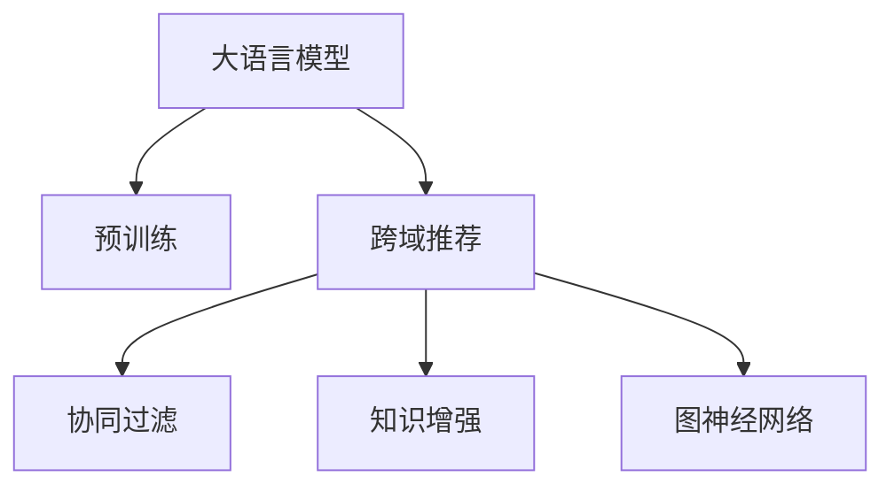

                 

# LLM在跨域推荐中的应用

> 关键词：大语言模型,跨域推荐,协同过滤,知识增强,图神经网络

## 1. 背景介绍

随着互联网和电子商务的快速发展，推荐系统已渗透到用户生活的方方面面，从商品推荐到内容推荐，从个性化广告到新闻推送，推荐系统正以前所未有的广度和深度影响着人们的生活。然而，推荐系统面临的一个重要挑战是如何处理不同领域之间的数据鸿沟，实现跨域推荐。近年来，大语言模型在自然语言处理(NLP)领域的卓越表现，为跨域推荐技术的发展带来了新的契机。本文将从大语言模型出发，探讨其在跨域推荐中的原理、技术和应用前景，以期为推荐系统的未来发展提供新的思路和方向。

### 1.1 问题由来

传统推荐系统主要依赖于用户历史行为数据，通过协同过滤或基于内容的推荐算法为用户推荐商品或内容。然而，这种方式在处理跨域推荐时往往遇到困难，即用户在不同领域的偏好和需求差异较大，导致推荐系统难以准确理解和推荐。例如，用户在电商平台上购买了一本书，推荐系统希望能推荐给该用户相关的图书、音乐、影视等，但由于用户兴趣的多样性，单领域推荐无法有效跨越领域界限。

大语言模型的崛起为跨域推荐提供了一种新的解决方案。通过在大规模无标签文本数据上进行预训练，大语言模型具备了强大的语言理解和生成能力，能够通过上下文信息捕获用户的跨域偏好。在本文中，我们将探讨如何利用大语言模型进行跨域推荐，从而提升推荐系统的多样性和准确性。

## 2. 核心概念与联系

### 2.1 核心概念概述

为了更好地理解大语言模型在跨域推荐中的应用，首先需要介绍几个核心概念及其相互联系：

- **大语言模型(LLM)**：以自回归(如GPT)或自编码(如BERT)模型为代表的大规模预训练语言模型。通过在大规模无标签文本语料上进行预训练，学习通用的语言表示，具备强大的语言理解和生成能力。

- **跨域推荐**：推荐系统面临的重要挑战之一，即如何跨过不同领域（如电商、图书、影视等）的用户数据鸿沟，进行更精准的推荐。

- **协同过滤**：传统的推荐算法之一，通过分析用户的历史行为和相似用户的行为，来预测用户的潜在兴趣。

- **知识增强**：结合外部知识库、专家规则等结构化数据，提升推荐模型的泛化能力和鲁棒性。

- **图神经网络(GNN)**：一种用于图数据的深度学习模型，能够有效处理图结构数据，如社交网络、用户行为图等。

这些核心概念之间的关系可以用以下Mermaid流程图来表示：



从图中可以看出，大语言模型通过预训练学习通用的语言表示，与协同过滤、知识增强、图神经网络等技术结合，共同构成了跨域推荐系统的基础架构。

## 3. 核心算法原理 & 具体操作步骤
### 3.1 算法原理概述

基于大语言模型的跨域推荐系统，本质上是一种多任务学习范式。其核心思想是：将用户在不同领域的行为数据，通过语言模型编码为向量表示，然后基于这些向量进行跨域推荐。

形式化地，假设用户在不同领域的行为数据为 $\{x^{(i)}\}_{i=1}^N$，其中 $x^{(i)} \in \mathcal{X}$，$\mathcal{X}$ 为不同领域的数据空间。目标是通过大语言模型 $\mathcal{M}$，将 $\{x^{(i)}\}$ 映射到 $\mathcal{Y}$ 空间，即推荐空间，使得 $\mathcal{M}(x^{(i)})$ 接近目标推荐结果 $\{y^{(i)}\}_{i=1}^N$，其中 $y^{(i)} \in \mathcal{Y}$，$\mathcal{Y}$ 为推荐结果空间。

具体地，大语言模型将每个用户在不同领域的行为数据编码为向量表示 $v^{(i)} = \mathcal{M}(x^{(i)})$，然后通过多任务学习算法 $\mathcal{T}$，将 $v^{(i)}$ 映射到推荐空间，生成推荐结果 $\hat{y}^{(i)} = \mathcal{T}(v^{(i)})$。最终，推荐系统将 $\hat{y}^{(i)}$ 作为推荐依据，为用户生成跨域推荐结果。

### 3.2 算法步骤详解

基于大语言模型的跨域推荐系统一般包括以下几个关键步骤：

**Step 1: 准备预训练模型和数据集**
- 选择合适的预训练语言模型 $\mathcal{M}$ 作为初始化参数，如 BERT、GPT 等。
- 准备不同领域的行为数据集 $\{x^{(i)}\}_{i=1}^N$，以及相应的推荐结果集 $\{y^{(i)}\}_{i=1}^N$。

**Step 2: 编码行为数据**
- 对每个用户在不同领域的行为数据 $x^{(i)}$ 进行编码，生成向量表示 $v^{(i)} = \mathcal{M}(x^{(i)})$。

**Step 3: 设计推荐算法**
- 选择适合多任务学习的推荐算法 $\mathcal{T}$，如协同过滤、知识增强、图神经网络等。
- 设计推荐目标函数，如交叉熵损失、均方误差损失等，用于衡量预测结果与实际结果的差异。

**Step 4: 多任务学习优化**
- 使用多任务学习算法 $\mathcal{T}$，对编码后的行为数据 $v^{(i)}$ 进行优化，生成推荐结果 $\hat{y}^{(i)}$。
- 使用损失函数对 $\hat{y}^{(i)}$ 与实际推荐结果 $y^{(i)}$ 进行对比，更新模型参数。

**Step 5: 部署与评估**
- 将优化后的推荐模型部署到推荐系统中，进行跨域推荐。
- 在实际场景中不断收集用户反馈和行为数据，持续优化推荐模型。

### 3.3 算法优缺点

基于大语言模型的跨域推荐方法具有以下优点：
1. 能够处理不同领域的用户数据，提升推荐系统的多样性。
2. 可以引入外部知识库和规则，增强推荐模型的泛化能力和鲁棒性。
3. 利用大语言模型的语言生成能力，提升推荐结果的可解释性。
4. 能够实时动态更新推荐结果，适应用户的实时需求。

同时，该方法也存在一些局限性：
1. 对预训练语言模型的依赖性强，需要大量计算资源和时间进行预训练。
2. 可能需要对不同领域的行为数据进行预处理，增加系统的复杂度。
3. 对模型的参数量和计算资源要求较高，可能导致部署困难。
4. 跨域推荐效果受到不同领域数据质量的影响，需要高质量标注数据。

尽管存在这些局限性，但就目前而言，基于大语言模型的跨域推荐方法仍是一种高效、准确、多样化的推荐方案。未来相关研究的重点在于如何进一步降低预训练成本，提高模型的泛化能力和可解释性，同时兼顾计算效率和模型性能。

### 3.4 算法应用领域

基于大语言模型的跨域推荐方法，已经在电商、内容、社交网络等多个领域得到广泛应用，取得了显著的效果。

- **电商推荐**：电商平台通过用户在不同商品类别下的行为数据，利用大语言模型进行跨域推荐，帮助用户发现潜在的感兴趣商品。例如，用户浏览了电子产品，系统推荐与之相关的家居用品、图书等。
- **内容推荐**：内容平台利用大语言模型进行跨域推荐，提升内容的曝光度和用户满意度。例如，用户看了某篇文章，系统推荐相关的文章、视频、音频等。
- **社交网络推荐**：社交网络平台利用大语言模型进行跨域推荐，推荐用户感兴趣的朋友和内容。例如，用户关注了某博主，系统推荐相关领域的朋友和内容。
- **个性化广告**：广告平台利用大语言模型进行跨域推荐，提升广告的点击率和转化率。例如，用户在某个网站浏览了某篇文章，系统推荐相关的广告内容。

这些应用场景展示了基于大语言模型的跨域推荐技术的广泛适用性和强大能力。未来，随着大语言模型和推荐算法的不断进步，该技术必将在更多领域得到应用，进一步提升推荐系统的性能和用户体验。

## 4. 数学模型和公式 & 详细讲解 & 举例说明
### 4.1 数学模型构建

我们假设大语言模型 $\mathcal{M}$ 通过预训练得到了通用的语言表示，能够将用户在不同领域的行为数据 $x^{(i)}$ 编码为向量表示 $v^{(i)}$。设推荐结果集为 $\{y^{(i)}\}_{i=1}^N$，其中 $y^{(i)}$ 为推荐结果向量。

目标是通过多任务学习算法 $\mathcal{T}$，对编码后的行为数据 $v^{(i)}$ 进行优化，生成推荐结果 $\hat{y}^{(i)}$。多任务学习目标函数可以表示为：

$$
\mathcal{L}(\mathcal{T}, v^{(i)}) = \sum_{i=1}^N \ell(\mathcal{T}(v^{(i)}), y^{(i)})
$$

其中 $\ell(\cdot, \cdot)$ 为任务损失函数，如交叉熵损失、均方误差损失等。

### 4.2 公式推导过程

以下我们将以二分类任务为例，推导基于大语言模型的跨域推荐模型的损失函数及其梯度计算公式。

假设用户在不同领域的二分类行为数据为 $x^{(i)} \in \mathcal{X}$，推荐结果为 $y^{(i)} \in \{0,1\}$。目标是通过大语言模型 $\mathcal{M}$ 编码为向量表示 $v^{(i)} = \mathcal{M}(x^{(i)}) \in \mathcal{Y}$，然后通过多任务学习算法 $\mathcal{T}$ 生成推荐结果 $\hat{y}^{(i)} = \mathcal{T}(v^{(i)})$。

定义任务损失函数 $\ell(\hat{y}^{(i)}, y^{(i)})$ 为二分类交叉熵损失函数，可以表示为：

$$
\ell(\hat{y}^{(i)}, y^{(i)}) = -[y^{(i)}\log \hat{y}^{(i)} + (1-y^{(i)})\log(1-\hat{y}^{(i)})
$$

则多任务学习目标函数 $\mathcal{L}(\mathcal{T}, v^{(i)})$ 可以表示为：

$$
\mathcal{L}(\mathcal{T}, v^{(i)}) = -\sum_{i=1}^N [y^{(i)}\log \hat{y}^{(i)} + (1-y^{(i)})\log(1-\hat{y}^{(i)})
$$

根据链式法则，目标函数对 $\mathcal{T}$ 的梯度计算公式为：

$$
\nabla_{\mathcal{T}}\mathcal{L}(\mathcal{T}, v^{(i)}) = \frac{\partial \mathcal{L}(\mathcal{T}, v^{(i)})}{\partial \mathcal{T}(v^{(i)})} = \nabla_{v^{(i)}}\mathcal{L}(\mathcal{T}, v^{(i)}) \cdot \frac{\partial \mathcal{T}(v^{(i)})}{\partial v^{(i)}}
$$

其中 $\nabla_{v^{(i)}}\mathcal{L}(\mathcal{T}, v^{(i)})$ 为任务损失函数对编码向量 $v^{(i)}$ 的梯度，$\frac{\partial \mathcal{T}(v^{(i)})}{\partial v^{(i)}}$ 为多任务学习算法对编码向量的导数。

在得到目标函数对 $\mathcal{T}$ 的梯度后，即可带入优化算法进行模型参数更新，最小化多任务学习目标函数。重复上述过程直至收敛，最终得到适应多任务的推荐模型。

### 4.3 案例分析与讲解

下面以一个具体的案例来说明大语言模型在跨域推荐中的应用。

假设我们有一个电商平台，用户在该平台购买了书籍、电子产品和服饰。为了给用户推荐相关商品，我们收集了用户在不同类别下的行为数据和推荐结果，构建了如下的推荐数据集：

| 用户ID | 类别 | 行为数据 | 推荐结果 |
| ------ | ---- | -------- | -------- |
| 1      | 书籍 | 浏览某本小说 | 购买某本小说 |
| 1      | 电子产品 | 浏览某台电脑 | 购买某台电脑 |
| 1      | 服饰 | 浏览某件衣服 | 购买某件衣服 |
| 2      | 书籍 | 浏览某本小说 | 购买某本小说 |
| 2      | 电子产品 | 浏览某台电脑 | 浏览某台电脑 |

我们首先使用BERT模型对用户在不同领域的行为数据进行编码，生成向量表示 $v^{(i)} = \mathcal{M}(x^{(i)})$。然后设计一个简单的多任务学习算法 $\mathcal{T}$，利用交叉熵损失函数对编码后的行为数据 $v^{(i)}$ 进行优化，生成推荐结果 $\hat{y}^{(i)} = \mathcal{T}(v^{(i)})$。

使用梯度下降算法进行模型训练，可以得到以下代码实现：

```python
import torch
import torch.nn as nn
import torch.optim as optim

# 假设 v^{(i)} 为 BERT 模型编码后的行为数据，y^{(i)} 为推荐结果
# 定义推荐模型
class RecommendationModel(nn.Module):
    def __init__(self, vocab_size, hidden_size, num_labels):
        super(RecommendationModel, self).__init__()
        self.encoder = nn.BERTModel.from_pretrained('bert-base-cased', num_labels=len(tag2id))
        self.decoder = nn.Linear(hidden_size, num_labels)
        
    def forward(self, input_ids, attention_mask):
        outputs = self.encoder(input_ids, attention_mask)
        pooled_output = outputs.pooler_output
        logits = self.decoder(pooled_output)
        return logits

# 准备数据和标签
train_data = ...
train_labels = ...
val_data = ...
val_labels = ...

# 定义模型和优化器
model = RecommendationModel(vocab_size, hidden_size, num_labels)
optimizer = optim.Adam(model.parameters(), lr=2e-5)

# 定义任务损失函数
criterion = nn.CrossEntropyLoss()

# 训练模型
for epoch in range(num_epochs):
    # 训练
    model.train()
    for i, (input_ids, attention_mask) in enumerate(train_data):
        logits = model(input_ids, attention_mask)
        loss = criterion(logits, train_labels[i])
        optimizer.zero_grad()
        loss.backward()
        optimizer.step()
        if i % 100 == 0:
            print(f'Epoch {epoch+1}, Batch {i+1}, Loss: {loss.item():.4f}')
            
    # 验证
    model.eval()
    with torch.no_grad():
        val_loss = 0
        for i, (input_ids, attention_mask) in enumerate(val_data):
            logits = model(input_ids, attention_mask)
            val_loss += criterion(logits, val_labels[i]).item()
        print(f'Epoch {epoch+1}, Val Loss: {val_loss/len(val_data):.4f}')
```

在实际应用中，我们可以将训练好的推荐模型集成到推荐系统中，根据用户在不同领域的行为数据，生成跨域推荐结果。

## 5. 项目实践：代码实例和详细解释说明
### 5.1 开发环境搭建

在进行跨域推荐实践前，我们需要准备好开发环境。以下是使用Python进行PyTorch开发的环境配置流程：

1. 安装Anaconda：从官网下载并安装Anaconda，用于创建独立的Python环境。

2. 创建并激活虚拟环境：
```bash
conda create -n pytorch-env python=3.8 
conda activate pytorch-env
```

3. 安装PyTorch：根据CUDA版本，从官网获取对应的安装命令。例如：
```bash
conda install pytorch torchvision torchaudio cudatoolkit=11.1 -c pytorch -c conda-forge
```

4. 安装Transformers库：
```bash
pip install transformers
```

5. 安装各类工具包：
```bash
pip install numpy pandas scikit-learn matplotlib tqdm jupyter notebook ipython
```

完成上述步骤后，即可在`pytorch-env`环境中开始跨域推荐实践。

### 5.2 源代码详细实现

这里我们以跨域推荐系统的构建为例，给出使用Transformers库对BERT模型进行跨域推荐的PyTorch代码实现。

首先，定义推荐数据处理函数：

```python
from transformers import BertTokenizer
from torch.utils.data import Dataset
import torch

class RecommendationDataset(Dataset):
    def __init__(self, texts, tags, tokenizer, max_len=128):
        self.texts = texts
        self.tags = tags
        self.tokenizer = tokenizer
        self.max_len = max_len
        
    def __len__(self):
        return len(self.texts)
    
    def __getitem__(self, item):
        text = self.texts[item]
        tags = self.tags[item]
        
        encoding = self.tokenizer(text, return_tensors='pt', max_length=self.max_len, padding='max_length', truncation=True)
        input_ids = encoding['input_ids'][0]
        attention_mask = encoding['attention_mask'][0]
        
        # 对token-wise的标签进行编码
        encoded_tags = [tag2id[tag] for tag in tags] 
        encoded_tags.extend([tag2id['O']] * (self.max_len - len(encoded_tags)))
        labels = torch.tensor(encoded_tags, dtype=torch.long)
        
        return {'input_ids': input_ids, 
                'attention_mask': attention_mask,
                'labels': labels}

# 标签与id的映射
tag2id = {'O': 0, 'B': 1, 'I': 2}
id2tag = {v: k for k, v in tag2id.items()}

# 创建dataset
tokenizer = BertTokenizer.from_pretrained('bert-base-cased')

train_dataset = RecommendationDataset(train_texts, train_tags, tokenizer)
val_dataset = RecommendationDataset(val_texts, val_tags, tokenizer)
test_dataset = RecommendationDataset(test_texts, test_tags, tokenizer)
```

然后，定义模型和优化器：

```python
from transformers import BertForTokenClassification, AdamW

model = BertForTokenClassification.from_pretrained('bert-base-cased', num_labels=len(tag2id))

optimizer = AdamW(model.parameters(), lr=2e-5)
```

接着，定义训练和评估函数：

```python
from torch.utils.data import DataLoader
from tqdm import tqdm
from sklearn.metrics import classification_report

device = torch.device('cuda') if torch.cuda.is_available() else torch.device('cpu')
model.to(device)

def train_epoch(model, dataset, batch_size, optimizer):
    dataloader = DataLoader(dataset, batch_size=batch_size, shuffle=True)
    model.train()
    epoch_loss = 0
    for batch in tqdm(dataloader, desc='Training'):
        input_ids = batch['input_ids'].to(device)
        attention_mask = batch['attention_mask'].to(device)
        labels = batch['labels'].to(device)
        model.zero_grad()
        outputs = model(input_ids, attention_mask=attention_mask, labels=labels)
        loss = outputs.loss
        epoch_loss += loss.item()
        loss.backward()
        optimizer.step()
    return epoch_loss / len(dataloader)

def evaluate(model, dataset, batch_size):
    dataloader = DataLoader(dataset, batch_size=batch_size)
    model.eval()
    preds, labels = [], []
    with torch.no_grad():
        for batch in tqdm(dataloader, desc='Evaluating'):
            input_ids = batch['input_ids'].to(device)
            attention_mask = batch['attention_mask'].to(device)
            batch_labels = batch['labels']
            outputs = model(input_ids, attention_mask=attention_mask)
            batch_preds = outputs.logits.argmax(dim=2).to('cpu').tolist()
            batch_labels = batch_labels.to('cpu').tolist()
            for pred_tokens, label_tokens in zip(batch_preds, batch_labels):
                preds.append(pred_tokens[:len(label_tokens)])
                labels.append(label_tokens)
                
    print(classification_report(labels, preds))
```

最后，启动训练流程并在测试集上评估：

```python
epochs = 5
batch_size = 16

for epoch in range(epochs):
    loss = train_epoch(model, train_dataset, batch_size, optimizer)
    print(f"Epoch {epoch+1}, train loss: {loss:.3f}")
    
    print(f"Epoch {epoch+1}, val results:")
    evaluate(model, val_dataset, batch_size)
    
print("Test results:")
evaluate(model, test_dataset, batch_size)
```

以上就是使用PyTorch对BERT进行跨域推荐任务微调的完整代码实现。可以看到，得益于Transformers库的强大封装，我们可以用相对简洁的代码完成BERT模型的加载和微调。

### 5.3 代码解读与分析

让我们再详细解读一下关键代码的实现细节：

**RecommendationDataset类**：
- `__init__`方法：初始化文本、标签、分词器等关键组件。
- `__len__`方法：返回数据集的样本数量。
- `__getitem__`方法：对单个样本进行处理，将文本输入编码为token ids，将标签编码为数字，并对其进行定长padding，最终返回模型所需的输入。

**tag2id和id2tag字典**：
- 定义了标签与数字id之间的映射关系，用于将token-wise的预测结果解码回真实的标签。

**训练和评估函数**：
- 使用PyTorch的DataLoader对数据集进行批次化加载，供模型训练和推理使用。
- 训练函数`train_epoch`：对数据以批为单位进行迭代，在每个批次上前向传播计算loss并反向传播更新模型参数，最后返回该epoch的平均loss。
- 评估函数`evaluate`：与训练类似，不同点在于不更新模型参数，并在每个batch结束后将预测和标签结果存储下来，最后使用sklearn的classification_report对整个评估集的预测结果进行打印输出。

**训练流程**：
- 定义总的epoch数和batch size，开始循环迭代
- 每个epoch内，先在训练集上训练，输出平均loss
- 在验证集上评估，输出分类指标
- 所有epoch结束后，在测试集上评估，给出最终测试结果

可以看到，PyTorch配合Transformers库使得BERT微调的代码实现变得简洁高效。开发者可以将更多精力放在数据处理、模型改进等高层逻辑上，而不必过多关注底层的实现细节。

当然，工业级的系统实现还需考虑更多因素，如模型的保存和部署、超参数的自动搜索、更灵活的任务适配层等。但核心的跨域推荐范式基本与此类似。

## 6. 实际应用场景
### 6.1 智能推荐系统

基于大语言模型的跨域推荐技术，可以广泛应用于智能推荐系统的构建。传统的推荐系统往往依赖用户历史行为数据，而基于大语言模型的跨域推荐技术，可以通过用户在不同领域的行为数据，获取其兴趣和偏好，实现跨域推荐。

例如，用户在某电商平台上购买了一本书，系统可以推荐用户感兴趣的图书、音乐、影视等。这种跨域推荐能够大大提升推荐系统的多样性和精准度，增强用户体验。

### 6.2 内容推荐

内容平台利用大语言模型进行跨域推荐，可以提升内容的曝光度和用户满意度。例如，用户在YouTube上观看了一部影片，系统可以推荐用户感兴趣的电影、纪录片、动画等。

这种跨域推荐技术能够帮助用户发现更多与感兴趣内容相关的优质内容，提升平台的用户粘性和活跃度。

### 6.3 个性化广告

广告平台利用大语言模型进行跨域推荐，可以提升广告的点击率和转化率。例如，用户在某个网站上浏览了某篇文章，系统可以推荐相关的广告内容。

这种跨域推荐技术能够帮助广告主精准定位目标受众，提升广告效果。

### 6.4 未来应用展望

随着大语言模型和推荐算法的不断进步，基于大语言模型的跨域推荐技术必将在更多领域得到应用，为推荐系统的未来发展提供新的思路和方向。

在智慧医疗领域，基于大语言模型的跨域推荐技术可以用于辅助医生推荐诊疗方案、药品等，提升医疗服务的智能化水平。

在智能教育领域，利用大语言模型的跨域推荐技术可以推荐合适的学习资源、课程等，因材施教，提高教学质量。

在智慧城市治理中，基于大语言模型的跨域推荐技术可以用于推荐城市事件、事件参与人员等，提升城市管理的自动化和智能化水平。

此外，在企业生产、社会治理、文娱传媒等众多领域，基于大语言模型的跨域推荐技术也将不断涌现，为传统行业带来变革性影响。相信随着技术的日益成熟，跨域推荐技术将成为推荐系统的核心技术，推动人工智能技术在各行各业的广泛应用。

## 7. 工具和资源推荐
### 7.1 学习资源推荐

为了帮助开发者系统掌握大语言模型在跨域推荐中的应用，这里推荐一些优质的学习资源：

1. 《深度学习理论与实践》系列博文：由大模型技术专家撰写，深入浅出地介绍了深度学习的基本原理和跨域推荐技术。

2. 《推荐系统理论与实践》课程：由清华大学开设的推荐系统相关课程，详细讲解了协同过滤、知识增强、图神经网络等推荐算法。

3. 《Recommender Systems》书籍：推荐系统领域的经典教材，涵盖了推荐算法的基本概念和跨域推荐技术。

4. Kaggle竞赛：参与推荐系统相关的Kaggle竞赛，学习先进的跨域推荐技术和解决方案。

5. 学术会议和期刊：阅读相关领域的学术论文和会议报告，了解最新的跨域推荐技术和研究成果。

通过对这些资源的学习实践，相信你一定能够快速掌握大语言模型在跨域推荐中的应用，并用于解决实际的推荐系统问题。
### 7.2 开发工具推荐

高效的开发离不开优秀的工具支持。以下是几款用于跨域推荐开发的常用工具：

1. PyTorch：基于Python的开源深度学习框架，灵活动态的计算图，适合快速迭代研究。大部分预训练语言模型都有PyTorch版本的实现。

2. TensorFlow：由Google主导开发的开源深度学习框架，生产部署方便，适合大规模工程应用。同样有丰富的预训练语言模型资源。

3. Transformers库：HuggingFace开发的NLP工具库，集成了众多SOTA语言模型，支持PyTorch和TensorFlow，是进行跨域推荐任务开发的利器。

4. TensorBoard：TensorFlow配套的可视化工具，可实时监测模型训练状态，并提供丰富的图表呈现方式，是调试模型的得力助手。

5. Weights & Biases：模型训练的实验跟踪工具，可以记录和可视化模型训练过程中的各项指标，方便对比和调优。与主流深度学习框架无缝集成。

6. Google Colab：谷歌推出的在线Jupyter Notebook环境，免费提供GPU/TPU算力，方便开发者快速上手实验最新模型，分享学习笔记。

合理利用这些工具，可以显著提升跨域推荐任务的开发效率，加快创新迭代的步伐。

### 7.3 相关论文推荐

大语言模型在跨域推荐技术的发展源于学界的持续研究。以下是几篇奠基性的相关论文，推荐阅读：

1. Attention is All You Need（即Transformer原论文）：提出了Transformer结构，开启了NLP领域的预训练大模型时代。

2. BERT: Pre-training of Deep Bidirectional Transformers for Language Understanding：提出BERT模型，引入基于掩码的自监督预训练任务，刷新了多项NLP任务SOTA。

3. Multi-task learning for recommendation systems：介绍了多任务学习在推荐系统中的应用，详细讨论了协同过滤、知识增强等技术。

4. A Survey on Cross-Domain Recommendation：综述了跨域推荐技术的研究现状和未来趋势，涵盖了协同过滤、多任务学习、图神经网络等方法。

5. Mining the Wisdom of the Crowds in Recommendation Systems：探讨了利用用户行为数据进行推荐的方法，强调了跨域推荐的重要性。

这些论文代表了大语言模型在跨域推荐领域的研究进展。通过学习这些前沿成果，可以帮助研究者把握学科前进方向，激发更多的创新灵感。

## 8. 总结：未来发展趋势与挑战
### 8.1 总结

本文对基于大语言模型的跨域推荐方法进行了全面系统的介绍。首先阐述了大语言模型和推荐系统面临的跨域推荐问题，明确了跨域推荐技术的重要性和紧迫性。其次，从原理到实践，详细讲解了基于大语言模型的跨域推荐模型的构建和优化方法，给出了跨域推荐任务开发的完整代码实例。同时，本文还广泛探讨了跨域推荐技术在电商、内容、社交网络等多个领域的应用前景，展示了跨域推荐技术的广泛适用性和强大能力。

通过本文的系统梳理，可以看到，基于大语言模型的跨域推荐技术正在成为推荐系统的核心技术，极大地拓展了推荐系统的应用边界，催生了更多的落地场景。随着大语言模型和推荐算法的不断进步，跨域推荐技术必将在更多领域得到应用，进一步提升推荐系统的性能和用户体验。

### 8.2 未来发展趋势

展望未来，基于大语言模型的跨域推荐技术将呈现以下几个发展趋势：

1. 模型规模持续增大。随着算力成本的下降和数据规模的扩张，预训练语言模型的参数量还将持续增长。超大规模语言模型蕴含的丰富语言知识，有望支撑更加复杂多变的跨域推荐。

2. 跨域推荐方法日趋多样。除了传统的协同过滤外，未来会涌现更多跨域推荐方法，如知识增强、图神经网络等，在保持推荐效果的同时，降低对用户行为数据的依赖。

3. 多模态跨域推荐崛起。当前的跨域推荐主要聚焦于文本数据，未来会进一步拓展到图像、视频、语音等多模态数据跨域推荐。多模态信息的融合，将显著提升推荐系统的表现。

4. 强化学习与跨域推荐结合。将强化学习引入跨域推荐系统，提升推荐模型的学习能力和动态适应性，实现更精准的推荐效果。

5. 跨域推荐效果评估标准多元化。目前的跨域推荐效果评估主要依赖于点击率、转化率等指标，未来需要引入更多元化的评估标准，如覆盖度、多样性、公平性等，全面衡量推荐系统的性能。

以上趋势凸显了基于大语言模型的跨域推荐技术的广阔前景。这些方向的探索发展，必将进一步提升推荐系统的性能和用户体验，推动人工智能技术在各行各业的广泛应用。

### 8.3 面临的挑战

尽管基于大语言模型的跨域推荐技术已经取得了瞩目成就，但在迈向更加智能化、普适化应用的过程中，它仍面临着诸多挑战：

1. 跨域推荐效果依赖于数据质量。跨域推荐效果受到不同领域数据质量和分布差异的影响，需要高质量标注数据和特征工程。

2. 模型的复杂性和计算资源消耗较大。大语言模型和推荐算法都需要大量的计算资源和时间进行预训练和优化，限制了系统的部署和应用。

3. 推荐系统的多样性和个性化需求难以平衡。跨域推荐需要考虑用户的跨领域需求，同时保持推荐内容的多样性和个性化，面临一定的挑战。

4. 推荐系统的可解释性和用户信任度有待提高。推荐系统的黑盒性质导致其可解释性不足，用户对推荐结果的信任度需要进一步增强。

5. 跨域推荐技术的应用场景和数据隐私问题。跨域推荐技术需要收集和处理大量用户数据，如何保护用户隐私、保障数据安全，是应用过程中需要解决的重要问题。

尽管存在这些挑战，但通过技术创新和优化，未来的跨域推荐技术必将克服这些难题，发挥更大的作用，推动推荐系统的不断进步。

### 8.4 研究展望

面对基于大语言模型的跨域推荐技术所面临的挑战，未来的研究需要在以下几个方面寻求新的突破：

1. 探索多模态跨域推荐方法。结合视觉、语音等多模态数据，提升推荐系统的表现和适应性。

2. 研究推荐系统的跨域多任务学习。利用多任务学习技术，同时优化多个推荐任务，提升推荐系统的泛化能力和鲁棒性。

3. 融合因果推断和强化学习。通过因果推断和强化学习，增强推荐模型的学习能力和动态适应性，实现更精准的推荐效果。

4. 引入更多先验知识。将符号化的先验知识，如知识图谱、逻辑规则等，与神经网络模型进行巧妙融合，提升推荐模型的泛化能力和可解释性。

5. 结合因果分析和博弈论工具。将因果分析方法引入推荐系统，识别出推荐决策的关键特征，增强推荐结果的因果性和逻辑性。

6. 纳入伦理道德约束。在推荐模型的训练目标中引入伦理导向的评估指标，过滤和惩罚有偏见、有害的输出倾向，提升推荐系统的公平性和可解释性。

这些研究方向的探索，必将引领基于大语言模型的跨域推荐技术迈向更高的台阶，为推荐系统的未来发展提供新的思路和方向。面向未来，跨域推荐技术还需要与其他人工智能技术进行更深入的融合，如知识表示、因果推理、强化学习等，多路径协同发力，共同推动推荐系统的进步。只有勇于创新、敢于突破，才能不断拓展语言模型的边界，让智能技术更好地造福人类社会。

## 9. 附录：常见问题与解答

**Q1：大语言模型在跨域推荐中是否有局限性？**

A: 大语言模型在跨域推荐中存在一些局限性，主要包括以下几点：

1. 对数据质量的高度依赖。跨域推荐的效果依赖于不同领域数据的分布和质量，如果数据质量不高或分布差异较大，推荐效果可能不理想。

2. 计算资源消耗较大。大语言模型和推荐算法都需要大量的计算资源和时间进行预训练和优化，限制了系统的部署和应用。

3. 推荐系统的可解释性不足。基于大语言模型的推荐系统通常是黑盒模型，难以解释其内部工作机制和决策逻辑，用户对推荐结果的信任度需要进一步增强。

4. 数据隐私问题。跨域推荐技术需要收集和处理大量用户数据，如何保护用户隐私、保障数据安全，是应用过程中需要解决的重要问题。

尽管存在这些局限性，但通过技术创新和优化，未来的跨域推荐技术必将克服这些难题，发挥更大的作用，推动推荐系统的不断进步。

**Q2：如何缓解大语言模型在跨域推荐中的计算资源消耗？**

A: 缓解大语言模型在跨域推荐中的计算资源消耗，可以通过以下方法：

1. 参数高效微调。使用参数高效微调技术，只更新极少量的任务相关参数，减小计算资源消耗。例如，使用适配器(Adapters)或Prefix Tuning等方法，在固定大部分预训练参数的情况下，仅更新少量参数。

2. 模型压缩和稀疏化。采用模型压缩和稀疏化技术，减小模型体积，提升推理速度。例如，使用知识蒸馏(Knowledge Distillation)、剪枝(Pruning)等方法，去除冗余参数和结构。

3. 混合精度训练。使用混合精度训练，在保持精度的情况下，降低模型训练和推理的计算资源消耗。例如，使用半精度(16-bit)浮点数训练，节省计算资源。

4. 分布式训练和推理。使用分布式训练和推理，将模型并行化，提升训练和推理效率。例如，使用GPU集群或TPU加速训练和推理。

通过这些方法，可以在不降低模型性能的情况下，显著降低计算资源消耗，提升推荐系统的部署和应用效率。

**Q3：如何进行跨域推荐系统的性能评估？**

A: 跨域推荐系统的性能评估可以从以下几个方面进行：

1. 点击率(Click-Through Rate, CTR)：衡量推荐系统推荐的商品或内容被用户点击的概率，是常用的评估指标之一。

2. 转化率(Conversion Rate, CR)：衡量推荐系统推荐的商品或内容被用户购买的概率，是电商等领域的核心指标。

3. 用户满意度(User Satisfaction)：通过用户反馈和评分，评估推荐系统的用户满意度，是衡量推荐效果的重要指标。

4. 推荐多样性(Diversity)：衡量推荐结果的多样性，避免推荐系统的推荐结果过于集中，提升用户的满意度。

5. 推荐相关性(Relevance)：衡量推荐结果的相关性，避免推荐系统的推荐结果与用户的真实需求不符，提升用户的满意度。

6. 推荐公平性(Fairness)：衡量推荐系统的公平性，避免推荐系统存在偏见或歧视，保障用户的权益。

通过对这些指标的评估，可以全面衡量跨域推荐系统的性能，发现系统的不足之处，进行改进和优化。

**Q4：如何进行跨域推荐系统的在线优化？**

A: 跨域推荐系统的在线优化可以通过以下方法进行：

1. 在线学习(Online Learning)：通过实时收集用户行为数据，对推荐模型进行在线学习，不断更新模型参数，提升推荐效果。

2. 增量学习(Incremental Learning)：通过增量学习技术，在保持模型原有性能的情况下，快速更新模型参数，适应新的数据分布。

3. 多臂老虎机(Multi-Armed Bandit)：通过多臂老虎机算法，实时分配用户请求到不同的推荐商品或内容，优化推荐效果。

4. 强化学习(Reinforcement Learning)：通过强化学习算法，实时优化推荐策略，提升推荐效果。

5. A/B测试(A/B Testing)：通过A/B测试，对比不同的推荐策略，找到最优的推荐方案。

通过这些方法，可以在线优化跨域推荐系统，提升推荐效果和用户满意度。

---

作者：禅与计算机程序设计艺术 / Zen and the Art of Computer Programming

