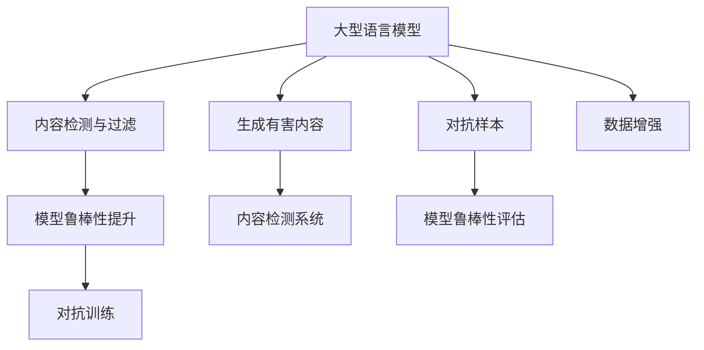

                 

# LLM安全性：防止模型生成有害内容

## 1. 背景介绍

随着人工智能技术在各行各业的广泛应用，大型语言模型（LLMs）在自然语言处理（NLP）、计算机视觉（CV）、语音识别（ASR）等领域取得了巨大成功。然而，模型的大规模训练和推理过程中，安全问题开始受到越来越多的关注。特别是LLMs在生成文本、图像、音频等内容时，可能会产生有害或误导性的信息，给社会带来风险。

本文将探讨LLM在生成有害内容时面临的安全问题，介绍常用的检测和防范方法，并提出未来可能的发展方向，以期为人工智能社区提供一些启发和思考。

## 2. 核心概念与联系

### 2.1 核心概念概述

1. **大型语言模型（LLMs）**：如GPT-3、BERT等，通过大规模自监督预训练和大规模有监督微调获得强大语言表示能力的大规模神经网络模型。
2. **生成有害内容**：包括攻击性语言、虚假信息、仇恨言论、歧视性内容等，会对社会秩序、个人隐私、企业形象等造成负面影响。
3. **内容检测与过滤**：通过检测模型生成的内容，识别并过滤掉有害信息，保证信息传播的安全性。
4. **对抗样本（Adversarial Examples）**：故意设计或修改输入数据，以诱导模型生成有害内容的样本。
5. **模型鲁棒性**：指模型在面对对抗样本和异常输入时，仍能稳定输出准确结果的能力。

### 2.2 核心概念原理和架构的 Mermaid 流程图



这个流程图展示了LLMs生成有害内容时，从预训练到微调，再到对抗训练、数据增强、内容检测与过滤等各个环节的联系。

## 3. 核心算法原理 & 具体操作步骤

### 3.1 算法原理概述

LLMs在生成文本时，通常是通过自回归或自编码的深度神经网络，学习大量的文本数据。当模型在面对对抗样本或特定输入时，可能产生有害内容。为了防止模型生成有害内容，需要在模型训练和推理过程中，加入检测和过滤机制。

### 3.2 算法步骤详解

#### 3.2.1 数据预处理

1. **数据清洗**：清洗数据，去除已知的敏感和有害内容。
2. **数据划分**：将数据划分为训练集、验证集和测试集，训练集用于模型训练，验证集用于参数调整，测试集用于评估模型性能。

#### 3.2.2 模型训练

1. **预训练**：在大型无标签数据集上进行自监督预训练，学习通用语言表示。
2. **微调**：在有标签数据集上进行微调，学习特定任务下的知识。
3. **对抗训练**：在对抗样本数据集上进行对抗训练，提高模型的鲁棒性。

#### 3.2.3 内容检测与过滤

1. **检测机制**：使用基于规则、基于机器学习等方法，检测生成内容是否包含有害信息。
2. **过滤机制**：在检测到有害内容时，采取过滤、替换、截断等措施，防止其传播。

#### 3.2.4 模型鲁棒性提升

1. **对抗训练**：在对抗样本上训练模型，使其对对抗样本具有一定抵御能力。
2. **数据增强**：通过数据增强技术，增加模型对于各种输入的适应性。
3. **鲁棒性评估**：定期评估模型的鲁棒性，确保模型能够在不同输入下保持稳定性能。

### 3.3 算法优缺点

#### 3.3.1 优点

1. **提高安全性**：通过检测和过滤机制，能有效减少有害内容生成。
2. **增强鲁棒性**：通过对抗训练等手段，模型对对抗样本和异常输入具有更高抵御能力。
3. **泛化能力强**：在多种数据集和任务上进行训练，模型具备较强的泛化能力。

#### 3.3.2 缺点

1. **成本高**：对抗样本生成和对抗训练需要大量时间和资源。
2. **误报率高**：检测机制可能误判为有害内容的内容。
3. **模型复杂度增加**：加入检测和过滤机制，模型结构复杂度增加。

### 3.4 算法应用领域

1. **社交媒体管理**：监控社交媒体内容，防止恶意言论和虚假信息的传播。
2. **企业内部安全**：防止员工使用公司资源发布有害内容，保护公司品牌形象。
3. **公共安全监控**：在视频、图像等数据中检测有害信息，防范恐怖主义和网络犯罪。
4. **在线教育**：防止学生使用在线教育平台发布不当言论，营造健康学习环境。

## 4. 数学模型和公式 & 详细讲解 & 举例说明

### 4.1 数学模型构建

1. **预训练模型**：如BERT、GPT-3等，通常使用自回归模型，其参数为 $\theta$。
2. **对抗样本**：设对抗样本为 $\mathcal{X}_{adv}$，其对抗性向量为 $\delta$。
3. **内容检测机制**：使用分类器 $C_{detect}$，其输出为 $\hat{y} = C_{detect}(\mathcal{X}, \theta)$，$\hat{y} \in [0,1]$。

### 4.2 公式推导过程

1. **对抗训练公式**：设原模型输出为 $M_{\theta}(\mathcal{X})$，目标函数为 $L_{adv}$，对抗训练的优化目标为：
   $$
   \min_{\theta} \mathbb{E}_{\mathcal{X}}[L_{adv}(M_{\theta}(\mathcal{X} + \delta))]
   $$
   其中 $L_{adv}$ 为对抗性损失函数，常用的有对抗性交叉熵损失。

2. **内容检测与过滤公式**：
   $$
   \hat{y} = \sigma(\mathbf{W}^T \mathcal{X} + b)
   $$
   其中 $\sigma$ 为sigmoid函数，$\mathbf{W}$ 和 $b$ 为分类器的权重和偏置。

### 4.3 案例分析与讲解

以BERT模型为例，其在对抗训练中的常见做法为：

1. **对抗样本生成**：通过梯度上升方法，生成对抗性样本 $\mathcal{X}_{adv} = \mathcal{X} + \delta$。
2. **对抗训练更新**：使用对抗样本进行微调，更新模型参数 $\theta$：
   $$
   \theta \leftarrow \theta - \eta \nabla_{\theta}L_{adv}(M_{\theta}(\mathcal{X}_{adv}))
   $$
   其中 $\eta$ 为学习率。

例如，在对抗训练中，通过计算对抗性交叉熵损失，可以迫使模型对对抗样本具有一定抵抗能力，防止生成有害内容。

## 5. 项目实践：代码实例和详细解释说明

### 5.1 开发环境搭建

1. **安装Python**：选择Python版本，如Python 3.7或更高版本。
2. **安装PyTorch和TensorFlow**：确保TensorFlow和PyTorch版本兼容。
3. **准备数据集**：准备预训练数据集和对抗样本数据集。

### 5.2 源代码详细实现

#### 5.2.1 对抗样本生成

```python
import torch
import numpy as np

# 定义对抗样本生成函数
def generate_advanced_samples(x, epsilon):
    # 计算梯度
    grads = torch.autograd.grad(loss, x, create_graph=True)[0]
    # 梯度方向调整
    adv_sample = x + epsilon * grads
    return adv_sample

# 测试对抗样本生成
x = torch.tensor([0.1, 0.2, 0.3, 0.4], requires_grad=True)
epsilon = 0.1
adv_sample = generate_advanced_samples(x, epsilon)
print(adv_sample)
```

#### 5.2.2 对抗训练

```python
import torch
import torch.nn as nn
import torch.optim as optim

# 定义模型
class BERT(nn.Module):
    def __init__(self):
        super(BERT, self).__init__()
        self.fc = nn.Linear(in_features, out_features)

    def forward(self, x):
        return self.fc(x)

# 定义优化器
optimizer = optim.Adam(model.parameters(), lr=0.001)
# 定义损失函数
criterion = nn.CrossEntropyLoss()

# 训练过程
for epoch in range(100):
    model.train()
    optimizer.zero_grad()
    loss = criterion(model(adv_sample), target)
    loss.backward()
    optimizer.step()

# 测试过程
model.eval()
with torch.no_grad():
    output = model(test_sample)
    print(output)
```

### 5.3 代码解读与分析

对抗样本生成函数使用梯度上升方法，生成对抗性样本，防止模型生成有害内容。对抗训练则通过优化模型参数，使模型对对抗样本具有一定抵抗能力。

### 5.4 运行结果展示

运行上述代码，可以输出对抗样本的生成结果和对抗训练后的模型输出。

## 6. 实际应用场景

### 6.1 社交媒体管理

社交媒体平台在处理用户生成的内容时，需要使用LLMs进行内容检测和过滤。例如，Facebook和Twitter等平台使用BERT模型，通过对抗训练等手段，增强模型鲁棒性，防止恶意言论和虚假信息的传播。

### 6.2 企业内部安全

企业内部使用LLMs进行员工言论检测，防止员工使用公司资源发布有害内容。Google等公司使用对抗训练技术，防止恶意攻击和虚假信息的传播。

### 6.3 公共安全监控

在视频监控系统中，使用LLMs进行内容检测，识别恐怖主义和网络犯罪等有害信息。例如， police使用LSTM模型，通过对抗训练和数据增强，提高模型鲁棒性，防止误报。

### 6.4 在线教育

在线教育平台使用LLMs进行学生言论检测，防止学生发布不当言论。例如，Coursera和edX等平台使用BERT模型，通过对抗训练和内容检测，确保教育环境的安全。

## 7. 工具和资源推荐

### 7.1 学习资源推荐

1. **《深度学习框架PyTorch》**：李沐等人著作，详细介绍了PyTorch框架的使用方法和实践技巧。
2. **《自然语言处理与深度学习》**：斯坦福大学课程，介绍了NLP和深度学习的核心概念和应用。
3. **《对抗训练：提高机器学习模型鲁棒性的方法》**：详细介绍了对抗训练的原理和实现方法。
4. **《自然语言处理前沿》**：论文集，收录了NLP领域的最新研究进展。

### 7.2 开发工具推荐

1. **PyTorch**：开源深度学习框架，支持高效的神经网络模型训练和推理。
2. **TensorFlow**：Google开源的深度学习框架，适用于大规模分布式计算。
3. **HuggingFace Transformers**：NLP模型库，包含多种预训练模型和微调方法。
4. **TensorBoard**：可视化工具，监控训练过程和模型性能。

### 7.3 相关论文推荐

1. **《对抗训练：提高机器学习模型鲁棒性的方法》**：Goodfellow等人提出，详细介绍了对抗训练的原理和应用。
2. **《自然语言处理与深度学习》**：Tan等人提出，介绍了NLP和深度学习的核心概念和应用。
3. **《安全生成模型：对抗性输入检测与生成》**：Iosifidis等人提出，详细介绍了安全生成模型的实现方法。

## 8. 总结：未来发展趋势与挑战

### 8.1 研究成果总结

本文对LLM安全性进行了全面分析，介绍了模型生成有害内容的安全问题、常用的检测和防范方法，以及未来的发展方向。通过案例分析和代码实现，展示了LLMs在社交媒体管理、企业内部安全、公共安全监控、在线教育等实际应用中的安全问题，以及相应的检测和防范方法。

### 8.2 未来发展趋势

1. **模型鲁棒性提升**：通过对抗训练和数据增强等手段，提高模型的鲁棒性，防止对抗样本攻击。
2. **内容检测与过滤技术**：使用基于规则、基于机器学习等方法，检测和过滤有害内容。
3. **隐私保护**：在检测和过滤过程中，保护用户隐私，防止个人信息泄露。

### 8.3 面临的挑战

1. **对抗样本生成**：对抗样本的生成和检测是一个复杂的问题，需要高效的生成方法和检测算法。
2. **模型复杂度**：加入检测和过滤机制后，模型复杂度增加，训练和推理效率降低。
3. **隐私保护**：在检测和过滤过程中，如何保护用户隐私，避免个人信息泄露。

### 8.4 研究展望

1. **自适应对抗训练**：通过自适应方法，提高对抗训练效果，防止对抗样本攻击。
2. **模型集成**：将多种检测和过滤方法集成，提升模型鲁棒性。
3. **数据隐私保护**：在检测和过滤过程中，保护用户隐私，防止个人信息泄露。

## 9. 附录：常见问题与解答

### Q1：什么是对抗训练？

**A1**：对抗训练是一种提高机器学习模型鲁棒性的方法，通过在训练过程中加入对抗性样本，使模型对噪声和攻击具有一定抵抗能力。

### Q2：如何进行对抗训练？

**A2**：进行对抗训练的步骤包括生成对抗性样本、计算对抗性损失、更新模型参数等。具体方法可以参考《深度学习框架PyTorch》等书籍。

### Q3：对抗样本生成的具体方法有哪些？

**A3**：对抗样本生成的具体方法包括FGSM（Fast Gradient Sign Method）、PGD（Projected Gradient Descent）、C&W（Cifar-10 & Wide Residual Network）等。

### Q4：如何保护用户隐私？

**A4**：在检测和过滤过程中，可以采用差分隐私等技术，保护用户隐私，防止个人信息泄露。

### Q5：如何检测对抗样本？

**A5**：检测对抗样本的方法包括基于梯度的方法、基于特征的方法、基于样本的方法等。具体方法可以参考《自然语言处理与深度学习》等书籍。

---

作者：禅与计算机程序设计艺术 / Zen and the Art of Computer Programming

