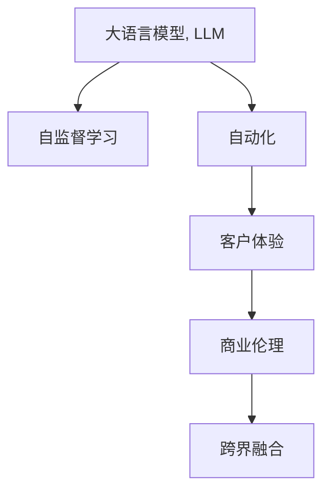

                 

# LLM对传统商业模式的颠覆与创新

## 1. 背景介绍

### 1.1 问题由来
在商业世界，传统模式与人工智能的碰撞总是引人深思。自大模型（LLM, Large Language Models）诞生以来，其巨大的潜力已在众多领域得到验证。然而，LLM对传统商业模式的影响到底有多深远，它的颠覆与创新意义又有多重要？本文将从背景、原理、应用、未来展望等多方面探讨LLM如何改变商业竞争格局，重塑产业价值链。

### 1.2 问题核心关键点
LLM作为新一代的语言处理技术，其强大的语言生成能力和理解力使其在商业应用中具有独特的优势。但它的引入同样对传统商业模式带来了冲击和挑战。本文将重点讨论以下核心关键点：
1. 数据驱动 vs. 模型驱动：LLM从模型驱动转向数据驱动，对传统商业数据处理和分析模式的影响。
2. 客户体验与个性化：LLM如何提升客户体验，实现个性化的服务与推荐。
3. 自动化与效率：LLM对商业流程自动化的影响，包括自动化客服、自动化审计等。
4. 商业伦理与安全性：在LLM驱动的商业模式中，如何确保算法伦理和数据安全。
5. 跨界融合与创新：LLM如何推动不同领域跨界融合，创造新的商业机会。

## 2. 核心概念与联系

### 2.1 核心概念概述

为更好地理解LLM在商业应用中的颠覆与创新，我们先介绍几个关键概念：

- 大语言模型（LLM）：以Transformer架构为代表的大规模预训练语言模型，通过海量的无标签数据进行自监督预训练，学习到丰富的语言知识。
- 自监督学习：无标签数据上的学习方式，通过数据内在关系进行预测和调整，提升模型泛化能力。
- 自动化：通过技术手段减少人工干预，提高效率和一致性。
- 商业伦理：企业行为准则，强调合法、公正、透明，保障用户权益。
- 跨界融合：不同领域的知识和技术结合，产生新的商业价值和模式。

这些概念之间的逻辑关系可以通过以下Mermaid流程图来展示：



此图展示了LLM与商业世界之间的内在联系：LLM通过自监督学习获取知识，进而驱动自动化，改善客户体验，保证商业伦理，推动跨界融合，最终产生商业价值。

### 2.2 核心概念原理和架构

**大语言模型**：
- 架构：基于Transformer结构，通过自注意力机制捕捉上下文信息。
- 原理：自监督学习任务，如掩码语言模型、预训练Next Sentence Prediction（Next Sentence Prediction）等，使模型学习到语言的潜在结构和语义关系。

**自监督学习**：
- 原理：使用大规模无标签数据进行模型训练，通过预测数据内在的关联性来调整模型参数。
- 应用：提升模型泛化能力，适应各种不同任务。

**自动化**：
- 原理：使用AI技术代替人力，自动化执行重复性或高复杂性的任务。
- 应用：自动化客服、自动化审计、自动化市场营销等。

**客户体验**：
- 原理：基于用户行为和反馈，通过个性化推荐和互动，提升用户体验。
- 应用：个性化推荐系统、智能客服、虚拟助手等。

**商业伦理**：
- 原理：确保企业行为符合法律法规、伦理道德标准。
- 应用：数据隐私保护、算法透明性、公平性、安全性等。

**跨界融合**：
- 原理：不同领域的知识与技术的结合，产生新的商业模式和技术创新。
- 应用：智能制造、智慧医疗、智能城市、金融科技等。

## 3. 核心算法原理 & 具体操作步骤

### 3.1 算法原理概述

在商业应用中，LLM主要利用自监督学习提升模型泛化能力，进而驱动自动化，改善客户体验，保障商业伦理，推动跨界融合。

1. **自监督学习**：通过大规模无标签数据进行预训练，学习到丰富的语言表示，提升了模型在特定任务上的泛化能力。
2. **自动化**：基于训练好的模型，执行自动化操作，减少人力成本，提升效率。
3. **客户体验**：利用模型进行个性化推荐和互动，提升客户满意度和忠诚度。
4. **商业伦理**：在模型开发和应用中确保合规、公正、透明。
5. **跨界融合**：将LLM与不同领域知识结合，创造新的商业价值。

### 3.2 算法步骤详解

**步骤1: 数据收集与预处理**
- 收集相关领域数据，并进行清洗、标注、归一化等预处理。
- 选择合适的预训练模型，进行数据增强和数据集划分。

**步骤2: 模型训练与微调**
- 在预训练模型的基础上，使用任务相关数据进行微调，优化模型在特定任务上的性能。
- 应用正则化技术，如L2正则、Dropout等，防止过拟合。

**步骤3: 自动化部署**
- 将微调好的模型部署到自动化系统中，与现有系统进行整合。
- 设定自动化规则和策略，确保系统稳定性和高效性。

**步骤4: 用户体验优化**
- 设计个性化推荐算法，使用户体验更加流畅。
- 进行A/B测试，持续优化模型参数和用户界面。

**步骤5: 伦理与安全评估**
- 对模型进行伦理和安全评估，确保其公平性、透明性和安全性。
- 建立数据隐私保护机制，保障用户数据安全。

**步骤6: 跨界融合与创新**
- 探索不同领域知识与技术的结合点，创造新的商业模式。
- 设计实验，验证新商业模式的可行性和商业价值。

### 3.3 算法优缺点

**优点**：
- 提高效率：自动化操作减少了人力成本，提升了处理速度。
- 增强客户体验：个性化推荐和互动提升客户满意度和忠诚度。
- 提升泛化能力：自监督学习提升了模型在特定任务上的泛化能力。

**缺点**：
- 依赖数据：模型效果受数据质量影响较大，获取高质量数据成本高。
- 模型复杂度：大模型训练和推理复杂度高，资源消耗大。
- 伦理与安全问题：模型公平性、透明性和安全性需持续关注。

### 3.4 算法应用领域

**零售行业**：
- 个性化推荐系统：利用LLM提升推荐准确性，提升销售额。
- 库存管理：通过智能预测需求，优化库存配置。

**金融行业**：
- 客户服务：通过自动化客服提高服务效率，降低成本。
- 风险评估：利用LLM分析信用报告，提升风险评估准确性。

**医疗行业**：
- 诊断支持：通过LLM辅助医生进行初步诊断，提高诊疗效率。
- 健康监测：利用自然语言处理分析患者描述，发现健康问题。

**教育行业**：
- 个性化学习：通过自然语言理解，提供个性化学习方案。
- 自动评分：利用LLM自动批改作业，减轻教师负担。

## 4. 数学模型和公式 & 详细讲解 & 举例说明

### 4.1 数学模型构建

在商业应用中，LLM主要用于语言理解和生成，例如文本分类、命名实体识别、情感分析等任务。以下是其中一些常见任务的数学模型构建。

**文本分类**：
- 目标：将文本分类到预定义的类别中。
- 模型：Transformer编码器-分类器结构，预训练的BERT模型。
- 输入：文本序列，分词后转化为向量表示。
- 输出：类别预测概率。

**命名实体识别**：
- 目标：识别文本中的实体（人名、地名、组织机构等）。
- 模型：BERT+CRF（条件随机场）。
- 输入：文本序列，分词后转化为向量表示。
- 输出：实体序列和实体类型。

**情感分析**：
- 目标：分析文本情感倾向（正面、负面、中性）。
- 模型：Transformer+全连接层。
- 输入：文本序列，分词后转化为向量表示。
- 输出：情感类别预测概率。

### 4.2 公式推导过程

以文本分类任务为例，使用BERT模型进行微调，推导其公式过程。

- **输入表示**：将文本序列转化为BERT模型输入，分词后转化为向量表示。
- **前向传播**：通过BERT模型得到表示向量。
- **分类器**：将向量输入全连接分类器，得到预测概率。
- **损失函数**：使用交叉熵损失函数计算模型与真实标签之间的差异。
- **优化器**：使用Adam优化器更新模型参数，最小化损失函数。

具体公式如下：

$$
H = BERT(\text{tokens}) \\
P = MLP(H) \\
L = CE(P, y) \\
\theta = \theta - \eta \nabla_{\theta}L
$$

其中，$H$ 表示BERT模型输出向量，$P$ 表示分类器输出概率，$L$ 表示交叉熵损失，$\theta$ 表示模型参数，$\eta$ 表示学习率，$\nabla_{\theta}L$ 表示损失函数对模型参数的梯度。

### 4.3 案例分析与讲解

**案例1: 零售行业个性化推荐系统**
- 使用BERT模型对用户行为数据进行微调，预测用户偏好，推荐商品。
- 数据分析：收集用户浏览、点击、购买行为数据。
- 模型训练：将数据划分为训练集、验证集和测试集，使用BERT模型进行微调。
- 应用：将微调好的模型部署到推荐系统，提升推荐效果。

**案例2: 金融行业自动化客服**
- 使用BERT模型进行客户情感分析，提升自动客服准确性。
- 数据分析：收集客户对话数据，标注情绪和意图。
- 模型训练：使用BERT模型进行微调，优化情感分析效果。
- 应用：部署到自动客服系统中，减少人工客服负担。

**案例3: 医疗行业智能诊断**
- 使用BERT模型辅助医生进行疾病诊断，提升诊疗效率。
- 数据分析：收集病历、影像等医疗数据，标注疾病类型。
- 模型训练：使用BERT模型进行微调，学习疾病特征。
- 应用：将模型集成到诊断系统中，提供疾病预测建议。

## 5. 项目实践：代码实例和详细解释说明

### 5.1 开发环境搭建

进行LLM商业应用开发，需搭建适合的开发环境。以下是一个基本的Python环境搭建流程：

1. 安装Anaconda：从官网下载并安装Anaconda，用于创建独立的Python环境。
2. 创建并激活虚拟环境：
```bash
conda create -n pytorch-env python=3.8 
conda activate pytorch-env
```
3. 安装PyTorch：根据CUDA版本，从官网获取对应的安装命令。例如：
```bash
conda install pytorch torchvision torchaudio cudatoolkit=11.1 -c pytorch -c conda-forge
```
4. 安装Transformer库：
```bash
pip install transformers
```
5. 安装各类工具包：
```bash
pip install numpy pandas scikit-learn matplotlib tqdm jupyter notebook ipython
```

完成上述步骤后，即可在`pytorch-env`环境中开始商业应用开发。

### 5.2 源代码详细实现

下面以文本分类任务为例，给出使用PyTorch进行BERT微调的完整代码实现。

首先，定义文本分类任务的数据处理函数：

```python
from transformers import BertTokenizer
from torch.utils.data import Dataset
import torch

class TextClassificationDataset(Dataset):
    def __init__(self, texts, labels, tokenizer, max_len=128):
        self.texts = texts
        self.labels = labels
        self.tokenizer = tokenizer
        self.max_len = max_len
        
    def __len__(self):
        return len(self.texts)
    
    def __getitem__(self, item):
        text = self.texts[item]
        label = self.labels[item]
        
        encoding = self.tokenizer(text, return_tensors='pt', max_length=self.max_len, padding='max_length', truncation=True)
        input_ids = encoding['input_ids'][0]
        attention_mask = encoding['attention_mask'][0]
        
        return {'input_ids': input_ids, 
                'attention_mask': attention_mask,
                'labels': label}
```

然后，定义模型和优化器：

```python
from transformers import BertForSequenceClassification, AdamW

model = BertForSequenceClassification.from_pretrained('bert-base-cased', num_labels=num_labels)

optimizer = AdamW(model.parameters(), lr=2e-5)
```

接着，定义训练和评估函数：

```python
from torch.utils.data import DataLoader
from tqdm import tqdm
from sklearn.metrics import accuracy_score

device = torch.device('cuda') if torch.cuda.is_available() else torch.device('cpu')
model.to(device)

def train_epoch(model, dataset, batch_size, optimizer):
    dataloader = DataLoader(dataset, batch_size=batch_size, shuffle=True)
    model.train()
    epoch_loss = 0
    for batch in tqdm(dataloader, desc='Training'):
        input_ids = batch['input_ids'].to(device)
        attention_mask = batch['attention_mask'].to(device)
        labels = batch['labels'].to(device)
        model.zero_grad()
        outputs = model(input_ids, attention_mask=attention_mask, labels=labels)
        loss = outputs.loss
        epoch_loss += loss.item()
        loss.backward()
        optimizer.step()
    return epoch_loss / len(dataloader)

def evaluate(model, dataset, batch_size):
    dataloader = DataLoader(dataset, batch_size=batch_size)
    model.eval()
    preds, labels = [], []
    with torch.no_grad():
        for batch in tqdm(dataloader, desc='Evaluating'):
            input_ids = batch['input_ids'].to(device)
            attention_mask = batch['attention_mask'].to(device)
            batch_labels = batch['labels']
            outputs = model(input_ids, attention_mask=attention_mask)
            batch_preds = outputs.logits.argmax(dim=1).to('cpu').tolist()
            batch_labels = batch_labels.to('cpu').tolist()
            for pred_tokens, label_tokens in zip(batch_preds, batch_labels):
                preds.append(pred_tokens[:len(label_tokens)])
                labels.append(label_tokens)
                
    return accuracy_score(labels, preds)
```

最后，启动训练流程并在测试集上评估：

```python
epochs = 5
batch_size = 16

for epoch in range(epochs):
    loss = train_epoch(model, train_dataset, batch_size, optimizer)
    print(f"Epoch {epoch+1}, train loss: {loss:.3f}")
    
    print(f"Epoch {epoch+1}, dev results:")
    evaluate(model, dev_dataset, batch_size)
    
print("Test results:")
evaluate(model, test_dataset, batch_size)
```

以上就是使用PyTorch进行BERT微调文本分类的完整代码实现。可以看到，借助Transformer库，微调过程变得相对简单。

### 5.3 代码解读与分析

让我们再详细解读一下关键代码的实现细节：

**TextClassificationDataset类**：
- `__init__`方法：初始化文本、标签、分词器等组件。
- `__len__`方法：返回数据集样本数量。
- `__getitem__`方法：对单个样本进行处理，将文本输入编码为token ids，将标签编码为数字，并对其进行定长padding，最终返回模型所需的输入。

**模型和优化器定义**：
- `BertForSequenceClassification`类：用于文本分类的BERT模型。
- `AdamW`优化器：优化器设置，选择学习率。

**训练和评估函数**：
- `train_epoch`函数：对数据集进行批处理迭代，在每个批次上进行前向传播和反向传播，更新模型参数，返回当前epoch的平均损失。
- `evaluate`函数：对模型进行评估，计算准确率。

**训练流程**：
- 定义总epoch数和batch size，开始循环迭代。
- 每个epoch内，先在训练集上训练，输出平均损失。
- 在验证集上评估，输出评估结果。
- 所有epoch结束后，在测试集上评估，给出最终测试结果。

## 6. 实际应用场景

### 6.1 零售行业个性化推荐系统

在零售行业，个性化推荐系统是提升用户体验和增加销售额的重要手段。通过LLM微调，可以根据用户历史行为和反馈，动态调整推荐内容，实现个性化推荐。

具体应用如下：
- 收集用户浏览、点击、购买行为数据。
- 使用BERT模型进行微调，学习用户兴趣特征。
- 将微调好的模型部署到推荐系统，提升推荐效果。

### 6.2 金融行业自动化客服

金融行业客户服务需求量大，传统的客服模式成本高且效率低。利用LLM进行自动化客服，可以大幅降低人工成本，提升服务效率。

具体应用如下：
- 收集客户对话数据，标注情绪和意图。
- 使用BERT模型进行微调，优化情感分析效果。
- 部署到自动客服系统中，减少人工客服负担。

### 6.3 医疗行业智能诊断

在医疗领域，快速准确地进行疾病诊断至关重要。LLM微调可以辅助医生进行初步诊断，提高诊疗效率。

具体应用如下：
- 收集病历、影像等医疗数据，标注疾病类型。
- 使用BERT模型进行微调，学习疾病特征。
- 将模型集成到诊断系统中，提供疾病预测建议。

### 6.4 未来应用展望

随着LLM的不断发展，其在商业应用中的潜力将进一步被挖掘。未来LLM将更多地应用于以下几个方面：

- **智能制造**：在制造业中，利用LLM进行质量检测、供应链管理等，提升生产效率和质量。
- **智慧医疗**：通过LLM辅助诊断、个性化治疗方案制定，提升医疗服务质量。
- **智能城市**：利用LLM进行城市事件监测、智能交通管理等，提升城市管理水平。
- **金融科技**：在金融领域，利用LLM进行风险评估、自动化交易等，提升金融服务水平。

## 7. 工具和资源推荐

### 7.1 学习资源推荐

为帮助开发者系统掌握LLM在商业应用中的相关知识，这里推荐一些优质学习资源：

1. **《Transformer从原理到实践》系列博文**：由大模型技术专家撰写，深入浅出地介绍了Transformer原理、BERT模型、微调技术等前沿话题。
2. **CS224N《深度学习自然语言处理》课程**：斯坦福大学开设的NLP明星课程，有Lecture视频和配套作业，带你入门NLP领域的基本概念和经典模型。
3. **《Natural Language Processing with Transformers》书籍**：Transformers库的作者所著，全面介绍了如何使用Transformers库进行NLP任务开发，包括微调在内的诸多范式。
4. **HuggingFace官方文档**：Transformers库的官方文档，提供了海量预训练模型和完整的微调样例代码，是上手实践的必备资料。
5. **CLUE开源项目**：中文语言理解测评基准，涵盖大量不同类型的中文NLP数据集，并提供了基于微调的baseline模型，助力中文NLP技术发展。

通过对这些资源的学习实践，相信你一定能够快速掌握LLM在商业应用中的精髓，并用于解决实际的NLP问题。

### 7.2 开发工具推荐

高效的开发离不开优秀的工具支持。以下是几款用于LLM商业应用开发的常用工具：

1. **PyTorch**：基于Python的开源深度学习框架，灵活动态的计算图，适合快速迭代研究。大部分预训练语言模型都有PyTorch版本的实现。
2. **TensorFlow**：由Google主导开发的开源深度学习框架，生产部署方便，适合大规模工程应用。同样有丰富的预训练语言模型资源。
3. **Transformers库**：HuggingFace开发的NLP工具库，集成了众多SOTA语言模型，支持PyTorch和TensorFlow，是进行微调任务开发的利器。
4. **Weights & Biases**：模型训练的实验跟踪工具，可以记录和可视化模型训练过程中的各项指标，方便对比和调优。与主流深度学习框架无缝集成。
5. **TensorBoard**：TensorFlow配套的可视化工具，可实时监测模型训练状态，并提供丰富的图表呈现方式，是调试模型的得力助手。
6. **Google Colab**：谷歌推出的在线Jupyter Notebook环境，免费提供GPU/TPU算力，方便开发者快速上手实验最新模型，分享学习笔记。

合理利用这些工具，可以显著提升LLM商业应用开发的效率，加快创新迭代的步伐。

### 7.3 相关论文推荐

LLM商业应用的发展得益于学界的持续研究。以下是几篇奠基性的相关论文，推荐阅读：

1. **Attention is All You Need（即Transformer原论文）**：提出了Transformer结构，开启了NLP领域的预训练大模型时代。
2. **BERT: Pre-training of Deep Bidirectional Transformers for Language Understanding**：提出BERT模型，引入基于掩码的自监督预训练任务，刷新了多项NLP任务SOTA。
3. **Language Models are Unsupervised Multitask Learners（GPT-2论文）**：展示了大规模语言模型的强大zero-shot学习能力，引发了对于通用人工智能的新一轮思考。
4. **Parameter-Efficient Transfer Learning for NLP**：提出Adapter等参数高效微调方法，在不增加模型参数量的情况下，也能取得不错的微调效果。
5. **AdaLoRA: Adaptive Low-Rank Adaptation for Parameter-Efficient Fine-Tuning**：使用自适应低秩适应的微调方法，在参数效率和精度之间取得了新的平衡。
6. **Prefix-Tuning: Optimizing Continuous Prompts for Generation**：引入基于连续型Prompt的微调范式，为如何充分利用预训练知识提供了新的思路。

这些论文代表了大语言模型商业应用的发展脉络。通过学习这些前沿成果，可以帮助研究者把握学科前进方向，激发更多的创新灵感。

## 8. 总结：未来发展趋势与挑战

### 8.1 研究成果总结

本文对LLM在商业应用中的颠覆与创新进行了全面系统的介绍。首先阐述了LLM对传统商业模式的影响，明确了其带来的效率提升、客户体验改善、自动化推进等优势。其次，从原理到实践，详细讲解了LLM微调的方法和步骤，给出了商业应用的代码实现。同时，本文还广泛探讨了LLM在零售、金融、医疗、教育等多个领域的应用前景，展示了其在各行业的巨大潜力。此外，本文精选了LLM商业应用的各类学习资源，力求为读者提供全方位的技术指引。

通过本文的系统梳理，可以看到，LLM在商业应用中的颠覆与创新潜力巨大，极大地拓展了预训练语言模型的应用边界，催生了更多的落地场景。受益于大规模语料的预训练，LLM在特定任务上表现出优越的泛化能力和精度，为商业应用带来了显著的价值提升。

### 8.2 未来发展趋势

展望未来，LLM在商业应用中的发展趋势如下：

1. **效率提升**：LLM将更广泛地应用于各行业，推动自动化和智能化转型。
2. **体验优化**：个性化推荐、自动化客服等应用将大幅提升客户体验，增强用户粘性。
3. **安全性提升**：随着数据安全和技术伦理的重视，LLM应用将更加注重公平性和透明性。
4. **跨界融合**：LLM将与其他技术结合，如IoT、AIoT、区块链等，创造更多商业价值。
5. **模型优化**：轻量级、高效能的微调方法将进一步推动LLM的应用范围。

### 8.3 面临的挑战

尽管LLM在商业应用中表现出巨大的潜力，但在实际落地过程中仍面临诸多挑战：

1. **数据质量**：数据质量和多样性对模型效果影响显著，获取高质量数据成本高。
2. **模型复杂度**：大模型训练和推理复杂度高，资源消耗大。
3. **隐私保护**：用户数据隐私保护需严格保障，防止数据滥用。
4. **公平性**：模型决策过程需透明公正，避免偏见和歧视。
5. **可解释性**：算法的可解释性和可控性需进一步提升，增强用户信任。

### 8.4 研究展望

面对LLM商业应用面临的挑战，未来的研究需要在以下几个方面寻求新的突破：

1. **数据增强**：利用数据增强技术提升模型泛化能力，降低对高质量数据依赖。
2. **轻量级模型**：开发轻量级、高效能的微调方法，降低资源消耗，提升性能。
3. **伦理约束**：引入伦理导向的评估指标，确保模型决策透明公正。
4. **跨界融合**：探索不同领域知识与技术的结合点，创造新的商业机会。
5. **安全性保护**：开发安全性保护机制，确保用户数据隐私安全。

## 9. 附录：常见问题与解答

**Q1：LLM在商业应用中如何确保数据隐私？**

A: 在数据收集和处理过程中，需采取严格的数据隐私保护措施，如数据去标识化、差分隐私等技术，确保用户数据不被滥用。同时，建立数据使用和共享的透明机制，明确数据用途和权限。

**Q2：LLM在商业应用中如何提升模型的公平性？**

A: 在模型开发和应用中，需确保算法透明公正，避免偏见和歧视。可以通过公平性评估指标和公平性训练方法，提升模型的公平性。同时，加强人工干预和监督，确保模型决策符合人类价值观和伦理道德。

**Q3：LLM在商业应用中如何保障模型可解释性？**

A: 在模型开发过程中，需重视算法的可解释性，确保模型决策过程透明公开。可以使用可解释性技术，如LIME、SHAP等，帮助用户理解模型预测和决策逻辑。同时，建立模型使用指南和解释机制，增强用户信任。

**Q4：LLM在商业应用中如何处理数据多样性和数据量不足问题？**

A: 通过数据增强技术，如回译、近义替换等，丰富训练集的多样性。对于数据量不足的问题，可以引入迁移学习、零样本学习等技术，提升模型泛化能力。

**Q5：LLM在商业应用中如何实现跨界融合？**

A: 将LLM与不同领域知识和技术结合，创造新的商业价值。可以通过领域知识图谱、领域专家指导等方式，提升模型的跨界融合能力。同时，设计跨界融合的实验验证，确保新应用方案的可行性和商业价值。

---

作者：禅与计算机程序设计艺术 / Zen and the Art of Computer Programming

