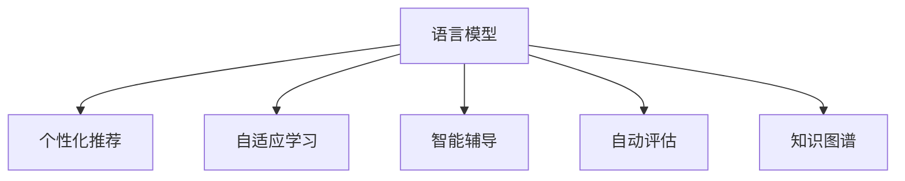

                 

# LLM对传统教学方法的革新与补充

> 关键词：语言模型, 教育技术, 自适应学习, 个性化推荐, 自动评估, 知识图谱, 智能辅导, 教育数据分析

## 1. 背景介绍

### 1.1 问题由来
随着信息技术在教育领域的深入应用，传统教学方法面临着诸多挑战。一方面，传统的讲授式教学模式难以适应学生个性化学习需求，难以因材施教；另一方面，教师的精力和资源有限，难以对每个学生进行深入的指导和评估。而近年来，基于深度学习的语言模型（Large Language Model, LLM）的兴起，为教育技术的革新带来了新的契机。

语言模型，尤其是预训练的大语言模型（如BERT、GPT等），具备强大的自然语言理解和生成能力，能够理解和处理大量自然语言数据，为个性化教学和智能辅导提供了新的解决方案。本文将探讨如何利用语言模型革新和补充传统教学方法，提升教育效率和质量。

### 1.2 问题核心关键点
基于语言模型的教育技术，主要是通过自然语言处理技术，实现对学生学习行为和表现的理解、分析、推荐和评估。其核心关键点包括：
- 利用预训练语言模型进行个性化学习路径推荐，帮助学生按需学习。
- 通过自然语言生成技术，为学生提供个性化的学习建议和智能辅导。
- 使用语言模型自动评估学生作业，提高教师工作效率。
- 构建知识图谱，为学生提供更系统、全面的知识框架。

这些核心关键点揭示了语言模型在教育技术中能够发挥的巨大作用，能够助力教育系统的现代化、个性化和智能化。

## 2. 核心概念与联系

### 2.1 核心概念概述

为更好地理解语言模型在教育技术中的应用，本节将介绍几个密切相关的核心概念：

- 语言模型（Language Model, LM）：通过统计语言数据，预测句子或文本出现的概率，用于自然语言理解、生成和检索。

- 大语言模型（Large Language Model, LLM）：规模达数十亿甚至百亿参数的预训练语言模型，具备强大的自然语言理解和生成能力。

- 个性化推荐（Personalized Recommendation）：根据用户行为、兴趣和偏好，推荐个性化的内容和学习路径。

- 自适应学习（Adaptive Learning）：根据学生的学习情况和反馈，动态调整教学内容和节奏，提供个性化的学习建议。

- 智能辅导（Intelligent Tutoring）：使用人工智能技术，为学生提供即时、智能化的辅导和反馈。

- 自动评估（Automatic Evaluation）：使用自然语言处理技术，自动评估学生的作业和回答，提供即时反馈。

- 知识图谱（Knowledge Graph）：一种将知识结构化存储和关联的图结构，用于知识检索和推荐。

这些核心概念之间的逻辑关系可以通过以下Mermaid流程图来展示：



这个流程图展示了大语言模型在教育技术中的核心概念及其之间的关系：

1. 大语言模型通过预训练获得基础能力。
2. 个性化推荐和自适应学习，使得模型能够更好地适应学生的个性化需求。
3. 智能辅导和自动评估，提高了教育过程的互动性和及时性。
4. 知识图谱提供了系统化的知识结构，帮助学生构建全面的知识框架。

这些概念共同构成了语言模型在教育技术中的应用框架，为其在教学中的广泛应用奠定了基础。

## 3. 核心算法原理 & 具体操作步骤
### 3.1 算法原理概述

基于语言模型的教育技术，主要通过自然语言处理技术，实现对学生学习行为和表现的理解、分析、推荐和评估。其核心算法原理如下：

1. **数据收集与预处理**：收集学生的学习数据，包括课程完成情况、作业提交情况、在线互动记录等，并进行数据清洗和标准化处理。

2. **模型训练与微调**：选择合适的预训练语言模型，如BERT、GPT等，在特定任务上进行微调。通过微调，模型可以更好地理解教育领域的语言特点，提升评估和推荐的准确性。

3. **个性化推荐**：基于学生的历史行为数据和模型预测，生成个性化的学习推荐，帮助学生高效学习。推荐系统通常使用协同过滤、内容推荐、基于模型的推荐等算法。

4. **自适应学习**：根据学生的学习情况和反馈，动态调整教学内容和节奏。可以使用强化学习、序列模型等技术，根据学生表现优化学习路径。

5. **智能辅导**：使用自然语言生成技术，为学生提供个性化的学习建议和智能辅导。智能辅导系统通常包括问答系统、知识图谱等组件。

6. **自动评估**：利用语言模型自动评估学生的作业和回答，提供即时反馈。自动评估系统通常包括文本分类、情感分析等技术。

7. **知识图谱构建**：构建知识图谱，为学生提供系统化的知识框架。知识图谱的构建包括知识抽取、关系推理等技术。

### 3.2 算法步骤详解

以下是基于语言模型的教育技术的核心算法步骤：

**Step 1: 数据收集与预处理**
- 收集学生的学习数据，包括课程完成情况、作业提交情况、在线互动记录等。
- 清洗和标准化数据，去除无效数据和异常值，确保数据质量。

**Step 2: 模型训练与微调**
- 选择合适的预训练语言模型，如BERT、GPT等，作为初始化参数。
- 在教育领域的特定任务上进行微调，如文本分类、情感分析、命名实体识别等。
- 通过微调，模型可以更好地理解教育领域的语言特点，提升评估和推荐的准确性。

**Step 3: 个性化推荐**
- 基于学生的历史行为数据和模型预测，生成个性化的学习推荐。
- 推荐系统可以使用协同过滤、内容推荐、基于模型的推荐等算法。
- 实时更新推荐模型，确保推荐的准确性和及时性。

**Step 4: 自适应学习**
- 根据学生的学习情况和反馈，动态调整教学内容和节奏。
- 使用强化学习、序列模型等技术，根据学生表现优化学习路径。
- 实时监测学生的学习状态，及时调整教学策略。

**Step 5: 智能辅导**
- 使用自然语言生成技术，为学生提供个性化的学习建议和智能辅导。
- 智能辅导系统通常包括问答系统、知识图谱等组件。
- 实时回答学生问题，提供即时反馈和建议。

**Step 6: 自动评估**
- 利用语言模型自动评估学生的作业和回答，提供即时反馈。
- 自动评估系统通常包括文本分类、情感分析等技术。
- 确保评估标准的准确性和一致性。

**Step 7: 知识图谱构建**
- 收集教育领域的知识库，提取和关联知识元素。
- 构建知识图谱，为学生提供系统化的知识框架。
- 使用知识抽取、关系推理等技术，确保知识图谱的准确性和完整性。

### 3.3 算法优缺点

基于语言模型的教育技术具有以下优点：
1. 个性化推荐：能够根据学生的历史行为数据，提供个性化的学习路径和建议，提高学习效率。
2. 自适应学习：能够动态调整教学内容和节奏，适应学生的个性化需求。
3. 智能辅导：能够实时回答学生问题，提供即时反馈和建议，增强学习的互动性。
4. 自动评估：能够自动评估学生的作业和回答，减轻教师的工作负担，提高评估的准确性和及时性。
5. 知识图谱：能够提供系统化的知识框架，帮助学生构建全面的知识体系。

同时，该方法也存在一些缺点：
1. 数据隐私：学生的学习数据涉及隐私信息，需要确保数据安全和隐私保护。
2. 模型偏差：语言模型可能存在偏差，对不同学生群体产生不平等的影响。
3. 计算资源：模型训练和微调需要大量的计算资源，可能存在资源瓶颈。
4. 系统复杂性：智能辅导和自适应学习系统可能较为复杂，需要专业的技术支持。
5. 评估标准：自动评估的准确性依赖于评估标准的科学性和一致性。

尽管存在这些局限性，但基于语言模型的教育技术仍是大规模个性化教学和智能化辅导的重要手段，值得进一步探索和应用。

### 3.4 算法应用领域

基于语言模型的教育技术，已经在多个领域得到了应用，如在线教育、智能辅导、自适应学习等，为教育系统的现代化和智能化提供了新的解决方案：

- **在线教育**：通过个性化推荐和自适应学习，提升在线教育平台的互动性和学习效果。
- **智能辅导**：使用智能辅导系统，为学生提供即时、个性化的学习建议和辅导。
- **自适应学习**：根据学生的学习情况和反馈，动态调整教学内容和节奏，提供个性化的学习建议。
- **自动评估**：利用语言模型自动评估学生的作业和回答，提高教师工作效率。
- **知识图谱**：构建知识图谱，为学生提供系统化的知识框架。

除了上述这些经典应用外，语言模型在教育技术中还有许多创新性的应用，如可控文本生成、虚拟教师、教育数据分析等，为教育技术带来了全新的突破。

## 4. 数学模型和公式 & 详细讲解
### 4.1 数学模型构建

在基于语言模型的教育技术中，数学模型的构建通常包括自然语言处理、机器学习和统计学等多个领域的知识。以下我们以自适应学习为例，展示一个基本的数学模型：

设学生 $i$ 的学习目标为 $\mathcal{T}_i$，当前学习状态为 $s_i$，历史行为数据为 $D_i$，自适应学习模型的目标是找到最优的学习策略 $a_i$，使得学生 $i$ 能够尽快达成学习目标 $\mathcal{T}_i$。

定义学习策略 $a_i$ 为推荐的学习内容、难度和节奏，即：

$$
a_i = (C_i, D_i, P_i)
$$

其中 $C_i$ 表示推荐的学习内容，$D_i$ 表示学习难度，$P_i$ 表示学习节奏。

自适应学习模型的目标函数为：

$$
\max_{a_i} \min_{\tau} E[\mathcal{L}_i(\tau, a_i)]
$$

其中 $\mathcal{L}_i(\tau, a_i)$ 表示学习目标函数，$E[\cdot]$ 表示期望值。

在实际应用中，通常使用强化学习或序列模型进行自适应学习，目标函数可以进一步展开为：

$$
\mathcal{L}_i(\tau, a_i) = \sum_{t=0}^{T-1} \gamma^t r_i(t) + \gamma^T l_i(T)
$$

其中 $r_i(t)$ 表示在时刻 $t$ 的即时奖励，$l_i(T)$ 表示在时间 $T$ 的学习目标完成情况。

### 4.2 公式推导过程

以下我们以强化学习为例，推导自适应学习模型的公式。

设强化学习环境为 $E$，学习策略为 $\pi$，状态空间为 $S$，动作空间为 $A$，即时奖励函数为 $R$，折现因子为 $\gamma$，初始状态为 $s_0$。强化学习的目标是最小化累积折扣奖励：

$$
\min_{\pi} \mathbb{E}_{s_0, a_0 \sim \pi} \sum_{t=0}^{\infty} \gamma^t R(s_t, a_t)
$$

将强化学习的目标函数代入自适应学习模型，得到：

$$
\mathcal{L}_i(\tau, a_i) = \sum_{t=0}^{T-1} \gamma^t r_i(t) + \gamma^T l_i(T)
$$

其中 $r_i(t)$ 表示在时刻 $t$ 的即时奖励，$l_i(T)$ 表示在时间 $T$ 的学习目标完成情况。

通过求解最优策略 $\pi^*$，可以得到自适应学习模型下的学习策略 $a_i^*$，从而优化学习路径和节奏。

### 4.3 案例分析与讲解

以一个具体的案例为例，展示自适应学习在在线教育中的应用。

设一个在线学习平台，根据学生的学习行为数据，动态调整课程内容和难度。根据学生的学习状态和反馈，平台通过强化学习算法，调整推荐的学习内容和难度，使得学生能够尽快达成学习目标。

具体步骤包括：
1. 收集学生的学习数据，包括课程完成情况、作业提交情况、在线互动记录等。
2. 选择合适的预训练语言模型，如BERT、GPT等，进行微调。
3. 构建自适应学习模型，通过强化学习算法，动态调整推荐的学习内容和难度。
4. 实时监测学生的学习状态，及时调整教学策略。
5. 使用自动评估系统，自动评估学生的作业和回答，提供即时反馈。

通过以上步骤，平台能够实现个性化的自适应学习，提高学习效率和效果。

## 5. 项目实践：代码实例和详细解释说明
### 5.1 开发环境搭建

在进行语言模型教育技术的开发前，我们需要准备好开发环境。以下是使用Python进行PyTorch开发的环境配置流程：

1. 安装Anaconda：从官网下载并安装Anaconda，用于创建独立的Python环境。

2. 创建并激活虚拟环境：
```bash
conda create -n pytorch-env python=3.8 
conda activate pytorch-env
```

3. 安装PyTorch：根据CUDA版本，从官网获取对应的安装命令。例如：
```bash
conda install pytorch torchvision torchaudio cudatoolkit=11.1 -c pytorch -c conda-forge
```

4. 安装Transformers库：
```bash
pip install transformers
```

5. 安装各类工具包：
```bash
pip install numpy pandas scikit-learn matplotlib tqdm jupyter notebook ipython
```

完成上述步骤后，即可在`pytorch-env`环境中开始教育技术的开发实践。

### 5.2 源代码详细实现

这里我们以一个简单的自适应学习系统为例，展示其基本实现。

首先，定义学生数据结构：

```python
import torch
from torch.utils.data import Dataset

class StudentData(Dataset):
    def __init__(self, data, tokenizer):
        self.data = data
        self.tokenizer = tokenizer
    
    def __len__(self):
        return len(self.data)
    
    def __getitem__(self, item):
        x = self.data[item]
        text = x['text']
        label = x['label']
        
        encoding = self.tokenizer(text, return_tensors='pt', padding=True, truncation=True)
        input_ids = encoding['input_ids']
        attention_mask = encoding['attention_mask']
        
        return {'input_ids': input_ids, 
                'attention_mask': attention_mask,
                'label': torch.tensor(label, dtype=torch.long)}
```

然后，定义自适应学习模型：

```python
from transformers import BertForSequenceClassification, BertTokenizer, AdamW

model = BertForSequenceClassification.from_pretrained('bert-base-cased', num_labels=2)
tokenizer = BertTokenizer.from_pretrained('bert-base-cased')

optimizer = AdamW(model.parameters(), lr=2e-5)
```

接着，定义训练和评估函数：

```python
from torch.utils.data import DataLoader
from tqdm import tqdm
from sklearn.metrics import accuracy_score

device = torch.device('cuda') if torch.cuda.is_available() else torch.device('cpu')
model.to(device)

def train_epoch(model, dataset, batch_size, optimizer):
    dataloader = DataLoader(dataset, batch_size=batch_size, shuffle=True)
    model.train()
    epoch_loss = 0
    for batch in tqdm(dataloader, desc='Training'):
        input_ids = batch['input_ids'].to(device)
        attention_mask = batch['attention_mask'].to(device)
        labels = batch['label'].to(device)
        model.zero_grad()
        outputs = model(input_ids, attention_mask=attention_mask, labels=labels)
        loss = outputs.loss
        epoch_loss += loss.item()
        loss.backward()
        optimizer.step()
    return epoch_loss / len(dataloader)

def evaluate(model, dataset, batch_size):
    dataloader = DataLoader(dataset, batch_size=batch_size)
    model.eval()
    preds, labels = [], []
    with torch.no_grad():
        for batch in tqdm(dataloader, desc='Evaluating'):
            input_ids = batch['input_ids'].to(device)
            attention_mask = batch['attention_mask'].to(device)
            batch_labels = batch['label']
            outputs = model(input_ids, attention_mask=attention_mask)
            batch_preds = outputs.logits.argmax(dim=1).to('cpu').tolist()
            batch_labels = batch_labels.to('cpu').tolist()
            for pred, label in zip(batch_preds, batch_labels):
                preds.append(pred)
                labels.append(label)
                
    print(f'Accuracy: {accuracy_score(labels, preds):.2f}')
```

最后，启动训练流程并在测试集上评估：

```python
epochs = 5
batch_size = 16

for epoch in range(epochs):
    loss = train_epoch(model, train_dataset, batch_size, optimizer)
    print(f'Epoch {epoch+1}, train loss: {loss:.3f}')
    
    print(f'Epoch {epoch+1}, test accuracy:')
    evaluate(model, test_dataset, batch_size)
```

以上就是使用PyTorch对自适应学习系统进行简单实现的代码。可以看到，得益于Transformers库的强大封装，我们可以用相对简洁的代码完成自适应学习模型的构建。

### 5.3 代码解读与分析

让我们再详细解读一下关键代码的实现细节：

**StudentData类**：
- `__init__`方法：初始化学生数据集和分词器。
- `__len__`方法：返回数据集的样本数量。
- `__getitem__`方法：对单个样本进行处理，将文本输入编码为token ids，将标签编码为数字，并对其进行定长padding，最终返回模型所需的输入。

**模型构建**：
- 使用PyTorch的BertForSequenceClassification类，定义自适应学习模型。
- 使用BertTokenizer对文本进行编码，生成模型所需的输入。
- 定义AdamW优化器，设置学习率。

**训练和评估函数**：
- 使用PyTorch的DataLoader对数据集进行批次化加载，供模型训练和推理使用。
- 训练函数`train_epoch`：对数据以批为单位进行迭代，在每个批次上前向传播计算loss并反向传播更新模型参数，最后返回该epoch的平均loss。
- 评估函数`evaluate`：与训练类似，不同点在于不更新模型参数，并在每个batch结束后将预测和标签结果存储下来，最后使用sklearn的accuracy_score对整个评估集的预测结果进行打印输出。

**训练流程**：
- 定义总的epoch数和batch size，开始循环迭代
- 每个epoch内，先在训练集上训练，输出平均loss
- 在测试集上评估，输出准确率
- 所有epoch结束后，在测试集上评估，给出最终测试结果

可以看到，PyTorch配合Transformers库使得自适应学习模型的代码实现变得简洁高效。开发者可以将更多精力放在数据处理、模型改进等高层逻辑上，而不必过多关注底层的实现细节。

当然，工业级的系统实现还需考虑更多因素，如模型的保存和部署、超参数的自动搜索、更灵活的任务适配层等。但核心的自适应学习范式基本与此类似。

## 6. 实际应用场景
### 6.1 智能辅导系统

基于语言模型的智能辅导系统，可以广泛应用于K-12教育、职业教育、高等教育等多个领域。传统辅导方式往往依赖于教师的固定教学模式，难以因材施教。而使用智能辅导系统，可以实时回答学生问题，提供个性化的学习建议和智能辅导。

在技术实现上，可以收集学生的学习行为数据，将其输入到预训练语言模型中进行微调，得到一个能够理解自然语言、自动回答问题和提供建议的系统。学生可以在系统中输入问题，智能辅导系统通过自然语言理解技术，自动回答问题，并提供相应的学习资源和建议。

### 6.2 自适应学习平台

自适应学习平台，利用语言模型对学生的学习行为进行分析和预测，动态调整学习内容和节奏，提供个性化的学习建议。平台通常包括学习路径推荐、即时反馈、自动评估等组件。

在技术实现上，可以收集学生的学习数据，将其输入到预训练语言模型中进行微调，得到一个能够理解学生学习行为和表现的模型。模型通过分析学生的学习数据，预测学生的学习进度和难点，并根据预测结果调整学习内容和节奏，推荐相应的学习资源和练习题目。

### 6.3 在线教育平台

在线教育平台，利用语言模型进行个性化推荐和智能辅导，提升学生的学习效果和平台的用户体验。平台通常包括课程推荐、即时辅导、作业批改等组件。

在技术实现上，可以收集学生的学习数据，将其输入到预训练语言模型中进行微调，得到一个能够理解学生学习行为和表现的模型。模型通过分析学生的学习数据，推荐个性化的课程和学习资源，提供即时辅导和作业批改服务。平台还可以通过自动评估系统，自动评估学生的作业和回答，提供即时反馈和建议。

### 6.4 未来应用展望

随着语言模型的不断发展和应用，基于语言模型的教育技术也将迎来更多的创新和突破：

1. 自适应学习：自适应学习技术将不断提升，能够更加准确地预测学生的学习进度和难点，提供更加个性化的学习建议。
2. 智能辅导：智能辅导系统将更加智能和高效，能够提供更加及时、精准的学习建议和辅导。
3. 自动评估：自动评估系统将不断优化，能够更加准确地评估学生的学习成果和表现。
4. 知识图谱：知识图谱技术将更加成熟，能够提供更加系统、全面的知识框架。
5. 学习分析：学习分析技术将不断进步，能够更加深入地理解学生的学习行为和表现，提供更加科学的教学策略。

这些技术的发展将进一步提升教育系统的智能化和个性化水平，为学生提供更加优质的学习体验。

## 7. 工具和资源推荐
### 7.1 学习资源推荐

为了帮助开发者系统掌握语言模型在教育技术中的应用，这里推荐一些优质的学习资源：

1. 《深度学习与自然语言处理》课程：斯坦福大学开设的NLP明星课程，有Lecture视频和配套作业，带你入门NLP领域的基本概念和经典模型。

2. CS224N《自然语言处理与深度学习》课程：斯坦福大学开设的NLP明星课程，有Lecture视频和配套作业，深入讲解NLP中的各项技术。

3. 《Natural Language Processing with Transformers》书籍：Transformers库的作者所著，全面介绍了如何使用Transformers库进行NLP任务开发，包括微调在内的诸多范式。

4. 《从0到1构建智能辅导系统》系列博文：介绍智能辅导系统的基本原理和实现步骤，适合初学者入门。

5. 《深度学习在教育技术中的应用》论文：综述了深度学习在教育技术中的各项应用，为读者提供全面的参考。

通过对这些资源的学习实践，相信你一定能够快速掌握语言模型在教育技术中的应用精髓，并用于解决实际的NLP问题。
###  7.2 开发工具推荐

高效的开发离不开优秀的工具支持。以下是几款用于语言模型教育技术开发的常用工具：

1. PyTorch：基于Python的开源深度学习框架，灵活动态的计算图，适合快速迭代研究。大部分预训练语言模型都有PyTorch版本的实现。

2. TensorFlow：由Google主导开发的开源深度学习框架，生产部署方便，适合大规模工程应用。同样有丰富的预训练语言模型资源。

3. Transformers库：HuggingFace开发的NLP工具库，集成了众多SOTA语言模型，支持PyTorch和TensorFlow，是进行教育技术开发的利器。

4. Weights & Biases：模型训练的实验跟踪工具，可以记录和可视化模型训练过程中的各项指标，方便对比和调优。与主流深度学习框架无缝集成。

5. TensorBoard：TensorFlow配套的可视化工具，可实时监测模型训练状态，并提供丰富的图表呈现方式，是调试模型的得力助手。

6. Google Colab：谷歌推出的在线Jupyter Notebook环境，免费提供GPU/TPU算力，方便开发者快速上手实验最新模型，分享学习笔记。

合理利用这些工具，可以显著提升语言模型教育技术的开发效率，加快创新迭代的步伐。

### 7.3 相关论文推荐

语言模型和教育技术的发展源于学界的持续研究。以下是几篇奠基性的相关论文，推荐阅读：

1. Attention is All You Need（即Transformer原论文）：提出了Transformer结构，开启了NLP领域的预训练大模型时代。

2. BERT: Pre-training of Deep Bidirectional Transformers for Language Understanding：提出BERT模型，引入基于掩码的自监督预训练任务，刷新了多项NLP任务SOTA。

3. Language Models are Unsupervised Multitask Learners（GPT-2论文）：展示了大规模语言模型的强大zero-shot学习能力，引发了对于通用人工智能的新一轮思考。

4. Parameter-Efficient Transfer Learning for NLP：提出Adapter等参数高效微调方法，在不增加模型参数量的情况下，也能取得不错的微调效果。

5. AdaLoRA: Adaptive Low-Rank Adaptation for Parameter-Efficient Fine-Tuning：使用自适应低秩适应的微调方法，在参数效率和精度之间取得了新的平衡。

这些论文代表了大语言模型教育技术的发展脉络。通过学习这些前沿成果，可以帮助研究者把握学科前进方向，激发更多的创新灵感。

## 8. 总结：未来发展趋势与挑战
### 8.1 总结

本文对基于语言模型的教育技术进行了全面系统的介绍。首先阐述了语言模型和微调技术在教育领域的应用背景和意义，明确了其在大规模个性化教学和智能化辅导中的重要作用。其次，从原理到实践，详细讲解了语言模型在教育技术中的应用，包括个性化推荐、自适应学习、智能辅导和自动评估等方面。最后，本文还探讨了语言模型在教育技术中的实际应用场景，展示了其在多个领域的应用前景。

通过本文的系统梳理，可以看到，基于语言模型的教育技术正在成为教育领域的革命性力量，极大地提升了教育的个性化和智能化水平。得益于预训练语言模型的强大能力，该技术能够根据学生的个性化需求，提供及时、精准的学习建议和辅导，大幅提高学习效率和效果。未来，伴随预训练语言模型的不断发展和优化，基于语言模型的教育技术必将在教育系统的现代化和智能化进程中发挥更大的作用。

### 8.2 未来发展趋势

展望未来，语言模型在教育技术中的研究将呈现以下几个发展趋势：

1. 个性化推荐：推荐算法将更加精准和高效，能够根据学生的学习行为和表现，提供更加个性化的学习资源和路径。
2. 自适应学习：自适应学习技术将更加智能和自适应，能够动态调整学习内容和节奏，提供更加个性化的学习建议。
3. 智能辅导：智能辅导系统将更加智能和高效，能够提供更加及时、精准的学习建议和辅导。
4. 自动评估：自动评估系统将更加准确和全面，能够自动评估学生的学习成果和表现，提供即时反馈和建议。
5. 知识图谱：知识图谱技术将更加成熟和完善，能够提供更加系统、全面的知识框架。
6. 学习分析：学习分析技术将更加深入和全面，能够更加深入地理解学生的学习行为和表现，提供更加科学的教学策略。

这些趋势凸显了语言模型在教育技术中的广阔前景。这些方向的探索发展，必将进一步提升教育系统的智能化和个性化水平，为学生提供更加优质的学习体验。

### 8.3 面临的挑战

尽管语言模型在教育技术中已经取得了显著成效，但在迈向更加智能化、普适化应用的过程中，它仍面临着诸多挑战：

1. 数据隐私：学生的学习数据涉及隐私信息，需要确保数据安全和隐私保护。
2. 模型偏差：语言模型可能存在偏差，对不同学生群体产生不平等的影响。
3. 计算资源：模型训练和微调需要大量的计算资源，可能存在资源瓶颈。
4. 系统复杂性：智能辅导和自适应学习系统可能较为复杂，需要专业的技术支持。
5. 评估标准：自动评估的准确性依赖于评估标准的科学性和一致性。

尽管存在这些局限性，但语言模型在教育技术中的研究和发展前景广阔，仍值得深入探索和应用。

### 8.4 研究展望

未来，语言模型在教育技术中的应用将进一步深化和拓展：

1. 跨学科融合：语言模型将与其他技术如知识图谱、逻辑推理、强化学习等进行更深入的融合，提升教育系统的智能化水平。
2. 多模态融合：语言模型将与视觉、听觉等多模态数据进行融合，提供更加全面、多维度的学习体验。
3. 伦理性考量：语言模型在教育技术中的应用将更多地考虑伦理和道德问题，确保技术应用的公平性和安全性。
4. 人性化设计：语言模型将更多地考虑用户友好性和人性化设计，提升用户体验和满意度。
5. 全球化推广：语言模型将在全球范围内推广应用，促进教育公平和普惠。

这些方向的研究和应用，将推动语言模型在教育技术中的深入发展，为构建更加智能、个性化、公平的教育系统提供新的可能。

## 9. 附录：常见问题与解答

**Q1：如何使用语言模型进行自适应学习？**

A: 使用语言模型进行自适应学习，通常包括以下步骤：
1. 收集学生的学习数据，包括课程完成情况、作业提交情况、在线互动记录等。
2. 选择合适的预训练语言模型，如BERT、GPT等，进行微调。
3. 构建自适应学习模型，通过强化学习算法，动态调整推荐的学习内容和难度。
4. 实时监测学生的学习状态，及时调整教学策略。

**Q2：语言模型在教育技术中存在哪些局限性？**

A: 语言模型在教育技术中存在以下局限性：
1. 数据隐私：学生的学习数据涉及隐私信息，需要确保数据安全和隐私保护。
2. 模型偏差：语言模型可能存在偏差，对不同学生群体产生不平等的影响。
3. 计算资源：模型训练和微调需要大量的计算资源，可能存在资源瓶颈。
4. 系统复杂性：智能辅导和自适应学习系统可能较为复杂，需要专业的技术支持。
5. 评估标准：自动评估的准确性依赖于评估标准的科学性和一致性。

**Q3：语言模型在教育技术中的未来发展方向是什么？**

A: 语言模型在教育技术中的未来发展方向包括：
1. 个性化推荐：推荐算法将更加精准和高效，能够根据学生的学习行为和表现，提供更加个性化的学习资源和路径。
2. 自适应学习：自适应学习技术将更加智能和自适应，能够动态调整学习内容和节奏，提供更加个性化的学习建议。
3. 智能辅导：智能辅导系统将更加智能和高效，能够提供更加及时、精准的学习建议和辅导。
4. 自动评估：自动评估系统将更加准确和全面，能够自动评估学生的学习成果和表现，提供即时反馈和建议。
5. 知识图谱：知识图谱技术将更加成熟和完善，能够提供更加系统、全面的知识框架。
6. 学习分析：学习分析技术将更加深入和全面，能够更加深入地理解学生的学习行为和表现，提供更加科学的教学策略。

这些方向的研究和应用，将推动语言模型在教育技术中的深入发展，为构建更加智能、个性化、公平的教育系统提供新的可能。

**Q4：如何在教育技术中构建知识图谱？**

A: 在教育技术中构建知识图谱，通常包括以下步骤：
1. 收集教育领域的知识库，包括课程、教材、教辅材料等。
2. 提取和关联知识元素，包括实体、属性和关系。
3. 使用知识抽取、关系推理等技术，构建知识图谱。
4. 提供知识图谱的查询接口，方便学生和教师获取知识。

通过以上步骤，可以构建系统化的知识图谱，为学生提供更加全面的知识框架。

作者：禅与计算机程序设计艺术 / Zen and the Art of Computer Programming

