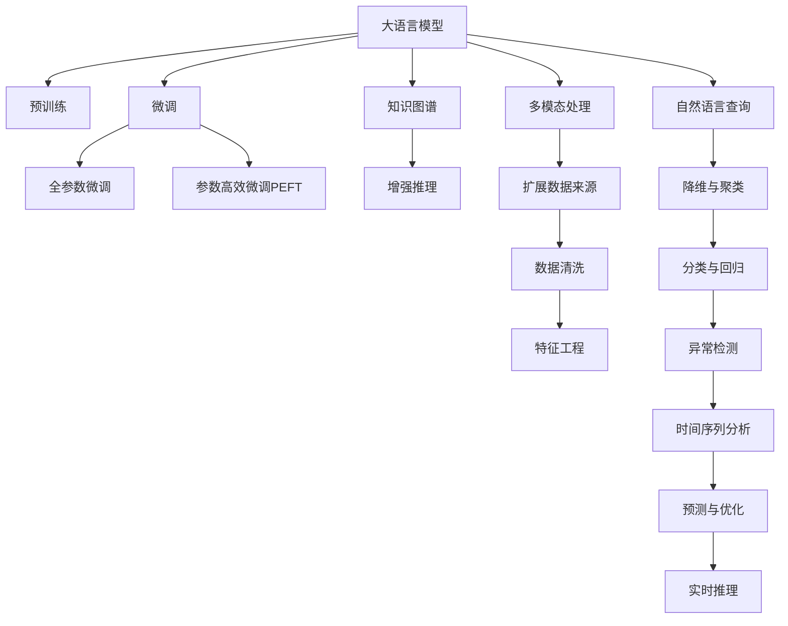

                 

# LLM对传统数据挖掘的革新

> 关键词：大语言模型,自然语言处理,数据挖掘,机器学习,深度学习,数据清洗,特征工程,预训练模型,迁移学习,知识图谱

## 1. 背景介绍

### 1.1 问题由来

数据挖掘(Data Mining)是利用机器学习和统计学方法从大量数据中提取有用信息的过程。它广泛应用于市场营销、金融分析、医疗诊断、网络安全等领域，为决策者提供数据驱动的洞察。

然而，传统的统计和规则方法在处理复杂、多模态、非结构化数据时，往往面临效率低、易过拟合等问题。特别是对于自然语言处理(NLP)数据，传统的特征提取方法如TF-IDF、词袋模型等，无法充分捕捉语义和上下文信息，难以满足当前NLP任务的需求。

近年来，随着深度学习和大语言模型(Large Language Models, LLMs)的兴起，数据挖掘领域正经历着一场革命。LLMs以其强大的语言理解和生成能力，在NLP领域取得了显著的进步，同时也为数据挖掘带来了全新的范式和工具。

### 1.2 问题核心关键点

LLMs在数据挖掘中的主要优势包括：

1. **大规模语料预训练**：LLMs通过在海量无标签文本语料上进行预训练，学习到丰富的语言知识和常识。这些知识可以迁移到不同领域的数据挖掘任务中，提升模型的泛化能力。

2. **多模态数据处理**：LLMs不仅能够处理文本数据，还能处理图像、语音、视频等多种模态数据，拓宽了数据挖掘的应用范围。

3. **自然语言查询**：LLMs支持自然语言查询，用户可以用自然语言描述数据挖掘需求，大大降低了数据挖掘的门槛。

4. **可解释性**：LLMs提供了更好的可解释性，能够输出推理过程和中间结果，便于用户理解和验证。

5. **自适应学习能力**：LLMs能够通过持续学习和迁移学习，不断适应新数据和新任务，保持高性能。

6. **实时性**：一些LLMs支持实时推理和计算，可以处理流式数据，满足对数据实时性要求较高的应用。

本文将深入探讨LLMs在数据挖掘中的应用，介绍其主要原理和操作步骤，并通过数学模型和代码实例进一步讲解其应用细节。

## 2. 核心概念与联系

### 2.1 核心概念概述

在介绍LLMs如何革新数据挖掘前，我们先明确几个核心概念及其相互联系：

- **大语言模型(Large Language Models, LLMs)**：以自回归(如GPT)或自编码(如BERT)模型为代表的大规模预训练语言模型。通过在海量无标签文本语料上进行预训练，学习到丰富的语言知识和常识。

- **预训练(Pre-training)**：指在大规模无标签文本语料上，通过自监督学习任务训练通用语言模型的过程。常见的预训练任务包括言语建模、掩码语言模型等。

- **微调(Fine-tuning)**：指在预训练模型的基础上，使用下游任务的少量标注数据，通过有监督学习优化模型在特定任务上的性能。通常只需调整顶层分类器或解码器，并以较小的学习率更新全部或部分的模型参数。

- **迁移学习(Transfer Learning)**：指将一个领域学习到的知识，迁移应用到另一个不同但相关的领域的学习范式。预训练模型即为迁移学习的一种形式。

- **知识图谱(Knowledge Graph)**：一种结构化的语义数据表示方式，通过节点和边来描述实体与实体之间的关系。知识图谱可以用于增强LLMs在数据挖掘中的性能。

### 2.2 核心概念原理和架构的 Mermaid 流程图(Mermaid 流程节点中不要有括号、逗号等特殊字符)



此图展示了LLMs在数据挖掘中的核心概念及其相互联系。

## 3. 核心算法原理 & 具体操作步骤
### 3.1 算法原理概述

LLMs在数据挖掘中的主要原理基于预训练-微调范式。具体而言，LLMs通过在大规模无标签文本语料上进行预训练，学习到丰富的语言知识。然后，在特定数据挖掘任务上进行微调，通过少量标注数据优化模型在特定任务上的性能。

数学上，预训练过程可以表示为：

$$
\theta \leftarrow \mathop{\arg\min}_{\theta} \mathcal{L}_{\text{pre-train}}(\theta, D_{\text{pre-train}})
$$

其中，$\theta$为模型的参数，$D_{\text{pre-train}}$为预训练数据集。

微调过程则表示为：

$$
\theta \leftarrow \mathop{\arg\min}_{\theta} \mathcal{L}_{\text{task}}(\theta, D_{\text{task}})
$$

其中，$\mathcal{L}_{\text{task}}$为下游任务的数据集，$D_{\text{task}}$为任务数据集。

### 3.2 算法步骤详解

LLMs在数据挖掘中的应用主要包括以下几个步骤：

**Step 1: 准备预训练模型和数据集**

- 选择合适的预训练语言模型，如BERT、GPT等，作为初始化参数。
- 准备下游任务的标注数据集，划分为训练集、验证集和测试集。

**Step 2: 数据预处理**

- 清洗数据集，去除噪声和错误。
- 将数据集分词、标注、向量化，生成模型所需的输入。

**Step 3: 微调模型**

- 在预训练模型上叠加适当的输出层和损失函数。
- 设置合适的学习率、批大小、迭代轮数等微调超参数。
- 执行梯度训练，最小化损失函数，更新模型参数。

**Step 4: 评估模型**

- 在验证集上评估模型性能，调整超参数。
- 在测试集上最终评估模型效果，输出推理结果。

**Step 5: 应用模型**

- 将微调后的模型应用于实际数据挖掘任务，生成分析报告或预测结果。

### 3.3 算法优缺点

LLMs在数据挖掘中的应用具有以下优点：

1. **高效性**：通过预训练学习到丰富的语言知识，LLMs在微调时能够快速适应新任务，减少标注数据的需求。
2. **泛化能力**：预训练知识可以迁移到多个数据挖掘任务中，提升模型的泛化能力。
3. **可解释性**：LLMs提供了更好的可解释性，能够输出推理过程和中间结果，便于用户理解和验证。
4. **多模态处理**：LLMs能够处理多种模态数据，拓宽了数据挖掘的应用范围。

同时，LLMs在数据挖掘中也存在一些局限性：

1. **数据依赖性强**：预训练和微调需要大量标注数据，数据获取成本高。
2. **计算资源需求高**：预训练和微调过程计算资源需求高，训练时间长。
3. **过拟合风险**：在标注数据少的情况下，微调模型易过拟合，性能不稳定。

### 3.4 算法应用领域

LLMs在数据挖掘中已经被广泛应用于以下领域：

1. **文本分类与聚类**：如情感分析、主题分类、文本聚类等。通过微调使模型学习文本-标签映射，或进行文本相似度计算。

2. **实体关系抽取**：从文本中抽取实体之间的语义关系。通过微调使模型学习实体-关系三元组。

3. **信息抽取**：从非结构化数据中抽取关键信息，生成结构化数据。通过微调使模型识别和提取关键实体和属性。

4. **预测与优化**：如股票价格预测、客户流失预测、交通流量优化等。通过微调使模型学习数据与目标变量之间的映射。

5. **异常检测**：如信用风险检测、网络安全监控等。通过微调使模型学习数据中的异常模式。

6. **时间序列分析**：如天气预测、股票趋势分析等。通过微调使模型学习时间序列数据的预测模型。

## 4. 数学模型和公式 & 详细讲解 & 举例说明

### 4.1 数学模型构建

以情感分析任务为例，假设数据集为$D=\{(x_i, y_i)\}_{i=1}^N$，其中$x_i$为输入文本，$y_i$为情感标签。模型的输入为文本$x_i$，输出为情感标签$y_i$。

预训练模型$M_{\theta}$输出文本的语义表示$h_i$，则微调模型的目标函数可以表示为：

$$
\mathcal{L}(\theta) = -\frac{1}{N}\sum_{i=1}^N \ell(h_i, y_i)
$$

其中，$\ell$为损失函数，可以是交叉熵损失、均方误差损失等。

### 4.2 公式推导过程

以二分类任务为例，假设模型$M_{\theta}$在输入$x$上的输出为$\hat{y}=M_{\theta}(x)$，表示样本属于正类的概率。真实标签$y \in \{0,1\}$。则二分类交叉熵损失函数定义为：

$$
\ell(M_{\theta}(x),y) = -[y\log \hat{y} + (1-y)\log (1-\hat{y})]
$$

将其代入经验风险公式，得：

$$
\mathcal{L}(\theta) = -\frac{1}{N}\sum_{i=1}^N [y_i\log M_{\theta}(x_i)+(1-y_i)\log(1-M_{\theta}(x_i))]
$$

根据链式法则，损失函数对参数$\theta_k$的梯度为：

$$
\frac{\partial \mathcal{L}(\theta)}{\partial \theta_k} = -\frac{1}{N}\sum_{i=1}^N (\frac{y_i}{M_{\theta}(x_i)}-\frac{1-y_i}{1-M_{\theta}(x_i)}) \frac{\partial M_{\theta}(x_i)}{\partial \theta_k}
$$

其中$\frac{\partial M_{\theta}(x_i)}{\partial \theta_k}$可进一步递归展开，利用自动微分技术完成计算。

### 4.3 案例分析与讲解

以知识图谱增强为例，假设已知知识图谱$G$，包含实体$e$与关系$r$，以及它们的属性$a$。LLMs在数据挖掘中可以使用知识图谱增强推理，通过以下步骤：

1. 将知识图谱编码为向量形式，与输入文本$x$拼接。
2. 利用LLMs生成文本表示$h$。
3. 通过与知识图谱进行关联，生成推理结果。

例如，在商品推荐任务中，可以使用知识图谱表示商品和用户之间的关系，LLMs通过分析用户的历史行为和知识图谱，生成推荐商品。

## 5. 项目实践：代码实例和详细解释说明

### 5.1 开发环境搭建

在实践LLMs在数据挖掘中的应用时，我们需要准备好开发环境。以下是使用Python进行PyTorch开发的环境配置流程：

1. 安装Anaconda：从官网下载并安装Anaconda，用于创建独立的Python环境。

2. 创建并激活虚拟环境：
```bash
conda create -n pytorch-env python=3.8 
conda activate pytorch-env
```

3. 安装PyTorch：根据CUDA版本，从官网获取对应的安装命令。例如：
```bash
conda install pytorch torchvision torchaudio cudatoolkit=11.1 -c pytorch -c conda-forge
```

4. 安装Transformers库：
```bash
pip install transformers
```

5. 安装各类工具包：
```bash
pip install numpy pandas scikit-learn matplotlib tqdm jupyter notebook ipython
```

完成上述步骤后，即可在`pytorch-env`环境中开始实践。

### 5.2 源代码详细实现

下面我们以情感分析任务为例，给出使用Transformers库对BERT模型进行微调的PyTorch代码实现。

首先，定义情感分析任务的数据处理函数：

```python
from transformers import BertTokenizer
from torch.utils.data import Dataset
import torch

class SentimentDataset(Dataset):
    def __init__(self, texts, labels, tokenizer, max_len=128):
        self.texts = texts
        self.labels = labels
        self.tokenizer = tokenizer
        self.max_len = max_len
        
    def __len__(self):
        return len(self.texts)
    
    def __getitem__(self, item):
        text = self.texts[item]
        label = self.labels[item]
        
        encoding = self.tokenizer(text, return_tensors='pt', max_length=self.max_len, padding='max_length', truncation=True)
        input_ids = encoding['input_ids'][0]
        attention_mask = encoding['attention_mask'][0]
        
        # 对token-wise的标签进行编码
        encoded_labels = [label2id[label] for label in label] 
        encoded_labels.extend([label2id['O']] * (self.max_len - len(encoded_labels)))
        labels = torch.tensor(encoded_labels, dtype=torch.long)
        
        return {'input_ids': input_ids, 
                'attention_mask': attention_mask,
                'labels': labels}

# 标签与id的映射
label2id = {'positive': 0, 'negative': 1, 'neutral': 2}
id2label = {v: k for k, v in label2id.items()}

# 创建dataset
tokenizer = BertTokenizer.from_pretrained('bert-base-cased')

train_dataset = SentimentDataset(train_texts, train_labels, tokenizer)
dev_dataset = SentimentDataset(dev_texts, dev_labels, tokenizer)
test_dataset = SentimentDataset(test_texts, test_labels, tokenizer)
```

然后，定义模型和优化器：

```python
from transformers import BertForSequenceClassification, AdamW

model = BertForSequenceClassification.from_pretrained('bert-base-cased', num_labels=len(label2id))

optimizer = AdamW(model.parameters(), lr=2e-5)
```

接着，定义训练和评估函数：

```python
from torch.utils.data import DataLoader
from tqdm import tqdm
from sklearn.metrics import classification_report

device = torch.device('cuda') if torch.cuda.is_available() else torch.device('cpu')
model.to(device)

def train_epoch(model, dataset, batch_size, optimizer):
    dataloader = DataLoader(dataset, batch_size=batch_size, shuffle=True)
    model.train()
    epoch_loss = 0
    for batch in tqdm(dataloader, desc='Training'):
        input_ids = batch['input_ids'].to(device)
        attention_mask = batch['attention_mask'].to(device)
        labels = batch['labels'].to(device)
        model.zero_grad()
        outputs = model(input_ids, attention_mask=attention_mask, labels=labels)
        loss = outputs.loss
        epoch_loss += loss.item()
        loss.backward()
        optimizer.step()
    return epoch_loss / len(dataloader)

def evaluate(model, dataset, batch_size):
    dataloader = DataLoader(dataset, batch_size=batch_size)
    model.eval()
    preds, labels = [], []
    with torch.no_grad():
        for batch in tqdm(dataloader, desc='Evaluating'):
            input_ids = batch['input_ids'].to(device)
            attention_mask = batch['attention_mask'].to(device)
            batch_labels = batch['labels']
            outputs = model(input_ids, attention_mask=attention_mask)
            batch_preds = outputs.logits.argmax(dim=2).to('cpu').tolist()
            batch_labels = batch_labels.to('cpu').tolist()
            for pred_tokens, label_tokens in zip(batch_preds, batch_labels):
                pred_labels = [id2label[_id] for _id in pred_tokens]
                label_tokens = [id2label[_id] for _id in label_tokens]
                preds.append(pred_labels[:len(label_tokens)])
                labels.append(label_tokens)
                
    print(classification_report(labels, preds))
```

最后，启动训练流程并在测试集上评估：

```python
epochs = 5
batch_size = 16

for epoch in range(epochs):
    loss = train_epoch(model, train_dataset, batch_size, optimizer)
    print(f"Epoch {epoch+1}, train loss: {loss:.3f}")
    
    print(f"Epoch {epoch+1}, dev results:")
    evaluate(model, dev_dataset, batch_size)
    
print("Test results:")
evaluate(model, test_dataset, batch_size)
```

以上就是使用PyTorch对BERT进行情感分析任务微调的完整代码实现。可以看到，得益于Transformers库的强大封装，我们可以用相对简洁的代码完成BERT模型的加载和微调。

### 5.3 代码解读与分析

让我们再详细解读一下关键代码的实现细节：

**SentimentDataset类**：
- `__init__`方法：初始化文本、标签、分词器等关键组件。
- `__len__`方法：返回数据集的样本数量。
- `__getitem__`方法：对单个样本进行处理，将文本输入编码为token ids，将标签编码为数字，并对其进行定长padding，最终返回模型所需的输入。

**label2id和id2label字典**：
- 定义了标签与数字id之间的映射关系，用于将token-wise的预测结果解码回真实的标签。

**训练和评估函数**：
- 使用PyTorch的DataLoader对数据集进行批次化加载，供模型训练和推理使用。
- 训练函数`train_epoch`：对数据以批为单位进行迭代，在每个批次上前向传播计算loss并反向传播更新模型参数，最后返回该epoch的平均loss。
- 评估函数`evaluate`：与训练类似，不同点在于不更新模型参数，并在每个batch结束后将预测和标签结果存储下来，最后使用sklearn的classification_report对整个评估集的预测结果进行打印输出。

**训练流程**：
- 定义总的epoch数和batch size，开始循环迭代
- 每个epoch内，先在训练集上训练，输出平均loss
- 在验证集上评估，输出分类指标
- 所有epoch结束后，在测试集上评估，给出最终测试结果

可以看到，PyTorch配合Transformers库使得BERT微调的代码实现变得简洁高效。开发者可以将更多精力放在数据处理、模型改进等高层逻辑上，而不必过多关注底层的实现细节。

当然，工业级的系统实现还需考虑更多因素，如模型的保存和部署、超参数的自动搜索、更灵活的任务适配层等。但核心的微调范式基本与此类似。

## 6. 实际应用场景
### 6.1 智能客服系统

基于LLMs的数据挖掘技术，可以广泛应用于智能客服系统的构建。传统客服往往需要配备大量人力，高峰期响应缓慢，且一致性和专业性难以保证。而使用LLMs进行数据挖掘，可以实时分析客户需求，自动生成回复，大大提升客服系统的响应速度和准确性。

在技术实现上，可以收集企业内部的历史客服对话记录，使用情感分析、意图识别等技术，构建微调模型。微调后的模型能够自动理解用户意图，匹配最合适的答案模板进行回复。对于客户提出的新问题，还可以接入检索系统实时搜索相关内容，动态组织生成回答。如此构建的智能客服系统，能大幅提升客户咨询体验和问题解决效率。

### 6.2 金融舆情监测

金融机构需要实时监测市场舆论动向，以便及时应对负面信息传播，规避金融风险。传统的人工监测方式成本高、效率低，难以应对网络时代海量信息爆发的挑战。基于LLMs的数据挖掘技术，为金融舆情监测提供了新的解决方案。

具体而言，可以收集金融领域相关的新闻、报道、评论等文本数据，并对其进行情感分析和主题标注。在此基础上对预训练语言模型进行微调，使其能够自动判断文本属于何种情感，涉及哪些主题。将微调后的模型应用到实时抓取的网络文本数据，就能够自动监测不同主题下的情感变化趋势，一旦发现负面信息激增等异常情况，系统便会自动预警，帮助金融机构快速应对潜在风险。

### 6.3 个性化推荐系统

当前的推荐系统往往只依赖用户的历史行为数据进行物品推荐，无法深入理解用户的真实兴趣偏好。基于LLMs的数据挖掘技术，个性化推荐系统可以更好地挖掘用户行为背后的语义信息，从而提供更精准、多样的推荐内容。

在实践中，可以收集用户浏览、点击、评论、分享等行为数据，提取和用户交互的物品标题、描述、标签等文本内容。将文本内容作为模型输入，用户的后续行为（如是否点击、购买等）作为监督信号，在此基础上微调预训练语言模型。微调后的模型能够从文本内容中准确把握用户的兴趣点。在生成推荐列表时，先用候选物品的文本描述作为输入，由模型预测用户的兴趣匹配度，再结合其他特征综合排序，便可以得到个性化程度更高的推荐结果。

### 6.4 未来应用展望

随着LLMs和数据挖掘技术的不断发展，LLMs在数据挖掘中的应用前景广阔，将在更多领域得到应用，为传统行业带来变革性影响。

在智慧医疗领域，基于LLMs的数据挖掘技术可以用于医学知识图谱的构建、病历信息的抽取和分析、药物研发等，提升医疗服务的智能化水平，辅助医生诊疗，加速新药开发进程。

在智能教育领域，LLMs可以用于学情分析、知识推荐等方面，因材施教，促进教育公平，提高教学质量。

在智慧城市治理中，LLMs可以用于城市事件监测、舆情分析、应急指挥等环节，提高城市管理的自动化和智能化水平，构建更安全、高效的未来城市。

此外，在企业生产、社会治理、文娱传媒等众多领域，基于LLMs的数据挖掘技术也将不断涌现，为经济社会发展注入新的动力。相信随着技术的日益成熟，LLMs在数据挖掘中的应用必将成为智能化转型的重要驱动力。

## 7. 工具和资源推荐
### 7.1 学习资源推荐

为了帮助开发者系统掌握LLMs在数据挖掘中的应用，这里推荐一些优质的学习资源：

1. 《Transformer从原理到实践》系列博文：由大模型技术专家撰写，深入浅出地介绍了Transformer原理、BERT模型、数据挖掘任务等前沿话题。

2. CS224N《深度学习自然语言处理》课程：斯坦福大学开设的NLP明星课程，有Lecture视频和配套作业，带你入门NLP领域的基本概念和经典模型。

3. 《Natural Language Processing with Transformers》书籍：Transformers库的作者所著，全面介绍了如何使用Transformers库进行NLP任务开发，包括数据挖掘在内的诸多范式。

4. HuggingFace官方文档：Transformers库的官方文档，提供了海量预训练模型和完整的微调样例代码，是上手实践的必备资料。

5. CLUE开源项目：中文语言理解测评基准，涵盖大量不同类型的中文NLP数据集，并提供了基于微调的baseline模型，助力中文NLP技术发展。

通过对这些资源的学习实践，相信你一定能够快速掌握LLMs在数据挖掘中的应用，并用于解决实际的NLP问题。
###  7.2 开发工具推荐

高效的开发离不开优秀的工具支持。以下是几款用于LLMs在数据挖掘中应用的常用工具：

1. PyTorch：基于Python的开源深度学习框架，灵活动态的计算图，适合快速迭代研究。大部分预训练语言模型都有PyTorch版本的实现。

2. TensorFlow：由Google主导开发的开源深度学习框架，生产部署方便，适合大规模工程应用。同样有丰富的预训练语言模型资源。

3. Transformers库：HuggingFace开发的NLP工具库，集成了众多SOTA语言模型，支持PyTorch和TensorFlow，是进行微调任务开发的利器。

4. Weights & Biases：模型训练的实验跟踪工具，可以记录和可视化模型训练过程中的各项指标，方便对比和调优。与主流深度学习框架无缝集成。

5. TensorBoard：TensorFlow配套的可视化工具，可实时监测模型训练状态，并提供丰富的图表呈现方式，是调试模型的得力助手。

6. Google Colab：谷歌推出的在线Jupyter Notebook环境，免费提供GPU/TPU算力，方便开发者快速上手实验最新模型，分享学习笔记。

合理利用这些工具，可以显著提升LLMs在数据挖掘中的开发效率，加快创新迭代的步伐。

### 7.3 相关论文推荐

LLMs在数据挖掘中的研究源于学界的持续探索。以下是几篇奠基性的相关论文，推荐阅读：

1. Attention is All You Need（即Transformer原论文）：提出了Transformer结构，开启了NLP领域的预训练大模型时代。

2. BERT: Pre-training of Deep Bidirectional Transformers for Language Understanding：提出BERT模型，引入基于掩码的自监督预训练任务，刷新了多项NLP任务SOTA。

3. Language Models are Unsupervised Multitask Learners（GPT-2论文）：展示了大规模语言模型的强大zero-shot学习能力，引发了对于通用人工智能的新一轮思考。

4. Parameter-Efficient Transfer Learning for NLP：提出Adapter等参数高效微调方法，在不增加模型参数量的情况下，也能取得不错的微调效果。

5. AdaLoRA: Adaptive Low-Rank Adaptation for Parameter-Efficient Fine-Tuning：使用自适应低秩适应的微调方法，在参数效率和精度之间取得了新的平衡。

6. Knowledge Graph Enhanced Reasoning with Language Models：研究了知识图谱与LLMs的结合，提出了多种增强推理的方法，提高了LLMs在数据挖掘中的应用效果。

这些论文代表了大语言模型在数据挖掘领域的发展脉络。通过学习这些前沿成果，可以帮助研究者把握学科前进方向，激发更多的创新灵感。

## 8. 总结：未来发展趋势与挑战

### 8.1 总结

本文对LLMs在数据挖掘中的应用进行了全面系统的介绍。首先阐述了LLMs和数据挖掘的研究背景和意义，明确了LLMs在数据挖掘中的核心优势。其次，从原理到实践，详细讲解了LLMs在数据挖掘中的应用步骤，并通过数学模型和代码实例进一步讲解其应用细节。最后，探讨了LLMs在数据挖掘中的未来发展趋势和面临的挑战，展望了其在更多领域的应用前景。

通过本文的系统梳理，可以看到，LLMs在数据挖掘中的应用正在成为NLP领域的重要范式，极大地拓展了数据挖掘的智能化水平，为数据挖掘任务带来了新的思路和方法。受益于大规模语料的预训练和强大的语言理解能力，LLMs在数据挖掘中展现了广阔的应用前景和巨大的潜力。

### 8.2 未来发展趋势

展望未来，LLMs在数据挖掘中的应用将呈现以下几个发展趋势：

1. **模型规模持续增大**：随着算力成本的下降和数据规模的扩张，预训练语言模型的参数量还将持续增长。超大规模语言模型蕴含的丰富语言知识，有望支撑更加复杂多变的下游数据挖掘任务。

2. **数据来源多样化**：LLMs能够处理多种模态数据，未来的数据挖掘任务将不仅限于文本数据，将更多地涉及图像、视频、语音等多种模态。

3. **数据处理自动化**：LLMs可以自动进行数据清洗、特征工程等预处理任务，减少人工干预，提高数据挖掘的效率和准确性。

4. **智能推理能力增强**：LLMs将与知识图谱等外部知识源结合，提升其在数据挖掘中的推理能力，增强模型的泛化能力和实用性。

5. **实时性和交互性增强**：一些LLMs支持实时推理和交互，能够处理流式数据，满足对数据实时性要求较高的应用场景。

6. **多任务协同优化**：LLMs在数据挖掘中的应用将更加注重多任务协同优化，通过联合训练和迁移学习，提升模型的综合性能。

以上趋势凸显了LLMs在数据挖掘中的广阔前景。这些方向的探索发展，必将进一步提升数据挖掘系统的性能和应用范围，为数据挖掘技术带来新的变革。

### 8.3 面临的挑战

尽管LLMs在数据挖掘中的应用前景广阔，但在迈向更加智能化、普适化应用的过程中，它仍面临诸多挑战：

1. **数据依赖性强**：预训练和微调需要大量标注数据，数据获取成本高。

2. **计算资源需求高**：预训练和微调过程计算资源需求高，训练时间长。

3. **模型鲁棒性不足**：在标注数据少的情况下，微调模型易过拟合，性能不稳定。

4. **模型可解释性不足**：LLMs提供的可解释性不足，难以解释其内部工作机制和决策逻辑。

5. **数据隐私与安全**：在处理敏感数据时，需要特别注意数据隐私和安全问题。

6. **跨领域泛化能力**：当前LLMs在特定领域的泛化能力仍然有限，难以迁移到不同领域的任务中。

这些挑战需要我们在未来研究中持续攻克，以充分发挥LLMs在数据挖掘中的潜力。只有勇于创新、敢于突破，才能不断拓展LLMs的应用边界，让数据挖掘技术更好地服务于社会和经济的发展。

### 8.4 研究展望

面向未来，LLMs在数据挖掘中的研究需要在以下几个方面寻求新的突破：

1. **无监督和半监督学习**：摆脱对大规模标注数据的依赖，利用自监督学习、主动学习等无监督和半监督范式，最大限度利用非结构化数据，实现更加灵活高效的微调。

2. **模型参数优化**：开发更加参数高效的微调方法，在固定大部分预训练参数的同时，只更新极少量的任务相关参数。同时优化微调模型的计算图，减少前向传播和反向传播的资源消耗，实现更加轻量级、实时性的部署。

3. **知识图谱增强**：将符号化的先验知识，如知识图谱、逻辑规则等，与神经网络模型进行巧妙融合，引导微调过程学习更准确、合理的语言模型。同时加强不同模态数据的整合，实现视觉、语音等多模态信息与文本信息的协同建模。

4. **因果分析和博弈论**：将因果分析方法引入微调模型，识别出模型决策的关键特征，增强输出解释的因果性和逻辑性。借助博弈论工具刻画人机交互过程，主动探索并规避模型的脆弱点，提高系统稳定性。

5. **模型鲁棒性提升**：研究模型鲁棒性的提升方法，提高模型在不同数据分布下的泛化能力。

6. **数据隐私保护**：研究数据隐私保护技术，确保数据使用的安全性和合规性。

这些研究方向的探索，必将引领LLMs在数据挖掘中的进一步发展，为数据挖掘技术带来新的突破和创新。

## 9. 附录：常见问题与解答

**Q1：数据挖掘中如何选择合适的预训练语言模型？**

A: 选择预训练语言模型需要考虑以下几个因素：
1. 任务的复杂度：对于复杂的NLP任务，需要更强的语言理解能力，可以选择GPT、BERT等模型。
2. 数据规模：大规模语料预训练的模型通常泛化能力更强，适合处理大型数据集。
3. 计算资源：大模型的计算资源需求高，需要考虑实际计算能力和成本。
4. 领域适应性：一些领域特定的模型，如医疗、法律等，可能需要选择更适合该领域的预训练模型。

**Q2：数据挖掘中如何进行有效的数据清洗？**

A: 数据清洗是数据挖掘中至关重要的一步，主要包括以下几个步骤：
1. 去除噪声：使用过滤算法、正则表达式等方法去除无用数据。
2. 处理缺失值：使用插值、填补等方法处理缺失数据。
3. 统一格式：将不同来源的数据格式统一，便于后续处理。
4. 异常值检测：使用统计方法或机器学习算法检测和处理异常值。
5. 数据标准化：对数据进行归一化、标准化等预处理，提高数据质量。

**Q3：数据挖掘中如何进行有效的特征工程？**

A: 特征工程是数据挖掘中提取和构造有意义的特征，提高模型性能的过程。主要包括以下几个步骤：
1. 特征选择：选择与目标变量相关性高的特征。
2. 特征提取：提取文本中的关键词、短语、情感等特征。
3. 特征转换：对原始特征进行变换，如词袋模型、TF-IDF等。
4. 特征组合：将多个特征进行组合，构建新的特征。
5. 特征降维：使用PCA、LDA等方法进行特征降维，减少维度灾难。

**Q4：数据挖掘中如何进行有效的模型选择和评估？**

A: 模型选择和评估是数据挖掘中确保模型性能的关键步骤。主要包括以下几个方面：
1. 选择合适的模型：根据任务类型和数据特点选择合适的模型，如分类、回归、聚类等。
2. 模型训练：使用训练集对模型进行训练，最小化损失函数。
3. 模型评估：使用验证集对模型进行评估，选择最优模型。
4. 模型调参：调整模型超参数，提高模型性能。
5. 模型验证：使用测试集对模型进行最终验证，确保模型泛化能力。

通过本文的系统梳理，可以看到，LLMs在数据挖掘中的应用正在成为NLP领域的重要范式，极大地拓展了数据挖掘的智能化水平，为数据挖掘任务带来了新的思路和方法。受益于大规模语料的预训练和强大的语言理解能力，LLMs在数据挖掘中展现了广阔的应用前景和巨大的潜力。

---

作者：禅与计算机程序设计艺术 / Zen and the Art of Computer Programming

