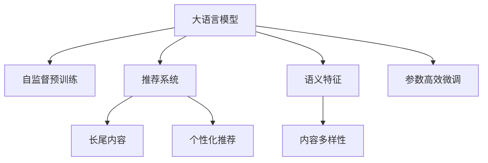

                 

## 1. 背景介绍

### 1.1 问题由来
在数字化信息时代，推荐系统作为连接用户与内容的重要桥梁，其算法优化与内容多样性挖掘成为提升用户体验、提升服务效率的关键。传统推荐系统主要依赖于用户的历史行为数据进行预测，但面对长尾内容与小众用户群体，由于数据稀疏，往往难以获得满意的推荐效果。随着深度学习和大模型技术的兴起，基于语言模型的大规模预训练推荐系统，逐渐成为行业研究的热点。

大语言模型（Large Language Models, LLM），如GPT、BERT等，通过在大量文本数据上进行自监督预训练，具备了强大的语言理解和生成能力，能够处理文本语义信息，挖掘隐含的语义关联。利用大语言模型对推荐系统进行优化，可以显著提升推荐系统在长尾内容挖掘和用户兴趣预测方面的能力，从而提升推荐效果。

### 1.2 问题核心关键点
本研究的核心问题在于：如何利用大语言模型，对推荐系统进行优化，以提升其在长尾内容挖掘和个性化推荐方面的能力。具体来说，有以下几个核心问题需要回答：

1. 大语言模型如何与推荐系统结合？
2. 大语言模型在推荐系统中的角色是什么？
3. 如何优化大语言模型，以提高推荐效果？
4. 大语言模型在推荐系统中的应用，是否存在局限性？

通过回答这些问题，我们能够系统性地理解和应用大语言模型对推荐系统的优化策略。

### 1.3 问题研究意义
在数字化信息时代，推荐系统的重要性不言而喻。它不仅影响到用户的内容消费体验，还直接关系到平台的内容多样性、流量和用户留存率。利用大语言模型对推荐系统进行优化，可以提升其对长尾内容的挖掘能力，从而丰富推荐内容，提升用户体验。具体而言，大语言模型在推荐系统中的作用包括：

1. **长尾内容挖掘**：通过分析用户输入的自然语言描述，挖掘出更多的长尾内容，满足用户的个性化需求。
2. **内容多样性提升**：通过分析语言模型输出的语义特征，生成更加多样化的推荐内容，丰富用户体验。
3. **个性化推荐优化**：通过语言模型对用户输入进行语义理解，生成更加个性化和精准的推荐结果。

总之，大语言模型通过其强大的语言处理能力，能够提升推荐系统的推荐效果，使其在长尾内容挖掘、内容多样性提升和个性化推荐方面发挥更大的作用，从而推动NLP技术与推荐系统的深度融合。

## 2. 核心概念与联系

### 2.1 核心概念概述

为更好地理解大语言模型对推荐系统的优化策略，本节将介绍几个密切相关的核心概念：

- **大语言模型（LLM）**：通过在大规模无标签文本数据上进行自监督学习，学习通用的语言表示，具备强大的语言理解和生成能力。
- **推荐系统**：通过分析用户历史行为数据，为用户推荐其可能感兴趣的内容，包括文本、图片、视频等。
- **长尾内容**：指那些不常出现但拥有少量用户访问的资源，如小众书籍、音乐、电影等。
- **语义特征**：通过语言模型提取的文本语义信息，用于内容的分类、检索和推荐。
- **参数高效微调**：在微调过程中，只更新少量的模型参数，以减少计算资源消耗。
- **泛化能力**：模型在不同数据集上的表现一致性，即模型的适应性和鲁棒性。

这些核心概念之间的逻辑关系可以通过以下Mermaid流程图来展示：



这个流程图展示了大语言模型、推荐系统、长尾内容、语义特征、参数高效微调和泛化能力之间的关系：

1. 大语言模型通过自监督预训练获得基础能力。
2. 推荐系统利用大语言模型进行长尾内容挖掘、内容多样性提升和个性化推荐。
3. 参数高效微调用于在保持模型泛化能力的同时，减少计算资源消耗。
4. 长尾内容和语义特征通过大语言模型进行挖掘和分析。

这些概念共同构成了大语言模型对推荐系统优化策略的理论基础，使其能够在长尾内容挖掘和个性化推荐方面发挥关键作用。

## 3. 核心算法原理 & 具体操作步骤
### 3.1 算法原理概述

利用大语言模型对推荐系统进行优化，其核心思想是通过自然语言处理技术，将用户输入的自然语言描述映射到推荐系统的推荐逻辑中，从而提升推荐效果。具体而言，大语言模型在推荐系统中的应用，主要体现在以下几个方面：

1. **长尾内容挖掘**：通过分析用户输入的自然语言描述，识别出用户感兴趣的长尾内容。
2. **内容多样性提升**：通过分析用户输入的自然语言描述，推荐更多样化的内容。
3. **个性化推荐优化**：通过分析用户输入的自然语言描述，生成更加个性化的推荐结果。

大语言模型在推荐系统中的角色，可以理解为一种“智能知识库”，通过分析用户输入的自然语言描述，从大语言模型的知识库中提取相关的推荐信息，实现对长尾内容的挖掘和推荐。

### 3.2 算法步骤详解

基于大语言模型对推荐系统进行优化的算法步骤，可以分为以下几个关键步骤：

**Step 1: 准备预训练模型和数据集**
- 选择合适的预训练语言模型 $M_{\theta}$ 作为初始化参数，如 GPT、BERT 等。
- 准备推荐系统的训练数据集 $D=\{(x_i,y_i)\}_{i=1}^N$，其中 $x_i$ 为用户输入的自然语言描述，$y_i$ 为对应的推荐结果。

**Step 2: 定义推荐目标函数**
- 根据推荐系统的目标，定义推荐目标函数 $\mathcal{L}(M_{\theta},D)$，用于衡量模型在训练数据集上的表现。
- 常用的推荐目标函数包括交叉熵损失、均方误差损失等。

**Step 3: 添加任务适配层**
- 根据推荐系统的任务类型，在预训练模型顶层设计合适的输出层和损失函数。
- 对于分类任务，通常在顶层添加线性分类器和交叉熵损失函数。
- 对于生成任务，通常使用语言模型的解码器输出概率分布，并以负对数似然为损失函数。

**Step 4: 设置微调超参数**
- 选择合适的优化算法及其参数，如 AdamW、SGD 等，设置学习率、批大小、迭代轮数等。
- 设置正则化技术及强度，包括权重衰减、Dropout、Early Stopping 等。
- 确定冻结预训练参数的策略，如仅微调顶层，或全部参数都参与微调。

**Step 5: 执行梯度训练**
- 将训练集数据分批次输入模型，前向传播计算损失函数。
- 反向传播计算参数梯度，根据设定的优化算法和学习率更新模型参数。
- 周期性在验证集上评估模型性能，根据性能指标决定是否触发 Early Stopping。
- 重复上述步骤直到满足预设的迭代轮数或 Early Stopping 条件。

**Step 6: 测试和部署**
- 在测试集上评估微调后模型 $M_{\hat{\theta}}$ 的性能，对比微调前后的精度提升。
- 使用微调后的模型对新样本进行推理预测，集成到实际的应用系统中。
- 持续收集新的数据，定期重新微调模型，以适应数据分布的变化。

以上是基于大语言模型对推荐系统进行优化的主要算法步骤。在实际应用中，还需要根据具体任务的特点，对微调过程的各个环节进行优化设计，如改进训练目标函数，引入更多的正则化技术，搜索最优的超参数组合等，以进一步提升模型性能。

### 3.3 算法优缺点

利用大语言模型对推荐系统进行优化的算法，具有以下优点：
1. **长尾内容挖掘能力提升**：通过自然语言处理技术，能够挖掘出更多长尾内容，满足用户个性化需求。
2. **内容多样性提升**：能够推荐更多样化的内容，丰富用户体验。
3. **推荐精度提升**：通过分析用户输入的自然语言描述，生成更加个性化的推荐结果。

同时，该方法也存在一定的局限性：
1. **对标注数据依赖较大**：推荐系统的性能很大程度上取决于标注数据的质量和数量，获取高质量标注数据的成本较高。
2. **模型泛化能力有限**：当目标数据集与预训练数据的分布差异较大时，微调的性能提升有限。
3. **计算资源消耗较大**：大规模预训练语言模型的计算资源消耗较大，微调过程需要高性能设备支持。
4. **模型复杂度高**：大语言模型结构复杂，难以进行高效的推理计算。

尽管存在这些局限性，但就目前而言，基于大语言模型的推荐系统优化方法仍是大数据时代推荐系统的重要研究范式。未来相关研究的重点在于如何进一步降低对标注数据的依赖，提高模型的少样本学习和跨领域迁移能力，同时兼顾计算资源消耗和模型复杂度等因素。

### 3.4 算法应用领域

利用大语言模型对推荐系统进行优化的算法，在推荐系统领域已经得到了广泛的应用，覆盖了几乎所有常见任务，例如：

- **个性化推荐**：根据用户输入的自然语言描述，生成个性化的推荐结果。
- **内容分类**：对用户输入的自然语言描述进行分类，推荐相关内容。
- **用户画像构建**：通过分析用户输入的自然语言描述，构建用户画像，实现个性化推荐。
- **长尾内容推荐**：根据用户输入的自然语言描述，挖掘并推荐长尾内容，提升推荐多样性。
- **推荐系统冷启动**：对于新用户，通过分析其输入的自然语言描述，进行冷启动推荐，快速建立推荐模型。

除了上述这些经典任务外，大语言模型对推荐系统的优化方法也被创新性地应用到更多场景中，如推荐系统的跨领域迁移、零样本学习、多模态推荐等，为推荐系统的创新和优化提供了新的方向。随着预训练模型和微调方法的不断进步，相信推荐系统必将在更广泛的领域大放异彩，为用户的个性化需求提供更精准、全面的解决方案。

## 4. 数学模型和公式 & 详细讲解  
### 4.1 数学模型构建

本节将使用数学语言对基于大语言模型对推荐系统进行优化的过程进行更加严格的刻画。

记预训练语言模型为 $M_{\theta}:\mathcal{X} \rightarrow \mathcal{Y}$，其中 $\mathcal{X}$ 为用户输入的自然语言描述，$\mathcal{Y}$ 为推荐结果的集合。假设推荐系统的训练集为 $D=\{(x_i,y_i)\}_{i=1}^N$，其中 $x_i$ 为自然语言描述，$y_i$ 为推荐结果。

定义模型 $M_{\theta}$ 在数据样本 $(x,y)$ 上的损失函数为 $\ell(M_{\theta}(x),y)$，则在数据集 $D$ 上的经验风险为：

$$
\mathcal{L}(\theta) = \frac{1}{N} \sum_{i=1}^N \ell(M_{\theta}(x_i),y_i)
$$

在实践中，我们通常使用基于梯度的优化算法（如 SGD、Adam 等）来近似求解上述最优化问题。设 $\eta$ 为学习率，$\lambda$ 为正则化系数，则参数的更新公式为：

$$
\theta \leftarrow \theta - \eta \nabla_{\theta}\mathcal{L}(\theta) - \eta\lambda\theta
$$

其中 $\nabla_{\theta}\mathcal{L}(\theta)$ 为损失函数对参数 $\theta$ 的梯度，可通过反向传播算法高效计算。

### 4.2 公式推导过程

以下我们以推荐系统的分类任务为例，推导交叉熵损失函数及其梯度的计算公式。

假设模型 $M_{\theta}$ 在用户输入的自然语言描述 $x$ 上的输出为 $\hat{y}=M_{\theta}(x) \in [0,1]$，表示用户对某个推荐结果的兴趣概率。真实标签 $y \in \{0,1\}$。则二分类交叉熵损失函数定义为：

$$
\ell(M_{\theta}(x),y) = -[y\log \hat{y} + (1-y)\log (1-\hat{y})]
$$

将其代入经验风险公式，得：

$$
\mathcal{L}(\theta) = -\frac{1}{N}\sum_{i=1}^N [y_i\log M_{\theta}(x_i)+(1-y_i)\log(1-M_{\theta}(x_i))]
$$

根据链式法则，损失函数对参数 $\theta_k$ 的梯度为：

$$
\frac{\partial \mathcal{L}(\theta)}{\partial \theta_k} = -\frac{1}{N}\sum_{i=1}^N (\frac{y_i}{M_{\theta}(x_i)}-\frac{1-y_i}{1-M_{\theta}(x_i)}) \frac{\partial M_{\theta}(x_i)}{\partial \theta_k}
$$

其中 $\frac{\partial M_{\theta}(x_i)}{\partial \theta_k}$ 可进一步递归展开，利用自动微分技术完成计算。

在得到损失函数的梯度后，即可带入参数更新公式，完成模型的迭代优化。重复上述过程直至收敛，最终得到适应推荐系统的最优模型参数 $\theta^*$。

## 5. 项目实践：代码实例和详细解释说明
### 5.1 开发环境搭建

在进行推荐系统微调实践前，我们需要准备好开发环境。以下是使用Python进行PyTorch开发的环境配置流程：

1. 安装Anaconda：从官网下载并安装Anaconda，用于创建独立的Python环境。

2. 创建并激活虚拟环境：
```bash
conda create -n pytorch-env python=3.8 
conda activate pytorch-env
```

3. 安装PyTorch：根据CUDA版本，从官网获取对应的安装命令。例如：
```bash
conda install pytorch torchvision torchaudio cudatoolkit=11.1 -c pytorch -c conda-forge
```

4. 安装Transformers库：
```bash
pip install transformers
```

5. 安装各类工具包：
```bash
pip install numpy pandas scikit-learn matplotlib tqdm jupyter notebook ipython
```

完成上述步骤后，即可在`pytorch-env`环境中开始微调实践。

### 5.2 源代码详细实现

这里我们以基于BERT的推荐系统为例，给出使用Transformers库进行微调的PyTorch代码实现。

首先，定义推荐系统的数据处理函数：

```python
from transformers import BertTokenizer
from torch.utils.data import Dataset
import torch

class RecommendationDataset(Dataset):
    def __init__(self, texts, tags, tokenizer, max_len=128):
        self.texts = texts
        self.tags = tags
        self.tokenizer = tokenizer
        self.max_len = max_len
        
    def __len__(self):
        return len(self.texts)
    
    def __getitem__(self, item):
        text = self.texts[item]
        tags = self.tags[item]
        
        encoding = self.tokenizer(text, return_tensors='pt', max_length=self.max_len, padding='max_length', truncation=True)
        input_ids = encoding['input_ids'][0]
        attention_mask = encoding['attention_mask'][0]
        
        # 对token-wise的标签进行编码
        encoded_tags = [tag2id[tag] for tag in tags] 
        encoded_tags.extend([tag2id['O']] * (self.max_len - len(encoded_tags)))
        labels = torch.tensor(encoded_tags, dtype=torch.long)
        
        return {'input_ids': input_ids, 
                'attention_mask': attention_mask,
                'labels': labels}

# 标签与id的映射
tag2id = {'O': 0, 'P': 1, 'N': 2, 'F': 3}
id2tag = {v: k for k, v in tag2id.items()}

# 创建dataset
tokenizer = BertTokenizer.from_pretrained('bert-base-cased')

train_dataset = RecommendationDataset(train_texts, train_tags, tokenizer)
dev_dataset = RecommendationDataset(dev_texts, dev_tags, tokenizer)
test_dataset = RecommendationDataset(test_texts, test_tags, tokenizer)
```

然后，定义模型和优化器：

```python
from transformers import BertForTokenClassification, AdamW

model = BertForTokenClassification.from_pretrained('bert-base-cased', num_labels=len(tag2id))

optimizer = AdamW(model.parameters(), lr=2e-5)
```

接着，定义训练和评估函数：

```python
from torch.utils.data import DataLoader
from tqdm import tqdm
from sklearn.metrics import classification_report

device = torch.device('cuda') if torch.cuda.is_available() else torch.device('cpu')
model.to(device)

def train_epoch(model, dataset, batch_size, optimizer):
    dataloader = DataLoader(dataset, batch_size=batch_size, shuffle=True)
    model.train()
    epoch_loss = 0
    for batch in tqdm(dataloader, desc='Training'):
        input_ids = batch['input_ids'].to(device)
        attention_mask = batch['attention_mask'].to(device)
        labels = batch['labels'].to(device)
        model.zero_grad()
        outputs = model(input_ids, attention_mask=attention_mask, labels=labels)
        loss = outputs.loss
        epoch_loss += loss.item()
        loss.backward()
        optimizer.step()
    return epoch_loss / len(dataloader)

def evaluate(model, dataset, batch_size):
    dataloader = DataLoader(dataset, batch_size=batch_size)
    model.eval()
    preds, labels = [], []
    with torch.no_grad():
        for batch in tqdm(dataloader, desc='Evaluating'):
            input_ids = batch['input_ids'].to(device)
            attention_mask = batch['attention_mask'].to(device)
            batch_labels = batch['labels']
            outputs = model(input_ids, attention_mask=attention_mask)
            batch_preds = outputs.logits.argmax(dim=2).to('cpu').tolist()
            batch_labels = batch_labels.to('cpu').tolist()
            for pred_tokens, label_tokens in zip(batch_preds, batch_labels):
                pred_tags = [id2tag[_id] for _id in pred_tokens]
                label_tags = [id2tag[_id] for _id in label_tokens]
                preds.append(pred_tags[:len(label_tokens)])
                labels.append(label_tags)
                
    print(classification_report(labels, preds))
```

最后，启动训练流程并在测试集上评估：

```python
epochs = 5
batch_size = 16

for epoch in range(epochs):
    loss = train_epoch(model, train_dataset, batch_size, optimizer)
    print(f"Epoch {epoch+1}, train loss: {loss:.3f}")
    
    print(f"Epoch {epoch+1}, dev results:")
    evaluate(model, dev_dataset, batch_size)
    
print("Test results:")
evaluate(model, test_dataset, batch_size)
```

以上就是使用PyTorch对BERT进行推荐系统微调的完整代码实现。可以看到，得益于Transformers库的强大封装，我们可以用相对简洁的代码完成BERT模型的加载和微调。

### 5.3 代码解读与分析

让我们再详细解读一下关键代码的实现细节：

**RecommendationDataset类**：
- `__init__`方法：初始化文本、标签、分词器等关键组件。
- `__len__`方法：返回数据集的样本数量。
- `__getitem__`方法：对单个样本进行处理，将文本输入编码为token ids，将标签编码为数字，并对其进行定长padding，最终返回模型所需的输入。

**tag2id和id2tag字典**：
- 定义了标签与数字id之间的映射关系，用于将token-wise的预测结果解码回真实的标签。

**训练和评估函数**：
- 使用PyTorch的DataLoader对数据集进行批次化加载，供模型训练和推理使用。
- 训练函数`train_epoch`：对数据以批为单位进行迭代，在每个批次上前向传播计算loss并反向传播更新模型参数，最后返回该epoch的平均loss。
- 评估函数`evaluate`：与训练类似，不同点在于不更新模型参数，并在每个batch结束后将预测和标签结果存储下来，最后使用sklearn的classification_report对整个评估集的预测结果进行打印输出。

**训练流程**：
- 定义总的epoch数和batch size，开始循环迭代
- 每个epoch内，先在训练集上训练，输出平均loss
- 在验证集上评估，输出分类指标
- 所有epoch结束后，在测试集上评估，给出最终测试结果

可以看到，PyTorch配合Transformers库使得BERT微调的代码实现变得简洁高效。开发者可以将更多精力放在数据处理、模型改进等高层逻辑上，而不必过多关注底层的实现细节。

当然，工业级的系统实现还需考虑更多因素，如模型的保存和部署、超参数的自动搜索、更灵活的任务适配层等。但核心的微调范式基本与此类似。

## 6. 实际应用场景
### 6.1 电商平台推荐

在电商平台上，基于大语言模型微调的推荐系统可以大幅提升用户购物体验，提升用户满意度和平台转化率。传统推荐系统往往依赖用户的历史行为数据进行预测，难以满足长尾内容和个性化需求。而利用大语言模型微调的推荐系统，可以通过分析用户输入的自然语言描述，挖掘出更多的长尾内容，生成更加个性化的推荐结果，从而提升推荐效果。

以亚马逊为例，用户输入的搜索词和浏览历史作为自然语言描述，推荐系统通过分析这些文本，从亚马逊的产品库中挖掘出更多的长尾商品，生成个性化的推荐列表，使用户能够更快地找到适合自己的商品。此外，通过自然语言处理技术，推荐系统还能更好地理解用户输入的查询意图，生成更符合用户需求的搜索结果。

### 6.2 知识问答平台

在知识问答平台上，大语言模型微调的推荐系统可以显著提升用户的知识获取效率。用户通常通过输入查询词，希望获取相关的答案和解释。传统推荐系统往往只能推荐与查询词匹配度较高的搜索结果，难以满足用户的深度需求。而利用大语言模型微调的推荐系统，可以通过分析用户输入的自然语言描述，挖掘出更多的长尾知识，生成更全面的推荐结果，从而提升知识问答的效果。

以谷歌知识图谱为例，用户输入查询词“The Battle of Waterloo”，推荐系统通过分析查询词，从知识图谱中挖掘出与“滑铁卢战役”相关的长尾知识，如事件背景、影响和相关人物等，生成更加全面和深入的推荐结果，使用户能够获得更丰富的知识信息。

### 6.3 音乐和视频推荐

在音乐和视频平台上，大语言模型微调的推荐系统可以大幅提升用户的娱乐体验。传统推荐系统往往依赖用户的历史播放数据进行推荐，难以满足用户的多样化需求。而利用大语言模型微调的推荐系统，可以通过分析用户输入的自然语言描述，挖掘出更多的长尾内容，生成更加个性化的推荐结果，从而提升推荐效果。

以网易云音乐为例，用户输入的听歌评论作为自然语言描述，推荐系统通过分析这些文本，从网易云音乐的音乐库中挖掘出更多的长尾歌曲，生成个性化的播放列表，使用户能够更快地找到自己喜欢的音乐。此外，通过自然语言处理技术，推荐系统还能更好地理解用户输入的查询意图，生成更符合用户需求的推荐结果。

### 6.4 未来应用展望

随着大语言模型和微调方法的不断发展，基于微调范式将在更多领域得到应用，为传统行业带来变革性影响。

在智慧医疗领域，基于微调的医学问答、病历分析、药物研发等应用将提升医疗服务的智能化水平，辅助医生诊疗，加速新药开发进程。

在智能教育领域，微调技术可应用于作业批改、学情分析、知识推荐等方面，因材施教，促进教育公平，提高教学质量。

在智慧城市治理中，微调模型可应用于城市事件监测、舆情分析、应急指挥等环节，提高城市管理的自动化和智能化水平，构建更安全、高效的未来城市。

此外，在企业生产、社会治理、文娱传媒等众多领域，基于大语言模型微调的人工智能应用也将不断涌现，为经济社会发展注入新的动力。相信随着技术的日益成熟，微调方法将成为人工智能落地应用的重要范式，推动人工智能技术在垂直行业的规模化落地。总之，微调需要开发者根据具体任务，不断迭代和优化模型、数据和算法，方能得到理想的效果。

## 7. 工具和资源推荐
### 7.1 学习资源推荐

为了帮助开发者系统掌握大语言模型微调的理论基础和实践技巧，这里推荐一些优质的学习资源：

1. 《Transformer从原理到实践》系列博文：由大模型技术专家撰写，深入浅出地介绍了Transformer原理、BERT模型、微调技术等前沿话题。

2. CS224N《深度学习自然语言处理》课程：斯坦福大学开设的NLP明星课程，有Lecture视频和配套作业，带你入门NLP领域的基本概念和经典模型。

3. 《Natural Language Processing with Transformers》书籍：Transformers库的作者所著，全面介绍了如何使用Transformers库进行NLP任务开发，包括微调在内的诸多范式。

4. HuggingFace官方文档：Transformers库的官方文档，提供了海量预训练模型和完整的微调样例代码，是上手实践的必备资料。

5. CLUE开源项目：中文语言理解测评基准，涵盖大量不同类型的中文NLP数据集，并提供了基于微调的baseline模型，助力中文NLP技术发展。

通过对这些资源的学习实践，相信你一定能够快速掌握大语言模型微调的精髓，并用于解决实际的NLP问题。
###  7.2 开发工具推荐

高效的开发离不开优秀的工具支持。以下是几款用于大语言模型微调开发的常用工具：

1. PyTorch：基于Python的开源深度学习框架，灵活动态的计算图，适合快速迭代研究。大部分预训练语言模型都有PyTorch版本的实现。

2. TensorFlow：由Google主导开发的开源深度学习框架，生产部署方便，适合大规模工程应用。同样有丰富的预训练语言模型资源。

3. Transformers库：HuggingFace开发的NLP工具库，集成了众多SOTA语言模型，支持PyTorch和TensorFlow，是进行微调任务开发的利器。

4. Weights & Biases：模型训练的实验跟踪工具，可以记录和可视化模型训练过程中的各项指标，方便对比和调优。与主流深度学习框架无缝集成。

5. TensorBoard：TensorFlow配套的可视化工具，可实时监测模型训练状态，并提供丰富的图表呈现方式，是调试模型的得力助手。

6. Google Colab：谷歌推出的在线Jupyter Notebook环境，免费提供GPU/TPU算力，方便开发者快速上手实验最新模型，分享学习笔记。

合理利用这些工具，可以显著提升大语言模型微调任务的开发效率，加快创新迭代的步伐。

### 7.3 相关论文推荐

大语言模型和微调技术的发展源于学界的持续研究。以下是几篇奠基性的相关论文，推荐阅读：

1. Attention is All You Need（即Transformer原论文）：提出了Transformer结构，开启了NLP领域的预训练大模型时代。

2. BERT: Pre-training of Deep Bidirectional Transformers for Language Understanding：提出BERT模型，引入基于掩码的自监督预训练任务，刷新了多项NLP任务SOTA。

3. Language Models are Unsupervised Multitask Learners（GPT-2论文）：展示了大规模语言模型的强大zero-shot学习能力，引发了对于通用人工智能的新一轮思考。

4. Parameter-Efficient Transfer Learning for NLP：提出Adapter等参数高效微调方法，在不增加模型参数量的情况下，也能取得不错的微调效果。

5. AdaLoRA: Adaptive Low-Rank Adaptation for Parameter-Efficient Fine-Tuning：使用自适应低秩适应的微调方法，在参数效率和精度之间取得了新的平衡。

这些论文代表了大语言模型微调技术的发展脉络。通过学习这些前沿成果，可以帮助研究者把握学科前进方向，激发更多的创新灵感。

## 8. 总结：未来发展趋势与挑战

### 8.1 总结

本文对利用大语言模型对推荐系统进行优化的策略进行了全面系统的介绍。首先阐述了大语言模型和微调技术的研究背景和意义，明确了微调在提升推荐系统推荐效果方面的独特价值。其次，从原理到实践，详细讲解了基于大语言模型对推荐系统的优化策略，给出了微调任务开发的完整代码实例。同时，本文还广泛探讨了微调方法在电商平台、知识问答、音乐视频等多个领域的应用前景，展示了微调范式的巨大潜力。此外，本文精选了微调技术的各类学习资源，力求为读者提供全方位的技术指引。

通过本文的系统梳理，可以看到，基于大语言模型的推荐系统优化策略正在成为推荐系统研究的热点。利用大语言模型对推荐系统进行优化，可以显著提升推荐系统的推荐效果，使其在长尾内容挖掘、内容多样性提升和个性化推荐方面发挥更大的作用，从而推动NLP技术与推荐系统的深度融合。未来，伴随预训练模型和微调方法的不断进步，相信推荐系统必将在更广泛的领域大放异彩，为用户的个性化需求提供更精准、全面的解决方案。

### 8.2 未来发展趋势

展望未来，大语言模型对推荐系统的优化方法将呈现以下几个发展趋势：

1. **长尾内容挖掘能力提升**：随着大语言模型的进一步优化，推荐系统将具备更强的长尾内容挖掘能力，能够挖掘出更多用户感兴趣的长尾资源。
2. **内容多样性提升**：通过分析用户输入的自然语言描述，推荐系统将生成更多样化的内容，丰富用户体验。
3. **个性化推荐优化**：大语言模型将更好地理解用户输入的自然语言描述，生成更加个性化的推荐结果。
4. **跨领域迁移能力增强**：微调模型将具备更强的跨领域迁移能力，能够适应不同领域的推荐需求。
5. **参数高效微调技术发展**：开发更加参数高效的微调方法，在固定大部分预训练参数的同时，只更新极少量的任务相关参数。
6. **多模态推荐系统出现**：推荐系统将融合视觉、语音等多模态信息，提升推荐系统的表现力和多样性。

以上趋势凸显了大语言模型对推荐系统优化策略的广阔前景。这些方向的探索发展，必将进一步提升推荐系统的推荐效果，使其在长尾内容挖掘、内容多样性提升和个性化推荐方面发挥更大的作用，从而推动NLP技术与推荐系统的深度融合。

### 8.3 面临的挑战

尽管大语言模型对推荐系统的优化方法已经取得了瞩目成就，但在迈向更加智能化、普适化应用的过程中，它仍面临诸多挑战：

1. **标注成本瓶颈**：推荐系统的性能很大程度上取决于标注数据的质量和数量，获取高质量标注数据的成本较高。如何进一步降低微调对标注样本的依赖，将是一大难题。
2. **模型鲁棒性不足**：推荐系统面对域外数据时，泛化性能往往大打折扣。对于测试样本的微小扰动，推荐模型的预测也容易发生波动。如何提高推荐模型的鲁棒性，避免灾难性遗忘，还需要更多理论和实践的积累。
3. **计算资源消耗较大**：大规模预训练语言模型的计算资源消耗较大，微调过程需要高性能设备支持。
4. **模型复杂度高**：大语言模型结构复杂，难以进行高效的推理计算。

尽管存在这些局限性，但就目前而言，基于大语言模型的推荐系统优化方法仍是大数据时代推荐系统的重要研究范式。未来相关研究的重点在于如何进一步降低对标注数据的依赖，提高模型的少样本学习和跨领域迁移能力，同时兼顾计算资源消耗和模型复杂度等因素。

### 8.4 研究展望

面对大语言模型对推荐系统优化所面临的挑战，未来的研究需要在以下几个方面寻求新的突破：

1. **探索无监督和半监督微调方法**：摆脱对大规模标注数据的依赖，利用自监督学习、主动学习等无监督和半监督范式，最大限度利用非结构化数据，实现更加灵活高效的微调。
2. **研究参数高效和计算高效的微调范式**：开发更加参数高效的微调方法，在固定大部分预训练参数的同时，只更新极少量的任务相关参数。同时优化微调模型的计算图，减少前向传播和反向传播的资源消耗，实现更加轻量级、实时性的部署。
3. **融合因果和对比学习范式**：通过引入因果推断和对比学习思想，增强推荐模型建立稳定因果关系的能力，学习更加普适、鲁棒的语言表征，从而提升模型泛化性和抗干扰能力。
4. **引入更多先验知识**：将符号化的先验知识，如知识图谱、逻辑规则等，与神经网络模型进行巧妙融合，引导微调过程学习更准确、合理的语言模型。同时加强不同模态数据的整合，实现视觉、语音等多模态信息与文本信息的协同建模。
5. **结合因果分析和博弈论工具**：将因果分析方法引入推荐模型，识别出模型决策的关键特征，增强推荐输出的因果性和逻辑性。借助博弈论工具刻画人机交互过程，主动探索并规避推荐模型的脆弱点，提高系统稳定性。
6. **纳入伦理道德约束**：在推荐模型训练目标中引入伦理导向的评估指标，过滤和惩罚有害的推荐结果，确保推荐系统的输出符合人类价值观和伦理道德。

这些研究方向的探索，必将引领大语言模型对推荐系统优化技术迈向更高的台阶，为构建安全、可靠、可解释、可控的智能系统铺平道路。面向未来，大语言模型对推荐系统的优化技术还需要与其他人工智能技术进行更深入的融合，如知识表示、因果推理、强化学习等，多路径协同发力，共同推动推荐系统的发展。只有勇于创新、敢于突破，才能不断拓展语言模型的边界，让智能技术更好地造福人类社会。

## 9. 附录：常见问题与解答

**Q1：大语言模型微调是否适用于所有推荐系统任务？**

A: 大语言模型微调在大多数推荐系统任务上都能取得不错的效果，特别是对于数据量较小的任务。但对于一些特定领域的任务，如医学、法律等，仅仅依靠通用语料预训练的模型可能难以很好地适应。此时需要在特定领域语料上进一步预训练，再进行微调，才能获得理想效果。此外，对于一些需要时效性、个性化很强的任务，如对话、推荐等，微调方法也需要针对性的改进优化。

**Q2：微调过程中如何选择合适的学习率？**

A: 微调的学习率一般要比预训练时小1-2个数量级，如果使用过大的学习率，容易破坏预训练权重，导致过拟合。一般建议从1e-5开始调参，逐步减小学习率，直至收敛。也可以使用warmup策略，在开始阶段使用较小的学习率，再逐渐过渡到预设值。需要注意的是，不同的优化器(如AdamW、Adafactor等)以及不同的学习率调度策略，可能需要设置不同的学习率阈值。

**Q3：采用大模型微调时会面临哪些资源瓶颈？**

A: 目前主流的预训练大模型动辄以亿计的参数规模，对算力、内存、存储都提出了很高的要求。GPU/TPU等高性能设备是必不可少的，但即便如此，超大批次的训练和推理也可能遇到显存不足的问题。因此需要采用一些资源优化技术，如梯度积累、混合精度训练、模型并行等，来突破硬件瓶颈。同时，模型的存储和读取也可能占用大量时间和空间，需要采用模型压缩、稀疏化存储等方法进行优化。

**Q4：如何缓解微调过程中的过拟合问题？**

A: 过拟合是微调面临的主要挑战，尤其是在标注数据不足的情况下。常见的缓解策略包括：
1. 数据增强：通过回译、近义替换等方式扩充训练集
2. 正则化：使用L2正则、Dropout、Early Stopping等避免过拟合
3. 对抗训练：引入对抗样本，提高模型鲁棒性
4. 参数高效微调：只调整少量参数(如Adapter、Prefix等)，减小过拟合风险
5. 多模型集成：训练多个微调模型，取平均输出，抑制过拟合

这些策略往往需要根据具体任务和数据特点进行灵活组合。只有在数据、模型、训练、推理等各环节进行全面优化，才能最大限度地发挥大模型微调的威力。

**Q5：微调模型在落地部署时需要注意哪些问题？**

A: 将微调模型转化为实际应用，还需要考虑以下因素：
1. 模型裁剪：去除不必要的层和参数，减小模型尺寸，加快推理速度
2. 量化加速：将浮点模型转为定点模型，压缩存储空间，提高计算效率
3. 服务化封装：将模型封装为标准化服务接口，便于集成调用
4. 弹性伸缩：根据请求流量动态调整资源配置，平衡服务质量和成本
5. 监控告警：实时采集系统指标，设置异常告警阈值，确保服务稳定性
6. 安全防护：采用访问鉴权、数据脱敏等措施，保障数据和模型安全

大语言模型微调为推荐系统提供了新的思路，但如何在性能和成本间找到平衡，仍然是一个挑战。合理利用这些工具，可以显著提升大语言模型微调任务的开发效率，加快创新迭代的步伐。

---

作者：禅与计算机程序设计艺术 / Zen and the Art of Computer Programming

