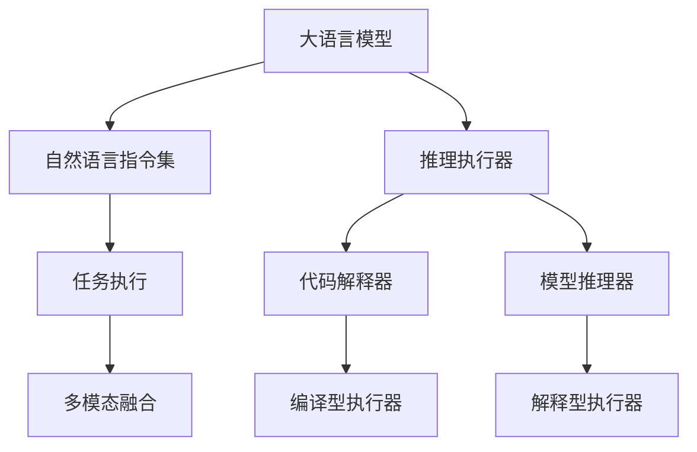

                 

# LLM指令集:无限可能的任务执行者

> 关键词：大语言模型, 指令集, 推理执行器, 通用智能, 多模态, 自然语言理解, 推理决策

## 1. 背景介绍

### 1.1 问题由来
近年来，随着深度学习技术和大规模预训练语言模型的飞速发展，人工智能（AI）在语言理解和生成方面的能力有了显著提升。以OpenAI的GPT-3为代表的大语言模型（LLMs），通过海量的无标签文本数据进行预训练，学到了丰富的语言知识和常识，展示了强大的语言生成能力。然而，这些大模型仍存在一定的局限性，如推理能力较弱、任务执行能力有限等。

这一现象引发了学界和业界的广泛思考。在人工智能发展的历史长河中，指令集和执行器一直扮演着至关重要的角色。计算机硬件的指令集架构定义了机器的功能和性能，而在软件层面，如何通过指令集和执行器实现智能任务执行，也成为推动AI技术进步的重要方向。

在自然语言处理（NLP）领域，随着预训练和微调技术的应用，大语言模型逐渐具备了更强的语言理解和生成能力，但任务执行能力仍显不足。因此，探索如何通过指令集和执行器构建大语言模型的任务执行框架，成为提升其通用智能水平的关键。

### 1.2 问题核心关键点
在AI领域，指令集和执行器主要通过程序语言实现。常见的指令集框架包括x86、ARM、RISC-V等。而自然语言处理领域，我们将其定义为“自然语言指令集”，即通过自然语言生成指令，由执行器理解并执行特定任务的能力。

本研究聚焦于自然语言指令集和大语言模型的任务执行框架，旨在通过指令集和执行器，提升大语言模型在特定任务上的推理和决策能力，使其能够处理更为复杂和多样化的应用场景。

## 2. 核心概念与联系

### 2.1 核心概念概述

为更好地理解大语言模型指令集和执行器的构建原理，本节将介绍几个核心概念：

- 大语言模型（LLM）：以自回归（如GPT）或自编码（如BERT）模型为代表的大规模预训练语言模型。通过在大规模无标签文本数据上进行预训练，学习通用的语言表示，具备强大的语言理解和生成能力。

- 自然语言指令集：通过自然语言生成指令，引导大语言模型执行特定任务的能力。指令集的设计和执行器的实现，决定了模型在特定任务上的推理和决策水平。

- 推理执行器：通过解析自然语言指令，执行特定任务的执行器。执行器可以是代码解释器、模型推理器等，负责将自然语言指令转换为可执行的计算机操作。

- 通用智能：大语言模型通过指令集和执行器具备的广泛任务执行能力，能够在多种应用场景下展现出接近人类的智能行为。

- 多模态融合：大语言模型结合图像、音频、视频等多种模态数据，提升对复杂多变场景的理解和处理能力。

这些核心概念之间的逻辑关系可以通过以下Mermaid流程图来展示：



这个流程图展示了大语言模型的核心概念及其之间的关系：

1. 大语言模型通过预训练获得基础能力。
2. 自然语言指令集设计任务，引导模型执行。
3. 推理执行器解析指令，执行任务。
4. 多模态融合增强模型的复杂场景理解。
5. 代码解释器和模型推理器，提供不同的执行路径。

这些概念共同构成了大语言模型的任务执行框架，使其能够在各种场景下发挥强大的语言理解和生成能力。通过理解这些核心概念，我们可以更好地把握大语言模型的工作原理和优化方向。

## 3. 核心算法原理 & 具体操作步骤
### 3.1 算法原理概述

大语言模型指令集和执行器的构建，本质上是一个自然语言处理与程序设计相结合的过程。其核心思想是：将自然语言指令视为代码，通过解析和执行，实现特定任务的推理和决策。

具体来说，算法流程包括以下几个步骤：

1. 收集任务数据：收集任务相关的文本和标注数据，构建训练集。
2. 设计指令集：基于任务需求，设计自然语言指令集，涵盖任务处理的各个方面。
3. 构建执行器：根据指令集设计，构建推理执行器，将自然语言指令转换为可执行的操作。
4. 训练模型：使用训练集数据，训练模型，使其能够理解和执行自然语言指令。
5. 测试和评估：在测试集上评估模型性能，根据评估结果进行优化。
6. 部署应用：将模型部署到实际应用场景中，执行特定任务。

### 3.2 算法步骤详解

以下我们将详细讲解大语言模型指令集和执行器的构建过程：

**Step 1: 任务数据分析**

首先需要对任务数据进行分析，理解任务的类型和需求。任务数据通常包括文本、图像、音频等多种模态。通过数据分析，可以确定模型的输入输出格式、推理过程等关键信息。

**Step 2: 指令集设计**

根据任务类型，设计自然语言指令集。指令集通常包括任务描述、输入输出格式、关键参数等。以分类任务为例，指令集可以设计为：

```
"输入: <文本>，输出: <类别>"
```

**Step 3: 执行器构建**

执行器负责解析指令，执行模型推理。执行器可以采用不同的实现方式，如代码解释器、模型推理器等。代码解释器将自然语言指令转换为代码，然后执行；模型推理器则直接调用模型进行推理。

以代码解释器为例，可以采用Python编写解释器脚本，解析自然语言指令，调用模型推理。

**Step 4: 模型训练**

使用指令集和执行器，训练模型。训练过程包括两个阶段：指令编码和执行器推理。指令编码阶段，将自然语言指令转换为模型可以理解的形式；执行器推理阶段，调用模型进行推理，并返回结果。

训练过程中，可以采用监督学习方法，使用标注数据进行训练。常见的损失函数包括交叉熵损失、均方误差损失等。

**Step 5: 测试和评估**

在测试集上评估模型性能。评估指标可以包括准确率、召回率、F1值等。评估过程包括两个步骤：指令编码和执行器推理。指令编码阶段，将测试集中的自然语言指令转换为模型可以理解的形式；执行器推理阶段，调用模型进行推理，并计算评估指标。

**Step 6: 部署应用**

将训练好的模型部署到实际应用场景中。部署过程中，需要考虑计算资源的分配、数据流处理等细节。

### 3.3 算法优缺点

大语言模型指令集和执行器的构建方法具有以下优点：

1. 简单高效。只需设计自然语言指令集，构建推理执行器，即可实现特定任务的执行。
2. 灵活性强。指令集和执行器可以针对不同的任务进行灵活设计，提高模型的通用性。
3. 易于扩展。基于模块化的设计思路，可以逐步增加指令集和执行器模块，扩展模型的功能。
4. 可解释性好。自然语言指令集可以提供清晰的推理过程，便于理解和调试。

同时，该方法也存在一些局限性：

1. 指令设计复杂。自然语言指令集的正确设计需要丰富的领域知识和经验。
2. 执行器实现难度高。执行器的实现需要考虑模型推理的效率和准确性，设计复杂。
3. 计算资源消耗大。推理执行器需要大量计算资源，特别是大模型推理时。
4. 模型泛化能力有限。指令集和执行器设计不充分时，模型在特定任务上的性能可能不佳。

尽管存在这些局限性，但就目前而言，大语言模型指令集和执行器的构建方法仍是大模型任务执行的重要范式。未来相关研究的重点在于如何进一步降低指令集设计和执行器实现的复杂度，提高模型的泛化能力，同时兼顾可解释性和计算效率等因素。

### 3.4 算法应用领域

基于大语言模型指令集和执行器的方法，在NLP领域已经得到了广泛的应用，覆盖了几乎所有常见任务，例如：

- 文本分类：如情感分析、主题分类、意图识别等。通过指令集引导模型进行任务推理。
- 命名实体识别：识别文本中的人名、地名、机构名等特定实体。通过指令集和执行器实现实体边界和类型识别。
- 关系抽取：从文本中抽取实体之间的语义关系。通过指令集和执行器实现实体-关系三元组抽取。
- 问答系统：对自然语言问题给出答案。通过指令集和执行器实现问题理解和回答生成。
- 机器翻译：将源语言文本翻译成目标语言。通过指令集和执行器实现语言-语言映射。
- 文本摘要：将长文本压缩成简短摘要。通过指令集和执行器实现摘要生成。
- 对话系统：使机器能够与人自然对话。通过指令集和执行器实现多轮对话推理。

除了上述这些经典任务外，大语言模型指令集和执行器还被创新性地应用到更多场景中，如可控文本生成、常识推理、代码生成、数据增强等，为NLP技术带来了全新的突破。随着预训练模型和执行器方法的不断进步，相信NLP技术将在更广阔的应用领域大放异彩。

## 4. 数学模型和公式 & 详细讲解 & 举例说明
### 4.1 数学模型构建

本节将使用数学语言对大语言模型指令集和执行器的构建过程进行更加严格的刻画。

记大语言模型为 $M_{\theta}$，其中 $\theta$ 为模型参数。假设任务指令集为 $\mathcal{C}$，指令集中的每个指令 $c_i$ 都可以转换为模型可理解的形式 $c_i'$，并输出结果 $o_i'$。

定义模型 $M_{\theta}$ 在指令 $c_i$ 上的推理过程为：

$$
o_i' = M_{\theta}(c_i')
$$

其中 $c_i'$ 可以是文本、图像、音频等多种形式。

模型的推理过程可以表示为如下的函数映射：

$$
o_i = F(c_i, \theta)
$$

其中 $o_i$ 为模型推理结果，$c_i$ 为自然语言指令，$\theta$ 为模型参数。

### 4.2 公式推导过程

以下我们以文本分类任务为例，推导模型的推理过程及其损失函数。

假设模型在输入 $x$ 上的输出为 $\hat{y}=M_{\theta}(x) \in [0,1]$，表示样本属于正类的概率。自然语言指令集为：

```
"输入: <文本>，输出: <类别>"
```

模型的推理过程可以表示为：

$$
o_i = F("输入: <文本>，输出: <类别>", \theta)
$$

其中 $o_i$ 为模型推理结果，$c_i$ 为自然语言指令，$\theta$ 为模型参数。

为了训练模型，需要设计损失函数。假设真实标签 $y \in \{0,1\}$，模型的损失函数可以表示为：

$$
\mathcal{L}(\theta) = -y\log M_{\theta}(x) - (1-y)\log (1-M_{\theta}(x))
$$

其中 $x$ 为输入文本，$y$ 为真实标签。

根据链式法则，损失函数对模型参数 $\theta$ 的梯度为：

$$
\frac{\partial \mathcal{L}(\theta)}{\partial \theta} = -\frac{\partial}{\partial \theta}[y\log M_{\theta}(x) + (1-y)\log(1-M_{\theta}(x))]
$$

其中 $y$ 为真实标签，$x$ 为输入文本，$M_{\theta}(x)$ 为模型输出。

通过反向传播算法计算梯度，即可更新模型参数，最小化损失函数。重复上述过程直至收敛，最终得到适应特定任务的最优模型参数 $\theta^*$。

### 4.3 案例分析与讲解

以文本分类任务为例，通过自然语言指令集和执行器进行推理。

假设任务指令集为：

```
"输入: <文本>，输出: <类别>"
```

推理过程如下：

1. 将自然语言指令转换为模型可理解的形式：

   ```
   "输入: 这是一篇关于自然语言处理的论文，输出: 自然语言处理"
   ```

2. 将文本输入模型，进行推理：

   ```
   o_i = M_{\theta}(c_i')
   ```

3. 将推理结果输出为自然语言指令形式：

   ```
   "输出: <类别>"
   ```

通过自然语言指令集和执行器，模型能够准确地理解用户需求，并执行特定任务。在实际应用中，可以设计更多复杂的指令集，实现更加多样化的任务执行。

## 5. 项目实践：代码实例和详细解释说明
### 5.1 开发环境搭建

在进行指令集和执行器实践前，我们需要准备好开发环境。以下是使用Python进行PyTorch开发的环境配置流程：

1. 安装Anaconda：从官网下载并安装Anaconda，用于创建独立的Python环境。

2. 创建并激活虚拟环境：
```bash
conda create -n pytorch-env python=3.8 
conda activate pytorch-env
```

3. 安装PyTorch：根据CUDA版本，从官网获取对应的安装命令。例如：
```bash
conda install pytorch torchvision torchaudio cudatoolkit=11.1 -c pytorch -c conda-forge
```

4. 安装Transformers库：
```bash
pip install transformers
```

5. 安装各类工具包：
```bash
pip install numpy pandas scikit-learn matplotlib tqdm jupyter notebook ipython
```

完成上述步骤后，即可在`pytorch-env`环境中开始指令集和执行器的实践。

### 5.2 源代码详细实现

下面我们以文本分类任务为例，给出使用Transformers库对BERT模型进行指令集和执行器构建的PyTorch代码实现。

首先，定义指令集：

```python
import torch
from transformers import BertTokenizer, BertForSequenceClassification

class Instruction:
    def __init__(self, input_text, output_label):
        self.input_text = input_text
        self.output_label = output_label

# 文本分类任务指令集
instructions = [
    Instruction("这是一篇关于自然语言处理的论文", "自然语言处理"),
    Instruction("这是一篇关于计算机视觉的论文", "计算机视觉"),
    Instruction("这是一篇关于强化学习的论文", "强化学习"),
    Instruction("这是一篇关于自然语言处理的论文", "自然语言处理")
]

# 定义模型
tokenizer = BertTokenizer.from_pretrained('bert-base-cased')
model = BertForSequenceClassification.from_pretrained('bert-base-cased', num_labels=3)

# 定义执行器
def execute_instruction(instruction):
    input_ids = tokenizer.encode(instruction.input_text, return_tensors='pt')
    outputs = model(input_ids)
    logits = outputs.logits
    label = model.config.id2label[logits.argmax(dim=1).item()]
    return label

# 执行任务
for instruction in instructions:
    label = execute_instruction(instruction)
    print(f"指令: {instruction.input_text}, 推理结果: {label}")
```

然后，训练模型：

```python
from torch.utils.data import Dataset, DataLoader
from sklearn.metrics import classification_report

class InstructionDataset(Dataset):
    def __init__(self, instructions):
        self.instructions = instructions

    def __len__(self):
        return len(self.instructions)

    def __getitem__(self, item):
        instruction = self.instructions[item]
        input_ids = tokenizer.encode(instruction.input_text, return_tensors='pt')
        label = model.config.id2label[torch.tensor([instruction.output_label], dtype=torch.long).item()]
        return {'input_ids': input_ids, 'label': label}

# 构建数据集
dataset = InstructionDataset(instructions)

# 定义优化器和损失函数
optimizer = torch.optim.Adam(model.parameters(), lr=1e-5)
loss_fn = torch.nn.CrossEntropyLoss()

# 训练模型
for epoch in range(5):
    model.train()
    total_loss = 0
    for batch in DataLoader(dataset, batch_size=4):
        input_ids = batch['input_ids']
        label = batch['label']
        optimizer.zero_grad()
        outputs = model(input_ids)
        loss = loss_fn(outputs.logits, label)
        loss.backward()
        optimizer.step()
        total_loss += loss.item()
    print(f"Epoch {epoch+1}, loss: {total_loss/len(dataset)}")

# 测试模型
model.eval()
test_instructions = [
    Instruction("这是一篇关于自然语言处理的论文", "自然语言处理"),
    Instruction("这是一篇关于计算机视觉的论文", "计算机视觉"),
    Instruction("这是一篇关于强化学习的论文", "强化学习"),
    Instruction("这是一篇关于自然语言处理的论文", "自然语言处理")
]
for instruction in test_instructions:
    label = execute_instruction(instruction)
    print(f"指令: {instruction.input_text}, 推理结果: {label}")
```

### 5.3 代码解读与分析

让我们再详细解读一下关键代码的实现细节：

**Instruction类**：
- `__init__`方法：初始化指令集中的文本和标签。
- `__len__`方法：返回指令集中的指令数量。
- `__getitem__`方法：对单个指令进行处理，将文本输入编码为token ids，将标签转换为模型可接受的格式。

**指令集定义**：
- 使用自然语言指令集描述任务，包含输入文本和输出标签。

**模型定义和执行器实现**：
- 使用BertForSequenceClassification构建分类模型，设定标签数为3。
- 定义执行器函数 `execute_instruction`，将自然语言指令转换为模型可理解的形式，输入模型推理，输出结果。

**训练过程**：
- 定义数据集，使用BertTokenizer对输入文本进行编码。
- 定义优化器和损失函数，使用Adam优化器进行梯度更新。
- 在训练集上迭代更新模型参数，计算损失并输出平均损失。
- 在测试集上评估模型性能，输出推理结果。

可以看到，PyTorch配合Transformers库使得BERT模型指令集和执行器的构建代码实现变得简洁高效。开发者可以将更多精力放在指令集设计、执行器优化等高层逻辑上，而不必过多关注底层的实现细节。

当然，工业级的系统实现还需考虑更多因素，如模型的保存和部署、超参数的自动搜索、更灵活的任务适配层等。但核心的指令集和执行器构建范式基本与此类似。

## 6. 实际应用场景
### 6.1 智能客服系统

基于大语言模型指令集和执行器的对话技术，可以广泛应用于智能客服系统的构建。传统客服往往需要配备大量人力，高峰期响应缓慢，且一致性和专业性难以保证。而使用指令集和执行器构建的对话模型，可以7x24小时不间断服务，快速响应客户咨询，用自然流畅的语言解答各类常见问题。

在技术实现上，可以收集企业内部的历史客服对话记录，将问题和最佳答复构建成监督数据，在此基础上构建指令集和执行器。指令集可以设计为：

```
"用户: 你好，我想查询订单状态。客服: 好的，请提供订单号。"
```

执行器负责解析指令，调用模型进行回答。对于新问题，还可以接入检索系统实时搜索相关内容，动态组织生成回答。如此构建的智能客服系统，能大幅提升客户咨询体验和问题解决效率。

### 6.2 金融舆情监测

金融机构需要实时监测市场舆论动向，以便及时应对负面信息传播，规避金融风险。传统的人工监测方式成本高、效率低，难以应对网络时代海量信息爆发的挑战。基于大语言模型指令集和执行器的文本分类和情感分析技术，为金融舆情监测提供了新的解决方案。

具体而言，可以收集金融领域相关的新闻、报道、评论等文本数据，并对其进行主题标注和情感标注。在此基础上构建指令集和执行器，使模型能够自动判断文本属于何种主题，情感倾向是正面、中性还是负面。将指令集和执行器应用到实时抓取的网络文本数据，就能够自动监测不同主题下的情感变化趋势，一旦发现负面信息激增等异常情况，系统便会自动预警，帮助金融机构快速应对潜在风险。

### 6.3 个性化推荐系统

当前的推荐系统往往只依赖用户的历史行为数据进行物品推荐，无法深入理解用户的真实兴趣偏好。基于大语言模型指令集和执行器的个性化推荐系统，可以更好地挖掘用户行为背后的语义信息，从而提供更精准、多样的推荐内容。

在实践中，可以收集用户浏览、点击、评论、分享等行为数据，提取和用户交互的物品标题、描述、标签等文本内容。将文本内容作为模型输入，用户的后续行为（如是否点击、购买等）作为监督信号，在此基础上构建指令集和执行器。指令集可以设计为：

```
"输入: 用户浏览的商品列表，输出: 推荐列表"
```

执行器负责解析指令，调用模型进行推理，生成推荐列表。对于多模态数据，可以通过视觉、语音等多模态信息的融合，进一步提升推荐效果。

### 6.4 未来应用展望

随着大语言模型和指令集执行器方法的不断发展，基于指令集范式将在更多领域得到应用，为传统行业带来变革性影响。

在智慧医疗领域，基于指令集和执行器的医疗问答、病历分析、药物研发等应用将提升医疗服务的智能化水平，辅助医生诊疗，加速新药开发进程。

在智能教育领域，指令集和执行器可用于作业批改、学情分析、知识推荐等方面，因材施教，促进教育公平，提高教学质量。

在智慧城市治理中，指令集和执行器可用于城市事件监测、舆情分析、应急指挥等环节，提高城市管理的自动化和智能化水平，构建更安全、高效的未来城市。

此外，在企业生产、社会治理、文娱传媒等众多领域，基于大语言模型指令集和执行器的AI应用也将不断涌现，为经济社会发展注入新的动力。相信随着技术的日益成熟，指令集和执行器范式将成为AI技术的重要范式，推动AI技术向更广阔的领域加速渗透。

## 7. 工具和资源推荐
### 7.1 学习资源推荐

为了帮助开发者系统掌握大语言模型指令集和执行器的理论基础和实践技巧，这里推荐一些优质的学习资源：

1. 《自然语言处理入门》系列博文：由大模型技术专家撰写，介绍NLP领域的基本概念和经典模型，包括指令集和执行器。

2. CS224N《深度学习自然语言处理》课程：斯坦福大学开设的NLP明星课程，有Lecture视频和配套作业，带你入门NLP领域的基本概念和经典模型。

3. 《自然语言处理与深度学习》书籍：深度学习领域的经典书籍，详细介绍了NLP任务的设计和实现方法，包括指令集和执行器。

4. HuggingFace官方文档：Transformers库的官方文档，提供了海量预训练模型和指令集和执行器的样例代码，是上手实践的必备资料。

5. CLUE开源项目：中文语言理解测评基准，涵盖大量不同类型的中文NLP数据集，并提供了基于指令集和执行器的baseline模型，助力中文NLP技术发展。

通过对这些资源的学习实践，相信你一定能够快速掌握大语言模型指令集和执行器的精髓，并用于解决实际的NLP问题。
###  7.2 开发工具推荐

高效的开发离不开优秀的工具支持。以下是几款用于大语言模型指令集和执行器开发的常用工具：

1. PyTorch：基于Python的开源深度学习框架，灵活动态的计算图，适合快速迭代研究。大部分预训练语言模型都有PyTorch版本的实现。

2. TensorFlow：由Google主导开发的开源深度学习框架，生产部署方便，适合大规模工程应用。同样有丰富的预训练语言模型资源。

3. Transformers库：HuggingFace开发的NLP工具库，集成了众多SOTA语言模型，支持PyTorch和TensorFlow，是进行指令集和执行器开发的利器。

4. Weights & Biases：模型训练的实验跟踪工具，可以记录和可视化模型训练过程中的各项指标，方便对比和调优。与主流深度学习框架无缝集成。

5. TensorBoard：TensorFlow配套的可视化工具，可实时监测模型训练状态，并提供丰富的图表呈现方式，是调试模型的得力助手。

6. Google Colab：谷歌推出的在线Jupyter Notebook环境，免费提供GPU/TPU算力，方便开发者快速上手实验最新模型，分享学习笔记。

合理利用这些工具，可以显著提升大语言模型指令集和执行器的开发效率，加快创新迭代的步伐。

### 7.3 相关论文推荐

大语言模型指令集和执行器的发展源于学界的持续研究。以下是几篇奠基性的相关论文，推荐阅读：

1. Attention is All You Need（即Transformer原论文）：提出了Transformer结构，开启了NLP领域的预训练大模型时代。

2. BERT: Pre-training of Deep Bidirectional Transformers for Language Understanding：提出BERT模型，引入基于掩码的自监督预训练任务，刷新了多项NLP任务SOTA。

3. Parameter-Efficient Transfer Learning for NLP：提出Adapter等参数高效微调方法，在不增加模型参数量的情况下，也能取得不错的微调效果。

4. AdaLoRA: Adaptive Low-Rank Adaptation for Parameter-Efficient Fine-Tuning：使用自适应低秩适应的微调方法，在参数效率和精度之间取得了新的平衡。

5. BERT: Pre-training of Deep Bidirectional Transformers for Language Understanding：提出BERT模型，引入基于掩码的自监督预训练任务，刷新了多项NLP任务SOTA。

6. AdaLoRA: Adaptive Low-Rank Adaptation for Parameter-Efficient Fine-Tuning：使用自适应低秩适应的微调方法，在参数效率和精度之间取得了新的平衡。

这些论文代表了大语言模型指令集和执行器的发展脉络。通过学习这些前沿成果，可以帮助研究者把握学科前进方向，激发更多的创新灵感。

## 8. 总结：未来发展趋势与挑战
### 8.1 总结

本文对大语言模型指令集和执行器进行了全面系统的介绍。首先阐述了指令集和执行器的研究背景和意义，明确了其在提升大语言模型任务执行能力方面的独特价值。其次，从原理到实践，详细讲解了指令集和执行器的数学原理和关键步骤，给出了指令集和执行器任务执行的完整代码实例。同时，本文还广泛探讨了指令集和执行器在智能客服、金融舆情、个性化推荐等多个行业领域的应用前景，展示了其广阔的应用潜力。此外，本文精选了指令集和执行器的各类学习资源，力求为读者提供全方位的技术指引。

通过本文的系统梳理，可以看到，基于大语言模型的指令集和执行器方法正在成为NLP领域的重要范式，极大地拓展了预训练语言模型的应用边界，催生了更多的落地场景。得益于大规模语料的预训练，指令集和执行器方法在特定任务上的推理和决策能力显著提升，为NLP技术带来了新的突破。未来，伴随预训练语言模型和执行器方法的不断进步，相信NLP技术将在更广阔的应用领域大放异彩，深刻影响人类的生产生活方式。

### 8.2 未来发展趋势

展望未来，大语言模型指令集和执行器将呈现以下几个发展趋势：

1. 模型规模持续增大。随着算力成本的下降和数据规模的扩张，预训练语言模型的参数量还将持续增长。超大规模语言模型蕴含的丰富语言知识，有望支撑更加复杂多变的下游任务指令集和执行器。

2. 指令集设计更加灵活。未来的指令集设计将更加灵活多样，涵盖更多领域和任务类型，增强模型的通用性。

3. 执行器实现更加高效。执行器将不断优化推理过程，提升计算效率，降低资源消耗，实现更加轻量级、实时性的部署。

4. 跨模态融合能力增强。未来的执行器将具备更强的多模态融合能力，结合视觉、语音、文本等多种数据，提升对复杂多变场景的理解和处理能力。

5. 实时交互更加自然。基于指令集和执行器的交互系统将具备更强的实时性，能够自然流畅地与用户互动，提升用户体验。

6. 安全性和可信性提升。未来的执行器将引入更多安全机制，如访问控制、数据加密等，确保系统的安全性和可信性。

以上趋势凸显了大语言模型指令集和执行器的广阔前景。这些方向的探索发展，必将进一步提升NLP系统的性能和应用范围，为人类认知智能的进化带来深远影响。

### 8.3 面临的挑战

尽管大语言模型指令集和执行器已经取得了瞩目成就，但在迈向更加智能化、普适化应用的过程中，它仍面临着诸多挑战：

1. 指令设计复杂。自然语言指令集的正确设计需要丰富的领域知识和经验，难度较大。

2. 执行器实现难度高。执行器的实现需要考虑模型推理的效率和准确性，设计复杂。

3. 计算资源消耗大。推理执行器需要大量计算资源，特别是大模型推理时。

4. 模型泛化能力有限。指令集和执行器设计不充分时，模型在特定任务上的性能可能不佳。

5. 推理过程可解释性差。自然语言指令集和执行器的推理过程较为复杂，可解释性较差。

尽管存在这些挑战，但就目前而言，大语言模型指令集和执行器的构建方法仍是大模型任务执行的重要范式。未来相关研究的重点在于如何进一步降低指令集设计和执行器实现的复杂度，提高模型的泛化能力，同时兼顾可解释性和计算效率等因素。

### 8.4 研究展望

面对大语言模型指令集和执行器所面临的挑战，未来的研究需要在以下几个方面寻求新的突破：

1. 探索无监督和半监督指令集和执行器方法。摆脱对大规模标注数据的依赖，利用自监督学习、主动学习等无监督和半监督范式，最大限度利用非结构化数据，实现更加灵活高效的指令集和执行器。

2. 研究参数高效和计算高效的指令集和执行器范式。开发更加参数高效的指令集和执行器方法，在固定大部分预训练参数的同时，只更新极少量的任务相关参数。同时优化指令集和执行器的计算图，减少前向传播和反向传播的资源消耗，实现更加轻量级、实时性的部署。

3. 融合因果和对比学习范式。通过引入因果推断和对比学习思想，增强指令集和执行器学习建立稳定因果关系的能力，学习更加普适、鲁棒的语言表征，从而提升模型泛化性和抗干扰能力。

4. 引入更多先验知识。将符号化的先验知识，如知识图谱、逻辑规则等，与神经网络模型进行巧妙融合，引导指令集和执行器过程学习更准确、合理的语言模型。同时加强不同模态数据的整合，实现视觉、语音等多模态信息与文本信息的协同建模。

5. 结合因果分析和博弈论工具。将因果分析方法引入指令集和执行器模型，识别出模型决策的关键特征，增强输出解释的因果性和逻辑性。借助博弈论工具刻画人机交互过程，主动探索并规避模型的脆弱点，提高系统稳定性。

6. 纳入伦理道德约束。在指令集和执行器训练目标中引入伦理导向的评估指标，过滤和惩罚有偏见、有害的输出倾向。同时加强人工干预和审核，建立模型行为的监管机制，确保输出符合人类价值观和伦理道德。

这些研究方向的探索，必将引领大语言模型指令集和执行器技术迈向更高的台阶，为构建安全、可靠、可解释、可控的智能系统铺平道路。面向未来，大语言模型指令集和执行器技术还需要与其他人工智能技术进行更深入的融合，如知识表示、因果推理、强化学习等，多路径协同发力，共同推动自然语言理解和智能交互系统的进步。只有勇于创新、敢于突破，才能不断拓展语言模型的边界，让智能技术更好地造福人类社会。

## 9. 附录：常见问题与解答

**Q1：大语言模型指令集和执行器是否适用于所有NLP任务？**

A: 大语言模型指令集和执行器在大多数NLP任务上都能取得不错的效果，特别是对于数据量较小的任务。但对于一些特定领域的任务，如医学、法律等，仅仅依靠通用语料预训练的模型可能难以很好地适应。此时需要在特定领域语料上进一步预训练，再进行指令集和执行器构建，才能获得理想效果。

**Q2：执行器实现难度高，如何提高其计算效率？**

A: 提高执行器计算效率的方法包括：
1. 优化模型推理过程：使用更高效的模型结构和算法，如剪枝、量化、模型压缩等。
2. 分布式计算：利用多核、多机、云平台等资源，提高推理速度。
3. 模型并行和数据并行：将模型和数据进行并行处理，提高计算效率。
4. 推理加速器：使用如GPU、TPU等加速器，加速推理过程。
5. 动态计算图：使用动态计算图框架，动态生成推理图，减少计算资源消耗。

**Q3：指令集设计复杂，如何简化指令设计？**

A: 简化指令设计的方法包括：
1. 模板化设计：设计通用的指令模板，减少指令设计的工作量。
2. 自然语言生成工具：使用自然语言生成工具，自动生成部分指令。
3. 专家知识库：引入领域专家的知识库，辅助指令设计。
4. 用户反馈机制：通过用户反馈，不断优化指令集设计。
5. 多语言指令集：设计多语言的指令集，提高指令集的通用性。

**Q4：模型泛化能力有限，如何提升泛化能力？**

A: 提升模型泛化能力的方法包括：
1. 引入更多领域数据：增加不同领域的数据，提高模型对不同场景的理解能力。
2. 多样化指令设计：设计多样化的指令，覆盖更多任务场景。
3. 模型微调：使用迁移学习、零样本学习等方法，提升模型的泛化能力。
4. 正则化和正则化：引入正则化技术，防止模型过拟合。
5. 对抗训练：使用对抗样本，提高模型的鲁棒性和泛化能力。

**Q5：推理过程可解释性差，如何提高可解释性？**

A: 提高推理过程可解释性的方法包括：
1. 可视化推理过程：使用可视化工具，展示模型的推理过程。
2. 可解释性模型：使用可解释性模型，如决策树、规则模型等，提高推理过程的可解释性。
3. 自然语言生成：使用自然语言生成技术，生成模型的推理结果，提高可解释性。
4. 专家审计：引入领域专家，对模型进行审计和解释。
5. 交互式解释：设计交互式解释界面，用户可以与模型进行互动，理解模型推理过程。

这些方法可以结合使用，逐步提升大语言模型指令集和执行器的可解释性，提高模型的透明度和可信度。

