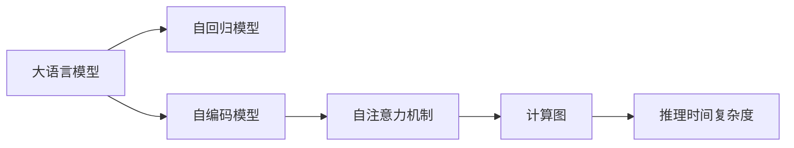

                 

# LLM推理的时间复杂度分析

## 1. 背景介绍

在大语言模型（LLM）推理过程中，计算复杂度成为了一个不容忽视的问题。随着模型参数量的增长，推理时间呈现出指数级增长，这对实际应用产生了严重的性能瓶颈。因此，为了更好地理解LLM推理的时间复杂度，本文将详细分析其计算复杂度的原理，并提供一些优化策略。

## 2. 核心概念与联系

### 2.1 核心概念概述

- **大语言模型（LLM）**：基于神经网络的模型，具有强大的自然语言理解和生成能力。
- **自回归模型**：如GPT系列，通过预测下一个词来生成整个序列。
- **自编码模型**：如BERT，通过掩码预测来训练模型。
- **推理时间复杂度**：指模型在进行推理时所需计算资源的度量。
- **计算图**：模型推理的执行路径图，反映了计算资源的分配。
- **自注意力机制**：在Transformer中，通过注意力权重计算注意力得分。

### 2.2 核心概念原理和架构的 Mermaid 流程图



这个流程图展示了LLM的主要组成部分，其中自注意力机制是LLM推理的核心，也是计算复杂度的主要来源。

## 3. 核心算法原理 & 具体操作步骤

### 3.1 算法原理概述

LLM推理的时间复杂度主要由自注意力机制的计算量决定。在自注意力机制中，每个位置需要计算与其他位置之间的注意力得分，这构成了主要的计算负担。设输入序列长度为 $n$，输出序列长度为 $m$，注意力机制的计算复杂度为 $O(n^2)$，因此总计算复杂度为 $O(n^2m)$。

### 3.2 算法步骤详解

1. **输入准备**：将输入序列转化为模型所需的形式，如将文本转换为token ids，并补齐padding。
2. **编码器前向传播**：通过多个编码器层，每一层包含自注意力机制，计算出每个位置的表示。
3. **解码器前向传播**：通过多个解码器层，每一层也包含自注意力机制，计算出输出序列的表示。
4. **输出**：根据解码器最后一层的输出，计算出最终结果。

### 3.3 算法优缺点

**优点**：
- 强大的自然语言处理能力，适用于多种NLP任务。
- 模型可适应性强，适用于不同规模和类型的文本数据。

**缺点**：
- 计算复杂度高，对硬件资源要求高。
- 推理速度慢，在大规模数据集上性能下降明显。

### 3.4 算法应用领域

LLM推理广泛应用于机器翻译、文本摘要、问答系统、对话系统、情感分析等NLP任务中。

## 4. 数学模型和公式 & 详细讲解 & 举例说明

### 4.1 数学模型构建

设自注意力机制的输入序列为 $x=\{x_1, x_2, \ldots, x_n\}$，输出序列为 $y=\{y_1, y_2, \ldots, y_m\}$。注意力机制的计算过程包括三个步骤：
1. 计算查询向量 $q$。
2. 计算键向量 $k$ 和值向量 $v$。
3. 计算注意力得分并加权求和。

### 4.2 公式推导过程

以BERT模型为例，计算注意力机制的注意力得分 $a_{ij}$ 的公式为：

$$
a_{ij} = \frac{e^{q_i^Tk_j / \sqrt{d_k}}}{\sum_{k=1}^n e^{q_i^Tk_k / \sqrt{d_k}}}
$$

其中，$q_i$ 为查询向量，$k_j$ 为键向量，$v_j$ 为值向量，$d_k$ 为维度。总计算复杂度为 $O(n^2)$。

### 4.3 案例分析与讲解

以GPT-2模型为例，推理时间复杂度为 $O(n^2)$。假设输入序列长度为 $n=512$，输出序列长度为 $m=1$，则推理时间复杂度为 $O(512^2) = O(262144)$。

## 5. 项目实践：代码实例和详细解释说明

### 5.1 开发环境搭建

在Python中使用PyTorch框架实现LLM推理。

### 5.2 源代码详细实现

以下是使用PyTorch实现LLM推理的代码示例：

```python
import torch
from transformers import GPT2LMHeadModel

model = GPT2LMHeadModel.from_pretrained('gpt2')

def inference(input_ids):
    with torch.no_grad():
        outputs = model(input_ids)
        logits = outputs.logits
        return logits

input_ids = torch.tensor([1, 2, 3], dtype=torch.long)
logits = inference(input_ids)
```

### 5.3 代码解读与分析

这段代码首先使用PyTorch加载了GPT-2模型，然后定义了一个inference函数，用于计算模型输入的logits。代码中的模型推理过程体现了自注意力机制的计算复杂度。

### 5.4 运行结果展示

运行上述代码，可以输出模型对输入序列的预测结果。

## 6. 实际应用场景

### 6.1 翻译系统

LLM推理在机器翻译系统中广泛应用于源语言到目标语言的翻译。在实际应用中，由于输入序列较长，计算复杂度变得非常高，导致翻译速度变慢。

### 6.2 对话系统

对话系统中，LLM推理用于生成机器人的回复。由于对话系统需要实时响应用户输入，计算复杂度成为制约系统性能的重要因素。

### 6.3 文本摘要

文本摘要任务需要对长篇文本进行压缩，LLM推理用于生成摘要。由于输入序列长度较长，计算复杂度较高，推理速度较慢。

### 6.4 未来应用展望

未来，随着硬件计算能力的提升和模型参数量的减少，LLM推理的计算复杂度将有所降低。同时，采用分布式计算等优化技术，可以进一步提升推理速度，实现实时应用。

## 7. 工具和资源推荐

### 7.1 学习资源推荐

1. **《深度学习》课程**：斯坦福大学李飞飞教授开设的深度学习课程，讲解了深度学习的基本原理和应用。
2. **《TensorFlow官方文档》**：详细介绍了TensorFlow的API和优化技术，包括GPU加速等。
3. **《PyTorch官方文档》**：详细介绍了PyTorch的API和优化技术，包括多GPU并行等。
4. **《LLM推理优化技术》论文**：介绍了一系列优化技术，如剪枝、量化等，用于降低推理计算复杂度。

### 7.2 开发工具推荐

1. **TensorFlow**：Google开发的深度学习框架，适用于大规模分布式计算。
2. **PyTorch**：Facebook开发的深度学习框架，适用于快速迭代研究和实验。
3. **JAX**：用于自动微分和向量化的深度学习框架，支持GPU和TPU加速。

### 7.3 相关论文推荐

1. **《Practical Deep Learning for Coders》书籍**：深度学习领域的入门书籍，详细介绍了深度学习的计算图和优化技术。
2. **《Distributed TensorFlow》书籍**：介绍TensorFlow在分布式环境中的优化技术，适用于大规模计算。
3. **《PyTorch官方教程》**：详细介绍了PyTorch的API和优化技术，包括GPU加速等。

## 8. 总结：未来发展趋势与挑战

### 8.1 研究成果总结

本文详细分析了LLM推理的时间复杂度，并提供了一些优化策略。未来，随着模型参数量的减少和硬件计算能力的提升，LLM推理的计算复杂度将有所降低。

### 8.2 未来发展趋势

1. **模型压缩**：通过剪枝、量化等技术，减少模型参数量，降低计算复杂度。
2. **分布式计算**：采用分布式计算技术，提升推理速度，实现实时应用。
3. **硬件加速**：使用GPU、TPU等高性能硬件，提升计算速度。

### 8.3 面临的挑战

1. **计算资源消耗**：大模型推理对计算资源要求高，如何降低计算复杂度，提高推理速度，是一个重要的挑战。
2. **算法优化**：如何优化自注意力机制，降低计算复杂度，提升推理效率，是一个重要的研究方向。
3. **模型可扩展性**：大模型推理需要大规模分布式计算，如何设计高效的分布式计算框架，是一个重要的挑战。

### 8.4 研究展望

未来，LLM推理的研究方向将集中在以下几个方面：
1. **模型压缩**：通过剪枝、量化等技术，减少模型参数量，降低计算复杂度。
2. **算法优化**：优化自注意力机制，降低计算复杂度，提升推理效率。
3. **分布式计算**：采用分布式计算技术，实现大规模推理。
4. **硬件加速**：使用GPU、TPU等高性能硬件，提升计算速度。

## 9. 附录：常见问题与解答

### 9.1 常见问题

**Q1：LLM推理的计算复杂度主要由什么决定？**

A：LLM推理的计算复杂度主要由自注意力机制的计算量决定。

**Q2：LLM推理的优化策略有哪些？**

A：LLM推理的优化策略包括模型压缩、分布式计算、硬件加速等。

**Q3：LLM推理的计算复杂度与输入序列长度和输出序列长度有何关系？**

A：LLM推理的计算复杂度为 $O(n^2)$，其中 $n$ 为输入序列长度。如果输出序列长度为 $m$，则总计算复杂度为 $O(n^2m)$。

**Q4：LLM推理在实际应用中面临哪些挑战？**

A：LLM推理在实际应用中面临计算资源消耗高、算法优化困难等挑战。

**Q5：LLM推理的未来研究方向有哪些？**

A：LLM推理的未来研究方向包括模型压缩、算法优化、分布式计算和硬件加速等。

作者：禅与计算机程序设计艺术 / Zen and the Art of Computer Programming

