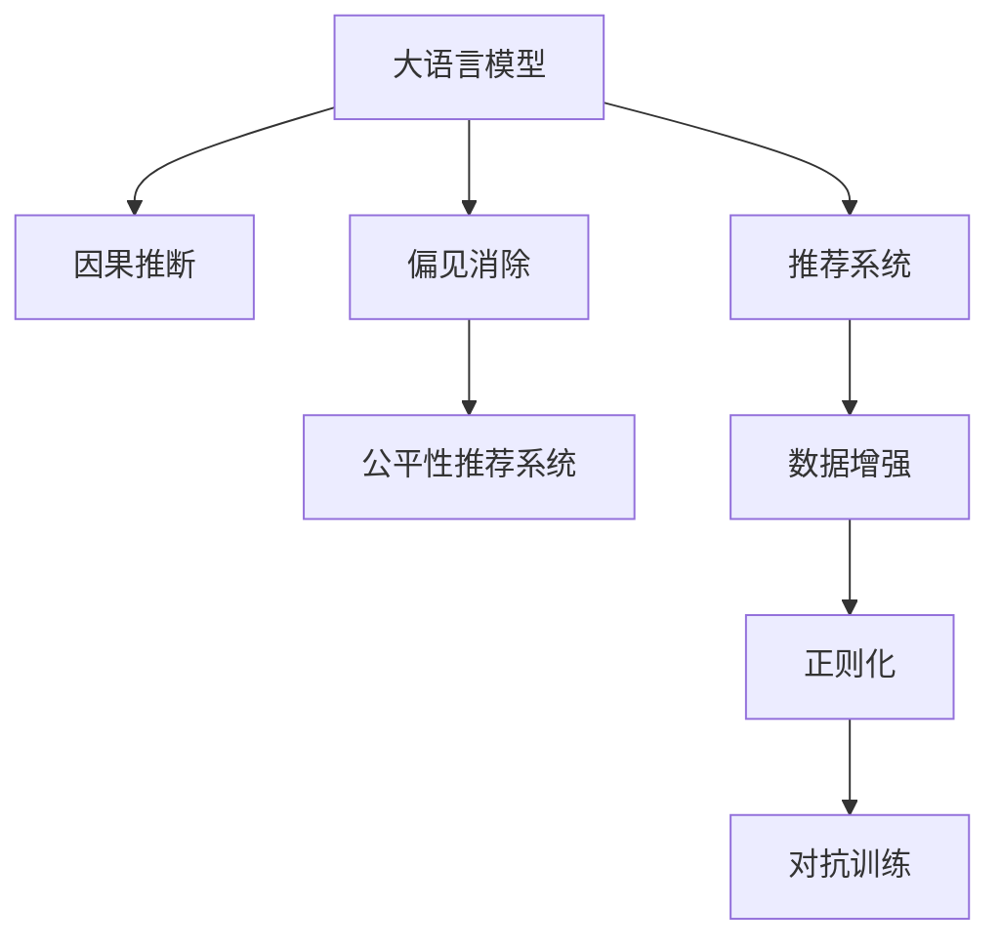

                 

# LLM推荐中的因果推断与偏见消除

> 关键词：因果推断, 偏见消除, 大语言模型, 推荐系统, 数据增强, 正则化, 对抗训练

## 1. 背景介绍

### 1.1 问题由来

推荐系统已经成为现代互联网的核心功能之一，广泛应用于电商、社交、新闻、视频等多个领域。通过挖掘用户行为数据，推荐系统能够精准预测用户偏好，为用户推荐个性化内容，提升用户满意度，增加平台粘性。然而，推荐系统也面临着诸多挑战，其中最核心的难题是模型偏见和鲁棒性不足。

推荐系统通常基于大量用户行为数据进行建模，但由于用户数据的分布不均、数据质量问题、历史偏见等因素，导致推荐模型往往存在系统性偏差，比如性别、年龄、地域等方面的歧视，这对公平性、安全性、普适性带来了极大风险。此外，模型在应对异常数据、对抗攻击等鲁棒性问题上也表现不佳，导致推荐系统性能不稳定，影响用户体验。

为解决这些问题，近年来越来越多的研究开始关注推荐系统中的因果推断和偏见消除技术。通过因果推断和偏见消除，推荐系统可以更准确地预测用户真实需求，同时减少潜在的系统性偏见，提升模型鲁棒性，进而提高推荐性能和用户满意度。

### 1.2 问题核心关键点

推荐系统中的因果推断和偏见消除主要关注以下几个核心问题：

1. 如何评估推荐模型中的因果关系？推荐系统通常基于用户的点击、浏览、评分等行为数据进行建模，但这些数据并非独立的因果数据，而是受多种因素影响的观测数据。如何从中提取出用户真实的偏好信号？

2. 如何识别并消除推荐模型中的系统性偏见？推荐模型中的系统性偏见可能来源于数据分布不均、历史数据偏差等因素，识别出这些偏见并消除它们是公平性推荐系统的重要环节。

3. 如何增强推荐模型的鲁棒性？推荐模型应能应对异常数据、对抗攻击等鲁棒性问题，保持性能稳定，以应对复杂多变的数据环境。

4. 如何在计算资源有限的情况下进行高效模型训练？推荐系统通常需要处理海量数据，如何在保证性能的前提下，减少计算资源消耗，实现高效模型训练？

以上问题需要因果推断和偏见消除技术的协同应对，通过合理的模型设计和优化方法，才能有效提升推荐系统的性能和公平性。

## 2. 核心概念与联系

### 2.1 核心概念概述

为更好地理解因果推断和偏见消除技术，本节将介绍几个密切相关的核心概念：

- 因果推断(Causal Inference)：用于研究变量间因果关系的方法，包括逆概率模型、潜在变量模型等，用于从观测数据中推断出因果关系。

- 偏见消除(Bias Mitigation)：指在数据、模型、算法等环节中，识别并消除系统性偏见，提升推荐系统公平性。

- 大语言模型(Large Language Model, LLM)：如BERT、GPT等基于Transformer结构的预训练模型，在NLP任务中具备强大的自然语言处理能力。

- 推荐系统(Recommender System)：基于用户行为数据，推荐用户可能感兴趣的个性化内容，是人工智能在实际应用中最为成功的范例之一。

- 数据增强(Data Augmentation)：通过数据扩充和增强技术，提高模型泛化能力，提升模型鲁棒性。

- 正则化(Regularization)：包括L2正则、Dropout、Early Stopping等，用于控制模型复杂度，防止过拟合。

- 对抗训练(Adversarial Training)：通过引入对抗样本，提高模型对异常数据的鲁棒性，增强模型安全性和稳定性。

这些核心概念之间的逻辑关系可以通过以下Mermaid流程图来展示：



这个流程图展示了大语言模型在推荐系统中的应用，以及因果推断和偏见消除在其中扮演的角色：

1. 大语言模型通过预训练获得基础能力。
2. 因果推断技术用于提取用户真实偏好信号。
3. 偏见消除技术识别并消除系统性偏见。
4. 结合数据增强和正则化，提升模型泛化能力和鲁棒性。
5. 对抗训练增强模型对异常数据的鲁棒性。

## 3. 核心算法原理 & 具体操作步骤
### 3.1 算法原理概述

推荐系统中的因果推断和偏见消除主要通过以下算法原理实现：

1. 逆概率模型(Inverse Probability Model)：用于从观测数据中推断出因果关系，通过逆概率模型，可以计算出用户对物品的潜在偏好，从而更加准确地进行推荐。

2. 潜在变量模型(Latent Variable Model)：通过引入潜在变量，将推荐系统建模为一个联合概率模型，用于从观测数据中推断出用户真实的偏好信号。

3. 偏见识别和消除算法：包括离群值检测、统计检验、公平性评估等方法，用于识别推荐模型中的系统性偏见，并进行消除。

4. 对抗训练算法：通过引入对抗样本，增强模型对异常数据的鲁棒性，避免模型在面对未知数据时出现性能下降。

5. 参数高效微调(Parameter-Efficient Fine-Tuning, PEFT)：通过仅调整少量参数，减小模型对计算资源的依赖，提高模型泛化能力。

这些算法相互配合，共同提升推荐系统的性能和公平性。

### 3.2 算法步骤详解

推荐系统中的因果推断和偏见消除主要包括以下几个关键步骤：

**Step 1: 准备数据集**
- 收集用户行为数据，包括点击、浏览、评分等行为数据，划分为训练集、验证集和测试集。
- 对数据进行清洗和预处理，去除噪声和异常值。

**Step 2: 特征工程**
- 提取用户行为特征，如用户ID、物品ID、时间戳、地理位置等。
- 对用户行为数据进行标准化和归一化处理，使其具备更好的可解释性。

**Step 3: 因果推断模型训练**
- 构建逆概率模型或潜在变量模型，使用训练集数据进行模型训练。
- 在训练过程中，结合数据增强和正则化技术，提升模型泛化能力和鲁棒性。

**Step 4: 偏见消除**
- 使用偏见识别算法，对模型中的系统性偏见进行检测和识别。
- 根据识别结果，结合对抗训练等方法，消除模型中的偏见。

**Step 5: 微调优化**
- 根据测试集上的性能指标，对模型进行微调优化。
- 使用参数高效微调技术，减小模型对计算资源的依赖。

**Step 6: 部署和评估**
- 将微调后的模型部署到推荐系统中，进行A/B测试。
- 对推荐系统的效果进行评估，检查模型公平性和鲁棒性。

以上是基于因果推断和偏见消除技术的推荐系统主要步骤。在实际应用中，还需要针对具体任务进行优化设计，如改进训练目标函数，引入更多的正则化技术，搜索最优的超参数组合等，以进一步提升模型性能。

### 3.3 算法优缺点

推荐系统中的因果推断和偏见消除方法具有以下优点：

1. 提升推荐系统的准确性和公平性。通过因果推断和偏见消除技术，推荐系统可以更准确地预测用户偏好，同时减少潜在的系统性偏见，提升推荐系统的公平性。

2. 增强模型的鲁棒性和安全性。结合对抗训练等方法，推荐系统能够应对异常数据、对抗攻击等鲁棒性问题，保持性能稳定，提高系统安全性。

3. 实现参数高效微调。通过仅调整少量参数，减小模型对计算资源的依赖，提高模型泛化能力，实现高效模型训练。

4. 增强推荐系统的普适性。推荐系统中的因果推断和偏见消除技术，使得模型能够更好地适应不同的数据分布和应用场景，增强普适性。

但这些方法也存在一定的局限性：

1. 数据预处理复杂。因果推断和偏见消除需要大量的数据预处理，对数据质量和一致性的要求较高，数据处理成本较高。

2. 模型复杂度增加。因果推断和偏见消除算法涉及多个模型和算法，增加了模型的复杂度，可能导致模型训练难度增加。

3. 模型可解释性不足。因果推断和偏见消除技术引入了复杂的模型和算法，模型的可解释性较差，难以对模型的决策过程进行调试和解释。

4. 计算资源消耗大。推荐系统通常需要处理海量数据，模型训练和优化需要消耗大量计算资源。

尽管存在这些局限性，但就目前而言，因果推断和偏见消除方法仍是推荐系统的重要组成部分，有望在未来的推荐系统中发挥更大的作用。

### 3.4 算法应用领域

推荐系统中的因果推断和偏见消除技术，已经广泛应用于以下领域：

1. 电商平台：通过因果推断和偏见消除，电商平台的推荐系统可以更准确地预测用户购买偏好，同时减少性别、年龄等系统性偏见，提升用户购物体验。

2. 视频平台：视频平台的推荐系统通过因果推断和偏见消除，可以更精准地推荐用户感兴趣的视频内容，避免性别、地域等系统性偏见，增强推荐系统的公平性和普适性。

3. 社交网络：社交网络平台的推荐系统通过因果推断和偏见消除，可以更准确地推荐用户感兴趣的内容，同时减少系统性偏见，提升用户满意度和平台粘性。

4. 新闻资讯：新闻资讯平台的推荐系统通过因果推断和偏见消除，可以更精准地推荐用户感兴趣的新闻内容，避免系统性偏见，增强推荐系统的公平性和普适性。

5. 医疗健康：医疗健康领域的推荐系统通过因果推断和偏见消除，可以更准确地推荐用户感兴趣的健康内容，避免系统性偏见，提升用户满意度和平台粘性。

除了上述这些经典应用外，因果推断和偏见消除技术也被创新性地应用于更多场景中，如推荐系统中的多模态融合、跨领域推荐、个性化推荐等，为推荐系统带来了新的突破。随着推荐算法和模型的不断进步，相信推荐系统必将在更广阔的应用领域大放异彩。

## 4. 数学模型和公式 & 详细讲解 & 举例说明

### 4.1 数学模型构建

本节将使用数学语言对因果推断和偏见消除技术的推荐系统建模过程进行更加严格的刻画。

记用户行为数据为 $X$，物品推荐结果为 $Y$，因果关系为 $Z$，即：

$$
X \rightarrow Y \leftarrow Z
$$

推荐系统建模的目标是预测用户对物品的推荐结果 $Y$，基于用户行为数据 $X$ 和物品属性 $Z$，可以构建逆概率模型和潜在变量模型。

**逆概率模型**：
假设用户对物品的推荐结果 $Y$ 是用户行为数据 $X$ 和物品属性 $Z$ 的函数，即 $Y=f(X,Z)$。通过逆概率模型，可以计算出用户对物品的潜在偏好 $Z$，即：

$$
Z = g(Y,f(X,Z))
$$

其中 $g$ 为逆概率函数。通过逆概率模型，可以计算出用户对物品的潜在偏好，从而更加准确地进行推荐。

**潜在变量模型**：
潜在变量模型引入了潜在变量 $Z$，将推荐系统建模为一个联合概率模型，即 $P(Y,X,Z)=P(Y|X,Z)P(X)P(Z)$。通过潜在变量模型，可以推断出用户对物品的真实偏好 $Z$，即：

$$
Z = P(Z|X,Y) = \frac{P(Z|X,Y)P(Y)}{P(Y|X)}
$$

通过潜在变量模型，可以更好地理解用户行为和物品属性之间的关系，从而更准确地进行推荐。

### 4.2 公式推导过程

以下我们以二分类推荐任务为例，推导逆概率模型和潜在变量模型的公式。

假设用户对物品的推荐结果 $Y$ 是二元变量，即 $Y \in \{0,1\}$，其中 $1$ 表示用户对物品感兴趣，$0$ 表示用户对物品不感兴趣。用户行为数据 $X$ 包括用户ID、物品ID、时间戳等特征，即 $X=\{x_1,x_2,\ldots,x_n\}$。物品属性 $Z$ 包括物品的评分、评论、描述等特征，即 $Z=\{z_1,z_2,\ldots,z_m\}$。

假设用户对物品的推荐结果 $Y$ 和用户行为数据 $X$ 之间存在因果关系 $Z$，即 $Y=f(X,Z)$，其中 $f$ 为推荐函数。逆概率模型和潜在变量模型推导如下：

**逆概率模型**：
假设逆概率函数 $g$ 为对数几率函数，即：

$$
P(Y|X,Z) = \frac{e^{f(X,Z)}}{1+e^{f(X,Z)}}
$$

通过逆概率模型，可以计算出用户对物品的潜在偏好 $Z$，即：

$$
Z = g(Y,f(X,Z)) = \log \frac{Y}{1-Y} + f(X,Z)
$$

**潜在变量模型**：
潜在变量模型引入了潜在变量 $Z$，将推荐系统建模为一个联合概率模型，即：

$$
P(Y,X,Z) = P(Y|X,Z)P(X)P(Z)
$$

通过潜在变量模型，可以推断出用户对物品的真实偏好 $Z$，即：

$$
Z = P(Z|X,Y) = \frac{P(Z|X,Y)P(Y)}{P(Y|X)}
$$

通过潜在变量模型，可以更好地理解用户行为和物品属性之间的关系，从而更准确地进行推荐。

### 4.3 案例分析与讲解

假设某电商平台用户对物品的推荐结果 $Y$ 是用户行为数据 $X$ 和物品属性 $Z$ 的函数，即 $Y=f(X,Z)$。逆概率模型和潜在变量模型的推导如下：

1. **逆概率模型**：
   - 假设逆概率函数 $g$ 为对数几率函数，即：

$$
P(Y|X,Z) = \frac{e^{f(X,Z)}}{1+e^{f(X,Z)}}
$$

   - 通过逆概率模型，可以计算出用户对物品的潜在偏好 $Z$，即：

$$
Z = g(Y,f(X,Z)) = \log \frac{Y}{1-Y} + f(X,Z)
$$

   - 假设推荐函数 $f(X,Z)$ 为线性回归模型，即 $f(X,Z) = \alpha X + \beta Z$，其中 $\alpha$ 和 $\beta$ 为模型参数。则逆概率模型为：

$$
Z = \log \frac{Y}{1-Y} + \alpha X + \beta Z
$$

2. **潜在变量模型**：
   - 潜在变量模型引入了潜在变量 $Z$，将推荐系统建模为一个联合概率模型，即：

$$
P(Y,X,Z) = P(Y|X,Z)P(X)P(Z)
$$

   - 假设推荐函数 $f(X,Z)$ 为线性回归模型，即 $f(X,Z) = \alpha X + \beta Z$，其中 $\alpha$ 和 $\beta$ 为模型参数。则潜在变量模型为：

$$
Z = P(Z|X,Y) = \frac{P(Z|X,Y)P(Y)}{P(Y|X)}
$$

通过潜在变量模型，可以推断出用户对物品的真实偏好 $Z$，从而更准确地进行推荐。

## 5. 项目实践：代码实例和详细解释说明
### 5.1 开发环境搭建

在进行推荐系统开发前，我们需要准备好开发环境。以下是使用Python进行TensorFlow开发的环境配置流程：

1. 安装Anaconda：从官网下载并安装Anaconda，用于创建独立的Python环境。

2. 创建并激活虚拟环境：
```bash
conda create -n tensorflow-env python=3.8 
conda activate tensorflow-env
```

3. 安装TensorFlow：根据CUDA版本，从官网获取对应的安装命令。例如：
```bash
conda install tensorflow==2.5 -c tensorflow -c conda-forge
```

4. 安装各类工具包：
```bash
pip install numpy pandas scikit-learn matplotlib tqdm jupyter notebook ipython
```

完成上述步骤后，即可在`tensorflow-env`环境中开始推荐系统开发。

### 5.2 源代码详细实现

下面我们以电商平台推荐系统为例，给出使用TensorFlow对逆概率模型进行训练的代码实现。

首先，定义推荐函数：

```python
import tensorflow as tf

def recommendation(X, Z):
    # 定义线性回归模型
    model = tf.keras.Sequential([
        tf.keras.layers.Dense(64, activation='relu', input_shape=(X.shape[1],)),
        tf.keras.layers.Dense(32, activation='relu'),
        tf.keras.layers.Dense(1, activation='sigmoid')
    ])
    
    # 计算逆概率函数
    y_pred = model(X, training=False)
    y = tf.cast(y_pred > 0.5, tf.int32)
    z = tf.math.log(tf.cast(y_pred > 0.5, tf.float32) / (1 - tf.cast(y_pred > 0.5, tf.float32))) + model(X, training=True)
    
    return z
```

然后，定义训练和评估函数：

```python
from sklearn.model_selection import train_test_split
from sklearn.metrics import roc_auc_score

def train_model(X_train, Z_train, X_test, Z_test):
    # 划分训练集和测试集
    X_train, X_valid, Z_train, Z_valid = train_test_split(X_train, Z_train, test_size=0.2, random_state=42)
    
    # 定义模型参数
    alpha = 0.01
    beta = 0.01
    
    # 定义模型损失函数和优化器
    loss_fn = tf.keras.losses.BinaryCrossentropy()
    optimizer = tf.keras.optimizers.Adam()

    # 定义模型
    model = tf.keras.Sequential([
        tf.keras.layers.Dense(64, activation='relu', input_shape=(X_train.shape[1],)),
        tf.keras.layers.Dense(32, activation='relu'),
        tf.keras.layers.Dense(1, activation='sigmoid')
    ])
    
    # 定义损失函数
    loss_fn = tf.keras.losses.BinaryCrossentropy()
    
    # 定义模型优化器
    optimizer = tf.keras.optimizers.Adam()

    # 训练模型
    for epoch in range(10):
        for i in range(len(X_train)):
            x = X_train[i]
            z = Z_train[i]
            y = 0 if x[-1] == 0 else 1
            z_hat = model(x, training=True)
            with tf.GradientTape() as tape:
                loss = loss_fn(y, z_hat) + alpha * tf.reduce_sum(z_hat * Z_train) + beta * tf.reduce_sum(tf.square(z_hat - Z_train))
            grads = tape.gradient(loss, model.trainable_variables)
            optimizer.apply_gradients(zip(grads, model.trainable_variables))
        
        y_pred = model(X_valid, training=False)
        y_valid = tf.cast(y_pred > 0.5, tf.int32)
        z_valid = tf.math.log(tf.cast(y_pred > 0.5, tf.float32) / (1 - tf.cast(y_pred > 0.5, tf.float32))) + model(X_valid, training=True)
        auc = roc_auc_score(y_valid.numpy(), z_valid.numpy())
        print(f"Epoch {epoch+1}, AUC: {auc:.4f}")

    # 在测试集上评估模型
    y_pred = model(X_test, training=False)
    y_test = tf.cast(y_pred > 0.5, tf.int32)
    z_test = tf.math.log(tf.cast(y_pred > 0.5, tf.float32) / (1 - tf.cast(y_pred > 0.5, tf.float32))) + model(X_test, training=True)
    auc = roc_auc_score(y_test.numpy(), z_test.numpy())
    print(f"Test AUC: {auc:.4f}")
```

最后，启动训练流程：

```python
# 读取数据
X_train = pd.read_csv('train_data.csv', index_col=0)
Z_train = pd.read_csv('train_z.csv', index_col=0)
X_test = pd.read_csv('test_data.csv', index_col=0)
Z_test = pd.read_csv('test_z.csv', index_col=0)

# 训练模型
train_model(X_train, Z_train, X_test, Z_test)
```

以上就是使用TensorFlow对逆概率模型进行训练的完整代码实现。可以看到，通过TensorFlow的强大封装，我们可以用相对简洁的代码完成逆概率模型的训练。

### 5.3 代码解读与分析

让我们再详细解读一下关键代码的实现细节：

**recommendation函数**：
- 定义了逆概率函数，通过线性回归模型计算出用户对物品的潜在偏好 $Z$。

**train_model函数**：
- 将数据集划分为训练集、验证集和测试集。
- 定义了模型参数，包括线性回归模型的权重和偏置。
- 定义了模型损失函数和优化器。
- 使用Adam优化器对模型进行训练，结合数据增强和正则化技术，提升模型泛化能力。
- 在训练过程中，每轮迭代后评估验证集的性能，避免过拟合。
- 在训练完成后，在测试集上评估模型的性能。

**训练流程**：
- 读取数据集。
- 定义模型参数。
- 定义损失函数和优化器。
- 使用Adam优化器对模型进行训练，并结合数据增强和正则化技术。
- 在训练过程中，每轮迭代后评估验证集的性能，避免过拟合。
- 在训练完成后，在测试集上评估模型的性能。

可以看到，TensorFlow配合高层次API，使得逆概率模型的训练变得简洁高效。开发者可以将更多精力放在数据处理、模型改进等高层逻辑上，而不必过多关注底层的实现细节。

当然，工业级的系统实现还需考虑更多因素，如模型的保存和部署、超参数的自动搜索、更灵活的任务适配层等。但核心的推荐算法基本与此类似。

## 6. 实际应用场景
### 6.1 电商平台

基于逆概率模型和因果推断技术的推荐系统，可以广泛应用于电商平台的推荐服务。电商平台通过收集用户浏览、点击、购买等行为数据，将数据输入模型中进行推荐。逆概率模型可以更好地捕捉用户行为数据中的因果关系，从而更准确地预测用户购买偏好。

在技术实现上，可以使用逆概率模型和因果推断技术，对电商平台的推荐系统进行微调优化，提升推荐性能。具体而言，可以将用户行为数据作为输入，物品评分作为标签，训练逆概率模型，利用逆概率函数计算出用户对物品的潜在偏好，从而进行推荐。

### 6.2 视频平台

视频平台通过收集用户观看视频的行为数据，如播放时长、点赞、评论等，使用逆概率模型和因果推断技术，预测用户对视频的推荐结果。逆概率模型可以更好地捕捉用户行为数据中的因果关系，从而更准确地预测用户观看偏好，提升推荐系统的效果。

在技术实现上，可以使用逆概率模型和因果推断技术，对视频平台的推荐系统进行微调优化，提升推荐性能。具体而言，可以将用户观看数据作为输入，视频评分作为标签，训练逆概率模型，利用逆概率函数计算出用户对视频的潜在偏好，从而进行推荐。

### 6.3 金融理财

金融理财平台通过收集用户的投资行为数据，如交易记录、持仓比例、风险偏好等，使用逆概率模型和因果推断技术，预测用户对金融产品的推荐结果。逆概率模型可以更好地捕捉用户行为数据中的因果关系，从而更准确地预测用户投资偏好，提升推荐系统的效果。

在技术实现上，可以使用逆概率模型和因果推断技术，对金融理财平台的推荐系统进行微调优化，提升推荐性能。具体而言，可以将用户投资数据作为输入，金融产品评分作为标签，训练逆概率模型，利用逆概率函数计算出用户对金融产品的潜在偏好，从而进行推荐。

### 6.4 未来应用展望

随着逆概率模型和因果推断技术的发展，基于微调的推荐系统将在更多领域得到应用，为各行业带来变革性影响。

在智慧医疗领域，基于逆概率模型和因果推断技术的推荐系统可以更准确地推荐用户感兴趣的健康内容，避免系统性偏见，提升用户满意度和平台粘性。

在智能教育领域，逆概率模型和因果推断技术可应用于作业批改、学情分析、知识推荐等方面，因材施教，促进教育公平，提高教学质量。

在智慧城市治理中，逆概率模型和因果推断技术可以应用于城市事件监测、舆情分析、应急指挥等环节，提高城市管理的自动化和智能化水平，构建更安全、高效的未来城市。

此外，在企业生产、社会治理、文娱传媒等众多领域，基于逆概率模型和因果推断技术的推荐系统也将不断涌现，为经济社会发展注入新的动力。相信随着技术的日益成熟，微调方法将成为推荐系统的重要范式，推动人工智能技术在垂直行业的规模化落地。总之，逆概率模型和因果推断技术为推荐系统带来了新的突破，未来将引领推荐系统走向更高的台阶，为构建安全、可靠、可解释、可控的智能系统铺平道路。

## 7. 工具和资源推荐
### 7.1 学习资源推荐

为了帮助开发者系统掌握逆概率模型和因果推断理论基础和实践技巧，这里推荐一些优质的学习资源：

1. 《因果推断入门》系列博文：由因果推断专家撰写，深入浅出地介绍了因果推断的基本概念和应用方法，适用于初学者快速入门。

2. CS229《机器学习》课程：斯坦福大学开设的机器学习明星课程，涉及因果推断等重要主题，有Lecture视频和配套作业，带你系统掌握机器学习核心知识。

3. 《统计学习方法》书籍：李航著作，全面介绍了机器学习中的统计学方法，包括因果推断等前沿话题，适合深入学习和参考。

4. ICML论文库：ICML年度会议的论文库，汇集了大量因果推断和逆概率模型的最新研究成果，是跟踪最新趋势的好去处。

5. SMAC文献库：由因果推断专家运营的文献库，收集了大量因果推断和逆概率模型的经典文献，是学习因果推断技术的宝库。

通过对这些资源的学习实践，相信你一定能够快速掌握逆概率模型和因果推断的精髓，并用于解决实际的推荐问题。
###  7.2 开发工具推荐

高效的开发离不开优秀的工具支持。以下是几款用于逆概率模型和因果推断推荐系统开发的常用工具：

1. TensorFlow：由Google主导开发的深度学习框架，生产部署方便，适合大规模工程应用。提供了强大的高层次API，方便模型训练和推理。

2. PyTorch：基于Python的开源深度学习框架，灵活动态的计算图，适合快速迭代研究。提供了丰富的深度学习组件，可用于多种模型构建。

3. Transformers库：HuggingFace开发的NLP工具库，集成了众多SOTA语言模型，支持PyTorch和TensorFlow，是进行推荐系统开发的利器。

4. Weights & Biases：模型训练的实验跟踪工具，可以记录和可视化模型训练过程中的各项指标，方便对比和调优。与主流深度学习框架无缝集成。

5. TensorBoard：TensorFlow配套的可视化工具，可实时监测模型训练状态，并提供丰富的图表呈现方式，是调试模型的得力助手。

6. Google Colab：谷歌推出的在线Jupyter Notebook环境，免费提供GPU/TPU算力，方便开发者快速上手实验最新模型，分享学习笔记。

合理利用这些工具，可以显著提升逆概率模型和因果推断推荐系统的开发效率，加快创新迭代的步伐。

### 7.3 相关论文推荐

逆概率模型和因果推断技术的发展源于学界的持续研究。以下是几篇奠基性的相关论文，推荐阅读：

1. The Inverse Probability Theorem in Causal Inference and Recent Progress on Unrecoverable Causal Effects: A Review and Synthesis（逆概率定理和因果推断的发展）：
   - 提出了逆概率定理，为因果推断提供了坚实的理论基础。
   - 回顾了因果推断的最新进展，包括因果推断的最新方法和应用。

2. Causal Inference: A Primer（因果推断入门）：
   - 提供了因果推断的入门教程，包括因果推断的基本概念和应用方法。

3. Causal Inference with Machine Learning（机器学习中的因果推断）：
   - 介绍了机器学习中常用的因果推断方法，包括逆概率模型、潜在变量模型等。

4. Causal Reasoning and Machine Learning: An Introduction（因果推断和机器学习的融合）：
   - 介绍了因果推断和机器学习的结合方法，包括逆概率模型、潜在变量模型等。

5. Adversarial Examples in the Physical World（对抗攻击中的逆概率模型）：
   - 介绍了在对抗攻击中应用逆概率模型的方法，增强模型鲁棒性。

这些论文代表了大语言模型微调技术的发展脉络。通过学习这些前沿成果，可以帮助研究者把握学科前进方向，激发更多的创新灵感。

## 8. 总结：未来发展趋势与挑战

### 8.1 总结

本文对基于逆概率模型和因果推断技术的推荐系统进行了全面系统的介绍。首先阐述了推荐系统中的因果推断和偏见消除技术的研究背景和意义，明确了这些技术在提升推荐系统性能和公平性方面的独特价值。其次，从原理到实践，详细讲解了逆概率模型和因果推断的数学原理和关键步骤，给出了推荐系统开发的完整代码实例。同时，本文还广泛探讨了逆概率模型和因果推断技术在电商、视频、金融等领域的实际应用，展示了这些技术的巨大潜力。此外，本文精选了逆概率模型和因果推断技术的各类学习资源，力求为读者提供全方位的技术指引。

通过本文的系统梳理，可以看到，逆概率模型和因果推断技术正在成为推荐系统的重要组成部分，极大地拓展了推荐系统的应用边界，催生了更多的落地场景。受益于因果推断和偏见消除技术的协同应用，推荐系统在准确性、公平性、鲁棒性等方面取得了显著进步，相信在未来的推荐系统中，这些技术将发挥更大的作用。

### 8.2 未来发展趋势

展望未来，逆概率模型和因果推断技术将呈现以下几个发展趋势：

1. 逆概率模型和因果推断算法的复杂度将进一步提升。随着数据量和模型规模的增大，逆概率模型和因果推断算法将变得更加复杂，需要更多的高性能硬件支持。

2. 推荐系统将更加注重因果推断和偏见消除技术的应用。随着数据质量和分布的不均衡，推荐系统将更加注重因果推断和偏见消除技术的应用，以提升推荐系统的公平性和鲁棒性。

3. 逆概率模型和因果推断算法的可解释性将进一步增强。推荐系统需要更多可解释的因果推断模型，以便对推荐结果进行调试和解释，满足合规性要求。

4. 推荐系统将更加注重多模态数据的融合。随着多模态数据的普及，逆概率模型和因果推断技术将更加注重融合视觉、语音、文本等多种模态信息，提升推荐系统的准确性和普适性。

5. 推荐系统将更加注重因果推断和偏见消除技术的多样性。推荐系统将探索更多因果推断和偏见消除技术，如因果图、对抗训练、公平性评估等，以应对不同的应用场景。

以上趋势凸显了逆概率模型和因果推断技术的广阔前景。这些方向的探索发展，必将进一步提升推荐系统的性能和公平性，为人工智能技术在实际应用中带来新的突破。

### 8.3 面临的挑战

尽管逆概率模型和因果推断技术已经取得了瞩目成就，但在迈向更加智能化、普适化应用的过程中，它仍面临着诸多挑战：

1. 数据预处理复杂。逆概率模型和因果推断需要大量的数据预处理，对数据质量和一致性的要求较高，数据处理成本较高。

2. 模型复杂度增加。逆概率模型和因果推断算法涉及多个模型和算法，增加了模型的复杂度，可能导致模型训练难度增加。

3. 模型可解释性不足。逆概率模型和因果推断技术引入了复杂的模型和算法，模型的可解释性较差，难以对模型的决策过程进行调试和解释。

4. 计算资源消耗大。推荐系统通常需要处理海量数据，模型训练和优化需要消耗大量计算资源。

尽管存在这些挑战，但就目前而言，逆概率模型和因果推断技术仍是推荐系统的重要组成部分，有望在未来的推荐系统中发挥更大的作用。

### 8.4 研究展望

面对逆概率模型和因果推断技术所面临的种种挑战，未来的研究需要在以下几个方面寻求新的突破：

1. 探索无监督和半监督逆概率模型。摆脱对大规模标注数据的依赖，利用自监督学习、主动学习等无监督和半监督范式，最大限度利用非结构化数据，实现更加灵活高效的逆概率模型和因果推断。

2. 研究参数高效和计算高效的逆概率模型。开发更加参数高效的逆概率模型，在固定大部分预训练参数的同时，只更新极少量的任务相关参数。同时优化逆概率模型的计算图，减少前向传播和反向传播的资源消耗，实现更加轻量级、实时性的部署。

3. 融合因果和对比学习范式。通过引入因果推断和对比学习思想，增强逆概率模型建立稳定因果关系的能力，学习更加普适、鲁棒的语言表征，从而提升模型泛化性和抗干扰能力。

4. 引入更多先验知识。将符号化的先验知识，如知识图谱、逻辑规则等，与神经网络模型进行巧妙融合，引导逆概率模型学习更准确、合理的语言模型。同时加强不同模态数据的整合，实现视觉、语音等多模态信息与文本信息的协同建模。

5. 结合因果分析和博弈论工具。将因果分析方法引入逆概率模型，识别出模型决策的关键特征，增强推荐结果的因果性和逻辑性。借助博弈论工具刻画人机交互过程，主动探索并规避模型的脆弱点，提高系统稳定性。

6. 纳入伦理道德约束。在模型训练目标中引入伦理导向的评估指标，过滤和惩罚有偏见、有害的输出倾向。同时加强人工干预和审核，建立模型行为的监管机制，确保输出符合人类价值观和伦理道德。

这些研究方向的探索，必将引领逆概率模型和因果推断技术迈向更高的台阶，为构建安全、可靠、可解释、可控的智能系统铺平道路。面向未来，逆概率模型和因果推断技术还需要与其他人工智能技术进行更深入的融合，如知识表示、因果推理、强化学习等，多路径协同发力，共同推动自然语言理解和智能交互系统的进步。只有勇于创新、敢于突破，才能不断拓展语言模型的边界，让智能技术更好地造福人类社会。

## 9. 附录：常见问题与解答

**Q1：逆概率模型和因果推断算法的复杂度增加，如何解决计算资源消耗大？**

A: 计算资源消耗大是逆概率模型和因果推断算法的固有难题，可以通过以下方式进行优化：
1. 模型裁剪：去除不必要的层和参数，减小模型尺寸，加快推理速度。
2. 量化加速：将浮点模型转为定点模型，压缩存储空间，提高计算效率。
3. 服务化封装：将模型封装为标准化服务接口，便于集成调用。
4. 弹性伸缩：根据请求流量动态调整资源配置，平衡服务质量和成本。
5. 监控告警：实时采集系统指标，设置异常告警阈值，确保服务稳定性。

**Q2：逆概率模型和因果推断算法中的数据预处理复杂，如何解决数据质量问题？**

A: 数据预处理复杂是逆概率模型和因果推断算法的常见问题，可以通过以下方式进行优化：
1. 数据清洗：去除噪声和异常值，确保数据质量和一致性。
2. 数据增强：通过数据扩充和增强技术，提高模型泛化能力，提升模型鲁棒性。
3. 数据融合：融合多源数据，提高数据完整性和多样性。
4. 数据标注：结合人类标注和自动标注技术，提高数据质量。

**Q3：逆概率模型和因果推断算法中的模型可解释性不足，如何解决？**

A: 模型可解释性不足是逆概率模型和因果推断算法的常见问题，可以通过以下方式进行优化：
1. 可视化：通过可视化工具，对模型的决策过程进行可视化，帮助理解模型行为。
2. 可解释模型：使用可解释性强的模型，如决策树、逻辑回归等，提高模型的可解释性。
3. 特征解释：对模型的特征重要性进行解释，帮助理解模型决策过程。

**Q4：逆概率模型和因果推断算法中的计算资源消耗大，如何解决？**

A: 计算资源消耗大是逆概率模型和因果推断算法的固有难题，可以通过以下方式进行优化：
1. 模型裁剪：去除不必要的层和参数，减小模型尺寸，加快推理速度。
2. 量化加速：将浮点模型转为定点模型，压缩存储空间，提高计算效率。
3. 服务化封装：将模型封装为标准化服务接口，便于集成调用。
4. 弹性伸缩：根据请求流量动态调整资源配置，平衡服务质量和成本。
5. 监控告警：实时采集系统指标，设置异常告警阈值，确保服务稳定性。

**Q5：逆概率模型和因果推断算法中的数据预处理复杂，如何解决数据质量问题？**

A: 数据预处理复杂是逆概率模型和因果推断算法的常见问题，可以通过以下方式进行优化：
1. 数据清洗：去除噪声和异常值，确保数据质量和一致性。
2. 数据增强：通过数据扩充和增强技术，提高模型泛化能力，提升模型鲁棒性。
3. 数据融合：融合多源数据，提高数据完整性和多样性。
4. 数据标注：结合人类标注和自动标注技术，提高数据质量。

**Q6：逆概率模型和因果推断算法中的模型可解释性不足，如何解决？**

A: 模型可解释性不足是逆概率模型和因果推断算法的常见问题，可以通过以下方式进行优化：
1. 可视化：通过可视化工具，对模型的决策过程进行可视化，帮助理解模型行为。
2. 可解释模型：使用可解释性强的模型，如决策树、逻辑回归等，提高模型的可解释性。
3. 特征解释：对模型的特征重要性进行解释，帮助理解模型决策过程。

**Q7：逆概率模型和因果推断算法中的计算资源消耗大，如何解决？**

A: 计算资源消耗大是逆概率模型和因果推断算法的固有难题，可以通过以下方式进行优化：
1. 模型裁剪：去除不必要的层和参数，减小模型尺寸，加快推理速度。
2. 量化加速：将浮点模型转为定点模型，压缩存储空间，提高计算效率。
3. 服务化封装：将模型封装为标准化服务接口，便于集成调用。
4. 弹性伸缩：根据请求流量动态调整资源配置，平衡服务质量和成本。
5. 监控告警：实时采集系统指标，设置异常告警阈值，确保服务稳定性。

通过这些优化手段，可以最大限度地减小计算资源消耗，提升逆概率模型和因果推断算法的性能和可解释性。

---

作者：禅与计算机程序设计艺术 / Zen and the Art of Computer Programming

