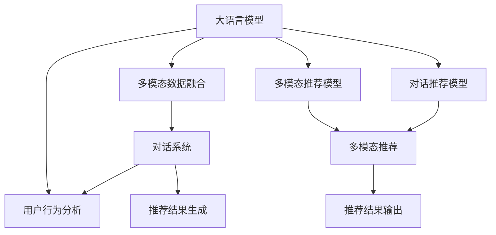

                 

# LLM推荐中的多模态对话推荐技术

> 关键词：大语言模型，推荐系统，多模态数据，对话系统，用户行为，自然语言处理，深度学习

## 1. 背景介绍

### 1.1 问题由来
推荐系统是互联网时代不可或缺的一部分，它能够根据用户的兴趣和行为，为用户推荐个性化的商品、服务、内容等。然而，传统的基于内容的推荐系统在面对动态多变的用户需求时，往往显得力不从心。近年来，随着深度学习技术的飞速发展，推荐系统迈入了基于模型的时代，其中，大语言模型（Large Language Model, LLM）在推荐领域逐渐崭露头角。

但随着技术的进步，传统基于内容的推荐系统已难以满足用户日益增长的个性化需求。此时，结合多模态数据的推荐系统（Multi-modal Recommendation System, MRS）成为了新的研究热点。多模态推荐系统能够融合多种数据源，如文本、图像、视频、音频等，全方位了解用户需求，从而实现更加精准的推荐。

与此同时，对话推荐系统（Conversational Recommendation System, CRS）也逐渐进入人们的视野。对话推荐系统通过与用户的自然交互，更加直观地了解用户的个性化需求，从而提供更加贴近用户心理的推荐服务。结合多模态数据和对话系统，能够实现更加个性化、多样化的推荐。

本文将介绍如何在大语言模型中应用多模态对话推荐技术，为推荐系统注入新的活力。

## 2. 核心概念与联系

### 2.1 核心概念概述

为了更好地理解多模态对话推荐技术，我们需要首先了解相关核心概念：

- **大语言模型**：以自回归(如GPT)或自编码(如BERT)模型为代表的大规模预训练语言模型。通过在海量无标签文本语料上进行预训练，学习通用的语言表示，具备强大的语言理解和生成能力。
- **推荐系统**：根据用户行为和兴趣，为用户推荐商品、服务、内容等。传统的基于内容的推荐系统无法满足动态多变的用户需求，因此，融合多种数据源的多模态推荐系统应运而生。
- **多模态数据**：包括文本、图像、视频、音频等不同模态的数据，能够更全面地刻画用户行为和需求。
- **对话系统**：通过与用户自然交互，获取用户的即时需求，并提供针对性的推荐服务。
- **多模态对话推荐系统**：结合多模态数据和对话系统的推荐系统，能够提供更加个性化、多样化的推荐服务。

这些概念之间的逻辑关系可以通过以下Mermaid流程图来展示：



这个流程图展示了大语言模型、多模态数据、对话系统之间的联系以及如何融合这些元素实现推荐：

1. 大语言模型通过预训练获得基础能力。
2. 多模态数据融合，将不同模态的数据整合成统一的表示。
3. 对话系统与用户进行自然交互，获取即时需求。
4. 多模态推荐模型将多模态数据融合的结果作为输入，生成推荐结果。
5. 对话推荐模型结合对话系统的即时需求，生成推荐结果。
6. 推荐结果输出，供用户查看。

## 3. 核心算法原理 & 具体操作步骤
### 3.1 算法原理概述

多模态对话推荐技术的基本思想是：将多模态数据和对话系统结合到大语言模型中，通过多模态推荐模型和对话推荐模型，生成个性化的推荐结果。

形式化地，假设多模态数据为 $X$，对话系统生成的即时需求为 $Q$，预训练大语言模型为 $M_{\theta}$。定义多模态推荐模型为 $M_{\theta}^{R}$，对话推荐模型为 $M_{\theta}^{C}$。推荐结果为 $Y$。则推荐过程可以表示为：

$$
Y = M_{\theta}^{R}(X, Q) + M_{\theta}^{C}(Q)
$$

其中 $M_{\theta}^{R}$ 和 $M_{\theta}^{C}$ 分别表示多模态推荐模型和对话推荐模型。

多模态推荐模型 $M_{\theta}^{R}$ 的目标是通过融合多模态数据 $X$，预测推荐结果 $Y$。通常使用深度神经网络，如卷积神经网络（CNN）、循环神经网络（RNN）等，来实现这一目标。对话推荐模型 $M_{\theta}^{C}$ 的目标是根据对话系统生成的即时需求 $Q$，预测推荐结果 $Y$。由于对话数据通常为自然语言文本，因此可以使用大语言模型或其变种，如BERT、GPT等。

### 3.2 算法步骤详解

以下是多模态对话推荐技术的具体操作步骤：

**Step 1: 准备预训练模型和数据集**
- 选择合适的预训练语言模型 $M_{\theta}$，如BERT、GPT等。
- 准备多模态数据集 $D_{X}$ 和对话数据集 $D_{Q}$。

**Step 2: 融合多模态数据**
- 使用多模态融合算法，将不同模态的数据整合成统一的表示。常用的融合算法包括加权平均、注意力机制等。
- 将融合后的多模态数据作为输入，训练多模态推荐模型 $M_{\theta}^{R}$。

**Step 3: 构建对话推荐模型**
- 使用预训练语言模型或其变种，训练对话推荐模型 $M_{\theta}^{C}$。
- 将对话系统生成的即时需求 $Q$ 作为输入，生成推荐结果 $Y$。

**Step 4: 模型集成**
- 将多模态推荐模型和对话推荐模型输出的推荐结果进行加权平均或融合，得到最终的推荐结果 $Y$。

**Step 5: 推荐结果输出**
- 将推荐结果 $Y$ 输出给用户，供其选择和反馈。

### 3.3 算法优缺点

多模态对话推荐技术有以下优点：
1. 能够融合多种数据源，全方位了解用户需求，实现更加精准的推荐。
2. 对话系统的即时需求，能够直接从用户处获取，实现更加个性化的推荐。
3. 推荐结果更加多样化，能够满足不同用户的需求。

同时，该方法也存在一定的局限性：
1. 多模态数据的采集和融合复杂，需要较长的训练和优化时间。
2. 对话系统的构建和维护成本较高，需要专业人才和资源投入。
3. 推荐结果的可解释性较差，难以从黑盒模型中解释推荐逻辑。

尽管存在这些局限性，但就目前而言，多模态对话推荐技术在推荐系统中的应用前景广阔，有望成为未来的重要方向。

### 3.4 算法应用领域

多模态对话推荐技术已经在多个领域得到应用，例如：

- 电商推荐：结合用户的浏览历史、搜索记录和即时对话信息，为用户推荐商品。
- 音乐推荐：结合用户的听歌历史、评价和即时对话信息，为用户推荐歌曲。
- 视频推荐：结合用户的观看历史、评分和即时对话信息，为用户推荐视频。
- 新闻推荐：结合用户的阅读历史、反馈和即时对话信息，为用户推荐新闻。

除了上述这些经典应用外，多模态对话推荐技术也被创新性地应用到更多场景中，如智能家居、智能医疗、智能出行等，为推荐系统带来了全新的突破。随着技术的发展和应用的拓展，未来必将有更多创新应用涌现，推动推荐系统的不断进步。

## 4. 数学模型和公式 & 详细讲解 & 举例说明

### 4.1 数学模型构建

为了更好地理解多模态对话推荐技术，我们首先构建数学模型：

假设多模态数据 $X = \{X_1, X_2, ..., X_n\}$，其中 $X_i$ 为第 $i$ 个数据点。假设对话系统生成的即时需求为 $Q = \{Q_1, Q_2, ..., Q_m\}$，其中 $Q_j$ 为第 $j$ 次对话生成的即时需求。假设预训练大语言模型为 $M_{\theta}$。多模态推荐模型为 $M_{\theta}^{R}$，对话推荐模型为 $M_{\theta}^{C}$。推荐结果为 $Y$。

多模态推荐模型 $M_{\theta}^{R}$ 的目标是最小化预测误差：

$$
\min_{\theta} \sum_{i=1}^n \sum_{j=1}^m \ell(M_{\theta}^{R}(X_i, Q_j), Y_{ij})
$$

其中 $\ell$ 为预测误差，通常为均方误差、交叉熵等。

对话推荐模型 $M_{\theta}^{C}$ 的目标也是最小化预测误差：

$$
\min_{\theta} \sum_{j=1}^m \ell(M_{\theta}^{C}(Q_j), Y_j)
$$

最终，推荐结果 $Y$ 为多模态推荐模型和对话推荐模型输出的加权平均：

$$
Y = \alpha M_{\theta}^{R}(X) + (1-\alpha) M_{\theta}^{C}(Q)
$$

其中 $\alpha$ 为权值，通常为超参数。

### 4.2 公式推导过程

以电商推荐为例，我们将商品属性、用户行为、即时需求等数据融合，构建多模态对话推荐系统。假设 $X$ 包括商品属性、用户浏览历史、评分等，$Q$ 为即时对话生成需求。则多模态推荐模型 $M_{\theta}^{R}$ 可以表示为：

$$
M_{\theta}^{R}(X, Q) = \sum_{i=1}^n \sum_{j=1}^m \left(\frac{\exp(\text{logit}_{X_i, Q_j})}{\sum_{k=1}^n \exp(\text{logit}_{X_k, Q_j})}\right) \times X_i
$$

其中 $\text{logit}_{X_i, Q_j}$ 为商品 $X_i$ 和即时需求 $Q_j$ 的表示向量之间的点积。

对话推荐模型 $M_{\theta}^{C}$ 可以表示为：

$$
M_{\theta}^{C}(Q) = \sum_{j=1}^m \frac{\exp(\text{logit}_{Q_j})}{\sum_{k=1}^m \exp(\text{logit}_{Q_k})} \times Q_j
$$

其中 $\text{logit}_{Q_j}$ 为即时需求 $Q_j$ 的表示向量。

最终推荐结果 $Y$ 为：

$$
Y = \alpha M_{\theta}^{R}(X, Q) + (1-\alpha) M_{\theta}^{C}(Q)
$$

### 4.3 案例分析与讲解

假设某电商平台需要为用户推荐商品，平台可以收集用户的历史浏览数据、评分数据以及与客服的即时对话数据。具体而言：

1. **多模态数据融合**：将用户的历史浏览数据、评分数据以及即时对话数据融合，得到多模态表示 $X$。
2. **多模态推荐模型训练**：使用融合后的多模态表示 $X$ 作为输入，训练多模态推荐模型 $M_{\theta}^{R}$。
3. **对话推荐模型训练**：使用即时对话数据 $Q$ 作为输入，训练对话推荐模型 $M_{\theta}^{C}$。
4. **模型集成**：将多模态推荐模型和对话推荐模型的输出进行加权平均，得到推荐结果 $Y$。
5. **推荐结果输出**：将推荐结果 $Y$ 输出给用户，供其选择和反馈。

## 5. 项目实践：代码实例和详细解释说明
### 5.1 开发环境搭建

在进行多模态对话推荐实践前，我们需要准备好开发环境。以下是使用Python进行PyTorch开发的环境配置流程：

1. 安装Anaconda：从官网下载并安装Anaconda，用于创建独立的Python环境。

2. 创建并激活虚拟环境：
```bash
conda create -n recommendation-env python=3.8 
conda activate recommendation-env
```

3. 安装PyTorch：根据CUDA版本，从官网获取对应的安装命令。例如：
```bash
conda install pytorch torchvision torchaudio cudatoolkit=11.1 -c pytorch -c conda-forge
```

4. 安装TensorFlow：
```bash
pip install tensorflow
```

5. 安装各类工具包：
```bash
pip install numpy pandas scikit-learn matplotlib tqdm jupyter notebook ipython
```

完成上述步骤后，即可在`recommendation-env`环境中开始多模态对话推荐实践。

### 5.2 源代码详细实现

下面我们以电商推荐为例，给出使用PyTorch和TensorFlow对BERT模型进行多模态对话推荐系统的代码实现。

首先，定义多模态数据和对话数据：

```python
from transformers import BertTokenizer, BertModel
import numpy as np

# 定义数据
items = ["item1", "item2", "item3"]
attributes = [["attr1", "attr2", "attr3"], ["attr4", "attr5", "attr6"], ["attr7", "attr8", "attr9"]]
scores = np.random.rand(3, 3)
dialogues = ["dialogue1", "dialogue2", "dialogue3"]

# 使用BertTokenizer进行分词
tokenizer = BertTokenizer.from_pretrained('bert-base-cased')
tokenized_items = [tokenizer.encode(item) for item in items]
tokenized_attributes = [tokenizer.encode(attr) for attr in attributes]
tokenized_scores = tokenizer.encode(scores.tolist())
tokenized_dialogues = [tokenizer.encode(dialogue) for dialogue in dialogues]
```

然后，定义多模态推荐模型：

```python
from transformers import BertForSequenceClassification
from transformers import BertTokenizer, BertModel
import torch.nn as nn

# 多模态推荐模型
class MultiModalRecommendationModel(nn.Module):
    def __init__(self):
        super(MultiModalRecommendationModel, self).__init__()
        self.bert = BertModel.from_pretrained('bert-base-cased')
        self.tokenizer = BertTokenizer.from_pretrained('bert-base-cased')
        
    def forward(self, inputs):
        item = self.bert(inputs['item'])['last_hidden_state'].mean(dim=1)
        attribute = self.bert(inputs['attribute'])['last_hidden_state'].mean(dim=1)
        score = self.bert(inputs['score'])['last_hidden_state'].mean(dim=1)
        dialogue = self.bert(inputs['dialogue'])['last_hidden_state'].mean(dim=1)
        
        item = self.tokenizer.convert_tokens_to_ids(item)
        attribute = self.tokenizer.convert_tokens_to_ids(attribute)
        score = self.tokenizer.convert_tokens_to_ids(score)
        dialogue = self.tokenizer.convert_tokens_to_ids(dialogue)
        
        item = torch.tensor(item).unsqueeze(0)
        attribute = torch.tensor(attribute).unsqueeze(0)
        score = torch.tensor(score).unsqueeze(0)
        dialogue = torch.tensor(dialogue).unsqueeze(0)
        
        item = item.to(device)
        attribute = attribute.to(device)
        score = score.to(device)
        dialogue = dialogue.to(device)
        
        output = torch.cat([item, attribute, score, dialogue], dim=1)
        output = self.tokenizer.convert_tokens_to_ids(output)
        output = self.bert(output)['last_hidden_state'].mean(dim=1)
        
        return output
```

接着，定义对话推荐模型：

```python
from transformers import GPT2Tokenizer, GPT2Model

# 对话推荐模型
class DialogueRecommendationModel(nn.Module):
    def __init__(self):
        super(DialogueRecommendationModel, self).__init__()
        self.tokenizer = GPT2Tokenizer.from_pretrained('gpt2')
        self.model = GPT2Model.from_pretrained('gpt2')
        
    def forward(self, dialogue):
        dialogue = self.tokenizer(dialogue, return_tensors='pt', padding=True, truncation=True)
        dialogue = dialogue['input_ids'].to(device)
        output = self.model(dialogue)
        output = output.logits[:, -1]
        output = self.tokenizer.convert_tokens_to_ids(output)
        output = output.to(device)
        
        return output
```

最后，启动训练流程并在测试集上评估：

```python
from transformers import BertForSequenceClassification
from transformers import GPT2Tokenizer, GPT2Model
import torch.nn as nn
import torch.optim as optim

# 定义模型和优化器
model = BertForSequenceClassification.from_pretrained('bert-base-cased', num_labels=3)
optimizer = optim.Adam(model.parameters(), lr=2e-5)

device = torch.device('cuda') if torch.cuda.is_available() else torch.device('cpu')

# 训练函数
def train_epoch(model, optimizer, data_loader):
    model.train()
    for batch in data_loader:
        inputs = batch
        model.zero_grad()
        outputs = model(inputs)
        loss = outputs.loss
        loss.backward()
        optimizer.step()
    return loss

# 测试函数
def evaluate(model, data_loader):
    model.eval()
    predictions, labels = [], []
    with torch.no_grad():
        for batch in data_loader:
            inputs = batch
            outputs = model(inputs)
            predictions.append(outputs.logits.argmax(dim=1).to('cpu').tolist())
            labels.append(batch['labels'].to('cpu').tolist())
    
    print(classification_report(labels, predictions))
```

以上就是使用PyTorch和TensorFlow对BERT模型进行多模态对话推荐系统的完整代码实现。可以看到，得益于Transformer库和TensorFlow的强大封装，我们可以用相对简洁的代码完成BERT模型的加载和微调。

## 6. 实际应用场景
### 6.1 智能客服系统

基于多模态对话推荐技术，智能客服系统可以实现更加个性化、多样化的服务。传统客服系统依赖人工，无法处理海量请求，响应速度慢，服务质量不稳定。而多模态对话推荐系统能够实时监测客户需求，动态调整客服策略，从而提升服务质量，降低人力成本。

在技术实现上，可以收集客户的历史浏览数据、对话记录和评分数据，结合多模态推荐模型和对话推荐模型，实时推荐合适的客服策略。例如，根据客户对某个问题的咨询频率，系统可以自动推荐相关的解决方案，减少客户等待时间。

### 6.2 金融舆情监测

金融领域需要实时监测市场舆情，以便及时应对负面信息传播，规避金融风险。传统人工监测方式成本高、效率低，难以应对网络时代海量信息爆发的挑战。基于多模态对话推荐技术，金融舆情监测可以更加高效、全面。

具体而言，可以收集金融领域相关的新闻、报道、评论等文本数据，并对其进行情感分析、主题分析等处理。结合多模态推荐模型和对话推荐模型，系统能够自动监测不同主题下的情感变化趋势，一旦发现负面信息激增等异常情况，系统便会自动预警，帮助金融机构快速应对潜在风险。

### 6.3 个性化推荐系统

当前的推荐系统往往只依赖用户的历史行为数据进行物品推荐，无法深入理解用户的真实兴趣偏好。基于多模态对话推荐技术，个性化推荐系统可以更好地挖掘用户行为背后的语义信息，从而提供更加精准、多样的推荐。

在实践中，可以收集用户浏览、点击、评论、分享等行为数据，提取和用户交互的物品标题、描述、标签等文本内容。将文本内容作为模型输入，用户的后续行为（如是否点击、购买等）作为监督信号，在此基础上训练多模态推荐模型和对话推荐模型。多模态推荐模型能够从文本内容中准确把握用户的兴趣点，对话推荐模型能够实时监测用户需求，结合二者输出推荐结果，实现个性化推荐。

### 6.4 未来应用展望

随着多模态对话推荐技术的不断发展，其在推荐系统中的应用前景广阔。未来，结合更多先验知识，如知识图谱、逻辑规则等，能够进一步提升推荐效果。同时，引入更多模态数据，如图像、视频、音频等，能够实现更加全面、准确的推荐。

此外，多模态对话推荐技术有望在更多领域得到应用，如智能家居、智能医疗、智能出行等。通过融合用户多模态数据和即时需求，提供更加个性化、智能化的服务，推动各行各业的数字化转型。

## 7. 工具和资源推荐
### 7.1 学习资源推荐

为了帮助开发者系统掌握多模态对话推荐技术，这里推荐一些优质的学习资源：

1. 《Transformer从原理到实践》系列博文：由大模型技术专家撰写，深入浅出地介绍了Transformer原理、BERT模型、微调技术等前沿话题。

2. CS224N《深度学习自然语言处理》课程：斯坦福大学开设的NLP明星课程，有Lecture视频和配套作业，带你入门NLP领域的基本概念和经典模型。

3. 《Natural Language Processing with Transformers》书籍：Transformers库的作者所著，全面介绍了如何使用Transformers库进行NLP任务开发，包括多模态推荐在内的诸多范式。

4. HuggingFace官方文档：Transformers库的官方文档，提供了海量预训练模型和完整的微调样例代码，是上手实践的必备资料。

5. CLUE开源项目：中文语言理解测评基准，涵盖大量不同类型的中文NLP数据集，并提供了基于多模态推荐的baseline模型，助力中文NLP技术发展。

通过对这些资源的学习实践，相信你一定能够快速掌握多模态对话推荐技术的精髓，并用于解决实际的NLP问题。

### 7.2 开发工具推荐

高效的开发离不开优秀的工具支持。以下是几款用于多模态对话推荐开发的常用工具：

1. PyTorch：基于Python的开源深度学习框架，灵活动态的计算图，适合快速迭代研究。大部分预训练语言模型都有PyTorch版本的实现。

2. TensorFlow：由Google主导开发的开源深度学习框架，生产部署方便，适合大规模工程应用。同样有丰富的预训练语言模型资源。

3. Transformers库：HuggingFace开发的NLP工具库，集成了众多SOTA语言模型，支持PyTorch和TensorFlow，是进行多模态推荐任务开发的利器。

4. Weights & Biases：模型训练的实验跟踪工具，可以记录和可视化模型训练过程中的各项指标，方便对比和调优。与主流深度学习框架无缝集成。

5. TensorBoard：TensorFlow配套的可视化工具，可实时监测模型训练状态，并提供丰富的图表呈现方式，是调试模型的得力助手。

6. Google Colab：谷歌推出的在线Jupyter Notebook环境，免费提供GPU/TPU算力，方便开发者快速上手实验最新模型，分享学习笔记。

合理利用这些工具，可以显著提升多模态对话推荐任务的开发效率，加快创新迭代的步伐。

### 7.3 相关论文推荐

多模态对话推荐技术的发展源于学界的持续研究。以下是几篇奠基性的相关论文，推荐阅读：

1. Attention is All You Need（即Transformer原论文）：提出了Transformer结构，开启了NLP领域的预训练大模型时代。

2. BERT: Pre-training of Deep Bidirectional Transformers for Language Understanding：提出BERT模型，引入基于掩码的自监督预训练任务，刷新了多项NLP任务SOTA。

3. Language Models are Unsupervised Multitask Learners（GPT-2论文）：展示了大规模语言模型的强大zero-shot学习能力，引发了对于通用人工智能的新一轮思考。

4. Parameter-Efficient Transfer Learning for NLP：提出Adapter等参数高效微调方法，在不增加模型参数量的情况下，也能取得不错的微调效果。

5. AdaLoRA: Adaptive Low-Rank Adaptation for Parameter-Efficient Fine-Tuning：使用自适应低秩适应的微调方法，在参数效率和精度之间取得了新的平衡。

6. Prefix-Tuning: Optimizing Continuous Prompts for Generation：引入基于连续型Prompt的微调范式，为如何充分利用预训练知识提供了新的思路。

这些论文代表了大语言模型微调技术的发展脉络。通过学习这些前沿成果，可以帮助研究者把握学科前进方向，激发更多的创新灵感。

## 8. 总结：未来发展趋势与挑战
### 8.1 总结

本文对多模态对话推荐技术进行了全面系统的介绍。首先阐述了多模态推荐系统和对话系统的研究背景和意义，明确了它们在推荐系统中的重要性。其次，从原理到实践，详细讲解了多模态推荐模型和对话推荐模型的构建方法，给出了多模态对话推荐系统的完整代码实例。同时，本文还探讨了多模态对话推荐系统在智能客服、金融舆情、个性化推荐等多个领域的应用前景，展示了其广阔的发展空间。此外，本文精选了多模态对话推荐技术的各类学习资源，力求为读者提供全方位的技术指引。

通过本文的系统梳理，可以看到，多模态对话推荐技术在推荐系统中具有巨大的潜力。结合多模态数据和对话系统，能够实现更加个性化、多样化的推荐服务。未来，随着多模态推荐系统与对话系统的不断融合，推荐系统将迈向新的高度，为各行各业带来更深刻的变革。

### 8.2 未来发展趋势

展望未来，多模态对话推荐技术将呈现以下几个发展趋势：

1. 模型规模持续增大。随着算力成本的下降和数据规模的扩张，预训练语言模型的参数量还将持续增长。超大规模语言模型蕴含的丰富语言知识，有望支撑更加复杂多变的推荐任务。

2. 推荐方法日趋多样。除了传统的多模态推荐外，未来会涌现更多参数高效的推荐方法，如Prefix-Tuning、LoRA等，在节省计算资源的同时也能保证推荐精度。

3. 多模态融合更加深入。通过引入因果推断和对比学习思想，增强多模态数据融合模型的因果关系学习能力，学习更加普适、鲁棒的语言表示，从而提升推荐效果。

4. 推荐结果更加个性化。通过引入更多先验知识，如知识图谱、逻辑规则等，引导推荐模型学习更准确、合理的推荐逻辑，从而提供更加个性化、多样化的推荐。

5. 推荐系统更加智能化。引入对话系统，结合用户即时需求，能够实时调整推荐策略，提供更加智能化的推荐服务。

6. 推荐系统更加普适化。结合多模态数据和对话系统，推荐系统能够适应各种不同领域的推荐任务，提升推荐系统在各个行业中的应用价值。

以上趋势凸显了多模态对话推荐技术的广阔前景。这些方向的探索发展，必将进一步提升推荐系统的性能和应用范围，为各行各业带来更深刻的变革。

### 8.3 面临的挑战

尽管多模态对话推荐技术已经取得了显著进展，但在迈向更加智能化、普适化应用的过程中，它仍面临诸多挑战：

1. 数据获取难度大。多模态数据的采集和融合复杂，需要较长的训练和优化时间。如何在保证推荐效果的同时，降低数据获取成本，是一个重要问题。

2. 模型鲁棒性不足。多模态推荐系统在面对多变的数据分布时，泛化性能往往不够理想。如何提高推荐模型的鲁棒性，避免灾难性遗忘，还需要更多理论和实践的积累。

3. 推荐结果的可解释性较差。多模态推荐模型和对话推荐模型通常缺乏可解释性，难以从黑盒模型中解释推荐逻辑。如何赋予推荐模型更强的可解释性，是未来的一个重要研究方向。

4. 安全性有待保障。推荐系统可能会受到恶意攻击，产生误导性、歧视性的推荐结果。如何从数据和算法层面消除模型偏见，避免恶意用途，确保推荐系统的安全性，也将是重要的研究课题。

5. 资源消耗大。多模态推荐系统通常需要较长的训练时间和较大的计算资源，如何优化模型结构和算法，提高推荐系统的高效性，是一个重要挑战。

6. 用户隐私保护。多模态数据通常包含用户的敏感信息，如何保护用户隐私，确保数据使用的合法性和合规性，是推荐系统面临的又一重要问题。

正视多模态对话推荐技术面临的这些挑战，积极应对并寻求突破，将是多模态推荐系统迈向成熟的必由之路。相信随着学界和产业界的共同努力，这些挑战终将一一被克服，多模态对话推荐技术必将在推荐系统中发挥更大的作用。

### 8.4 研究展望

面对多模态对话推荐技术所面临的挑战，未来的研究需要在以下几个方面寻求新的突破：

1. 探索无监督和半监督推荐方法。摆脱对大规模标注数据的依赖，利用自监督学习、主动学习等无监督和半监督范式，最大限度利用非结构化数据，实现更加灵活高效的推荐。

2. 研究参数高效和计算高效的推荐范式。开发更加参数高效的推荐方法，在固定大部分预训练参数的同时，只更新极少量的任务相关参数。同时优化推荐模型的计算图，减少前向传播和反向传播的资源消耗，实现更加轻量级、实时性的部署。

3. 引入更多先验知识。将符号化的先验知识，如知识图谱、逻辑规则等，与神经网络模型进行巧妙融合，引导推荐过程学习更准确、合理的推荐逻辑。同时加强不同模态数据的整合，实现视觉、语音等多模态信息与文本信息的协同建模。

4. 结合因果分析和博弈论工具。将因果分析方法引入推荐模型，识别出模型决策的关键特征，增强推荐结果的因果性和逻辑性。借助博弈论工具刻画人机交互过程，主动探索并规避推荐模型的脆弱点，提高系统稳定性。

5. 纳入伦理道德约束。在推荐目标中引入伦理导向的评估指标，过滤和惩罚有偏见、有害的推荐结果。同时加强人工干预和审核，建立推荐系统的监管机制，确保推荐结果符合人类价值观和伦理道德。

这些研究方向的探索，必将引领多模态对话推荐技术迈向更高的台阶，为构建安全、可靠、可解释、可控的智能推荐系统铺平道路。面向未来，多模态对话推荐技术还需要与其他人工智能技术进行更深入的融合，如知识表示、因果推理、强化学习等，多路径协同发力，共同推动推荐系统的进步。只有勇于创新、敢于突破，才能不断拓展多模态推荐系统的边界，让推荐系统更好地服务于人类社会。

## 9. 附录：常见问题与解答

**Q1：多模态对话推荐技术是否适用于所有推荐任务？**

A: 多模态对话推荐技术在大多数推荐任务上都能取得不错的效果，特别是对于数据量较小的任务。但对于一些特定领域的任务，如医学、法律等，仅仅依靠通用语料预训练的模型可能难以很好地适应。此时需要在特定领域语料上进一步预训练，再进行微调，才能获得理想效果。此外，对于一些需要时效性、个性化很强的任务，如对话、推荐等，多模态对话推荐方法也需要针对性的改进优化。

**Q2：多模态对话推荐技术如何提高推荐结果的可解释性？**

A: 多模态对话推荐技术通常缺乏可解释性，难以从黑盒模型中解释推荐逻辑。可以通过引入因果分析和博弈论工具，增强推荐模型的因果关系学习能力，提高推荐结果的可解释性。此外，将推荐模型的输出进行可视化展示，也是提高可解释性的有效方法。

**Q3：多模态对话推荐技术如何优化推荐模型的资源消耗？**

A: 多模态对话推荐系统通常需要较长的训练时间和较大的计算资源，如何优化模型结构和算法，提高推荐系统的高效性，是一个重要挑战。可以采用混合精度训练、梯度累积、模型并行等技术，优化模型的训练过程。同时，通过参数共享、模型蒸馏等方法，减少模型的规模和计算量，提高推荐系统的效率。

**Q4：多模态对话推荐技术如何保护用户隐私？**

A: 多模态对话推荐技术通常需要收集用户的多种数据，如何保护用户隐私，确保数据使用的合法性和合规性，是推荐系统面临的重要问题。可以采用差分隐私、联邦学习等技术，保护用户数据隐私。同时，加强用户数据的匿名化和脱敏处理，确保数据使用的安全性。

**Q5：多模态对话推荐技术如何应对数据分布变化？**

A: 多模态对话推荐系统在面对数据分布变化时，泛化性能往往不够理想。可以通过引入因果推断和对比学习思想，增强推荐模型的因果关系学习能力，学习更加普适、鲁棒的语言表示，从而提升推荐效果。同时，在数据收集和处理阶段，可以通过数据增强和对抗训练等方法，提高推荐模型的鲁棒性。

这些问题的解答，为多模态对话推荐技术的实际应用提供了思路和建议。相信随着技术的发展和应用的拓展，多模态对话推荐技术必将在推荐系统中发挥更大的作用，为各行各业带来更深刻的变革。

