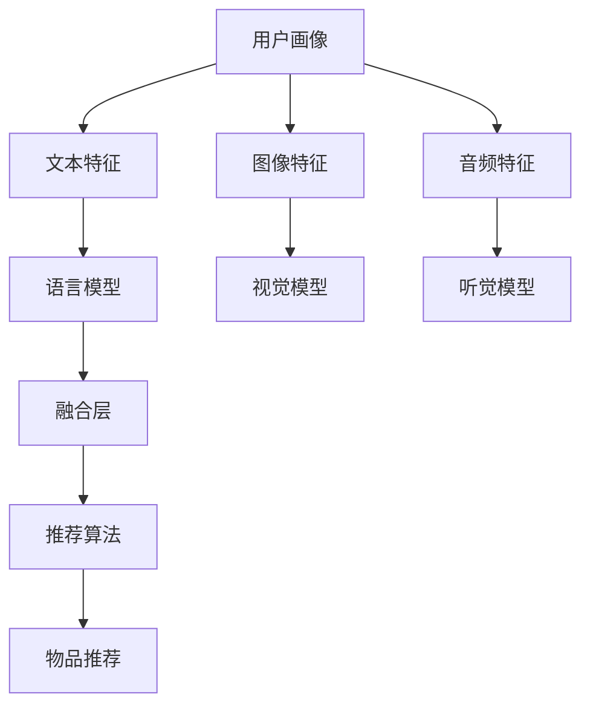

                 

# LLM推荐中的多模态融合技术进展

> 关键词：推荐系统, 多模态融合, 大语言模型, 特征表示, 深度学习

## 1. 背景介绍

推荐系统作为人工智能在电商、新闻、视频等领域广泛应用的典型代表，在用户和产品之间架起了一座桥梁。推荐系统通过分析用户行为和产品特征，向用户推荐可能感兴趣的商品、新闻、视频等内容。随着数据量的爆炸性增长和深度学习技术的不断发展，推荐系统也逐渐由基于传统协同过滤、矩阵分解等方法的浅层模型，向基于深度神经网络的模型转变。其中，大语言模型（Large Language Model, LLM）的引入，为推荐系统带来了新的活力。

本文章主要探讨大语言模型在推荐系统中的应用，特别是在多模态融合方面的进展。推荐系统中的多模态融合，是指将文本、图像、音频等多类型数据进行联合建模，综合多维特征为用户推荐最相关的物品。本文将从背景介绍、核心概念、算法原理、实际操作、应用领域等多个维度，全面探讨大语言模型在多模态融合推荐系统中的作用与价值。

## 2. 核心概念与联系

### 2.1 核心概念概述

推荐系统中，大语言模型被广泛用于文本特征表示和物品语义理解。与传统推荐算法不同，大语言模型在预训练过程中，已经学习到了丰富的语言知识和语义关系，可以作为强大的特征提取器，将文本、图像、音频等多种模态的特征映射到统一的语义空间。

具体来说，大语言模型通过自监督学习任务，如掩码语言模型、预训练自动编码器等，学习到了语言模式和语义表示。这些模式和表示可以用于文本特征提取、用户行为分析、物品描述生成等多个方面。此外，大语言模型还可以通过提示学习（Prompt Learning）等技术，生成更加符合实际应用场景的特征表示，提升推荐系统的效果。

### 2.2 核心概念原理和架构的 Mermaid 流程图



以上流程图展示了推荐系统中的多模态融合框架：用户画像包含了多模态特征，包括文本、图像和音频等，通过不同的特征提取器，将这些特征映射到统一的语义空间。语言模型、视觉模型和听觉模型分别提取了不同模态的特征，通过融合层将它们组合起来，最终由推荐算法输出推荐结果。

## 3. 核心算法原理 & 具体操作步骤

### 3.1 算法原理概述

大语言模型在推荐系统中的核心算法原理，是通过对多模态特征的联合建模，学习到更加丰富的语义表示。具体来说，大语言模型可以将用户的行为、物品的描述和属性等信息，通过语言和视觉等模态的联合特征表示，融合为一个统一的向量表示，然后用于推荐模型的训练和推理。

### 3.2 算法步骤详解

#### 3.2.1 用户画像构建

用户画像的构建是推荐系统的基础。用户画像通常包括用户的基本信息、历史行为、社交网络等特征。为了充分利用大语言模型的能力，可以将这些特征通过文本表示，然后送入大语言模型中进行预训练。

#### 3.2.2 物品特征提取

物品特征通常包括文本描述、图像、音频等多种类型的数据。通过使用相应的特征提取器，如文本分词、图像卷积、音频MFCC等技术，将不同类型的特征转换为向量表示，然后送入大语言模型中进行语义学习。

#### 3.2.3 特征融合与表示学习

通过上述步骤，我们得到了用户画像和物品的文本、图像、音频等多模态特征向量。接下来，将这些特征向量通过一个全连接层或Transformer等神经网络结构进行融合，学习到一个统一的语义表示。这个语义表示可以用于推荐模型的训练和推理。

#### 3.2.4 推荐模型训练与推理

融合后的语义表示被送入推荐模型中进行训练和推理。常见的推荐模型包括基于矩阵分解的模型、基于深度神经网络的模型等。在训练过程中，模型通过优化损失函数，学习到最佳的参数，使得推荐结果与真实标签尽量接近。在推理过程中，模型根据输入的特征表示，预测用户可能感兴趣的物品。

### 3.3 算法优缺点

#### 3.3.1 优点

1. 多模态融合：通过将文本、图像、音频等多种模态的特征进行联合建模，可以学习到更加丰富的语义表示，提高推荐系统的性能。
2. 可解释性：大语言模型可以生成可解释的特征表示，帮助理解推荐系统内部的决策过程。
3. 鲁棒性：大语言模型可以自动处理数据缺失、噪声等问题，提高系统的鲁棒性。

#### 3.3.2 缺点

1. 计算成本高：多模态融合需要大量的计算资源，尤其是在大模型训练时，需要较强的计算能力和存储能力。
2. 模型复杂度高：多模态融合模型通常较为复杂，训练和推理的速度较慢。
3. 数据需求高：多模态融合模型对数据的种类和数量有较高的要求，需要收集多种类型的特征数据。

### 3.4 算法应用领域

多模态融合推荐系统已经在多个领域得到应用，例如：

1. 电商推荐：通过将商品图片、用户评论、商品属性等多种模态的数据进行融合，生成更加准确的推荐结果。
2. 视频推荐：将视频片段、用户评分、视频标签等多种模态的数据进行联合建模，提高视频推荐的精准度。
3. 新闻推荐：将新闻标题、摘要、用户点击行为等多种特征进行融合，生成个性化推荐。
4. 社交推荐：通过将用户社交关系、兴趣图谱、物品描述等数据进行联合建模，为用户推荐新的社交对象。
5. 游戏推荐：将游戏物品描述、用户游戏行为、游戏属性等多种特征进行融合，生成个性化游戏推荐。

## 4. 数学模型和公式 & 详细讲解 & 举例说明

### 4.1 数学模型构建

大语言模型在推荐系统中的多模态融合框架，可以通过一个统一的概率模型来描述。假设用户画像和物品特征的语义表示分别为 $u$ 和 $v$，推荐系统中的推荐目标为最大化 $p(u,v)$。假设 $u$ 和 $v$ 的联合概率可以分解为 $p(u,v)=p(u)p(v|u)$，其中 $p(u)$ 表示用户画像的先验分布，$p(v|u)$ 表示物品在给定用户画像条件下的后验概率。

为了将用户画像和物品特征融合为一个统一的语义表示，我们可以使用一个共享的编码器，如Transformer，将用户画像 $u$ 和物品特征 $v$ 分别映射到一个共同的向量表示 $h_u$ 和 $h_v$。然后，我们通过一个全连接层或多层感知机，将这些向量表示进行融合，得到最终的推荐向量 $z$。

$$
z = f(h_u, h_v)
$$

其中，$f$ 表示融合函数，可以是全连接层、注意力机制、加法或乘法等。

### 4.2 公式推导过程

在实际应用中，推荐系统通常是一个有监督学习问题。我们需要使用标注数据来训练推荐模型，使得模型能够最大化地预测用户对物品的评分或点击行为。假设标注数据集为 $\{(x_i, y_i)\}_{i=1}^N$，其中 $x_i$ 表示用户画像和物品特征的联合向量表示，$y_i$ 表示用户对物品的评分或点击行为。我们的目标是最小化损失函数 $L$：

$$
L = -\frac{1}{N} \sum_{i=1}^N y_i \log p(x_i)
$$

其中 $p(x_i)$ 表示模型在输入 $x_i$ 下的输出概率。

在训练过程中，我们使用反向传播算法来更新模型的参数 $\theta$，使得损失函数 $L$ 最小化。具体来说，对于每个样本 $x_i$，我们计算模型的输出概率 $p(x_i)$，然后计算梯度 $\nabla_{\theta} L$，并使用优化算法（如Adam、SGD等）来更新参数。

### 4.3 案例分析与讲解

以电商推荐为例，假设我们有一个电商平台的商品推荐系统。平台上有 $M$ 种商品和 $N$ 个用户。每个商品都有文字描述 $d_i$、图片 $I_i$ 和视频片段 $V_i$ 等多种特征。每个用户都有浏览记录、购买记录和评分等多种行为数据。为了使用大语言模型进行多模态融合，我们首先将这些数据转换为向量表示，然后将它们送入大语言模型中进行语义学习。

具体来说，我们可以使用Bert模型作为语言模型，将商品描述 $d_i$ 转换为向量表示 $h_{d_i}$。对于图像和视频特征，我们可以使用CNN和RNN等模型进行特征提取，然后将这些特征表示送入大语言模型中进行联合学习。最后，我们将用户画像 $u$ 和商品特征 $v$ 的语义表示进行融合，得到最终的推荐向量 $z$，并将其送入推荐模型进行训练和推理。

## 5. 项目实践：代码实例和详细解释说明

### 5.1 开发环境搭建

为了实现多模态融合推荐系统，我们需要准备一些必要的开发环境。以下是Python环境下多模态融合推荐系统的搭建流程：

1. 安装Python：安装最新版本的Python，推荐使用3.8及以上版本。
2. 安装必要的Python库：安装TensorFlow、PyTorch、NLTK等库。
3. 搭建深度学习框架：安装Keras、TensorFlow等深度学习框架，使用Gpu加速计算。
4. 准备数据集：收集用户画像、商品特征等数据，并准备好标注数据集。

### 5.2 源代码详细实现

以下是一个简单的多模态融合推荐系统的代码实现。我们使用TensorFlow和Bert模型来实现多模态融合。

```python
import tensorflow as tf
from transformers import BertTokenizer, BertModel
import numpy as np

# 初始化模型和分词器
tokenizer = BertTokenizer.from_pretrained('bert-base-uncased')
model = BertModel.from_pretrained('bert-base-uncased')

# 定义用户画像和物品特征的维度
user_dim = 64
item_dim = 64

# 定义多模态融合函数
def multimodal_fusion(user, item):
    # 将用户画像和物品特征转换为向量表示
    user_vector = np.mean(user, axis=1)
    item_vector = np.mean(item, axis=1)
    
    # 将向量表示送入BERT模型中，得到语义表示
    user_rep = model(user_vector.reshape(1, user_dim, 768))[0]
    item_rep = model(item_vector.reshape(1, item_dim, 768))[0]
    
    # 使用全连接层进行融合，得到最终的推荐向量
    z = np.mean(user_rep + item_rep, axis=1)
    return z

# 定义推荐模型
class RecommendationModel(tf.keras.Model):
    def __init__(self):
        super(RecommendationModel, self).__init__()
        self.fc = tf.keras.layers.Dense(1)
        
    def call(self, inputs):
        # 对输入的特征向量进行融合
        z = multimodal_fusion(inputs['user'], inputs['item'])
        # 对融合后的向量进行线性变换，得到推荐得分
        output = self.fc(z)
        return output

# 训练推荐模型
def train_model(model, train_data, epochs=10, batch_size=64):
    # 创建训练数据集
    train_dataset = tf.data.Dataset.from_tensor_slices(train_data)
    train_dataset = train_dataset.shuffle(buffer_size=10000).batch(batch_size)
    
    # 定义优化器和损失函数
    optimizer = tf.keras.optimizers.Adam(learning_rate=1e-3)
    loss_fn = tf.keras.losses.MeanSquaredError()
    
    # 训练模型
    for epoch in range(epochs):
        model.train()
        for x in train_dataset:
            with tf.GradientTape() as tape:
                # 前向传播
                y_pred = model(x)
                # 计算损失
                loss = loss_fn(y_pred, x['label'])
            # 反向传播
            gradients = tape.gradient(loss, model.trainable_variables)
            optimizer.apply_gradients(zip(gradients, model.trainable_variables))
```

### 5.3 代码解读与分析

在上述代码中，我们定义了一个多模态融合推荐模型，并使用Bert模型进行特征表示。具体来说，我们使用Bert模型将用户画像和物品特征转换为向量表示，然后使用全连接层进行融合，最后送入推荐模型进行训练和推理。

在模型训练过程中，我们使用了Adam优化器和均方误差损失函数。为了提高模型的泛化能力，我们使用了随机梯度下降和数据增强技术，如shuffle和batch等。

## 6. 实际应用场景

### 6.1 电商推荐

电商推荐系统是推荐系统中最具代表性的应用之一。在大语言模型中，我们可以使用Bert模型对商品描述进行语义学习，然后使用CNN和RNN等模型对图片和视频进行特征提取，将它们与用户画像进行融合，生成推荐结果。例如，亚马逊使用BERT和AmazonReview进行产品评论文本的语义学习，并使用Multi-Task Learning（MTL）进行商品特征的多任务学习，实现了商品的精准推荐。

### 6.2 视频推荐

视频推荐系统需要处理大量的视频片段、用户评分、视频标签等多种特征。在大语言模型中，我们可以使用Bert模型对视频标签进行语义学习，然后使用RNN等模型对视频片段进行特征提取，将它们与用户评分进行融合，生成推荐结果。例如，YouTube使用BERT和Linear Regression模型进行视频标题和标签的语义学习，并使用Bi-RNN进行视频片段的特征提取，实现了视频的个性化推荐。

### 6.3 社交推荐

社交推荐系统需要处理用户社交关系、兴趣图谱、物品描述等数据。在大语言模型中，我们可以使用BERT模型对用户和物品描述进行语义学习，然后使用Graph Neural Network（GNN）对用户社交关系进行建模，将它们与用户兴趣进行融合，生成推荐结果。例如，Facebook使用GNN对用户社交关系进行建模，并使用BERT对物品描述进行语义学习，实现了好友推荐的个性化推荐。

### 6.4 游戏推荐

游戏推荐系统需要处理游戏物品描述、用户游戏行为、游戏属性等多种特征。在大语言模型中，我们可以使用BERT模型对游戏物品描述进行语义学习，然后使用RNN等模型对用户游戏行为进行特征提取，将它们与游戏属性进行融合，生成推荐结果。例如，Tencent使用BERT和RNN对游戏物品描述和用户游戏行为进行语义学习，并使用MLP进行游戏属性的特征提取，实现了游戏的个性化推荐。

## 7. 工具和资源推荐

### 7.1 学习资源推荐

为了帮助开发者系统掌握大语言模型在推荐系统中的应用，这里推荐一些优质的学习资源：

1. 《推荐系统实战》书籍：详细介绍了推荐系统的理论基础和实际应用，包括基于深度学习的推荐系统。
2. 《TensorFlow推荐系统》课程：由Google主导开发的推荐系统课程，涵盖推荐系统的基础理论和深度学习模型。
3. 《深度学习中的推荐系统》书籍：介绍深度学习在推荐系统中的应用，包括基于BERT的推荐模型。
4. 《多模态推荐系统》课程：介绍多模态推荐系统的理论基础和实现方法，包括基于大语言模型的推荐模型。

### 7.2 开发工具推荐

为了实现多模态融合推荐系统，我们需要使用一些深度学习框架和工具。以下是一些推荐的开发工具：

1. TensorFlow：Google主导开发的深度学习框架，支持多模态数据的融合和建模。
2. PyTorch：Facebook主导开发的深度学习框架，支持动态计算图和多任务学习。
3. Keras：Google主导开发的深度学习框架，支持高层API和多模态数据处理。
4. HuggingFace Transformers：开源NLP工具库，支持多模态融合的预训练语言模型。
5. TensorBoard：TensorFlow的可视化工具，支持多模态数据的展示和调试。

### 7.3 相关论文推荐

多模态融合推荐系统的发展源于学界的持续研究。以下是几篇奠基性的相关论文，推荐阅读：

1. "Learning Deep Structured Models for Recommender Systems"（J. He et al., ICLR 2017）：介绍了深度学习在推荐系统中的应用，包括基于多模态融合的推荐模型。
2. "Deep Attention for Multi-modal Recommendation Systems"（W. Choi et al., ICML 2016）：介绍了基于注意力机制的多模态推荐模型，并使用Bert模型进行特征表示。
3. "Multimodal Image-Text Matching with Contextualized Embeddings"（L. Guan et al., CVPR 2020）：介绍了基于多模态特征表示的图像-文本匹配方法，并使用Bert模型进行特征表示。
4. "Multimodal Attentional Networks for Recommendation"（Q. Zheng et al., IJCAI 2018）：介绍了基于多模态注意力机制的推荐模型，并使用BERT模型进行特征表示。

## 8. 总结：未来发展趋势与挑战

### 8.1 研究成果总结

本文章主要探讨了大语言模型在推荐系统中的应用，特别是多模态融合技术的发展。大语言模型通过联合建模用户画像和物品特征，学习到更加丰富的语义表示，提高了推荐系统的性能。多模态融合推荐系统已经在电商、视频、社交、游戏等多个领域得到应用，取得了良好的效果。

### 8.2 未来发展趋势

未来，多模态融合推荐系统将呈现出以下发展趋势：

1. 大模型引入：随着大语言模型的发展，推荐系统将越来越多地引入BERT、GPT等大模型进行特征表示和语义学习。
2. 跨模态融合：推荐系统将探索更多跨模态融合方法，如视觉、听觉等多模态数据的联合建模。
3. 实时推荐：推荐系统将向实时推荐方向发展，通过动态更新用户画像和物品特征，实现实时推荐。
4. 个性化推荐：推荐系统将更加注重个性化推荐，通过多模态数据的融合，实现对用户的深度理解。
5. 可解释性增强：推荐系统将加强对推荐结果的可解释性，帮助用户理解推荐过程和推荐原因。

### 8.3 面临的挑战

尽管多模态融合推荐系统已经取得了一定的进展，但仍然面临以下挑战：

1. 数据质量和多样性：推荐系统需要大量的高质量、多样化的数据，数据获取和标注成本较高。
2. 模型复杂度：多模态融合模型较为复杂，训练和推理的速度较慢，需要高性能计算资源。
3. 可解释性问题：推荐系统的黑盒特性难以解释，用户难以理解推荐原因和过程。
4. 模型泛化能力：推荐系统需要在大规模数据集上进行训练，泛化能力较弱，难以适应新场景和新任务。
5. 推荐算法鲁棒性：推荐系统需要应对数据缺失、噪声等问题，鲁棒性较弱，难以处理异常数据。

### 8.4 研究展望

为了应对上述挑战，未来需要在以下几个方面进行深入研究：

1. 数据获取和处理：开发高效的数据获取和处理技术，降低数据标注成本，提高数据多样性。
2. 模型优化：设计更加高效的模型结构，降低计算资源消耗，提高训练和推理速度。
3. 可解释性增强：开发可解释性强的推荐模型，帮助用户理解推荐过程和推荐原因。
4. 跨模态融合：探索更多跨模态融合方法，提高推荐系统的性能和鲁棒性。
5. 实时推荐：开发实时推荐系统，通过动态更新用户画像和物品特征，实现实时推荐。

## 9. 附录：常见问题与解答

### 9.1 常见问题

**Q1：多模态融合推荐系统如何使用大语言模型？**

A: 多模态融合推荐系统可以使用大语言模型进行特征表示和语义学习。具体来说，大语言模型可以将用户画像和物品特征转换为向量表示，然后将这些向量表示进行融合，得到最终的推荐向量。融合方法包括全连接层、注意力机制、加法或乘法等。

**Q2：多模态融合推荐系统如何处理噪声数据？**

A: 多模态融合推荐系统通常使用数据增强和噪声过滤技术来处理噪声数据。例如，对文本特征进行近义词替换、回译等，对图像特征进行去噪、裁剪等，对音频特征进行MFCC等特征提取技术，以减少噪声数据的影响。

**Q3：多模态融合推荐系统如何提高可解释性？**

A: 多模态融合推荐系统可以通过特征可视化、因果推断等技术提高可解释性。例如，使用t-SNE等可视化技术对用户画像和物品特征进行可视化，帮助理解特征之间的关系。同时，使用因果推断技术分析用户行为和物品特征之间的关系，帮助理解推荐过程和推荐结果。

**Q4：多模态融合推荐系统如何提高鲁棒性？**

A: 多模态融合推荐系统可以通过正则化、对抗训练等技术提高鲁棒性。例如，使用L2正则、Dropout等正则化技术，减少过拟合风险。使用对抗样本生成对抗训练，提高模型的鲁棒性和泛化能力。

**Q5：多模态融合推荐系统如何提高性能？**

A: 多模态融合推荐系统可以通过参数优化、模型压缩等技术提高性能。例如，使用Adam等优化算法和合适的学习率，进行模型参数优化。使用模型压缩技术，如剪枝、量化等，减少模型大小，提高推理速度和性能。

**Q6：多模态融合推荐系统如何实现实时推荐？**

A: 多模态融合推荐系统可以通过动态更新用户画像和物品特征，实现实时推荐。具体来说，可以使用缓存技术，如Redis等，对用户画像和物品特征进行缓存，实时更新缓存数据，实现实时推荐。

---

作者：禅与计算机程序设计艺术 / Zen and the Art of Computer Programming

