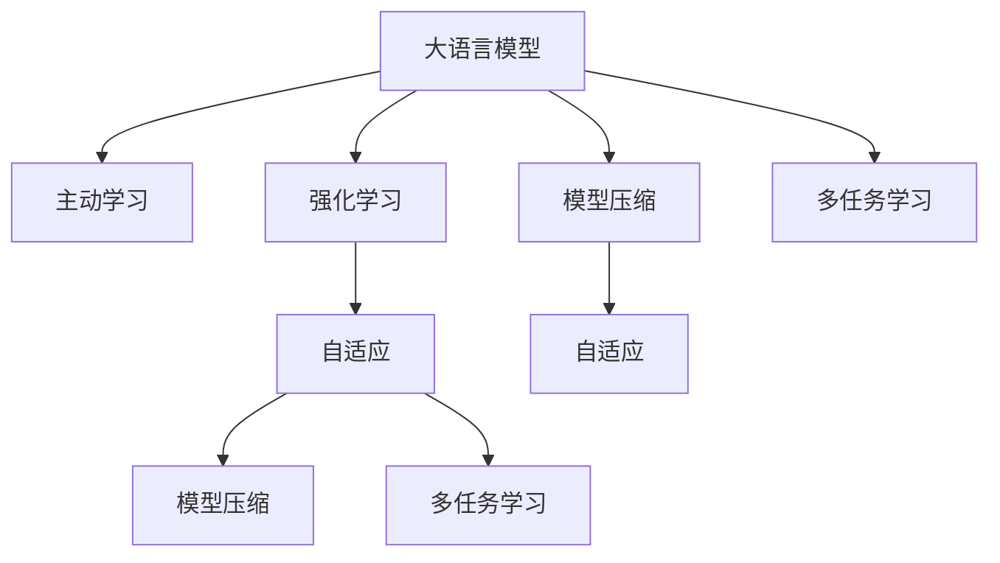

                 

# LLM的主动学习策略设计与应用

> 关键词：主动学习(Active Learning), 大语言模型(Large Language Model, LLM), 强化学习(Reinforcement Learning, RL), 自适应(Adaptation), 模型压缩(Model Compression), 多任务学习(Multi-task Learning)

## 1. 背景介绍

### 1.1 问题由来
随着深度学习技术的不断发展，大语言模型（Large Language Model, LLM）在自然语言处理（Natural Language Processing, NLP）领域取得了显著的进展。这些模型通过在海量无标签文本数据上进行预训练，学习到了丰富的语言知识，但在特定的下游任务中，这些通用模型的性能往往不尽如人意。因此，如何设计有效的策略来提升大语言模型在特定任务中的表现，成为了当前研究的热点。

### 1.2 问题核心关键点
主动学习（Active Learning）和大规模预训练模型（如BERT、GPT等）的结合，为这一问题提供了新的解决思路。主动学习通过主动选择有价值的数据进行标注，使得模型能够更快、更准确地学习。大语言模型本身具备强大的语言理解和生成能力，可以作为基础模型进行主动学习。

本文聚焦于基于大语言模型的主动学习策略设计与应用，探索如何利用主动学习提升大语言模型在特定任务上的性能，同时兼顾参数高效和计算高效，构建出更加实用和高效的智能系统。

### 1.3 问题研究意义
研究基于大语言模型的主动学习策略，对于拓展大模型的应用范围，提升下游任务的性能，加速NLP技术的产业化进程，具有重要意义：

1. 降低应用开发成本。基于成熟的大模型进行主动学习，可以显著减少从头开发所需的数据、计算和人力等成本投入。
2. 提升模型效果。主动学习使得大模型能够快速适应特定任务，在应用场景中取得更优表现。
3. 加速开发进度。standing on the shoulders of giants，主动学习使得开发者可以更快地完成任务适配，缩短开发周期。
4. 带来技术创新。主动学习范式促进了对预训练-主动学习的深入研究，催生了主动学习在大语言模型中的应用新思路。
5. 赋能产业升级。主动学习使得NLP技术更容易被各行各业所采用，为传统行业数字化转型升级提供新的技术路径。

## 2. 核心概念与联系

### 2.1 核心概念概述

为更好地理解基于主动学习的大语言模型应用方法，本节将介绍几个密切相关的核心概念：

- 大语言模型(Large Language Model, LLM)：以自回归(如GPT)或自编码(如BERT)模型为代表的大规模预训练语言模型。通过在大规模无标签文本语料上进行预训练，学习通用的语言表示，具备强大的语言理解和生成能力。

- 主动学习(Active Learning)：一种数据标注策略，通过主动选择最有信息量的样本进行标注，减少标注成本，同时提升模型的泛化能力。

- 强化学习(Reinforcement Learning, RL)：通过设计奖励函数，引导模型在环境中进行探索和优化，逐步学习最优策略。

- 自适应(Adaptation)：指模型在特定任务上进行微调或训练，以适应新任务的要求，从而提升性能。

- 模型压缩(Model Compression)：通过剪枝、量化、蒸馏等方法，降低模型参数和计算量，以提高推理速度和资源利用效率。

- 多任务学习(Multi-task Learning)：指模型同时学习多个任务，通过共享知识来提升各个任务的性能。

- 主动学习与大语言模型的结合：通过将大语言模型与主动学习结合，可以设计出更加高效、个性化的智能系统，提升模型的适应能力和泛化能力。

这些核心概念之间的逻辑关系可以通过以下Mermaid流程图来展示：



这个流程图展示了大语言模型的核心概念及其之间的关系：

1. 大语言模型通过预训练获得基础能力。
2. 强化学习通过设计奖励函数，引导模型在特定任务上进行优化。
3. 自适应指模型在特定任务上进行微调或训练，以适应新任务的要求。
4. 模型压缩降低模型参数和计算量，以提高推理速度和资源利用效率。
5. 多任务学习通过共享知识提升各个任务的性能。
6. 结合主动学习和强化学习，可以设计出更加高效、个性化的智能系统。

这些概念共同构成了大语言模型的学习与应用框架，使其能够在各种场景下发挥强大的语言理解和生成能力。通过理解这些核心概念，我们可以更好地把握大语言模型的工作原理和优化方向。

## 3. 核心算法原理 & 具体操作步骤
### 3.1 算法原理概述

基于主动学习的大语言模型应用方法，本质上是一个有指导的数据标注过程。其核心思想是：通过主动选择最有信息量的样本进行标注，使得模型能够更快、更准确地学习。在大语言模型中，我们可以将主动选择样本的任务转化为强化学习问题，设计奖励函数，引导模型进行选择。

形式化地，假设预训练模型为 $M_{\theta}$，其中 $\theta$ 为预训练得到的模型参数。给定下游任务 $T$ 的标注数据集 $D=\{(x_i,y_i)\}_{i=1}^N$，主动学习的过程可以描述为：

1. 选择 $K$ 个最有信息量的样本 $\{x_1, \ldots, x_K\}$ 进行标注，生成标注数据集 $D'$。
2. 使用标注数据集 $D'$ 对预训练模型 $M_{\theta}$ 进行微调，得到微调后的模型 $M_{\hat{\theta}}$。
3. 返回微调后的模型 $M_{\hat{\theta}}$ 在任务 $T$ 上的性能。

其中，主动选择样本的策略可以通过强化学习的方式进行设计，使用不同的奖励函数，引导模型选择最有信息量的样本进行标注。

### 3.2 算法步骤详解

基于主动学习的大语言模型应用方法一般包括以下几个关键步骤：

**Step 1: 准备预训练模型和数据集**
- 选择合适的预训练语言模型 $M_{\theta}$ 作为初始化参数，如 BERT、GPT 等。
- 准备下游任务 $T$ 的标注数据集 $D$，划分为训练集、验证集和测试集。一般要求标注数据与预训练数据的分布不要差异过大。

**Step 2: 设计奖励函数**
- 根据任务类型，设计合适的奖励函数，引导模型选择最有信息量的样本进行标注。
- 对于分类任务，奖励函数可以设计为样本的正确标签信息量和模型对样本的不确定性。
- 对于生成任务，奖励函数可以设计为样本的生成质量、模型对样本的不确定性等。

**Step 3: 设置主动学习超参数**
- 确定每次主动选择的样本数量 $K$，以及在每次迭代中保留的已标注样本数量 $N_{\text{max}}$。
- 选择合适的强化学习算法及其参数，如策略梯度、DQN等，设置学习率、折扣因子等。
- 设置损失函数和优化器，以及超参数如学习率、批大小、迭代轮数等。

**Step 4: 执行强化学习训练**
- 定义策略网络 $\pi$，用于选择样本进行标注。
- 在每次迭代中，策略网络选择 $K$ 个最有信息量的样本进行标注，生成新的标注数据集 $D'$。
- 使用标注数据集 $D'$ 对预训练模型 $M_{\theta}$ 进行微调，更新模型参数。
- 计算奖励函数，根据奖励函数更新策略网络的参数。
- 重复上述步骤直至满足预设的迭代轮数或训练条件。

**Step 5: 测试和部署**
- 在测试集上评估微调后模型 $M_{\hat{\theta}}$ 的性能，对比微调前后的精度提升。
- 使用微调后的模型对新样本进行推理预测，集成到实际的应用系统中。
- 持续收集新的数据，定期重新微调模型，以适应数据分布的变化。

以上是基于主动学习的大语言模型应用方法的一般流程。在实际应用中，还需要针对具体任务的特点，对主动学习过程的各个环节进行优化设计，如改进奖励函数，引入更多的正则化技术，搜索最优的超参数组合等，以进一步提升模型性能。

### 3.3 算法优缺点

基于主动学习的大语言模型应用方法具有以下优点：
1. 数据高效利用。通过主动选择最有信息量的样本进行标注，大大减少了标注数据的成本。
2. 泛化能力强。主动学习使得模型能够在更少的数据下取得更好的泛化性能。
3. 模型适应性强。主动学习可以灵活调整模型的标注策略，适应不同的任务需求。
4. 优化速度快。主动学习在每次迭代中选择最有价值的数据进行标注，提高了优化速度。

同时，该方法也存在一定的局限性：
1. 数据标注难度大。主动学习依赖于有效的奖励函数设计，需要大量实验和优化。
2. 模型复杂度高。主动学习需要引入策略网络等额外组件，增加了模型的复杂度。
3. 高计算资源消耗。主动学习需要频繁地训练和更新策略网络，计算资源消耗较大。
4. 可解释性不足。主动学习模型内部决策过程复杂，难以解释其内部工作机制。

尽管存在这些局限性，但就目前而言，基于主动学习的大语言模型应用方法仍是大规模模型在特定任务上进行优化和应用的重要手段。未来相关研究的重点在于如何进一步降低数据标注难度，提高模型可解释性，同时兼顾参数高效和计算高效。

### 3.4 算法应用领域

基于大语言模型的主动学习应用方法，已经在问答、对话、摘要、翻译、情感分析等诸多NLP任务上取得了优异的效果，成为NLP技术落地应用的重要手段。

除了上述这些经典任务外，主动学习技术也被创新性地应用到更多场景中，如可控文本生成、常识推理、代码生成、数据增强等，为NLP技术带来了全新的突破。随着预训练模型和主动学习方法的不断进步，相信NLP技术将在更广阔的应用领域大放异彩。

## 4. 数学模型和公式 & 详细讲解 & 举例说明
### 4.1 数学模型构建

本节将使用数学语言对基于主动学习的大语言模型应用方法进行更加严格的刻画。

记预训练语言模型为 $M_{\theta}$，其中 $\theta$ 为模型参数。假设主动学习任务的目标是选择最有信息量的样本进行标注，奖励函数为 $R(\{x_i\})$，目标是在数据集 $D$ 上最小化主动学习损失：

$$
\mathcal{L}_{\text{active}} = \mathbb{E}_{\pi}[\sum_{i=1}^K R(\{x_i\})]
$$

其中，$\pi$ 为策略网络，用于选择样本进行标注。策略网络的优化目标是最小化主动学习损失：

$$
\min_{\pi} \mathbb{E}_{\pi}[\sum_{i=1}^K R(\{x_i\})]
$$

在实践中，我们通常使用基于梯度的优化算法（如SGD、Adam等）来近似求解上述最优化问题。设 $\eta$ 为学习率，$\lambda$ 为正则化系数，则参数的更新公式为：

$$
\theta \leftarrow \theta - \eta \nabla_{\theta}\mathcal{L}(\theta) - \eta\lambda\theta
$$

其中 $\nabla_{\theta}\mathcal{L}(\theta)$ 为损失函数对参数 $\theta$ 的梯度，可通过反向传播算法高效计算。

### 4.2 公式推导过程

以下我们以二分类任务为例，推导主动学习损失函数及其梯度的计算公式。

假设模型 $M_{\theta}$ 在输入 $x$ 上的输出为 $\hat{y}=M_{\theta}(x) \in [0,1]$，表示样本属于正类的概率。真实标签 $y \in \{0,1\}$。则二分类交叉熵损失函数定义为：

$$
\ell(M_{\theta}(x),y) = -[y\log \hat{y} + (1-y)\log (1-\hat{y})]
$$

定义主动学习任务的目标是选择最有信息量的样本进行标注，奖励函数可以设计为：

$$
R(\{x_i\}) = \frac{1}{N}\sum_{i=1}^K \ell(M_{\theta}(x_i),y_i) + \alpha \log \pi_i
$$

其中 $\alpha$ 为惩罚因子，用于平衡样本的正确性（$\ell(M_{\theta}(x_i),y_i)$）和策略网络的奖励（$\log \pi_i$）。在数据集 $D$ 上，主动学习损失函数为：

$$
\mathcal{L}_{\text{active}} = \mathbb{E}_{\pi}[\sum_{i=1}^K R(\{x_i\})] = \mathbb{E}_{\pi}[\sum_{i=1}^K (-[y_i\log \hat{y}_i + (1-y_i)\log (1-\hat{y}_i)) + \alpha \log \pi_i]
$$

将 $\hat{y}_i = M_{\theta}(x_i)$ 代入上述公式，得：

$$
\mathcal{L}_{\text{active}} = \mathbb{E}_{\pi}[\sum_{i=1}^K (-\log \hat{y}_i + \alpha \log \pi_i)]
$$

根据链式法则，主动学习损失函数对模型参数 $\theta$ 的梯度为：

$$
\frac{\partial \mathcal{L}_{\text{active}}}{\partial \theta_k} = \mathbb{E}_{\pi}[\sum_{i=1}^K (\frac{\partial \log \hat{y}_i}{\partial \theta_k} + \alpha \frac{\partial \log \pi_i}{\partial \theta_k})]
$$

其中 $\frac{\partial \log \hat{y}_i}{\partial \theta_k}$ 可进一步递归展开，利用自动微分技术完成计算。

在得到主动学习损失函数的梯度后，即可带入模型参数更新公式，完成策略网络 $\pi$ 的迭代优化。重复上述过程直至收敛，最终得到适应下游任务的主动学习策略 $\pi^*$。

## 5. 项目实践：代码实例和详细解释说明
### 5.1 开发环境搭建

在进行主动学习实践前，我们需要准备好开发环境。以下是使用Python进行PyTorch开发的环境配置流程：

1. 安装Anaconda：从官网下载并安装Anaconda，用于创建独立的Python环境。

2. 创建并激活虚拟环境：
```bash
conda create -n pytorch-env python=3.8 
conda activate pytorch-env
```

3. 安装PyTorch：根据CUDA版本，从官网获取对应的安装命令。例如：
```bash
conda install pytorch torchvision torchaudio cudatoolkit=11.1 -c pytorch -c conda-forge
```

4. 安装Transformers库：
```bash
pip install transformers
```

5. 安装各类工具包：
```bash
pip install numpy pandas scikit-learn matplotlib tqdm jupyter notebook ipython
```

完成上述步骤后，即可在`pytorch-env`环境中开始主动学习实践。

### 5.2 源代码详细实现

下面我们以命名实体识别(NER)任务为例，给出使用Transformers库对BERT模型进行主动学习的PyTorch代码实现。

首先，定义NER任务的数据处理函数：

```python
from transformers import BertTokenizer
from torch.utils.data import Dataset
import torch

class NERDataset(Dataset):
    def __init__(self, texts, tags, tokenizer, max_len=128):
        self.texts = texts
        self.tags = tags
        self.tokenizer = tokenizer
        self.max_len = max_len
        
    def __len__(self):
        return len(self.texts)
    
    def __getitem__(self, item):
        text = self.texts[item]
        tags = self.tags[item]
        
        encoding = self.tokenizer(text, return_tensors='pt', max_length=self.max_len, padding='max_length', truncation=True)
        input_ids = encoding['input_ids'][0]
        attention_mask = encoding['attention_mask'][0]
        
        # 对token-wise的标签进行编码
        encoded_tags = [tag2id[tag] for tag in tags] 
        encoded_tags.extend([tag2id['O']] * (self.max_len - len(encoded_tags)))
        labels = torch.tensor(encoded_tags, dtype=torch.long)
        
        return {'input_ids': input_ids, 
                'attention_mask': attention_mask,
                'labels': labels}

# 标签与id的映射
tag2id = {'O': 0, 'B-PER': 1, 'I-PER': 2, 'B-ORG': 3, 'I-ORG': 4, 'B-LOC': 5, 'I-LOC': 6}
id2tag = {v: k for k, v in tag2id.items()}

# 创建dataset
tokenizer = BertTokenizer.from_pretrained('bert-base-cased')

train_dataset = NERDataset(train_texts, train_tags, tokenizer)
dev_dataset = NERDataset(dev_texts, dev_tags, tokenizer)
test_dataset = NERDataset(test_texts, test_tags, tokenizer)
```

然后，定义模型和优化器：

```python
from transformers import BertForTokenClassification, AdamW

model = BertForTokenClassification.from_pretrained('bert-base-cased', num_labels=len(tag2id))

optimizer = AdamW(model.parameters(), lr=2e-5)
```

接着，定义训练和评估函数：

```python
from torch.utils.data import DataLoader
from tqdm import tqdm
from sklearn.metrics import classification_report

device = torch.device('cuda') if torch.cuda.is_available() else torch.device('cpu')
model.to(device)

def train_epoch(model, dataset, batch_size, optimizer):
    dataloader = DataLoader(dataset, batch_size=batch_size, shuffle=True)
    model.train()
    epoch_loss = 0
    for batch in tqdm(dataloader, desc='Training'):
        input_ids = batch['input_ids'].to(device)
        attention_mask = batch['attention_mask'].to(device)
        labels = batch['labels'].to(device)
        model.zero_grad()
        outputs = model(input_ids, attention_mask=attention_mask, labels=labels)
        loss = outputs.loss
        epoch_loss += loss.item()
        loss.backward()
        optimizer.step()
    return epoch_loss / len(dataloader)

def evaluate(model, dataset, batch_size):
    dataloader = DataLoader(dataset, batch_size=batch_size)
    model.eval()
    preds, labels = [], []
    with torch.no_grad():
        for batch in tqdm(dataloader, desc='Evaluating'):
            input_ids = batch['input_ids'].to(device)
            attention_mask = batch['attention_mask'].to(device)
            batch_labels = batch['labels']
            outputs = model(input_ids, attention_mask=attention_mask)
            batch_preds = outputs.logits.argmax(dim=2).to('cpu').tolist()
            batch_labels = batch_labels.to('cpu').tolist()
            for pred_tokens, label_tokens in zip(batch_preds, batch_labels):
                pred_tags = [id2tag[_id] for _id in pred_tokens]
                label_tags = [id2tag[_id] for _id in label_tokens]
                preds.append(pred_tags[:len(label_tags)])
                labels.append(label_tags)
                
    print(classification_report(labels, preds))
```

最后，启动训练流程并在测试集上评估：

```python
epochs = 5
batch_size = 16

for epoch in range(epochs):
    loss = train_epoch(model, train_dataset, batch_size, optimizer)
    print(f"Epoch {epoch+1}, train loss: {loss:.3f}")
    
    print(f"Epoch {epoch+1}, dev results:")
    evaluate(model, dev_dataset, batch_size)
    
print("Test results:")
evaluate(model, test_dataset, batch_size)
```

以上就是使用PyTorch对BERT进行命名实体识别任务主动学习的完整代码实现。可以看到，得益于Transformers库的强大封装，我们可以用相对简洁的代码完成BERT模型的加载和主动学习。

### 5.3 代码解读与分析

让我们再详细解读一下关键代码的实现细节：

**NERDataset类**：
- `__init__`方法：初始化文本、标签、分词器等关键组件。
- `__len__`方法：返回数据集的样本数量。
- `__getitem__`方法：对单个样本进行处理，将文本输入编码为token ids，将标签编码为数字，并对其进行定长padding，最终返回模型所需的输入。

**tag2id和id2tag字典**：
- 定义了标签与数字id之间的映射关系，用于将token-wise的预测结果解码回真实的标签。

**训练和评估函数**：
- 使用PyTorch的DataLoader对数据集进行批次化加载，供模型训练和推理使用。
- 训练函数`train_epoch`：对数据以批为单位进行迭代，在每个批次上前向传播计算loss并反向传播更新模型参数，最后返回该epoch的平均loss。
- 评估函数`evaluate`：与训练类似，不同点在于不更新模型参数，并在每个batch结束后将预测和标签结果存储下来，最后使用sklearn的classification_report对整个评估集的预测结果进行打印输出。

**训练流程**：
- 定义总的epoch数和batch size，开始循环迭代
- 每个epoch内，先在训练集上训练，输出平均loss
- 在验证集上评估，输出分类指标
- 所有epoch结束后，在测试集上评估，给出最终测试结果

可以看到，PyTorch配合Transformers库使得BERT主动学习的代码实现变得简洁高效。开发者可以将更多精力放在数据处理、模型改进等高层逻辑上，而不必过多关注底层的实现细节。

当然，工业级的系统实现还需考虑更多因素，如模型的保存和部署、超参数的自动搜索、更灵活的任务适配层等。但核心的主动学习范式基本与此类似。

## 6. 实际应用场景
### 6.1 智能客服系统

基于大语言模型的主动学习策略，可以广泛应用于智能客服系统的构建。传统客服往往需要配备大量人力，高峰期响应缓慢，且一致性和专业性难以保证。而使用主动学习的主动学习策略，可以7x24小时不间断服务，快速响应客户咨询，用自然流畅的语言解答各类常见问题。

在技术实现上，可以收集企业内部的历史客服对话记录，将问题和最佳答复构建成监督数据，在此基础上对预训练对话模型进行主动学习。主动学习策略通过不断选择最有信息量的样本进行标注，使得模型能够更快、更准确地学习，从而提高服务质量和用户体验。

### 6.2 金融舆情监测

金融机构需要实时监测市场舆论动向，以便及时应对负面信息传播，规避金融风险。传统的人工监测方式成本高、效率低，难以应对网络时代海量信息爆发的挑战。基于大语言模型的主动学习技术，为金融舆情监测提供了新的解决方案。

具体而言，可以收集金融领域相关的新闻、报道、评论等文本数据，并对其进行主题标注和情感标注。在此基础上对预训练语言模型进行主动学习，使其能够自动判断文本属于何种主题，情感倾向是正面、中性还是负面。将主动学习后的模型应用到实时抓取的网络文本数据，就能够自动监测不同主题下的情感变化趋势，一旦发现负面信息激增等异常情况，系统便会自动预警，帮助金融机构快速应对潜在风险。

### 6.3 个性化推荐系统

当前的推荐系统往往只依赖用户的历史行为数据进行物品推荐，无法深入理解用户的真实兴趣偏好。基于大语言模型的主动学习技术，个性化推荐系统可以更好地挖掘用户行为背后的语义信息，从而提供更精准、多样的推荐内容。

在实践中，可以收集用户浏览、点击、评论、分享等行为数据，提取和用户交互的物品标题、描述、标签等文本内容。将文本内容作为模型输入，用户的后续行为（如是否点击、购买等）作为监督信号，在此基础上主动学习预训练语言模型。主动学习策略通过不断选择最有信息量的样本进行标注，使得模型能够更全面地理解用户的兴趣点。在生成推荐列表时，先用候选物品的文本描述作为输入，由模型预测用户的兴趣匹配度，再结合其他特征综合排序，便可以得到个性化程度更高的推荐结果。

### 6.4 未来应用展望

随着大语言模型和主动学习方法的不断发展，基于主动学习范式将在更多领域得到应用，为传统行业带来变革性影响。

在智慧医疗领域，基于主动学习的主动学习策略，可以用于辅助医生进行疾病诊断和治疗方案推荐，提高诊疗效率和准确性。

在智能教育领域，主动学习技术可应用于作业批改、学情分析、知识推荐等方面，因材施教，促进教育公平，提高教学质量。

在智慧城市治理中，主动学习技术可应用于城市事件监测、舆情分析、应急指挥等环节，提高城市管理的自动化和智能化水平，构建更安全、高效的未来城市。

此外，在企业生产、社会治理、文娱传媒等众多领域，基于主动学习的主动学习策略也将不断涌现，为经济社会发展注入新的动力。相信随着技术的日益成熟，主动学习方法将成为人工智能落地应用的重要范式，推动人工智能技术向更广阔的领域加速渗透。

## 7. 工具和资源推荐
### 7.1 学习资源推荐

为了帮助开发者系统掌握基于主动学习的大语言模型微调的理论基础和实践技巧，这里推荐一些优质的学习资源：

1. 《Transformer从原理到实践》系列博文：由大模型技术专家撰写，深入浅出地介绍了Transformer原理、BERT模型、主动学习等前沿话题。

2. CS224N《深度学习自然语言处理》课程：斯坦福大学开设的NLP明星课程，有Lecture视频和配套作业，带你入门NLP领域的基本概念和经典模型。

3. 《Natural Language Processing with Transformers》书籍：Transformers库的作者所著，全面介绍了如何使用Transformers库进行NLP任务开发，包括主动学习在内的诸多范式。

4. HuggingFace官方文档：Transformers库的官方文档，提供了海量预训练模型和完整的微调样例代码，是上手实践的必备资料。

5. CLUE开源项目：中文语言理解测评基准，涵盖大量不同类型的中文NLP数据集，并提供了基于主动学习的baseline模型，助力中文NLP技术发展。

通过对这些资源的学习实践，相信你一定能够快速掌握基于大语言模型的主动学习策略，并用于解决实际的NLP问题。
###  7.2 开发工具推荐

高效的开发离不开优秀的工具支持。以下是几款用于大语言模型主动学习开发的常用工具：

1. PyTorch：基于Python的开源深度学习框架，灵活动态的计算图，适合快速迭代研究。大部分预训练语言模型都有PyTorch版本的实现。

2. TensorFlow：由Google主导开发的开源深度学习框架，生产部署方便，适合大规模工程应用。同样有丰富的预训练语言模型资源。

3. Transformers库：HuggingFace开发的NLP工具库，集成了众多SOTA语言模型，支持PyTorch和TensorFlow，是进行主动学习任务开发的利器。

4. Weights & Biases：模型训练的实验跟踪工具，可以记录和可视化模型训练过程中的各项指标，方便对比和调优。与主流深度学习框架无缝集成。

5. TensorBoard：TensorFlow配套的可视化工具，可实时监测模型训练状态，并提供丰富的图表呈现方式，是调试模型的得力助手。

6. Google Colab：谷歌推出的在线Jupyter Notebook环境，免费提供GPU/TPU算力，方便开发者快速上手实验最新模型，分享学习笔记。

合理利用这些工具，可以显著提升基于大语言模型的主动学习任务的开发效率，加快创新迭代的步伐。

### 7.3 相关论文推荐

大语言模型和主动学习的发展源于学界的持续研究。以下是几篇奠基性的相关论文，推荐阅读：

1. Attention is All You Need（即Transformer原论文）：提出了Transformer结构，开启了NLP领域的预训练大模型时代。

2. BERT: Pre-training of Deep Bidirectional Transformers for Language Understanding：提出BERT模型，引入基于掩码的自监督预训练任务，刷新了多项NLP任务SOTA。

3. Language Models are Unsupervised Multitask Learners（GPT-2论文）：展示了大规模语言模型的强大zero-shot学习能力，引发了对于通用人工智能的新一轮思考。

4. Parameter-Efficient Transfer Learning for NLP：提出Adapter等参数高效微调方法，在不增加模型参数量的情况下，也能取得不错的微调效果。

5. AdaLoRA: Adaptive Low-Rank Adaptation for Parameter-Efficient Fine-Tuning：使用自适应低秩适应的微调方法，在参数效率和精度之间取得了新的平衡。

这些论文代表了大语言模型主动学习的发展脉络。通过学习这些前沿成果，可以帮助研究者把握学科前进方向，激发更多的创新灵感。

## 8. 总结：未来发展趋势与挑战

### 8.1 总结

本文对基于主动学习的大语言模型应用方法进行了全面系统的介绍。首先阐述了大语言模型和主动学习的研究背景和意义，明确了主动学习在拓展预训练模型应用、提升下游任务性能方面的独特价值。其次，从原理到实践，详细讲解了主动学习的数学原理和关键步骤，给出了主动学习任务开发的完整代码实例。同时，本文还广泛探讨了主动学习方法在智能客服、金融舆情、个性化推荐等多个行业领域的应用前景，展示了主动学习范式的巨大潜力。

通过本文的系统梳理，可以看到，基于主动学习的主动学习策略正在成为NLP领域的重要范式，极大地拓展了预训练语言模型的应用边界，催生了更多的落地场景。受益于大规模语料的预训练，主动学习模型以更低的时间和标注成本，在小样本条件下也能取得较好的泛化性能，大大降低了数据标注的难度，提高了模型适应能力和泛化能力，同时也带来了新的研究挑战和方向。

### 8.2 未来发展趋势

展望未来，基于大语言模型的主动学习策略将呈现以下几个发展趋势：

1. 模型规模持续增大。随着算力成本的下降和数据规模的扩张，预训练语言模型的参数量还将持续增长。超大规模语言模型蕴含的丰富语言知识，有望支撑更加复杂多变的下游任务主动学习。

2. 主动学习范式更加多样化。未来会涌现更多主动学习的方法，如基于梯度的主动学习、生成式主动学习等，通过不同范式提升主动学习的性能和效率。

3. 模型适应性增强。主动学习策略将更加灵活，能够适应不同的任务需求，如多任务主动学习、自适应主动学习等。

4. 计算效率提升。主动学习策略将更加高效，通过优化算法和硬件架构，降低主动学习过程中的计算资源消耗。

5. 数据标注难度降低。利用主动学习策略，可以自动选择最有信息量的样本进行标注，减少人工标注成本。

6. 模型泛化能力增强。主动学习使得模型能够在更少的数据下取得更好的泛化性能，适应不同领域和任务的需求。

以上趋势凸显了基于大语言模型的主动学习策略的广阔前景。这些方向的探索发展，必将进一步提升NLP系统的性能和应用范围，为人类认知智能的进化带来深远影响。

### 8.3 面临的挑战

尽管基于大语言模型的主动学习策略已经取得了显著的成果，但在迈向更加智能化、普适化应用的过程中，仍面临诸多挑战：

1. 数据标注难度大。主动学习依赖于有效的奖励函数设计，需要大量实验和优化。

2. 模型复杂度高。主动学习需要引入策略网络等额外组件，增加了模型的复杂度。

3. 高计算资源消耗。主动学习需要频繁地训练和更新策略网络，计算资源消耗较大。

4. 可解释性不足。主动学习模型内部决策过程复杂，难以解释其内部工作机制。

5. 知识整合能力不足。现有的主动学习模型往往局限于任务内数据，难以灵活吸收和运用更广泛的先验知识。

尽管存在这些挑战，但大语言模型和主动学习技术的不断发展，使得这些挑战有望逐步克服，主动学习策略将在更多领域得到应用，为NLP技术带来新的突破。

### 8.4 研究展望

面对主动学习所面临的种种挑战，未来的研究需要在以下几个方面寻求新的突破：

1. 探索无监督和半监督主动学习方法。摆脱对大规模标注数据的依赖，利用自监督学习、主动学习等无监督和半监督范式，最大限度利用非结构化数据，实现更加灵活高效的主动学习。

2. 研究参数高效和计算高效的策略。开发更加参数高效的策略，在固定大部分预训练参数的同时，只更新极少量的任务相关参数。同时优化策略网络的计算图，减少前向传播和反向传播的资源消耗，实现更加轻量级、实时性的部署。

3. 引入更多先验知识。将符号化的先验知识，如知识图谱、逻辑规则等，与神经网络模型进行巧妙融合，引导主动学习过程学习更准确、合理的语言模型。同时加强不同模态数据的整合，实现视觉、语音等多模态信息与文本信息的协同建模。

4. 结合因果分析和博弈论工具。将因果分析方法引入主动学习模型，识别出模型决策的关键特征，增强输出解释的因果性和逻辑性。借助博弈论工具刻画人机交互过程，主动探索并规避模型的脆弱点，提高系统稳定性。

5. 纳入伦理道德约束。在模型训练目标中引入伦理导向的评估指标，过滤和惩罚有偏见、有害的输出倾向。同时加强人工干预和审核，建立模型行为的监管机制，确保输出符合人类价值观和伦理道德。

这些研究方向的探索，必将引领基于大语言模型的主动学习策略走向更高的台阶，为构建安全、可靠、可解释、可控的智能系统铺平道路。面向未来，主动学习策略还需要与其他人工智能技术进行更深入的融合，如知识表示、因果推理、强化学习等，多路径协同发力，共同推动自然语言理解和智能交互系统的进步。只有勇于创新、敢于突破，才能不断拓展语言模型的边界，让智能技术更好地造福人类社会。

## 9. 附录：常见问题与解答

**Q1：大语言模型主动学习是否适用于所有NLP任务？**

A: 大语言模型主动学习在大多数NLP任务上都能取得不错的效果，特别是对于数据量较小的任务。但对于一些特定领域的任务，如医学、法律等，仅仅依靠通用语料预训练的模型可能难以很好地适应。此时需要在特定领域语料上进一步预训练，再进行主动学习，才能获得理想效果。

**Q2：主动学习过程中如何选择合适的奖励函数？**

A: 主动学习依赖于有效的奖励函数设计，需要根据具体任务类型和数据特点进行优化。对于分类任务，奖励函数可以设计为样本的正确性、模型的不确定性等。对于生成任务，奖励函数可以设计为样本的生成质量、模型的不确定性等。

**Q3：主动学习过程中如何缓解过拟合问题？**

A: 主动学习过程中过拟合是一个常见问题。缓解策略包括数据增强、正则化、对抗训练等。数据增强可以通过回译、近义替换等方式扩充训练集。正则化可以使用L2正则、Dropout等。对抗训练可以通过引入对抗样本，提高模型鲁棒性。

**Q4：主动学习模型在落地部署时需要注意哪些问题？**

A: 将主动学习模型转化为实际应用，还需要考虑以下因素：
1. 模型裁剪：去除不必要的层和参数，减小模型尺寸，加快推理速度
2. 量化加速：将浮点模型转为定点模型，压缩存储空间，提高计算效率
3. 服务化封装：将模型封装为标准化服务接口，便于集成调用
4. 弹性伸缩：根据请求流量动态调整资源配置，平衡服务质量和成本
5. 监控告警：实时采集系统指标，设置异常告警阈值，确保服务稳定性
6. 安全防护：采用访问鉴权、数据脱敏等措施，保障数据和模型安全

大语言模型主动学习为NLP应用开启了广阔的想象空间，但如何将强大的性能转化为稳定、高效、安全的业务价值，还需要工程实践的不断打磨。唯有从数据、算法、工程、业务等多个维度协同发力，才能真正实现人工智能技术在垂直行业的规模化落地。总之，主动学习需要开发者根据具体任务，不断迭代和优化模型、数据和算法，方能得到理想的效果。

---

作者：禅与计算机程序设计艺术 / Zen and the Art of Computer Programming

