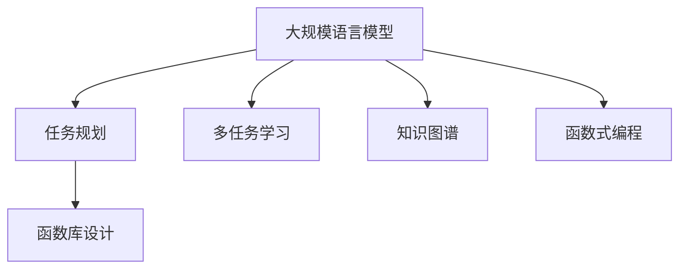

                 

# LLM的图灵完备之路:从任务规划到函数库

> 关键词：LLM,图灵完备,任务规划,函数库,深度学习,自然语言处理(NLP),AI架构

## 1. 背景介绍

### 1.1 问题由来
在大规模深度学习模型训练与推理的过程中，为了实现其图灵完备性（Turing completeness），即能够执行任何计算任务，这些模型通常需要进行复杂的多任务学习与训练。这些任务可能涵盖语义理解、模式识别、推理与决策等多个领域。因此，如何有效规划和管理这些任务，以确保模型的完备性与鲁棒性，成为当前深度学习领域的重要研究方向。

### 1.2 问题核心关键点
在大型深度学习模型（如大规模语言模型（LLMs））中，任务规划与函数库的设计至关重要。这一过程涉及从理解任务的本质、设计合适的学习目标到高效实现任务处理的功能，其核心关键点包括：
1. 任务的定义与分解
2. 任务间的关系建模
3. 任务执行的优化策略
4. 知识与规则的融合
5. 跨任务学习的反馈机制
6. 模型的可扩展性与兼容性

### 1.3 问题研究意义
图灵完备性是深度学习模型实现通用人工智能（AGI）的关键。通过任务规划与函数库的设计，可以确保模型在多种任务与场景下具备良好的适应性与泛化能力。在自然语言处理（NLP）、计算机视觉、语音识别等领域的实际应用中，合理的任务规划与函数库能够提升模型的性能与效率，支持更广泛的应用场景。

## 2. 核心概念与联系

### 2.1 核心概念概述

为更好地理解任务规划与函数库在大规模深度学习模型中的应用，本节将介绍几个密切相关的核心概念：

- 大规模语言模型（Large Language Model, LLM）：指能够处理自然语言输入并输出自然语言结果的深度学习模型，如GPT、BERT等。
- 图灵完备性（Turing completeness）：指模型能够执行任何可计算任务的能力。
- 任务规划（Task Planning）：指对模型需要执行的具体任务进行定义、分解与组织的过程，以确保模型能够高效地处理这些任务。
- 函数库（Function Library）：指模型中预定义的函数集合，用于处理特定类型的任务。
- 多任务学习（Multi-task Learning）：指模型在多个相关任务上进行联合训练，以提升模型在各个任务上的性能。
- 知识图谱（Knowledge Graph）：指用于存储和推理知识与规则的数据结构，可用于增强模型的推理能力。
- 函数式编程（Functional Programming）：一种编程范式，强调函数的组合与纯粹性，与任务规划与函数库的设计理念高度契合。

这些概念之间的逻辑关系可以通过以下Mermaid流程图来展示：



这个流程图展示了大规模深度学习模型中的核心概念及其之间的关系：

1. 大规模语言模型通过任务规划与函数库设计获得完备的任务处理能力。
2. 任务规划对具体任务进行定义、分解与组织，确保模型能够高效地处理这些任务。
3. 函数库提供预定义的函数集合，用于处理特定类型的任务。
4. 多任务学习提升模型在各个任务上的性能，通过联合训练获得更强的泛化能力。
5. 知识图谱增强模型的推理能力，使其能够处理更加复杂的任务。
6. 函数式编程强调函数的组合与纯粹性，与任务规划与函数库的设计理念高度契合。

这些概念共同构成了大规模深度学习模型的学习与推理框架，使其能够在各种任务与场景下发挥强大的处理能力。通过理解这些核心概念，我们可以更好地把握模型的设计与优化方向。

## 3. 核心算法原理 & 具体操作步骤
### 3.1 算法原理概述

在实现大规模深度学习模型的图灵完备性过程中，任务规划与函数库设计是关键步骤。其核心算法原理可以概括为以下几个方面：

- **任务定义与分解**：将复杂的任务进行细化，并分解为多个子任务，每个子任务都对应模型中特定的函数或模块。
- **函数库设计**：构建一个包含多种功能的函数库，每个函数都负责处理一种或多种特定类型的任务。
- **任务间关系建模**：通过函数之间的组合与交互，建立任务间的关系模型，确保模型能够正确执行复杂的任务链。
- **知识与规则融合**：将知识图谱、规则库等先验知识与模型函数进行融合，提升模型的推理与决策能力。
- **多任务学习优化**：通过联合训练，优化模型在多个任务上的性能，提升模型的泛化能力与效率。

### 3.2 算法步骤详解

实现大规模深度学习模型的图灵完备性，通常涉及以下关键步骤：

**Step 1: 任务定义与分解**
- 根据应用需求，定义模型需要执行的任务。例如，在自然语言处理中，任务可能包括文本分类、命名实体识别、机器翻译等。
- 将每个任务分解为更细粒度的子任务，并确定每个子任务的输入与输出格式。

**Step 2: 函数库设计**
- 设计一组函数，每个函数负责处理一种或多种特定类型的任务。例如，一个文本分类函数可以接收文本输入，输出分类标签。
- 确定每个函数的处理逻辑与实现细节，可以使用深度学习框架或自定义实现。
- 将函数按任务类型进行组织，形成功能丰富的函数库。

**Step 3: 任务间关系建模**
- 分析任务间的关系，确定哪些函数需要组合与交互。例如，在机器翻译中，需要定义源语言编码、目标语言解码等函数。
- 设计任务间的关系模型，例如函数调用的顺序、参数传递方式等。
- 在实际应用中，可能需要通过配置文件或参数传递来动态调整任务间的交互方式。

**Step 4: 知识与规则融合**
- 将知识图谱、规则库等先验知识与函数库进行融合。例如，通过查询知识图谱获取实体间的关系，用于改进函数库中的关系模型。
- 设计规则库，用于指导函数的执行逻辑，确保模型的决策符合特定规范与约束。
- 在函数库中引入控制流机制，根据规则库动态调整函数执行路径。

**Step 5: 多任务学习优化**
- 设计多任务学习框架，将多个任务共同优化。例如，在联合训练中，可以同时训练多个函数，提升模型在多个任务上的性能。
- 使用共享参数或联合损失函数，提升模型在各个任务间的泛化能力。
- 定期评估模型的性能，调整函数库中的参数与关系模型，优化模型的图灵完备性。

### 3.3 算法优缺点

大规模深度学习模型的任务规划与函数库设计具有以下优点：
1. 高效处理复杂任务：通过任务分解与函数库设计，能够高效处理复杂任务，提升模型的图灵完备性。
2. 提升模型泛化能力：通过多任务学习与知识融合，提升模型在各个任务上的泛化能力与效率。
3. 提高模型可解释性：通过任务间关系建模与规则库设计，提高模型的可解释性与透明性。
4. 灵活扩展模型功能：通过函数库设计，可以灵活扩展模型功能，适应不同的应用场景。

同时，该方法也存在一些局限性：
1. 任务分解难度大：复杂任务需要进行细致的分解，这可能涉及大量的前期工作。
2. 函数库设计复杂：函数库的设计需要考虑多个任务与交互关系，设计复杂度高。
3. 知识融合难度大：先验知识的融合可能需要复杂的逻辑设计与规则处理。
4. 多任务学习困难：多任务学习的优化需要大量的数据与计算资源。
5. 可扩展性限制：大规模函数库的设计与管理可能面临扩展性限制。

尽管存在这些局限性，但就目前而言，任务规划与函数库设计仍然是大规模深度学习模型实现图灵完备性的主流方法。未来相关研究的重点在于如何进一步优化任务规划与函数库设计，降低其复杂度，提升模型性能与可扩展性。

### 3.4 算法应用领域

大规模深度学习模型的任务规划与函数库设计，在多个领域中得到了广泛的应用，例如：

- 自然语言处理（NLP）：如文本分类、命名实体识别、机器翻译等任务。通过任务规划与函数库设计，可以提升模型的泛化能力与效率。
- 计算机视觉：如图像分类、目标检测、图像生成等任务。通过任务分解与函数库设计，可以提升模型的处理速度与精度。
- 语音识别：如语音转文字、语音生成等任务。通过任务规划与函数库设计，可以提升模型的识别准确性与实时性。
- 推荐系统：如商品推荐、内容推荐等任务。通过任务规划与函数库设计，可以提升推荐系统的个性化与多样性。
- 机器人控制：如路径规划、行为决策等任务。通过任务规划与函数库设计，可以提升机器人的智能与自主性。
- 医疗诊断：如病历分析、医学影像分析等任务。通过任务规划与函数库设计，可以提升诊断的准确性与效率。

除了上述这些经典任务外，大规模深度学习模型的任务规划与函数库设计也被创新性地应用到更多场景中，如智能家居、智能交通、智慧城市等，为各行各业带来了新的创新点。随着深度学习模型的不断发展，相信其任务规划与函数库设计将在更广阔的应用领域发挥重要作用。

## 4. 数学模型和公式 & 详细讲解 & 举例说明
### 4.1 数学模型构建

本节将使用数学语言对大规模深度学习模型中的任务规划与函数库设计过程进行更加严格的刻画。

记大规模深度学习模型为 $M$，其中包含 $N$ 个任务，每个任务对应的函数为 $f_i$，$i=1,2,\dots,N$。函数 $f_i$ 的输入为 $x_i$，输出为 $y_i$。函数 $f_i$ 的计算过程可以表示为：

$$
y_i = f_i(x_i; \theta)
$$

其中 $\theta$ 为模型参数。任务 $T_i$ 的损失函数为 $\mathcal{L}_i$，任务间的关系模型为 $R_{i,j}$，$i,j=1,2,\dots,N$。

大规模深度学习模型的优化目标是最小化总体损失函数 $\mathcal{L}_{total}$：

$$
\mathcal{L}_{total} = \sum_{i=1}^N \mathcal{L}_i
$$

在实际应用中，通常使用基于梯度的优化算法（如Adam、SGD等）来近似求解上述最优化问题。设 $\eta$ 为学习率，$\lambda$ 为正则化系数，则参数的更新公式为：

$$
\theta \leftarrow \theta - \eta \nabla_{\theta}\mathcal{L}_{total} - \eta\lambda\theta
$$

其中 $\nabla_{\theta}\mathcal{L}_{total}$ 为总体损失函数对参数 $\theta$ 的梯度，可通过反向传播算法高效计算。

### 4.2 公式推导过程

以下我们以多任务学习为例，推导基于梯度的优化算法的公式。

假设模型 $M$ 包含 $N$ 个任务，每个任务的损失函数为 $\mathcal{L}_i$，模型的总体损失函数为 $\mathcal{L}_{total}$。在每个任务上进行单任务学习时，模型参数的更新公式为：

$$
\theta_i \leftarrow \theta_i - \eta \nabla_{\theta_i}\mathcal{L}_i - \eta\lambda\theta_i
$$

其中 $\theta_i$ 为任务 $i$ 的模型参数。

在多任务学习中，将 $N$ 个任务的损失函数相加，得到总体损失函数：

$$
\mathcal{L}_{total} = \sum_{i=1}^N \mathcal{L}_i
$$

对总体损失函数求导，得到总体损失函数对参数 $\theta$ 的梯度：

$$
\nabla_{\theta}\mathcal{L}_{total} = \sum_{i=1}^N \nabla_{\theta_i}\mathcal{L}_i
$$

在多任务学习中，参数 $\theta$ 通常共享，即 $\theta_i = \theta$。因此，总体损失函数对参数 $\theta$ 的梯度可以表示为：

$$
\nabla_{\theta}\mathcal{L}_{total} = \sum_{i=1}^N \nabla_{\theta_i}\mathcal{L}_i = \nabla_{\theta}\mathcal{L}_i
$$

在多任务学习中，模型的优化目标是最小化总体损失函数 $\mathcal{L}_{total}$，因此参数的更新公式为：

$$
\theta \leftarrow \theta - \eta \nabla_{\theta}\mathcal{L}_{total} - \eta\lambda\theta
$$

将总体损失函数对参数 $\theta$ 的梯度代入上述公式，得到：

$$
\theta \leftarrow \theta - \eta \sum_{i=1}^N \nabla_{\theta_i}\mathcal{L}_i - \eta\lambda\theta
$$

这是一个基于梯度的多任务学习优化算法。通过联合训练多个任务，可以提升模型在各个任务上的性能与泛化能力。

## 5. 项目实践：代码实例和详细解释说明
### 5.1 开发环境搭建

在进行任务规划与函数库设计的实践前，我们需要准备好开发环境。以下是使用Python进行PyTorch开发的环境配置流程：

1. 安装Anaconda：从官网下载并安装Anaconda，用于创建独立的Python环境。

2. 创建并激活虚拟环境：
```bash
conda create -n pytorch-env python=3.8 
conda activate pytorch-env
```

3. 安装PyTorch：根据CUDA版本，从官网获取对应的安装命令。例如：
```bash
conda install pytorch torchvision torchaudio cudatoolkit=11.1 -c pytorch -c conda-forge
```

4. 安装Transformers库：
```bash
pip install transformers
```

5. 安装各类工具包：
```bash
pip install numpy pandas scikit-learn matplotlib tqdm jupyter notebook ipython
```

完成上述步骤后，即可在`pytorch-env`环境中开始任务规划与函数库设计的实践。

### 5.2 源代码详细实现

下面我们以文本分类任务为例，给出使用Transformers库对BERT模型进行任务规划与函数库设计的PyTorch代码实现。

首先，定义模型结构：

```python
from transformers import BertModel, BertTokenizer
from torch import nn

class BertTextClassifier(nn.Module):
    def __init__(self, hidden_size, num_classes):
        super(BertTextClassifier, self).__init__()
        self.bert = BertModel.from_pretrained('bert-base-uncased')
        self.dropout = nn.Dropout(p=0.1)
        self.classifier = nn.Linear(hidden_size, num_classes)
    
    def forward(self, x):
        input_ids = self.tokenizer.encode(x, add_special_tokens=True, return_tensors='pt')
        outputs = self.bert(input_ids)
        pooled_output = outputs.pooler_output
        pooled_output = self.dropout(pooled_output)
        logits = self.classifier(pooled_output)
        return logits
```

然后，设计训练函数：

```python
import torch
from torch.utils.data import Dataset, DataLoader

class TextDataset(Dataset):
    def __init__(self, texts, labels, tokenizer):
        self.texts = texts
        self.labels = labels
        self.tokenizer = tokenizer
    
    def __len__(self):
        return len(self.texts)
    
    def __getitem__(self, index):
        text = self.texts[index]
        label = self.labels[index]
        encoding = self.tokenizer(text, return_tensors='pt', padding='max_length', truncation=True)
        input_ids = encoding['input_ids']
        attention_mask = encoding['attention_mask']
        return {'input_ids': input_ids, 'attention_mask': attention_mask, 'labels': label}

# 创建dataset
tokenizer = BertTokenizer.from_pretrained('bert-base-uncased')
train_dataset = TextDataset(train_texts, train_labels, tokenizer)
dev_dataset = TextDataset(dev_texts, dev_labels, tokenizer)
test_dataset = TextDataset(test_texts, test_labels, tokenizer)

# 设置模型与优化器
model = BertTextClassifier(hidden_size=768, num_classes=2)
optimizer = torch.optim.Adam(model.parameters(), lr=2e-5)

# 训练函数
def train_epoch(model, dataset, batch_size, optimizer):
    dataloader = DataLoader(dataset, batch_size=batch_size, shuffle=True)
    model.train()
    epoch_loss = 0
    for batch in dataloader:
        input_ids = batch['input_ids'].to(device)
        attention_mask = batch['attention_mask'].to(device)
        labels = batch['labels'].to(device)
        model.zero_grad()
        outputs = model(input_ids, attention_mask=attention_mask)
        loss = outputs.loss
        epoch_loss += loss.item()
        loss.backward()
        optimizer.step()
    return epoch_loss / len(dataloader)

# 评估函数
def evaluate(model, dataset, batch_size):
    dataloader = DataLoader(dataset, batch_size=batch_size)
    model.eval()
    preds, labels = [], []
    with torch.no_grad():
        for batch in dataloader:
            input_ids = batch['input_ids'].to(device)
            attention_mask = batch['attention_mask'].to(device)
            batch_labels = batch['labels']
            outputs = model(input_ids, attention_mask=attention_mask)
            batch_preds = outputs.logits.argmax(dim=1).to('cpu').tolist()
            batch_labels = batch_labels.to('cpu').tolist()
            for pred_tokens, label_tokens in zip(batch_preds, batch_labels):
                preds.append(pred_tokens[:len(label_tokens)])
                labels.append(label_tokens)
                
    print(classification_report(labels, preds))
```

最后，启动训练流程并在测试集上评估：

```python
epochs = 5
batch_size = 16

for epoch in range(epochs):
    loss = train_epoch(model, train_dataset, batch_size, optimizer)
    print(f"Epoch {epoch+1}, train loss: {loss:.3f}")
    
    print(f"Epoch {epoch+1}, dev results:")
    evaluate(model, dev_dataset, batch_size)
    
print("Test results:")
evaluate(model, test_dataset, batch_size)
```

以上就是使用PyTorch对BERT模型进行文本分类任务规划与函数库设计的完整代码实现。可以看到，得益于Transformers库的强大封装，我们可以用相对简洁的代码完成模型的定义与微调。

### 5.3 代码解读与分析

让我们再详细解读一下关键代码的实现细节：

**BertTextClassifier类**：
- `__init__`方法：初始化BERT模型、Dropout层、线性分类器等组件。
- `forward`方法：定义模型的前向传播过程，计算输入文本的分类预测。

**TextDataset类**：
- `__init__`方法：初始化文本、标签、分词器等关键组件。
- `__len__`方法：返回数据集的样本数量。
- `__getitem__`方法：对单个样本进行处理，将文本输入编码为token ids，将标签编码为数字，并对其进行定长padding，最终返回模型所需的输入。

**模型定义与训练函数**：
- 使用PyTorch的DataLoader对数据集进行批次化加载，供模型训练和推理使用。
- 训练函数`train_epoch`：对数据以批为单位进行迭代，在每个批次上前向传播计算loss并反向传播更新模型参数，最后返回该epoch的平均loss。
- 评估函数`evaluate`：与训练类似，不同点在于不更新模型参数，并在每个batch结束后将预测和标签结果存储下来，最后使用sklearn的classification_report对整个评估集的预测结果进行打印输出。

**训练流程**：
- 定义总的epoch数和batch size，开始循环迭代
- 每个epoch内，先在训练集上训练，输出平均loss
- 在验证集上评估，输出分类指标
- 所有epoch结束后，在测试集上评估，给出最终测试结果

可以看到，PyTorch配合Transformers库使得BERT模型的任务规划与函数库设计的代码实现变得简洁高效。开发者可以将更多精力放在模型设计、训练优化等高层逻辑上，而不必过多关注底层的实现细节。

当然，工业级的系统实现还需考虑更多因素，如模型的保存和部署、超参数的自动搜索、更灵活的任务适配层等。但核心的任务规划与函数库设计基本与此类似。

## 6. 实际应用场景
### 6.1 智能客服系统

基于大规模深度学习模型的任务规划与函数库设计，可以广泛应用于智能客服系统的构建。传统客服往往需要配备大量人力，高峰期响应缓慢，且一致性和专业性难以保证。而使用任务规划与函数库设计的智能客服模型，可以7x24小时不间断服务，快速响应客户咨询，用自然流畅的语言解答各类常见问题。

在技术实现上，可以收集企业内部的历史客服对话记录，将问题和最佳答复构建成监督数据，在此基础上对BERT模型进行任务规划与函数库设计。设计好的模型能够自动理解用户意图，匹配最合适的答案模板进行回复。对于客户提出的新问题，还可以接入检索系统实时搜索相关内容，动态组织生成回答。如此构建的智能客服系统，能大幅提升客户咨询体验和问题解决效率。

### 6.2 金融舆情监测

金融机构需要实时监测市场舆论动向，以便及时应对负面信息传播，规避金融风险。传统的人工监测方式成本高、效率低，难以应对网络时代海量信息爆发的挑战。基于大规模深度学习模型的任务规划与函数库设计的文本分类和情感分析技术，为金融舆情监测提供了新的解决方案。

具体而言，可以收集金融领域相关的新闻、报道、评论等文本数据，并对其进行主题标注和情感标注。在此基础上对BERT模型进行任务规划与函数库设计，使其能够自动判断文本属于何种主题，情感倾向是正面、中性还是负面。将设计好的模型应用到实时抓取的网络文本数据，就能够自动监测不同主题下的情感变化趋势，一旦发现负面信息激增等异常情况，系统便会自动预警，帮助金融机构快速应对潜在风险。

### 6.3 个性化推荐系统

当前的推荐系统往往只依赖用户的历史行为数据进行物品推荐，无法深入理解用户的真实兴趣偏好。基于大规模深度学习模型的任务规划与函数库设计，个性化推荐系统可以更好地挖掘用户行为背后的语义信息，从而提供更精准、多样的推荐内容。

在实践中，可以收集用户浏览、点击、评论、分享等行为数据，提取和用户交互的物品标题、描述、标签等文本内容。将文本内容作为模型输入，用户的后续行为（如是否点击、购买等）作为监督信号，在此基础上设计BERT模型进行任务规划与函数库设计。设计好的模型能够从文本内容中准确把握用户的兴趣点。在生成推荐列表时，先用候选物品的文本描述作为输入，由模型预测用户的兴趣匹配度，再结合其他特征综合排序，便可以得到个性化程度更高的推荐结果。

### 6.4 未来应用展望

随着大规模深度学习模型和任务规划与函数库设计技术的不断发展，基于任务规划与函数库设计的模型将在更多领域得到应用，为传统行业带来变革性影响。

在智慧医疗领域，基于任务规划与函数库设计的医疗问答、病历分析、药物研发等应用将提升医疗服务的智能化水平，辅助医生诊疗，加速新药开发进程。

在智能教育领域，任务规划与函数库设计的学情分析、知识推荐等功能，因材施教，促进教育公平，提高教学质量。

在智慧城市治理中，任务规划与函数库设计的城市事件监测、舆情分析、应急指挥等环节，提高城市管理的自动化和智能化水平，构建更安全、高效的未来城市。

此外，在企业生产、社会治理、文娱传媒等众多领域，基于大规模深度学习模型的任务规划与函数库设计的应用也将不断涌现，为经济社会发展注入新的动力。相信随着技术的日益成熟，任务规划与函数库设计方法将成为人工智能落地应用的重要范式，推动人工智能技术向更广阔的领域加速渗透。

## 7. 工具和资源推荐
### 7.1 学习资源推荐

为了帮助开发者系统掌握大规模深度学习模型的任务规划与函数库设计的理论基础和实践技巧，这里推荐一些优质的学习资源：

1. 《深度学习》系列书籍：由深度学习领域的权威专家撰写，系统介绍了深度学习的基本概念、模型架构与算法优化等内容。
2. 《TensorFlow实战》系列书籍：由TensorFlow团队成员撰写，介绍了TensorFlow框架的使用方法与最佳实践，包括任务规划与函数库设计。
3. 《PyTorch实战》系列书籍：由PyTorch社区的活跃成员撰写，介绍了PyTorch框架的使用方法与任务规划与函数库设计技巧。
4. 《自然语言处理》课程：斯坦福大学开设的自然语言处理课程，系统介绍了自然语言处理的基本概念与前沿技术。
5. 《深度学习框架设计与实践》会议论文：深度学习框架设计与实践方面的顶级会议论文，介绍了任务规划与函数库设计的最新研究进展。

通过对这些资源的学习实践，相信你一定能够快速掌握大规模深度学习模型的任务规划与函数库设计的精髓，并用于解决实际的NLP问题。
###  7.2 开发工具推荐

高效的开发离不开优秀的工具支持。以下是几款用于大规模深度学习模型任务规划与函数库设计的常用工具：

1. PyTorch：基于Python的开源深度学习框架，灵活动态的计算图，适合快速迭代研究。大部分预训练语言模型都有PyTorch版本的实现。
2. TensorFlow：由Google主导开发的开源深度学习框架，生产部署方便，适合大规模工程应用。同样有丰富的预训练语言模型资源。
3. Transformers库：HuggingFace开发的NLP工具库，集成了众多SOTA语言模型，支持PyTorch和TensorFlow，是进行任务规划与函数库设计的利器。
4. Weights & Biases：模型训练的实验跟踪工具，可以记录和可视化模型训练过程中的各项指标，方便对比和调优。与主流深度学习框架无缝集成。
5. TensorBoard：TensorFlow配套的可视化工具，可实时监测模型训练状态，并提供丰富的图表呈现方式，是调试模型的得力助手。

合理利用这些工具，可以显著提升大规模深度学习模型任务规划与函数库设计的开发效率，加快创新迭代的步伐。

### 7.3 相关论文推荐

大规模深度学习模型和任务规划与函数库设计的发展源于学界的持续研究。以下是几篇奠基性的相关论文，推荐阅读：

1. Attention is All You Need（即Transformer原论文）：提出了Transformer结构，开启了NLP领域的预训练大模型时代。

2. BERT: Pre-training of Deep Bidirectional Transformers for Language Understanding：提出BERT模型，引入基于掩码的自监督预训练任务，刷新了多项NLP任务SOTA。

3. Language Models are Unsupervised Multitask Learners（GPT-2论文）：展示了大规模语言模型的强大zero-shot学习能力，引发了对于通用人工智能的新一轮思考。

4. Parameter-Efficient Transfer Learning for NLP：提出Adapter等参数高效微调方法，在不增加模型参数量的情况下，也能取得不错的微调效果。

5. Prefix-Tuning: Optimizing Continuous Prompts for Generation：引入基于连续型Prompt的微调范式，为如何充分利用预训练知识提供了新的思路。

6. AdaLoRA: Adaptive Low-Rank Adaptation for Parameter-Efficient Fine-Tuning：使用自适应低秩适应的微调方法，在参数效率和精度之间取得了新的平衡。

这些论文代表了大规模深度学习模型和任务规划与函数库设计的发展脉络。通过学习这些前沿成果，可以帮助研究者把握学科前进方向，激发更多的创新灵感。

## 8. 总结：未来发展趋势与挑战
### 8.1 总结

本文对大规模深度学习模型的任务规划与函数库设计进行了全面系统的介绍。首先阐述了大规模深度学习模型和任务规划与函数库设计的学习背景和意义，明确了任务规划与函数库设计在提升模型完备性与鲁棒性方面的重要价值。其次，从原理到实践，详细讲解了任务规划与函数库设计的数学原理和关键步骤，给出了任务规划与函数库设计任务开发的完整代码实例。同时，本文还广泛探讨了任务规划与函数库设计在智能客服、金融舆情、个性化推荐等多个行业领域的应用前景，展示了任务规划与函数库设计的巨大潜力。此外，本文精选了任务规划与函数库设计的各类学习资源，力求为读者提供全方位的技术指引。

通过本文的系统梳理，可以看到，大规模深度学习模型的任务规划与函数库设计正在成为NLP领域的重要范式，极大地拓展了预训练语言模型的应用边界，催生了更多的落地场景。受益于大规模语料的预训练，任务规划与函数库设计的模型在多个任务上取得了不俗的效果，有力推动了NLP技术的产业化进程。未来，伴随预训练语言模型和任务规划与函数库设计方法的持续演进，相信NLP技术将在更广阔的应用领域大放异彩，深刻影响人类的生产生活方式。

### 8.2 未来发展趋势

展望未来，大规模深度学习模型的任务规划与函数库设计将呈现以下几个发展趋势：

1. 模型规模持续增大。随着算力成本的下降和数据规模的扩张，预训练语言模型的参数量还将持续增长。超大规模语言模型蕴含的丰富语言知识，有望支撑更加复杂多变的下游任务任务规划与函数库设计。

2. 任务规划与函数库设计日趋多样。除了传统的全任务规划与函数库设计外，未来会涌现更多参数高效的任务规划与函数库设计方法，如Prefix-Tuning、LoRA等，在节省计算资源的同时也能保证任务规划与函数库设计的精度。

3. 持续学习成为常态。随着数据分布的不断变化，任务规划与函数库设计模型也需要持续学习新知识以保持性能。如何在不遗忘原有知识的同时，高效吸收新样本信息，将成为重要的研究课题。

4. 标注样本需求降低。受启发于提示学习(Prompt-based Learning)的思路，未来的任务规划与函数库设计方法将更好地利用大模型的语言理解能力，通过更加巧妙的任务描述，在更少的标注样本上也能实现理想的任务规划与函数库设计效果。

5. 多模态任务规划与函数库设计崛起。当前的函数库设计主要聚焦于纯文本数据，未来会进一步拓展到图像、视频、语音等多模态数据任务规划与函数库设计。多模态信息的融合，将显著提升语言模型对现实世界的理解和建模能力。

6. 模型通用性增强。经过海量数据的预训练和多领域任务的函数库设计，未来的语言模型将具备更强大的常识推理和跨领域迁移能力，逐步迈向通用人工智能(AGI)的目标。

以上趋势凸显了大规模深度学习模型任务规划与函数库设计的广阔前景。这些方向的探索发展，必将进一步提升模型的性能与可扩展性，为NLP技术的产业化应用提供更坚实的基础。

### 8.3 面临的挑战

尽管大规模深度学习模型的任务规划与函数库设计已经取得了瞩目成就，但在迈向更加智能化、普适化应用的过程中，它仍面临着诸多挑战：

1. 标注成本瓶颈。虽然任务规划与函数库设计降低了对标注数据的依赖，但对于长尾应用场景，难以获得充足的高质量标注数据，成为制约任务规划与函数库设计性能的瓶颈。如何进一步降低任务规划与函数库设计对标注样本的依赖，将是一大难题。

2. 模型鲁棒性不足。当前任务规划与函数库设计模型面对域外数据时，泛化性能往往大打折扣。对于测试样本的微小扰动，模型容易发生波动。如何提高任务规划与函数库设计模型的鲁棒性，避免灾难性遗忘，还需要更多理论和实践的积累。

3. 推理效率有待提高。大规模深度学习模型虽然精度高，但在实际部署时往往面临推理速度慢、内存占用大等效率问题。如何在保证性能的同时，简化模型结构，提升推理速度，优化资源占用，将是重要的优化方向。

4. 可解释性亟需加强。当前任务规划与函数库设计模型更像是"黑盒"系统，难以解释其内部工作机制和决策逻辑。对于医疗、金融等高风险应用，算法的可解释性和可审计性尤为重要。如何赋予任务规划与函数库设计模型更强的可解释性，将是亟待攻克的难题。

5. 安全性有待保障。预训练语言模型难免会学习到有偏见、有害的信息，通过任务规划与函数库设计传递到下游任务，产生误导性、歧视性的输出，给实际应用带来安全隐患。如何从数据和算法层面消除模型偏见，避免恶意用途，确保输出的安全性，也将是重要的研究课题。

6. 知识整合能力不足。现有的任务规划与函数库设计模型往往局限于任务内数据，难以灵活吸收和运用更广泛的先验知识。如何让任务规划与函数库设计过程更好地与外部知识库、规则库等专家知识结合，形成更加全面、准确的信息整合能力，还有很大的想象空间。

正视任务规划与函数库设计面临的这些挑战，积极应对并寻求突破，将是大规模深度学习模型任务规划与函数库设计走向成熟的必由之路。相信随着学界和产业界的共同努力，这些挑战终将一一被克服，大规模深度学习模型任务规划与函数库设计必将在构建安全、可靠、可解释、可控的智能系统铺平道路。面向未来，大规模深度学习模型任务规划与函数库设计技术还需要与其他人工智能技术进行更深入的融合，如知识表示、因果推理、强化学习等，多路径协同发力，共同推动自然语言理解和智能交互系统的进步。只有勇于创新、敢于突破，才能不断拓展语言模型的边界，让智能技术更好地造福人类社会。

### 8.4 未来突破

面对大规模深度学习模型任务规划与函数库设计所面临的种种挑战，未来的研究需要在以下几个方面寻求新的突破：

1. 探索无监督和半监督任务规划与函数库设计方法。摆脱对大规模标注数据的依赖，利用自监督学习、主动学习等无监督和半监督范式，最大限度利用非结构化数据，实现更加灵活高效的任务规划与函数库设计。

2. 研究参数高效和计算高效的函数库设计范式。开发更加参数高效的函数库设计方法，在固定大部分预训练参数的同时，只更新极少量的任务相关参数。同时优化函数库设计的计算图，减少前向传播和反向传播的资源消耗，实现更加轻量级、实时性的部署。

3. 融合因果和对比学习范式。通过引入因果推断和对比学习思想，增强函数库设计的建立稳定因果关系的能力，学习更加普适、鲁棒的语言表征，从而提升模型泛化性和抗干扰能力。

4. 引入更多先验知识。将符号化的先验知识，如知识图谱、逻辑规则等，与神经网络模型进行巧妙融合，引导函数库设计过程学习更准确、合理的语言模型。同时加强不同模态数据的整合，实现视觉、语音等多模态信息与文本信息的协同建模。

5. 结合因果分析和博弈论工具。将因果分析方法引入函数库设计模型，识别出函数库设计模型的决策关键特征，增强输出解释的因果性和逻辑性。借助博弈论工具刻画人机交互过程，主动探索并规避函数库设计模型的脆弱点，提高系统稳定性。

6. 纳入伦理道德约束。在函数库设计模型的训练目标中引入伦理导向的评估指标，过滤和惩罚有偏见、有害的输出倾向。同时加强人工干预和审核，建立函数库设计模型的监管机制，确保输出的安全性。

这些研究方向的探索，必将引领大规模深度学习模型任务规划与函数库设计技术迈向更高的台阶，为构建安全、可靠、可解释、可控的智能系统铺平道路。面向未来，大规模深度学习模型任务规划与函数库设计技术还需要与其他人工智能技术进行更深入的融合，如知识表示、因果推理、强化学习等，多路径协同发力，共同推动自然语言理解和智能交互系统的进步。只有勇于创新、敢于突破，才能不断拓展语言模型的边界，让智能技术更好地造福人类社会。

## 9. 附录：常见问题与解答

**Q1：大规模深度学习模型是否适用于所有NLP任务？**

A: 大规模深度学习模型在大多数NLP任务上都能取得不错的效果，特别是对于数据量较小的任务。但对于一些特定领域的任务，如医学、法律等，仅仅依靠通用语料预训练的模型可能难以很好地适应。此时需要在特定领域语料上进一步预训练，再进行任务规划与函数库设计，才能获得理想效果。此外，对于一些需要时效性、个性化很强的任务，如对话、推荐等，任务规划与函数库设计方法也需要针对性的改进优化。

**Q2：如何选择合适的任务规划与函数库设计方法？**

A: 任务规划与函数库设计方法的选择应考虑任务类型、数据规模、性能要求等多个因素。一般来说，简单的单任务任务可以采用全任务规划与函数库设计，而复杂的多任务任务需要设计更具灵活性的函数库。对于需要高效推理的任务，可以采用参数高效的任务规划与函数库设计方法，如Prefix-Tuning、LoRA等。对于需要广泛知识融合的任务，可以引入知识图谱、规则库等先验知识。

**Q3：任务规划与函数库设计过程中需要注意哪些问题？**

A: 任务规划与函数库设计过程中需要注意以下几个问题：
1. 任务分解难度大：复杂任务需要进行细致的分解，这可能涉及大量的前期工作。
2. 函数库设计复杂：函数库的设计需要考虑多个任务与交互关系，设计复杂度高。
3. 知识融合难度大：先验知识的融合可能需要复杂的逻辑设计与规则处理。
4. 多任务学习困难：多任务学习的优化需要大量的数据与计算资源。
5. 可扩展性限制：大规模函数库的设计与管理可能面临扩展性限制。

尽管存在这些局限性，但就目前而言，任务规划与函数库设计仍然是实现大规模深度学习模型图灵完备性的主流方法。未来相关研究的重点在于如何进一步优化任务规划与函数库设计，降低其复杂度，提升模型性能与可扩展性。

**Q4：如何提高大规模深度学习模型任务规划与函数库设计的鲁棒性？**

A: 提高大规模深度学习模型任务规划与函数库设计的鲁棒性，可以采取以下措施：
1. 数据增强：通过回译、近义替换等方式扩充训练集，提高模型的泛化能力。
2. 正则化：使用L2正则、Dropout、Early Stopping等避免过拟合。
3. 对抗训练：加入对抗样本，提高模型的鲁棒性。
4. 参数高效设计：只更新少量参数，减少对预训练权重的影响。
5. 多任务学习：联合训练多个任务，提升模型在各个任务上的泛化能力。
6. 持续学习：模型需要定期学习新数据，保持其鲁棒性。

这些策略往往需要根据具体任务和数据特点进行灵活组合。只有在数据、模型、训练、推理等各环节进行全面优化，才能最大限度地提高模型的鲁棒性。

**Q5：任务规划与函数库设计在落地部署时需要注意哪些问题？**

A: 将任务规划与函数库设计模型转化为实际应用，还需要考虑以下问题：
1. 模型裁剪：去除不必要的层和参数，减小模型尺寸，加快推理速度。
2. 量化加速：将浮点模型转为定点模型，压缩存储空间，提高计算效率。
3. 服务化封装：将模型封装为标准化服务接口，便于集成调用。
4. 弹性伸缩：根据请求流量动态调整资源配置，平衡服务质量和成本。
5. 监控告警：实时采集系统指标，设置异常告警阈值，确保服务稳定性。
6. 安全防护：采用访问鉴权、数据脱敏等措施，保障数据和模型安全。

任务规划与函数库设计模型在落地部署时，需要进行系统性优化，以确保其在实际应用中的性能与安全性。只有将模型设计、训练优化、系统部署等各个环节紧密结合，才能真正实现人工智能技术的落地应用。

---

作者：禅与计算机程序设计艺术 / Zen and the Art of Computer Programming

