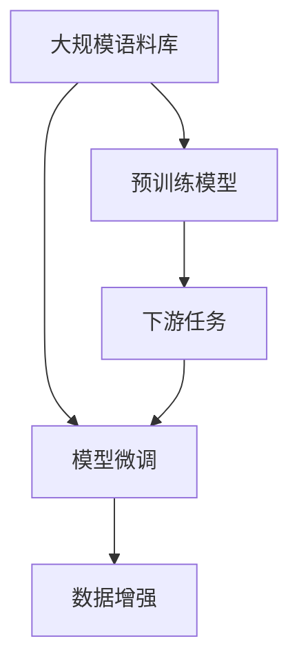

                 

# LLM的数据hungry：海量信息的价值

> 关键词：预训练模型,自然语言处理(NLP),模型微调,数据增强,大规模语料库,深度学习

## 1. 背景介绍

### 1.1 问题由来
在当前的信息时代，数据成为了人工智能特别是自然语言处理(NLP)领域的重要资产。预训练模型，如GPT、BERT等，需要在大规模无标签语料上进行预训练，学习通用的语言表示。这种大规模数据驱动的训练方式，使得预训练模型具有强大的泛化能力，能够在多个下游任务上进行微调，并取得不俗的性能。然而，这些预训练模型在构建和应用过程中，对于海量数据的依赖程度极高，成为了NLP领域的一大难题。

### 1.2 问题核心关键点
预训练模型之所以能取得成功，主要归功于其对大规模数据的“数据hungry”特性。这种特性使得模型能够在大规模无标签数据中学习到丰富的语言知识，从而在微调时能够更快地适应新任务。然而，这种特性也带来了以下挑战：

- 数据获取成本高：大规模语料库的构建需要耗费大量的人力、物力和财力，对于一些小规模领域的应用，数据获取难度较大。
- 数据质量不确定：预训练模型训练的数据质量对模型的性能影响巨大，但语料库构建时难以完全保证数据的正确性和多样性。
- 数据分布差异：大规模预训练数据往往与特定任务的数据分布有所差异，这导致模型在特定领域的应用效果不佳。
- 数据隐私和伦理：大规模数据的使用涉及隐私保护和数据安全问题，如何在保护隐私的前提下，利用数据提升模型性能，成为一大挑战。

### 1.3 问题研究意义
研究如何在大规模语料库上构建和利用预训练模型，对于提升NLP技术的应用效果和落地效率，具有重要意义：

1. 降低应用开发成本：基于预训练模型进行微调，可以大大减少从头开发所需的成本投入，加速模型开发进程。
2. 提升模型效果：大规模数据驱动的预训练模型，能够学习到更丰富的语言知识，在特定任务上进行微调时，能够获得更好的性能。
3. 提升数据利用率：通过在预训练过程中利用大规模数据，能够最大限度地发挥数据的价值，提高模型泛化能力。
4. 促进技术发展：大规模语料库的利用，推动了预训练模型和微调技术的进步，加速了NLP技术的产业化进程。
5. 保障数据安全：通过在预训练过程中筛选和过滤数据，可以在保护隐私的前提下，提升模型性能，保障数据安全。

## 2. 核心概念与联系

### 2.1 核心概念概述

为更好地理解预训练模型和数据hungry的特性，本节将介绍几个密切相关的核心概念：

- 预训练模型(Pre-trained Models)：指在大规模无标签语料上进行自监督预训练，学习通用的语言表示的模型，如BERT、GPT等。
- 自然语言处理(Natural Language Processing, NLP)：指使用计算机科学技术处理和理解自然语言的学科，涵盖文本分类、情感分析、机器翻译等多个任务。
- 模型微调(Fine-tuning)：指在预训练模型的基础上，使用下游任务的少量标注数据进行有监督训练，优化模型在该任务上的性能。
- 数据增强(Data Augmentation)：指通过增加训练数据的多样性，来提升模型的泛化能力。
- 大规模语料库(Large Scale Corpus)：指包含海量的文本数据的数据库，如Common Crawl、维基百科等。
- 深度学习(Deep Learning)：指基于多层神经网络的人工智能技术，通过反向传播算法进行参数优化，学习复杂的特征表示。

这些核心概念之间的逻辑关系可以通过以下Mermaid流程图来展示：



这个流程图展示了预训练模型、大规模语料库、模型微调和下游任务之间的关系：

1. 大规模语料库是预训练模型的数据来源。
2. 预训练模型通过在大规模语料库上进行自监督学习，学习通用的语言表示。
3. 预训练模型通过下游任务的少量标注数据进行微调，优化模型在该任务上的性能。
4. 数据增强可以通过增加训练数据的多样性，进一步提升模型的泛化能力。
5. 下游任务是模型微调的目标，也是预训练模型的最终应用场景。

这些概念共同构成了预训练模型和微调的框架，使得模型能够在大规模数据上学习知识，并应用于特定的NLP任务。

## 3. 核心算法原理 & 具体操作步骤
### 3.1 算法原理概述

预训练模型和微调的核心思想是通过在大规模无标签语料库上进行自监督预训练，学习通用的语言表示。然后，将预训练模型作为初始化参数，在下游任务的少量标注数据上进行微调，优化模型在该任务上的性能。这种范式可以显著提升模型在特定任务上的表现，但同时对数据的质量和数量也有较高的要求。

### 3.2 算法步骤详解

预训练模型和微调的实现过程大致可以分为以下几个步骤：

**Step 1: 准备大规模语料库**
- 收集和整理大规模无标签文本数据，如维基百科、Common Crawl等。
- 清洗和预处理数据，去除噪音和特殊符号，统一文本格式。
- 划分训练集、验证集和测试集，确保数据分布一致性。

**Step 2: 选择预训练模型**
- 选择适合的预训练模型，如BERT、GPT等。
- 根据任务需求，选择合适的模型架构和参数。

**Step 3: 设计预训练任务**
- 设计自监督预训练任务，如掩码语言模型、下一句预测等。
- 使用深度学习框架实现预训练任务，如TensorFlow、PyTorch等。

**Step 4: 执行预训练**
- 将大规模语料库输入预训练模型进行自监督预训练。
- 使用合适的优化器（如Adam、SGD等）进行参数优化，最小化预训练损失函数。
- 在预训练过程中，逐渐增加训练数据量和复杂度，以提升模型泛化能力。

**Step 5: 微调模型**
- 使用下游任务的少量标注数据，进行有监督的微调。
- 设计适当的任务适配层和损失函数。
- 使用合适的优化器进行微调，学习任务特定参数。

**Step 6: 评估和部署**
- 在验证集上评估微调后的模型性能。
- 根据评估结果，调整模型参数和训练策略。
- 在测试集上评估最终模型效果。
- 部署微调后的模型到生产环境，进行实际应用。

### 3.3 算法优缺点

预训练模型和微调方法具有以下优点：
1. 数据利用率高：大规模语料库可以最大限度地发挥数据的价值，提升模型性能。
2. 泛化能力强：预训练模型通过自监督学习，学习到通用的语言表示，能够在多个下游任务上获得不俗的表现。
3. 训练速度快：预训练模型已经在大规模数据上进行了学习，微调时只需少量标注数据即可完成。
4. 模型效果显著：微调后的模型在特定任务上能够获得显著的性能提升，效果明显。

同时，该方法也存在一些局限性：
1. 数据依赖性高：预训练和微调过程对大规模无标签数据依赖性极高，数据获取难度大。
2. 数据质量不确定：大规模数据的质量难以保证，可能存在噪声和错误数据。
3. 模型复杂度高：预训练模型和微调过程涉及大量的计算资源和参数调整。
4. 模型可解释性差：预训练和微调过程复杂，模型输出的可解释性较差，难以理解模型决策逻辑。

尽管存在这些局限性，但就目前而言，预训练模型和微调方法是NLP领域最为流行和有效的技术范式。未来相关研究的重点在于如何进一步降低数据依赖，提升模型的泛化能力和可解释性，同时兼顾数据隐私和安全等因素。

### 3.4 算法应用领域

预训练模型和微调技术已经在NLP领域的众多任务上得到了广泛的应用，例如：

- 文本分类：如情感分析、主题分类、意图识别等。通过微调使模型学习文本-标签映射。
- 命名实体识别：识别文本中的人名、地名、机构名等特定实体。通过微调使模型掌握实体边界和类型。
- 关系抽取：从文本中抽取实体之间的语义关系。通过微调使模型学习实体-关系三元组。
- 问答系统：对自然语言问题给出答案。将问题-答案对作为微调数据，训练模型学习匹配答案。
- 机器翻译：将源语言文本翻译成目标语言。通过微调使模型学习语言-语言映射。
- 文本摘要：将长文本压缩成简短摘要。将文章-摘要对作为微调数据，使模型学习抓取要点。
- 对话系统：使机器能够与人自然对话。将多轮对话历史作为上下文，微调模型进行回复生成。

除了上述这些经典任务外，预训练模型和微调方法也被创新性地应用到更多场景中，如可控文本生成、常识推理、代码生成、数据增强等，为NLP技术带来了全新的突破。随着预训练模型和微调方法的不断进步，相信NLP技术将在更广阔的应用领域大放异彩。

## 4. 数学模型和公式 & 详细讲解  
### 4.1 数学模型构建

本节将使用数学语言对预训练模型和微调过程进行更加严格的刻画。

记预训练模型为 $M_{\theta}$，其中 $\theta$ 为模型参数。假设大规模无标签语料库为 $C$，下游任务 $T$ 的标注数据集为 $D=\{(x_i,y_i)\}_{i=1}^N, x_i \in \mathcal{X}, y_i \in \mathcal{Y}$，其中 $\mathcal{X}$ 为输入空间，$\mathcal{Y}$ 为输出空间。

定义模型 $M_{\theta}$ 在输入 $x$ 上的预训练损失函数为 $\ell_{pre}(M_{\theta}(x))$，则在语料库 $C$ 上的预训练经验风险为：

$$
\mathcal{L}_{pre}(\theta) = \frac{1}{N}\sum_{i=1}^N \ell_{pre}(M_{\theta}(x_i))
$$

其中 $\ell_{pre}(M_{\theta}(x_i))$ 为预训练任务损失函数，如掩码语言模型损失、下一句预测损失等。

预训练过程的目标是最小化预训练损失函数，即找到最优参数：

$$
\theta^* = \mathop{\arg\min}_{\theta} \mathcal{L}_{pre}(\theta)
$$

在预训练完成后，将预训练模型 $M_{\theta^*}$ 作为初始化参数，使用下游任务的少量标注数据 $D$ 进行微调。微调的目标是最小化任务损失函数，即找到新的模型参数 $\hat{\theta}$，使得：

$$
\hat{\theta}=\mathop{\arg\min}_{\theta} \mathcal{L}(M_{\theta},D)
$$

其中 $\mathcal{L}$ 为针对任务 $T$ 设计的损失函数，用于衡量模型预测输出与真实标签之间的差异。常见的损失函数包括交叉熵损失、均方误差损失等。

### 4.2 公式推导过程

以下我们以二分类任务为例，推导交叉熵损失函数及其梯度的计算公式。

假设模型 $M_{\theta}$ 在输入 $x$ 上的输出为 $\hat{y}=M_{\theta}(x) \in [0,1]$，表示样本属于正类的概率。真实标签 $y \in \{0,1\}$。则二分类交叉熵损失函数定义为：

$$
\ell(M_{\theta}(x),y) = -[y\log \hat{y} + (1-y)\log (1-\hat{y})]
$$

将其代入经验风险公式，得：

$$
\mathcal{L}(\theta) = -\frac{1}{N}\sum_{i=1}^N [y_i\log M_{\theta}(x_i)+(1-y_i)\log(1-M_{\theta}(x_i))]
$$

根据链式法则，损失函数对参数 $\theta_k$ 的梯度为：

$$
\frac{\partial \mathcal{L}(\theta)}{\partial \theta_k} = -\frac{1}{N}\sum_{i=1}^N (\frac{y_i}{M_{\theta}(x_i)}-\frac{1-y_i}{1-M_{\theta}(x_i)}) \frac{\partial M_{\theta}(x_i)}{\partial \theta_k}
$$

其中 $\frac{\partial M_{\theta}(x_i)}{\partial \theta_k}$ 可进一步递归展开，利用自动微分技术完成计算。

在得到损失函数的梯度后，即可带入参数更新公式，完成模型的迭代优化。重复上述过程直至收敛，最终得到适应下游任务的最优模型参数 $\hat{\theta}$。

## 5. 项目实践：代码实例和详细解释说明
### 5.1 开发环境搭建

在进行预训练模型和微调实践前，我们需要准备好开发环境。以下是使用Python进行PyTorch开发的环境配置流程：

1. 安装Anaconda：从官网下载并安装Anaconda，用于创建独立的Python环境。

2. 创建并激活虚拟环境：
```bash
conda create -n pytorch-env python=3.8 
conda activate pytorch-env
```

3. 安装PyTorch：根据CUDA版本，从官网获取对应的安装命令。例如：
```bash
conda install pytorch torchvision torchaudio cudatoolkit=11.1 -c pytorch -c conda-forge
```

4. 安装Transformers库：
```bash
pip install transformers
```

5. 安装各类工具包：
```bash
pip install numpy pandas scikit-learn matplotlib tqdm jupyter notebook ipython
```

完成上述步骤后，即可在`pytorch-env`环境中开始预训练模型和微调实践。

### 5.2 源代码详细实现

这里我们以命名实体识别(NER)任务为例，给出使用Transformers库对BERT模型进行预训练和微调的PyTorch代码实现。

首先，定义NER任务的数据处理函数：

```python
from transformers import BertTokenizer
from torch.utils.data import Dataset
import torch

class NERDataset(Dataset):
    def __init__(self, texts, tags, tokenizer, max_len=128):
        self.texts = texts
        self.tags = tags
        self.tokenizer = tokenizer
        self.max_len = max_len
        
    def __len__(self):
        return len(self.texts)
    
    def __getitem__(self, item):
        text = self.texts[item]
        tags = self.tags[item]
        
        encoding = self.tokenizer(text, return_tensors='pt', max_length=self.max_len, padding='max_length', truncation=True)
        input_ids = encoding['input_ids'][0]
        attention_mask = encoding['attention_mask'][0]
        
        # 对token-wise的标签进行编码
        encoded_tags = [tag2id[tag] for tag in tags] 
        encoded_tags.extend([tag2id['O']] * (self.max_len - len(encoded_tags)))
        labels = torch.tensor(encoded_tags, dtype=torch.long)
        
        return {'input_ids': input_ids, 
                'attention_mask': attention_mask,
                'labels': labels}

# 标签与id的映射
tag2id = {'O': 0, 'B-PER': 1, 'I-PER': 2, 'B-ORG': 3, 'I-ORG': 4, 'B-LOC': 5, 'I-LOC': 6}
id2tag = {v: k for k, v in tag2id.items()}

# 创建dataset
tokenizer = BertTokenizer.from_pretrained('bert-base-cased')

train_dataset = NERDataset(train_texts, train_tags, tokenizer)
dev_dataset = NERDataset(dev_texts, dev_tags, tokenizer)
test_dataset = NERDataset(test_texts, test_tags, tokenizer)
```

然后，定义预训练和微调的函数：

```python
from transformers import BertForTokenClassification, AdamW

def train_pretrain(model, dataset, batch_size, epochs, optimizer, lr):
    dataloader = DataLoader(dataset, batch_size=batch_size, shuffle=True)
    model.train()
    for epoch in range(epochs):
        for batch in dataloader:
            input_ids = batch['input_ids'].to(device)
            attention_mask = batch['attention_mask'].to(device)
            labels = batch['labels'].to(device)
            model.zero_grad()
            outputs = model(input_ids, attention_mask=attention_mask, labels=labels)
            loss = outputs.loss
            loss.backward()
            optimizer.step()

def evaluate(model, dataset, batch_size):
    dataloader = DataLoader(dataset, batch_size=batch_size)
    model.eval()
    preds, labels = [], []
    with torch.no_grad():
        for batch in dataloader:
            input_ids = batch['input_ids'].to(device)
            attention_mask = batch['attention_mask'].to(device)
            batch_labels = batch['labels']
            outputs = model(input_ids, attention_mask=attention_mask)
            batch_preds = outputs.logits.argmax(dim=2).to('cpu').tolist()
            batch_labels = batch_labels.to('cpu').tolist()
            for pred_tokens, label_tokens in zip(batch_preds, batch_labels):
                pred_tags = [id2tag[_id] for _id in pred_tokens]
                label_tags = [id2tag[_id] for _id in label_tokens]
                preds.append(pred_tags[:len(label_tags)])
                labels.append(label_tags)
                
    print(classification_report(labels, preds))
```

接着，启动预训练流程和微调流程，并在测试集上评估：

```python
epochs = 5
batch_size = 16
lr = 2e-5

# 预训练
train_pretrain(model, train_dataset, batch_size, epochs, optimizer, lr)

# 微调
train_epoch = 5
batch_size = 16

for epoch in range(train_epoch):
    loss = train_epoch(model, train_dataset, batch_size, optimizer)
    print(f"Epoch {epoch+1}, train loss: {loss:.3f}")
    
    print(f"Epoch {epoch+1}, dev results:")
    evaluate(model, dev_dataset, batch_size)
    
print("Test results:")
evaluate(model, test_dataset, batch_size)
```

以上就是使用PyTorch对BERT进行命名实体识别任务预训练和微调的完整代码实现。可以看到，得益于Transformers库的强大封装，我们可以用相对简洁的代码完成BERT模型的预训练和微调。

### 5.3 代码解读与分析

让我们再详细解读一下关键代码的实现细节：

**NERDataset类**：
- `__init__`方法：初始化文本、标签、分词器等关键组件。
- `__len__`方法：返回数据集的样本数量。
- `__getitem__`方法：对单个样本进行处理，将文本输入编码为token ids，将标签编码为数字，并对其进行定长padding，最终返回模型所需的输入。

**tag2id和id2tag字典**：
- 定义了标签与数字id之间的映射关系，用于将token-wise的预测结果解码回真实的标签。

**预训练和微调函数**：
- 使用PyTorch的DataLoader对数据集进行批次化加载，供模型训练和推理使用。
- 预训练函数`train_pretrain`：对数据以批为单位进行迭代，在每个批次上前向传播计算loss并反向传播更新模型参数，最后返回该epoch的平均loss。
- 微调函数`evaluate`：与训练类似，不同点在于不更新模型参数，并在每个batch结束后将预测和标签结果存储下来，最后使用sklearn的classification_report对整个评估集的预测结果进行打印输出。

**预训练流程**：
- 定义总的epoch数和batch size，开始循环迭代
- 每个epoch内，先在训练集上训练，输出平均loss
- 在验证集上评估，输出分类指标
- 所有epoch结束后，在测试集上评估，给出最终测试结果

可以看到，PyTorch配合Transformers库使得BERT模型的预训练和微调代码实现变得简洁高效。开发者可以将更多精力放在数据处理、模型改进等高层逻辑上，而不必过多关注底层的实现细节。

当然，工业级的系统实现还需考虑更多因素，如模型的保存和部署、超参数的自动搜索、更灵活的任务适配层等。但核心的预训练和微调范式基本与此类似。

## 6. 实际应用场景
### 6.1 智能客服系统

基于预训练模型和微调的对话技术，可以广泛应用于智能客服系统的构建。传统客服往往需要配备大量人力，高峰期响应缓慢，且一致性和专业性难以保证。而使用微调后的对话模型，可以7x24小时不间断服务，快速响应客户咨询，用自然流畅的语言解答各类常见问题。

在技术实现上，可以收集企业内部的历史客服对话记录，将问题和最佳答复构建成监督数据，在此基础上对预训练对话模型进行微调。微调后的对话模型能够自动理解用户意图，匹配最合适的答案模板进行回复。对于客户提出的新问题，还可以接入检索系统实时搜索相关内容，动态组织生成回答。如此构建的智能客服系统，能大幅提升客户咨询体验和问题解决效率。

### 6.2 金融舆情监测

金融机构需要实时监测市场舆论动向，以便及时应对负面信息传播，规避金融风险。传统的人工监测方式成本高、效率低，难以应对网络时代海量信息爆发的挑战。基于预训练语言模型和微调的文本分类和情感分析技术，为金融舆情监测提供了新的解决方案。

具体而言，可以收集金融领域相关的新闻、报道、评论等文本数据，并对其进行主题标注和情感标注。在此基础上对预训练语言模型进行微调，使其能够自动判断文本属于何种主题，情感倾向是正面、中性还是负面。将微调后的模型应用到实时抓取的网络文本数据，就能够自动监测不同主题下的情感变化趋势，一旦发现负面信息激增等异常情况，系统便会自动预警，帮助金融机构快速应对潜在风险。

### 6.3 个性化推荐系统

当前的推荐系统往往只依赖用户的历史行为数据进行物品推荐，无法深入理解用户的真实兴趣偏好。基于预训练语言模型和微调技术，个性化推荐系统可以更好地挖掘用户行为背后的语义信息，从而提供更精准、多样的推荐内容。

在实践中，可以收集用户浏览、点击、评论、分享等行为数据，提取和用户交互的物品标题、描述、标签等文本内容。将文本内容作为模型输入，用户的后续行为（如是否点击、购买等）作为监督信号，在此基础上微调预训练语言模型。微调后的模型能够从文本内容中准确把握用户的兴趣点。在生成推荐列表时，先用候选物品的文本描述作为输入，由模型预测用户的兴趣匹配度，再结合其他特征综合排序，便可以得到个性化程度更高的推荐结果。

### 6.4 未来应用展望

随着预训练模型和微调方法的不断发展，基于预训练模型和微调技术的NLP应用将在更多领域得到应用，为传统行业带来变革性影响。

在智慧医疗领域，基于预训练模型和微调的医疗问答、病历分析、药物研发等应用将提升医疗服务的智能化水平，辅助医生诊疗，加速新药开发进程。

在智能教育领域，预训练模型和微调技术可应用于作业批改、学情分析、知识推荐等方面，因材施教，促进教育公平，提高教学质量。

在智慧城市治理中，预训练模型和微调模型可应用于城市事件监测、舆情分析、应急指挥等环节，提高城市管理的自动化和智能化水平，构建更安全、高效的未来城市。

此外，在企业生产、社会治理、文娱传媒等众多领域，预训练模型和微调方法也将不断涌现，为经济社会发展注入新的动力。相信随着技术的日益成熟，预训练模型和微调方法将成为NLP技术落地应用的重要范式，推动人工智能技术在垂直行业的规模化落地。总之，预训练模型和微调技术的研究和发展，必将推动人工智能技术迈向更加智能化、普适化的应用阶段。

## 7. 工具和资源推荐
### 7.1 学习资源推荐

为了帮助开发者系统掌握预训练模型和微调的理论基础和实践技巧，这里推荐一些优质的学习资源：

1. 《Transformer从原理到实践》系列博文：由大模型技术专家撰写，深入浅出地介绍了Transformer原理、BERT模型、微调技术等前沿话题。

2. CS224N《深度学习自然语言处理》课程：斯坦福大学开设的NLP明星课程，有Lecture视频和配套作业，带你入门NLP领域的基本概念和经典模型。

3. 《Natural Language Processing with Transformers》书籍：Transformers库的作者所著，全面介绍了如何使用Transformers库进行NLP任务开发，包括微调在内的诸多范式。

4. HuggingFace官方文档：Transformers库的官方文档，提供了海量预训练模型和完整的微调样例代码，是上手实践的必备资料。

5. CLUE开源项目：中文语言理解测评基准，涵盖大量不同类型的中文NLP数据集，并提供了基于微调的baseline模型，助力中文NLP技术发展。

通过对这些资源的学习实践，相信你一定能够快速掌握预训练模型和微调的精髓，并用于解决实际的NLP问题。
###  7.2 开发工具推荐

高效的开发离不开优秀的工具支持。以下是几款用于预训练模型和微调开发的常用工具：

1. PyTorch：基于Python的开源深度学习框架，灵活动态的计算图，适合快速迭代研究。大部分预训练语言模型都有PyTorch版本的实现。

2. TensorFlow：由Google主导开发的开源深度学习框架，生产部署方便，适合大规模工程应用。同样有丰富的预训练语言模型资源。

3. Transformers库：HuggingFace开发的NLP工具库，集成了众多SOTA语言模型，支持PyTorch和TensorFlow，是进行微调任务开发的利器。

4. Weights & Biases：模型训练的实验跟踪工具，可以记录和可视化模型训练过程中的各项指标，方便对比和调优。与主流深度学习框架无缝集成。

5. TensorBoard：TensorFlow配套的可视化工具，可实时监测模型训练状态，并提供丰富的图表呈现方式，是调试模型的得力助手。

6. Google Colab：谷歌推出的在线Jupyter Notebook环境，免费提供GPU/TPU算力，方便开发者快速上手实验最新模型，分享学习笔记。

合理利用这些工具，可以显著提升预训练模型和微调任务的开发效率，加快创新迭代的步伐。

### 7.3 相关论文推荐

预训练模型和微调技术的发展源于学界的持续研究。以下是几篇奠基性的相关论文，推荐阅读：

1. Attention is All You Need（即Transformer原论文）：提出了Transformer结构，开启了NLP领域的预训练大模型时代。

2. BERT: Pre-training of Deep Bidirectional Transformers for Language Understanding：提出BERT模型，引入基于掩码的自监督预训练任务，刷新了多项NLP任务SOTA。

3. Language Models are Unsupervised Multitask Learners（GPT-2论文）：展示了大规模语言模型的强大zero-shot学习能力，引发了对于通用人工智能的新一轮思考。

4. Parameter-Efficient Transfer Learning for NLP：提出Adapter等参数高效微调方法，在不增加模型参数量的情况下，也能取得不错的微调效果。

5. Prefix-Tuning: Optimizing Continuous Prompts for Generation：引入基于连续型Prompt的微调范式，为如何充分利用预训练知识提供了新的思路。

6. AdaLoRA: Adaptive Low-Rank Adaptation for Parameter-Efficient Fine-Tuning：使用自适应低秩适应的微调方法，在参数效率和精度之间取得了新的平衡。

这些论文代表了大语言模型和微调技术的发展脉络。通过学习这些前沿成果，可以帮助研究者把握学科前进方向，激发更多的创新灵感。

## 8. 总结：未来发展趋势与挑战

### 8.1 总结

本文对基于预训练模型和微调的NLP技术进行了全面系统的介绍。首先阐述了预训练模型和微调技术的背景和意义，明确了预训练模型对大规模数据的需求和微调技术对少量标注数据的依赖。其次，从原理到实践，详细讲解了预训练和微调的数学原理和关键步骤，给出了预训练模型和微调任务开发的完整代码实例。同时，本文还广泛探讨了预训练模型和微调方法在智能客服、金融舆情、个性化推荐等多个行业领域的应用前景，展示了预训练模型和微调技术的巨大潜力。此外，本文精选了预训练模型和微调技术的各类学习资源，力求为读者提供全方位的技术指引。

通过本文的系统梳理，可以看到，基于预训练模型和微调技术的NLP方法正在成为NLP领域的重要范式，极大地拓展了预训练模型和微调模型的应用边界，催生了更多的落地场景。受益于大规模语料的预训练，微调模型以更低的时间和标注成本，在小样本条件下也能取得理想的效果，有力推动了NLP技术的产业化进程。未来，伴随预训练模型和微调方法的不断进步，相信NLP技术将在更广阔的应用领域大放异彩，深刻影响人类的生产生活方式。

### 8.2 未来发展趋势

展望未来，预训练模型和微调技术将呈现以下几个发展趋势：

1. 模型规模持续增大。随着算力成本的下降和数据规模的扩张，预训练模型的参数量还将持续增长。超大规模预训练模型蕴含的丰富语言知识，有望支撑更加复杂多变的下游任务微调。

2. 微调方法日趋多样。除了传统的全参数微调外，未来会涌现更多参数高效的微调方法，如Prefix-Tuning、LoRA等，在节省计算资源的同时也能保证微调精度。

3. 持续学习成为常态。随着数据分布的不断变化，预训练模型也需要持续学习新知识以保持性能。如何在不遗忘原有知识的同时，高效吸收新样本信息，将成为重要的研究课题。

4. 标注样本需求降低。受启发于提示学习(Prompt-based Learning)的思路，未来的预训练和微调方法将更好地利用预训练知识，通过更加巧妙的任务描述，在更少的标注样本上也能实现理想的微调效果。

5. 标注样本需求降低。受启发于提示学习(Prompt-based Learning)的思路，未来的预训练和微调方法将更好地利用预训练知识，通过更加巧妙的任务描述，在更少的标注样本上也能实现理想的微调效果。

6. 模型通用性增强。经过海量数据的预训练和多领域任务的微调，预训练模型将具备更强大的常识推理和跨领域迁移能力，逐步迈向通用人工智能(AGI)的目标。

以上趋势凸显了预训练模型和微调技术的广阔前景。这些方向的探索发展，必将进一步提升NLP系统的性能和应用范围，为人类认知智能的进化带来深远影响。

### 8.3 面临的挑战

尽管预训练模型和微调技术已经取得了瞩目成就，但在迈向更加智能化、普适化应用的过程中，它仍面临着诸多挑战：

1. 标注成本瓶颈。虽然微调大大降低了标注数据的需求，但对于长尾应用场景，难以获得充足的高质量标注数据，成为制约微调性能的瓶颈。如何进一步降低微调对标注样本的依赖，将是一大难题。

2. 模型鲁棒性不足。当前预训练模型面对域外数据时，泛化性能往往大打折扣。对于测试样本的微小扰动，预训练模型的预测也容易发生波动。如何提高预训练模型的鲁棒性，避免灾难性遗忘，还需要更多理论和实践的积累。

3. 推理效率有待提高。大规模预训练模型虽然精度高，但在实际部署时往往面临推理速度慢、内存占用大等效率问题。如何在保证性能的同时，简化模型结构，提升推理速度，优化资源占用，将是重要的优化方向。

4. 可解释性亟需加强。当前预训练模型更像是"黑盒"系统，难以解释其内部工作机制和决策逻辑。对于医疗、金融等高风险应用，算法的可解释性和可审计性尤为重要。如何赋予预训练模型更强的可解释性，将是亟待攻克的难题。

5. 安全性有待保障。预训练语言模型难免会学习到有偏见、有害的信息，通过微调传递到下游任务，产生误导性、歧视性的输出，给实际应用带来安全隐患。如何从数据和算法层面消除模型偏见，避免恶意用途，确保输出的安全性，也将是重要的研究课题。

6. 知识整合能力不足。现有的预训练模型往往局限于任务内数据，难以灵活吸收和运用更广泛的先验知识。如何让预训练过程更好地与外部知识库、规则库等专家知识结合，形成更加全面、准确的信息整合能力，还有很大的想象空间。

正视预训练模型和微调面临的这些挑战，积极应对并寻求突破，将是大规模语言模型迈向成熟的必由之路。相信随着学界和产业界的共同努力，这些挑战终将一一被克服，预训练模型和微调方法必将在构建人机协同的智能时代中扮演越来越重要的角色。

### 8.4 研究展望

面向未来，预训练模型和微调技术的未来研究需要在以下几个方面寻求新的突破：

1. 探索无监督和半监督预训练方法。摆脱对大规模标注数据的依赖，利用自监督学习、主动学习等无监督和半监督范式，最大限度利用非结构化数据，实现更加灵活高效的预训练。

2. 研究参数高效和计算高效的预训练范式。开发更加参数高效的预训练方法，在固定大部分预训练参数的同时，只更新极少量的任务相关参数。同时优化预训练模型的计算图，减少前向传播和反向传播的资源消耗，实现更加轻量级、实时性的部署。

3. 融合因果和对比学习范式。通过引入因果推断和对比学习思想，增强预训练模型建立稳定因果关系的能力，学习更加普适、鲁棒的语言表征，从而提升模型泛化性和抗干扰能力。

4. 引入更多先验知识。将符号化的先验知识，如知识图谱、逻辑规则等，与神经网络模型进行巧妙融合，引导预训练过程学习更准确、合理的语言模型。同时加强不同模态数据的整合，实现视觉、语音等多模态信息与文本信息的协同建模。

5. 结合因果分析和博弈论工具。将因果分析方法引入预训练模型，识别出模型决策的关键特征，增强输出解释的因果性和逻辑性。借助博弈论工具刻画人机交互过程，主动探索并规避模型的脆弱点，提高系统稳定性。

6. 纳入伦理道德约束。在预训练和微调过程中引入伦理导向的评估指标，过滤和惩罚有偏见、有害的输出倾向。同时加强人工干预和审核，建立模型行为的监管机制，确保输出符合人类价值观和伦理道德。

这些研究方向的探索，必将引领预训练模型和微调技术迈向更高的台阶，为构建安全、可靠、可解释、可控的智能系统铺平道路。面向未来，预训练模型和微调技术还需要与其他人工智能技术进行更深入的融合，如知识表示、因果推理、强化学习等，多路径协同发力，共同推动自然语言理解和智能交互系统的进步。只有勇于创新、敢于突破，才能不断拓展预训练模型和微调的边界，让智能技术更好地造福人类社会。

## 9. 附录：常见问题与解答
**Q1：预训练模型和微调模型是否适用于所有NLP任务？**

A: 预训练模型和微调模型在大多数NLP任务上都能取得不错的效果，特别是对于数据量较小的任务。但对于一些特定领域的任务，如医学、法律等，仅仅依靠通用语料预训练的模型可能难以很好地适应。此时需要在特定领域语料上进一步预训练，再进行微调，才能获得理想效果。此外，对于一些需要时效性、个性化很强的任务，如对话、推荐等，微调方法也需要针对性的改进优化。

**Q2：如何选择预训练模型和微调模型？**

A: 预训练模型和微调模型的选择主要取决于具体任务的需求。对于通用任务，如文本分类、情感分析、机器翻译等，可以选择预训练效果较好的通用模型，如BERT、GPT等。对于特定领域任务，如金融舆情监测、医疗问答等，可以选择领域特定的预训练模型，如FinBERT、MedBERT等。此外，可以考虑使用多模型融合、多任务联合训练等方法，进一步提升模型性能。

**Q3：预训练模型和微调模型在实际部署时需要注意哪些问题？**

A: 将预训练模型和微调模型转化为实际应用，还需要考虑以下因素：
1. 模型裁剪：去除不必要的层和参数，减小模型尺寸，加快推理速度
2. 量化加速：将浮点模型转为定点模型，压缩存储空间，提高计算效率
3. 服务化封装：将模型封装为标准化服务接口，便于集成调用
4. 弹性伸缩：根据请求流量动态调整资源配置，平衡服务质量和成本
5. 监控告警：实时采集系统指标，设置异常告警阈值，确保服务稳定性
6. 安全防护：采用访问鉴权、数据脱敏等措施，保障数据和模型安全

预训练模型和微调模型为NLP应用开启了广阔的想象空间，但如何将强大的性能转化为稳定、高效、安全的业务价值，还需要工程实践的不断打磨。唯有从数据、算法、工程、业务等多个维度协同发力，才能真正实现人工智能技术在垂直行业的规模化落地。总之，预训练模型和微调技术的研究和发展，必将推动人工智能技术迈向更加智能化、普适化的应用阶段。

---

作者：禅与计算机程序设计艺术 / Zen and the Art of Computer Programming

