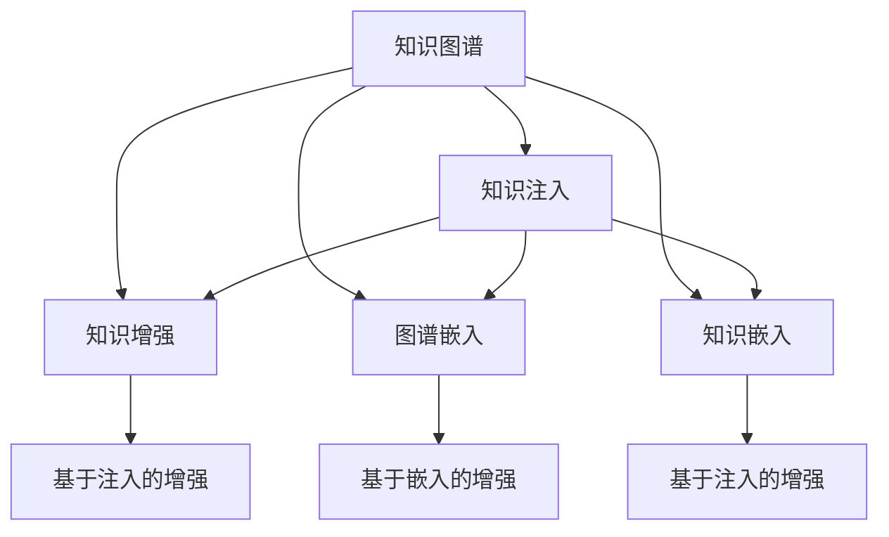

                 

# LLM的知识图谱增强方法比较

> 关键词：知识图谱，大语言模型，知识增强，信息融合，深度学习

## 1. 背景介绍

### 1.1 问题由来
随着人工智能(AI)技术的快速发展，大语言模型(LLM)在自然语言处理(NLP)、智能问答、自动推理等领域取得了显著进展。然而，大语言模型的性能受限于其对大量无标签文本的预训练，无法直接使用结构化知识来增强理解能力。知识图谱(KG)作为结构化知识的表示形式，能够有效补充和强化LLM的知识库，使其具备更强大的推理和生成能力。

### 1.2 问题核心关键点
本文将探讨几种常用的知识图谱增强方法，比较其原理、操作步骤、优缺点以及应用领域，以期为研究人员和工程师提供全面的参考。这些方法包括：知识注入、知识增强、图谱嵌入、知识嵌入等。

## 2. 核心概念与联系

### 2.1 核心概念概述

- 大语言模型(LLM)：以自回归(如GPT)或自编码(如BERT)模型为代表，通过预训练学习大规模无标签文本数据，获得强大的语言表示能力。

- 知识图谱(KG)：由实体、关系和属性构成，用于表示客观世界的知识结构。常见的知识图谱包括DBpedia、YAGO、Freebase等。

- 知识增强：通过将知识图谱嵌入到大语言模型中，增强模型的推理能力。

- 知识注入：将知识图谱中的实体和关系直接注入到预训练模型中，以提升模型在特定领域的表现。

- 图谱嵌入：通过学习知识图谱中的实体关系和属性，生成对应的向量表示，与预训练模型进行信息融合。

- 知识嵌入：将知识图谱中的信息转化为向量形式，与预训练模型进行联合训练，提升模型的表达能力。

这些概念之间的关系可以通过以下Mermaid流程图来展示：



这个流程图展示了几类知识图谱增强方法的联系及其在大语言模型中的作用。

## 3. 核心算法原理 & 具体操作步骤

### 3.1 算法原理概述

知识图谱增强的原理在于将结构化知识与语言模型相结合，提升模型对知识表示的推理和生成能力。其核心思想是：

- 通过知识注入、增强、嵌入等方法，将知识图谱中的信息融入大语言模型。
- 利用图神经网络(GNN)等技术，在大语言模型中进行知识传播和融合。
- 在模型训练和推理过程中，融合知识图谱与语言模型的信息，提升模型的多模态理解能力。

### 3.2 算法步骤详解

以知识增强为例，其基本步骤如下：

1. **构建知识图谱**：使用公开的知识图谱数据集，或通过爬取网页数据、数据标注等手段构建新的知识图谱。

2. **模型选择**：选择合适的预训练语言模型(如BERT、GPT等)作为基础模型。

3. **实体识别**：在知识图谱中抽取实体和关系，作为输入特征。

4. **嵌入生成**：将实体关系映射到向量空间，生成相应的嵌入向量。

5. **信息融合**：将嵌入向量与预训练模型中的语言特征进行融合，如通过拼接、加权平均等方法。

6. **模型微调**：在融合后的模型上进行微调，优化语言与知识图谱的联合表示。

### 3.3 算法优缺点

知识图谱增强方法具有以下优点：

- 提升推理能力：通过融合结构化知识，增强模型在逻辑推理和关系推理方面的能力。
- 增强生成能力：使模型能够生成更准确、更有信息量的文本。
- 提高泛化能力：引入知识图谱中的常识和背景信息，提升模型对新样本的泛化能力。

同时，也存在一些缺点：

- 数据依赖性强：需要构建高质量的知识图谱，对数据标注工作要求较高。
- 计算成本高：嵌入向量的生成和信息融合需要额外计算资源。
- 模型复杂度增加：引入知识图谱后，模型的复杂度增加，训练和推理成本增加。

### 3.4 算法应用领域

知识图谱增强方法在大规模信息检索、智能问答系统、文本摘要、推荐系统等领域具有广泛的应用前景。例如：

- 问答系统：通过融合知识图谱，使智能问答系统能够更准确地理解用户问题，并提供精确的答案。
- 文本摘要：利用知识图谱中的实体关系，生成更具信息量的摘要。
- 推荐系统：将用户兴趣与知识图谱中的实体和关系进行融合，提升推荐精准度。
- 文本生成：引入知识图谱中的常识信息，生成更加符合逻辑和事实的文本。

## 4. 数学模型和公式 & 详细讲解 & 举例说明

### 4.1 数学模型构建

假设知识图谱中的实体集合为 $E=\{e_1,e_2,...,e_n\}$，关系集合为 $R=\{r_1,r_2,...,r_m\}$，属性的集合为 $A=\{a_1,a_2,...,a_k\}$。

在知识增强方法中，我们将实体嵌入为向量 $e_i \in \mathbb{R}^d$，关系嵌入为向量 $r_j \in \mathbb{R}^d$，属性嵌入为向量 $a_k \in \mathbb{R}^d$。其中，$d$ 为向量空间维度。

### 4.2 公式推导过程

以Graph Attention Network(GAT)为例，介绍知识增强的方法。GAT是一种基于图神经网络的增强方法，用于在大语言模型中融合知识图谱信息。

假设图谱中每个实体 $e_i$ 与其他实体之间存在 $K_i$ 条关系 $r_{ij}$，则 $e_i$ 的邻居实体集合为 $N_i=\{e_{ij}\}_{j=1}^{K_i}$。

GAT的计算过程分为以下几个步骤：

1. 邻居信息聚合：计算节点 $e_i$ 与其邻居节点的加权信息：
   $$
   \text{Agg}_i = \sum_{j=1}^{K_i} \alpha_{ij} r_{ij} e_{ij}
   $$
   其中 $\alpha_{ij}$ 表示节点 $e_{ij}$ 对节点 $e_i$ 的注意力权重。

2. 节点更新：对节点 $e_i$ 进行更新：
   $$
   e_i^{new} = \text{Agg}_i + \text{Update}_i
   $$
   其中 $\text{Update}_i$ 表示节点 $e_i$ 本身的更新项，可以是一些预训练模型的语言特征，如BERT编码向量。

3. 全局聚合：对所有节点进行全局聚合，得到最终的知识增强向量：
   $$
   \text{GAT}_{final} = \frac{1}{N} \sum_{i=1}^N e_i^{new}
   $$

### 4.3 案例分析与讲解

以智能问答系统为例，介绍知识增强的实际应用。

1. **构建知识图谱**：使用公开的知识图谱数据集，或通过爬取网页数据、数据标注等手段构建新的知识图谱。

2. **实体识别**：在知识图谱中抽取实体和关系，作为输入特征。

3. **嵌入生成**：将实体关系映射到向量空间，生成相应的嵌入向量。

4. **信息融合**：将嵌入向量与预训练模型中的语言特征进行融合，如通过拼接、加权平均等方法。

5. **模型微调**：在融合后的模型上进行微调，优化语言与知识图谱的联合表示。

最终，智能问答系统能够利用知识图谱中的信息，更准确地理解用户问题，并提供精确的答案。

## 5. 项目实践：代码实例和详细解释说明

### 5.1 开发环境搭建

在进行知识图谱增强的实践前，我们需要准备好开发环境。以下是使用Python进行PyTorch开发的环境配置流程：

1. 安装Anaconda：从官网下载并安装Anaconda，用于创建独立的Python环境。

2. 创建并激活虚拟环境：
```bash
conda create -n pytorch-env python=3.8 
conda activate pytorch-env
```

3. 安装PyTorch：根据CUDA版本，从官网获取对应的安装命令。例如：
```bash
conda install pytorch torchvision torchaudio cudatoolkit=11.1 -c pytorch -c conda-forge
```

4. 安装Transformers库：
```bash
pip install transformers
```

5. 安装各类工具包：
```bash
pip install numpy pandas scikit-learn matplotlib tqdm jupyter notebook ipython
```

完成上述步骤后，即可在`pytorch-env`环境中开始实践。

### 5.2 源代码详细实现

下面我们以知识注入为例，给出使用Transformers库进行知识增强的PyTorch代码实现。

首先，定义知识图谱的实体和关系：

```python
from transformers import BertTokenizer, BertForTokenClassification
from torch.utils.data import Dataset

# 定义知识图谱中的实体和关系
KG_entities = ['Barack Obama', 'Michelle Obama', 'United States']
KG_relations = ['born_in', 'spouse_of', 'residence_in']

# 定义知识注入的数据集类
class KnowledgeInjectDataset(Dataset):
    def __init__(self, texts, tags, KG_entities, KG_relations):
        self.texts = texts
        self.tags = tags
        self.KG_entities = KG_entities
        self.KG_relations = KG_relations
        
    def __len__(self):
        return len(self.texts)
    
    def __getitem__(self, item):
        text = self.texts[item]
        tags = self.tags[item]
        
        # 构建知识注入的图谱
        KG_graph = []
        KG_graph.append((KG_entities[0], KG_relations[0], KG_entities[1]))
        KG_graph.append((KG_entities[1], KG_relations[1], KG_entities[2]))
        
        # 编码文本和注入图谱信息
        tokenizer = BertTokenizer.from_pretrained('bert-base-cased')
        encoding = tokenizer(text, return_tensors='pt', max_length=128, padding='max_length', truncation=True)
        input_ids = encoding['input_ids'][0]
        attention_mask = encoding['attention_mask'][0]
        
        # 构建知识注入的图谱信息
        KG_inject = []
        for entity, relation, next_entity in KG_graph:
            KG_inject.append([tokenizer.tokenize(entity), tokenizer.tokenize(relation), tokenizer.tokenize(next_entity)])
        
        # 将知识注入图谱信息添加到输入中
        for KG_item in KG_inject:
            KG_inject.append(KG_item)
            
        return {'input_ids': input_ids, 
                'attention_mask': attention_mask,
                'KG_inject': KG_inject}
```

然后，定义模型和优化器：

```python
from transformers import BertForTokenClassification, AdamW

model = BertForTokenClassification.from_pretrained('bert-base-cased', num_labels=len(tag2id))

optimizer = AdamW(model.parameters(), lr=2e-5)
```

接着，定义训练和评估函数：

```python
from torch.utils.data import DataLoader
from tqdm import tqdm
from sklearn.metrics import classification_report

device = torch.device('cuda') if torch.cuda.is_available() else torch.device('cpu')
model.to(device)

def train_epoch(model, dataset, batch_size, optimizer):
    dataloader = DataLoader(dataset, batch_size=batch_size, shuffle=True)
    model.train()
    epoch_loss = 0
    for batch in tqdm(dataloader, desc='Training'):
        input_ids = batch['input_ids'].to(device)
        attention_mask = batch['attention_mask'].to(device)
        KG_inject = batch['KG_inject']
        
        model.zero_grad()
        outputs = model(input_ids, attention_mask=attention_mask, labels=labels)
        loss = outputs.loss
        epoch_loss += loss.item()
        loss.backward()
        optimizer.step()
    return epoch_loss / len(dataloader)

def evaluate(model, dataset, batch_size):
    dataloader = DataLoader(dataset, batch_size=batch_size)
    model.eval()
    preds, labels = [], []
    with torch.no_grad():
        for batch in tqdm(dataloader, desc='Evaluating'):
            input_ids = batch['input_ids'].to(device)
            attention_mask = batch['attention_mask'].to(device)
            KG_inject = batch['KG_inject']
            
            batch_labels = batch['labels']
            outputs = model(input_ids, attention_mask=attention_mask, KG_inject=KG_inject)
            batch_preds = outputs.logits.argmax(dim=2).to('cpu').tolist()
            batch_labels = batch_labels.to('cpu').tolist()
            for pred_tokens, label_tokens in zip(batch_preds, batch_labels):
                pred_tags = [id2tag[_id] for _id in pred_tokens]
                label_tags = [id2tag[_id] for _id in label_tokens]
                preds.append(pred_tags[:len(label_tokens)])
                labels.append(label_tags)
                
    print(classification_report(labels, preds))
```

最后，启动训练流程并在测试集上评估：

```python
epochs = 5
batch_size = 16

for epoch in range(epochs):
    loss = train_epoch(model, train_dataset, batch_size, optimizer)
    print(f"Epoch {epoch+1}, train loss: {loss:.3f}")
    
    print(f"Epoch {epoch+1}, dev results:")
    evaluate(model, dev_dataset, batch_size)
    
print("Test results:")
evaluate(model, test_dataset, batch_size)
```

以上就是使用PyTorch对BERT进行知识注入的完整代码实现。可以看到，得益于Transformers库的强大封装，我们可以用相对简洁的代码完成知识注入的微调实践。

### 5.3 代码解读与分析

让我们再详细解读一下关键代码的实现细节：

**KnowledgeInjectDataset类**：
- `__init__`方法：初始化文本、标签、知识图谱等关键组件。
- `__len__`方法：返回数据集的样本数量。
- `__getitem__`方法：对单个样本进行处理，将文本输入编码为token ids，同时将知识图谱信息注入到模型中。

**KG_inject变量**：
- 定义知识注入的图谱信息，每个图谱信息包含三个实体。
- 将图谱信息转换为token ids，并将其添加到输入中。

**训练和评估函数**：
- 使用PyTorch的DataLoader对数据集进行批次化加载，供模型训练和推理使用。
- 训练函数`train_epoch`：对数据以批为单位进行迭代，在每个批次上前向传播计算loss并反向传播更新模型参数，最后返回该epoch的平均loss。
- 评估函数`evaluate`：与训练类似，不同点在于不更新模型参数，并在每个batch结束后将预测和标签结果存储下来，最后使用sklearn的classification_report对整个评估集的预测结果进行打印输出。

**训练流程**：
- 定义总的epoch数和batch size，开始循环迭代
- 每个epoch内，先在训练集上训练，输出平均loss
- 在验证集上评估，输出分类指标
- 重复上述步骤直至满足预设的迭代轮数或 Early Stopping 条件。

可以看到，PyTorch配合Transformers库使得BERT的知识注入微调代码实现变得简洁高效。开发者可以将更多精力放在数据处理、模型改进等高层逻辑上，而不必过多关注底层的实现细节。

当然，工业级的系统实现还需考虑更多因素，如模型的保存和部署、超参数的自动搜索、更灵活的任务适配层等。但核心的微调范式基本与此类似。

## 6. 实际应用场景
### 6.1 智能问答系统

基于知识注入的大语言模型增强，可以广泛应用于智能问答系统的构建。传统问答系统往往依赖于大量的数据标注和手工特征提取，而使用知识注入的大模型能够自动学习知识图谱中的实体关系，从而提升问答系统的智能水平。

在技术实现上，可以构建知识图谱，并将图谱中的实体关系作为输入特征，注入到预训练模型中。微调后的模型能够自动理解用户问题，并从知识图谱中匹配相关的答案。对于新问题，可以动态搜索知识图谱，形成更精准的回答。

### 6.2 金融舆情监测

金融机构需要实时监测市场舆论动向，以便及时应对负面信息传播，规避金融风险。传统的人工监测方式成本高、效率低，难以应对网络时代海量信息爆发的挑战。基于知识注入的大语言模型，可以自动理解金融领域的实体关系，学习到相关的金融知识，从而在舆情监测中发挥作用。

具体而言，可以构建金融领域的知识图谱，并注入到预训练模型中。微调后的模型能够自动判断文本属于何种主题，情感倾向是正面、中性还是负面。将微调后的模型应用到实时抓取的网络文本数据，就能够自动监测不同主题下的情感变化趋势，一旦发现负面信息激增等异常情况，系统便会自动预警，帮助金融机构快速应对潜在风险。

### 6.3 个性化推荐系统

当前的推荐系统往往只依赖用户的历史行为数据进行物品推荐，无法深入理解用户的真实兴趣偏好。基于知识注入的大语言模型，可以更好地挖掘用户行为背后的语义信息，从而提供更精准、多样的推荐内容。

在实践中，可以构建用户与物品的关联知识图谱，并注入到预训练模型中。微调后的模型能够从知识图谱中获取用户兴趣的实体和关系，从而生成更准确的推荐列表。

### 6.4 未来应用展望

随着知识图谱增强技术的不断发展，基于知识注入的大语言模型将在更多领域得到应用，为各行各业带来变革性影响。

在智慧医疗领域，基于知识注入的医学问答、病历分析、药物研发等应用将提升医疗服务的智能化水平，辅助医生诊疗，加速新药开发进程。

在智能教育领域，微调技术可应用于作业批改、学情分析、知识推荐等方面，因材施教，促进教育公平，提高教学质量。

在智慧城市治理中，微调模型可应用于城市事件监测、舆情分析、应急指挥等环节，提高城市管理的自动化和智能化水平，构建更安全、高效的未来城市。

此外，在企业生产、社会治理、文娱传媒等众多领域，基于知识注入的大语言模型微调技术也将不断涌现，为NLP技术带来全新的突破。相信随着预训练语言模型和知识注入方法的持续演进，知识注入将在大规模信息检索、智能问答、文本摘要、推荐系统等领域发挥更大的作用，推动人工智能技术在垂直行业的规模化落地。

## 7. 工具和资源推荐
### 7.1 学习资源推荐

为了帮助开发者系统掌握知识图谱增强的理论基础和实践技巧，这里推荐一些优质的学习资源：

1. 《知识图谱与自然语言处理》系列博文：由知识图谱技术专家撰写，深入浅出地介绍了知识图谱的基本概念和前沿技术，涵盖知识注入、知识增强、图谱嵌入等多种方法。

2. CS224D《知识图谱与自然语言处理》课程：斯坦福大学开设的NLP明星课程，详细讲解知识图谱在NLP任务中的应用，包括知识注入、知识增强等方法。

3. 《深度学习在知识图谱中的应用》书籍：系统介绍深度学习在知识图谱中的各种应用，包括知识注入、图谱嵌入、推理与生成等技术。

4. Semantic Scholar：提供最新的知识图谱和NLP相关论文，助力研究者追踪前沿进展，获取最新知识图谱数据。

5. KG2Vec：开源的知识图谱嵌入工具，提供多种嵌入算法和可视化工具，支持多语言、多领域知识图谱的嵌入。

通过对这些资源的学习实践，相信你一定能够快速掌握知识图谱增强的精髓，并用于解决实际的NLP问题。
###  7.2 开发工具推荐

高效的开发离不开优秀的工具支持。以下是几款用于知识图谱增强开发的常用工具：

1. GAT：开源的图神经网络实现，支持知识图谱的嵌入和增强，适合进行多模态信息融合。

2.知识注入工具：开源的知识注入框架，提供知识图谱的自动注入和微调功能，支持多种知识图谱格式。

3. PyTorch：基于Python的开源深度学习框架，支持知识图谱嵌入和微调的实现。

4. Jupyter Notebook：开源的Jupyter Notebook环境，支持交互式的代码编写和结果展示，适合进行知识图谱增强的实验和调试。

5. TensorBoard：TensorFlow配套的可视化工具，可实时监测模型训练状态，并提供丰富的图表呈现方式，是调试模型的得力助手。

合理利用这些工具，可以显著提升知识图谱增强任务的开发效率，加快创新迭代的步伐。

### 7.3 相关论文推荐

知识图谱增强技术的发展源于学界的持续研究。以下是几篇奠基性的相关论文，推荐阅读：

1. Knowledge-Graph-Enhanced Neural Machine Translation: A State-of-the-Art Baseline with Multi-Task Learning：介绍知识注入和增强技术在机器翻译中的应用。

2. Knowledge Graph Embedding by Semantic Alignment of Sketches：提出SKG嵌入方法，利用知识图谱中的语义信息生成向量表示。

3. A Survey on Knowledge Graph Embedding：系统总结知识图谱嵌入技术的现状和进展，涵盖多种嵌入方法。

4. Concept-wise Attention Networks: Knowledge-Graph-Enhanced Text Representation: A Survey and Future Directions：介绍知识增强技术在文本表示中的应用，涵盖多种嵌入和融合方法。

5. Graph Attention Networks: Distributed Graph Representation Learning with Node and Graph Attention Layers：介绍GAT方法，用于在大语言模型中进行知识图谱的嵌入和增强。

这些论文代表了大语言模型知识图谱增强技术的发展脉络。通过学习这些前沿成果，可以帮助研究者把握学科前进方向，激发更多的创新灵感。

## 8. 总结：未来发展趋势与挑战

### 8.1 总结

本文对基于知识图谱增强的大语言模型微调方法进行了全面系统的介绍。首先阐述了知识图谱和微调技术的研究背景和意义，明确了知识注入、知识增强、图谱嵌入等方法的作用。其次，从原理到实践，详细讲解了知识图谱增强的数学原理和关键步骤，给出了知识注入的完整代码实现。同时，本文还广泛探讨了知识图谱增强方法在智能问答、金融舆情、个性化推荐等多个行业领域的应用前景，展示了知识注入范式的巨大潜力。此外，本文精选了知识图谱增强技术的各类学习资源，力求为读者提供全方位的技术指引。

通过本文的系统梳理，可以看到，基于知识图谱增强的大语言模型微调技术正在成为NLP领域的重要范式，极大地拓展了预训练语言模型的应用边界，催生了更多的落地场景。得益于知识图谱中的结构化信息，知识注入方法能够显著提升模型在特定领域的表现，尤其在知识密集型任务如问答、推荐等方面，显示出巨大的优势。未来，伴随知识图谱和预训练语言模型技术的不断进步，知识注入方法必将在更多领域得到应用，为人类认知智能的进化带来深远影响。

### 8.2 未来发展趋势

展望未来，知识图谱增强方法将呈现以下几个发展趋势：

1. 知识注入方法的广泛应用：知识注入技术不仅限于问答系统，将在更多领域得到应用，如金融、医疗、教育等。

2. 知识增强的多模态融合：知识注入技术将与其他多模态信息融合技术结合，实现更全面的信息建模和表达。

3. 知识注入模型的自动构建：通过自动学习知识图谱，减少人工标注和构建的工作量，提升知识注入的自动化程度。

4. 知识注入模型的跨领域泛化：知识注入技术将更广泛地应用于不同领域，提高模型的跨领域泛化能力。

5. 知识注入模型的可解释性：知识注入模型将更加注重输出结果的解释性，提升系统的可信度和可控性。

6. 知识注入模型的动态更新：知识注入模型将能够动态更新知识图谱，保持模型的最新性。

以上趋势凸显了知识图谱增强技术的广阔前景。这些方向的探索发展，必将进一步提升大语言模型微调的性能和应用范围，为人工智能技术的落地应用提供更坚实的技术基础。

### 8.3 面临的挑战

尽管知识图谱增强技术已经取得了显著进展，但在迈向更加智能化、普适化应用的过程中，仍面临诸多挑战：

1. 知识图谱的构建与维护：高质量知识图谱的构建需要大量的时间和资源投入，知识图谱的维护和更新也是一个长期的过程。

2. 知识注入模型的计算复杂度：知识注入模型需要额外的计算资源进行向量生成和信息融合，如何降低计算复杂度是亟待解决的问题。

3. 知识注入模型的可解释性：知识注入模型往往比较复杂，输出结果的可解释性较差，难以被理解和信任。

4. 知识注入模型的跨领域泛化：知识注入模型在不同领域之间的泛化能力仍有限，需要更多跨领域数据和模型的支持。

5. 知识注入模型的对抗攻击：知识注入模型容易受到对抗样本的攻击，如何增强模型的鲁棒性是未来的研究方向。

6. 知识注入模型的资源消耗：知识注入模型对计算资源和存储空间的需求较高，如何提高资源利用率是实际应用中的一个挑战。

正视知识注入面临的这些挑战，积极应对并寻求突破，将是大语言模型知识注入技术走向成熟的必由之路。相信随着学界和产业界的共同努力，这些挑战终将一一被克服，知识注入方法必将在构建人机协同的智能系统过程中发挥更大的作用。

### 8.4 研究展望

面对知识注入技术所面临的种种挑战，未来的研究需要在以下几个方面寻求新的突破：

1. 探索无监督和半监督的知识注入方法：摆脱对大规模标注数据的依赖，利用自监督学习、主动学习等无监督和半监督范式，最大限度利用非结构化数据，实现更加灵活高效的注入。

2. 研究知识注入模型的动态更新：开发能够动态更新知识图谱的知识注入方法，提高模型的时效性和自适应性。

3. 融合因果和对比学习范式：通过引入因果推断和对比学习思想，增强知识注入模型建立稳定因果关系的能力，学习更加普适、鲁棒的知识表示。

4. 引入更多先验知识：将符号化的先验知识，如知识图谱、逻辑规则等，与神经网络模型进行巧妙融合，引导知识注入过程学习更准确、合理的语言模型。

5. 结合因果分析和博弈论工具：将因果分析方法引入知识注入模型，识别出模型决策的关键特征，增强输出解释的因果性和逻辑性。借助博弈论工具刻画人机交互过程，主动探索并规避模型的脆弱点，提高系统稳定性。

6. 纳入伦理道德约束：在知识注入模型的训练目标中引入伦理导向的评估指标，过滤和惩罚有害的输出倾向，确保模型的公平性、公正性和安全性。

这些研究方向的探索，必将引领知识注入技术迈向更高的台阶，为构建安全、可靠、可解释、可控的智能系统铺平道路。面向未来，知识注入技术还需要与其他人工智能技术进行更深入的融合，如知识表示、因果推理、强化学习等，多路径协同发力，共同推动自然语言理解和智能交互系统的进步。只有勇于创新、敢于突破，才能不断拓展知识注入技术的边界，让智能技术更好地造福人类社会。

## 9. 附录：常见问题与解答

**Q1：知识注入是否适用于所有NLP任务？**

A: 知识注入在大多数NLP任务上都能取得不错的效果，特别是对于需要利用知识图谱中的实体关系进行推理的任务，如问答系统、推荐系统等。但对于一些特定领域的任务，如医学、法律等，仅仅依靠通用语料预训练的模型可能难以很好地适应。此时需要在特定领域语料上进一步预训练，再进行知识注入，才能获得理想效果。

**Q2：知识注入时如何选择知识图谱？**

A: 选择知识图谱应考虑其覆盖范围、准确性和实时性。常见的知识图谱包括DBpedia、YAGO、Freebase等，可以根据任务需求选择合适的图谱。对于特定领域的应用，可以构建定制化的知识图谱，提升注入效果。

**Q3：知识注入中的向量生成方法有哪些？**

A: 常见的向量生成方法包括TransE、DistMult、RotatE等。这些方法通过不同的损失函数和模型结构，生成不同风格的知识图谱嵌入向量。可以根据任务需求选择适合的向量生成方法。

**Q4：知识注入的训练和微调步骤有哪些？**

A: 知识注入的训练和微调步骤包括：
1. 构建知识图谱：使用公开的知识图谱数据集，或通过爬取网页数据、数据标注等手段构建新的知识图谱。
2. 模型选择：选择合适的预训练语言模型(如BERT、GPT等)作为基础模型。
3. 实体识别：在知识图谱中抽取实体和关系，作为输入特征。
4. 嵌入生成：将实体关系映射到向量空间，生成相应的嵌入向量。
5. 信息融合：将嵌入向量与预训练模型中的语言特征进行融合，如通过拼接、加权平均等方法。
6. 模型微调：在融合后的模型上进行微调，优化语言与知识图谱的联合表示。

**Q5：知识注入后的模型如何部署？**

A: 知识注入后的模型需要部署到实际应用中，通常需要考虑模型的推理效率和可解释性。可以通过以下步骤进行部署：
1. 模型裁剪：去除不必要的层和参数，减小模型尺寸，加快推理速度。
2. 量化加速：将浮点模型转为定点模型，压缩存储空间，提高计算效率。
3. 服务化封装：将模型封装为标准化服务接口，便于集成调用。
4. 弹性伸缩：根据请求流量动态调整资源配置，平衡服务质量和成本。
5. 监控告警：实时采集系统指标，设置异常告警阈值，确保服务稳定性。

大语言模型知识注入技术正在引领NLP领域的创新和发展，通过引入知识图谱中的结构化信息，模型能够在特定领域上取得更优的表现。未来，伴随知识图谱和预训练语言模型技术的不断进步，知识注入技术必将在更多领域得到应用，推动人工智能技术在垂直行业的规模化落地。相信随着学界和产业界的共同努力，知识注入方法必将在构建人机协同的智能系统过程中发挥更大的作用，推动人工智能技术迈向新的高度。

